# 识别城市区域的热点

> 原文：[`towardsdatascience.com/identifying-topical-hot-spots-in-urban-areas-3c47cde5ae10`](https://towardsdatascience.com/identifying-topical-hot-spots-in-urban-areas-3c47cde5ae10)

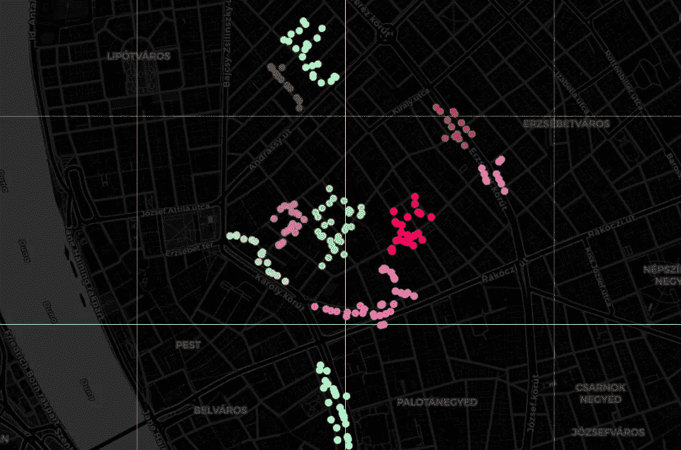

布达佩斯的时髦热点。

## 一个通用框架，使用 OpenStreetMap 和 DBSCAN 空间聚类来捕捉最受热捧的城市区域

[](https://medium.com/@janosovm?source=post_page-----3c47cde5ae10--------------------------------)[](https://towardsdatascience.com/?source=post_page-----3c47cde5ae10--------------------------------) [米兰·亚诺索夫](https://medium.com/@janosovm?source=post_page-----3c47cde5ae10--------------------------------)

·发表于[数据科学前沿](https://towardsdatascience.com/?source=post_page-----3c47cde5ae10--------------------------------) ·9 分钟阅读·2023 年 10 月 16 日

--

在这篇文章中，我展示了一种快速且易于使用的方法，能够基于从[OpenStreeetMap](https://help.openstreetmap.org/questions/64731/place-type-categories)（[OSM](https://help.openstreetmap.org/questions/64731/place-type-categories)）收集的兴趣点（POI）来识别特定兴趣的热点，使用了 sklearn 的[DBSCAN](https://scikit-learn.org/stable/modules/generated/sklearn.cluster.DBSCAN.html)算法。首先，我将收集一些我在 ChatGPT 上找到的属于几个类别的 POI 的原始数据，并假设这些数据具有所谓的时髦生活方式的特征（例如，咖啡馆、酒吧、市场、瑜伽馆）；将这些数据转换为便捷的 GeoDataFrame 后，我进行地理空间聚类，最后，根据不同城市功能在每个聚类中的混合程度来评估结果。

尽管我所称之为“时髦”的主题和与之相关的 POI 类别在某种程度上是随意的，但它们可以很容易地被其他主题和类别替代——自动热点检测方法保持不变。这种易于采用的方法的优势包括从识别支持创新规划的本地[创新中心](https://scholar.google.com/citations?view_op=view_citation&hl=en&user=5_ep83MAAAAJ&citation_for_view=5_ep83MAAAAJ%3AWF5omc3nYNoC)到检测支持城市规划倡议的城市次中心、评估企业的不同市场机会、分析房地产投资机会或捕捉旅游热点。

*所有图像均由作者创建。*

# 1\. 从 OSM 获取数据

首先，我获取目标城市的行政多边形。由于布达佩斯是我的家乡，为了方便（现场）验证，我使用了它。然而，由于我仅使用了[OSM](https://www.openstreetmap.org/copyright)的全球数据库，这些步骤可以很容易地应用于 OSM 覆盖的世界其他任何地方。特别是，我使用 OSMNx 包以非常简单的方式获取行政边界。

```py
import osmnx as ox # version: 1.0.1

city = 'Budapest'
admin = ox.geocode_to_gdf(city)
admin.plot()
```

这个代码块的结果：

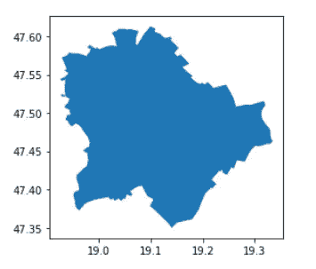

布达佩斯的行政边界。

现在，使用 OverPass API 下载在布达佩斯行政边界的边界框内的 POI。在 amenity_mapping 列表中，我编制了一个与嬉皮士生活方式相关的 POI 类别列表。我还必须在此说明，这是一种模糊的、非专业的分类方法，使用这里介绍的方法，任何人都可以相应地更新类别列表。此外，还可以结合其他包含更精细多层次分类的 POI 数据源，以便更准确地描述给定主题。换句话说，这个列表可以根据你的需要进行任何方式的修改——从更好地覆盖嬉皮士相关内容到将这个练习重新调整到任何其他主题分类（例如，食品广场、购物区、旅游热点等）。

注意：由于[OverPass](https://wiki.openstreetmap.org/wiki/Overpass_API)下载器返回的是边界框内的所有结果，在这个代码块的末尾，我使用 GeoPandas 的叠加功能过滤掉那些在行政边界之外的 POI。

```py
import overpy # version: 0.6
from shapely.geometry import Point # version: 1.7.1
import geopandas as gpd # version: 0.9.0

# start the api
api = overpy.Overpass()

# get the enclosing bounding box
minx, miny, maxx, maxy = admin.to_crs(4326).bounds.T[0]
bbox = ','.join([str(miny), str(minx), str(maxy), str(maxx)])

# define the OSM categories of interest
amenity_mapping = [
    ("amenity", "cafe"),
    ("tourism", "gallery"),
    ("amenity", "pub"),
    ("amenity", "bar"),
    ("amenity", "marketplace"),
    ("sport", "yoga"),
    ("amenity", "studio"),
    ("shop", "music"),
    ("shop", "second_hand"),
    ("amenity", "foodtruck"),
    ("amenity", "music_venue"),
    ("shop", "books"),
]

# iterate over all categories, call the overpass api, 
# and add the results to the poi_data list
poi_data  = []

for idx, (amenity_cat, amenity) in enumerate(amenity_mapping):
    query = f"""node"{amenity_cat}"="{amenity}";out;"""
    result = api.query(query)
    print(amenity, len(result.nodes))

    for node in result.nodes:
        data = {}
        name = node.tags.get('name', 'N/A')
        data['name'] = name
        data['amenity'] = amenity_cat + '__' + amenity
        data['geometry'] = Point(node.lon, node.lat)
        poi_data.append(data)

# transform the results into a geodataframe
gdf_poi = gpd.GeoDataFrame(poi_data)
print(len(gdf_poi))
gdf_poi = gpd.overlay(gdf_poi, admin[['geometry']])
gdf_poi.crs = 4326
print(len(gdf_poi))
```

这个代码块的结果是每个下载的 POI 类别的频率分布：

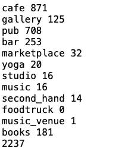

每个下载的 POI 类别的频率分布。

# 2\. 可视化 POI 数据

现在，可视化所有 2101 个 POI：

```py
import matplotlib.pyplot as plt
f, ax = plt.subplots(1,1,figsize=(10,10))
admin.plot(ax=ax, color = 'none', edgecolor = 'k', linewidth = 2)
gdf_poi.plot(column = 'amenity', ax=ax, legend = True, alpha = 0.3)
```

这个代码单元的结果：

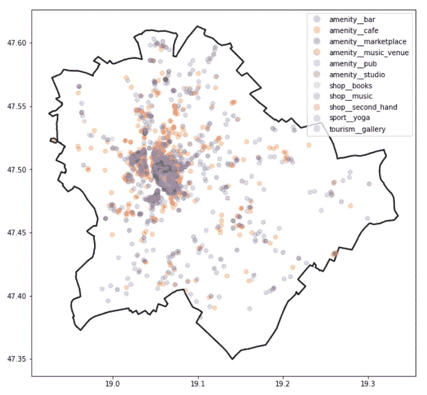

布达佩斯所有下载的 POI 按其类别标记。

这个图表相当难以解释——除了市中心非常拥挤之外，所以我们使用一个交互式可视化工具，[Folium](https://python-visualization.github.io/folium/latest/)。

```py
import folium
import branca.colormap as cm

# get the centroid of the city and set up the map
x, y = admin.geometry.to_list()[0].centroid.xy
m = folium.Map(location=[y[0], x[0]], zoom_start=12, tiles='CartoDB Dark_Matter')
colors = ['blue', 'green', 'red', 'purple', 'orange', 'pink', 'gray', 'cyan', 'magenta', 'yellow', 'lightblue', 'lime']

# transform the gdf_poi
amenity_colors = {}
unique_amenities = gdf_poi['amenity'].unique()
for i, amenity in enumerate(unique_amenities):
    amenity_colors[amenity] = colors[i % len(colors)]

# visualize the pois with a scatter plot
for idx, row in gdf_poi.iterrows():
    amenity = row['amenity']
    lat = row['geometry'].y
    lon = row['geometry'].x
    color = amenity_colors.get(amenity, 'gray')  # default to gray if not in the colormap

    folium.CircleMarker(
        location=[lat, lon],
        radius=3,  
        color=color,
        fill=True,
        fill_color=color,
        fill_opacity=1.0,  # No transparency for dot markers
        popup=amenity,
    ).add_to(m)

# show the map
m
```

该地图的默认视图（你可以通过调整 zoom_start=12 参数轻松更改）：

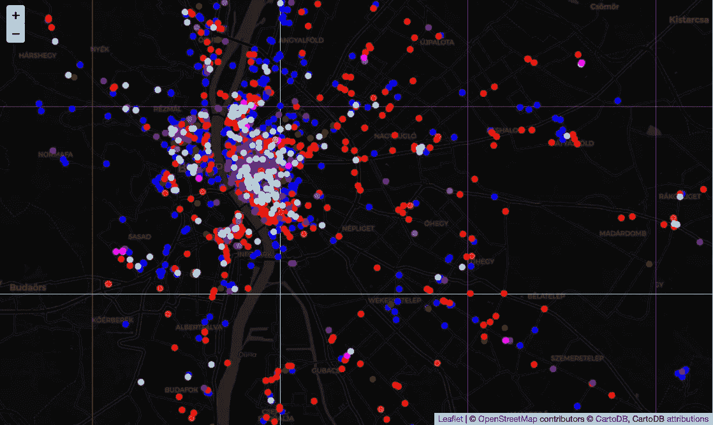

布达佩斯所有下载的 POI 按其类别标记——交互版本，第一次缩放设置。

然后，可以更改缩放参数并重新绘制地图，或使用鼠标简单地放大：

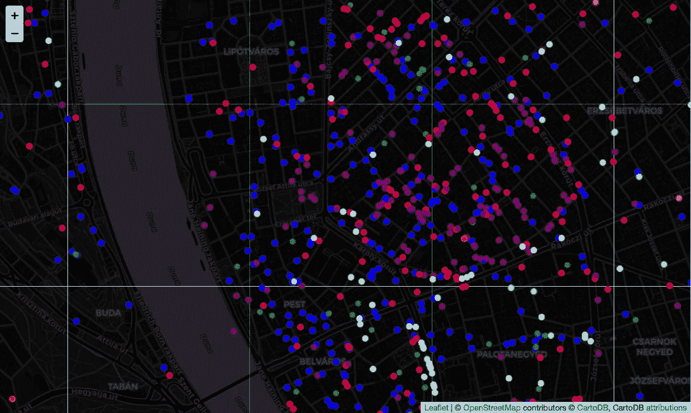

布达佩斯所有下载的 POI 按其类别标记——交互版本，第二次缩放设置。

或者完全缩小：

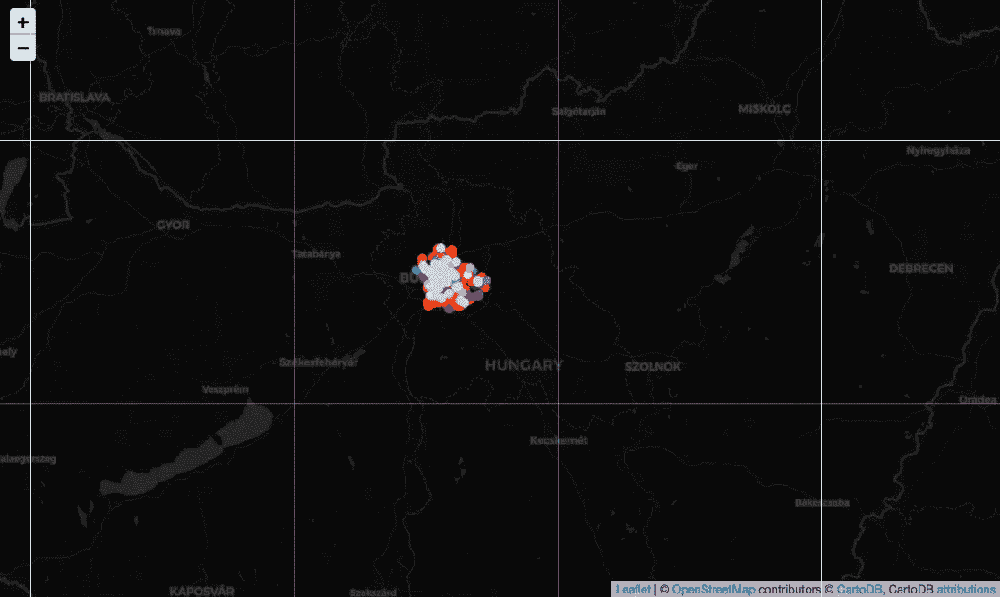

布达佩斯所有下载的 POI 按其类别标记——交互版本，第三次缩放设置。

# 3\. 空间聚类

现在我已经手头有了所有必要的 POI，我使用 DBSCAN 算法，首先编写一个函数来处理 POI 并进行簇分析。我只会微调 [DBSCAN](https://scikit-learn.org/stable/modules/generated/sklearn.cluster.DBSCAN.html) 的 *eps* 参数，它本质上量化了簇的特征大小，即要分组在一起的 POI 之间的距离。此外，我将几何图形转换为本地 CRS（EPSG:23700）以使用国际单位制。更多关于 CRS 转换的信息 [在这里](https://medium.com/@janosovm/the-world-map-with-many-faces-map-projections-f58a210ff2f7)。

```py
from sklearn.cluster import DBSCAN # version: 0.24.1
from collections import Counter

# do the clusteirng
def apply_dbscan_clustering(gdf_poi, eps):

    feature_matrix = gdf_poi['geometry'].apply(lambda geom: (geom.x, geom.y)).tolist()
    dbscan = DBSCAN(eps=eps, min_samples=1)  # You can adjust min_samples as needed
    cluster_labels = dbscan.fit_predict(feature_matrix)
    gdf_poi['cluster_id'] = cluster_labels

    return gdf_poi

# transforming to local crs
gdf_poi_filt = gdf_poi.to_crs(23700)    

# do the clustering
eps_value = 50  
clustered_gdf_poi = apply_dbscan_clustering(gdf_poi_filt, eps_value)

# Print the GeoDataFrame with cluster IDs
print('Number of clusters found: ', len(set(clustered_gdf_poi.cluster_id)))
clustered_gdf_poi
```

该单元格的结果：

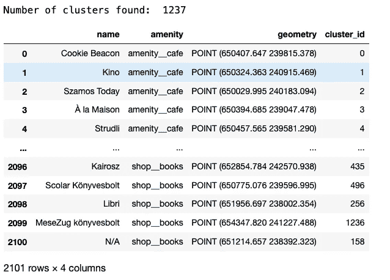

在 POI GeoDataFrame 中预览，每个 POI 按其簇 ID 标记。

总共有 1237 个簇——如果我们只是看舒适的 hipster 热点，这似乎有点太多了。让我们查看它们的大小分布，然后选择一个大小阈值——将一个只有两个 POI 的簇称为热点可能不太靠谱。

```py
clusters = clustered_gdf_poi.cluster_id.to_list()
clusters_cnt = Counter(clusters).most_common()

f, ax = plt.subplots(1,1,figsize=(8,4))
ax.hist([cnt for c, cnt in clusters_cnt], bins = 20)
ax.set_yscale('log')
ax.set_xlabel('Cluster size', fontsize = 14)
ax.set_ylabel('Number of clusters', fontsize = 14)
```

该单元格的结果：

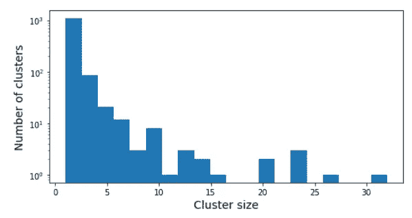

簇大小分布。

根据直方图中的差距，让我们保留至少有 10 个兴趣点（POI）的簇！目前，这是一个足够简单的工作假设。然而，这也可以通过更复杂的方式来处理，例如，通过考虑不同类型的 POI 或覆盖的地理区域。

```py
to_keep = [c for c, cnt in Counter(clusters).most_common() if cnt>9]
clustered_gdf_poi = clustered_gdf_poi[clustered_gdf_poi.cluster_id.isin(to_keep)]
clustered_gdf_poi = clustered_gdf_poi.to_crs(4326)
len(to_keep)
```

这个片段显示有 15 个簇满足过滤条件。

一旦我们有了 15 个真实的 hipster 簇，将它们放在地图上：

```py
import folium
import random

# get the centroid of the city and set up the map
min_longitude, min_latitude, max_longitude, max_latitude = clustered_gdf_poi.total_bounds
m = folium.Map(location=[(min_latitude+max_latitude)/2, (min_longitude+max_longitude)/2], zoom_start=14, tiles='CartoDB Dark_Matter')

# get unique, random colors for each cluster
unique_clusters = clustered_gdf_poi['cluster_id'].unique()
cluster_colors = {cluster: "#{:02x}{:02x}{:02x}".format(random.randint(0, 255), random.randint(0, 255), random.randint(0, 255)) for cluster in unique_clusters}

# visualize the pois
for idx, row in clustered_gdf_poi.iterrows():
    lat = row['geometry'].y
    lon = row['geometry'].x
    cluster_id = row['cluster_id']
    color = cluster_colors[cluster_id]

    # create a dot marker 
    folium.CircleMarker(
        location=[lat, lon],
        radius=3, 
        color=color,
        fill=True,
        fill_color=color,
        fill_opacity=0.9,  
        popup=row['amenity'], 
    ).add_to(m)

# show the map
m
```

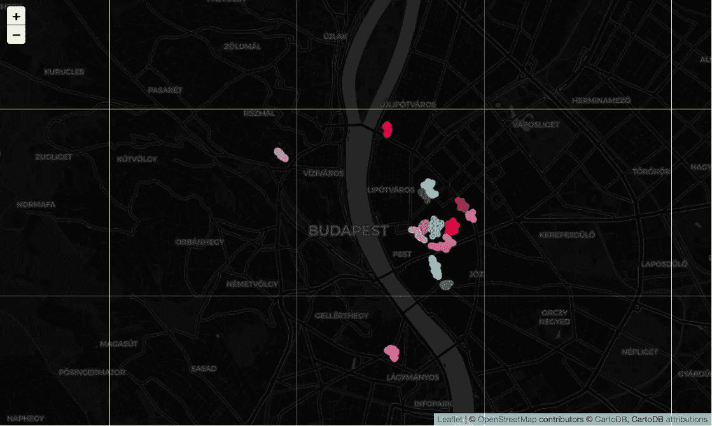

Hipster POI 簇 — 第一级缩放。

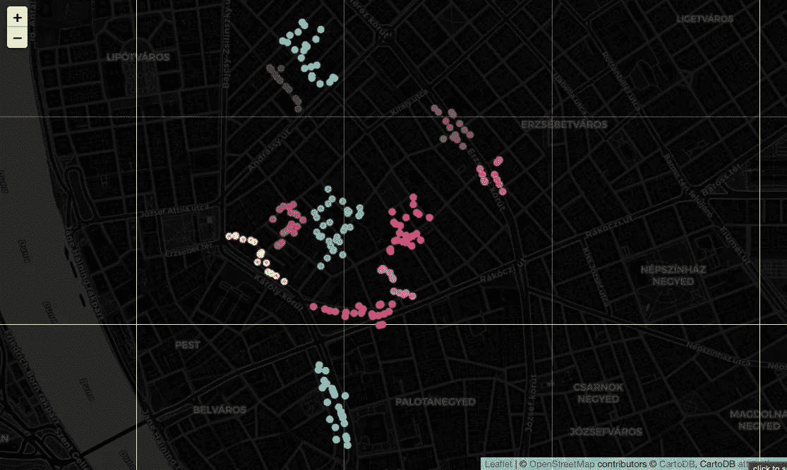

Hipster POI 簇 — 第二级缩放。

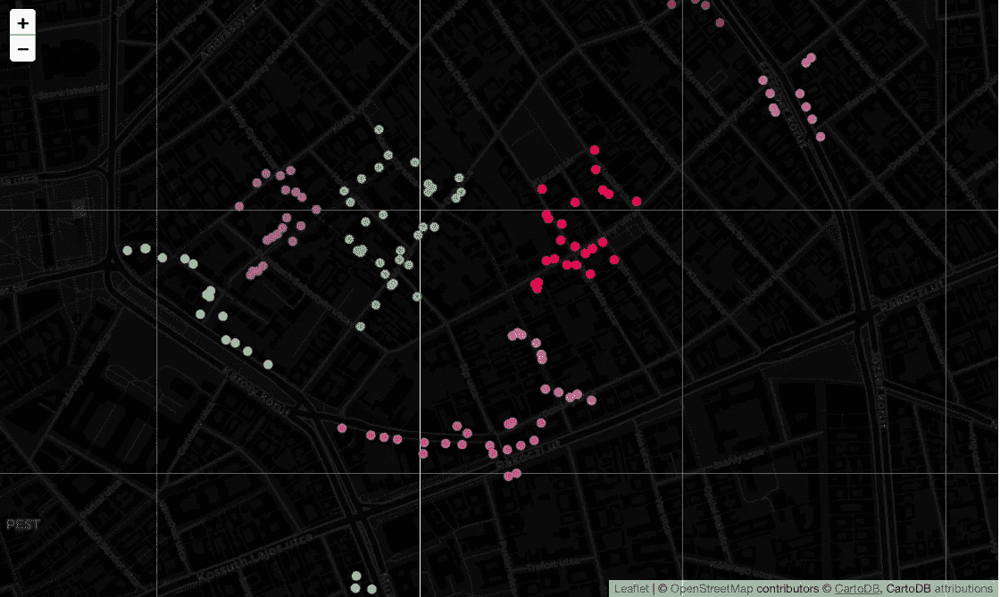

Hipster POI 簇 — 第三级缩放。

# 4\. 比较簇

每个簇都算作一个别致的 hipster 簇——然而，它们都必须以某种方式独特，对吧？让我们通过比较它们所提供的 POI 类别组合来看看它们有多独特。

首先，追求多样性，并通过计算每个簇中 POI 类别的熵来衡量它们的多样性/变化性。

```py
import math
import pandas as pd

def get_entropy_score(tags):
    tag_counts = {}
    total_tags = len(tags)
    for tag in tags:
        if tag in tag_counts:
            tag_counts[tag] += 1
        else:
            tag_counts[tag] = 1

    tag_probabilities = [count / total_tags for count in tag_counts.values()]
    shannon_entropy = -sum(p * math.log(p) for p in tag_probabilities)
    return shannon_entropy

# create a dict where each cluster has its own list of amenitiy
clusters_amenities = clustered_gdf_poi.groupby(by = 'cluster_id')['amenity'].apply(list).to_dict()

# compute and store the entropy scores
entropy_data = []
for cluster, amenities in clusters_amenities.items():
    E = get_entropy_score(amenities)
    entropy_data.append({'cluster' : cluster, 'size' :len(amenities), 'entropy' : E})

# add the entropy scores to a dataframe
entropy_data = pd.DataFrame(entropy_data)
entropy_data
```

该单元格的结果：

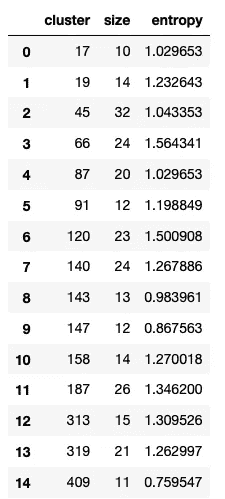

每个簇基于其 POI 配置文件的多样性（熵）。

以及对该表的快速相关性分析：

```py
entropy_data.corr()
```

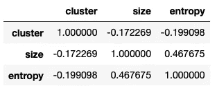

簇特征之间的相关性。

在计算聚类 ID、聚类大小和聚类熵之间的相关性后，发现大小和熵之间有显著的相关性；然而，这远未解释所有的多样性。显然，确实有些热点比其他热点更具多样性——而其他热点则相对更专业。它们专注于什么？我将通过比较每个聚类的 POI 档案与每个 POI 类型在聚类中的总体分布，并挑选出与平均水平相比最典型的三个 POI 类别来回答这个问题。

```py
# packing the poi profiles into dictionaries
clusters = sorted(list(set(clustered_gdf_poi.cluster_id)))
amenity_profile_all = dict(Counter(clustered_gdf_poi.amenity).most_common())
amenity_profile_all = {k : v / sum(amenity_profile_all.values()) for k, v in amenity_profile_all.items()}

# computing the relative frequency of each category
# and keeping only the above-average (>1) and top 3 candidates
clusters_top_profile = {}
for cluster in clusters:

    amenity_profile_cls = dict(Counter(clustered_gdf_poi[clustered_gdf_poi.cluster_id == cluster].amenity).most_common() )
    amenity_profile_cls = {k : v / sum(amenity_profile_cls.values()) for k, v in amenity_profile_cls.items()}

    clusters_top_amenities = []
    for a, cnt in amenity_profile_cls.items():
        ratio = cnt / amenity_profile_all[a]
        if ratio>1: clusters_top_amenities.append((a, ratio))
        clusters_top_amenities = sorted(clusters_top_amenities, key=lambda tup: tup[1], reverse=True)
        clusters_top_amenities = clusters_top_amenities[0:min([3,len(clusters_top_amenities)])]

    clusters_top_profile[cluster] = [c[0] for c in clusters_top_amenities]

# print, for each cluster, its top categories:
for cluster, top_amenities in clusters_top_profile.items():
    print(cluster, top_amenities)
```

该代码块的结果：

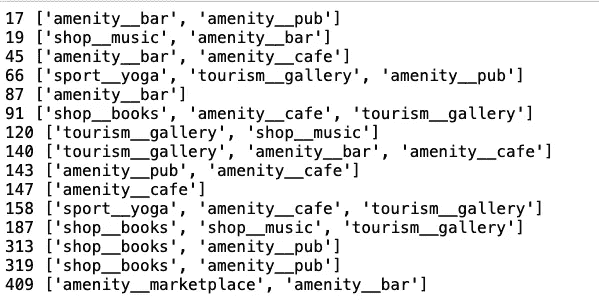

每个聚类的独特设施指纹。

顶级类别描述已经显示出一些趋势。例如，聚类 17 显然是用于饮酒的，而 19 也混合了音乐，可能还有派对。聚类 91 包含书店、画廊和咖啡馆，显然是白天放松的地方，而聚类 120，则有音乐和画廊，可以是任何酒吧巡游的绝佳热身。从分布中，我们也可以看到，跳进酒吧总是合适的（或者，根据使用情况，我们应该根据类别频率考虑进一步的规范化）！

# 结论

作为本地居民，我可以确认这些聚类非常合理，并且尽管方法简单，但很好地代表了期望的城市功能组合。当然，这只是一个快速的试点，可以通过多种方式进行丰富和改进，例如：

+   依赖于更详细的 POI 分类和选择

+   在进行聚类时考虑 POI 类别（语义聚类）

+   通过社交媒体评论和评分等方式丰富 POI 信息
