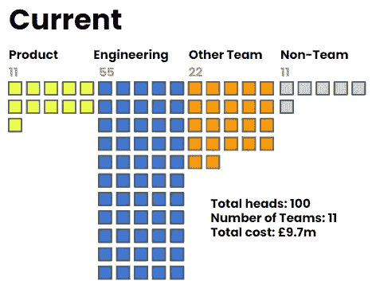
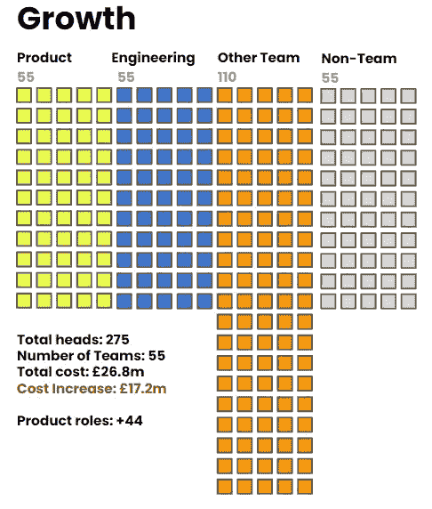
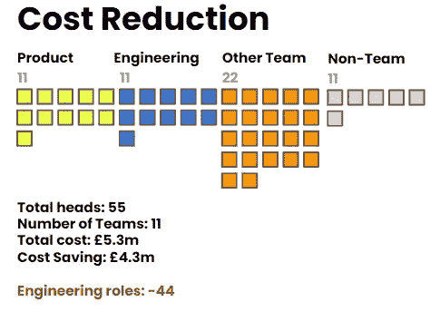
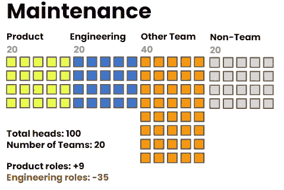
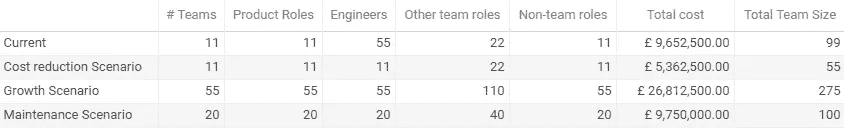

# 如果 AI 编码工具减少了我们需要的工程师数量，我们该如何支配预算？

> 原文：[`towardsdatascience.com/if-ai-coding-tools-reduce-the-number-of-engineers-we-need-where-do-we-spend-our-budgets-abd6248ad833`](https://towardsdatascience.com/if-ai-coding-tools-reduce-the-number-of-engineers-we-need-where-do-we-spend-our-budgets-abd6248ad833)

作者使用 Midjourney 生成的图片

## AI 对产品工程团队的影响 — 第四部分

 [Mark Ridley](https://mark-ridley.medium.com/?source=post_page-----abd6248ad833--------------------------------)

·发表于[Towards Data Science](https://towardsdatascience.com/?source=post_page-----abd6248ad833--------------------------------) ·9 分钟阅读·2023 年 7 月 28 日

--

*这是一个六部分系列的第四部分，调查了像 Github Copilot、ChatGPT 和 Amazon CodeWhisperer 这样的生成性 AI 生产力工具如何影响整个产品工程团队的结构。*

在[第三部分](https://mark-ridley.medium.com/if-engineers-start-to-use-ai-coding-tools-what-happens-to-our-product-teams-acd55fb273dd)，我们探讨了：

1.  生成性 AI 工具如何潜在颠覆长期以来的 5 名工程师对 1 名产品经理的比例。

1.  像 Github Copilot 和 AWS Amplify Studio 这样的工具如何重新塑造产品开发，将工程师的焦点从手动编码转向设计、架构和集成。

1.  生成性 AI 工具如何帮助面临技术过时问题的团队，轻松处理复杂的移植和重构工作。

1.  AI 工具对移动和网页应用开发的潜在统一影响，减少重复工作并弥合网页、Android 和 iOS 开发之间的技能差距。

1.  编码自动化对初级开发人员和工程进步的影响

# 我们的新组织将是什么样的？

LLMs 已经改变了游戏，并让我们接触到了生成性 AI——尽管麦肯锡的预测存在，但它们现在至少可以给人“*应用专业知识*”的印象。与虚拟现实和 Web 3.0 的虚假承诺不同，生成性 AI 工具有大规模、有意义的机会改变我们的工作，并且在这一时代变革中会有赢家和输家。

尽管[美国经济的近期积极迹象](https://www.ft.com/content/f3a4cd40-4b9d-4bb8-802a-1bf61cff726d)以及微软、谷歌和 Meta 的强劲盈利回归令人振奋，[全球经济中的通胀关联的犹豫](https://www.ft.com/content/440068b1-4c39-4ad9-94ee-2d54a1097fb2)可能会影响人们对这一机会的反应。如果我们回到 2023 年之前的繁荣时期，大多数公司会把当前情况视为一个增长机会，受到了过去五年疯狂投资泡沫和科技估值的影响。

但我们现在处于一个不同的世界。对于那些没有关注风险投资惨淡状况的人来说，[2023 年第一季度的融资较 2022 年第一季度下降了 53%](https://news.crunchbase.com/venture/global-vc-funding-falls-q1-2023/)。在金融科技融资方面，情况更为严峻，2023 年第二季度的融资[环比下降 48%](https://www.cbinsights.com/research/report/fintech-trends-q2-2023/)，这是自 2017 年以来未曾见过的水平。风险投资的繁荣已经彻底结束（除非你碰巧是一家真正的、诚实的深科技 AI 公司，这里还有另一场疯狂的[淘金热](https://www.ft.com/content/0cbe91ec-0971-4ba6-bdf1-87855aedd34c)）。

更加严峻的宏观经济条件，导致我今年所接触的几乎每一家初创公司都削减了任何可自由支配的开支以应对经济下行，这意味着对许多公司来说，生成式 AI 编码工具所带来的机会将被视为一种生存选择，以保护现金和运营资金。

对于那些财务状况更健康的公司而言，这一机会可能使他们能够在保持或增长产品工程预算之间做出选择，但需要重新调整团队以适应新的现实。

# 让我们来玩一场游戏

作为一个思想实验，让我们接受本系列前面部分的推理，假设这些新工具确实可以将工程比例从 5:1 转变为 1:1。

[*另一个提醒，我不认为这一点* ***会*** *发生，但我相信它* ***可能*** *发生，考虑到如果真的发生了，其影响是有用的*]

让我们看看如果将 1:1 比例映射到三种不同的情景中会发生什么：首先，一家公司手头充裕，拥有投资于增长的现金，并且不想失去任何有才华的工程师。其次，一家公司面临财务限制，选择保持相同数量的团队和产出，但通过减少工程人员来利用可观的成本节省。最后，考虑一家选择保持预算不变，但将角色和团队结构转变为符合新比例的公司，从而使其成本保持中立但产出增加。

毋庸置疑，这些模型极其简化，最好将其视为漫画，以鼓励我们思考未来。

# 起始情景

假设我们有一个 100 人的产品和工程团队。将我的产品和工程比率扩展到其他角色，我假设每个团队有一个产品经理和五个工程师。

我还将假设每个团队中有两个额外的‘*其他*’角色（可以是数据工程师、QA、设计、UX、DevOps 等）。这将我们的团队人数带到‘五到九人’，即两个披萨的甜蜜点。

现在，团队是不能自我运转的，所以我还假设每个团队在某些中央或管理团队中有一个额外的‘*非团队*’角色，负责保持组织的重量不会自我压垮，同时发送电子邮件和购买甜甜圈。

因此，对于每个团队：有 1 个产品角色，5 个工程师，2 个其他团队角色和 1 个非团队角色。为了简化，我将数据科学、机器学习工程、分析和数据治理角色从这些模型中分离出来。

这意味着我们 100 人的整体产品和技术组织包括 11 个团队。

让我们使用一些非常基本的假设，假设我们公司中每个人的年薪为 65,000 英镑，并且有大约 1.5 倍工资的附加人员成本。这给我们带来了大约 1000 万英镑的总工资账单。这些数字（和货币）对你的组织来说肯定不现实，但足以满足我们的需求。

在我们 100 人的产品工程团队（今天的 5:1 比率）中，我们有 89 人分布在 11 个团队中。在这 11 个团队中有 11 位产品经理和 55 位工程师。

现在，让我们模拟一些不同的场景。

# 场景 1：增长

我们采取一个极其乐观的观点。我们的第一家公司不仅异常盈利且现金充裕，而且对所有工程师深感承诺。领导者决定不想告别任何工程师，而是希望拥抱增长。

随着我们新的 1:1 技术与产品比率，这为将输出从 11 个创造价值的团队增加到 55 个提供了一个令人兴奋的机会。首次，这可能足以在今年交付整个计划的路线图！

当然，这种无限的乐观伴随着一些挑战。首先，他们将需要招聘大量新的产品角色——准确来说是 44 个。而且他们跟踪的结果数量的任何增加都将对所有其他角色产生影响。

基于我们之前为 QA、UX 和设计等其他角色建立的比率，他们将看到增加 88 个‘*其他团队*’角色，仅仅是为了跟上所有成果。而且更多的人意味着更多的支持人员——更多的经理，更多的 HR 业务伙伴，更多的招聘人员。

这个极不现实的、极度乐观的场景将我们引导至一个几乎是原来三倍大小的组织（275 人对 100 人），相应地，毛薪资账单也大幅增加（从 1000 万英镑到 2700 万英镑）。但，至少我们没有减少工程角色，对吧？

# 场景 2：节省现金，削减成本

对于目前面临经济挑战的公司来说，CFO 或 CEO 总会问这个问题：“我们可以在哪里削减成本？”

在冷静而逻辑严密的目光下，产品和技术领导者的问题将变成：“我们的团队可以做得多小，还能实现相同的成果。”我们的新比例使得这个问题的答案尤为显著。曾经我们需要 55 名工程师来支持 11 个团队，现在每位开发者的生产力提高将表明我们可以对这个数字进行大幅削减。

如果公司面对这一挑战的领导者做出的决定纯粹是经济上的，他们将选择保留 11 个团队，并保护他们承诺的所有成果。但这会导致工程职能的大幅削减，预算中削减了 44 个角色。

尽管我们的基本比例显示其他团队和非团队角色不受影响，但现实可能会有所不同。我们的整体产品工程团队人数从 100 人减少到 55 人，这带来了其他好处。较小的团队意味着较少的复杂性、更好的沟通、整体效率更高，以及组织中的信噪比更好。尽管我不愿意承认，55 人的组织几乎肯定会优于 100 人的组织。

*(注：是的，这个模型有缺陷，我知道你有评论。我暂时保持这个模型的简单，不讨论关键人物依赖、缺席、替代、非工作时间支持等问题。我们会在其他文章中再次探讨这些问题)*

# 场景 3：零和游戏：维持预算

希望最现实和最可能的结果是，我们的虚拟公司相对成功，没有需要做出痛苦的财务决策。对于这个公司来说，预算应该保持一致，并且有机会在不增加成本的情况下增加我们承诺的成果数量。

在这个模型中，产品和技术领导者查看整体预算，并基于新的 1:1 比例意识到，他们可以保持组织中的人员数量不变（100 名全职员工），但现在可以将致力于有价值成果的团队数量增加到 20 个。

从 11 个团队增加到 20 个需要我们招聘 9 个新的产品角色（每个团队一个），并且还需要增加其他角色以支持这些新团队。“其他团队”角色（如设计和 QA）从 22 人增加到 40 人，而我们的非团队管理和共享服务角色从 11 人增加到 20 人。

可悲的是，产品和其他团队的增长必须在不增加任何成本的情况下进行，这种成本节省来自于工程角色的减少。虽然不如其他情况严重，但这个情境要求我们从组织中裁减 35 个工程角色，这一减少依赖于开发人员生产力的提升。

这种结构性变化对组织仍然会相当震撼，但远不及其他两种情境。这保持了整体团队规模和预算的一致性，但组成却有很大不同。

在最简单的层面上，我们在这些情境中提出的问题是*“生成型 AI 工具会减少五个开发人员还是增加五个产品经理？”*。非常重要的一点是，1:1 的比例纯属假设，可能是我们能考虑的最极端的情况。

更可能的是，比例会基于操作约束（如覆盖缺席）和当前关于生产力提升的研究（完成任务时间减少约 55%），更加微妙地减少到 3:1 或 2:1。

尽管如此，作为一个思维实验，我们现在有一些最佳和最差的案例来框架我们的思考。

**在第五部分中，你可以阅读到：**

1.  编码自动化工具对不同规模企业的潜在影响，从风险投资支持的初创企业到可能面临的重大决策，大型公司的工程团队也面临挑战。

1.  面对变革性生成型 AI 工具，外包开发公司的迫切担忧，因为招聘、成本和价值主张的动态发生了变化

1.  在 AI 时代人类工程师的不可替代价值

1.  号召读者参与并开始测试假设

等待第五部分发布

**本系列其他文章：**

+   [第一部分](https://mark-ridley.medium.com/how-generative-ai-will-impact-product-engineering-teams-83a5eaa8fc60)

+   [第二部分](https://medium.com/@mark-ridley/the-proliferation-of-generative-ai-coding-tools-and-how-product-engineering-teams-will-use-them-48787ebfcaaa)

+   [第三部分](https://mark-ridley.medium.com/if-engineers-start-to-use-ai-coding-tools-what-happens-to-our-product-teams-acd55fb273dd)

附言。如果你喜欢这些关于团队的文章，可以看看我的[Teamcraft 播客](https://www.teamcraft.uk/)，在这里我和我的共同主持人安德鲁·麦克拉伦（Andrew Maclaren）与嘉宾讨论什么使团队运作成功。
