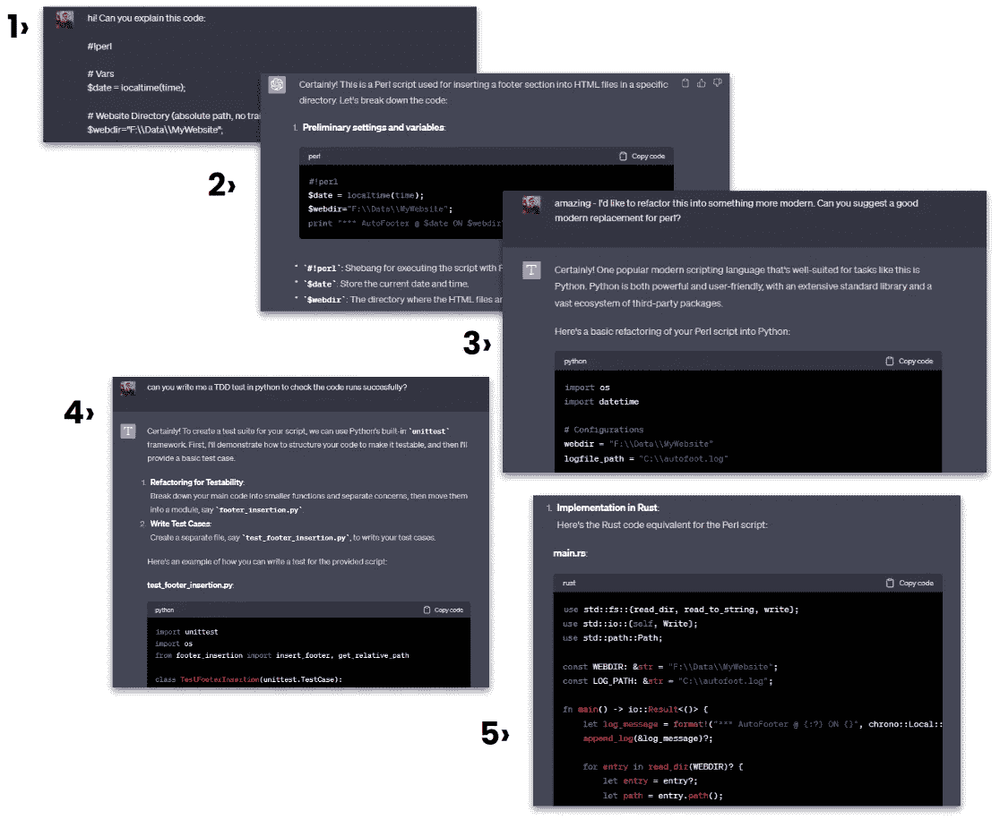

# 如果工程师开始使用 AI 编码工具，我们的产品团队会发生什么？

> 原文：[`towardsdatascience.com/if-engineers-start-to-use-ai-coding-tools-what-happens-to-our-product-teams-acd55fb273dd`](https://towardsdatascience.com/if-engineers-start-to-use-ai-coding-tools-what-happens-to-our-product-teams-acd55fb273dd)

作者使用 Midjourney 制作的图片

## AI 对产品工程团队的影响——第三部分

 [Mark Ridley](https://mark-ridley.medium.com/?source=post_page-----acd55fb273dd--------------------------------)

·发布于 [Towards Data Science](https://towardsdatascience.com/?source=post_page-----acd55fb273dd--------------------------------) ·10 min read·2023 年 7 月 27 日

--

*这是一个六部分系列的第三部分，调查像 Github Copilot、ChatGPT 和 Amazon CodeWhisperer 这样的生成性 AI 生产力工具可能如何影响整个产品工程团队的结构。*

在 [第二部分](https://medium.com/@mark-ridley/the-proliferation-of-generative-ai-coding-tools-and-how-product-engineering-teams-will-use-them-48787ebfcaaa) 中，我们探讨了：

1.  生成性 AI 工具如 ChatGPT 如何重新定义产品工程团队处理编码的方式——从生成用户故事到实际编写代码。

1.  诸如编写测试和文档等开发者通常认为繁琐的任务，现在可以由 AI 轻松高效地处理，从而使整个编码过程更加流畅。

1.  测试的重要性以及经过深思熟虑的测试设计可能会启动的 prompt-engineered 应用的潜在未来。

1.  对未来的愿景，其中生成性 AI 工具重塑了产品工程团队内的角色，以及对工程师和领导者的深远影响。

# 生成性 AI 工具将如何改变团队结构？

我过去几个月一直沉迷的想法是，生成性 AI 工具对产品工程团队的影响将导致产品角色与技术角色的比例发生根本性变化。在本系列的第一部分中，我反思了许多产品团队中工程师与产品经理的常见比例是五名工程师对一名产品经理。

现在，当我感到特别大胆或特别宿命论时，这一假设变成了：

**“当前的产品工程团队需要五个工程师对应一个产品经理。下一代产品工程团队只需要一个高级工程师对应一个产品经理”**

这是我想要验证的内容。

在本系列的前几篇文章中，我们讨论了这些开发者和生产力工具的个体影响，但现在我想将你的视线拉回到更战略的角度——增强的开发者生产力对团队，甚至整个组织的影响。

为了思维实验的目的，假设我们接受这样的观点：像 Github Copilot 这样的生成性 AI 工具可以提高单个开发者约 50%的生产力。还假设在当前的状态下（如我们在[第一部分](https://mark-ridley.medium.com/how-generative-ai-will-impact-product-engineering-teams-83a5eaa8fc60)中所述）一个产品经理对应五个工程师是一个合理的比例。如果这两个条件成立，我们可以推断长期以来的 5:1 比例将需要改变。

我相信，自 2022 年 Copilot 发布以来，我们所见的进展将会继续，特别是在风险投资资金流向生成性 AI 初创公司而不是元宇宙和 Web3.0 的情况下。

一大批新工具每天开始在[ProductHunt](https://www.producthunt.com/topics/artificial-intelligence)上出现，如[Bifrost](https://www.bifrost.so/)和[Locofy](https://www.locofy.ai/)（这两者都将 Figma 设计转化为可工作的 React 代码，类似于[Amazon 的 Amplify Studio](https://aws.amazon.com/amplify/studio/)），有趣的是看看这些工具能多快以及与谁一起获得 traction。

开发者在大型团队中不太可能推动这种新型代码自动化工具的采用，因为对代码质量的历史疑虑和企业风险规避。更可能的是，初创公司创始人、以创新为导向的产品经理和较小的营销团队将成为早期采纳者，被自动生成的网站和应用的较低成本和更快上市速度所吸引。

我能听到仍在阅读的工程师发出叹息，“*当然* ***我的*** *应用程序太独特，* ***我的*** *问题太复杂，这些基本的、像乐高积木一样的应用程序无法取代我的工作”*。但正如 Kelsey Hightower（Kubernetes 的原始贡献者之一，曾是 Google 的杰出工程师）[所说](https://twitter.com/kelseyhightower/status/1676267543638720512)的那样，

> “尽可能长时间坚持使用单调的架构，并将大部分时间和资源用于构建客户愿意支付的东西。”

如果你仍然认为你的应用是独特而美丽的，[这条跟进推文](https://twitter.com/dneighbors/status/1676292417044221953)来自 Derek Neighbours，清楚地总结了那句“无聊架构”评论应该指向的对象：**几乎每个人**。

> 需要非无聊架构的公司数量几乎接近零。没有什么比一个拥有 12 个客户的初创公司从 Netflix 或 Google 复制扩展模式更滑稽的了。

回到我的假设；大多数工程师将变得更有生产力，大多数架构不应该复杂，生成 AI 工具将比 2023 年状态有显著提升。如果这些都成立，那么工程师的工作将从基础的管道和维护转向更严肃的问题，如架构、解决方案设计、性能、安全以及管理日益复杂的内部生态系统。

我们可能会开始看到 ***测试驱动解决方案设计***，其中工程师的角色是以一种方式指定应用程序的功能，使得生成 AI 工具可以被提示生成测试和一个可工作的应用程序。在设计阶段创建的测试将继续证明应用程序满足公司和客户的需求，并自我记录应用程序。

# 代码生产力工具如何承担更多显而易见的任务之外的工作

我们已经讨论了生成 AI 工具对新产品和功能开发的影响，但对大多数工程师来说，这只占据了他们日常工作的一个部分。对于很多工程师来说，“业务照常”中的维护和操作任务占据了他们的大部分工作时间。重构、修复错误、小改动请求和小版本升级可能消耗大量宝贵的开发时间。当考虑到这些平凡的任务时，我们讨论的工具也同样强大，就像它们在令人兴奋的新产品开发工作中一样。

几年前，我和一个团队一起处理一个需要升级的旧数据库。团队现在非常现代，采用微服务（是的，这现在是一个形容词），而且没有人有古老 SQL 或过时的古老数据库引擎的经验。这种情况并不罕见，经常会引发小型紧急情况，因为团队急于找到具备神秘知识的人。原本应该是相对简单的任务突然颠覆了所有精心策划的路线图。

团队经常面临这些问题——无论是重写旧的和被遗忘的东西，还是需要从一个主要版本升级到另一个版本——他们必须仔细查阅过时且通常文档不佳的代码，以学习新的东西（或重新学习令人沮丧的旧事物）。

但是这些代码助手工具[并不在乎它们接收到什么语言](https://www.zdnet.com/article/i-used-chatgpt-to-write-the-same-routine-in-12-top-programming-languages-heres-how-it-did/)（是的，我确实让 ChatGPT 写过[brainf*ck](https://saketupadhyay.medium.com/how-to-code-in-brainf-ck-without-losing-your-mind-6a8fd67b36b4)和机器码以图乐趣）。这些 LLM 已经接受了所有文档，[数十亿行代码](https://www.zdnet.com/article/is-github-copilots-code-legal-ethically-right/)示例和所有关于[Stack Overflow](https://stackoverflow.com/)的争论（可能）。对于 LLM 来说，重写即使是未记录的代码也并不是什么大事。更好的是，可以很容易地要求这些工具为旧代码和新代码编写测试。

为了确认我没有产生幻觉这个任务是可能的，我去找了一些[互联网上的随机旧 Perl 代码](https://www.perlmonks.org/?node_id=11101494)，然后将其输入到 GPT4 中。在让它解释代码功能后，我接着询问可以用什么语言替换 Perl。它建议使用 Python，并立即生成了相应的代码。经过一次提示，我们得到了一些测试来检查代码是否正常运行。

作为额外奖励，我想看看我们是否可以将其移植到 Rust，这是 Stack Overflow 过去几年[‘最受喜爱的语言](https://insights.stackoverflow.com/survey/2019)’之一。正如你可能猜到的那样，它确实没有遇到什么问题。

让 ChatGPT 随机重构[我在互联网上找到的东西](https://www.perlmonks.org/?node_id=11101494)。

如果像文档和测试创建这样的简单但耗时的任务，以及版本升级和重构等常规工程任务可以由 AI 工具来完成，那么结果会是什么？几乎可以肯定的是，这会改变那 5:1 的比例。

# 网络和移动应用团队的奇怪世界

在那些选择同时构建网站和移动应用程序的组织中，我们有时会遇到一种稍微奇怪的功能失调。虽然网站和移动版本的功能和客户价值通常是相同的，但我们发现自己不得不将构建不同应用程序的团队分开。即使在那些努力围绕价值流对齐团队的组织中，专业知识和系统的分裂几乎总是导致了专门团队的形成。

这对于产品是重新设计的移动设备网页界面的公司（即所谓的‘响应式设计’）不是问题，但即使是那些选择构建‘[混合](https://applover.com/blog/native-vs-hybrid-vs-pwa-mobile-apps-which-should-you-choose)’移动应用的公司，这种情况也可能成为问题，其中应用程序在像 React Native 这样的网页相邻框架中开发。至少在这些混合应用中，代码可以有一定的相似性，发布移动和网页产品所需的技能也可以广泛转移。

原生移动应用——那些专门为 Android 和 iOS 构建的应用——可能会进一步复杂化问题。对于那些认为原生应用很重要的企业，且希望 Android 和 iPhone 用户获得相同优质体验的企业，我们通常需要额外的技能要求，需要具有 Java 或 Kotlin（针对 Android）或 Swift/Objective-C（针对 iOS）专业知识的工程师。

选择交付原生移动应用以及网页界面的公司面临大量重复的努力和相应的成本增加。

正如我们所见，在这种情况下，我们的生成式 AI 编码助手可以利用它们的语言无关性，创建多种语言的设计良好、测试充分的应用程序。这可能的影响是，我们可能不再需要因技能集的不同而拆分移动和应用团队，而仅仅是在网页和移动应用具有显著不同功能和特性时才需要分开。在一些公司，这可能会大大简化流程，并节省多达一半的工程预算。

# **对初级和中级开发者（尤其是在初创公司和小型企业中）有什么影响？**

在撰写本文之前，我与许多从事技术和产品的人讨论了这些编码工具可能产生的影响。几乎一致地，在我描述了这些工具可能的影响后，都会有人指责地问我*“那么所有的初级开发者会发生什么？”*

我曾与之共事的每位优秀工程经理或技术领导者都非常关注培养初级人才。优秀的工程师编写优秀的应用程序，而伟大的工程师则教导他人。因此，我得到的对这个讨论的最初反应之一就是对下一代的担忧。

说实话，我在短期内感到担忧。正如我们将在第四部分中看到的那样，一种潜在的影响是公司决定削减预算和团队规模，尽管承包商和外包开发团队可能会首先被裁减，但中级和初级开发者将会是下一个被裁减的对象。

我担心这些变化可能会导致我们技术人才的代际“剥皮”，即整个初级开发人员群体无法在团队中找到工作。构建应用程序所需的技术技能，至少在早期采用公司中，是资深工程师所具备的——包括解决方案和架构设计、安全性以及奇特的边缘案例。即便是技能娴熟的初级和中级工程师，也因为其角色定义和从业时间的限制，无法获得这种经验。

如果生成式 AI 工具在完成基本工作，那么最需要的就是资深开发人员和解决方案架构师的技能。

然而，尽管对初级开发人员的影响确实令人担忧，但并非全然黑暗。我最近在尝试学习 React 和 Django 时使用 Copilot，发现我的体验与职业生涯初期时截然不同。能够实时讨论一段代码的作用或错误所在，彻底改变了我的学习体验。我希望在我学习编码时能够使用 ChatGPT。

但尽管编写代码显然是开发人员的一项重要技能，但这并不是我们团队真正需要的那种难以言喻的品质。最好的工程师能够相对轻松地从一种语言转到另一种语言，是有原因的；**优秀的工程师不是被教会编程的，而是被教会如何思考的**。我仍然相信，创造性思维和系统思维能力将继续成为工程师为团队带来的标准。

我担心这些变化对初级开发人员的影响，但我也抱有希望。我尚未看到一个不需要技能熟练的工程师与技能熟练的设计师和产品经理共同工作来构建优秀产品的未来。即使每个团队的开发人员数量减少，也许我们会更倾向于类似某些传统手工业的模式，即初级人员在较长时间内更专门地向一位资深导师学习。

德语词汇“[Wanderjahre](https://en.wikipedia.org/wiki/Journeyman_years)”指的是一种可以追溯到中世纪的实践，年轻的工匠在学徒期后会从一个地方迁移到另一个地方。这段旅程的一个重要组成部分是体验不同的工作坊和文化，发展技能和思维方式，作为最终交付他们的*Meisterstück*（杰作）的追求的一部分。

或许这种古老的传授工程“精通”方法将更适合我们下一代产品团队。

**在第四部分中，您可以阅读到：**

1.  生成式 AI 在经济衰退和风险投资资金减少的情况下，对组织造成的重大转变。

1.  一个思想实验，考察三种情境：潜在增长、削减成本以及在引入生成式 AI 生产力工具的情况下维持现有预算。

1.  假设的后果和挑战，比如团队组成的剧烈变化，以及这些变化可能对产品经理和工程师等角色意味着什么。

1.  对这些工具对生产力和团队动态的真实影响的反思，为持续的行业讨论提供了基础。

阅读第四部分，当它发布时

**本系列的其他文章：**

+   [第一部分](https://mark-ridley.medium.com/how-generative-ai-will-impact-product-engineering-teams-83a5eaa8fc60)

+   [第二部分](https://medium.com/@mark-ridley/the-proliferation-of-generative-ai-coding-tools-and-how-product-engineering-teams-will-use-them-48787ebfcaaa)

附注：如果你喜欢这些关于团队的文章，可以查看我的[Teamcraft 播客](https://www.teamcraft.uk/)，在这里我和我的共同主持人 Andrew Maclaren 与嘉宾讨论什么使团队有效。
