# 如果你把生活视作游戏，你最好知道如何玩

> 原文：[`towardsdatascience.com/if-you-see-life-as-a-game-you-better-know-how-to-play-it-f7aaa365caf1`](https://towardsdatascience.com/if-you-see-life-as-a-game-you-better-know-how-to-play-it-f7aaa365caf1)

## 游戏理论如何帮助你做出日常决策

 [Diego Manfre](https://medium.com/@manfred.james?source=post_page-----f7aaa365caf1--------------------------------)

·发表在 [Towards Data Science](https://towardsdatascience.com/?source=post_page-----f7aaa365caf1--------------------------------) ·阅读时间 13 分钟·2023 年 12 月 2 日

--

图片由作者使用 [Midjourney](https://www.midjourney.com/home/?callbackUrl=%2Fapp%2F) 制作

在一个未知的星系里，你和你的朋友被一个神秘的外星生物组织拘留。他们承诺如果你们能在他们的游戏中击败他们，就会放你们离开。你们坐在一个宇宙桌子旁，外星人分发包含黑色和白色岩石的袋子。游戏开始时，每个玩家会选择一块岩石并把它放在桌子上。获胜者是选择了不同颜色岩石的人。这意味着，选择黑色而其他两人选择白色的人，或者选择白色而其他两人选择黑色的人。每次有人获胜，他们会给你一枚硬币堆放在你们桌子的一侧。你们将玩这个游戏一百万次，最终的赢家是获得更多硬币的人。除了游戏规则，你唯一知道的就是外星人每次以 50%的概率选择黑色。游戏开始前几秒，你的伙伴低声告诉你应遵循的策略。经过一百万场游戏，最终得分宣布你们俩都是赢家。这是纯粹的运气吗？你伙伴的策略有多重要？

# 介绍

你最终遇到上述情况的可能性极低。然而，外星人提出的游戏可以推断到更现实的情况。我们的生活充满了多种互动，在这些互动中我们要么本能地，要么故意地做出决定。这些决定中的许多依赖于他人的决定，许多则取决于我们无法控制的事件。在任何情况下，我们的回应很少是随机的，而更多是我们理性分析的结果。这意味着在我们面对的每一次互动中，我们根据带来更大利益的因素来做出决定。这也意味着我们可以根据不同的互动采取不同的策略。本文讨论了我们采取的策略、获得的回报，以及 [游戏理论](https://en.wikipedia.org/wiki/Game_theory)。

# 游戏理论 101

你可能已经看过电影 [美丽心灵](https://en.wikipedia.org/wiki/A_Beautiful_Mind_(film))，讲述了著名数学家 [约翰·纳什](https://en.wikipedia.org/wiki/John_Forbes_Nash_Jr.)，或者你听说过游戏理论家获得的多个诺贝尔奖。游戏理论是一个有趣的数学领域，具有许多现实生活中的应用。在游戏理论中，不同代理之间的战略互动通过数学建模，然后利用这些模型生成预测或更好地理解特定过程。根据互动类型或玩家数量，数学模型可以非常复杂，也可以是一组简单的方程式。不管是哪种情况，对游戏理论的短暂了解不仅有趣，而且有用。

在回到外星人桌子之前，让我们分析一个更简单的游戏。假设是星期五晚上，你正在决定吃什么。一组朋友想要比萨，而另一组朋友想要汉堡。比萨需要 30 分钟到达，而汉堡在 15 分钟内送达。这些是场景：

+   两个组都点了比萨。在这种情况下，有一个组对这个选择不会感到满意。

+   两个组都点了汉堡。在这种情况下，有一个组对这个选择不会感到满意。

+   一个组点了比萨，另一个组点了汉堡。在这种情况下，如果两个组都等待所有食物到达，一个组将不得不吃冷掉的食物。

假设 A 组想要比萨，而 B 组想要汉堡。我们可以将这种情况写成如下矩阵：

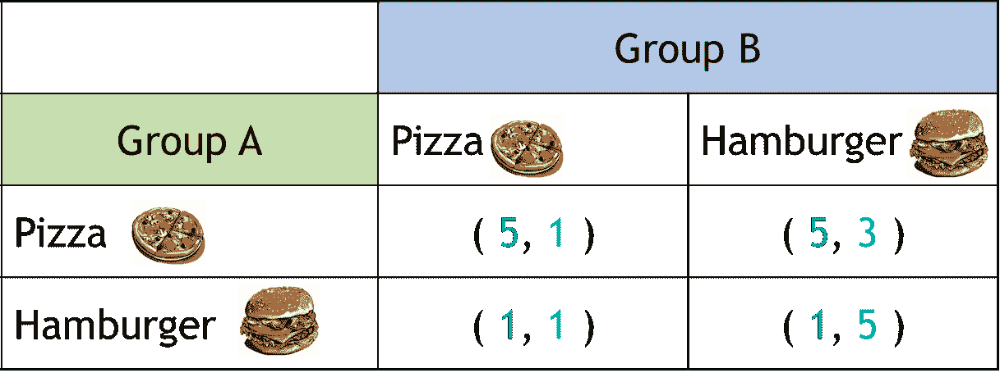

表 1\. 比萨/汉堡示例的回报矩阵。数字表示每个组对其选择的满意程度。（图形由作者制作）

每种情景中的数字称为收益，代表每种选择组合的结果。第一个数字是 A 组的收益，而第二个数字是 B 组的收益。指定收益是博弈论分析中非常重要的一部分，这并不总是简单明了的。收益可以代表多种事物。在这种情况下，我们任意指定一个数字，表示每个组对其选择的满意程度。这就像是事先询问每个组如果他们选择汉堡包或披萨，他们会有多满意，满意度范围从 0 到 5。如你所见，不可能让两个组都达到最高满意度，因为在 A 组订披萨而 B 组订汉堡包的情况下，披萨会迟到，B 组将吃到冷汉堡包。然而，这还不如没有吃到汉堡包那么糟糕！A 组订披萨而 B 组订汉堡包的组合代表了一个两组都不想偏离的解决方案。这被称为[Nash 均衡](https://en.wikipedia.org/wiki/Nash_equilibrium#References)。

在纳什均衡中，任何人都无法通过改变自己的策略来增加预期收益，而其他玩家的策略保持不变。在前面的例子中，解决方案（5,3）代表了一个纳什均衡，因为 A 组不能增加其收益（它已经是最大值），B 组也不能增加其收益，改变策略只会减少收益。另一个经典的例子用于解释纳什均衡是著名的[囚徒困境](https://en.wikipedia.org/wiki/Prisoner%27s_dilemma)。

在囚徒困境中，两名囚犯正被警察审讯，他们可以选择坦白或保持沉默。每种策略对应的收益如表 2 所示。在这种情况下，收益是他们将要在监狱中度过的年数。这意味着数字越小，收益越好。由于囚犯不知道对方会做什么，均衡状态对应的是两个囚犯都坦白的情况。这里的关键是：乍一看，收益表明对于两个囚犯**作为一个团队**来说，最好的策略是保持沉默。然而，他们不知道他们的伙伴会做什么。即使他们知道伙伴会保持沉默，从个人的角度来看，最好的策略是坦白，因为坦白会将监禁时间从一年减少到零。这意味着囚徒困境只有一个纳什均衡，即两个囚犯都坦白的策略。

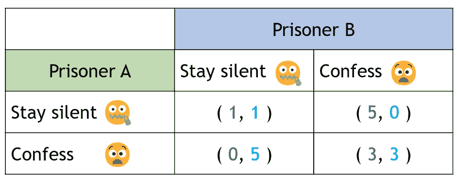

表 2\. 囚徒困境的收益矩阵。数字表示监禁的年数。（图形由作者制作）

在回到外星人及其游戏之前，重要的是要注意到，有些互动可能会有多个纳什均衡，而其他互动可能没有纳什均衡**如果我们只考虑** [**纯策略**](https://en.wikipedia.org/wiki/Strategy_(game_theory)#Pure_and_mixed_strategies)。纯策略对应于一个单一且具体的计划。这意味着保持沉默或认罪，或者购买披萨或购买汉堡包。另一方面，混合策略则为每个计划分配一个概率。我们可以说，囚犯有 75%的机会保持沉默，因此有 25%的机会认罪。**在任何有限的游戏中，我们可以确定至少存在一个纳什均衡**。这个均衡可能是纯策略或混合策略形式，或它们的组合。既然我们知道了这些，现在是时候与外星人一起坐回宇宙桌前了。

# 回到宇宙游戏

图 1 解释了收益和游戏的策略。这个游戏是经典游戏 [匹配硬币](https://en.wikipedia.org/wiki/Matching_pennies) 的修改版。共有 8 种可能的情景，其中两种情况下没有人获胜。这些情况是三名玩家选择相同颜色的情况。在其余的情景中，某人获胜要么是当其他人选择白色时选择黑色，要么是当其他人选择黑色时选择白色。这个游戏没有纯策略纳什均衡，因为没有任何策略能使所有玩家满意。然而，它确实有一个混合策略纳什均衡。在解决初始问题之前，让我们首先计算这个均衡。

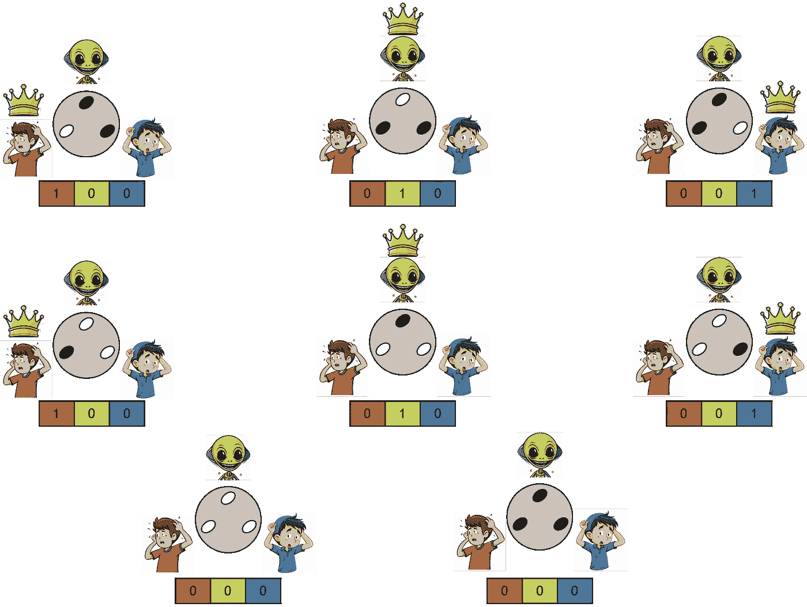

图 1\. 宇宙游戏示例的情景和收益。（图形由作者制作）

要计算混合策略纳什均衡，我们首先为每个策略分配概率。图 2 展示了标识每个玩家玩黑棋或白棋的概率的字母。

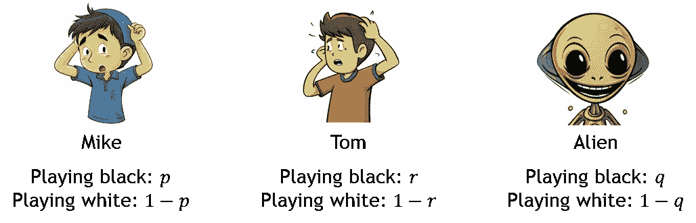

图 2\. 宇宙游戏中每个玩家的策略和概率。（图形由作者制作）

以外星人为例，对于外星人来说，找到一个不关心自己是玩黑棋还是白棋的策略，就等于找到概率 *r* 和 *q*，使得无论玩黑棋还是白棋都能得到相同的结果。我们可以通过以下方程式来表达这一点：

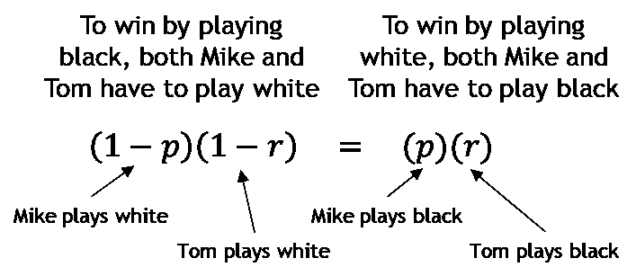

如果我们对所有玩家进行相同的分析，我们将得到一组方程，告诉我们表示混合策略纳什均衡的概率。在这种情况下，*p=q=r=0.5*。另一种看待这种情况的方法是，如果三名玩家以 50%的概率选择石头的颜色，那么在无限次的游戏之后，他们将获得相同的支付。所有人的[期望值](https://en.wikipedia.org/wiki/Expected_value)是相同的。这是一个[链接](https://github.com/manfrezord/MediumArticles/blob/3c67c4b6acc32c9a6fadbb314f93cd96d998b749/GT/Game_Theory_Notebook.ipynb)，你可以在其中模拟这个游戏，改变每个玩家的概率。

在本文开头介绍的问题的特定情况下，我们并不关心找到三名玩家之间的纳什均衡。相反，我们关心的是找到一种策略，使我们总是能战胜外星人。我们对他的了解至关重要。如果我们已经知道他将以 50%的概率选择黑色，那么我们可以让我们的朋友选择黑色，而我们选择白色，这将确保我们中的一个在每一局中获胜。如果我们无限次地玩这个游戏，那么外星人将最终得到零枚硬币，而我们将分配其余的硬币。表 3 显示了假设外星人以 50%概率选择黑色的情况下，仅两个玩家的支付矩阵。请注意，其中有两个纳什均衡，汤姆或迈克通过选择对立的策略获得 1 的支付。

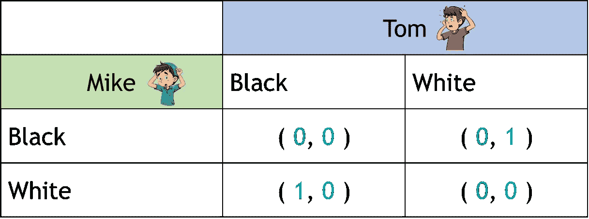

表 3。假设外星人以 50%概率选择黑色的情况下，宇宙游戏中两个玩家的支付矩阵。（图形由作者制作）

毕竟，击败外星人在他自己的游戏中是可能的！知道他总是以 50%的概率选择黑色，这让你的朋友可以选择黑色，而你选择白色（或反之亦然），并赢得每一局。然而，如果我们对外星人的策略没有任何先前的信息，那么我们最好的选择是以 50%的概率选择黑色或白色。博弈论不仅在这种假设性的场景中有用，在许多其他更现实的场景中也同样适用。让我们回顾另一个例子。

# 保护计划的技巧

在节省了一整年并等待[黑色星期五](https://en.wikipedia.org/wiki/Black_Friday_(shopping))之后，你终于决定购买你一直想要的$1000 电视。在结账之前，收银员问你是否要再“多花 175 美元”购买一个保护计划（PP）。这个保护计划将覆盖你电视在接下来 4 年的相关费用。这是个好主意吗？

我们可以将这个问题分析为一个双人游戏：卖电视和保护计划的公司是一个玩家，而买家是另一个玩家。如果我们假设修理一台电视的平均费用是$500，那么支付矩阵将如下所示：

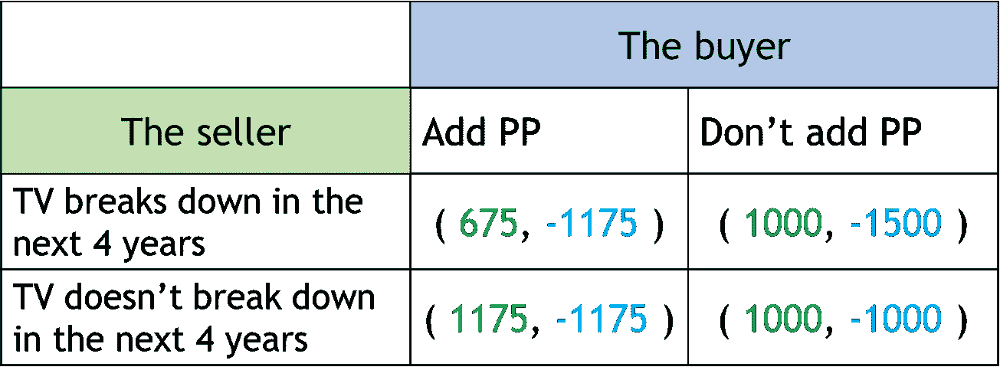

表 4\. 保护计划示例的回报矩阵。数字表示成本/利润。（图表由作者制作）

在前面的矩阵中，第一个数字对应于公司的回报，第二个数字是买方的回报。数值计算如下：

## 买方添加保护计划：

如果电视故障：

+   回报（买方）：电视的成本 + 保护计划的成本：-1000–175 = -1175

+   回报（公司）：电视的收入 + 保护计划的收入 — 维修成本 = 1000+175–500=675

如果电视没有故障：

+   回报（买方）：电视的成本 + 保护计划的成本：-1000–175 = -1175

+   回报（公司）：电视的收入 + 保护计划的收入 = 1000+175 = 1175

## 买方不添加保护计划：

如果电视故障：

+   回报（买方）：电视的成本 + 维修成本：-1000–500 = -1500

+   回报（公司）：电视的收入 = 1000

如果电视没有故障：

+   回报（买方）：电视的成本：-1000

+   回报（公司）：电视的收入 = 1000

注意在买方不添加保护计划且电视没有故障的情况下存在纯策略纳什均衡。这是表 4\ 中的右下角框。这是完全有意义的，因为如果我们不添加保护计划，那么最好的情况就是电视正常工作而无需维修。另一方面，如果我们决定不购买保护计划，那么无论电视是否故障，卖方都会赚到相同的金额。

找到纯策略纳什均衡对于理解这个场景很重要，但它尚未回答我们最初的问题。为此，我们需要考虑电视在前四年内出现故障的概率。假设*q*表示这个概率。在这种情况下，买方考虑到这个概率的期望值是：

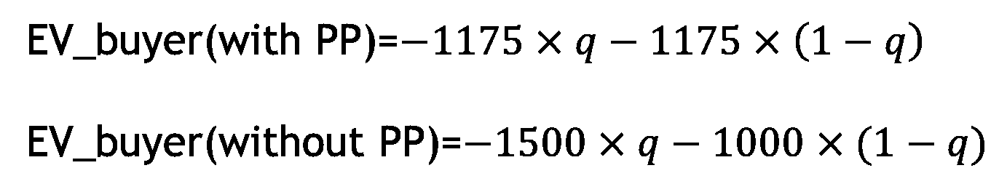

请注意我们在计算卖方添加保护计划的情况下和买方购买电视但不添加保护计划的情况下的期望值。在一种最坏的情况下，我们完全确定电视会故障（*q=1*），如果添加保护计划，买方将支付 $1175，如果不添加则支付 $1500。我们可以找到使得添加保护计划和不添加保护计划的期望值相等的概率，即*q=0.35*。图 3 显示了在添加保护计划和不添加保护计划的情况下，相对于*q*的期望值。这个图表告诉我们，如果电视故障的概率小于 0.35，那么最好是不添加保护计划。

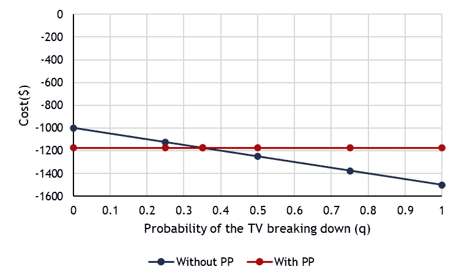

图 3\. 买方添加或放弃保护计划时，电视故障概率的成本。

请注意，0.35 的值是根据之前列出的成本计算得出的。实际上，在这种情况下，使得添加保护计划和不添加保护计划的期望值相等的*q*值仅取决于保护计划的成本和维修成本。

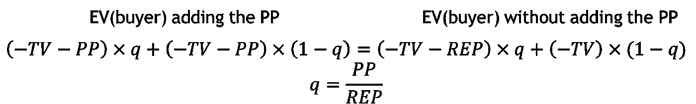

如果修理电视的费用增加，那么电视发生故障的概率上限，即更值得添加 PP 的概率，会下降。另一方面，增加 PP 的价格也会增加*q*。注意，当 PP 的成本接近修理成本时，无论电视发生故障的概率如何，购买 PP 的推荐程度都会降低。这是一个[链接](https://github.com/manfrezord/MediumArticles/blob/3c67c4b6acc32c9a6fadbb314f93cd96d998b749/GT/Game_Theory_Notebook.ipynb)，你可以在这里计算在改变任何变量并运行多次迭代后，买方的预期成本。

我们还可以从卖方的角度分析这个问题。卖方可能会问：“知道电视在前 4 年内发生故障的概率是*x*，那么 PP 的价格应该是多少，以便我不在乎人们是否添加 PP？”在这种情况下，我们也可以计算添加 PP 或不添加 PP 的期望值，但这次是卖方的收益：

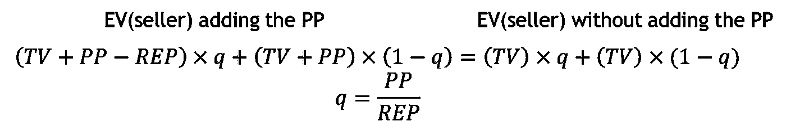

注意方程右侧如何对应于电视的价格。这意味着如果电视在 0.35 的概率下发生故障，卖方将具有相同的期望值（$1000），无论买方决定如何。现在，电视在前 4 年内发生故障的概率是多少？回答这个问题可能很困难，因为每台电视都不同。然而，快速的谷歌搜索表明，这个值可能在 4%左右（0.04）。如果是这样，那么 PP 的成本，使得期望值相等的是 0.04 x 500 = $20。这意味着通过将 PP 设置为$175，卖方在买方添加 PP 时的期望值为$1155，而不添加时为$1000！相当划算！

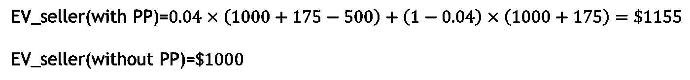

之前的解释展示了卖方或公司如何使用博弈论来确定其服务的最佳价格，以便在多次销售后期望值是有利的。这是一个[链接](https://github.com/manfrezord/MediumArticles/blob/3c67c4b6acc32c9a6fadbb314f93cd96d998b749/GT/Game_Theory_Notebook.ipynb)，你可以在这里计算通过改变任何变量并运行多次迭代后，卖方的期望值。

# 结论

从外星人遭遇等虚构场景到购物，我们的生活充满了不同后果的决策。这些后果不仅是我们决策的产物，也依赖于他人的决策，而这些决策又取决于其他人的决策。虽然我们无法控制他人做什么，但我们可以学习将每个问题视为一个包含玩家、策略和收益的游戏。这正是博弈论的意义所在，也正是它有如此多应用的原因。下次你面临决策时，记住这一点！这可能会节省一些钱或让你避免几年牢狱之灾！
