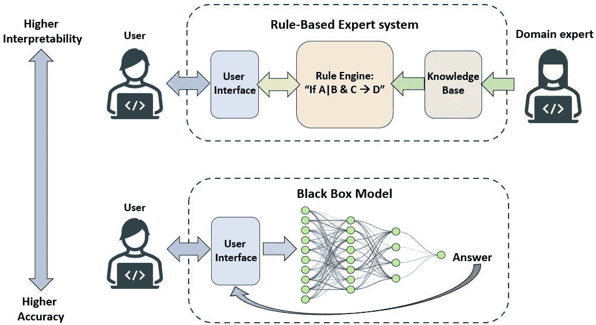
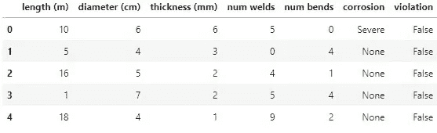
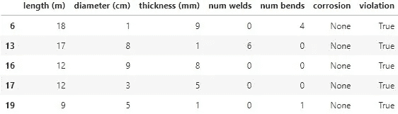
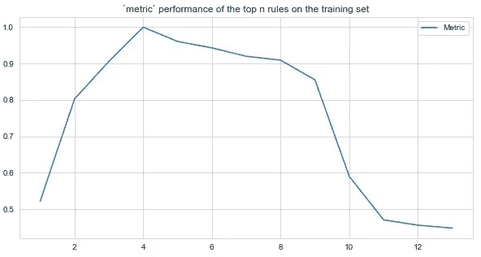
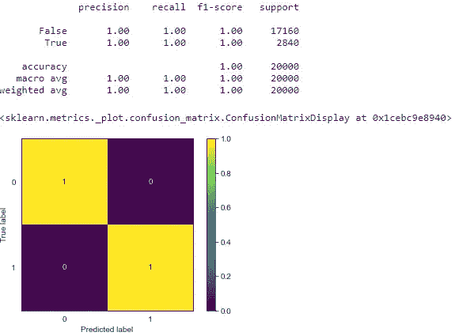

# 不只是爬行动物：探索 Iguanas 工具包用于超越黑箱模型的 XAI

> 原文：[`towardsdatascience.com/iguanas-more-than-just-reptiles-exploring-the-iguanas-toolkit-for-xai-beyond-black-box-models-4330ad69029?source=collection_archive---------10-----------------------#2023-08-25`](https://towardsdatascience.com/iguanas-more-than-just-reptiles-exploring-the-iguanas-toolkit-for-xai-beyond-black-box-models-4330ad69029?source=collection_archive---------10-----------------------#2023-08-25)


“AI 思维” 来源：作者使用[Dall-E](https://openai.com/dall-e-2)创建

## 平衡复杂性和透明性以实现有效决策

[](https://medium.com/@vflovik?source=post_page-----4330ad69029--------------------------------)[](https://towardsdatascience.com/?source=post_page-----4330ad69029--------------------------------) [Vegard Flovik](https://medium.com/@vflovik?source=post_page-----4330ad69029--------------------------------)

·

[关注](https://medium.com/m/signin?actionUrl=https%3A%2F%2Fmedium.com%2F_%2Fsubscribe%2Fuser%2F17ff8967433&operation=register&redirect=https%3A%2F%2Ftowardsdatascience.com%2Figuanas-more-than-just-reptiles-exploring-the-iguanas-toolkit-for-xai-beyond-black-box-models-4330ad69029&user=Vegard+Flovik&userId=17ff8967433&source=post_page-17ff8967433----4330ad69029---------------------post_header-----------) 发表在[Towards Data Science](https://towardsdatascience.com/?source=post_page-----4330ad69029--------------------------------) ·14 分钟阅读·2023 年 8 月 25 日[](https://medium.com/m/signin?actionUrl=https%3A%2F%2Fmedium.com%2F_%2Fvote%2Ftowards-data-science%2F4330ad69029&operation=register&redirect=https%3A%2F%2Ftowardsdatascience.com%2Figuanas-more-than-just-reptiles-exploring-the-iguanas-toolkit-for-xai-beyond-black-box-models-4330ad69029&user=Vegard+Flovik&userId=17ff8967433&source=-----4330ad69029---------------------clap_footer-----------)

--

[](https://medium.com/m/signin?actionUrl=https%3A%2F%2Fmedium.com%2F_%2Fbookmark%2Fp%2F4330ad69029&operation=register&redirect=https%3A%2F%2Ftowardsdatascience.com%2Figuanas-more-than-just-reptiles-exploring-the-iguanas-toolkit-for-xai-beyond-black-box-models-4330ad69029&source=-----4330ad69029---------------------bookmark_footer-----------)

随着越来越多的行业将机器学习纳入决策过程中，一个重要问题随之而来：我们如何信任那些我们无法理解其推理的模型，以及如何根据这些信息自信地做出高风险决策？

对于安全关键型重资产行业的应用，在这些领域中错误可能导致灾难性后果，透明性缺乏可能是采纳的主要障碍。这就是模型可解释性和[解释性](https://en.wikipedia.org/wiki/Explainable_artificial_intelligence)变得越来越重要的地方。

你可以将模型理解能力视为一个谱系：复杂的[深度神经网络](https://en.wikipedia.org/wiki/Deep_learning)处于一端，而透明的[基于规则的系统](https://en.wikipedia.org/wiki/Rule-based_system)则位于另一端。在许多情况下，模型输出的可解释性与准确性同样重要。



可解释性与准确性。来源：作者创建

在这篇博客文章中，我们将探讨一种方法，该方法可以直接从数据中自动生成规则集，从而构建一个完全透明且可解释的决策支持系统。需要注意的是，并不是所有情况都能通过这种基本模型得到令人满意的解决。然而，任何建模工作开始于一个简单的基线模型都提供了几个关键优势：

+   **快速实现：** 快速设置以启动基础模式

+   **比较参考：** 用于评估更先进技术的基准

+   **人类可理解的见解：** 基本的可解释模型提供有价值的人类可解释见解

对于阅读此帖的同行数据科学从业者：我承认这种方法与简单拟合[决策树模型](https://en.wikipedia.org/wiki/Decision_tree_learning)的相似性。然而，随着阅读的深入，你会发现这种方法被调整为模拟人类规则创建，这使其相比于典型决策树模型（通常在实践中可能会很困难）的输出更易于解释。

自动规则生成，如通过[Iguanas 框架](https://github.com/paypal/Iguanas)展示的，说明了我们如何直接从原始数据中提取有见解的（且可由人类解释的）规则。虽然这篇博客文章中的示例覆盖了一个特定的案例，但规则生成算法通常也可以适应其他分类挑战。

# **示例案例介绍：**

为了说明自动规则生成的过程，我们以管道完整性检查的假设行业相关案例为例。确保管道的结构完整性是一项要求严格审查的任务，并且对于防止环境灾难至关重要。因此，我们的案例代表了一个模型可解释性和解释性至关重要的相关示例。


完整性检查。照片由[Paul Teysen](https://unsplash.com/@hooverpaul55?utm_source=medium&utm_medium=referral)拍摄，来源于[Unsplash](https://unsplash.com/?utm_source=medium&utm_medium=referral)

在这个案例研究中，我们首先定义一个数据集，模拟不同的管道属性。这些属性包括长度、直径、壁厚、焊缝数量、弯头数量和腐蚀级别。此外，我们还包括一个二进制的“违例”状态，表示是否根据特定属性组合发生了违例。实际上，我们的数据集代表了一个[二分类](https://en.wikipedia.org/wiki/Binary_classification)问题，这对于大多数数据科学家来说应该是一个熟悉的案例。

我们的第一步是创建一个合成数据集，包含下列各种属性以及相应的违例状态（分类为“真”或“假”）：

+   管道长度：区间 1–20 米

+   管道直径：区间 1–10 厘米

+   测量的管壁厚度（例如，通过检查得出）：区间 1–10 毫米

+   焊缝数量：区间 0–10（所有管道由最大长度为 10 米的管段组成。如果总管道长度> 10 米，则必须与另一根管道连接/焊接，因此“焊缝数量”> 0）

+   弯头数量：区间 0–5：管道的弯头数量，其中 0 表示正常的直管段。

+   腐蚀：分类变量，包括“无”，“轻微”或“严重”（例如，通过检查得出）。

+   违例：二进制变量，“真”或“假”，表示这些属性集合是否应导致违例。

然后我们可以生成我们的合成数据集，其中每一行表示一组管道属性及其相应的违例状态。属性在上述指定区间内定义，而“违例”状态则基于一套预定义的规则来确定，详细说明在下一部分中。

```py
# Import neccesary packages/libraries:
from iguanas.rule_generation import RuleGeneratorDT, RuleGeneratorOpt
from iguanas.rule_optimisation import BayesianOptimiser
from iguanas.metrics.classification import FScore, Precision
from iguanas.metrics.pairwise import JaccardSimilarity
from iguanas.rules import Rules, ConvertProcessedConditionsToGeneral, ReturnMappings
from iguanas.correlation_reduction import AgglomerativeClusteringReducer
from iguanas.rule_selection import SimpleFilter, GreedyFilter, CorrelatedFilter
from iguanas.rbs import RBSPipeline, RBSOptimiser
from sklearn.model_selection import train_test_split
from sklearn.metrics import confusion_matrix, ConfusionMatrixDisplay, classification_report
from sklearn.ensemble import RandomForestClassifier
from category_encoders.one_hot import OneHotEncoder
import seaborn as sns
import pandas as pd
import numpy as np

# Create empty dataframe:
df = pd.DataFrame(columns=['length (m)',
                           'diameter (cm)',
                           'thickness (mm)',
                           'num welds', 
                           'num bends', 
                           'corrosion', 
                           'violation'])

# Total number of datapoints in generated dataset:
datapoints = 100000
np.random.seed(10)

# Min/Max length of pipe
min_len = 1
max_len = 20

# Min/Max diameter of pipe
min_dim = 1
max_dim = 10

# Min/Max measured wall thickness of pipe
min_thick = 1
max_thick = 10

# Min/Max number of welds
min_welds = 0
max_welds = 10

# Min/Max number of bends
min_bends = 0
max_bends = 5

length = np.random.randint(min_len,max_len,datapoints)
diameter = np.random.randint(min_dim,max_dim,datapoints)
thickness = np.random.randint(min_thick,max_thick,datapoints)
num_welds = np.random.randint(min_welds,max_welds,datapoints)
num_bends = np.random.randint(min_bends,max_bends,datapoints)

# Generate categorical variable for corrosion: 80% probability for "None",
# 15% for "Light" and 5% for "Severe"
corrosion = np.random.choice(a=['None', 'Light', 'Severe'],
                             size=datapoints,
                             p=[0.8, 0.15, 0.05])

# Add generated variables to dataframe: 
df['length (m)'] = length
df['diameter (cm)'] = diameter
df['thickness (mm)'] = thickness
df['num welds'] = num_welds
df['num bends'] = num_bends
df['corrosion'] = corrosion
```

# **手动规则生成**

在进入自动化规则生成之前，让我们首先通过手动定义一套生成初始数据集的规则来建立基准。然后我们可以定义一些违例的示例规则，例如：

1.  如果管道直径大于 8 厘米且壁厚测量为 2 毫米或更薄。

1.  如果管道出现严重腐蚀且壁厚测量为 5 毫米或更薄。

1.  如果管道总长度超过 10 米且没有焊缝（因为管道由最大长度为 10 米的段组成，对于超过这个长度的管道需要进行焊接）。

1.  对于直径超过 5 厘米的管道，如果存在弯头但未检测到焊缝（考虑到这种直径的管道通常以直段形式提供，并需要将弯曲段后续焊接）。

如果违反了这些规则，则应报告为违例。

```py
rule_1 = pd.DataFrame((df['diameter (cm)'] >= 8) & (df['thickness (mm)'] <= 2))
rule_2 = pd.DataFrame((df['corrosion']=='Severe') & (df['thickness (mm)'] <= 5))
rule_3 = pd.DataFrame((df['length (m)'] > 10) & (df['num welds'] == 0))
rule_4 = pd.DataFrame((df['num bends'] > 0) & (df['num welds'] == 0) & (df['diameter (cm)'] >=5))

df['violation'] = rule_1 | rule_2 | rule_3 | rule_4

df.head()
df[df['violation'] ==True].head()
```

我们的合成数据集现在包含我们的“管道检查”，其中包含每个管道的属性集合，以及一个二元变量，指示是否应将其报告为违规。上面的代码块还显示了数据集中选定的行，突出了报告违规的示例：



数据集中的示例行：无违规



数据集中的示例行：报告的违规情况

# **使用 Iguanas 进行自动规则生成**

现在，关键问题出现了：我们能否从上述数据集中自动推导出适当的“完整性检查规则”？值得注意的是，这些规则生成算法对我们在上一节中定义的具体规则一无所知。这就是[Iguanas](https://github.com/paypal/Iguanas)登场的时刻（虽然是用于构建规则系统的 Python 包，而不是实际的蜥蜴）。


龟类。照片由[David Clode](https://unsplash.com/@davidclode?utm_source=medium&utm_medium=referral)提供，发布在[Unsplash](https://unsplash.com/?utm_source=medium&utm_medium=referral)上。

Iguanas 提供了一套工具，旨在基于数据生成和优化规则。在我们的示例案例中，我们希望利用这个框架查看是否可以自动生成人类可解释的有意义规则，同时仅依赖数据集中存在的信息。

## **数据集划分和预处理**

在应用任何规则生成技术之前，我们首先需要将数据集划分为训练集和测试集。训练集将用于构建和优化我们的规则系统，而测试集将用于评估其在未见数据上的表现。我们这里使用随机划分，选择 20%的数据用于测试规则在未见数据上的表现。

```py
target_column = 'violation'
X = df.drop(
    target_column,
    axis=1
)
y = df[target_column]

X_train, X_test, y_train, y_test = train_test_split(
    X,
    y,
    test_size=0.2,
    random_state=0
)
```

然后，我们需要使用[one-hot 编码](https://en.wikipedia.org/wiki/One-hot)将分类变量（如腐蚀）转换，使其与规则生成算法兼容：

```py
ohe = OneHotEncoder(use_cat_names=True)
ohe.fit(X_train)
X_train = ohe.transform(X_train)
X_test = ohe.transform(X_test)
```

## **使用 Iguanas 生成规则**

在[Iguanas](https://github.com/paypal/Iguanas)框架中，你会找到两个主要的规则生成算法可以选择：[*RuleGeneratorDT*](https://paypal.github.io/Iguanas/api/api/iguanas.rule_generation.RuleGeneratorDT.html)和[*RuleGeneratorOpt*](https://paypal.github.io/Iguanas/api/api/iguanas.rule_generation.RuleGeneratorOpt.html)

+   *RuleGeneratorDT*：通过提取树集成模型中表现最佳的分支来生成规则。

+   *RuleGeneratorOpt*：通过优化单一特征的阈值来生成规则，并将这些单条件规则与 AND 条件结合，创建更复杂的规则。

在下面的示例中，我们使用了*RuleGeneratorDT*作为我们选择的算法，尽管我们也可以使用*RuleGeneratorOpt*替代。然后，我们定义了像[F-score](https://en.wikipedia.org/wiki/F-score)和[precision](https://en.wikipedia.org/wiki/Precision_and_recall)这样的指标，并配置了规则生成器的参数。我们选择生成最多 4 个条件/语句的规则，以避免过于复杂和冗长的规则。我们还使用了[随机森林分类器](https://en.wikipedia.org/wiki/Random_forest)作为提取规则的基础模型。在定义这些参数之后，我们可以将规则生成器拟合到我们的训练数据中。

```py
# Define metrics: F-score and precision
p = Precision()
f1 = FScore(beta=1)

# Define parameters for RuleGeneratorDT
params_RG_DT = {
    'metric': f1.fit,
    'n_total_conditions': 4,
    'tree_ensemble': RandomForestClassifier(n_estimators=10, random_state=0),
    'target_feat_corr_types': 'Infer',
    'num_cores': -1,
    'verbose': 1
}

#params_RG_OPT = {
#    'metric': f1.fit,
#    'n_total_conditions': 4,
#    'num_rules_keep': 1000,
#    'n_points': 100,
#    'ratio_window': 1,
#    'remove_corr_rules': True,
#    'target_feat_corr_types': 'Infer',
#    'verbose': 1
#}

# Instantiate and fit RuleGeneratorDT
rg = RuleGeneratorDT(**params_RG_DT)
X_rules_gen_train = rg.fit(
    X=X_train,
    y=y_train
)
```

## **规则过滤和优化**

生成的规则集可能包含冗余或性能不佳的规则。为了解决这个问题，我们使用一系列过滤器来改进结果规则集：

+   首先，我们应用[*SimpleFilter*](https://paypal.github.io/Iguanas/api/api/iguanas.rule_selection.SimpleFilter.html)来移除 F 分数低于某个阈值的规则。

+   然后，我们使用[*CorrelatedFilter*](https://paypal.github.io/Iguanas/api/api/iguanas.rule_selection.CorrelatedFilter.html)和[*AgglomerativeClusteringReducer*](https://paypal.github.io/Iguanas/api/api/iguanas.correlation_reduction.AgglomerativeClusteringReducer.html?highlight=agglomerativeclusteringreducer#iguanas.correlation_reduction.AgglomerativeClusteringReducer)进一步减少相关规则。

+   最后，我们使用[*GreedyFilter*](https://paypal.github.io/Iguanas/api/api/iguanas.rule_selection.GreedyFilter.html)选择一个规则子集，以最大化特定指标（例如，[precision](https://en.wikipedia.org/wiki/Precision_and_recall)）。在这里，我们将按精度对规则进行排序，然后计算前 n 个组合规则的 F1 分数。

```py
# Apply SimpleFilter
fr = SimpleFilter(
    threshold=0.3,
    operator='>=',
    metric=f1.fit,
)
X_rules_train = fr.fit_transform(
    X_rules=X_rules_gen_train,
    y=y_train
)

# Apply CorrelatedFilter
js = JaccardSimilarity()
acfr = AgglomerativeClusteringReducer(
    threshold=0.7,
    strategy='bottom_up',
    similarity_function=js.fit,
    metric=f1.fit
)
fcr = CorrelatedFilter(correlation_reduction_class=acfr)
X_rules_train = fcr.fit_transform(
    X_rules=X_rules_train,
    y=y_train
)

# Apply GreedyFilter
gf = GreedyFilter(
    metric=f1.fit,
    sorting_metric=p.fit,
    verbose=1
)

X_rules_train = gf.fit_transform(
    X_rules=X_rules_train,
    y=y_train
)

gf.plot_top_n_performance_on_train()
```

上述代码块还绘制了“前 n”规则在训练集上的综合表现，如下所示：



“Top n”性能。来源：由作者创建

我们在这里看到的是，对于一组前 4 条规则，我们可以完美匹配训练数据（这很有意义，因为这是我们用来生成合成数据集的规则数）。

## **创建 RBS 管道**

现在，让我们使用这个组合的过滤规则集设置我们的[*RBS 管道*](https://paypal.github.io/Iguanas/api/api/iguanas.rbs.RBSPipeline.html)。在这种情况下，我们采用简单的方法：

+   如果有任何规则触发，则标记违例为“True”

+   如果没有规则触发，则标记违例为“False”

要使用上述逻辑设置管道，我们首先需要创建配置参数。这只是一个列表，概述了管道的各个阶段，每个阶段应该使用两个元素的元组来定义：

+   第一个元素应该是一个整数，表示在该阶段做出的决策（0 或 1）。

+   第二个元素应该是一个列表，用于指定哪些规则应触发该决策。

我们还定义了如果没有规则触发的最终决策。这个管道接着使用 [*RBSOptimiser*](https://paypal.github.io/Iguanas/api/api/iguanas.rbs.RBSOptimiser.html) 进行优化。在这里，我们只需将实例化的管道类传递给管道参数，在优化过程中，它还会检查是否可以进一步减少生成的规则集。然后，我们运行 [*fit_transform*](https://paypal.github.io/Iguanas/api/api/iguanas.pipeline.LinearPipeline.html?highlight=fit_transform#iguanas.pipeline.LinearPipeline.fit_transform) 方法，使用给定的训练数据优化我们的管道。

```py
# Define RBSPipeline configuration
config = [
   (1, X_rules_train.columns.tolist())
]

# Define final decision
final_decision = 0

# Instantiate RBSPipeline
rbsp = RBSPipeline(
    config=config,
    final_decision=final_decision
)

# Optimize RBSPipeline using RBSOptimiser
rbso = RBSOptimiser(
    pipeline=rbsp,
    metric=f1.fit,
    n_iter=1000,
    verbose=1
)
pipe_pred_train = rbso.fit_predict(
    X_rules=X_rules_train,
    y=y_train
)
```

## **性能评估**

我们通过生成的 [classification_repor](https://scikit-learn.org/stable/modules/generated/sklearn.metrics.classification_report.html)t 和绘制的 [混淆矩阵](https://en.wikipedia.org/wiki/Confusion_matrix) 来评估优化管道在训练数据上的性能。

```py
# Evaluate performance using classification_report and confusion_matrix
print(
    classification_report(
        y_true=y_train,
        y_pred=pipe_pred_train,
        digits=2
    )
)

sns.set_style('white')
cm = ConfusionMatrixDisplay(
    confusion_matrix(
        y_true=y_train,
        y_pred=pipe_pred_train,
        normalize='true'
    )

)
cm.plot()
```

如下图所示，我们看到对于训练数据，我们能够完美预测所有数据点的检查状态（违规与否）。


预测违规的指标和混淆矩阵。来源：作者创建

## **自动生成的规则集**

完成上述优化步骤后，我们最终获得了一组可以用于我们的“违规分类器”的规则。然后我们可以仔细查看相应的规则字符串，检查它们是否确实具有可解释性（这也是构建基于规则的分类器而不是黑箱机器学习模型的主要目标）。

```py
rg.filter_rules(include=rbs_rule_names_gen)
rg.rule_strings
```

这会导致下面的打印输出。如果我们将其与我们手动定义的规则（附在下方）进行比较，我们会发现我们实际上得到了完全相同的规则集：

```py
{'RGDT_Rule_20220214_43': "(X['corrosion_Severe']==True)&(X['thickness (mm)']<=5)",
 'RGDT_Rule_20220214_47': "(X['diameter (cm)']>=5)&(X['num bends']>=1)&(X['num welds']<=0)",
 'RGDT_Rule_20220214_58': "(X['diameter (cm)']>=8)&(X['thickness (mm)']<=2)",
 'RGDT_Rule_20220214_60': "(X['length (m)']>=11)&(X['num welds']<=0)"}
```

1.  如果管道出现严重腐蚀且壁厚为 5 毫米或更薄。

1.  对于直径超过 5 厘米的管道，如果存在弯头但未检测到焊接点

1.  如果管道直径大于 8 厘米且壁厚为 2 毫米或更薄。

1.  如果管道总长度超过 10 米且没有焊接点

## **在测试数据上使用生成的规则**

正如我们已经展示的那样，生成的规则集与我们用于生成数据集的规则完全匹配，我们知道它们也将适用于测试集中的未见数据。然而，在更现实的情况下，我们只有数据集本身，而没有原始规则集进行比较。为了确保生成的规则也能很好地推广到未见数据上，我们还需要在测试集上验证它们：

然后，我们利用优化后的 RBS 管道预测测试集中的违规情况。与之前的示例一样，我们通过使用[分类报告](https://scikit-learn.org/stable/modules/generated/sklearn.metrics.classification_report.html)和绘制结果的[混淆矩阵](https://en.wikipedia.org/wiki/Confusion_matrix)来评估其性能。

```py
# Generated rules
X_rules_test = rg.transform(X=X_test)

# Apply our optimised RBS Pipeline to the test set:
opt_pipe_pred_test = rbso.predict(X_rules=X_rules_test)

# Print classification report and confusion matrix:
print(
    classification_report(
        y_true=y_test,
        y_pred=opt_pipe_pred_test,
        digits=2
    )
)

cm = ConfusionMatrixDisplay(
    confusion_matrix(
        y_true=y_test,
        y_pred=opt_pipe_pred_test,
        normalize='true'
    )
)
cm.plot()
```



预测违规情况的指标和混淆矩阵。来源：作者创建

上述结果展示了在测试数据上的完美准确性和精确度，表明生成的规则具有良好的泛化能力（正如我们在本例中已知的那样）。

# **现实使用案例**

如前所述，在实际使用案例中，我们不一定会有一套已建立的规则来与我们的输出进行比较。在大多数情况下，我们的目标是构建分类模型，我们仅会获得一个属性/特征的数据集和一个对应的目标变量（例如“违规”或“非违规”）。任务是使用该数据集自动生成一套规则，从而洞察这些分类是如何进行的。

另一种方法是：使用这些算法的另一种情况是你已经有了一套手动定义的规则（例如由领域专家制定）。然而，数据分布的变化可能会使这些规则随着时间的推移变得次优。在这种情况下，你可以定期运行这种算法，以自动重新校准规则集以适应这些变化。

此外，这种逐步的方法是将领域专家的专业知识融入解决方案的有效方式。当他们审查生成的“违规”报告时，他们可能会注意到标记的违规实际上并不是问题。一旦他们验证了报告，系统可以从他们的输入中学习，并自主调整初始规则集。这一持续过程确保规则与数据变化和专家见解保持一致，从而使解决方案能够保持（或甚至提升）其性能。

# **结论**

利用自动规则生成，例如使用[Iguanas](https://paypal.github.io/Iguanas/index.html)框架，允许我们直接从数据中提取有意义的规则。这与为相同目的构建[黑箱](https://en.wikipedia.org/wiki/Black_box)分类模型形成对比。规则基础系统的透明性增强了决策过程的可解释性，这通常是采纳此类解决方案在安全关键行业中的重要方面。

尽管我们研究的案例非常具体，但规则生成过程也可以推广到各种其他分类挑战中。尽管规则基础方法可能不是更具挑战性问题的最佳选择，但它仍然可以为当前问题提供有价值（人类可解释）的见解。此外，它将作为一个良好的基础模型，让我们能够将其与更高级的技术进行比较和评估。

总结一下，我想给你留下一个重要的提醒：在深入研究复杂的前沿模型之前，始终花一点时间设置一个快速的基线模型。无论这意味着使用规则基础（或树基础）方法进行分类，如本案例所示，还是利用简单的[线性回归](https://en.wikipedia.org/wiki/Linear_regression)进行回归任务。

此外，我想强调[“KISS”原则](https://en.wikipedia.org/wiki/KISS_principle)，即“Keep It Simple, Stupid”（保持简单，愚蠢）。换句话说，在解决问题时，优先考虑简单性而不是不必要的复杂性。最有效的解决方案往往来自于最简单的策略。所以，记住，当你犹豫时，选择简单吧！

如果你对 AI/机器学习和数据科学相关主题感兴趣，你还可以查看我写的其他文章。你可以在我的 Medium 作者主页上找到所有文章，[你可以在这里找到。](https://medium.com/@vflovik)

如果你觉得我之前的文章有趣，并且希望在发布新内容时获得通知，你也可以在下面的邮件列表中注册。

[](https://medium.com/subscribe/@vflovik?source=post_page-----4330ad69029--------------------------------) [## 每当 Vegard Flovik 发布文章时获取电子邮件通知。

### 每当 Vegard Flovik 发布文章时获取电子邮件通知。通过注册，如果你还没有 Medium 账户，你将创建一个账户…

medium.com](https://medium.com/subscribe/@vflovik?source=post_page-----4330ad69029--------------------------------)

如果你希望成为 Medium 会员，以便自由访问平台上的所有材料，你可以使用下面的推荐链接来实现。（注意：如果你通过此链接注册，我也将获得部分会员费用）

[](https://medium.com/@vflovik/membership?source=post_page-----4330ad69029--------------------------------) [## 使用我的推荐链接加入 Medium - Vegard Flovik

### 作为 Medium 会员，你的一部分会员费用将分配给你阅读的作者，你可以完全访问每一篇故事…

medium.com](https://medium.com/@vflovik/membership?source=post_page-----4330ad69029--------------------------------)
