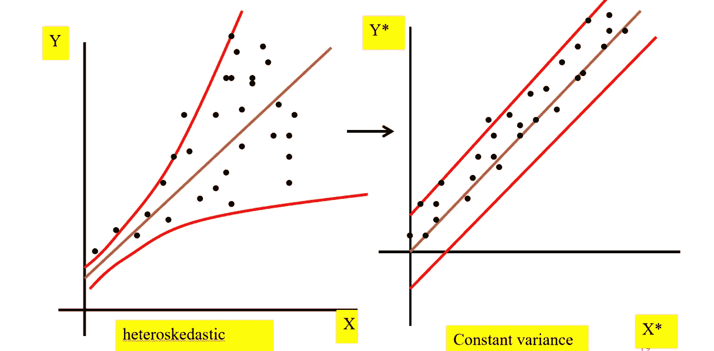
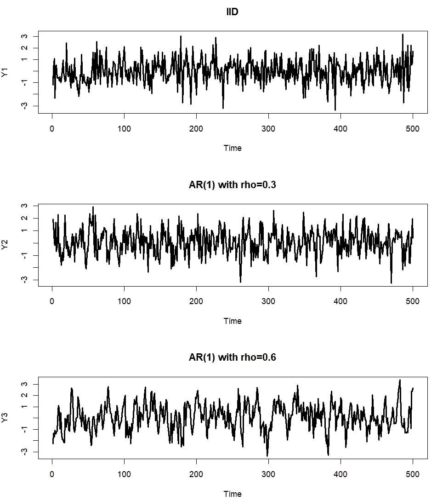
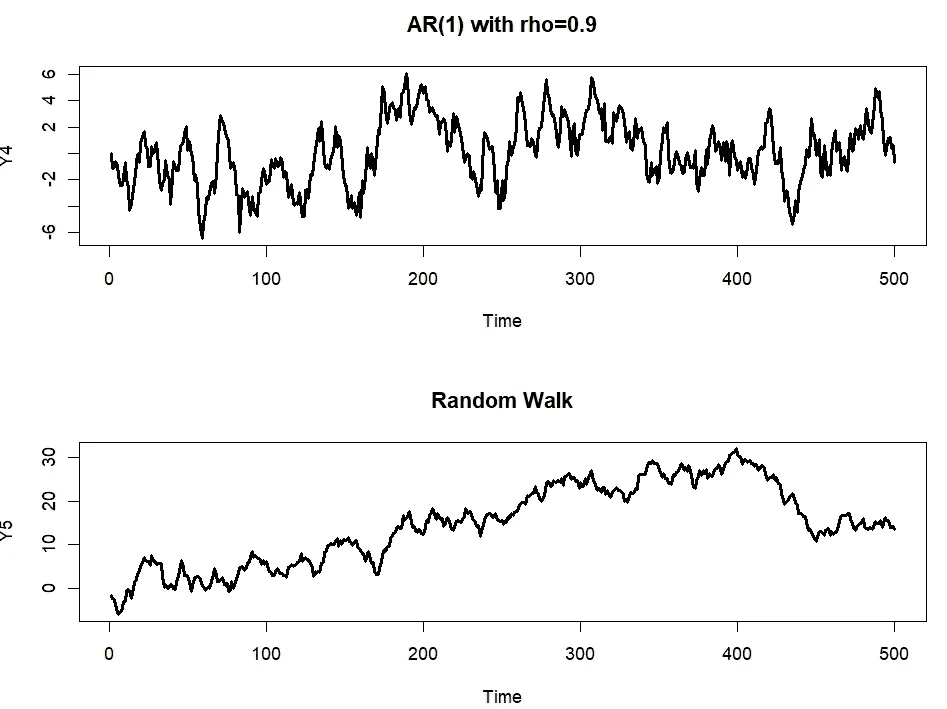
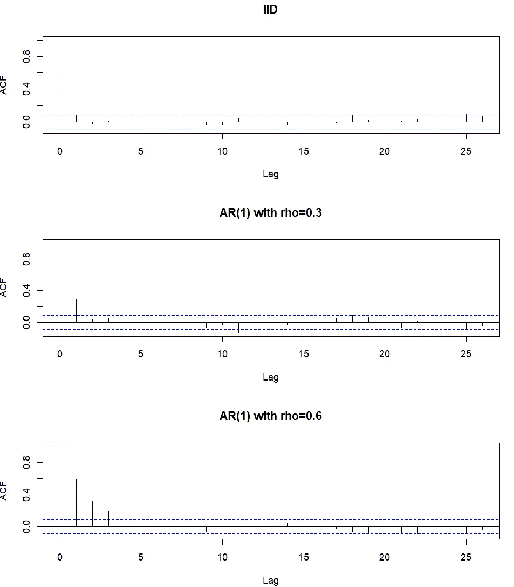
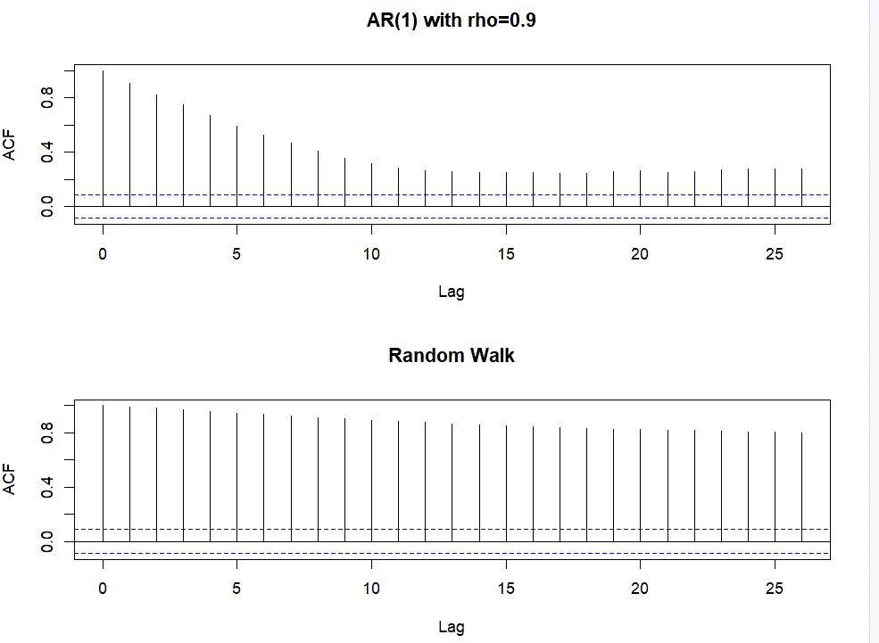

# IID: 初学者的意义和解释

> 原文：[`towardsdatascience.com/iid-meaning-and-interpretation-for-beginners-dbffab29022f`](https://towardsdatascience.com/iid-meaning-and-interpretation-for-beginners-dbffab29022f)

## 独立同分布

[](https://medium.com/@jaekim8080?source=post_page-----dbffab29022f--------------------------------)[](https://towardsdatascience.com/?source=post_page-----dbffab29022f--------------------------------) [Jae Kim](https://medium.com/@jaekim8080?source=post_page-----dbffab29022f--------------------------------)

·发表于[Towards Data Science](https://towardsdatascience.com/?source=post_page-----dbffab29022f--------------------------------) ·阅读时间 9 分钟·2023 年 8 月 19 日

--


图片由[Yu Kato](https://unsplash.com/@yukato?utm_source=medium&utm_medium=referral)提供，来源于[Unsplash](https://unsplash.com/?utm_source=medium&utm_medium=referral)

在统计学、数据分析和机器学习主题中，IID 概念作为一个基本假设或条件经常出现。它代表了“*独立同分布*”。IID 随机变量或序列是统计模型或机器学习模型的重要组成部分，同时也在时间序列分析中发挥作用。

在这篇文章中，我以直观的方式解释了在采样、建模和预测性三个不同背景下的 IID 概念。文中提供了一个带有 R 代码的应用案例，涉及时间序列分析和预测性。

# 采样中的 IID

表示 X ~ IID(μ,σ²)的符号表示从具有均值μ和方差σ²的总体中以*纯随机*的方式对(X1, …, Xn)进行采样。即，

+   每个连续的 X 的实现都是*独立*的，与前一个或后一个没有关联；并且

+   每个连续的 X 的实现都来自具有*相同*均值和方差的相同分布。

## 示例

假设从一个国家的年收入分布中采集了样本(X1, …, Xn)。

1.  一名研究人员选择了男性作为 X1，女性作为 X2，男性作为 X3，然后女性作为 X4，这种模式保持到 Xn。这*不是*一个 IID 采样，因为采样中的可预测或系统性模式是非随机的，违反了*独立性条件*。

1.  一名研究人员从最贫困的群体中选择了(X1, … X500)，然后从最富有的群体中选择了(X501, … X1000)。这*不是*一个 IID 采样，因为这两个群体的收入分布具有不同的均值和方差，违反了*同一性条件*。

# 建模中的 IID

假设 *Y* 是你想建模或解释的变量。那么，它可以分解为两个部分，即，

*Y* = 系统性成分 + 不系统性成分。

*系统性成分* 是由与其他因素的基本关系驱动的 *Y* 部分。它是可以通过*理论*、*常识* 或 *典型事实* 解释或预期的部分。它是 *Y* 的基础部分，具有实质性和实际重要性。

*不系统性成分* 是 *Y* 中不受基本因素驱动的部分，无法通过理论、推理或典型事实解释或预期。它捕捉 *Y* 中无法通过系统性成分解释的变动。它应该是 *纯随机的* 和特有的，*没有任何系统性* 或 *可预测的模式*。在统计模型中称为误差项，通常表示为 IID 随机变量。

例如，考虑以下形式的线性回归模型：

方程 (1)

在 (1) 中，*α* + *βX* 是系统性成分，而 (1) 中的误差项 *u* 是不系统性成分。

如果 *β* 的值接近 0 或在实际中可以忽略，则变量 *X* 对 *Y* 的解释力（用 R² 测量）较低，表明它不能令人满意地解释 *Y* 的基本变动。

假设误差项 *u* 是一个 IID 随机变量，均值为零且方差固定，表示为 *u* ~ IID(0, σ²)，这是纯随机的，代表 *Y* 中的不系统或意外变动。

如果 *u* 不是纯随机的且具有明显的模式，则系统性成分可能没有被正确指定，因为它缺少某些实质性或基本内容。

## 示例：自相关

假设误差项具有以下模式：

方程 (2)

这是线性依赖（或自相关），这是一个系统性模式。这种可预测模式应纳入模型部分，这将更好地解释 *Y* 的系统性成分。实现这一目标的一种方法是包含 Y 的滞后项在 (2) 中。即，

方程 (3)

在 (3) 中包含的 *Yt* 的滞后项能够捕捉 (2) 中误差项的自相关，因此 (3) 中的误差项 *e* 是 IID。

## 示例：异方差性

假设误差项显示出以下系统性模式：

方程 (4)

这种误差项模式称为异方差性，其中误差项的变异性随 *X* 变量的变化而变化。例如，假设 *Y* 是食品支出，*X* 是个人的可支配收入。方程 (4) 意味着高收入者的食品支出变异性更高。

这是一个可预测的模式，而具有性质（4）的误差项违反了 IID 的假设，因为误差项的方差不是常数。为了将这种模式纳入系统组件中，可以通过以下方式进行广义或加权最小二乘估计：

方程（5）

方程（5）是一个带有变换变量的回归，可以写成

方程（6）

其中

适用于异方差误差的变换

上述对*Y*和*X*的变换提供了方程（6）中的变换误差项（*ut**），它是一个 IID 且不再具有异方差性。即，

这意味着，通过上述变换，误差项中的系统模式现在有效地纳入了系统组件。



作者创作的图像

上述图形以直观的方式展示了变换的效果。在变换之前（左侧图），变量*Y*的变异性随着*X*的变化而增加，这反映了异方差性。变换有效地将异方差模式纳入了*Y*的系统组件中，变换后的误差项现在是一个 IID 随机变量，如右侧图所示。

许多回归或机器学习模型中的模型诊断测试旨在检查误差项是否遵循 IID 随机变量，使用从估计模型中得到的残差。这也称为残差分析。通过残差分析和诊断检查，可以改善模型的系统组件的规范。

# IID 和可预测性

纯粹随机的 IID 序列完全没有可预测的模式。也就是说，它的过去历史对序列未来的走向没有任何信息。

## 示例：自回归模型

考虑一个自回归模型，记作 AR(1)，

方程（7）

其中*ut* ~ IID(0,σ²)且 -1 < ρ < 1（ρ ≠ 0）。

如果ρ = 0，时间序列 Yt 是一个 IID 且不可预测的，因为它不依赖于自己的过去，仅由不可预测的冲击驱动。

为了简化，假设 Y0 = 0 且ρ ≠ 0，进行以下持续替代：

Y1 = u1;

Y2 = ρY1 + u2 = ρu1 + u2;

Y3 = ρY2 + u3 = ρ²u1 + ρ u2 + u3;

Y4 = ρY3 + u4 = ρ³u1 + ρ²u2 + ρu3 + u4;

其一般表达式为

方程（8）

方程（6）表明，一个时间序列（如自回归）可以表示为过去和当前 IID 误差（或冲击）的移动平均，并具有指数衰减的权重。

注意，远程冲击如（8）中的 u1 和 u2 对*Yt*的影响很小，因为它们的权重微不足道。例如，当*ρ* = 0.5 且*t* = 100 时，*ρ*⁹⁹和*ρ*⁹⁸几乎为 0。只有当前或最近的冲击，如 u100、u99 和 u98，才可能实际相关。

因此，如果研究人员在时间 t 对ρ有一个良好的估计（来自数据）并观察了当前和近期的冲击，如 ut、ut-1、ut-2 和 ut-3，她或他可能能够通过将（8）中的移动平均投射到未来，合理准确地预测 Yt+1 的值。

## 示例：随机游走

当ρ = 1 时，（7）中的时间序列变成了一个随机游走，其中当前的*Y*变化是一个纯粹不可预测的 IID 冲击：即，

在这种情况下，从（8）中，ρ = 1，我们得到

换句话说，随机游走是*所有过去和当前 IID 冲击的总和*，其权重为 1。因此，远离的冲击与近期和当前冲击同等重要。例如，如果 t = 100，冲击 u1 对 Y100 的影响与 u100 相同。

作为所有过去和当前冲击的总和，随机游走时间序列是完全不可预测的。它还表现出高度的不确定性和持久性（对过去的依赖），具有以下分析结果

方程（9）

这意味着随机游走的变异性随着时间的推移而增加，表明随时间的不确定性高且可预测性低。

此外，Yt 和 Yt-k 之间的相关性几乎等于 1，对于几乎所有的*k*值。例如，当 t = 100 时，Y100 和 Y99 的相关系数为 99/100 = 0.99。

# 应用

作为一个应用，通过时间图和自相关函数比较了 IID 过程、ρ ∈ {0.3, 0.6, 0.9}的 AR(1)时间序列和随机游走的基本描述特性。

## 时间图



时间图：图像由作者创建

+   IID 序列 Y1 作为一个 AR(1)时间序列，ρ = 0 时，完全没有规律，随机且频繁地在均值 0 附近波动。它有很强的回归均值的倾向。

+   对于 Y2 到 Y4，当ρ的值从 0.3 增加到 0.9 时，时间序列变得更平滑且频率较低，反映出对自身过去的依赖性增加。均值回归的程度也随着ρ值的增加而下降。

+   随机游走 Y5 显示出一个可以随机改变方向的趋势（称为*随机趋势*）。它表现出随时间增加的变异性，如（9）中的第一个结果所示，并且随着时间的推移有一点回归均值的倾向（*均值回避*）。

## 自相关函数



自相关函数（图像由作者提供）

时间序列的自相关函数绘制了 Corr(Yt,Yt-k) 与滞后值 k 的关系。它提供了时间序列结构依赖性的视觉总结。例如，Corr(Yt,Yt-1) 测量的是 Y 在相隔 1 周期的值之间的相关性。蓝色带表示 95% 的置信区间，自相关值在此带内意味着该相关性在 5% 显著性水平下统计上与 0 无显著差异。

+   一个 IID 时间序列 Y1 的所有自相关值实际上都可以忽略不计，统计上为 0。

+   随着 ρ 值从 0.3 增加到 0.9，Y 对自身过去的依赖程度增加，因为更多的自相关值变得显著大于 0，并且在统计上有所不同。

+   随机游走时间序列 Y5 的所有自相关值都极接近 1，表明对自身过去的高度依赖（*持久性*）。这反映了第（9）点中给出的第二个属性。

该应用展示了 IID 时间序列的基本统计属性，并与 AR(1) 和随机游走的属性进行比较。它说明了依赖于过去的程度（或可预测性）如何随着 AR(1) 系数值从 0 变到 1 而变化，即从 IID 时间序列变为随机游走。如上所述，当依赖程度适中且 ρ 的值大于 0 但小于 1 时，时间序列是可预测的。

## R 代码

时间序列和图表是通过以下 R 代码生成的：

```py
set.seed(1234)

n=500  # Sample size
# IID
Y1 = rnorm(n)    
# AR(1) with rho = 0.3, 0.6, and 0.9
Y2 = arima.sim(list(order=c(1,0,0), ar=0.3), n)
Y3 = arima.sim(list(order=c(1,0,0), ar=0.6), n)
Y4 = arima.sim(list(order=c(1,0,0), ar=0.9), n)
# Random Walk
Y5 = cumsum(rnorm(n))

par(mfrow=c(3,1))
# Time plots
plot.ts(Y1,main="IID",lwd=2)
plot.ts(Y2,main="AR(1) with rho=0.3",lwd=2)
plot.ts(Y3,main="AR(1) with rho=0.6",lwd=2)
plot.ts(Y4,main="AR(1) with rho=0.9",lwd=2)
plot.ts(Y5,main="Random Walk",lwd=2)

# Autocorrelation functions
acf(Y1,main="IID"); 
acf(Y2,main="AR(1) with rho=0.3"); 
acf(Y3,main="AR(1) with rho=0.6"); 
acf(Y4,main="AR(1) with rho=0.9"); 
acf(Y5,main="Random Walk");
```

# 结论

IID 的概念在统计分析和机器学习模型中是基础的。本文回顾了 IID 在三种不同背景下的应用：抽样、建模和时间序列分析中的可预测性。展示了一个应用，该应用比较了 IID 时间序列与平稳 AR(1) 和随机游走的基本描述统计属性。
