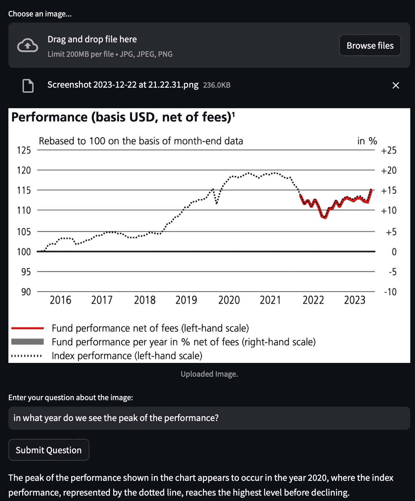
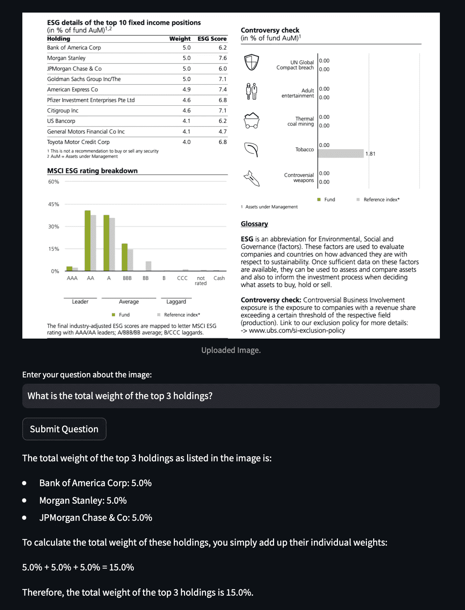
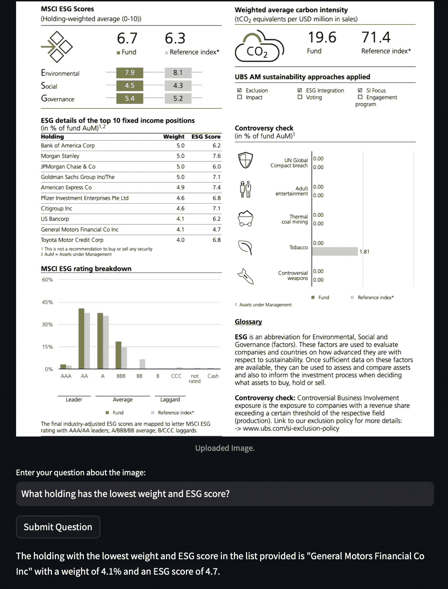

# 闪耀的洞察：GPT 从图表和表格中提取意义

> 原文：[`towardsdatascience.com/illuminating-insights-gpt-extracts-meaning-from-charts-and-tables-a0b71c991d34`](https://towardsdatascience.com/illuminating-insights-gpt-extracts-meaning-from-charts-and-tables-a0b71c991d34)

## 使用 GPT 视觉来解释和汇总图像数据。

[](https://medium.com/@ilia.teimouri?source=post_page-----a0b71c991d34--------------------------------)[](https://towardsdatascience.com/?source=post_page-----a0b71c991d34--------------------------------) [Ilia Teimouri PhD](https://medium.com/@ilia.teimouri?source=post_page-----a0b71c991d34--------------------------------)

·发表于 [Towards Data Science](https://towardsdatascience.com/?source=post_page-----a0b71c991d34--------------------------------) ·阅读时间 7 分钟·2023 年 12 月 24 日

--


照片由 [David Travis](https://unsplash.com/@dtravisphd) 拍摄，发布在 [Unsplash](https://unsplash.com)。

许多领域的专家认为，将图像等视觉输入与文本和语音整合到大型语言模型（LLMs）中，被视为 AI 研究中的一个重要新方向。通过增强这些模型处理除语言之外的多种数据模式，有可能显著拓宽它们的应用范围，同时提高它们在现有自然语言处理任务中的整体智能和性能。

多模态 AI 的前景从更具吸引力的用户体验，如能够感知其周围环境并提及周围物体的对话代理，到能够通过结合语言和视觉知识流畅地将指令转化为物理动作的机器人。通过将历史上分离的 AI 领域统一到一个模型架构中，多模态技术可能会加速依赖多种技能的任务的进展，如视觉问答或图像描述。不同领域的学习算法、数据类型和模型设计之间的协同作用可能会导致快速进步。

许多公司已经以各种形式采纳了多模态技术：[OpenAI](https://chat.openai.com)，[Anthropic](http://claude.ai)，谷歌的 [Bard](https://bard.google.com) 和 [Gemini](https://deepmind.google/technologies/gemini/#introduction) 允许用户上传自己的图像或文本数据并进行聊天。

在这篇文章中，我希望展示大语言模型与计算机视觉在金融领域的一种简单而强大的应用。股票研究员和投资银行分析师可能会发现这特别有用，因为你们可能会花费大量时间阅读包含各种表格和图表的报告和声明。阅读冗长的表格和图表并正确解释它们需要大量时间、领域知识以及足够的专注以避免错误。更繁琐的是，分析师偶尔需要手动从 PDF 中输入表格数据，以便创建新的图表。一个自动化的解决方案可以通过提取和解释关键信息来减轻这些痛苦，而无需人工监督或疲劳。

实际上，通过将自然语言处理与计算机视觉相结合，我们可以创建一个助手来处理许多重复的分析任务，从而让分析师专注于更高级的战略和决策制定。

近年来，在使用 [光学字符识别](https://en.wikipedia.org/wiki/Optical_character_recognition) 或视觉文档理解（[图像转文本](https://huggingface.co/models?pipeline_tag=image-to-text)）从图像/PDF 数据中提取文本方面取得了很多进展。然而，由于当前可用的训练数据的性质，现有方法仍然难以处理许多财务报表、研究报告和监管文件中的复杂布局和格式。

# GPT-4V(ision)用于表格和图表

在 2023 年 9 月，OpenAI 发布了 [GPT-4 Vision](https://openai.com/research/gpt-4v-system-card)。根据 OpenAI 的说法：

> GPT-4 带有视觉功能（GPT-4V）使用户能够指示 GPT-4 分析用户提供的图像输入。

GPT-4V 的视觉能力来自于 GPT-4，因此两个模型的训练方式相似。首先，研究人员向系统输入了大量文本，以教会它语言的基本知识。目标是预测文档中的下一个词。然后是使用一种称为人类反馈强化学习（RLHF）的精细训练方法。这涉及根据人类训练者的积极反应进一步微调模型，以产生我们认为真正有用的输出。

在这篇文章中，我将创建一个 Steamlit 应用程序，用户可以上传图像并询问关于图像的各种问题。我将使用的图像是金融 PDF 文档的截图。实际上，该文档是公开的 [基金事实表](https://www.ubs.com/2/e/files/RET/FS_RET_LU2408467723_GB_EN.pdf)。

代码的主要部分有两个，第一个是一个将图像从给定文件路径编码的函数：

```py
# Function to encode the image from a file path
def encode_image(image_path):
    with open(image_path, "rb") as image_file:
        return base64.b64encode(image_file.read()).decode('utf-8')
```

你需要这个功能，因为模型期望你的输入图像是 base 64 编码格式。接下来的主要代码部分将是你如何将请求发送到 OpenAI 的 API：

```py
# Function to send the request to OpenAI API
def get_image_analysis(api_key, base64_image, question):
    headers = {
        "Content-Type": "application/json",
        "Authorization": f"Bearer {api_key}"
    }

    payload = {
        "model": "gpt-4-vision-preview",
        "messages": [
            {
                "role": "user",
                "content": [
                    {"type": "text", "text": question},
                    {"type": "image_url", "image_url": {"url": f"data:image/jpeg;base64,{base64_image}"}}
                ]
            }
        ],
        "max_tokens": 300
    }

    response = requests.post("https://api.openai.com/v1/chat/completions", headers=headers, json=payload)
    return response.json()['choices'][0]['message']['content']
```

在这里，我们将模型名称设置为`gpt-4-vision-preview`。如你所见，这与通常的文本到文本的 OpenAI API 调用非常不同。在这种情况下，我们定义了一个名为**payload**的 json 对象，其中包含你的文本以及图像数据。

你可以扩展`get_image_analysis`方法，以发送多个图像，或通过`detail`参数控制模型如何处理图像。详细信息请参见[这里](https://platform.openai.com/docs/guides/vision)。

剩余的代码主要是 Streamlit 方法，我们允许用户上传他们的图像，并通过提问与图像互动。

完整代码：（也可以在[Github](https://github.com/iteimouri/GPT-Vision-for-Finance/tree/main)上找到）

```py
import streamlit as st
import os
import requests
import base64
from PIL import Image

# Function to encode the image from a file path
def encode_image(image_path):
    with open(image_path, "rb") as image_file:
        return base64.b64encode(image_file.read()).decode('utf-8')

# Function to save the uploaded file
def save_uploaded_file(directory, file):
    if not os.path.exists(directory):
        os.makedirs(directory)
    file_path = os.path.join(directory, file.name)
    with open(file_path, "wb") as f:
        f.write(file.getbuffer())
    return file_path

# Function to send the request to OpenAI API
def get_image_analysis(api_key, base64_image, question):
    headers = {
        "Content-Type": "application/json",
        "Authorization": f"Bearer {api_key}"
    }

    payload = {
        "model": "gpt-4-vision-preview",
        "messages": [
            {
                "role": "user",
                "content": [
                    {"type": "text", "text": question},
                    {"type": "image_url", "image_url": {"url": f"data:image/jpeg;base64,{base64_image}"}}
                ]
            }
        ],
        "max_tokens": 300
    }

    response = requests.post("https://api.openai.com/v1/chat/completions", headers=headers, json=payload)
    return response.json()['choices'][0]['message']['content']

def main():
    st.title("Image Analysis Application")

    uploaded_file = st.file_uploader("Choose an image...", type=["jpg", "jpeg", "png"], key="file_uploader")

    if uploaded_file is not None:

        file_path = save_uploaded_file('data', uploaded_file)

        # Encode the uploaded image
        base64_image = encode_image(file_path)

        # Session state to store the base64 encoded image
        if 'base64_image' not in st.session_state or st.session_state['base64_image'] != base64_image:
            st.session_state['base64_image'] = base64_image

        image = Image.open(uploaded_file)
        st.image(image, caption='Uploaded Image.', use_column_width=True)

    question = st.text_input("Enter your question about the image:", key="question_input")

    submit_button = st.button("Submit Question")

    api_key = os.getenv("OPENAI_API_KEY")

    if submit_button and question and 'base64_image' in st.session_state and api_key:
        # Get the analysis from OpenAI's API
        response = get_image_analysis(api_key, st.session_state['base64_image'], question)
        st.write(response)
    elif submit_button and not api_key:
        st.error("API key not found. Please set your OpenAI API key.")

if __name__ == "__main__":
    main()
```

# 输出和总结

现在让我们来看几个例子：



图像由作者生成。图表来自公开的[UBS 基金事实说明书](https://www.ubs.com/2/e/files/RET/FS_RET_LU2408467723_GB_EN.pdf)。

在这个例子中，问题是关于性能的峰值。我们可以看到模型正确地识别了峰值。模型还能够理解虚线是图例中的指数表现。在计算机视觉中，理解虚线和点线通常比较困难，但**只要截图质量好**（细节足够），GPT Vision 就可以轻松完成任务。

另一个例子：



图像由作者生成。资料来自公开的[UBS 基金事实说明书](https://www.ubs.com/2/e/files/RET/FS_RET_LU2408467723_GB_EN.pdf)。

在这个例子中，我尝试检验模型在以下方面的表现：1）从其他数据中提取相关表格 2）提取表格的相关部分 3）进行一些基本的数学运算。

如所示，模型成功满足了此任务的所有三个要求——鉴于传统上涉及的复杂性，这并非易事。手动操作时，分析师即使使用光学字符识别（OCR）工具，也很难提取锁定在 PDF 中的双栏表格。还需要额外的编码来将图表解析为结构化的数据框，以便于汇总。这可能会在回答原始问题之前消耗大量时间。然而，在这里，只需一个提示就能实现预期结果。避免了解码图像、抓取数据、处理电子表格和编写脚本的繁琐工作，极大提高了效率。

最后：



图像由作者生成。资料来自公开的[UBS 基金事实说明书](https://www.ubs.com/2/e/files/RET/FS_RET_LU2408467723_GB_EN.pdf)。

排序算法根据指定的排序规则系统地重新排列列表或数组的元素。然而，与传统代码不同，像 GPT 这样的 LLM 没有预定义的排序例程。

相反，GPT 被训练成根据先前的上下文预测序列中的下一个词。通过足够的数据和模型能力，排序能力从学习文本模式中显现出来。

上面的例子说明了这一点——GPT 正确地对从 PDF 截图中提取的表格中的两列进行排序，这是一项复杂的工作，涉及光学字符识别、数据提取和处理技能。即便在 Excel 中，多列排序也需要一定的专业知识。但只需在提示中提供目标，GPT 就能自动处理这些复杂的步骤。

与传统算法遵循严格的逐步指令不同，像 GPT 这样的语言模型通过在训练过程中识别文本中的关系来发展排序能力。这使得它们能够从多样的曝光中吸收各种能力，而不是被预定义的编程所限制。

**为什么这很重要？**

通过将这种灵活性应用于我们在这里看到的专业任务，提示可以解锁高效的问题解决方案，这些方案否则将需要大量的手动工作和技术知识。
