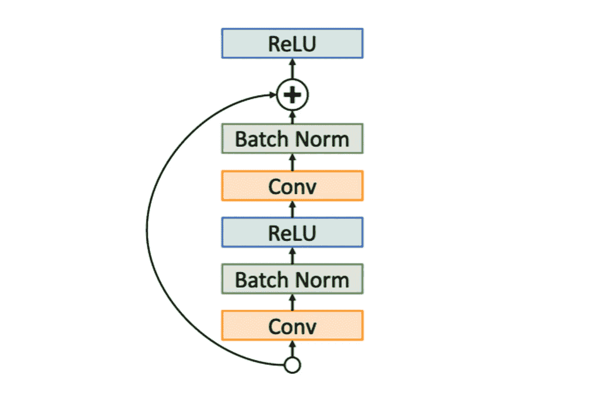

# 初学者的图像分类

> 原文：[`towardsdatascience.com/image-classification-for-beginners-8546aa75f331`](https://towardsdatascience.com/image-classification-for-beginners-8546aa75f331)

## VGG 和 ResNet 架构来自 2014 年

 [Mina Ghashami](https://medium.com/@mina.ghashami?source=post_page-----8546aa75f331--------------------------------)

·发布在[Towards Data Science](https://towardsdatascience.com/?source=post_page-----8546aa75f331--------------------------------) ·10 分钟阅读·2023 年 10 月 17 日

--

图片来源于[unsplash](https://unsplash.com/photos/Sg3XwuEpybU) — 作者修改

图像分类是我在[*Interview Kickstart*](https://www.interviewkickstart.com/)教授的第一个主题，旨在帮助专业人士在顶尖科技公司找到工作。当我准备其中的一次讲座时，我写了这篇文章。因此，如果你对这个主题不熟悉，这个直观的解释可能对你也有帮助。

在这篇文章中，我们探讨了 VGG 和 ResNet 模型；这两者都是卷积神经网络（CNNs）在计算机视觉领域发展中的开创性和影响力巨大的作品。VGG[2] 是 2014 年由牛津大学的研究小组提出的，而 ResNet[3] 是 2015 年由微软研究人员提出的。

让我们开始吧。

# 什么是 VGG？

> **VGG** 代表**视觉几何组**，是牛津大学的一个研究小组。2014 年，他们为图像分类任务设计了一个深度卷积神经网络架构，并以他们的名字命名了它，即 VGG。[2].

## VGG 网络架构

这个网络有几种配置；所有配置的架构相同，只是层数不同。最著名的有 VGG16 和 VGG19。VGG19 比 VGG16 更深，性能更好。为了简化，我们关注 VGG16。

VGG16 的架构如下图所示。正如我们所见，它有 16 层；**13 个卷积层和 3 个全连接层**。

VGG16 架构 — 图片由作者提供

这是一个非常简单的架构；它由 6 个块组成，其中前 5 个块包含卷积层，之后是一个最大池化层，第 6 个块仅包含全连接层。

**所有卷积层使用 3x3 滤波器，步幅为 1**，所有 **最大池化层为 2x2，步幅为 2**，因此它们将输入特征图的宽度和高度减半。这称为 *下采样*，因为它减少了输出特征图的大小。

注意，卷积层从 64 个滤波器开始，并在每次池化后翻倍，直到达到 512 个滤波器。所有卷积层使用“相同”填充以保持输入和输出之间的相同大小，并且它们都使用 RELU 激活函数。下面，我们解释这些概念：

**相同填充**：相同填充是一种填充技术，以确保卷积操作的输出体积具有与输入体积相同的高度和宽度。它通过在所有边缘均匀填充零来工作，使得卷积操作后空间维度保持不变。

**最大池化**：如我们上面所见，在每个块之后应用 2x2 最大池化，步幅为 2。最大池化输出窗口中的最大值。步幅为 2 将空间维度减半，并保留了对强大特征检测至关重要的信息。此外，这种减少带来了计算效率。

**RELU 激活函数**：如我们所提到的，VGG 使用的激活函数是 RELU。RELU 将负值设为零，保持正值不变。它所增加的非线性有助于提升模型的表现力，并有助于检测复杂的模式。VGG 模型在每个卷积层后使用 RELU。

作者提供的图像

让我们逐层了解 VGG16 架构：

+   假设输入是一个彩色图像，其尺寸为高度和宽度，则其大小为（高度，宽度，3）。注意 RGB 有 3 个通道。

+   第一层具有 64 个神经元，并应用 3x3 卷积，具有“相同”填充，因此第一层的输出特征图为（高度，宽度，64）。

+   第二层与第一层相同，因此这一层的输出特征图也为（高度，宽度，64）。

+   第三层是 2x2 最大池化，步幅为 2，因此它将大小缩小到（高度/2，宽度/2，64）

+   第四层和第五层是 conv3–128，具有“相同”填充，因此它们将输出大小更改为（高度/2，宽度/2，128）。

+   第六层再次是 2x2 最大池化，它将输出大小更改为（高度/4，宽度/4，128）。

+   如果我们继续这样下去，我们会发现当数据到达第一个全连接层时，它的形状是（高度/32，宽度/32，512）。因此，我们看到通道的数量从 3 增加到 512，同时高度和宽度减少了 32 倍！！！可以把它想象成压缩信息，而是捕捉通道中的模式。

## VGG 计算成本

VGG16 是 *最大的* CNN 模型之一；它拥有 1.38 亿个参数。在下图中，我们看到 VGG 的两个变体：VGG16（具有 16 层）和 VGG19（具有 19 层）。

图像来自 [[1](https://arxiv.org/pdf/1605.07678.pdf)]

我们看到 VGG16 和 VGG19 在一次前向传播中需要的操作次数是最大的 CNN 模型。注意，操作次数与模型的参数数量成正比。在下一篇文章中，我们将探讨 ResNet[3]模型，它比 VGG 小得多，并且表现优于 VGG。

## 为什么提出了 VGG？

在 VGG 之前，CNN 模型的层数较少，卷积滤波器较大。VGG 网络的提出是为了展示一个只有 3x3 卷积层堆叠在一起的简单 CNN 可以与具有大滤波器的复杂模型一样好。

它还展示了卷积网络中*深度的重要性*。他们表明，堆叠许多小的 3x3 卷积层可以有效模拟较大的感受野。在 VGG 被提出时，它在 ImageNet 数据集上的图像分类任务中超越了所有其他模型。

# ResNet 是什么？

ResNet，即残差网络，是微软研究人员在 2015 年提出的[3]。在深入了解其架构之前，先来看看它为何被提出。

## 为什么提出了 ResNet？

*总而言之，ResNet 的提出是为了解决在非常深的网络中的梯度消失问题。* 让我们更深入地看看：

正如我们在 VGG 的案例中所看到的，*深度*神经网络极其强大。但它们也有更多的参数，因此训练时间较长，计算成本较高。此外，我们还需要更多的训练数据来训练它们。

除了计算成本和训练数据的大小外，训练深度神经网络也面临障碍。正如下图所示，当我们训练浅层神经网络时，训练损失在早期周期中开始减少。但在深度神经网络中，训练损失在早期周期中减少很少，经过几个周期后突然下降。这是深度神经网络实际训练中的一个大障碍。

那么为什么会发生这种情况呢？

浅层和深度神经网络中训练损失随周期减少 —— 图片作者

这发生的原因有两个：

1.  在深度神经网络的早期层中，**梯度消失**问题出现；即，损失的梯度在到达网络的早期层时会消失，因此这些层的参数更新非常少。

1.  在深度神经网络的晚期层中，**原始信号非常少**（即原始输入）。这是为什么呢？因为信号被所有前面层的权重乘以，并通过激活函数，这会将信号推向零。因此，这些层在早期周期的输出几乎是随机噪声。因此，相对于损失的梯度是随机噪声，对这些层参数的更新没有意义。

深度神经网络在前几个训练周期中学习受阻 —— 图片作者

这就是为什么在训练深度神经网络的前几个周期中没有看到太多改进的原因。

> 为了解决这个问题，我们希望找到一种方法，使得输入能够到达后期层，梯度能够到达早期层。我们可以使用跳跃连接来实现这两者。

## 跳跃连接

跳跃连接的理念是将网络层分组到块中，对于每个块，使输入同时通过和绕过该块。像这样：

图片由作者提供

在每个块内，层正常地向前传递它们的数据，而在块之间，我们有一种新类型的连接。

如上所示，这种连接通过将块的输入与块的输出结合起来工作。因此，数据基本上有两个路径流动：一个通过块，另一个绕过块。

所以一个残差块看起来像这样：

残差块 — 图片由作者提供

上面的“+”符号表示“组合”符号，它将输入张量和输出张量结合在一起。它必须是一个不会干扰梯度传递的操作。“+”操作可以是以下任意一种：

1.  两个张量的逐元素相加

1.  两个张量的拼接

> 值得强调的是，残差块之所以被称为“残差”，是因为它实现了一种残差学习方法。每个残差块学习一个相对于其输入的残差函数，而不是直接拟合一个期望的基础映射。

在前馈网络中，我们学习从输入到输出的直接映射，即 *f(x): x->y*。然而，在残差块中，如上所示，每个残差块学习一个残差函数，即 *x->f(x)+x*。**这个残差函数表示需要对输入进行的修改，以获得期望的输出。**

图片来源 [[3](https://arxiv.org/abs/1512.03385)]

## ResNet 更容易训练

由残差块组成的网络称为*残差网络或 ResNet*。它们有几个优势，使得它们更快、更容易训练。

1.  其中之一是每个残差块都会增强数据：由于它们将输入绕过块而不变，残差块的工作不是去判断输入中包含什么重要信息，而是去确定我们可以向输入中添加哪些额外的信息以达到输出。结果发现这是一项更简单的工作。

1.  网络具有更短的梯度路径。由于每个块都有一个绕过块的路径，梯度也会经过这条路径。因此，网络中的任何层都有相对较短的路径，使得损失梯度能够到达。

梯度在两个路径中流动：通过层和绕过块 — 图片由作者提供

## 关于 ResNet 的关注点

关于残差块，有一些关注点，我们在设计残差网络时需要注意：

1.  为了能够添加/连接残差块的输入和输出，我们必须确保两个张量的形状相同。显然，如果我们强制每一层的输出形状与其输入相同，这个问题将不会出现。但是，强制这种约束会限制模型的容量。

1.  如果我们使用连接而不是逐元素相加来组合每个块的输入和输出张量，那么我们将得到一个非常大的张量，并且参数会爆炸。因此，我们不应过度使用连接操作，如果我们的网络很深，必须优先考虑相加。通常，连接操作在一个或两个块中最多使用。

## ResNet 架构

现在我们已经了解了残差块和跳跃连接，ResNet[3] 用于图像分类，通过堆叠多个残差块来构建。我们可以构建超过 100 层的非常深的网络。原始的 ResNet 具有从 18 层到 152 层的变体架构 [3]。

每个残差块由一个卷积层、批量归一化和 RELU 激活函数组成。正如我们在下图中看到的那样，“批量归一化”在每个卷积层之后使用；它通过减去均值并除以标准差来规范化激活。这一操作稳定了训练过程。

残差块 - 作者提供的图像

当 ResNet 被提出时，它在 ImageNet 分类任务上取得了最先进的结果 [3]。

# 要点

**要点 1：** 深层神经网络中的最后几层接收到的输入信号非常少。这是因为每个中间层的激活函数如 sigmoid 或 tanh 对于大的正/负输入会饱和到 0 或 1。这会随着信号通过层而减弱。这被称为“饱和”。

**要点 2：** 深层神经网络的早期层在训练网络的前几个时期接收到的梯度非常少。这是因为在训练过程中，误差梯度通过许多层反向传播，它会指数级地缩小。这使得早期层难以有效学习。这个问题被称为“梯度消失问题”。

**要点 3：** VGG 的提出是为了展示使用简单的 3x3 滤波器的深层网络如何类似于使用大卷积的复杂网络。ResNet 的提出是为了解决非常深层网络中的梯度消失问题。

# 总结

在这篇文章中，我们研究了两个开创性的 CNN 架构，即 VGG 和 ResNet。VGG 是一个深层 CNN，仅包含 3x3 卷积层。它历史上用于图像分类任务，并且在提出时，它在 ImageNet 挑战中优于 AlexNet 和其他竞争模型。它展示了 CNN 中深度的力量，以及使用简单的 3x3 卷积可以类似于更大卷积核的效果。ResNet 在 VGG 之后被引入，并且优于 VGG。ResNet 的创新在于引入了残差块，这使得深层网络的训练变得更容易和更快。

如果你有任何问题或建议，请随时联系我：

电子邮件：mina.ghashami@gmail.com

领英：[`www.linkedin.com/in/minaghashami/`](https://www.linkedin.com/in/minaghashami/)

# 参考文献

1.  [实际应用中的深度神经网络模型分析](https://arxiv.org/pdf/1605.07678.pdf)

1.  [非常深的卷积网络用于大规模图像识别](https://arxiv.org/pdf/1409.1556.pdf)

1.  [深度残差学习用于图像识别](https://arxiv.org/abs/1512.03385)
