# 使用 PyTorch 和 SHAP 进行图像分类：你能信任自动驾驶汽车吗？

> 原文：[`towardsdatascience.com/image-classification-with-pytorch-and-shap-can-you-trust-an-automated-car-4d8d12714eea`](https://towardsdatascience.com/image-classification-with-pytorch-and-shap-can-you-trust-an-automated-car-4d8d12714eea)

## 构建一个目标检测模型，将其与强度阈值进行比较，评估并使用 DeepSHAP 解释它

[](https://conorosullyds.medium.com/?source=post_page-----4d8d12714eea--------------------------------)[](https://towardsdatascience.com/?source=post_page-----4d8d12714eea--------------------------------) [Conor O'Sullivan](https://conorosullyds.medium.com/?source=post_page-----4d8d12714eea--------------------------------)

·发表于[Towards Data Science](https://towardsdatascience.com/?source=post_page-----4d8d12714eea--------------------------------) ·阅读时间 14 分钟·2023 年 3 月 21 日

--

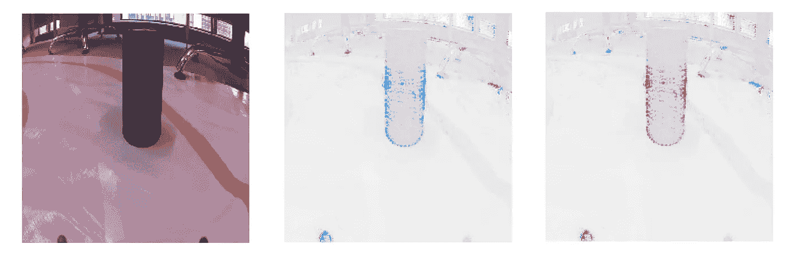

（来源：作者）

如果世界不那么混乱，自驾车将会简单。但事实并非如此。为了避免严重的伤害，AI 必须考虑许多变量——速度限制、交通情况和路上的障碍物（例如分心的人）。AI 需要能够检测这些障碍物，并在遇到时采取适当的行动。

幸运的是，我们的应用并没有那么复杂。更幸运的是，我们将使用锡罐而不是人类。我们将建立一个模型，用于检测迷你自动驾驶汽车前方的障碍物。如果障碍物过于接近，汽车应该**停下**，否则**前进**。

到头来，这是一个二分类问题。为了解决它，我们将：

+   使用强度阈值创建基准

+   使用 PyTorch 构建 CNN

+   使用准确率、精确率和召回率评估模型

+   使用 SHAP 解释模型

我们将看到模型不仅表现良好，而且*其预测方式*也似乎合理。在此过程中，我们将讨论 Python 代码，你可以在[GitHub](https://github.com/conorosully/medium-articles/blob/master/src/image_tools/pytorch_image_classification.ipynb)上找到完整的项目。

# 导入和数据集

```py
# Imports
import numpy as np
import pandas as pd
import matplotlib.pyplot as plt

import glob 
import random 

from PIL import Image
import cv2

import torch
import torch.nn as nn
import torch.nn.functional as F
import torchvision
from torchvision import transforms
from torch.utils.data import DataLoader

import shap
from sklearn import metrics
from sklearn.metrics import precision_recall_fscore_support as score
from sklearn.metrics import ConfusionMatrixDisplay as cmd
```

在图 1 中，你可以看到我们数据集中图像的示例。这些图像的尺寸都是 224 x 224。如果没有黑色罐子或者罐子距离较远，图像被分类为 GO。如果罐子过于接近，图像被分类为 STOP。你可以在[Kaggle](https://www.kaggle.com/datasets/conorsully1/jatracer-images)上找到完整的数据集。

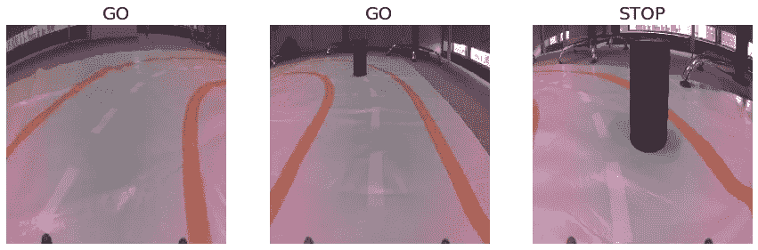

图 1：示例图像（来源：作者）

我们使用下面的代码显示上述图像。注意图像的名称。它总是以一个数字开头。这是**目标变量**。我们用 0 表示 GO，用 1 表示 STOP。

```py
# Paths of example images
ex_paths = ["../../data/object_detection/0_b812cd70-4eff-11ed-9b15-f602a686e36d.jpg",
          "../../data/object_detection/0_d1edcc80-4ef6-11ed-8ddf-a46bb6070c92.jpg",
          "../../data/object_detection/1_cb171726-4ef7-11ed-8ddf-a46bb6070c92.jpg"]

# Plot example images
fig, ax = plt.subplots(1, 3, figsize=(15, 5))
fig.set_facecolor('white')

for i, path in enumerate(ex_paths):

    # Load image
    img =  Image.open(path)

    # Get target
    name = path.split("/")[-1]
    target = int(name.split("_")[0])

    # Plot image
    ax[i].imshow(img)
    ax[i].axis("off")

    # Set title
    title = ["GO","STOP"][target]
    ax[i].set_title(title,size=20)
```

# 基准

在建模之前，值得创建一个基准。这可以提供一些对我们问题的见解。更重要的是，它为我们提供了一个比较模型结果的标准。我们更复杂的深度学习模型应该会优于简单的基准。

在图 1 中，我们可以看到锡罐比周围环境更暗。我们将在创建基准时利用这一点。即，如果图像中有许多暗像素，我们将其分类为 STOP。达到这一点需要几个步骤。对于每个图像，我们将：

1.  进行灰度化，使每个像素的值在 0（黑色）和 255（白色）之间。

1.  使用截止值，将每个像素转换为二进制值——深色像素为 1，浅色像素为 0。

1.  计算平均强度——暗像素的百分比

1.  如果平均强度超过某个百分比，我们将图像分类为 STOP。

合并步骤 1 和 2 是一种图像数据的特征工程方法，称为**强度阈值**。你可以在这篇文章中阅读更多关于此及其他特征工程方法的信息：

[](/feature-engineering-with-image-data-14fe4fcd4353?source=post_page-----4d8d12714eea--------------------------------) ## 图像数据的特征工程

### 裁剪、灰度化、RGB 通道、强度阈值、边缘检测和颜色滤镜

towardsdatascience.com

我们使用下面的函数应用强度阈值。缩放后，一个像素将具有 0（黑色）或 1（白色）的值。对于我们的应用，颠倒这一点是有意义的。也就是说，原本深色的像素将被赋值为 1。

```py
def threshold(img,cutoff,invert=False):
    """Apply intesity thresholding"""

    img = np.array(img)

    # Greyscale image
    img = cv2.cvtColor(img,cv2.COLOR_RGB2GRAY)

    #Apply cutoff
    img[img>cutoff] = 255 #white
    img[img<=cutoff] = 0 #black

    # Scale to 0-1    
    img = img/255

    # Invert image so black = 1
    if invert: 
        img = 1 - img

    return img
```

在图 2 中，你可以看到我们应用强度阈值的一些示例。我们可以调整截止值。较小的截止值意味着我们包括的背景噪声更少。缺点是我们捕捉到的锡罐较少。在这种情况下，我们将使用截止值 60。

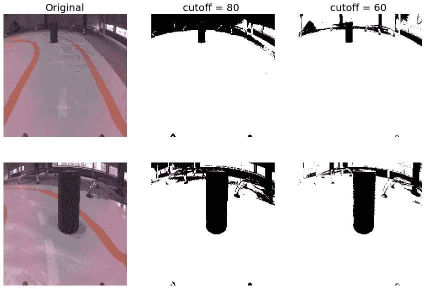

图 2：使用强度阈值的特征工程（来源：作者）

我们加载了所有的图像（第 5 行）和目标变量（第 6 行）。然后，我们对这些图像应用强度阈值（第 9 行）。请注意，我们设置了**invert=True**。最后，我们计算每个处理过的图像的平均强度（第 10 行）。最终，每个图像由一个单一的数字——平均强度来表示。这可以解释为**暗像素的百分比**。

```py
# Load paths
paths = glob.glob("../../data/object_detection/*.jpg")

# Load images and targets
images = [Image.open(path) for path in paths]
target = [int(path.split("/")[-1].split("_")[0]) for path in paths]

# Apply thresholding and get intensity
thresh_img = [threshold(img,60,True) for img in images]
intensity = [np.average(img) for img in thresh_img]
```

图 3 给出了所有标记为 GO 和 STOP 的图像的平均强度箱线图。通常，我们可以看到 STOP 的值更高。这是有道理的——罐子离得更近，因此我们会有更多的暗像素。红线在 6.5% 处。这似乎能很好地分离图像类别。

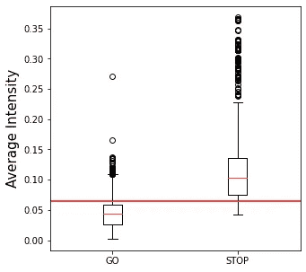

图 3：目标变量的平均强度（来源：作者）

```py
# Split data into go and stop images
go_data = [intensity[i] for i in range(len(target)) if target[i]==0]
stop_data = [intensity[i] for i in range(len(target)) if target[i]==1]
data= [go_data,stop_data]

fig = plt.figure(figsize=(5,5))

# Plot boxplot
plt.boxplot(data)
plt.hlines(y=0.065,xmin=0.5,xmax=2.5,color='r')
plt.xticks([1,2],['GO','STOP'])
plt.ylabel("Average Intensity",size=15)
```

我们使用 6.5% 作为预测的截断值（第 2 行）。即如果暗像素的百分比超过 6.5%，则预测为 STOP（1），否则预测为 GO（0）。其余的代码用于评估这些预测。

```py
# Predict using average intensity
prediction = [1 if i>0.065 else 0 for i in intensity]

# Evaluate
acc = metrics.accuracy_score(target,prediction)
prec,rec,_,_ = score(target, prediction,average='macro')

print('Accuracy: {}'.format(round(acc,4)))
print('Precision: {}'.format(round(prec,4)))
print('Recall: {}'.format(round(rec,4)))

# Plot confusion matrix
cm = metrics.confusion_matrix(target, prediction)
cm_display = cmd(cm, display_labels = ['GO', 'STOP'])

cm_display.plot()
```

最终，我们的准确率为 82%，精确率为 77.1%，召回率为 82.96%。不错！在混淆矩阵中，我们可以看到大多数错误是由于假阳性。这些是被预测为 STOP 的图像，而实际上我们应该 GO。这对应于图 3 的箱线图。查看 GO 强度值在红线以上的长尾。这可能是由于背景像素增加了图像中的暗像素数量。

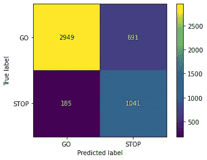

图 4：基准预测的混淆矩阵（来源：作者）

# 卷积神经网络

如果一辆 AI 汽车的准确率只有 82%，你可能会有点担心。那么我们来看看更复杂的解决方案。

## 加载数据集

我们首先定义**ImageDataset**类。这用于加载我们的图像和目标变量。作为参数，我们需要传入所有图像路径的列表和用于转换图像的方法。我们的目标变量将是张量——[1,0] 代表 GO 和 [0,1] 代表 STOP。

```py
class ImageDataset(torch.utils.data.Dataset):
    def __init__(self, paths, transform):

        self.paths = paths
        self.transform = transform

    def __getitem__(self, idx):
        """Get image and target (x, y) coordinates"""

        # Read image
        path = self.paths[idx]
        image = cv2.imread(path, cv2.IMREAD_COLOR)
        image = Image.fromarray(image)

        # Transform image
        image = self.transform(image)

        # Get target
        target = path.split("/")[-1].split("_")[0]
        target = [[1,0],[0,1]][int(target)]

        target = torch.Tensor(target)

        return image, target

    def __len__(self):
        return len(self.paths)
```

我们将使用常见的图像转换。为了帮助创建一个更强大的模型，我们将对颜色进行抖动（第 2 行）。这将随机改变图像的亮度、对比度、饱和度和色调。我们还会对像素值进行归一化（第 4 行）。这将帮助模型收敛。

```py
TRANSFORMS = transforms.Compose([
    transforms.ColorJitter(0.2, 0.2, 0.2, 0.2),
    transforms.ToTensor(),
    transforms.Normalize([0.485, 0.456, 0.406], [0.229, 0.224, 0.225])
])
```

我们加载了所有图像路径（第 1 行）并随机打乱它们（第 4 行）。然后我们为训练数据（第 8 行）和验证数据（第 9 行）创建**ImageDataset**对象。为此我们使用了 80/20 的划分（第 7 行）。最终，我们将在训练集中拥有**3,892**张图像，在验证集中拥有**974**张图像。

```py
paths = glob.glob("../../data/object_detection/*.jpg")

# Shuffle the paths
random.shuffle(paths)

# Create a datasets for training and validation
split = int(0.8 * len(paths))
train_data = ImageDataset(paths[:split], TRANSFORMS)
valid_data = ImageDataset(paths[split:], TRANSFORMS)
```

此时，实际上还没有数据加载到内存中。在我们能够使用数据训练 PyTorch 模型之前，我们需要创建**DataLoader**对象。对于**train_loader**，我们设置了**batch_size=128**。这允许我们迭代所有训练图像，每次加载 128 张。对于验证图像，我们将批处理大小设置为验证集的完整长度。这允许我们一次加载所有 974 张图像。

```py
# Prepare data for Pytorch model
train_loader = DataLoader(train_data, batch_size=128, shuffle=True)
valid_loader = DataLoader(valid_data, batch_size=valid_data.__len__())
```

## 模型架构

接下来，我们定义我们的 CNN 架构。你可以在图 5 中看到这个架构的图示。我们从 224x224x3 的图像张量开始。我们有 3 个卷积层和最大池化层。这将我们缩减到 28x28x64 的张量。接下来是一个 drop-out 层和两个全连接层。我们对所有隐藏层使用 ReLu 激活函数。对于输出节点，我们使用 sigmoid 函数。这是为了使我们的预测值在 0 和 1 之间。

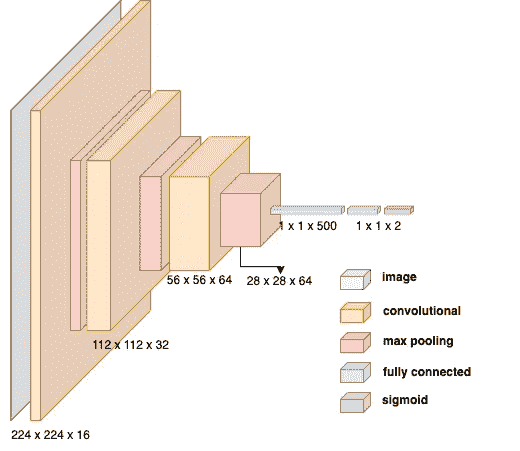

图 5：CNN 架构（来源：作者）

我们在下面的**Net**类中捕捉了这种架构。需要指出的一点是使用了**nn.Sequential()**函数。必须使用这种定义 PyTorch 模型的方法，否则 SHAP 包将无法工作。

```py
class Net(nn.Module):
    def __init__(self):
        super(Net, self).__init__()

        # Convolutional layers
        self.conv_layers = nn.Sequential(
            # Sees 224x224x3 image tensor
            nn.Conv2d(3, #RGB channels
                            16, #number of kernels
                            3, #size of kernels
                            padding=1), 
            nn.MaxPool2d(2),
            nn.ReLU(),

            # Sees 112x112x16 tensor
            nn.Conv2d(16, 32, 3, padding=1),
            nn.MaxPool2d(2),
            nn.ReLU(),

            # Sees 56x56x32 tensor
            nn.Conv2d(32, 64, 3, padding=1),
            nn.MaxPool2d(2),
            nn.ReLU()
        )

        # Fully connected layers
        self.fc_layers = nn.Sequential(
            # Sees flattened 28 * 28 * 64 tensor
            nn.Dropout(0.25),
            nn.Linear(64 * 28 * 28, 500),
            nn.ReLU(),
            nn.Linear(500, 2),
            nn.Sigmoid()
        )

    def forward(self, x):
        x = self.conv_layers(x)
        x = x.view(-1, 64 * 28 * 28)
        x = self.fc_layers(x)
        return x
```

我们创建一个模型对象（第 2 行）。我们将其移动到 GPU 上（第 6–7 行）。我使用的是苹果 M1 笔记本电脑。你需要设置适合你机器的设备。

```py
# create a complete CNN
model = Net()
print(model)

# move tensors to GPU if available
device = torch.device('mps')
model.to(device)
```

我们定义我们的损失函数（第 2 行）。由于我们的目标变量是二元的，我们将使用二元交叉熵损失。最后，我们使用 Adam 作为我们的优化器（第 5 行）。这是用来最小化损失的算法。

```py
# specify loss function (binary cross-entropy)
criterion = nn.BCELoss()

# specify optimizer
optimizer = torch.optim.Adam(model.parameters())
```

## 训练模型

现在是有趣的部分！我们训练我们的模型 20 个周期，并选择验证损失最低的那个。模型可以在同一个[GitHub Repo](https://github.com/conorosully/medium-articles/tree/master/models)中找到。

```py
name = "object_detection_cnn" # Change this to save a new model

# Train the model
min_loss = np.inf
for epoch in range(20):

    model = model.train()
    for images, target in iter(train_loader):

        images = images.to(device)
        target = target.to(device)

        # Zero gradients of parameters
        optimizer.zero_grad()  

        # Execute model to get outputs
        output = model(images)

        # Calculate loss
        loss = criterion(output, target)

        # Run backpropogation to accumulate gradients
        loss.backward()

        # Update model parameters
        optimizer.step()

    # Calculate validation loss
    model = model.eval()

    images, target = next(iter(valid_loader))
    images = images.to(device)
    target = target.to(device)

    output = model(images)
    valid_loss = criterion(output, target)

    print("Epoch: {}, Validation Loss: {}".format(epoch, valid_loss.item()))

    # Save model with lowest loss
    if valid_loss < min_loss:
        print("Saving model")
        torch.save(model, '../../models/{}.pth'.format(name))

        min_loss = valid_loss
```

需要提到的一点是**optimizer.zero_grad()**行。这将所有参数的梯度设置为 0。在每次训练迭代中，我们希望使用仅来自该批次的梯度来更新参数。如果不将梯度清零，它们会积累。这意味着我们将使用新批次和旧批次的梯度组合来更新参数。

## 模型评估

现在让我们看看这个模型的表现如何。我们从加载我们保存的模型开始（第 2 行）。切换到评估模式很重要（第 3 行）。如果我们不这样做，一些模型层（例如 dropout）在推理时会被不正确地使用。

```py
# Load saved model 
model = torch.load('../../models/object_detection_cnn.pth')
model.eval()
model.to(device)
```

我们从验证集中加载图像和目标变量（第 2 行）。请记住，目标变量是维度为 2 的张量。我们获取每个张量的第二个元素（第 4 行）。这意味着我们现在将有一个二元目标变量——1 表示 STOP，0 表示 GO。

```py
# Get images and targets
images, target = next(iter(valid_loader))
images = images.to(device)
target = [int(t[1]) for t in target]
```

我们使用模型对验证图像进行预测（第 2 行）。同样，输出将是维度为 2 的张量。我们考虑第二个元素。如果概率超过 0.5，我们预测 STOP，否则预测 GO。

```py
# Get predictions
output=model(images)
prediction = [1 if o[1] > 0.5 else 0 for o in output]
```

最后，我们使用与评估基准相同的代码将**目标**与**预测**进行比较。我们现在的准确率为 98.05%，精确率为 97.38%，召回率为 97.5%。相比基准有了显著的提升！在混淆矩阵中，你可以看到错误的来源。

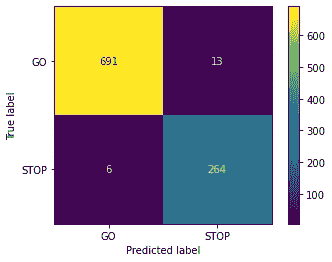

图 6：模型在验证集上的混淆矩阵（来源：作者）

在图 7 中，我们更详细地查看了一些这些错误。第一行显示了一些假阳性。这些是当汽车应该 GO 时被预测为 STOP 的图像。类似地，底行显示了假阴性。

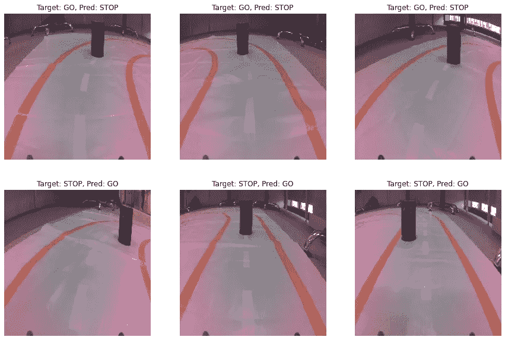

图 7：预测错误的示例（来源：作者）

你可能已经注意到所有障碍物都在相似的距离处。当标记图像时，我们使用了一个截止距离。即当障碍物距离小于这个截止距离时，它被标记为 STOP。上述障碍物都接近这个**截止距离**。它们可能被错误标记，所以当障碍物接近这个截止距离时，模型可能会“困惑”。

# 使用 SHAP 解释模型

我们的模型似乎表现良好。通过了解它如何做出这些预测，我们可以更确定它的效果。为此，我们使用 SHAP。如果你对 SHAP 不熟悉，你可能会发现下面的视频很有用。否则，查看我的[**SHAP 课程**](https://adataodyssey.com/courses/shap-with-python/)**。** 如果你注册我的[**新闻通讯**](https://mailchi.mp/aa82a5ce1dc0/signup)，你可以获得免费访问权 :)

下面的代码计算并显示了我们在图 1 中看到的 3 个示例图像的 SHAP 值。如果你想了解更多关于这段代码如何工作的细节，请查看文末提到的文章。

```py
# Load saved model 
model = torch.load('../../models/object_detection_cnn.pth')

# Use CPU
device = torch.device('cpu')
model = model.to(device)

#Load 100 images for background
shap_loader = DataLoader(train_data, batch_size=100, shuffle=True)
background, _ = next(iter(shap_loader))
background = background.to(device)

#Create SHAP explainer 
explainer = shap.DeepExplainer(model, background)

# Load test images
test_images = [Image.open(path) for path in ex_paths]
test_images = np.array(test_images)

test_input = [TRANSFORMS(img) for img in test_images]
test_input = torch.stack(test_input).to(device)

# Get SHAP values
shap_values = explainer.shap_values(test_input)

# Reshape shap values and images for plotting
shap_numpy = list(np.array(shap_values).transpose(0,1,3,4,2))
test_numpy = np.array([np.array(img) for img in test_images])

shap.image_plot(shap_numpy, test_numpy,show=False)
```

你可以在图 8 中看到输出。前两行是标记为 GO 的图像，第三行为标记为 STOP 的图像。我们有目标张量中每个元素的 SHAP 值。第一列是 GO 预测的 SHAP 值，第二列是 STOP 预测的 SHAP 值。

颜色非常重要。蓝色 SHAP 值告诉我们这些像素减少了预测值。换句话说，它们使得模型预测给定标签的可能性降低。类似地，红色 SHAP 值则增加了这种可能性。

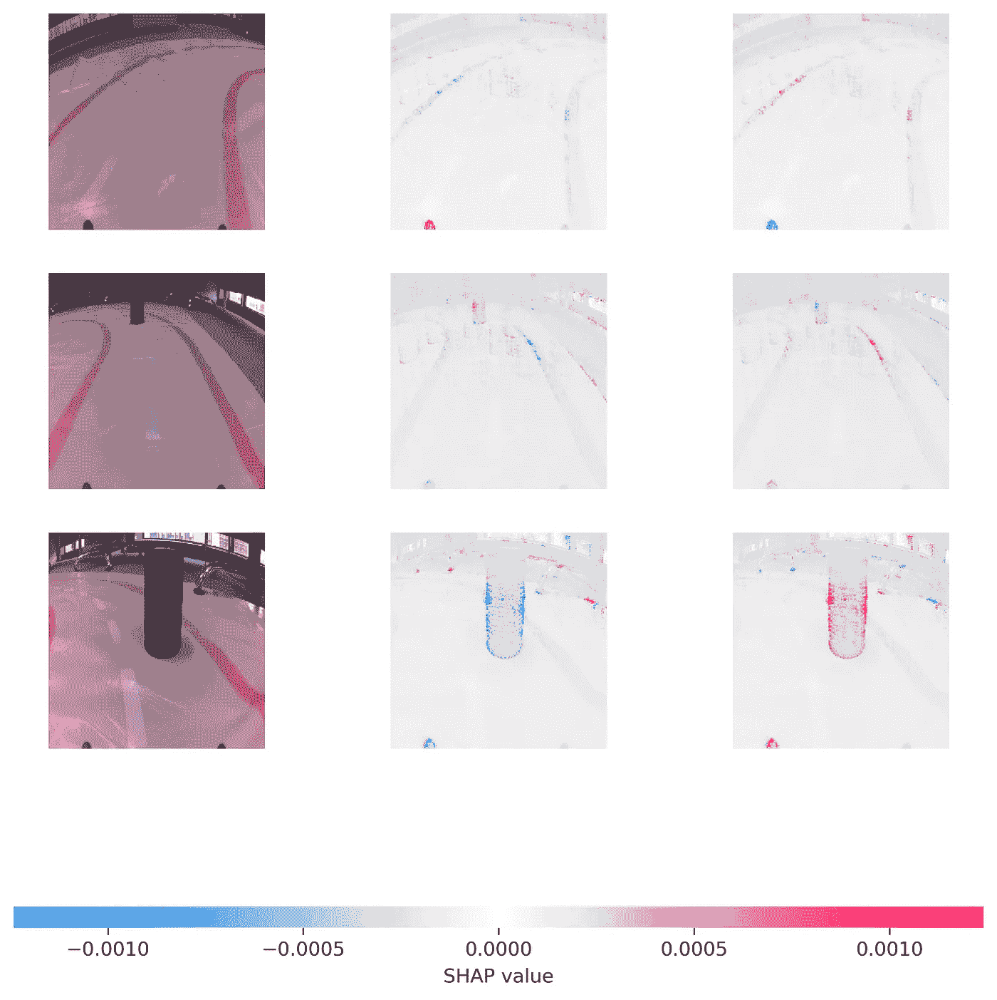

图 8：示例图像的 SHAP 值（来源：作者）

为了理解这一点，让我们关注图 8 的右上角。在图 9 中，我们有标记为 GO 的图像以及 GO 预测的 SHAP 值。你可以看到大多数像素是红色的。这些像素增加了该预测的值，从而导致正确的 GO 预测。你还可以看到像素聚集在障碍物截止位置——罐头的位置，其中标签从 GO 更改为 STOP。

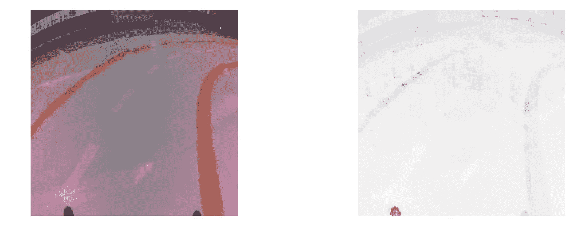

图 9：GO 预测和 GO 标签的 SHAP 值。

在图 10 中，我们可以看到标记为 STOP 的图像的 SHAP 值。罐头在 GO 预测中为蓝色，在 STOP 预测中为红色。换句话说，模型使用罐头中的像素来减少 GO 值并增加 STOP 值。这是有道理的！

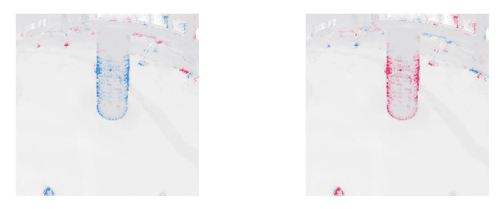

图 10：STOP 预测的 SHAP 值

这个模型不仅能够准确地进行预测，而且它做出这些预测的方式似乎也很合逻辑。然而，你可能注意到一些背景像素被突出显示了。这没有意义。为什么背景对预测如此重要？当我们移除物体或移动到新位置时，背景可能会发生变化。

原因是模型对训练数据过拟合了。这些物体出现在许多图像中。结果是模型将它们与 STOP/GO 标签关联。在下面的文章中，我们进行类似的分析。我们讨论了如何防止这种过拟合的方法。我们还花更多时间解释 SHAP 代码。

[](/using-shap-to-debug-a-pytorch-image-regression-model-4b562ddef30d?source=post_page-----4d8d12714eea--------------------------------) ## 使用 SHAP 调试 PyTorch 图像回归模型

### 使用 DeepShap 来理解和改进支持自动驾驶汽车的模型

towardsdatascience.com

希望你喜欢这篇文章！你可以通过成为我的 [**推荐会员**](https://conorosullyds.medium.com/membership) **:)** 来支持我。

[](https://conorosullyds.medium.com/membership?source=post_page-----4d8d12714eea--------------------------------) [## 使用我的推荐链接加入 Medium — Conor O’Sullivan

### 作为 Medium 会员，你的一部分会员费会分配给你阅读的作者，你将可以完全访问所有故事…

[conorosullyds.medium.com](https://conorosullyds.medium.com/membership?source=post_page-----4d8d12714eea--------------------------------)

| [Twitter](https://twitter.com/conorosullyDS) | [YouTube](https://www.youtube.com/channel/UChsoWqJbEjBwrn00Zvghi4w) | [Newsletter](https://mailchi.mp/aa82a5ce1dc0/signup) — 免费注册以获取 [Python SHAP 课程](https://adataodyssey.com/courses/shap-with-python/)

# 数据集

**JatRacer 图像** (CC0: 公共领域) [`www.kaggle.com/datasets/conorsully1/jatracer-images`](https://www.kaggle.com/datasets/conorsully1/jatracer-images)

# 参考资料

stack overflow，**为什么我们需要在 PyTorch 中调用 zero_grad()？** [`stackoverflow.com/questions/48001598/why-do-we-need-to-call-zero-grad-in-pytorch`](https://stackoverflow.com/questions/48001598/why-do-we-need-to-call-zero-grad-in-pytorch)

[Kenneth Leung](https://medium.com/u/dcd08e36f2d0?source=post_page-----4d8d12714eea--------------------------------)，**如何轻松绘制神经网络架构图**，`towardsdatascience.com/how-to-easily-draw-neural-network-architecture-diagrams-a6b6138ed875`
