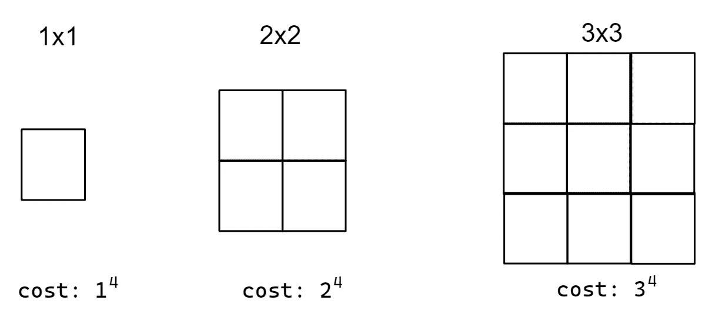
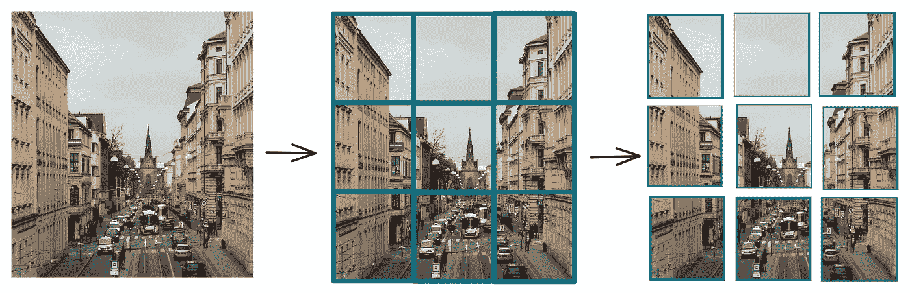
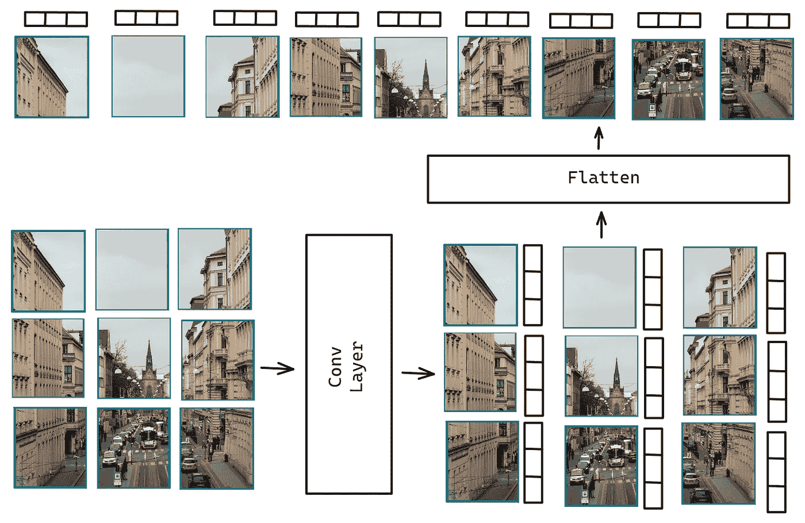
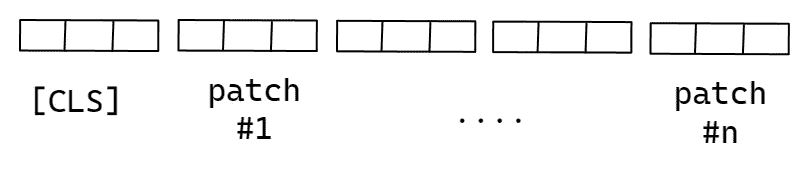
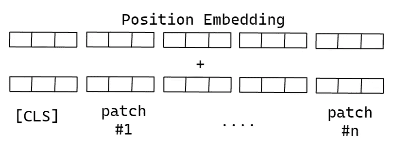
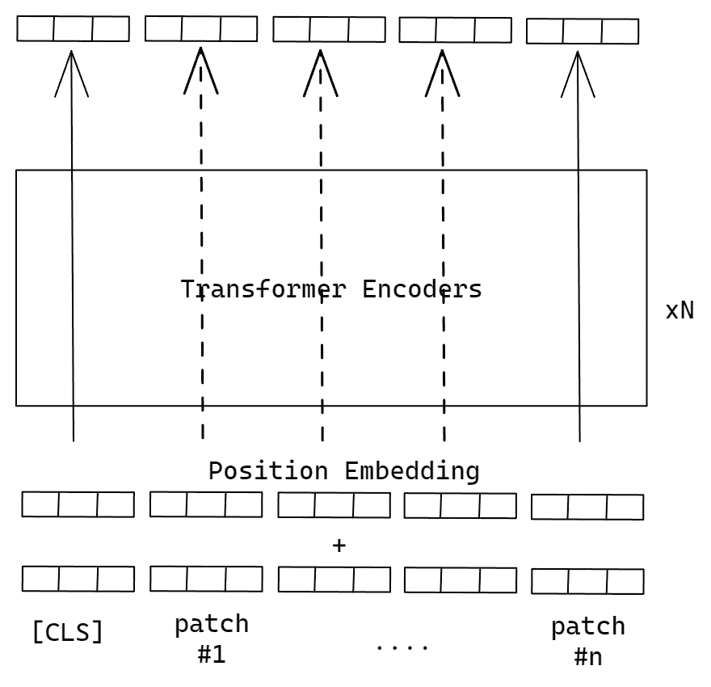
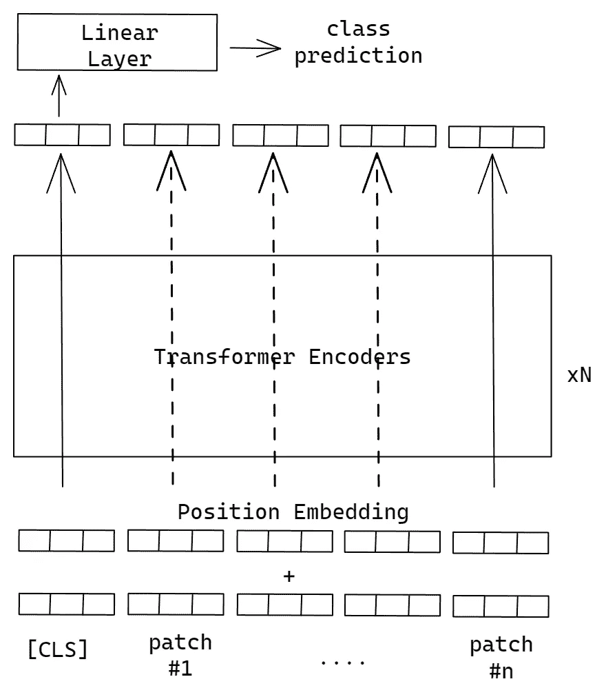
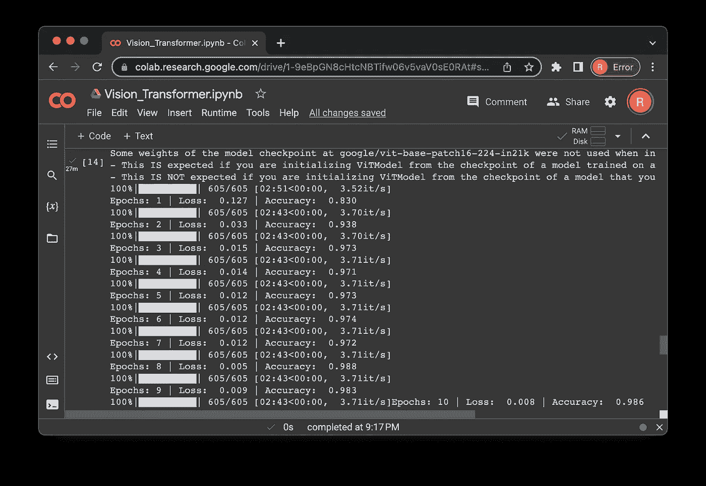

# 使用 Vision Transformer 进行图像分类

> 原文：[`towardsdatascience.com/image-classification-with-vision-transformer-8bfde8e541d4`](https://towardsdatascience.com/image-classification-with-vision-transformer-8bfde8e541d4)

## 如何借助基于 Transformer 的模型进行图像分类

[](https://medium.com/@marcellusruben?source=post_page-----8bfde8e541d4--------------------------------)[](https://towardsdatascience.com/?source=post_page-----8bfde8e541d4--------------------------------) [Ruben Winastwan](https://medium.com/@marcellusruben?source=post_page-----8bfde8e541d4--------------------------------)

·发表于 [Towards Data Science](https://towardsdatascience.com/?source=post_page-----8bfde8e541d4--------------------------------) ·阅读时长 13 分钟·2023 年 4 月 13 日

--


[drmakete lab](https://unsplash.com/@drmakete?utm_source=unsplash&utm_medium=referral&utm_content=creditCopyText) 在 [Unsplash](https://unsplash.com/photos/hsg538WrP0Y?utm_source=unsplash&utm_medium=referral&utm_content=creditCopyText) 上的照片

自 2017 年推出以来，Transformer 已被广泛认可为一种强大的编码器-解码器模型，可以解决几乎所有语言建模任务。

BERT、RoBERTa 和 XLM-RoBERTa 是在语言处理领域使用 Transformer 编码器堆栈作为其架构基础的一些最先进模型的例子。ChatGPT 和 GPT 系列也使用 Transformer 的解码器部分来生成文本。可以肯定地说，几乎所有最先进的自然语言处理模型都在其架构中融入了 Transformer。

Transformer 的表现非常优秀，以至于不把它用于自然语言处理之外的任务（例如计算机视觉）似乎有些浪费。然而，大问题是：我们能否实际将其用于计算机视觉任务？

事实证明，Transformer 也具有应用于计算机视觉任务的良好潜力。在 2020 年，Google Brain 团队推出了一种基于 Transformer 的模型，可以用于解决图像分类任务，称为 Vision Transformer（ViT）。与传统 CNN 在多个图像分类基准上的表现相比，它的表现非常有竞争力。

因此，在本文中，我们将讨论这个模型。具体来说，我们将讨论 ViT 模型如何工作以及如何利用 HuggingFace 库在我们自己的自定义数据集上对其进行微调，以进行图像分类任务。

所以，作为第一步，让我们开始使用本文中将要使用的数据集。

# 关于数据集

我们将使用一个小吃数据集，该数据集可以从 HuggingFace 的`dataset`库中轻松访问。该数据集标注为 CC-BY 2.0 许可证，这意味着你可以自由分享和使用它，只要在你的工作中引用数据集来源即可。

我们来瞧一瞧这个数据集：


数据集中图像的子集

我们只需要几行代码就可以加载数据集，如下所示：

```py
!pip install -q datasets

from datasets import load_dataset 

# Load dataset
dataset = load_dataset("Matthijs/snacks")
print(dataset)

# Output
  '''
  DatasetDict({
      train: Dataset({
          features: ['image', 'label'],
          num_rows: 4838
      })
      test: Dataset({
          features: ['image', 'label'],
          num_rows: 952
      })
      validation: Dataset({
          features: ['image', 'label'],
          num_rows: 955
      })
  })''' 
```

数据集是一个字典对象，由 4898 张训练图像、955 张验证图像和 952 张测试图像组成。

每张图片都有一个标签，属于 20 个小吃类别之一。我们可以通过以下代码检查这 20 种不同的类别：

```py
print(dataset["train"].features['label'].names)

# Output
'''
['apple','banana','cake','candy','carrot','cookie','doughnut','grape',
'hot dog', 'ice cream','juice','muffin','orange','pineapple','popcorn',
'pretzel','salad','strawberry','waffle','watermelon']''' 
```

我们来创建一个标签与其对应索引之间的映射。

```py
# Mapping from label to index and vice versa
labels = dataset["train"].features["label"].names
num_labels = len(dataset["train"].features["label"].names)
label2id, id2label = dict(), dict()
for i, label in enumerate(labels):
    label2id[label] = i
    id2label[i] = label

print(label2id)
print(id2label)

# Output
'''
{'apple': 0, 'banana': 1, 'cake': 2, 'candy': 3, 'carrot': 4, 'cookie': 5, 'doughnut': 6, 'grape': 7, 'hot dog': 8, 'ice cream': 9, 'juice': 10, 'muffin': 11, 'orange': 12, 'pineapple': 13, 'popcorn': 14, 'pretzel': 15, 'salad': 16, 'strawberry': 17, 'waffle': 18, 'watermelon': 19}
{0: 'apple', 1: 'banana', 2: 'cake', 3: 'candy', 4: 'carrot', 5: 'cookie', 6: 'doughnut', 7: 'grape', 8: 'hot dog', 9: 'ice cream', 10: 'juice', 11: 'muffin', 12: 'orange', 13: 'pineapple', 14: 'popcorn', 15: 'pretzel', 16: 'salad', 17: 'strawberry', 18: 'waffle', 19: 'watermelon'}
'''
```

在继续之前，我们需要了解的一件重要事情是每张图像的尺寸是不同的。因此，我们需要在将图像输入模型进行微调之前执行一些图像预处理步骤。

现在我们了解了正在使用的数据集，让我们更详细地了解 ViT 架构。

# ViT 的工作原理

在 ViT 引入之前，Transformer 模型依赖自注意力机制，这给我们在计算机视觉任务中使用它带来了很大的挑战。

自注意力机制是 Transformer 模型能够区分一个词在不同上下文中语义的原因。例如，BERT 模型能够通过自注意力机制区分词语*‘park’*在句子*‘They park their car in the basement’*和*‘She walks her dog in a park’*中的含义。*

但是，自注意力有一个问题：这是一个计算开销大的操作，因为它要求每个标记关注序列中的每个其他标记。

现在，如果我们在图像数据上使用自注意力机制，那么图像中的每个像素都需要关注并与每个其他像素进行比较。问题是，如果我们将像素值增加一个，那么计算成本将会呈二次增长。如果图像分辨率较大，这显然是不可行的。



图片由作者提供

为了解决这个问题，ViT 引入了将输入图像拆分为图像块的概念。每个图像块的尺寸为 16 x 16 像素。假设我们有一张 48 x 48 像素的图像，那么图像块将会像这样：



图片由作者提供

在实际应用中，ViT 有两种选项来将我们的图像拆分成图像块：

1.  将我们的输入图像（大小为`height x width x channel`）重塑为一个展平的 2D 图像块序列，大小为`no.of patches x (patch_size².channel)`。然后，我们将展平的图像块投影到一个基本的线性层中，以获得每个图像块的嵌入表示。

1.  将我们的输入图像投影到卷积层中，卷积核的大小和步幅等于补丁大小。然后，我们将该卷积层的输出展平。

在对多个数据集测试模型性能后，结果表明第二种方法具有更好的性能。因此，在本文中，我们将使用第二种方法。

让我们用一个简单的例子来演示如何使用卷积层将输入图像拆分成补丁。

```py
import torch
import torch.nn as nn

# Create toy image with dim (batch x channel x width x height)
toy_img = torch.rand(1, 3, 48, 48)

# Define conv layer parameters
num_channels = 3
hidden_size = 768 #or emb_dimension
patch_size = 16

# Conv 2D layer
projection = nn.Conv2d(num_channels, hidden_size, kernel_size=patch_size, 
             stride=patch_size)

# Forward pass toy img
out_projection = projection(toy_img)

print(f'Original image size: {toy_img.size()}')
print(f'Size after projection: {out_projection.size()}')

# Output
'''
Original image size: torch.Size([1, 3, 48, 48])
Size after projection: torch.Size([1, 768, 3, 3])
'''
```

模型接下来会将补丁展平，并按顺序排列，如下图所示：



作者提供的图片

我们可以使用以下代码进行展平处理：

```py
# Flatten the output after projection with Conv2D layer

patch_embeddings = out_projection.flatten(2).transpose(1, 2)
print(f'Patch embedding size: {patch_embeddings.size()}')

# Output
'''
Patch embedding size: torch.Size([1, 9, 768]) #[batch, no. of patches, emb_dim]
'''
```

我们在展平处理后得到的基本上是每个补丁的向量嵌入。这类似于许多基于 Transformer 的语言模型中的标记嵌入。

接下来，类似于 BERT，ViT 将在我们补丁序列的第一个位置添加一个特殊的**[CLS]**向量嵌入。



作者提供的图片

```py
# Define [CLS] token embedding with the same emb dimension as the patches
batch_size = 1
cls_token = nn.Parameter(torch.randn(1, 1, hidden_size))
cls_tokens = cls_token.expand(batch_size, -1, -1)

# Prepend [CLS] token in the beginning of patch embedding
patch_embeddings = torch.cat((cls_tokens, patch_embeddings), dim=1)
print(f'Patch embedding size: {patch_embeddings.size()}')

# Output
'''
Patch embedding size: torch.Size([1, 10, 768]) #[batch, no. of patches+1, emb_dim]
'''
```

如你所见，通过在补丁嵌入的开头添加**[CLS]**标记嵌入，序列的长度增加了一个。接下来的最后一步是将位置嵌入添加到我们的补丁序列中。这一步很重要，以便我们的 ViT 模型可以学习补丁的序列顺序。

这个位置嵌入是一个可学习的参数，将在训练过程中由模型更新。



作者提供的图片

```py
# Define position embedding with the same dimension as the patch embedding
position_embeddings = nn.Parameter(torch.randn(batch_size, 10, hidden_size))

# Add position embedding into patch embedding
input_embeddings = patch_embeddings + position_embeddings
print(f'Input embedding size: {input_embeddings.size()}')

# Output
'''
Input embedding size: torch.Size([1, 10, 768]) #[batch, no. of patches+1, emb_dim]
'''
```

现在，每个补丁的位置信息加上向量嵌入将作为一组 Transformer 编码器的输入。Transformer 编码器的数量取决于你使用的 ViT 模型类型。总体上，有三种类型的 ViT 模型：

+   **ViT-base：**它具有 12 层，隐藏大小为 768，总参数量为 86M。

+   **ViT-large：**它具有 24 层，隐藏大小为 1024，总参数量为 307M。

+   **ViT-huge：**它具有 32 层，隐藏大小为 1280，总参数量为 632M。

在以下代码片段中，假设我们想使用**Vit-base**。这意味着我们有 12 层 Transformer 编码器：

```py
# Define parameters for ViT-base (example)
num_heads = 12
num_layers = 12

# Define Transformer encoders' stack
transformer_encoder_layer = nn.TransformerEncoderLayer(
           d_model=hidden_size, nhead=num_heads,
           dim_feedforward=int(hidden_size * 4),
           dropout=0.1)
transformer_encoder = nn.TransformerEncoder(
           encoder_layer=transformer_encoder_layer,
           num_layers=num_layers)

# Forward pass
output_embeddings = transformer_encoder(input_embeddings)
print(f' Output embedding size: {output_embeddings.size()}')

# Output
'''
Output embedding size: torch.Size([1, 10, 768])
'''
```

最后，Transformer 编码器堆叠将输出每个图像补丁的最终向量表示。最终向量的维度对应于我们使用的 ViT 模型的隐藏大小。



作者提供的图片

就是这些了。

我们当然可以从头开始构建和训练自己的 ViT 模型。然而，与其他基于 Transformer 的模型一样，ViT 需要在大量图像数据（14M-300M 图像）上进行训练，以便在未见过的数据上具有良好的泛化能力。

如果我们想在自定义数据集上使用 ViT，最常见的方法是微调预训练模型。最简单的方法是利用 HuggingFace 库。我们只需调用`ViTModel.from_pretrained()`方法，并将预训练模型的路径作为参数传递即可。HuggingFace 的`VitModel()`类还将作为我们上述所有步骤的封装器。

```py
!pip install transformers

from transformers import ViTModel

# Load pretrained model
model_checkpoint = 'google/vit-base-patch16-224-in21k'
model = ViTModel.from_pretrained(model_checkpoint, add_pooling_layer=False)

# Example input image
input_img = torch.rand(batch_size, num_channels, 224, 224)

# Forward pass input image
output_embedding = model(input_img)
print(output_embedding)
print(f"Ouput embedding size: {output_embedding['last_hidden_state'].size()}")

# Output
'''
BaseModelOutputWithPooling(last_hidden_state=tensor([[[ 0.0985, -0.2080,  0.0727,  ...,  0.2035,  0.0443, -0.3266],
         [ 0.1899, -0.0641,  0.0996,  ..., -0.0209,  0.1514, -0.3397],
         [ 0.0646, -0.3392,  0.0881,  ..., -0.0044,  0.2018, -0.3038],
         ...,
         [-0.0708, -0.2932, -0.1839,  ...,  0.1035,  0.0922, -0.3241],
         [ 0.0070, -0.3093, -0.0217,  ...,  0.0666,  0.1672, -0.4103],
         [ 0.1723, -0.1037,  0.0317,  ..., -0.0571,  0.0746, -0.2483]]],
       grad_fn=<NativeLayerNormBackward0>), pooler_output=None, hidden_states=None, attentions=None)

Output embedding size: torch.Size([1, 197, 768])
'''
```

完整 ViT 模型的输出是一个向量嵌入，表示每个图像补丁加上**[CLS]**标记。其维度为`[batch_size, image_patches+1, hidden_size]`。

要执行图像分类任务，我们遵循与 BERT 模型相同的方法。我们提取**[CLS]**标记的输出向量嵌入，并通过最终的线性层来确定图像的类别。



作者提供的图片

```py
num_labels = 20

# Define linear classifier layer
classifier = nn.Linear(hidden_size, num_labels) 

# Forward pass on the output embedding of [CLS] token
output_classification = classifier(output_embedding['last_hidden_state'][:, 0, :])
print(f"Output embedding size: {output_classification.size()}")

# Output
'''
Output embedding size: torch.Size([1, 20]) #[batch, no. of labels]
'''
```

# 微调实现

在本节中，我们将微调一个在 ImageNet-21K 数据集上进行过预训练的**ViT-base**模型，该数据集包含约 1400 万张图像和 21,843 个类别。数据集中的每张图像的尺寸为 224 x 224 像素。

首先，我们需要定义预训练模型的检查点路径，并加载必要的库。

```py
import numpy as np
import torch
import cv2
import torch.nn as nn
from transformers import ViTModel, ViTConfig
from torchvision import transforms
from torch.optim import Adam
from torch.utils.data import DataLoader
from tqdm import tqdm

#Pretrained model checkpoint
model_checkpoint = 'google/vit-base-patch16-224-in21k'
```

## 图像数据加载器

如前所述，ViT-base 模型已在包含 224 x 224 像素尺寸图像的数据集上进行过预训练。这些图像还根据其每个颜色通道的特定均值和标准差进行了归一化。

因此，在我们将自己的数据集输入 ViT 模型进行微调之前，我们必须首先对图像进行预处理。这包括将每张图像转换为张量，将其调整到适当的尺寸，然后使用与模型预训练数据集相同的均值和标准差值进行归一化。

```py
class ImageDataset(torch.utils.data.Dataset):

  def __init__(self, input_data):

      self.input_data = input_data
      # Transform input data
      self.transform = transforms.Compose([
        transforms.ToTensor(),
        transforms.Resize((224, 224), antialias=True),
        transforms.Normalize(mean=[0.5, 0.5, 0.5], 
                             std=[0.5, 0.5, 0.5])
        ])

  def __len__(self):
      return len(self.input_data)

  def get_images(self, idx):
      return self.transform(self.input_data[idx]['image'])

  def get_labels(self, idx):
      return self.input_data[idx]['label']

  def __getitem__(self, idx):
      # Get input data in a batch
      train_images = self.get_images(idx)
      train_labels = self.get_labels(idx)

      return train_images, train_labels
```

从上面的图像数据加载器中，我们将获取一批预处理过的图像及其对应的标签。我们可以使用上述图像数据加载器的输出作为微调过程中模型的输入。

## 模型定义

我们的 ViT 模型架构非常简单。由于我们将微调一个预训练模型，我们可以使用`VitModel.from_pretrained()`方法，并提供模型的检查点作为参数。

我们还需要在最后添加一个线性层，作为最终的分类器。这个层的输出应该等于数据集中不同标签的数量。

```py
class ViT(nn.Module):

  def __init__(self, config=ViTConfig(), num_labels=20, 
               model_checkpoint='google/vit-base-patch16-224-in21k'):

        super(ViT, self).__init__()

        self.vit = ViTModel.from_pretrained(model_checkpoint, add_pooling_layer=False)
        self.classifier = (
            nn.Linear(config.hidden_size, num_labels) 
        )

  def forward(self, x):

    x = self.vit(x)['last_hidden_state']
    # Use the embedding of [CLS] token
    output = self.classifier(x[:, 0, :])

    return output
```

上述 ViT 模型为每个图像补丁和**[CLS]**标记生成最终的向量嵌入。为了对图像进行分类，如上所示，我们提取**[CLS]**标记的最终向量嵌入，并将其传递给最终的线性层以获得最终的类别预测。

## 模型微调

现在我们已经定义了模型架构并准备了输入图像用于批处理过程，我们可以开始微调我们的 ViT 模型。训练脚本是一个标准的 Pytorch 训练脚本，如下所示：

```py
def model_train(dataset, epochs, learning_rate, bs):

    use_cuda = torch.cuda.is_available()
    device = torch.device("cuda" if use_cuda else "cpu")

    # Load nodel, loss function, and optimizer
    model = ViT().to(device)
    criterion = nn.CrossEntropyLoss().to(device)
    optimizer = Adam(model.parameters(), lr=learning_rate)

    # Load batch image
    train_dataset = ImageDataset(dataset)
    train_dataloader = DataLoader(train_dataset, num_workers=1, batch_size=bs, shuffle=True)

    # Fine tuning loop
    for i in range(epochs):
        total_acc_train = 0
        total_loss_train = 0.0

        for train_image, train_label in tqdm(train_dataloader):
            output = model(train_image.to(device))
            loss = criterion(output, train_label.to(device))
            acc = (output.argmax(dim=1) == train_label.to(device)).sum().item()
            total_acc_train += acc
            total_loss_train += loss.item()

            loss.backward()
            optimizer.step()
            optimizer.zero_grad()

        print(f'Epochs: {i + 1} | Loss: {total_loss_train / len(train_dataset): .3f} | Accuracy: {total_acc_train / len(train_dataset): .3f}')

    return model

# Hyperparameters
EPOCHS = 10
LEARNING_RATE = 1e-4
BATCH_SIZE = 8

# Train the model
trained_model = model_train(dataset['train'], EPOCHS, LEARNING_RATE, BATCH_SIZE)
```

由于我们的零食数据集有 20 个不同的类别，因此我们面临的是一个多类分类问题。因此，`CrossEntropyLoss()`将是合适的损失函数。在上面的示例中，我们训练了模型 10 个周期，学习率设置为 1e-4，批量大小为 8。你可以调整这些超参数以优化模型的性能。

训练模型后，你将得到一个类似下面的输出：



图片由作者提供

## 模型预测

既然我们已经微调了模型，自然希望将其用于测试数据的预测。为此，首先创建一个函数来封装所有必要的图像预处理步骤和模型推理过程。

```py
def predict(img):

    use_cuda = torch.cuda.is_available()
    device = torch.device("cuda" if use_cuda else "cpu")
    transform = transforms.Compose([
        transforms.ToTensor(),
        transforms.Resize((224, 224)),
        transforms.Normalize(mean=[0.5, 0.5, 0.5], 
                             std=[0.5, 0.5, 0.5])
        ])

    img = transform(img)
    output = trained_model(img.unsqueeze(0).to(device))
    prediction = output.argmax(dim=1).item()

    return id2label[prediction]
```

正如你所见，上面显示的推理过程中的图像预处理步骤与我们在训练数据上进行的步骤完全相同。然后，我们将变换后的图像作为输入传递给训练好的模型，最后将其预测映射到相应的标签。

如果我们想对测试数据中的特定图像进行预测，我们只需调用上述函数，之后我们会得到预测结果。让我们试试看。

```py
print(predict(dataset['test'][900]['image']))
# Output: waffle
```


数据集中的测试数据示例

我们的模型正确预测了我们的测试图像。让我们尝试另一张。

```py
print(predict(dataset['test'][250]['image']))
# Output: cookie
```


数据集中的测试数据示例

我们的模型再次正确地预测了测试数据。通过微调 ViT 模型，我们可以在自定义数据集上获得良好的性能。你也可以对任何自定义数据集执行相同的过程，用于图像分类任务。

# 结论

在本文中，我们已经看到 Transformer 不仅可以用于语言建模任务，还可以用于计算机视觉任务，在本例中是图像分类。

为了做到这一点，首先将输入图像分解成大小为 16 x 16 像素的补丁。然后，Vision Transformer 模型利用一系列 Transformer 编码器来学习每个图像补丁的向量表示。最后，我们可以使用图像补丁序列开头的**[CLS]**标记的最终向量表示来预测输入图像的标签。

我希望这篇文章对你开始使用 Vision Transformer 模型有所帮助。与往常一样，你可以在[**这个笔记本**](https://github.com/marcellusruben/medium-resources/blob/main/ViT/Vision_Transformer.ipynb)中找到本文中展示的代码实现。

# 数据集参考

[`huggingface.co/datasets/Matthijs/snacks`](https://huggingface.co/datasets/Matthijs/snacks)
