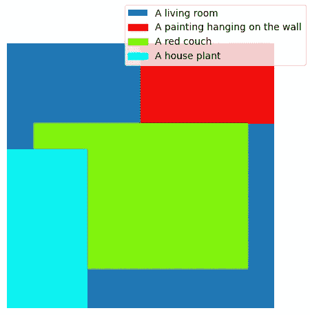

# 使用预训练扩散模型进行图像合成

> 原文：[`towardsdatascience.com/image-composition-with-pre-trained-diffusion-models-772cd01b5022?source=collection_archive---------5-----------------------#2023-07-12`](https://towardsdatascience.com/image-composition-with-pre-trained-diffusion-models-772cd01b5022?source=collection_archive---------5-----------------------#2023-07-12)

## 一种提高对预训练文本到图像扩散模型生成图像的控制的方法

 [Gabriele Sgroi, PhD](https://medium.com/@gabrielesgroi94?source=post_page-----772cd01b5022--------------------------------)

·

[关注](https://medium.com/m/signin?actionUrl=https%3A%2F%2Fmedium.com%2F_%2Fsubscribe%2Fuser%2F97ea0c34751b&operation=register&redirect=https%3A%2F%2Ftowardsdatascience.com%2Fimage-composition-with-pre-trained-diffusion-models-772cd01b5022&user=Gabriele+Sgroi%2C+PhD&userId=97ea0c34751b&source=post_page-97ea0c34751b----772cd01b5022---------------------post_header-----------) 发表在 [Towards Data Science](https://towardsdatascience.com/?source=post_page-----772cd01b5022--------------------------------) ·8 分钟阅读·2023 年 7 月 12 日

--

使用文章中描述的方法生成的稳定扩散图像。图片由作者提供。

文本到图像的扩散模型在生成符合自然语言描述的逼真图像方面取得了惊人的表现。开源预训练模型的发布，例如**稳定扩散**，促进了这些技术的民主化。预训练扩散模型使任何人都可以创造出令人惊叹的图像，而不需要大量计算能力或漫长的训练过程。

尽管文本引导的图像生成提供了控制水平，但即使有大量提示，获得具有预定组成的图像仍然很棘手。实际上，标准的文本到图像扩散模型对生成图像中将描绘的各种元素几乎没有控制。

在这篇文章中，我将解释一种基于论文[MultiDiffusion: Fusing Diffusion Paths for Controlled Image Generation](https://arxiv.org/abs/2302.08113)的最新技术。这种技术使得在由文本引导的扩散模型生成的图像中放置元素的控制更为精确。论文中提出的方法更为通用，还可以用于其他应用，如生成全景图像，但我将在这里限制讨论图像组成性，使用基于区域的文本提示。该方法的主要优点是可以与开箱即用的预训练扩散模型一起使用，无需昂贵的重新训练或微调。

为了补充这篇文章的代码，我准备了一个简单的[Colab notebook](https://colab.research.google.com/drive/1MzzGN5FJNqlJESuO5FigYC8eoOfwzplO?usp=sharing)和一个[GitHub 仓库](https://github.com/GabrieleSgroi/image_composition_diffusion)，其中包含了我用于生成本文中图像的代码实现。该代码基于 Hugging Face 的[diffusers library](https://github.com/huggingface/diffusers)中的稳定扩散管道，但只实现了其功能所需的部分，使其更简单易读。

# 扩散模型

在这一部分中，我将回顾一些关于扩散模型的基本事实。扩散模型是生成模型，通过逆转*扩散过程*来生成新数据，该过程将数据分布映射到各向同性的高斯分布。更具体地说，给定一个图像，扩散过程包括一系列步骤，每一步都向图像中添加少量高斯噪声。在无限多步的极限下，噪声图像将与从各向同性高斯分布中采样的纯噪声无法区分。

扩散模型的目标是通过尝试猜测扩散过程中的步骤 t-1 处的噪声图像来逆转这一过程，给定步骤 t 处的噪声图像。例如，可以通过训练一个神经网络来预测该步骤添加的噪声，并将其从噪声图像中减去来实现这一目标。

一旦我们训练好这样一个模型，就可以通过从各向同性的高斯分布中采样噪声来生成新图像，并使用模型通过逐渐去除噪声来逆转扩散过程。

扩散模型的目标是学习所有时间步 t 的概率 q(x(t-1)|x(t))。图像来自论文：[Denoising Diffusion Probabilistic Models](https://arxiv.org/abs/2006.11239)。

文本到图像扩散模型反转扩散过程，试图达到与文本提示描述相对应的图像。这通常是通过神经网络完成的，该网络在每一步 t 预测步骤 t-1 的噪声图像，条件不仅是步骤 t 的噪声图像，还包括描述其试图重建的图像的文本提示。

许多图像扩散模型，包括稳定扩散，不是在原始图像空间中操作，而是在一个较小的学习*潜空间*中操作。通过这种方式，可以在最小质量损失的情况下减少所需的计算资源。潜空间通常通过*变分自编码器*来学习。潜空间中的扩散过程与之前完全相同，允许从高斯噪声生成新的潜向量。从这些向量中，可以使用变分自编码器的解码器获得新生成的图像。

# 使用 MultiDiffusion 进行图像组合

现在让我们转向解释如何使用 MultiDiffusion 方法获得可控图像组合。目标是通过预训练的文本到图像扩散模型更好地控制生成图像中的元素。具体而言，给定图像的一般描述（例如封面图像中的客厅），我们希望一系列通过文本提示指定的元素出现在特定位置（例如中心的红色沙发，左侧的盆栽和右上角的画作）。这可以通过提供一组描述所需元素的文本提示和一组基于区域的二进制掩码来实现，该掩码指定了元素必须描绘在其中的位置。例如，下面的图像包含封面图像中图像元素的边界框。

生成封面图像所用的边界框和提示。图像由作者提供。

[MultiDiffusion](https://arxiv.org/pdf/2302.08113.pdf)用于可控图像生成的核心思想是将多个扩散过程结合在一起，针对不同指定的提示，以获得在预定区域显示每个提示内容的连贯和平滑图像。与每个提示关联的区域通过与图像相同尺寸的二进制掩码来指定。如果提示必须在该位置描绘，则掩码的像素设为 1，否则设为 0。

更具体地说，我们用 t 表示在潜在空间中运行的扩散过程中的一个通用步骤。给定时间步 t 的噪声潜在向量，模型将预测每个指定文本提示的噪声。从这些预测的噪声中，我们通过从时间步 t 的前一个潜在向量中去除每个预测噪声，获得时间步 t-1 的一组潜在向量（每个提示一个）。为了获得扩散过程下一时间步的输入，我们需要将这些不同的向量组合在一起。这可以通过将每个潜在向量乘以相应的提示掩码，然后按掩码加权取每像素的平均值来完成。按照这个程序，在特定掩码指定的区域内，潜在向量将遵循由相应局部提示引导的扩散过程轨迹。在每一步将潜在向量组合在一起后，再预测噪声，可以确保生成图像的全球一致性以及不同掩码区域之间的平滑过渡。

MultiDiffusion 在扩散过程开始时引入了一个自举阶段，以更好地遵循紧密的掩码。在这些初步步骤中，与不同提示相对应的去噪潜在向量不会被组合在一起，而是与一些对应于常色背景的噪声潜在向量结合在一起。通过这种方式，由于布局通常在扩散过程早期就已经确定，因此可以在模型最初只专注于掩码区域来描绘提示的情况下，获得与指定掩码更好的匹配。

# 示例

在本节中，我将展示该方法的一些应用。我使用了 HuggingFace 托管的预训练 [stable diffusion 2](https://huggingface.co/stabilityai/stable-diffusion-2-base) 模型创建了本文中的所有图像，包括封面图像。

正如讨论的那样，该方法的一个直接应用是获得包含在预定义位置生成的元素的图像。

边界框。图片由作者提供。

使用上述边界框生成的图像。图片由作者提供。

该方法允许指定单个元素的风格或其他属性。这可以用于例如在模糊背景上获得清晰的图像。

模糊背景的边界框。图片由作者提供。

使用上述边界框生成的图像。图片由作者提供。

元素的风格也可以非常不同，带来令人惊叹的视觉效果。例如，下面的图像是通过将高质量照片风格与梵高风格的画作混合获得的。

不同风格的边界框。图片由作者提供。

使用上述边界框生成的图像。图像由作者提供。

# 结论

在这篇文章中，我们探讨了一种结合不同扩散过程的方法，以提高对由文本条件扩散模型生成的图像的控制能力。该方法增强了对图像中元素生成位置的控制，并且能够无缝地结合以不同风格描绘的元素。

描述的程序的主要优点之一是它可以与预训练的文本到图像扩散模型一起使用，而无需进行通常较为昂贵的微调。另一个优势是可控图像生成通过二进制掩码实现，这比更复杂的条件设置更容易指定和处理。

这种技术的主要缺点是，在每个扩散步骤中需要为每个提示进行一次神经网络传递，以预测相应的噪声。幸运的是，这些操作可以批量进行，以减少推断时间开销，但代价是更大的 GPU 内存使用。此外，有时一些提示（特别是仅在图像小部分中指定的提示）会被忽视或覆盖的区域比相应掩码指定的区域要大。虽然可以通过引导步骤来缓解这个问题，但过多的引导步骤可能会显著降低图像的整体质量，因为可以用来协调元素的步骤减少了。

值得一提的是，结合不同扩散过程的想法并不限于本文描述的内容，它还可以用于其他应用，例如论文中描述的全景图像生成[MultiDiffusion: Fusing Diffusion Paths for Controlled Image Generation](https://arxiv.org/abs/2302.08113)。

希望你喜欢这篇文章，如果你想深入了解技术细节，可以查看这个[Colab 笔记本](https://colab.research.google.com/drive/1MzzGN5FJNqlJESuO5FigYC8eoOfwzplO?usp=sharing)和[GitHub 仓库](https://github.com/GabrieleSgroi/image_composition_diffusion)的代码实现。
