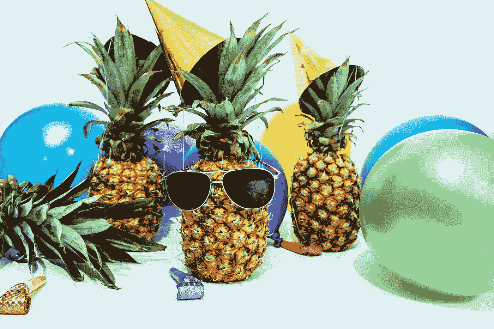

# 使用 Python 的图像滤镜

> 原文：[`towardsdatascience.com/image-filters-with-python-3dc223a12624?source=collection_archive---------17-----------------------#2023-02-10`](https://towardsdatascience.com/image-filters-with-python-3dc223a12624?source=collection_archive---------17-----------------------#2023-02-10)

## 一个简明的计算机视觉项目，旨在使用 Python 构建图像滤镜

 [Bharath K](https://bharath-k1297.medium.com/?source=post_page-----3dc223a12624--------------------------------)

·

[关注](https://medium.com/m/signin?actionUrl=https%3A%2F%2Fmedium.com%2F_%2Fsubscribe%2Fuser%2F2b0fa005e971&operation=register&redirect=https%3A%2F%2Ftowardsdatascience.com%2Fimage-filters-with-python-3dc223a12624&user=Bharath+K&userId=2b0fa005e971&source=post_page-2b0fa005e971----3dc223a12624---------------------post_header-----------) 发表在[Towards Data Science](https://towardsdatascience.com/?source=post_page-----3dc223a12624--------------------------------) ·8 分钟阅读·2023 年 2 月 10 日

--

照片由[Pineapple Supply Co.](https://unsplash.com/@pineapple?utm_source=medium&utm_medium=referral)拍摄，来源于[Unsplash](https://unsplash.com/?utm_source=medium&utm_medium=referral)

图像存在于不同的尺度、对比度、位深度和质量中。我们周围以及互联网中充满了各种独特而美丽的图像。对这些图像进行处理可以产生许多有趣的结果，这些结果被广泛应用于各种有趣且有用的场景中。

在图像处理和计算机视觉中，玩弄图像是解决各种任务和获得理想结果的关键组成部分。通过适当处理成像任务，我们可以重建图像的修改版本，这对于多种计算机视觉和深度学习应用（如数据增强）非常有用。

在本文中，我们将专注于开发一个简单的图像滤镜应用程序，主要用于修改特定图像的亮度和对比度。还可以实现和添加其他值得注意的修改，包括着色器样式、剪贴画、表情符号以及其他类似的内容到你的项目中。

如果读者对计算机视觉和 OpenCV 不熟悉，我建议查看我之前的一篇关于 OpenCV 和计算机视觉的完整且广泛的初学者指南的文章。链接…
