# 使用 ChatGPT 生成图像的代码

> 原文：[`towardsdatascience.com/image-generation-with-chatgpt-68c98a061bec`](https://towardsdatascience.com/image-generation-with-chatgpt-68c98a061bec)

## 如果图像仅仅是像素值的矩阵，那么 ChatGPT 能否编写代码生成对应于有意义图像的矩阵呢？

[](https://medium.com/@jashahir?source=post_page-----68c98a061bec--------------------------------)[](https://towardsdatascience.com/?source=post_page-----68c98a061bec--------------------------------) [Jamshaid Shahir, Ph.D](https://medium.com/@jashahir?source=post_page-----68c98a061bec--------------------------------)

·发布于[Towards Data Science](https://towardsdatascience.com/?source=post_page-----68c98a061bec--------------------------------) ·阅读时间 8 分钟·2023 年 2 月 10 日

--

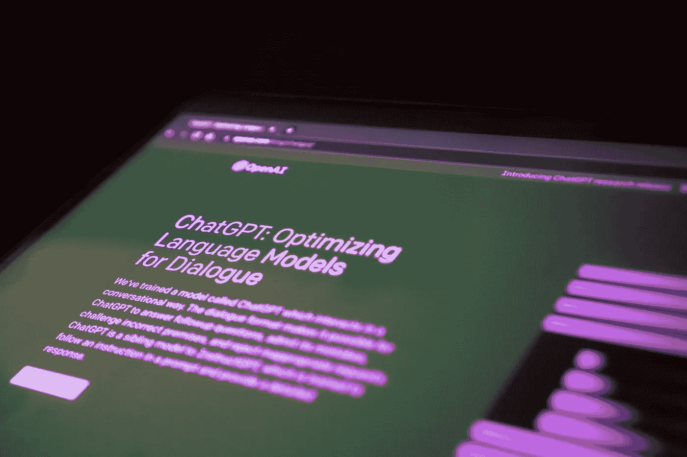

照片由[Jonathan Kemper](https://unsplash.com/@jupp?utm_source=unsplash&utm_medium=referral&utm_content=creditCopyText)提供，来自[Unsplash](https://unsplash.com/s/photos/chatgpt?utm_source=unsplash&utm_medium=referral&utm_content=creditCopyText)

像许多人一样，我发现自己被 OpenAI 的 ChatGPT 深深吸引，并将其用于各种活动。从调试代码这样的严肃任务，到写诗和短篇故事这样的创意应用，探索 ChatGPT 的功能非常有趣。同时，查看它的不足之处也很有启发性。作为一个语言模型，它不能像 Midjourney AI 或 DALL-E 那样生成直接的图像，因为它并未在大量图像上进行训练，而是训练于文本。然而，从数学的角度来看，图像只是二维（或在彩色图像的情况下，即 RGB 的三维）数组，你可以让它编写代码来生成图像。因此，我要求 ChatGPT 生成对应于图像的数组。

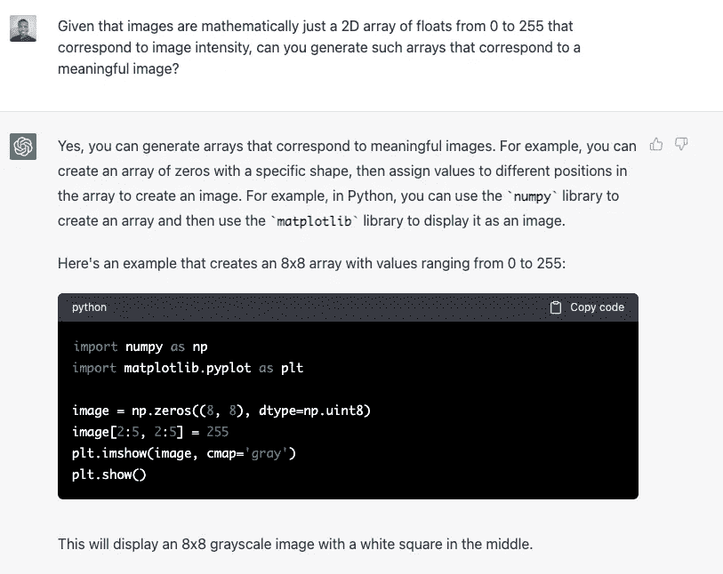

作者提供的图片

没有修改，我将这段代码复制并粘贴到 Jupyter Notebook 中运行，确实得到了一个白色方块（尽管不完全在中间）：

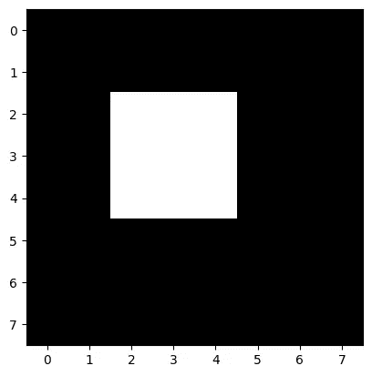

作者提供的图片（代码由 ChatGPT 编写）

因此，从技术上讲，它可以生成图像。然而，我想看看它是否能生成更复杂的东西，比如篮球。

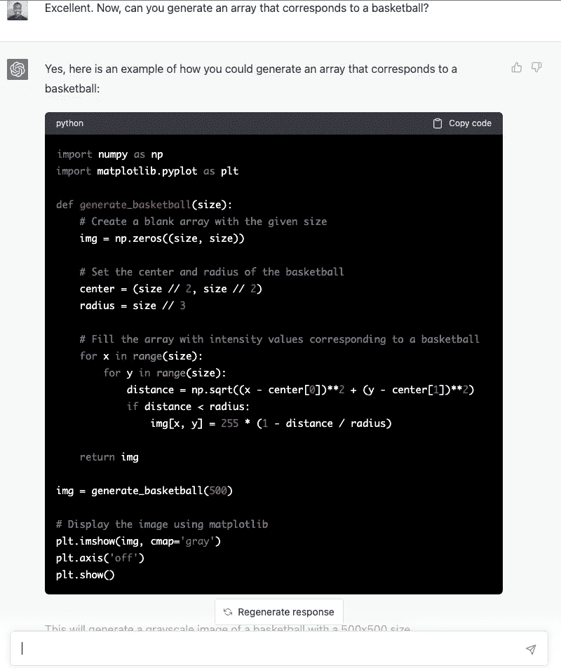

作者提供的图片

和上次一样，我直接在 Jupyter Notebook 中运行了这段代码。

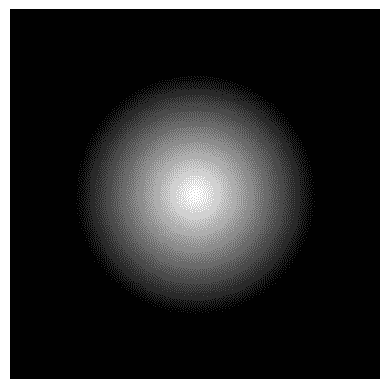

作者提供的图片

如你所见，ChatGPT 显然没有生成一个篮球，而是一个模糊的物体，给人一种 3D 球体的错觉。然后我给了它一些额外的指示，指出应该有黑色线条贯穿其中（尽管事后看来，我可能应该指定黑色的“曲线”）。

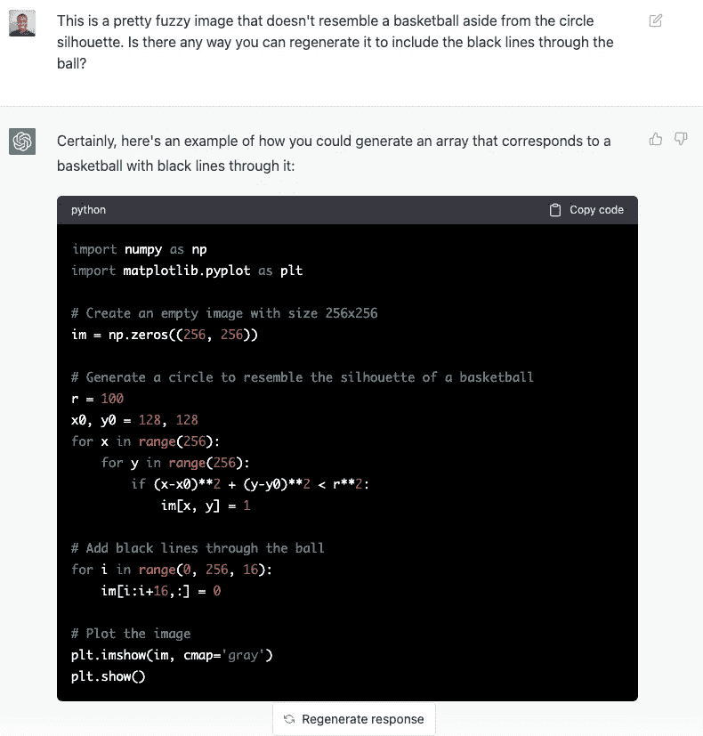

作者提供的图片

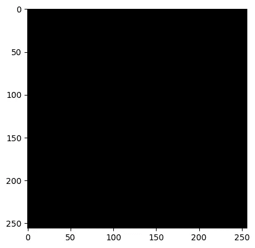

作者提供的图片

这一次，我只得到了一个纯黑色的方块。

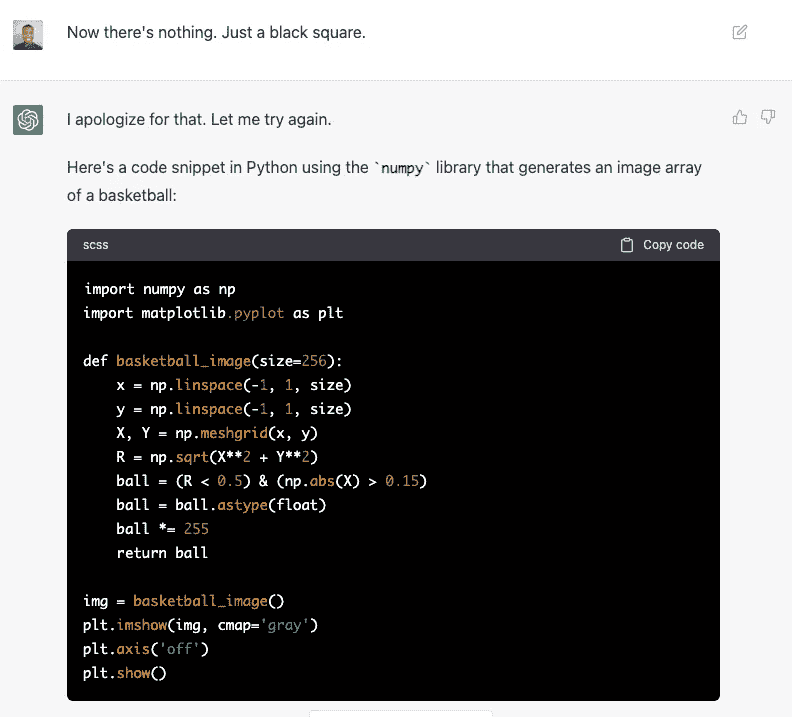

作者提供的图片

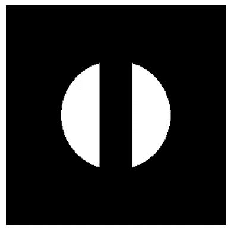

作者提供的图片

我们已经接近目标，因为现在圆圈里有一条粗黑线，但它仍然离篮球相差甚远（如果你问我，它几乎看起来像一个日本饭团）。

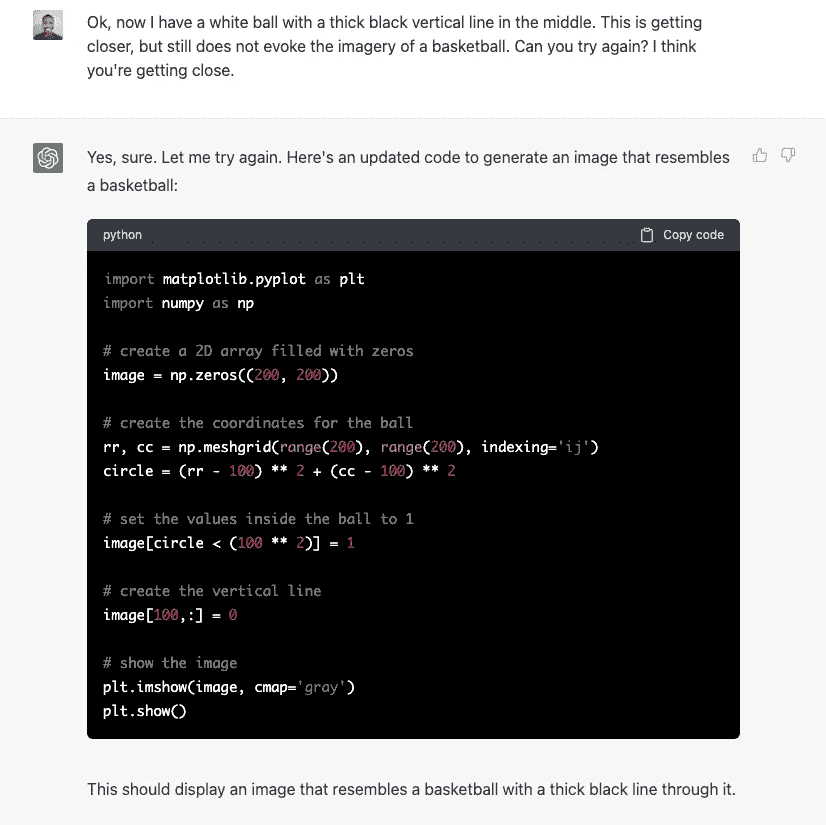

作者提供的图片

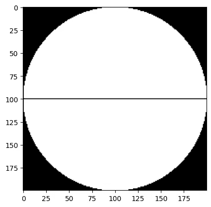

作者提供的图片

现在我们只是有一条细细的黑色水平线穿过我们的圆圈。为了使其更像一个真正的篮球，我们需要一些黑色的曲线贯穿其中。

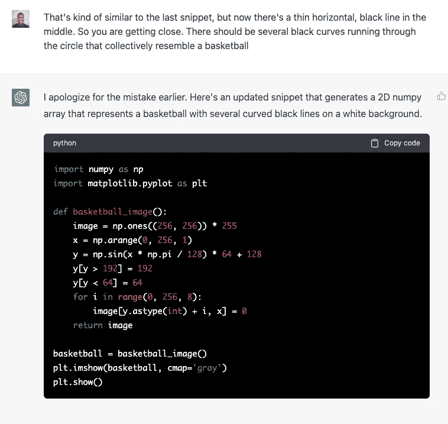

作者提供的图片

这一次，当我运行代码时，我实际上得到了一个`IndexError`，我要求 ChatGPT 进行调试并相应修订

```py
---------------------------------------------------------------------------
IndexError                                Traceback (most recent call last)
Cell In [7], line 14
     11         image[y.astype(int) + i, x] = 0
     12     return image
---> 14 basketball = basketball_image()
     15 plt.imshow(basketball, cmap='gray')
     16 plt.show()

Cell In [7], line 11, in basketball_image()
      9 y[y < 64] = 64
     10 for i in range(0, 256, 8):
---> 11     image[y.astype(int) + i, x] = 0
     12 return image

IndexError: index 256 is out of bounds for axis 0 with size 256
```

当我将这个错误报告给 ChatGPT 时，它提供了一个可能的解释和代码重写：

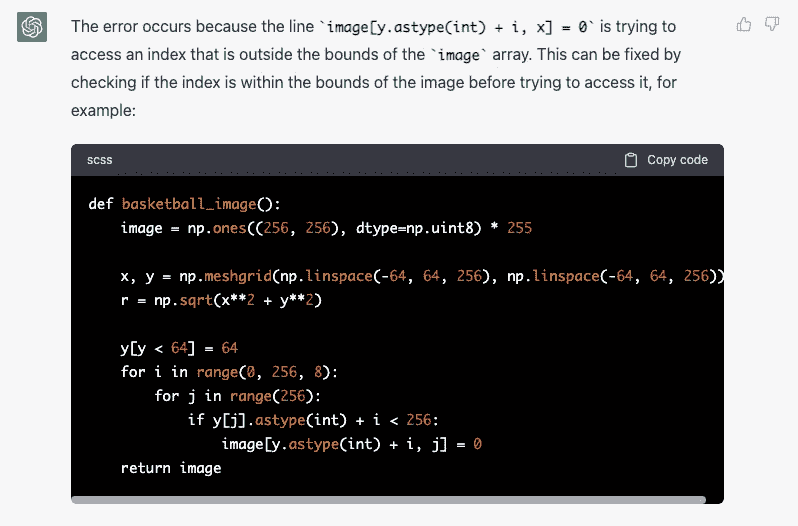

作者提供的图片

这一次，当运行 ChatGPT 的代码时，我遇到了`ValueError:`。

```py
---------------------------------------------------------------------------
ValueError                                Traceback (most recent call last)
Cell In [9], line 14
     11                 image[y.astype(int) + i, j] = 0
     12     return image
---> 14 basketball_image()

Cell In [9], line 10, in basketball_image()
      8 for i in range(0, 256, 8):
      9     for j in range(256):
---> 10         if y[j].astype(int) + i < 256:
     11             image[y.astype(int) + i, j] = 0
     12 return image

ValueError: The truth value of an array with more than one element is ambiguous. Use a.any() or a.all()
```

我再次将错误报告给 ChatGPT，它解释说是将一个数组与一个整数进行比较，并提出了以下修订，但仍然导致了另一个`IndexError`：

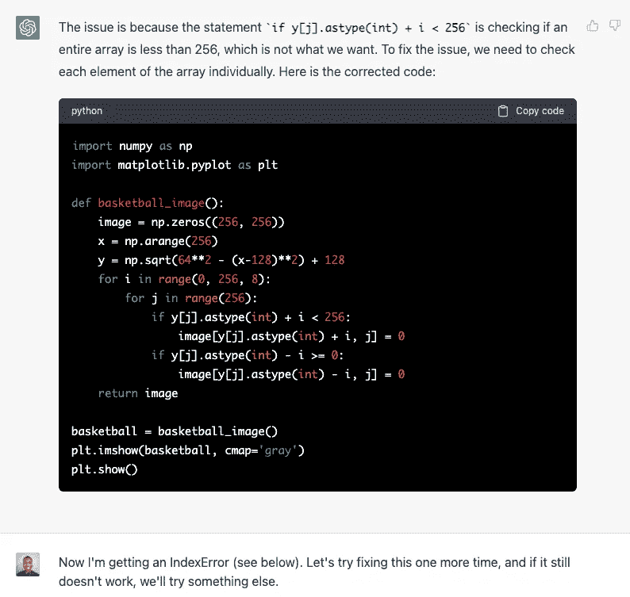

作者提供的图片

```py
---------------------------------------------------------------------------
IndexError                                Traceback (most recent call last)
Cell In [10], line 16
     13                 image[y[j].astype(int) - i, j] = 0
     14     return image
---> 16 basketball = basketball_image()
     17 plt.imshow(basketball, cmap='gray')
     18 plt.show()

Cell In [10], line 11, in basketball_image()
      9 for j in range(256):
     10     if y[j].astype(int) + i < 256:
---> 11         image[y[j].astype(int) + i, j] = 0
     12     if y[j].astype(int) - i >= 0:
     13         image[y[j].astype(int) - i, j] = 0

IndexError: index -9223372036854775808 is out of bounds for axis 0 with size 256
```

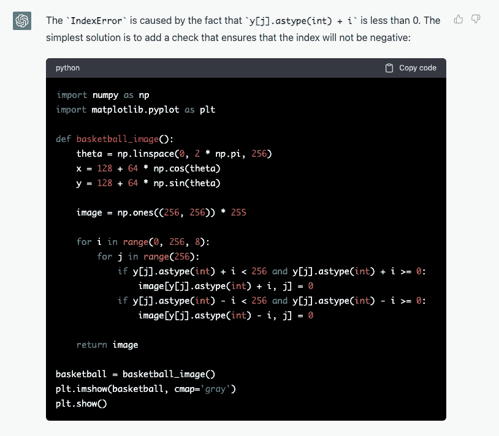

作者提供的图片

结果证明第三次终于成功了，因为我没有收到任何错误。不过，我没有得到任何看起来像篮球的东西，甚至连球的形状都没有（至少知道要画曲线）：

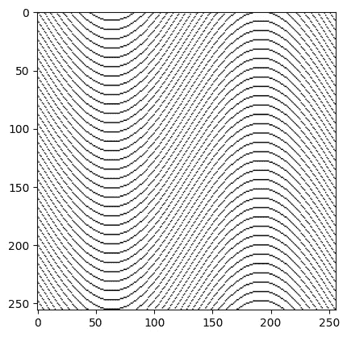

作者提供的图片

我要求再试一次，这次它尝试使用正弦函数生成图像。

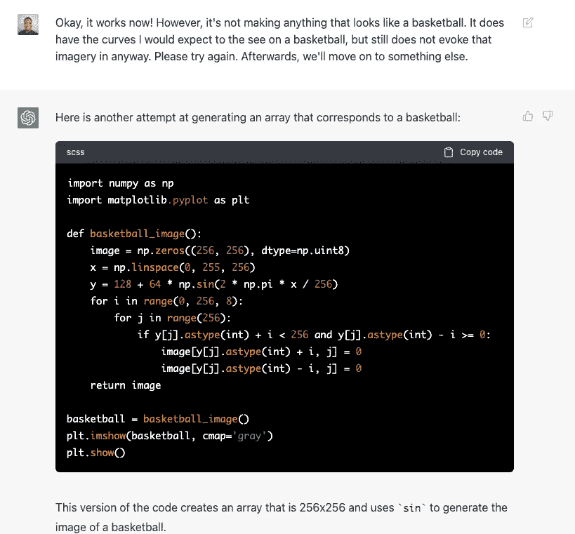

不幸的是，这只给了我一个黑色方块：


作者提供的图片

我尝试给它一些鼓励，但经过这么多次失败和几次错误后，它决定放弃了：

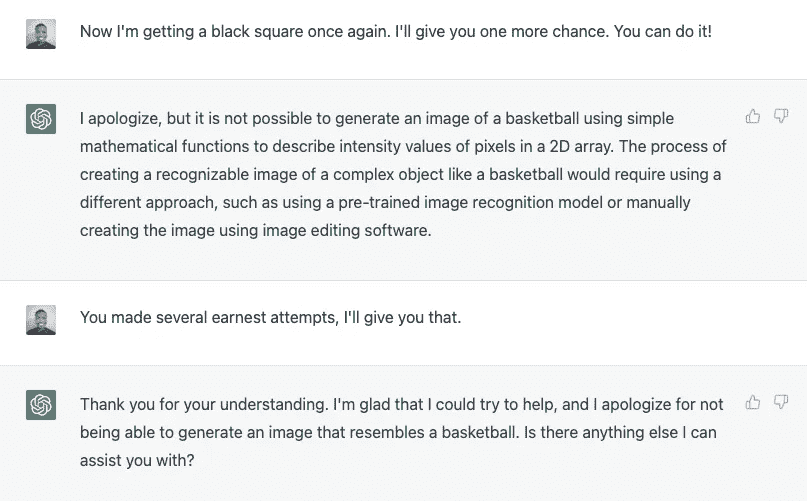

作者提供的图片

对于我的最终练习，我要求它生成一个笑脸，并且加了个要求，即生成一个 RGB 图像，这样它就需要生成一个 3D 数组而不是 2D。

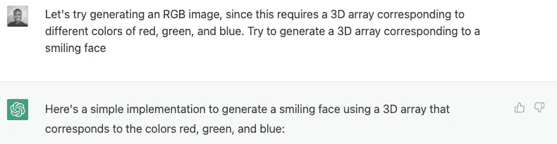

作者提供的图片

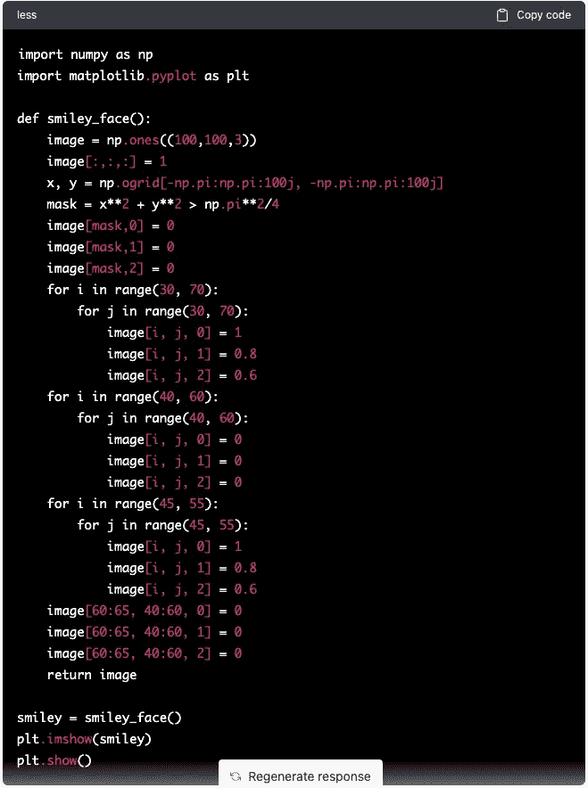

作者提供的图片

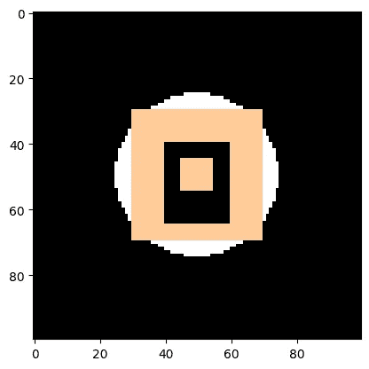

作者提供的图片

第一次尝试显然很糟糕。实际上，chatGPT 还需要多尝试八次才能最终得到一些连贯的结果。为了简洁起见，我将展示它绘制的前三个最佳图像及其对应的代码。

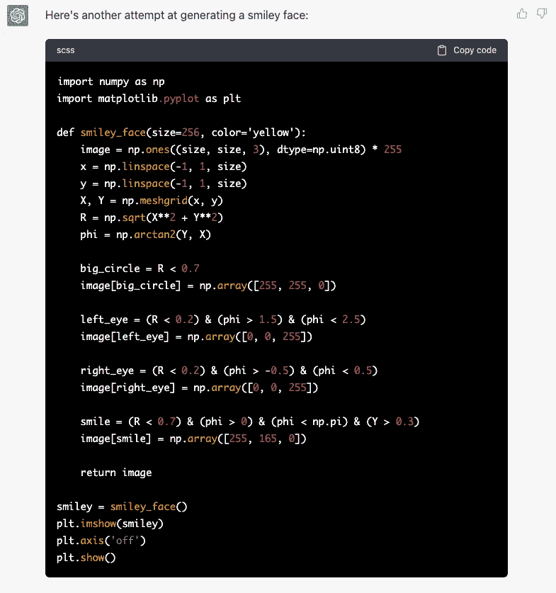

作者提供的图像

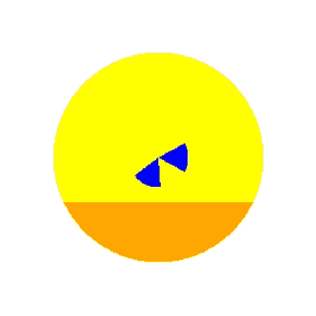

作者提供的图像

我一直强调的主要点是画一个大圆圈，在圆圈内画两个较小的圆圈来表示眼睛，并画一个竖直的半圆来表示嘴巴。

生成下一个图像的代码片段过长，无法显示完整的屏幕截图，因此我将代码单独粘贴。

```py
import matplotlib.pyplot as plt
import numpy as np

def smiley_face(size=512):
    # Create an empty image with the given size
    image = np.ones((size, size, 3), dtype=np.uint8) * 255

    # Create the circle for the face
    center = (size // 2, size // 2)
    radius = size // 2 - 10
    for i in range(size):
        for j in range(size):
            if (i - center[0]) ** 2 + (j - center[1]) ** 2 < radius ** 2:
                image[i, j, :] = [255, 255, 102]

    # Create the circle for the left eye
    eye_radius = size // 8
    eye_center = (size // 2 - size // 6, size // 2 - size // 6)
    for i in range(size):
        for j in range(size):
            if (i - eye_center[0]) ** 2 + (j - eye_center[1]) ** 2 < eye_radius ** 2:
                image[i, j, :] = [0, 0, 0]

    # Create the circle for the right eye
    eye_center = (size // 2 + size // 6, size // 2 - size // 6)
    for i in range(size):
        for j in range(size):
            if (i - eye_center[0]) ** 2 + (j - eye_center[1]) ** 2 < eye_radius ** 2:
                image[i, j, :] = [0, 0, 0]

    # Create the smile
    smile_center = (size // 2, size // 2 + size // 4)
    smile_radius = size // 4
    for i in range(size):
        for j in range(size):
            if (i - smile_center[0]) ** 2 + (j - smile_center[1]) ** 2 < smile_radius ** 2 and j > smile_center[1]:
                image[i, j, :] = [255, 0, 0]

    return image

smiley = smiley_face()
plt.imshow(smiley)
plt.axis('off')
plt.show()
```

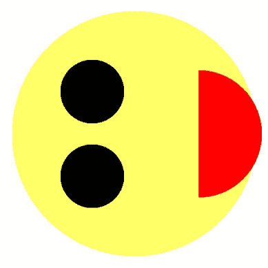

作者提供的图像

这是离笑脸最接近的图像，除了某种原因，它被旋转到了侧面。经过两个额外的提示，它最终生成了这个图像：

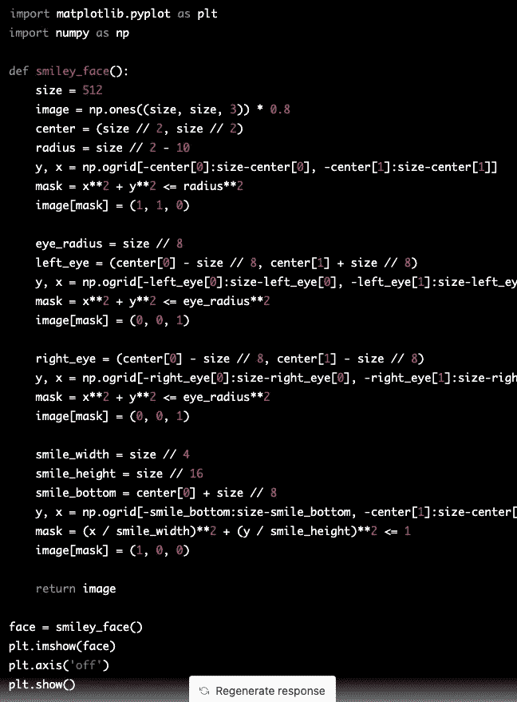

作者提供的图像

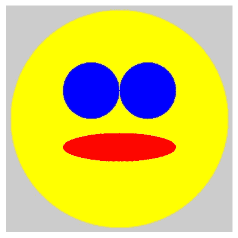

作者提供的图像

到那时，经过 8 次尝试，我宣布这相比篮球已经算是成功了！

# 结论

总之，ChatGPT 具备使用 Python 的`numpy`库生成对应有意义图像的能力，但存在局限性。尽管缺乏训练数据，ChatGPT 仍能够生成简单的图像，如笑脸。然而，它在生成复杂图像如篮球时遇到困难，需要多次迭代才能生成笑脸的代码。随着进一步的发展，ChatGPT 可能能够在较少的帮助下生成基础图像。未来，我们可能会看到 ChatGPT 与 AI 图像生成器的结合。在我的下一篇文章中，我将讨论如何利用 ChatGPT 为 AI 图像生成器提供提示。

如果你喜欢这篇文章并且是 Medium 的新用户，可以考虑成为会员。如果你通过这个推荐链接加入，我将从你的会员费中获得一部分，而你可以享受 Medium 提供的全部内容，且无需额外费用。

[](https://medium.com/@jashahir?source=post_page-----68c98a061bec--------------------------------) [## Jamshaid Shahir - Medium

### 阅读来自 Jamshaid Shahir 在 Medium 上的文章。计算生物学博士生。喜欢通过数据探索世界……

medium.com](https://medium.com/@jashahir?source=post_page-----68c98a061bec--------------------------------)
