# 医学数据集的图像配准

> 原文：[`towardsdatascience.com/image-registration-for-medical-datasets-ee605ff8eb2e`](https://towardsdatascience.com/image-registration-for-medical-datasets-ee605ff8eb2e)

## 从 SimpleElastix 到空间变换网络

[](https://charlieoneill.medium.com/?source=post_page-----ee605ff8eb2e--------------------------------)[](https://towardsdatascience.com/?source=post_page-----ee605ff8eb2e--------------------------------) [Charlie O'Neill](https://charlieoneill.medium.com/?source=post_page-----ee605ff8eb2e--------------------------------)

·发布于 [Towards Data Science](https://towardsdatascience.com/?source=post_page-----ee605ff8eb2e--------------------------------) ·阅读时间 31 分钟·2023 年 2 月 22 日

--

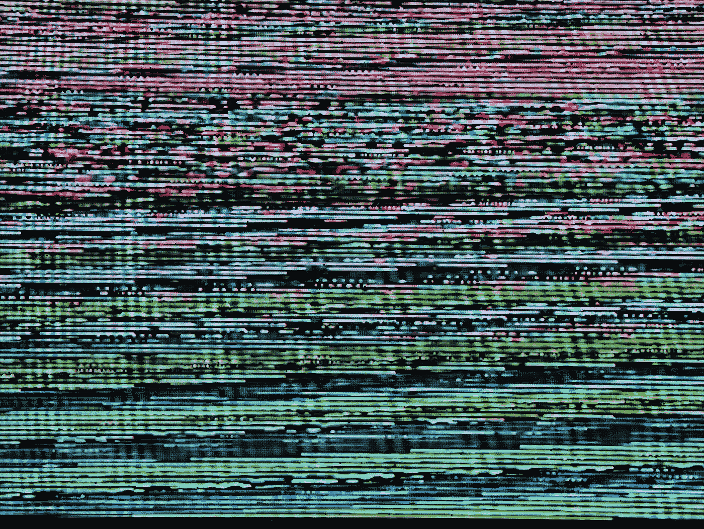

图片由 [Michael Dziedzic](https://unsplash.com/@lazycreekimages?utm_source=medium&utm_medium=referral) 提供，来源于 [Unsplash](https://unsplash.com/?utm_source=medium&utm_medium=referral)

# 介绍

图像配准是图像处理中的一项基础任务，涉及将两个或多个图像对齐到一个共同的坐标系统中。通过这样做，图像中的对应像素表示现实世界中的同源点，从而使图像的比较和分析成为可能。图像配准的一个常见应用是在医学成像中，其中对同一患者进行多次扫描或拍摄，由于时间、位置或其他因素的不同而产生变化。配准这些图像可以揭示出可能指示疾病进展或治疗效果的微妙变化或模式。

图像配准涉及寻找一种空间变换，将一个图像中的点映射到另一个图像中的对应点，以便可以将图像重叠在一起。空间变换通常由一组控制点参数化，这些控制点用于将一个图像扭曲以匹配另一个图像。配准的质量通过相似度度量来衡量，该度量量化了图像之间的对应程度。

近年来，由于先进成像技术的出现、计算能力的提升以及对更准确和高效医学图像分析的需求，医学图像配准引起了越来越多的关注。图像配准已经成为广泛医学图像分析任务的前提条件，包括解剖结构的分割、计算机辅助诊断、疾病进展监测、外科干预和治疗规划。

尽管大量研究集中在开发图像配准算法上，但对这些算法的可访问性、互操作性和扩展性关注较少。科学源代码通常未公开，因未考虑其他研究人员的需求而难以使用，或缺乏适当的文档。这限制了图像配准算法的采用和使用，阻碍了科学进步和可重复性。

为了解决这些挑战，开发了几个开源医学图像配准库，其中 SimpleElastix 是最受欢迎的之一。SimpleElastix 是 SimpleITK 的扩展，SimpleITK 是一个开源医学图像分析库，允许用户完全在 Python、Java、R、Octave、Ruby、Lua、Tcl 和 C# 中配置和运行 Elastix 配准算法。SimpleElastix 提供了一个简单的参数接口、模块化架构和多种变换、度量和优化器，使其易于使用且计算高效。它还提供了一系列功能，如随机采样、多线程和代码优化，以加快配准速度，而不牺牲鲁棒性。

在这里，我将深入探讨使用 SimpleElastix 进行图像配准的过程，重点介绍注册来自地理萎缩患者的视网膜图像的具体示例。我还将提供实施这一配准过程的逐步指南，并探讨其他技术，如光流和空间变换网络。希望这能让你更好地理解医学成像中图像配准的重要性以及实施它的工具。

# 设置

任务是处理来自地理萎缩患者（眼病的一种）的视网膜图像，并将这些图像进行*患者间*注册，即仅将来自同一患者的图像注册到该患者。为了解释一下，地理萎缩（GA）特征是视网膜色素上皮细胞的丧失，这些细胞负责支持和滋养黄斑中的视网膜感光细胞。视网膜色素上皮细胞的丧失会导致黄斑中出现一个或多个萎缩区或“孔洞”，这可能导致中心视力丧失，影响个人进行日常活动，如阅读、驾驶和面孔识别。你将在下面的视网膜图像中注意到这些萎缩区域。

你可以从[这个 Kaggle 数据集](https://www.kaggle.com/datasets/andrewmvd/fundus-image-registration)中获取与代码一起使用的图像。首先，我们需要导入适当的模块。

```py
from pathlib import Path
import matplotlib.pyplot as plt
from typing import List
import numpy as np
import seaborn as sns
import os
import cv2
import pandas as pd
from tqdm.notebook import tqdm
from skimage.registration import optical_flow_tvl1, optical_flow_ilk
from skimage.transform import warp
from skimage.color import rgb2gray
from skimage.metrics import structural_similarity as ssim
from skimage.metrics import normalized_root_mse as nrmse
```

接下来，我们编写一个函数来处理图像的检索。由于我们只想将视网膜图像注册到同一只眼睛，我们需要指定要加载的患者和侧别：

```py
def retrieve_images(patient_id = '156518', laterality = 'L', date = None):
    # Set the root directory for the patient data
    root_dir = Path(f'../data/{patient_id}')

    # Get the list of image filenames for the left eye
    image_filenames = [f for f in os.listdir(root_dir) if f'{laterality}.png' in f]

    # If we are registering to same visit, only keep files from given date
    if date != None:
        pattern = re.compile(r"\w+_(\d{4}-\d{2}-\d{2})_")
        image_filenames = [file for file in image_filenames if date in file]
    # Read the images into a list
    images = [cv2.imread(str(root_dir / f)) for f in image_filenames]
    # Convert the images to grayscale
    gray_images = [rgb2gray(img) for img in images]
    # Register all images to the first image
    template = gray_images[0]
    # Remove invalid images
    final_images = [x for x in gray_images[1:] if x.shape == template.shape]
    return final_images, template
```

在评估我们的配准算法时，我们的评估指标将是一个计算注册图像与模板图像之间距离的函数。我们希望能够追踪这些指标中的一些。常见的指标包括：

+   *L1 损失*，也称为平均绝对误差，测量两张图像之间逐元素差异的平均幅度。它对离群值具有鲁棒性，并对所有像素赋予相等的权重，使其成为图像配准的一个不错选择。

+   *均方根误差*（RMSE）是两张图像之间平方差的均值的平方根。它对较大的差异赋予更多权重，使其对离群值非常敏感。RMSE 常用于图像配准，以测量两张图像之间的总体差异。

+   *归一化互相关* 是一种衡量两张图像之间相似度的指标，考虑了它们的强度。它被归一化以确保结果在 -1 和 1 之间，其中 1 表示完全匹配。归一化互相关常用于图像配准，以评估配准质量，特别是在处理强度不同的图像时。

+   *相似度* 是衡量两张图像之间重叠程度的指标，考虑了强度和空间信息。常见的用于图像配准的相似度指标包括互信息、归一化互信息和詹森-香农散度。这些指标提供了两张图像之间共享信息的度量，使其非常适合评估图像配准的质量。

以下函数接受一个注册图像的列表以及模板图像，并计算每张图像的上述指标：

```py
def evaluate_registration(template_img: np.ndarray, 
                          registered_imgs: List[np.ndarray]) -> (List[float], List[float], List[float]):
    """
    Evaluate the registration quality of multiple registered images with respect to a template image.
    """
    l1_losses = []
    ncc_values = []
    ssim_values = []

    for registered_img in registered_imgs:
        # Compute L1 loss between the template and registered images
        l1_loss = np.mean(np.abs(template_img - registered_img))
        l1_losses.append(l1_loss)

        # Compute normalized cross-correlation between the template and registered images
        ncc = np.corrcoef(template_img.ravel(), registered_img.ravel())[0,1]
        ncc_values.append(ncc)

        # Compute structural similarity index between the template and registered images
        ssim_value = ssim(template_img, registered_img, data_range=registered_img.max() - registered_img.min())
        ssim_values.append(ssim_value)

    return l1_losses, ncc_values, ssim_values
```

根据这些损失，最好有某种函数可以根据损失显示最佳和最差注册图像。这在某种程度上类似于在分类任务中查看混淆矩阵的个别示例。

```py
def visualise_registration_results(registered_images, original_images, template, loss_values):
    num_images = min(len(registered_images), 3)
    # Get the indices of the three images with the highest L1 losses
    top_indices = np.argsort(loss_values)[-num_images:]
    # Get the indices of the three images with the lowest L1 losses
    bottom_indices = np.argsort(loss_values)[:num_images]
    # Create the grid figure
    fig, axes = plt.subplots(num_images, 4, figsize=(20, 15))
    fig.subplots_adjust(hspace=0.4, wspace=0.4)
    # Loop through the top three images
    for i, idx in enumerate(top_indices):
        # Plot the original image in the first column of the left section
        ax = axes[i][0]
        ax.imshow(original_images[idx], cmap='gray')
        original_l1 = np.mean(np.abs(template - original_images[idx]))
        ax.set_title("Original Image (L1 Loss: {:.2f})".format(original_l1))
        # Plot the registered image in the second column of the left section
        ax = axes[i][1]
        ax.imshow(registered_images[idx], cmap='gray')
        ax.set_title("Registered Image (L1 Loss: {:.2f})".format(loss_values[idx]))
    # Loop through the bottom three images
    for i, idx in enumerate(bottom_indices):
        # Plot the original image in the first column of the right section
        ax = axes[i][2]
        ax.imshow(original_images[idx], cmap='gray')
        original_l1 = np.mean(np.abs(template - original_images[idx]))
        ax.set_title("Original Image (L1 Loss: {:.2f})".format(original_l1))
        # Plot the registered image in the second column of the right section
        ax = axes[i][3]
        ax.imshow(registered_images[idx], cmap='gray')
        ax.set_title("Registered Image (L1 Loss: {:.2f})".format(loss_values[idx]))
    # Show the grid
    plt.show()
```

编写一个汇总函数，显示我们的配准算法所取得的整体改进，这可能是个好主意。

```py
def highlight_worse(val, comparison_column, worse_val, better_val):
    color = better_val if val == worse_val else worse_val
    return 'background-color: {}'.format(color)

def style_df(df_dict):
    df = pd.DataFrame(df_dict)
    for column in df.columns:
        comparison_column = 'original' if column == 'registered' else 'registered'
        worse_val = 'red'
        better_val = 'green'
        if column in ['ncc', 'ssim']:
            worse_val, better_val = better_val, worse_val
        df.style.apply(highlight_worse, axis=1, subset=[column], comparison_column=comparison_column, worse_val=worse_val, better_val=better_val)
    return df

def summarise_registration(original_images, registered_images, template):

    # Calculate metrics for original images
    l1_losses, ncc_values, ssim_values = evaluate_registration(template, original_images)
    l1_original, ncc_original, ssim_original = np.mean(l1_losses), np.mean(ncc_values), np.mean(ssim_values)

    # Calculate metrics for registered images
    l1_losses, ncc_values, ssim_values = evaluate_registration(template, registered_images)
    l1_registered, ncc_registered, ssim_registered = np.mean(l1_losses), np.mean(ncc_values), np.mean(ssim_values)

    # Create dataframe
    df_dict = {'original': {'l1': l1_original, 'ncc': ncc_original, 'ssim': ssim_original}, 
               'registered': {'l1': l1_registered, 'ncc': ncc_registered, 'ssim': ssim_registered}}

    return style_df(df_dict)
```

最后，我们将为任何配准算法编写一个简洁的包装器，以便我们能够轻松地应用和评估它：

```py
class RegistrationAlgorithm:

    def __init__(self, registration_function):
        self.registration_function = registration_function
        self.final_images, self.template = retrieve_images()
        self.registered_images = self.apply_registration()

    def apply_registration(self):
        # Do the registration process
        registered_images = []
        for i, img in enumerate(tqdm(self.final_images)):
            registered = self.registration_function(self.template, img) 
            registered_images.append(registered)
        return registered_images

    def evaluate(self, template_img, registered_imgs):
        l1_losses = []
        ncc_values = []
        ssim_values = []

        for registered_img in registered_imgs:

            # Compute L1 loss between the template and registered images
            l1_loss = np.mean(np.abs(template_img - registered_img))
            l1_losses.append(l1_loss)

            # Compute normalized cross-correlation between the template and registered images
            ncc = np.corrcoef(template_img.ravel(), registered_img.ravel())[0,1]
            ncc_values.append(ncc)

            # Compute structural similarity index between the template and registered images
            ssim_value = ssim(template_img, registered_img, data_range=registered_img.max() - registered_img.min())
            ssim_values.append(ssim_value)

        return l1_losses, ncc_values, ssim_values
```

# 探索性数据分析

让我们获取一些图像，看看我们要处理的是什么。

```py
images, template = retrieve_images()
```

一个好的主意是检查哪些图像与模板图像的差异最大。我们可以重复使用上述函数来实现这一点。让我们计算未注册图像与模板之间的损失，然后查看差异最大（损失最高）的图像。

```py
# calculate various distances
l1_losses, ncc_values, ssim_values = evaluate_registration(template, images)

# plot most and least similar images
visualise_registration_results(images, images, template, l1_losses)
```

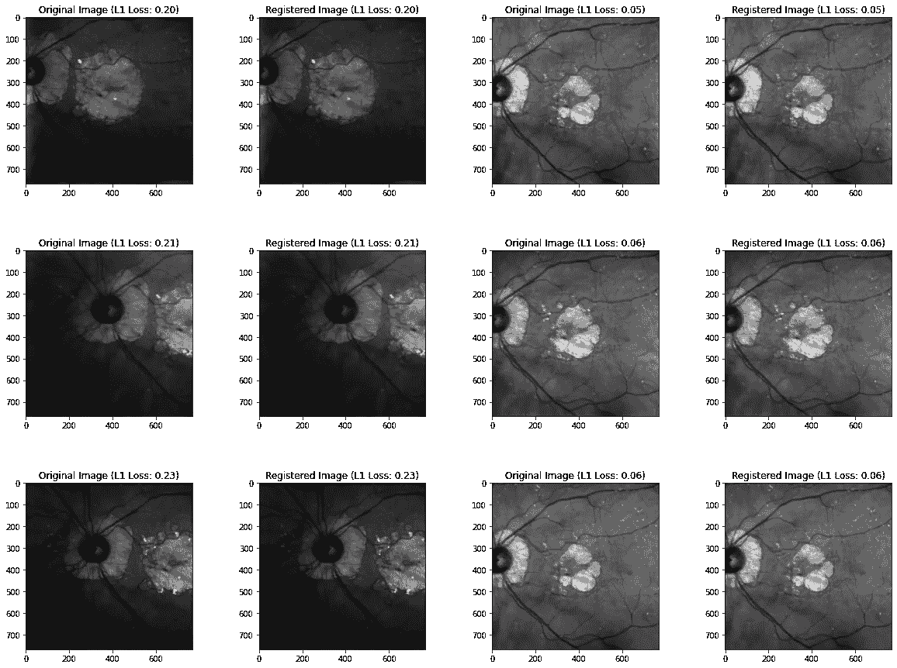

作者提供的图像。

作为比较，这里是模板图像：

```py
plt.imshow(template, cmap="gray");
```

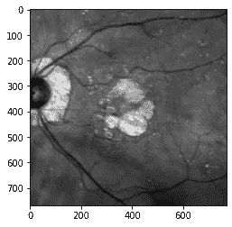

作者提供的图像。

# 寻找最佳模板图像

显然，选择第一张眼底图像作为 *固定* 或“模板”图像可能并不理想。如果第一张图像质量差，或者旋转，或者与大多数需要配准的图像差异很大，这将导致结果不佳、大的仿射变换和高的“死”图像区域。因此，我们需要某种方法来选择模板图像。我们可以有几种不同的想法来实现这一点：

+   计算每张图像与数据集中所有其他图像的累积 L2 距离，并选择结果最低的那一张。这代表了与所有其他图像“最接近”的图像。

+   重复上述过程，但这次创建一个累积 L2 距离的直方图。选择最好的 *k* 张图像，取平均值，并将其作为模板。

让我们从第一个想法开始。这个函数循环遍历每张图像，计算与所有其他图像的聚合 L2 距离。

```py
def calculate_total_rmse(images):
    n = len(images)
    sum_rmse = np.zeros(n)
    for i in range(n):
        for j in range(i+1, n):
            rmse = np.sqrt(np.mean((images[i] - images[j])**2))
            sum_rmse[i] += rmse
            sum_rmse[j] += rmse
    return sum_rmse

patient_id = '123456'
laterality = 'L'
# Set the root directory for the patient data
root_dir = Path(f'../data/{patient_id}')
# Get the list of image filenames for the left eye
image_filenames = [f for f in os.listdir(root_dir) if f'{laterality}.png' in f]
# Read the images into a list
images = [cv2.imread(str(root_dir / f)) for f in image_filenames]
# Convert the images to grayscale
gray_images = [rgb2gray(img) for img in images]
# Remove invalid images
final_images = [x for x in gray_images[1:] if x.shape == (768, 768)]
# Calculate the RMSEs
rmses = calculate_total_rmse(final_images)
```

让我们看看四张总 RMSE 最低的图像：

```py
images = final_images
sorted_indices = [i[0] for i in sorted(enumerate(rmses), key=lambda x:x[1])]
fig, ax = plt.subplots(2, 2, figsize=(10, 10))
for i in range(4):
    ax[i//2][i%2].imshow(images[sorted_indices[i]], cmap='gray')
    ax[i//2][i%2].set_title("RMSE: {:.2f}".format(rmses[sorted_indices[i]]))
    ax[i//2][i%2].axis("off")
plt.show()
```

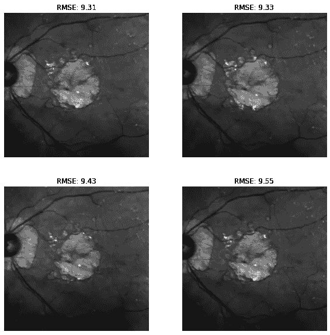

图片由作者提供。

现在让我们尝试第二种方法。首先，看看总 RMSE 的直方图：

```py
# Plot the histogram
sns.set_style("whitegrid")
sns.displot(rmses, kde=False)
plt.show()
plt.rcdefaults()
```

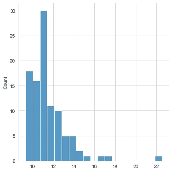

图片由作者提供。

我们可以选择最好的 15 张图像（所有图像的 RMSE 都低于 10）：

```py
plt.rcdefaults()

def get_best_images(images, rmses, num_images=10):
    sorted_indices = sorted(range(len(rmses)), key=lambda x: rmses[x])
    best_indices = sorted_indices[:num_images]
    return [images[i] for i in best_indices]
best_images = get_best_images(images, rmses)
av_img = np.mean(best_images, axis=0)
plt.imshow(av_img, cmap='gray')
plt.show()
```

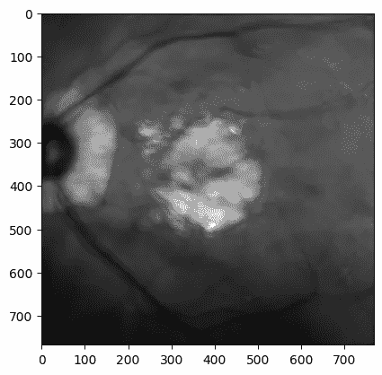

图片由作者提供。

显然，我们用来取平均的图像越多，最终图像就会越模糊。

```py
num_images_range = np.linspace(4, 36, 9, dtype=int)
best_images_list = []
for num_images in num_images_range:
    best_images = get_best_images(images, rmses, num_images)
    av_img = np.mean(best_images, axis=0)
    best_images_list.append(av_img)

fig, axs = plt.subplots(3, 3, figsize=(12,12))
for i, av_img in enumerate(best_images_list):
    row, col = i//3, i%3
    axs[row, col].imshow(av_img, cmap='gray')
    axs[row, col].axis('off')
    axs[row, col].set_title(f"Best {num_images_range[i]} images")
plt.show()
```

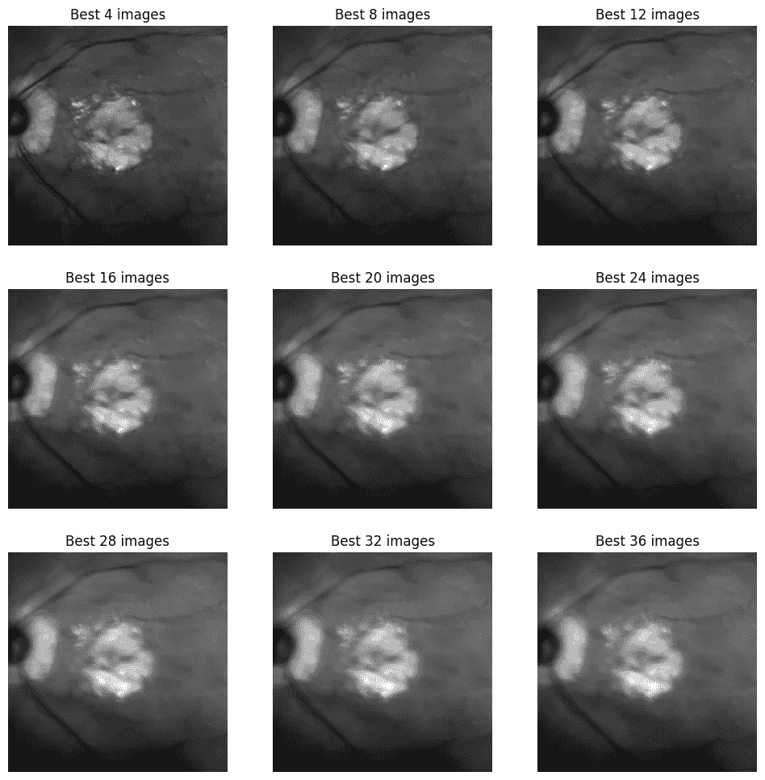

让我们选择最好的 8 张图像，并将其作为我们的模板图像。

# 算法

这是项目中的实际工作马驹：注册算法本身。

# 刚性

刚性配准是医学图像分析中的一种基本技术，它通过应用平移、旋转和缩放来对齐两张或多张图像。这是一个将图像变换的过程，目的是保持图像中对应点之间的距离不变。刚性配准的目标是找到最佳变换，以最小化图像之间的差异，同时保持基础结构的解剖一致性。刚性配准有多个应用，包括图像融合、图像引导手术和纵向研究，并且是更高级配准技术的关键预处理步骤。

```py
import SimpleITK as sitk
import numpy as np

def rigid(fixed_image, moving_image):
    # Convert the input images to SimpleITK images
    fixed_image = sitk.GetImageFromArray(fixed_image)
    moving_image = sitk.GetImageFromArray(moving_image)
    # Create a rigid registration method and set the initial transform to the identity
    registration_method = sitk.ImageRegistrationMethod()
    initial_transform = sitk.Euler2DTransform()
    initial_transform.SetMatrix(np.eye(2).ravel())
    initial_transform.SetTranslation([0, 0])
    registration_method.SetInitialTransform(initial_transform)
    # Set the number of iterations and the learning rate for the optimization
    registration_method.SetOptimizerAsGradientDescent(learningRate=1.0, numberOfIterations=100)
    # Use mean squared error as the similarity metric
    registration_method.SetMetricAsMeanSquares()
    # Execute the registration
    final_transform = registration_method.Execute(fixed_image, moving_image)
    # Transform the moving image using the final transform
    registered_image = sitk.Resample(moving_image, fixed_image, final_transform, sitk.sitkLinear, 0.0, moving_image.GetPixelIDValue())
    # Convert the registered image back to a Numpy array
    registered_image = sitk.GetArrayFromImage(registered_image)
    return registered_image
```

```py
opt = RegistrationAlgorithm(rigid)
l1_losses, ncc_values, ssim_values = opt.evaluate(opt.template, opt.registered_images)
print("L1 losses:", f"{np.mean(l1_losses):.2f}")
print("Normalized cross-correlation values:", f"{np.mean(ncc_values):.2f}")
print("Structural similarity index values:", f"{np.mean(ssim_values):.2f}")
```

```py
L1 losses: 0.14
Normalized cross-correlation values: 0.56
Structural similarity index values: 0.55
```

```py
images, template = retrieve_images()
summarise_registration(images, opt.registered_images, template)
```

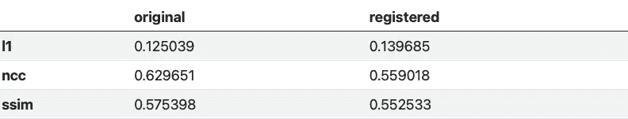

与原始图像相比，我们的指标较差。让我们看看实际发生了什么：

```py
visualise_registration_results(opt.registered_images, images, template, l1_losses)
```

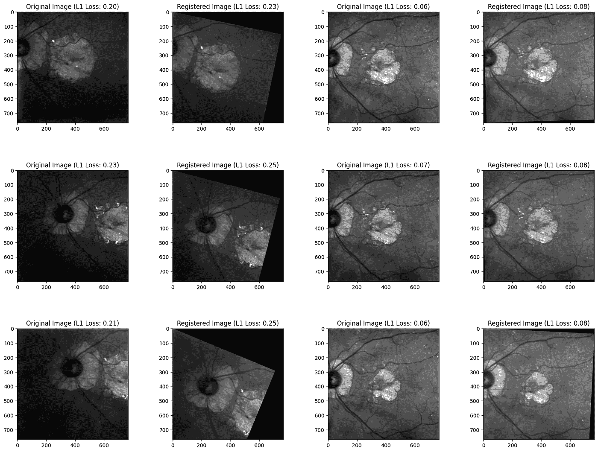

图片由作者提供。

有趣。因此，指标通常较差，但这样出现的原因是因为这些指标比较的是移动图像上的大黑色区域。我们可能需要包括与上述相同的指标，但排除完全黑色的像素进行比较。

```py
def evaluate_registration(template_img: np.ndarray, registered_imgs: List[np.ndarray]):
    """
    Evaluate the registration quality of multiple registered images with respect to a template image.
    """
    l1_losses = []
    ncc_values = []
    ssim_values = []
    l1_losses_excl_black = []
    ncc_values_excl_black = []
    ssim_values_excl_black = []

    for i, registered_img in enumerate(registered_imgs):

        # Create mask of non-black pixels in original image
        mask = (registered_img.ravel() != 0.0)

        # Compute L1 loss between the template and registered images
        l1_loss = np.mean(np.abs(template_img - registered_img))
        l1_losses.append(l1_loss)

        # Compute L1 loss between the template and registered images, excluding black pixels
        l1_loss_excl_black = np.mean(np.abs(template_img.ravel()[mask] - registered_img.ravel()[mask]))
        l1_losses_excl_black.append(l1_loss_excl_black)

        # Compute normalized cross-correlation between the template and registered images
        ncc = np.corrcoef(template_img.ravel(), registered_img.ravel())[0,1]
        ncc_values.append(ncc)

        # Compute normalized cross-correlation between the template and registered images, excluding black pixels
        ncc_excl_black = np.corrcoef(template_img.ravel()[mask], registered_img.ravel()[mask])[0,1]
        ncc_values_excl_black.append(ncc_excl_black)

        # Compute structural similarity index between the template and registered images
        ssim_value = ssim(template_img, registered_img, data_range=registered_img.max() - registered_img.min())
        ssim_values.append(ssim_value)

        # Compute structural similarity index between the template and registered images, excluding black pixels
        ssim_value_excl_black = ssim(template_img.ravel()[mask], registered_img.ravel()[mask], 
                                     data_range=registered_img.ravel()[mask].max() - registered_img.ravel()[mask].min())
        ssim_values_excl_black.append(ssim_value_excl_black)

    return l1_losses, ncc_values, ssim_values, l1_losses_excl_black, ncc_values_excl_black, ssim_values_excl_black

def summarise_registration(original_images, registered_images, template):

    # Calculate metrics for original images
    l1_losses, ncc_values, ssim_values, l1_losses_black, ncc_values_black, ssim_values_black = evaluate_registration(template, original_images)
    l1_original, ncc_original, ssim_original = np.mean(l1_losses), np.mean(ncc_values), np.mean(ssim_values)
    l1_black_original, ncc_black_original, ssim_black_original = np.mean(l1_losses_black), np.mean(ncc_values_black), np.mean(ssim_values_black)

    # Calculate metrics for registered images
    l1_losses, ncc_values, ssim_values, l1_losses_black, ncc_values_black, ssim_values_black = evaluate_registration(template, registered_images)
    l1_registered, ncc_registered, ssim_registered = np.mean(l1_losses), np.mean(ncc_values), np.mean(ssim_values)
    l1_black_registered, ncc_black_registered, ssim_black_registered = np.mean(l1_losses_black), np.mean(ncc_values_black), np.mean(ssim_values_black)

    # Create dataframe
    df_dict = {'original': {'l1': l1_original, 'ncc': ncc_original, 'ssim': ssim_original,
                            'l1_excl_black': l1_black_original, 'ncc_excl_black': ncc_black_original,
                            'ssim_excl_black': ssim_black_original}, 
               'registered': {'l1': l1_registered, 'ncc': ncc_registered, 'ssim': ssim_registered,
                              'l1_excl_black': l1_black_registered, 'ncc_excl_black': ncc_black_registered,
                              'ssim_excl_black': ssim_black_registered}}

    return style_df(df_dict)
```

```py
images, template = retrieve_images()
summarise_registration(images, opt.registered_images, template)
```

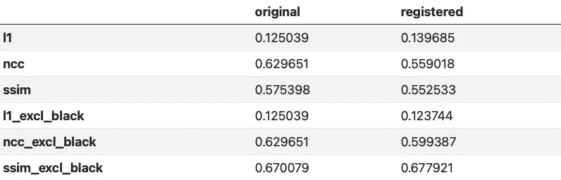

实际上没有显著改善。唯一绝对更好的指标是排除黑色像素的 SSIM。关于为什么会这样的一种理论是，通过排除黑色像素，我们也在排除视网膜，视网膜已经与大多数图像非常对齐，因此“抑制”了对齐良好的图像的指标。

# 光流

光流是计算机视觉中的一种基本技术，它估计视频序列中两个连续帧之间物体的运动。其假设是物体的像素强度在帧之间保持不变，并且物体的表观运动仅由于其实际运动。光流可以表示为一个 2D 矢量场（u,v），将一个速度矢量分配给图像中的每个像素。

光流场可以通过求解将图像亮度变化与像素运动相关联的方程组来计算。这些方程可以使用不同的方法求解，例如 Lucas-Kanade、Horn-Schunck 或 Farneback，每种方法都有其自身的优点和局限性。一旦计算出光流场，它可以用于通过将一幅图像扭曲以对齐另一幅图像来实现图像配准。

光流具有广泛的应用，包括物体跟踪、运动分析、视频稳定和视频压缩。然而，光流估计对图像噪声、遮挡和大位移非常敏感，这可能导致运动估计中的错误和不准确性。当前的研究集中在提高光流方法的准确性、鲁棒性和效率，以增强其在实际场景中的适用性。

让我们来看看这如何工作：

```py
# --- Load the sequence
images, template = retrieve_images()
image0, image1 = images[0], template

# --- Convert the images to gray level: color is not supported.
#image0 = rgb2gray(image0)
#image1 = rgb2gray(image1)
# --- Compute the optical flow
v, u = optical_flow_tvl1(image0, image1)
# --- Use the estimated optical flow for registration
nr, nc = image0.shape
row_coords, col_coords = np.meshgrid(np.arange(nr), np.arange(nc),
                                     indexing='ij')
image1_warp = warp(image1, np.array([row_coords + v, col_coords + u]),
                   mode='edge')
# build an RGB image with the unregistered sequence
seq_im = np.zeros((nr, nc, 3))
seq_im[..., 0] = image1
seq_im[..., 1] = image0
seq_im[..., 2] = image0
# build an RGB image with the registered sequence
reg_im = np.zeros((nr, nc, 3))
reg_im[..., 0] = image1_warp
reg_im[..., 1] = image0
reg_im[..., 2] = image0
# build an RGB image with the registered sequence
target_im = np.zeros((nr, nc, 3))
target_im[..., 0] = image0
target_im[..., 1] = image0
target_im[..., 2] = image0
# --- Show the result
fig, (ax0, ax1, ax2) = plt.subplots(3, 1, figsize=(5, 10))
ax0.imshow(seq_im)
ax0.set_title("Unregistered sequence")
ax0.set_axis_off()
ax1.imshow(reg_im)
ax1.set_title("Registered sequence")
ax1.set_axis_off()
ax2.imshow(target_im)
ax2.set_title("Target")
ax2.set_axis_off()
fig.tight_layout()
```

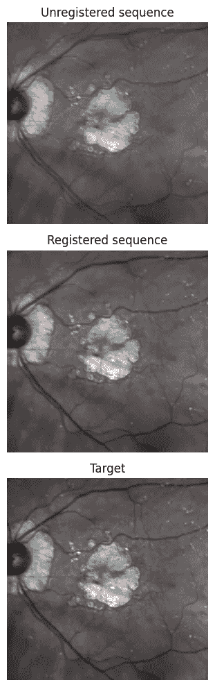

作者提供的图像。

上述代码演示了使用光流进行图像配准。首先，代码加载一系列图像和模板。然后，将图像转换为灰度，并使用 TVL1 算法计算第一幅图像和模板之间的光流。计算出的光流矢量用于将模板图像配准到第一幅图像上。

要实现这一点，代码生成了模板图像的行和列坐标网格，并将光流矢量应用于这些行和列坐标，以获取第一幅图像中的相应位置。然后使用基于样条的图像变形函数，将这些变换后的坐标用于将模板图像扭曲到第一幅图像上。

代码然后生成 RGB 图像，以显示未配准序列、配准序列和目标图像（即第一幅图像）。未配准序列是一个 RGB 图像，其中第一幅图像和模板图像叠加在一起。配准序列是一个 RGB 图像，其中扭曲后的模板图像和第一幅图像叠加在一起。目标图像是一个仅包含第一幅图像的 RGB 图像。

最后，代码使用 Matplotlib 子图显示了三张 RGB 图像。第一个子图显示了未配准的序列，第二个子图显示了已配准的序列，第三个子图显示了目标图像。生成的图提供了未配准和已配准序列的视觉比较，突出了基于光流的配准方法的有效性。

估计的向量场（u,v）也可以通过箭头图进行显示。

```py
# --- Compute the optical flow
v, u = optical_flow_ilk(image0, image1, radius=15)
# --- Compute flow magnitude
norm = np.sqrt(u ** 2 + v ** 2)
# --- Display
fig, (ax0, ax1) = plt.subplots(1, 2, figsize=(8, 4))
# --- Sequence image sample
ax0.imshow(image0, cmap='gray')
ax0.set_title("Sequence image sample")
ax0.set_axis_off()
# --- Quiver plot arguments
nvec = 20  # Number of vectors to be displayed along each image dimension
nl, nc = image0.shape
step = max(nl//nvec, nc//nvec)
y, x = np.mgrid[:nl:step, :nc:step]
u_ = u[::step, ::step]
v_ = v[::step, ::step]
ax1.imshow(norm)
ax1.quiver(x, y, u_, v_, color='r', units='dots',
           angles='xy', scale_units='xy', lw=3)
ax1.set_title("Optical flow magnitude and vector field")
ax1.set_axis_off()
fig.tight_layout()
plt.show()
```

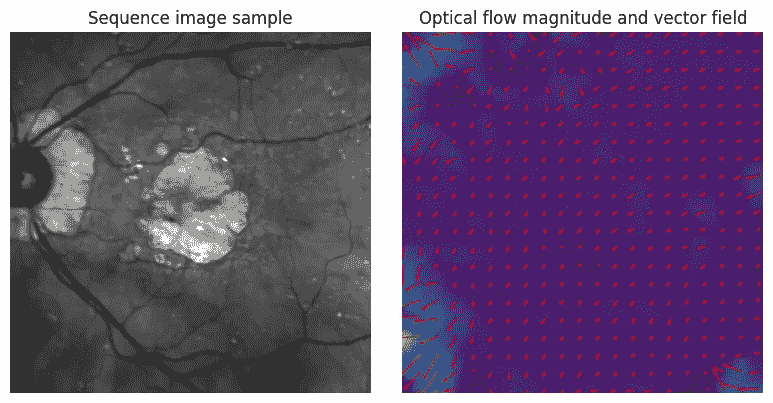

作者提供的图像。

让我们实现算法。

```py
def optical_flow(template, img):
    # calculate the vector field for optical flow
    v, u = optical_flow_tvl1(template, img)
    # use the estimated optical flow for registration
    nr, nc = template.shape
    row_coords, col_coords = np.meshgrid(np.arange(nr), np.arange(nc),
                                         indexing='ij')
    registered = warp(img, np.array([row_coords + v, col_coords + u]), mode='edge')
    return registered

opt = RegistrationAlgorithm(optical_flow)
```

```py
images, template = retrieve_images()
summarise_registration(images, opt.registered_images, template).loc[['l1', 'ncc', 'ssim']]
```

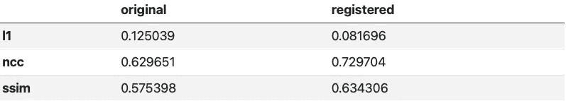

显著提高了性能！让我们可视化一下：

```py
images, template = retrieve_images()
visualise_registration_results(opt.registered_images, images, template, l1_losses)
```

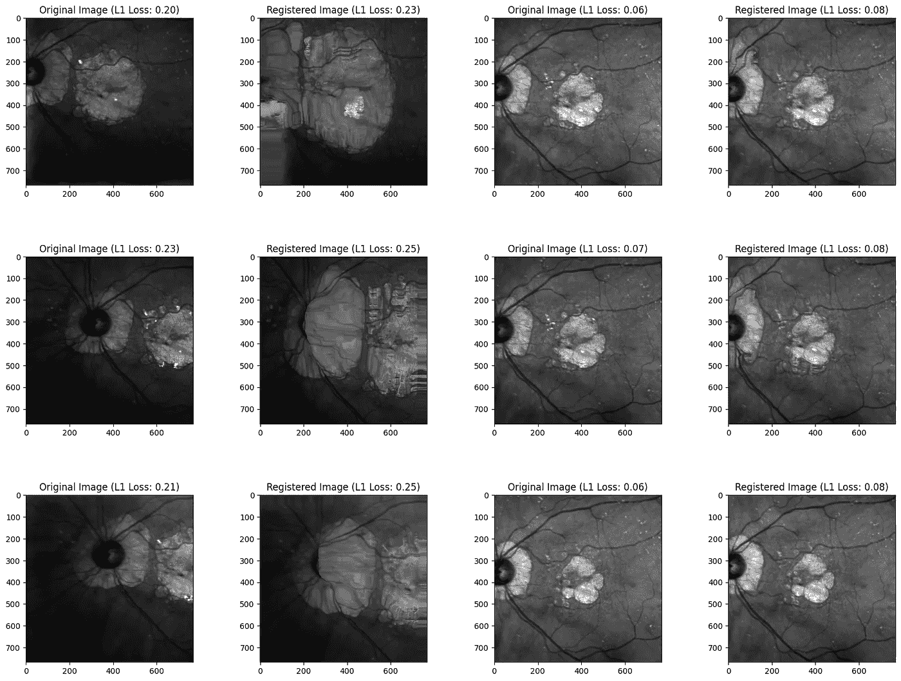

作者提供的图像。

看起来光流在较难的图像上有些“作弊”，通过完全变形图像来实现。让我们看看是否可以改进这一点。

# SimpleElastix

SimpleElastix 是一个开源的多平台软件库，提供了一个简单的接口来执行医学图像配准。图像配准是通过在图像之间找到空间映射来对齐两张或更多张图像的过程。SimpleElastix 提供了广泛的预实现配准组件，包括变换、相似性度量和优化器，这些组件可以轻松组合以创建配准管道。该库支持各种类型的配准，包括刚性、仿射、非刚性和组配准，并允许用户在不同的成像模态中配准图像，如 MRI、CT、PET 和显微镜。

SimpleElastix 的一个关键优点是其易用性。它提供了一个用户友好的高级接口，要求的编码知识很少，并且可以通过 Python 或 C++ 接口使用。此外，该库包括高级功能，如多分辨率优化、正则化和空间约束，这些功能提高了配准的准确性和鲁棒性。SimpleElastix 在医学影像研究和临床实践中被广泛使用，并在许多研究中得到了验证。它是一个有价值的工具，适用于广泛的应用，包括图像引导手术、纵向研究和图像分析。

# 刚性配准

如上所述，刚性变换能够对齐通过平移和旋转相关的对象。例如，在对齐患者骨骼的图像时，刚性变换通常足以对齐这些结构。尽可能使用简单的变换是有利的，因为这减少了可能的解决方案数量，并且最小化了可能影响配准结果准确性的非刚性局部极小值的风险。这种方法可以看作是在配准过程中融入领域专长的一种手段。

让我们看看单个已配准的图像：

```py
import SimpleITK as sitk
from IPython.display import clear_output
from IPython.display import Image

images, template = retrieve_images()
elastixImageFilter = sitk.ElastixImageFilter()
elastixImageFilter.SetFixedImage(sitk.GetImageFromArray(images[0]))
elastixImageFilter.SetMovingImage(sitk.GetImageFromArray(template))
elastixImageFilter.SetParameterMap(sitk.GetDefaultParameterMap("rigid"))
elastixImageFilter.Execute()
clear_output()
sitk.WriteImage(elastixImageFilter.GetResultImage(), 'test.tif')
# load image with SimpleITK
sitk_image = sitk.ReadImage('test.tif')
# convert to NumPy array
im = sitk.GetArrayFromImage(sitk_image)
plt.imshow(im, cmap='gray');
```

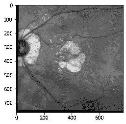

作者提供的图像。

现在，让我们使用上面的架构来应用和验证刚性注册：

```py
def simple_elastix_rigid(image, template):
    elastixImageFilter = sitk.ElastixImageFilter()
    elastixImageFilter.SetFixedImage(sitk.GetImageFromArray(image))
    elastixImageFilter.SetMovingImage(sitk.GetImageFromArray(template))
    elastixImageFilter.SetParameterMap(sitk.GetDefaultParameterMap("rigid"))
    elastixImageFilter.Execute()
    clear_output()
    sitk.WriteImage(elastixImageFilter.GetResultImage(), 'reg.tif')
    # load image with SimpleITK
    sitk_image = sitk.ReadImage('reg.tif')
    # convert to NumPy array
    registered_img = sitk.GetArrayFromImage(sitk_image)
    # delete the tif file
    os.remove('reg.tif')
    return registered_img
```

```py
# retrieve images to be registered, and the image to register to
images, template = retrieve_images()

# perform the registration using SimpleElastix
opt = RegistrationAlgorithm(simple_elastix_rigid)
```

可视化结果：

```py
l1_losses, ncc_values, ssim_values = opt.evaluate(opt.template, opt.registered_images)
visualise_registration_results(opt.registered_images, images, template, l1_losses)
```

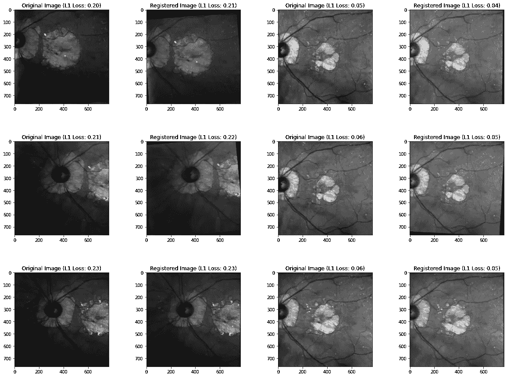

作者提供的图像。

最后，让我们审视这些度量：

```py
images, template = retrieve_images()
summarise_registration(images, opt.registered_images, template)
```

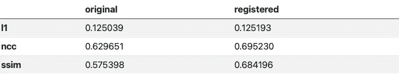

尽管 L1 损失相似，`SimpleElastix` 的刚性注册显著改善了 NCC 和结构相似性损失。

# 仿射注册

非常类似于刚性注册，仿射变换允许我们在旋转和平移之外进行剪切和缩放。通常，仿射注册作为非刚性变换之前的初步预处理步骤使用。

```py
def simple_elastix_affine(image, template):
    elastixImageFilter = sitk.ElastixImageFilter()
    elastixImageFilter.SetFixedImage(sitk.GetImageFromArray(image))
    elastixImageFilter.SetMovingImage(sitk.GetImageFromArray(template))
    elastixImageFilter.SetParameterMap(sitk.GetDefaultParameterMap("affine"))
    elastixImageFilter.Execute()
    clear_output()
    sitk.WriteImage(elastixImageFilter.GetResultImage(), 'reg.tif')
    # load image with SimpleITK
    sitk_image = sitk.ReadImage('reg.tif')
    # convert to NumPy array
    registered_img = sitk.GetArrayFromImage(sitk_image)
    # delete the tif file
    os.remove('reg.tif')
    return registered_img
```

```py
# retrieve images to be registered, and the image to register to
images, template = retrieve_images()

# perform the registration using SimpleElastix
opt = RegistrationAlgorithm(simple_elastix_affine)
l1_losses, ncc_values, ssim_values = opt.evaluate(opt.template, opt.registered_images)
visualise_registration_results(opt.registered_images, images, template, l1_losses
```

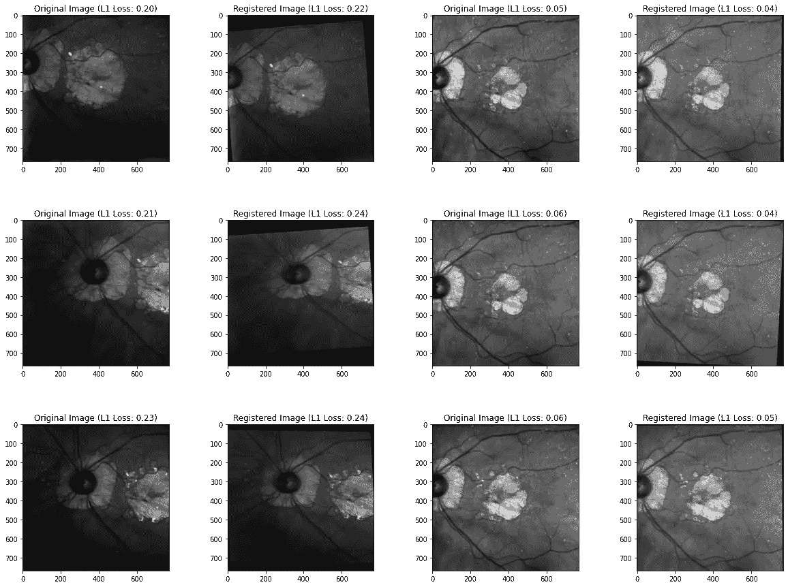

作者提供的图像。

```py
images, template = retrieve_images()
summarise_registration(images, opt.registered_images, template)
```

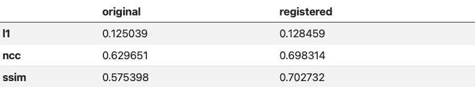

略好于刚性变换。

# 非刚性注册

非刚性注册技术能够对齐需要局部变形的图像，使其更适合处理患者之间的解剖、生理和病理变化。

为了参数化自由形状变形 (FFD) 场，通常使用 B-splines。FFD 场的注册比简单变换复杂得多。参数空间维度的增加使得解决这个问题具有挑战性，因此推荐使用多分辨率方法。以仿射初始化开始也有助于简化注册。在 SimpleElastix 中，实施多分辨率方法非常简单。

以下代码运行多分辨率仿射初始化，然后应用 B-spline 非刚性注册变换。

```py
def simple_elastix_nonrigid(image, template):

    # Initialise the filter, as well as fixed and moving images
    elastixImageFilter = sitk.ElastixImageFilter()
    elastixImageFilter.SetFixedImage(sitk.GetImageFromArray(image))
    elastixImageFilter.SetMovingImage(sitk.GetImageFromArray(template))

    # Setup the initialisation and transforms 
    parameterMapVector = sitk.VectorOfParameterMap()
    parameterMapVector.append(sitk.GetDefaultParameterMap("affine"))
    parameterMapVector.append(sitk.GetDefaultParameterMap("bspline"))
    elastixImageFilter.SetParameterMap(parameterMapVector)

    # Execute and save
    elastixImageFilter.Execute()
    clear_output()
    sitk.WriteImage(elastixImageFilter.GetResultImage(), 'reg.tif')
    # load image with SimpleITK
    sitk_image = sitk.ReadImage('reg.tif')
    # convert to NumPy array
    registered_img = sitk.GetArrayFromImage(sitk_image)
    # delete the tif file
    os.remove('reg.tif')
    return registered_img
```

```py
# retrieve images to be registered, and the image to register to
images, template = retrieve_images()

# perform the registration using SimpleElastix
opt = RegistrationAlgorithm(simple_elastix_nonrigid)
l1_losses, ncc_values, ssim_values = opt.evaluate(opt.template, opt.registered_images)
visualise_registration_results(opt.registered_images, images, template, l1_losses)
```

```py
images, template = retrieve_images()
summarise_registration(images, opt.registered_images, template)
```

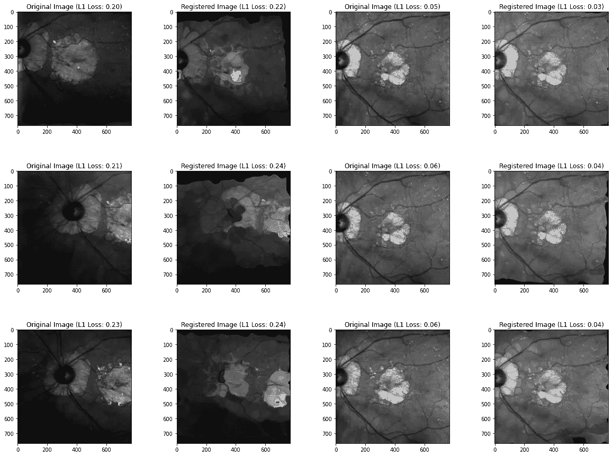

作者提供的图像。

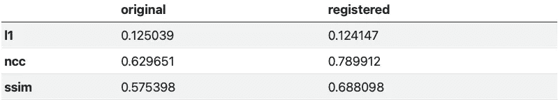

所以 SSIM 比仿射变换稍差，但 NCC 绝对更好。

# 群体注册

群体注册方法在医学影像中用于解决将一张图像注册到选定参考框架时的不确定性。相反，所有图像同时注册到一个位于群体中心的平均参考框架。该方法使用三维或四维 B-spline 变形模型和一个相似度度量，该度量最小化强度方差，同时确保所有图像的平均变形为零。该方法还可以结合变形的时间平滑性和时间维度上的循环变换，这在解剖运动具有周期性特征的情况下非常有用，例如心脏或呼吸运动。通过使用此方法，消除了对特定参考框架的偏倚，从而实现了图像的更准确和无偏注册。然而，该方法计算量巨大，未进行并行处理，因此在这里为了效率而未作介绍。

# 2D Voxelmorph 和空间变换网络

```py
import torch
import torch.nn as nn
from torch.utils.data import Dataset, DataLoader
import torch.nn.functional as F
import torch.optim as optim
import torchvision
from torchvision import datasets, transforms

device = torch.device("cuda" if torch.cuda.is_available() else "cpu")
```

空间变换网络（STN）是一种神经网络架构，能够学习在空间上变换图像，以提高下游任务的性能。特别地，STN 能够自动学习裁剪、旋转、缩放和扭曲输入图像，以适应当前任务的最佳方式。这是通过学习估计每个输入图像的一组仿射变换参数来实现的，这些参数可用于将图像扭曲成新的配置。

在下面的代码中，STN 作为一个模块实现于一个更大的神经网络中，该网络包括几个卷积层和全连接层。STN 由两个组件组成：定位网络和回归器。

定位网络是一组卷积层，用于从输入图像中提取一组特征。这些特征随后被输入到回归器中，回归器是一组用于估计仿射变换参数的全连接层。在提供的代码中，回归器由两个带 ReLU 激活函数的线性层组成。

STN 模块还包括一个`stn`方法，该方法接受输入图像并通过双线性插值将学习到的仿射变换应用于图像。`stn`方法在更大神经网络的前向方法中被调用，用于对变换后的输入进行预测。

总的来说，STN 模块提供了一个强大的工具，用于学习对输入图像进行空间变换，这可以用于提高各种图像处理和计算机视觉任务的性能。

```py
class Net(nn.Module):
    def __init__(self):
        super(Net, self).__init__()
        self.conv1 = nn.Conv2d(1, 10, kernel_size=5)
        self.conv2 = nn.Conv2d(10, 20, kernel_size=5)
        self.conv2_drop = nn.Dropout2d()
        self.fc1 = nn.Linear(320, 50)
        self.fc2 = nn.Linear(50, 10)

        # Spatial transformer localization-network
        self.localization = nn.Sequential(
            nn.Conv2d(1, 8, kernel_size=7),
            nn.MaxPool2d(2, stride=2),
            nn.ReLU(True),
            nn.Conv2d(8, 10, kernel_size=5),
            nn.MaxPool2d(2, stride=2),
            nn.ReLU(True)
        )
        # Regressor for the 3 * 2 affine matrix
        self.fc_loc = nn.Sequential(
            nn.Linear(10 * 188 * 188, 32),
            nn.ReLU(True),
            nn.Linear(32, 3 * 2)
        )
        # Initialize the weights/bias with identity transformation
        self.fc_loc[2].weight.data.zero_()
        self.fc_loc[2].bias.data.copy_(torch.tensor([1, 0, 0, 0, 1, 0], dtype=torch.float))

    # Spatial transformer network forward function
    def stn(self, x):
        xs = self.localization(x)
        xs = xs.view(-1, 10 * 188 * 188)
        theta = self.fc_loc(xs)
        theta = theta.view(-1, 2, 3)
        grid = F.affine_grid(theta, x.size())
        x = F.grid_sample(x, grid)
        return x
    def forward(self, x):
        # transform the input
        x = self.stn(x)
        return x

model = Net().to(device)
```

我们还将尝试一种不同的可微分损失，这种损失可能比之前的度量方法更适合图像配准。给定的代码定义了一种名为 voxelmorph 损失的自定义损失函数，用于 2D 图像配准。该损失函数由两个组件组成：重建损失和平滑惩罚。

重建损失衡量源图像与目标图像之间的不同。它计算为两幅图像之间的绝对差的平均值，并按目标权重加权。源图像和目标图像是配准网络的输入图像，其中源图像被变换以对齐目标图像。

平滑惩罚通过惩罚源图像和目标图像之间的空间变化形变来鼓励平滑变换。该惩罚通过计算目标图像在 x 和 y 方向上梯度的绝对差的平均值来计算，并按平滑权重加权。这个惩罚项有助于避免形变场中的急剧变化，这可能导致过拟合并对新图像的泛化能力差。

总体的 voxelmorph 损失是重建损失和平滑惩罚的总和。通过在训练期间使用基于梯度的优化器来优化损失，以提高配准网络的准确性。

Voxelmorph 损失函数因其处理大变形、多模态图像和个体差异的能力而在医学图像配准中被广泛使用。它对于图像的可变形配准尤为有用，其目标是对齐具有显著形状变化的图像。损失函数中的平滑性惩罚项有助于规范化变形场，并提高配准的准确性。

```py
def voxelmorph_loss_2d(source, target, source_weight=1, target_weight=1, smoothness_weight=0.001):
    def gradient(x):
        d_dx = x[:, :-1, :-1] - x[:, 1:, :-1]
        d_dy = x[:, :-1, :-1] - x[:, :-1, 1:]
        return d_dx, d_dy

    def gradient_penalty(x):
        d_dx, d_dy = gradient(x)
        return (d_dx.abs().mean() + d_dy.abs().mean()) * smoothness_weight

    reconstruction_loss = (source - target).abs().mean() * target_weight
    smoothness_penalty = gradient_penalty(target)
    return reconstruction_loss + smoothness_penalty
```

下面的代码定义了一个 PyTorch 数据集类，名为 `FundusDataset`，用于加载和预处理用于神经网络的训练图像。数据集类接受训练图像列表和目标图像作为输入，并返回一个图像及其对应的目标图像，以便在训练过程中使用。

```py
class FundusDataset(Dataset):
    def __init__(self, image_list, target_image):
        self.image_list = image_list
        self.target_image = target_image

    def __len__(self):
            return len(self.image_list)

    def __getitem__(self, idx):
        image = self.image_list[idx]
        image = torch.from_numpy(image).float()
        return image, self.target_image

# Load your list of Numpy arrays of training images
training_images, template = retrieve_images()
template_image = torch.from_numpy(template).float()
# Create the dataset
dataset = FundusDataset(training_images, template_image)
# Create the data loader
train_loader = DataLoader(dataset, batch_size=32, shuffle=True)
```

现在，让我们编写一个简短的训练循环：

```py
optimizer = optim.SGD(model.parameters(), lr=0.05)
criterion = voxelmorph_loss_2d #nn.L1Loss() #nn.MSELoss()

def train(epoch):
    model.train()
    batch_loss = 0
    for batch_idx, (data, target) in enumerate(train_loader):
        data, target = data.to(device), target.to(device)
        data = data.unsqueeze(1)
        optimizer.zero_grad()
        output = model(data)
        loss = criterion(output.reshape(output.shape[0], 768, 768), target)
        batch_loss += loss.item()
        loss.backward()
        optimizer.step()
    if epoch % 1 == 0:
        avg_loss = batch_loss / len(train_loader)
        print('Train Epoch: {}, Average Loss: {:.6f}'.format(epoch, avg_loss))
for epoch in range(1, 5 + 1):
    train(epoch)
```

最后，我们定义了一个名为 `convert_image_np` 的 Python 函数，将 PyTorch 张量转换为 numpy 图像。该函数以 PyTorch 张量为输入，应用标准归一化程序，通过减去均值并除以标准差值来完成归一化。生成的 numpy 图像随后被裁剪到 0 和 1 之间。

代码接着定义了一个名为 `visualize_stn` 的函数，用于在训练过程中可视化空间变换网络（STN）层的输出。使用 matplotlib 库中的 subplots() 函数将生成的输入和变换后的 numpy 图像并排绘制。图中左侧显示输入图像，右侧显示对应的变换图像。

```py
def convert_image_np(inp):
    """Convert a Tensor to numpy image."""
    inp = inp.numpy().transpose((1, 2, 0))
    mean = np.array([0.485, 0.456, 0.406])
    std = np.array([0.229, 0.224, 0.225])
    inp = std * inp + mean
    inp = np.clip(inp, 0, 1)
    return inp

# We want to visualize the output of the spatial transformers layer
# after the training, we visualize a batch of input images and
# the corresponding transformed batch using STN.

def visualize_stn():
    with torch.no_grad():
        # Get a batch of training data
        data = next(iter(train_loader))[0].to(device)
        data = data.unsqueeze(1)
        input_tensor = data.cpu()
        transformed_input_tensor = model.stn(data).cpu()
        in_grid = convert_image_np(
            torchvision.utils.make_grid(input_tensor))
        out_grid = convert_image_np(
            torchvision.utils.make_grid(transformed_input_tensor))
        # Plot the results side-by-side
        f, axarr = plt.subplots(1, 2, figsize=(20,20))
        axarr[0].imshow(in_grid, cmap='gray')
        axarr[0].set_title('Dataset Images')
        axarr[1].imshow(out_grid, cmap='gray')
        axarr[1].set_title('Transformed Images')
# Visualize the STN transformation on some input batch
visualize_stn()
plt.ioff()
plt.show()
```

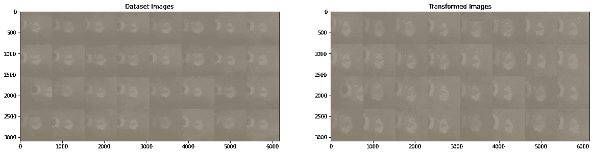

图片由作者提供。

显然，网络已经在某种程度上移动了图像，但对于与模板图像差异过大的眼底图像仍然存在困难。

# 超大规模配准

为了完整性，我在这里包括了一些我尝试过的事情，以使 STN 的效果更好。

# 图像增强

我直觉上认为，图像增强可以通过增加训练数据的多样性和数量来改善 STN 在学习图像配准变换中的性能。STN 依赖大量的训练数据来学习图像之间的复杂空间变换。然而，由于患者数据有限和成像模式的变异等因素，获取足够大且多样的医学图像数据集可能具有挑战性。此外，我每个患者的数据有限，因此训练 STN 仅对许多患者的组合数据可行。

图像增强通过对现有图像应用多种图像变换来生成合成训练数据，提供了一个解决方案。这增加了训练数据集的大小和多样性，使 STN 能够学习更强大且具有更好泛化能力的配准变换。图像增强还可以帮助 STN 学习对某些成像条件如光照、对比度和噪声变化不变的变换。

常见的图像增强技术包括随机旋转、平移、缩放和翻转，以及更复杂的变换，如弹性形变和强度变化。这些变换在训练过程中随机应用，以生成与原始图像相似的各种变换图像。然后使用增强的图像来训练 STN，从而提高其对新图像的泛化能力。

```py
import numpy as np
from PIL import Image
import cv2
import random
import torchvision.transforms as transforms

def image_augmentation(images, base_index=0, n_aug=5):
    # Convert the NumPy arrays to Pillow Image objects
    items = [Image.fromarray(image).convert("RGBA") for image in images]
    # Define the image transformation pipeline
    transform = transforms.Compose([
        transforms.Resize(460),
        transforms.RandomResizedCrop(224, scale=(0.8, 1.0)),
        transforms.RandomAffine(degrees=0, translate=(0.2, 0.2),
                                scale=(0.9, 1.1), shear=0,
                                fillcolor=(128, 128, 128, 255)),
        transforms.ToTensor(),
        transforms.Normalize([0.485, 0.456, 0.406], [0.229, 0.224, 0.225])
    ])
    # Generate the augmented images
    new_items = []
    for i in range(n_aug):
        # Get the base image
        base_item = items[base_index]
        base_image = np.array(base_item)
        # Apply the random transforms to the base image
        transformed_item = transform(base_item)
        # Convert the transformed image to a NumPy array and add it to the list of augmented images
        transformed_image = np.transpose(transformed_item.numpy(), (1, 2, 0))
        transformed_image = cv2.cvtColor(transformed_image, cv2.COLOR_RGB2BGR)
        new_items.append(transformed_image)
    # Convert the augmented data back to NumPy arrays
    new_images = [np.array(image) for image in new_items]
    return new_images
```

然后你可以将这个函数应用到图像列表中，并传入扩展的数据集进行训练。

# 使用 k 最近邻的聚类模型

以下代码实现了对存储为 NumPy 数组的一组图像进行 k-means 聚类。代码的目的是找到最佳的簇数，以最佳地表示图像集。

代码首先将图像列表转换为 2D NumPy 数组，然后将数组重塑为 2D 形状。这是为了创建一个可以输入到 k-means 聚类算法的数据集。然后，对一系列的 k 值（其中 k 是要生成的簇的数量）运行 k-means 算法。对于每个 k 值，运行算法，并计算簇内平方和（WCSS）。WCSS 是衡量每个簇内数据点分散程度的指标，用于评估聚类质量。WCSS 值存储在一个列表中，并对所有 k 值重复此过程。

一旦计算出 WCSS 值，就会生成一个肘部图来可视化簇数与 WCSS 值之间的关系。肘部图展示了一个下降的曲线，并到达一个肘部点，在此点 WCSS 值的下降速度开始平缓。最佳的簇数被选择为曲线开始平缓的值。

```py
from sklearn.cluster import KMeans

# Assume you have a list of images stored as numpy arrays in a variable called "images"
images, template = retrieve_images()
# Convert the list of images to a 2D numpy array
data = np.array(images)
n_samples, height, width = data.shape
data = data.reshape(n_samples, height * width)
# Set up an empty list to hold the within-cluster sum of squares (WCSS) values for each value of k
wcss_values = []
# Set up a range of values for k
k_values = range(1, 11)
# Loop over the values of k and fit a k-means model for each value
for k in k_values:
    kmeans = KMeans(n_clusters=k, random_state=0)
    kmeans.fit(data)

    # Calculate the within-cluster sum of squares (WCSS)
    wcss = kmeans.inertia_
    wcss_values.append(wcss)

# Plot the WCSS values against the number of clusters
fig, ax = plt.subplots()
ax.plot(k_values, wcss_values, 'bo-')
ax.set_xlabel('Number of clusters (k)')
ax.set_ylabel('Within-cluster sum of squares (WCSS)')
ax.set_title('Elbow Plot')
plt.show()
```

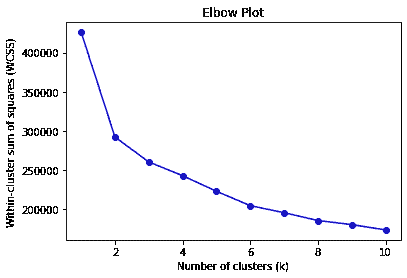

图片由作者提供。

从这个图中来看，最佳的簇数可能是三个。让我们用这个来对我们的图像进行分组：

```py
import numpy as np
import matplotlib.pyplot as plt
from sklearn.cluster import KMeans
from sklearn.neighbors import NearestNeighbors

# Assume you have a list of images stored as NumPy arrays in a variable called "images"
images, template = retrieve_images()
# First, flatten each image into a 1D array
image_vectors = np.array([image.flatten() for image in images])
# Use k-means to cluster the image vectors
kmeans = KMeans(n_clusters=3, random_state=0).fit(image_vectors)
cluster_labels = kmeans.labels_
# Use k-nearest neighbors to find the nearest images to each centroid
n_neighbors = 5
nn = NearestNeighbors(n_neighbors=n_neighbors, algorithm='ball_tree').fit(image_vectors)
distances, indices = nn.kneighbors(kmeans.cluster_centers_)
# Plot the nearest images to each centroid
fig, axs = plt.subplots(kmeans.n_clusters, n_neighbors, figsize=(15, 15))
for i in range(kmeans.n_clusters):
    for j in range(n_neighbors):
        axs[i][j].imshow(images[indices[i][j]], cmap='gray')
        axs[i][j].axis('off')
        axs[i][j].set_title(f"Cluster {i}, Neighbor {j+1}")
plt.show()
# Store the cluster labels and image labels in a dictionary
labels_dict = {}
for i in range(len(images)):
    labels_dict[i] = {"cluster_label": cluster_labels[i]}
```

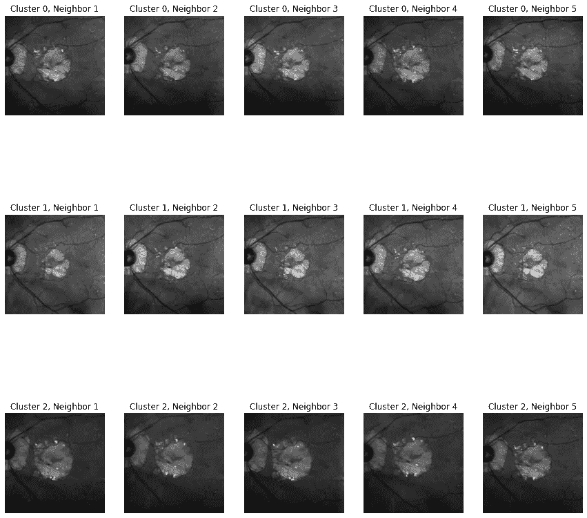

图片由作者提供。

这看起来不错。让我们为每个簇创建一个新列表：

```py
# Assume you have a list of images stored as NumPy arrays in a variable called "images"
images, template = retrieve_images()

# First, flatten each image into a 1D array
image_vectors = np.array([image.flatten() for image in images])

# Use k-means to cluster the image vectors
kmeans = KMeans(n_clusters=3, random_state=0).fit(image_vectors)
cluster_labels = kmeans.labels_

# Use k-nearest neighbors to find the nearest images to each centroid
n_neighbors = 5
nn = NearestNeighbors(n_neighbors=n_neighbors, algorithm='ball_tree').fit(image_vectors)
distances, indices = nn.kneighbors(kmeans.cluster_centers_)

# Store the images in each cluster
cluster_0_images = []
cluster_1_images = []
cluster_2_images = []
for i, cluster_label in enumerate(cluster_labels):
    if cluster_label == 0:
        cluster_0_images.append(images[i])
    elif cluster_label == 1:
        cluster_1_images.append(images[i])
    else:
        cluster_2_images.append(images[i])

# Print the number of images in each cluster
print(f"Number of images in cluster 0: {len(cluster_0_images)}")
print(f"Number of images in cluster 1: {len(cluster_1_images)}")
print(f"Number of images in cluster 2: {len(cluster_2_images)}")
```

```py
Number of images in cluster 0: 38
Number of images in cluster 1: 31
Number of images in cluster 2: 32
```

```py
trained_models = {}

for i, cluster_images in enumerate([cluster_0_images, cluster_1_images, cluster_2_images]):
    # load the spatial transformer network
    model = Net().to(device)
    template_image = torch.from_numpy(template).float()
    # Create the dataset
    dataset = FundusDataset(cluster_images, template_image)
    # Create the data loader
    train_loader = DataLoader(dataset, batch_size=32, shuffle=True)
    optimizer = optim.SGD(model.parameters(), lr=0.05)
    criterion = voxelmorph_loss_2d

    print(f"TRAINING CLUSTER {i}")
    print("-"*50)
    for epoch in range(1, 5 + 1):
        train(epoch)

    trained_models[f"cluster_{i}_model"] = model
    print(" ")
```

```py
TRAINING CLUSTER 0
--------------------------------------------------
Train Epoch: 1, Average Loss: 0.122363
Train Epoch: 2, Average Loss: 0.120482
Train Epoch: 3, Average Loss: 0.117854
Train Epoch: 4, Average Loss: 0.112581
Train Epoch: 5, Average Loss: 0.119771

TRAINING CLUSTER 1
--------------------------------------------------
Train Epoch: 1, Average Loss: 0.079963
Train Epoch: 2, Average Loss: 0.080274
Train Epoch: 3, Average Loss: 0.077222
Train Epoch: 4, Average Loss: 0.076657
Train Epoch: 5, Average Loss: 0.077101

TRAINING CLUSTER 2
--------------------------------------------------
Train Epoch: 1, Average Loss: 0.172036
Train Epoch: 2, Average Loss: 0.171105
Train Epoch: 3, Average Loss: 0.170653
Train Epoch: 4, Average Loss: 0.170199
Train Epoch: 5, Average Loss: 0.169759
```

实际上没有帮助。这也违背了 STN 的整体思想，即使用卷积层来确定应用于哪些图像的变换，即一些图像在变换中需要显著更高的权重。

# 结论

总之，对医学图像配准技术的评估表明，虽然现代方法如空间变换网络（STNs）提供了有希望的结果，但需要大量投资才能实现预期效果。相比之下，传统技术如 SimpleElastix 被证明更有效且高效。尽管实施了各种策略来提高 STN 的性能，但模型未能学习到足够的权重来调整目标，显示出需要替代的损失函数。一种方法可能是忽略由于仿射变换产生的黑色像素。此外，点对点配准利用视网膜或血管等生物标记来指导配准过程，对特定应用可能更有利。因此，需要进一步研究以确定最合适的配准方法，基于具体问题和可用资源。

## 参考文献

数据来自 Kaggle *视网膜基金图像配准数据集*，该数据集的许可证为国际署名 4.0 (CC BY 4.0)。

1.  Kaggle: [视网膜基金图像配准](https://www.kaggle.com/datasets/andrewmvd/fundus-image-registration) 数据集

1.  Jaderberg, M., Simonyan, K., & Zisserman, A. (2015). 空间变换网络。*神经信息处理系统的进展*, *28*。

1.  Hill, D. L., Batchelor, P. G., Holden, M., & Hawkes, D. J. (2001). 医学图像配准。*医学与生物物理学*, *46*(3), R1。

1.  Brown, L. G. (1992). 图像配准技术的综述。*ACM 计算机调查（CSUR）*, *24*(4), 325–376。

1.  Lee, M. C., Oktay, O., Schuh, A., Schaap, M., & Glocker, B. (2019). 图像和空间变换网络用于结构引导的图像配准。在*医学图像计算与计算机辅助干预–MICCAI 2019: 第 22 届国际会议，深圳，中国，2019 年 10 月 13–17 日，会议录，第二十二部分*（第 337–345 页）。Springer International Publishing。

1.  Pytorch: [空间变换网络教程](https://pytorch.org/tutorials/intermediate/spatial_transformer_tutorial.html)
