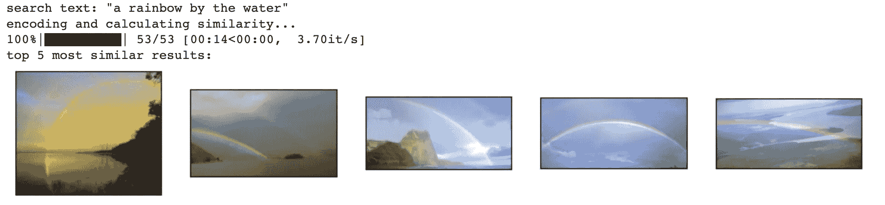

# 5 分钟内掌握图像搜索技术

> 原文：[`towardsdatascience.com/image-search-in-5-minutes-9bc4f903b22a?source=collection_archive---------8-----------------------#2023-10-25`](https://towardsdatascience.com/image-search-in-5-minutes-9bc4f903b22a?source=collection_archive---------8-----------------------#2023-10-25)

## 前沿的图像搜索技术，简单且快速

 [Daniel Warfield](https://medium.com/@danielwarfield1?source=post_page-----9bc4f903b22a--------------------------------)

·

[关注](https://medium.com/m/signin?actionUrl=https%3A%2F%2Fmedium.com%2F_%2Fsubscribe%2Fuser%2Fbdc4072cbfdc&operation=register&redirect=https%3A%2F%2Ftowardsdatascience.com%2Fimage-search-in-5-minutes-9bc4f903b22a&user=Daniel+Warfield&userId=bdc4072cbfdc&source=post_page-bdc4072cbfdc----9bc4f903b22a---------------------post_header-----------) 发表于 [Towards Data Science](https://towardsdatascience.com/?source=post_page-----9bc4f903b22a--------------------------------) ·6 分钟阅读·2023 年 10 月 25 日

--

作者 Daniel Warfield 使用 MidJourney 制作的“权重向量”。除非另有说明，所有图像均为作者创作。

在这篇文章中，我们将使用一个轻量级预训练模型实现文本到图像搜索（允许我们通过文本搜索图像）和图像到图像搜索（允许我们基于参考图像搜索图像）。我们将使用来自对比性语言图像预训练（CLIP）的灵感，我在另一篇文章中有所探讨。

当搜索“水中的彩虹”图像时的结果

**这对谁有用？** 对于任何想要实现图像搜索的开发者、对实际应用感兴趣的数据科学家，或者想了解实践中人工智能的非技术读者都很有用。

**这篇文章的难度如何？** 这篇文章将引导你尽可能快速和简单地实现图像搜索。

**前提条件：** 基础编程经验。

# 我们在做什么，以及我们是如何做到的

本文是我关于“对比语言-图像预训练”文章的配套文章。如果你想更深入地了解理论，欢迎查看：
