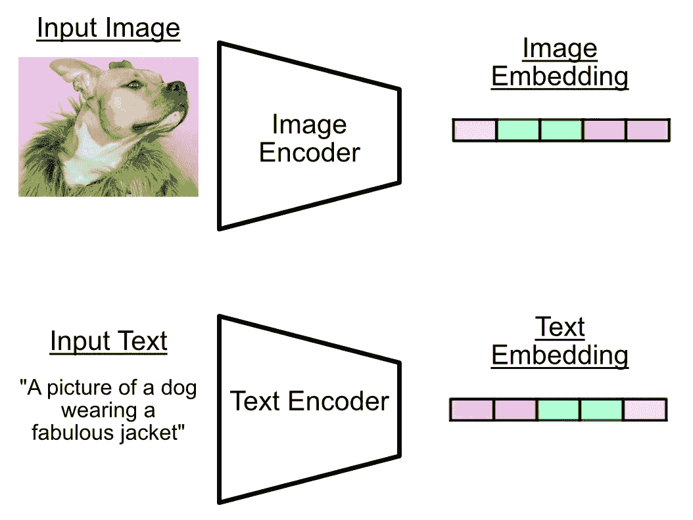
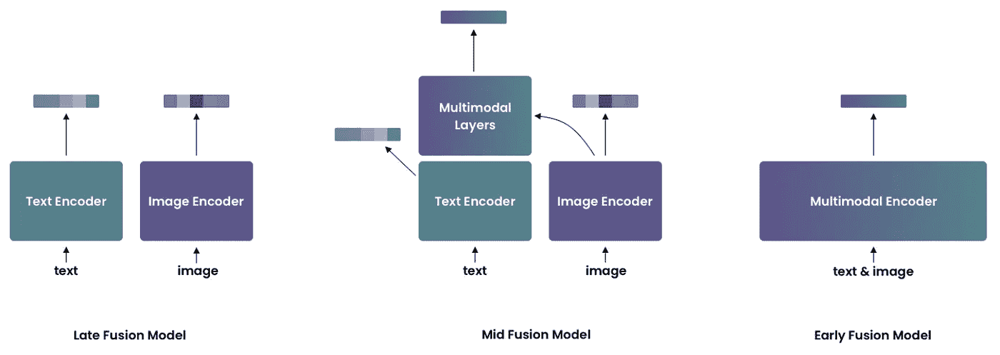
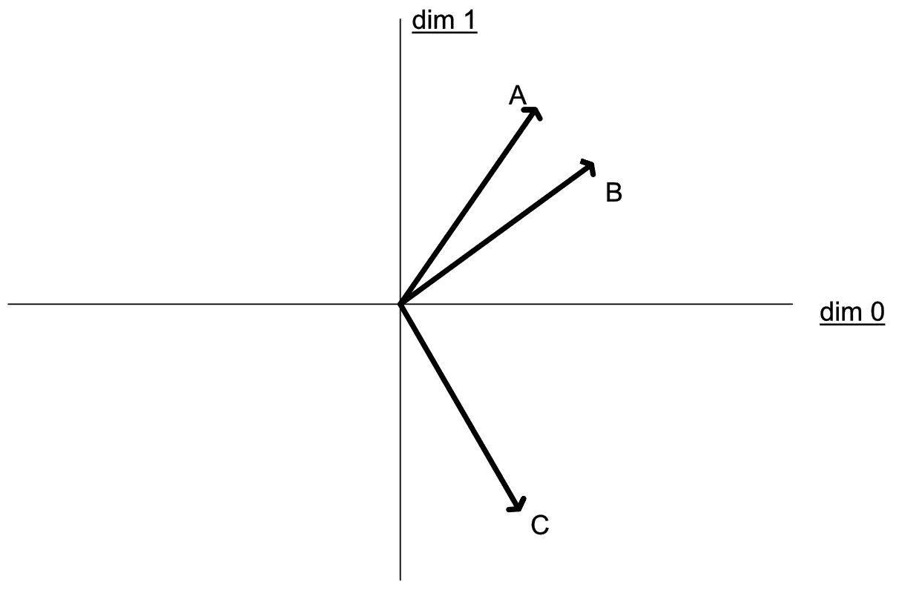
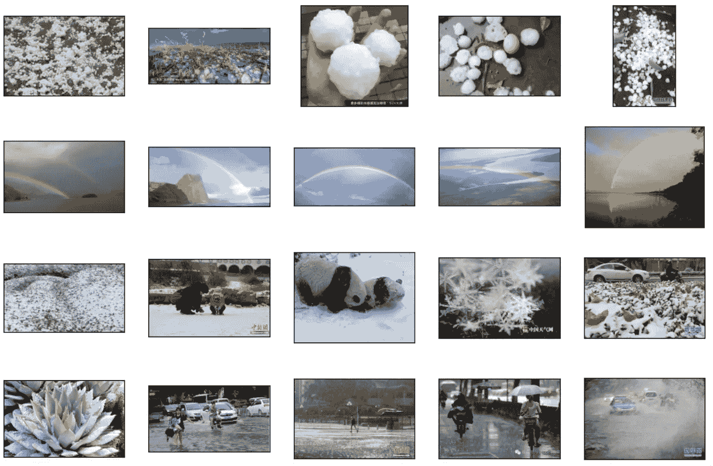
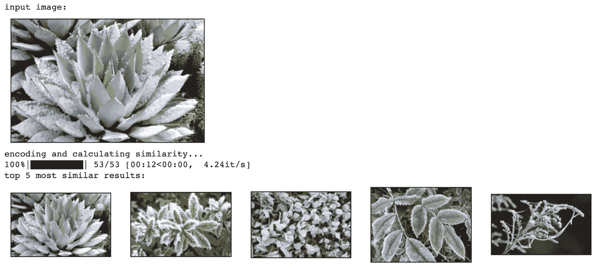

# 5 分钟内的图像搜索

> 原文：[`towardsdatascience.com/image-search-in-5-minutes-9bc4f903b22a`](https://towardsdatascience.com/image-search-in-5-minutes-9bc4f903b22a)

## 前沿的图像搜索，简单快速

[](https://medium.com/@danielwarfield1?source=post_page-----9bc4f903b22a--------------------------------)[](https://towardsdatascience.com/?source=post_page-----9bc4f903b22a--------------------------------) [Daniel Warfield](https://medium.com/@danielwarfield1?source=post_page-----9bc4f903b22a--------------------------------)

·发布于[Towards Data Science](https://towardsdatascience.com/?source=post_page-----9bc4f903b22a--------------------------------) ·6 分钟阅读·2023 年 10 月 25 日

--


作者使用 MidJourney 的“权重向量”。除非另有说明，否则所有图像均为作者所用。

在这篇文章中，我们将使用一个轻量级的预训练模型来实现文本到图像搜索（允许我们通过文本搜索图像）和图像到图像搜索（允许我们基于参考图像搜索图像）。我们将使用的模型用于计算图像和文本的相似性，受到对比语言图像预训练（CLIP）启发，详细讨论见另一篇文章。


使用文本“水边的彩虹”搜索图像的结果

**这对谁有用？** 任何希望实现图像搜索的开发者，对实际应用感兴趣的数据科学家，或希望了解 A.I.实践的非技术读者。

**这篇文章有多先进？** 本文将指导你以最快最简单的方式实现图像搜索。

**前提条件：** 基本编码经验。

# 我们要做什么，以及我们如何做到这一点

本文是我关于“对比语言-图像预训练”文章的补充。如果你想更深入地理解理论，可以查看一下：

[](/clip-intuitively-and-exhaustively-explained-1d02c07dbf40?source=post_page-----9bc4f903b22a--------------------------------) ## CLIP，直观且全面地解释

### 创建强大的图像和语言表示，用于通用机器学习任务。

towardsdatascience.com

CLIP 模型的训练目的是预测任意的标题是否与任意的图像匹配。我们将利用这种通用功能来创建我们的图像搜索系统。具体来说，我们将使用 CLIP 的图像和文本编码器将输入压缩成一个向量，称为嵌入，可以将其视为输入的总结。



编码器的工作是将输入总结成一个有意义的表示，称为嵌入。[我文章中的图像](https://medium.com/towards-data-science/clip-intuitively-and-exhaustively-explained-1d02c07dbf40)。

CLIP 的整体理念是相似的文本和图像将具有相似的向量嵌入。


CLIP 试图让相似事物的嵌入彼此接近。[我文章中的图像](https://medium.com/towards-data-science/clip-intuitively-and-exhaustively-explained-1d02c07dbf40)。

我们将使用的具体模型叫做[uform](https://huggingface.co/unum-cloud/uform)，其概念上类似于 CLIP。uform 是一个宽松许可的、预训练的、高效能的模型，承诺比 CLIP 具有更好的性能。uform 有三种变体，我们将使用与 CLIP 概念上类似的“late fusion”变体。



uform 库中的三种模型类型。正如你所见，“Late Fusion Model”在功能上与 CLIP 非常相似，它从两个编码器中返回两个独立的向量。[source](https://github.com/unum-cloud/uform#mid-fusion)

嵌入之间的实际相似度将使用余弦相似度计算。余弦相似度的本质在于，如果它们的嵌入之间的角度很小，则可以定义为“相似”。因此，我们可以通过首先嵌入文本和图像，然后计算嵌入之间的余弦相似度，来计算文本和图像之间的相似性。



余弦相似度使用向量之间的角度来确定相似性。A 和 B 之间的角度很小，因此 A 和 B 是相似的。C 会被认为与 A 和 B 都非常不同。[我文章中的图像](https://medium.com/towards-data-science/clip-intuitively-and-exhaustively-explained-1d02c07dbf40)。

这就是核心思想：我们下载受 CLIP 启发的模型（uform），使用编码器来嵌入图像和文本，然后使用余弦相似度来搜索相似性。请随时参考这篇附带文章以深入了解理论。现在我们只需将其付诸实践即可。

# 实现

我会跳过一些不重要的内容。完整代码可以在这里找到：

[](https://github.com/DanielWarfield1/MLWritingAndResearch/blob/main/ImageSearch.ipynb?source=post_page-----9bc4f903b22a--------------------------------) [## MLWritingAndResearch/ImageSearch.ipynb 在 main · DanielWarfield1/MLWritingAndResearch

### 用于机器学习写作和研究的笔记本示例 - MLWritingAndResearch/ImageSearch.ipynb 在 main ·…

github.com](https://github.com/DanielWarfield1/MLWritingAndResearch/blob/main/ImageSearch.ipynb?source=post_page-----9bc4f903b22a--------------------------------)

# 下载模型

这非常简单，只需`pip install` `uform`模块，然后使用该模块从 Hugging Face 下载模型。我们将使用英文版本，但也提供其他语言的版本。

```py
!pip install uform
import uform
model = uform.get_model('unum-cloud/uform-vl-english')
```


# 定义一个用于搜索的图像数据库

我从[a dataset](https://www.kaggle.com/datasets/jehanbhathena/weather-dataset)下载了几张图片供我们使用，这个数据集是从[harvard dataverse](https://dataverse.harvard.edu/dataset.xhtml?persistentId=doi%3A10.7910%2FDVN%2FM8JQCR)（创意共享许可）衍生的，并将它们放在了一个公共的[github repo](https://github.com/DanielWarfield1/MLWritingAndResearch/tree/main/Assets/Images/Weather)中。下面的伪代码将这些图片下载到列表`images`中。这个图片列表就是我们最终将要搜索的内容。

```py
#List all files
urls = get_image_urls_from_github()

#Download each file
images = download_images(urls)

#Render out a few examples
render_examples(images)
```



一些来自数据集中我们将要搜索的图像示例

# 实现文本到图像的搜索

这里是关键部分。首先，我们将定义一些搜索文本，在这个例子中是`a rainbow by the water`。然后，我们可以将这些文本嵌入，并将其与所有图片的嵌入进行比较。接着，我们可以通过余弦相似度对其进行排序，展示与搜索文本最相似的前五张图片。请记住，CLIP 风格模型有一个单独的图像编码器和文本编码器，因此文本由文本编码器编码，图像由图像编码器编码。

```py
"""Implementing text to image search
using the uform model to encode text and all images. Then using cosine
similarity to find images which match the specified text. Rendering out the
top 5 results
"""

import torch.nn.functional as F

#defining search phrase
text = "a rainbow by the water"
print(f'search text: "{text}"')

#embedding text
text_data = model.preprocess_text(text)
text_embedding = model.encode_text(text_data)

#calculating cosine similarity
sort_ls = []
print('encoding and calculating similarity...')
for image in tqdm(images):
    #encoding image
    image_data = model.preprocess_image(image)
    image_embedding = model.encode_image(image_data)

    #calculating similarity
    sim = F.cosine_similarity(image_embedding, text_embedding)

    #appending to list for later sorting
    sort_ls.append((sim, image))

#sorting by similarity
sort_ls.sort(reverse=True, key = lambda t: t[0])

print('top 5 most similar results:')
_, axs = plt.subplots(1, 5, figsize=(12, 8))
axs = axs.flatten()
for img, ax in zip([im for sim, im in sort_ls][:5], axs):
    ax.imshow(img)
    ax.get_xaxis().set_visible(False)
    ax.get_yaxis().set_visible(False)
plt.show()
```


# 实现图像到图像搜索

图像到图像搜索与之前讨论的文本到图像搜索行为类似；我们嵌入用于搜索的图像，并嵌入所有其他图像。我们的搜索图像的嵌入与所有其他图像的嵌入进行比较（使用余弦相似度），从而找到与我们搜索图像最相似的图像。自然地，这个例子中最相似的图像就是图像本身。

```py
"""Implementing image to image search
similar to previous approach, except all images are compared to an input image.
Rendering out the top 5 results
"""

#defining search image
input_image = images[15]

#rendering search image
print('input image:')
fig = plt.figure(figsize=(4,4))
ax = fig.add_subplot(111)
ax.imshow(input_image)
ax.get_xaxis().set_visible(False)
ax.get_yaxis().set_visible(False)
plt.show()

#embedding image
image_data = model.preprocess_image(input_image)
search_image_embedding = model.encode_image(image_data)

#calculating cosine similarity
sort_ls = []
print('encoding and calculating similarity...')
for image in tqdm(images):
    #encoding image
    image_data = model.preprocess_image(image)
    image_embedding = model.encode_image(image_data)

    #calculating similarity
    sim = F.cosine_similarity(image_embedding, search_image_embedding)

    #appending to list for later sorting
    sort_ls.append((sim, image))

#sorting by similarity
sort_ls.sort(reverse=True, key = lambda t: t[0])

print('top 5 most similar results:')
_, axs = plt.subplots(1, 5, figsize=(12, 8))
axs = axs.flatten()
for img, ax in zip([im for sim, im in sort_ls][:5], axs):
    ax.imshow(img)
    ax.get_xaxis().set_visible(False)
    ax.get_yaxis().set_visible(False)
plt.show()
```



# 结论

就这样！我们成功地使用了 CLIP 风格模型的图像和文本编码器实现了两种类型的图像搜索：一种基于输入文本，另一种基于输入图像。我们通过使用文本编码器计算文本的嵌入，图像编码器计算图像的嵌入，并通过排序嵌入的相似性（使用余弦相似度）来搜索。

随时查看配套文章，以深入了解 CLIP。

# 关注以获取更多内容！

我描述了机器学习领域的论文和概念，重点在于实际和直观的解释。

**归属:** 本文档中的所有资源均由丹尼尔·沃菲尔德（Daniel Warfield）创建，除非另有来源说明。您可以将本文中的任何资源用于您的非商业用途，只要您引用了这篇文章，[`danielwarfield.dev`](https://danielwarfield.dev/)，或者两者都引用。应要求可以授予明确的商业许可。
