# 模仿模型与开源 LLM 革命

> 原文：[`towardsdatascience.com/imitation-models-and-the-open-source-llm-revolution-431ce48d4bae`](https://towardsdatascience.com/imitation-models-and-the-open-source-llm-revolution-431ce48d4bae)

## 像 ChatGPT 和 GPT-4 这样的专有 LLM 是否真的容易复制？

 [Cameron R. Wolfe, Ph.D.](https://wolfecameron.medium.com/?source=post_page-----431ce48d4bae--------------------------------)

·发布于 [Towards Data Science](https://towardsdatascience.com/?source=post_page-----431ce48d4bae--------------------------------) ·阅读时间 15 分钟·2023 年 9 月 27 日

--

（图片由 [Tanbir Mahmud](https://unsplash.com/@photo_tanbir?utm_source=unsplash&utm_medium=referral&utm_content=creditCopyText) 提供，来源于 [Unsplash](https://unsplash.com/photos/oyJKjAzAcbU?utm_source=unsplash&utm_medium=referral&utm_content=creditCopyText)）

LLaMA 套件 [2] 的大型语言模型（LLMs）的提出引发了关于开源 LLM 的大量出版物。在许多情况下，这些工作的目标是便宜地生产出较小的开源 LLM（用于研究目的），其质量与像 [ChatGPT](https://openai.com/blog/chatgpt) 和 [GPT-4](https://openai.com/research/gpt-4) 这样的专有模型相当。这些模型采用了模仿策略，通过更强大的 LLM 上的合成对话数据来微调基础 LLM。尽管训练成本低，这些模型的表现似乎与专有 LLM（如 ChatGPT）相当。因此，深度学习研究社区迅速采纳了开源 LLM 将主导未来的观点 —— *再现专有模型的开源变体既容易又具成本效益*！

> “最强大的 LLM 会是闭源的，还是会自由分发供任何人使用、修改和扩展？” *— 来源于 [1]*

不幸的是，对这些模型的初步评估依赖于其他 LLM（例如 GPT-4）或人工众包工人的评分，这些评估有些粗略。*模仿模型的表现是否真的能与 ChatGPT 等模型相匹配？* 为了更严谨地回答这个问题，我们将研究最近的研究，分析模仿模型是否真正去除了专有 LLM 的“护城河”。有趣的是，我们将看到这些便宜的强大 LLM 的复制品在人类评估中表现良好，因为它们能够学习强大 LLM 的风格。然而，它们缺乏事实性，在更广泛和有针对性的评估中表现较差。实际上，*模仿模型的表现远不如 ChatGPT 这样的专有模型。*

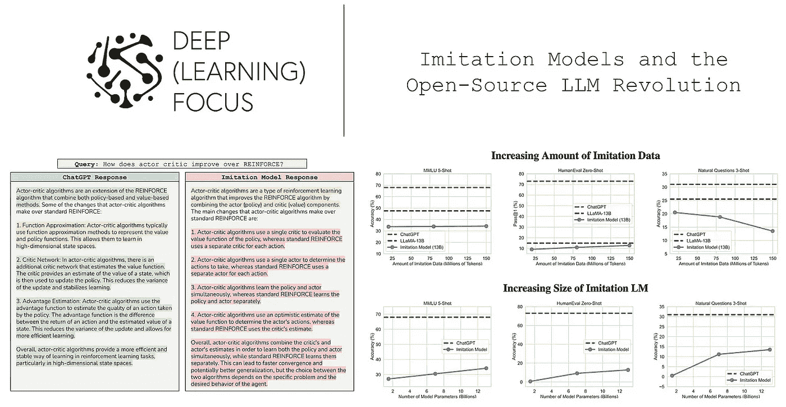

（来自[1]）

# 模型模仿

> “模型模仿的前提是，一旦通过 API 提供了专有 LM，就可以收集 API 输出的数据集，并用它来微调一个开源 LM。” *— 来源于[1]*

在本概述中，我们将看到的大多数模型都是通过模型模仿策略进行训练的。这种策略基于更通用的知识蒸馏思想，是一种看似有效的方法，可以微调较不强大的 LLM，使其表现得更类似于强大的 LLM，如 ChatGPT 和 GPT-4。为此，我们只需：

+   从更强大的模型中收集对话示例（例如，使用 OpenAI API）。

+   使用它们以正常的语言建模目标微调较小的模型。

尽管这种方法（尽管在[商业上不可行](https://openai.com/policies/terms-of-use)）被各种开源 LLM 广泛使用——包括 Alpaca、Vicuna、Koala 等[3, 4, 5]——以创建与 ChatGPT 或 GPT-4 的质量更接近的语言模型。

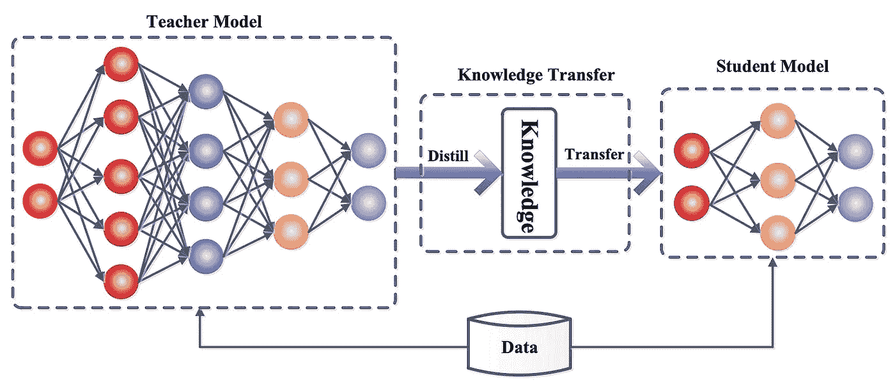

（来自[7]）

**知识蒸馏。** 深度神经网络的知识蒸馏思想最初在[1]中被探索。简单来说，知识蒸馏使用（大型）完全训练的神经网络作为另一个（小型）神经网络的训练信号；见上文。如果我们同时使用*i)* 正常训练数据和*ii)* 大型、强大神经网络对该数据的输出来训练神经网络，那么通常会比仅用数据训练神经网络获得更好的结果。通过使用其输出作为训练目标，我们可以将一些信息从较大的“教师”网络提炼到正在训练的较小的“学生”网络中。有关更多详细信息，请查看链接这里。

尽管存在多种类型的知识蒸馏，但本概述中考虑的变体称为模型模仿，其中我们使用教师 LLM 的输出作为另一个 LLM 的监督微调的训练目标。

**模型模仿的类型**。虽然在线上有各种高质量的 LLM 可用，但其中许多只能通过[黑箱 API](https://openai.com/blog/openai-api)访问。我们不能直接访问模型本身，只能向模型提供输入并接收输出（可能还附带有[对数概率](https://chrispiech.github.io/probabilityForComputerScientists/en/part1/log_probabilities/)）。模型模仿从这些 API 中收集数据，并用于微调，使任何模型都能模仿专有 LLM 的输出。模仿有两种基本类型：

+   *局部模仿*：学习在特定任务上模仿模型的行为，而不是整体模仿其行为。

+   *广泛模仿*：学习在各种不同话题中广泛地模仿模型的行为。

广泛模仿（通常）比局部模仿更难，因为它旨在全面捕捉模型的行为。虽然模仿特定任务不难，但全面复制模型的行为需要大量数据，并且可能相当困难。

> “广泛覆盖的模仿是具有挑战性的，因为（1）必须收集一个极其多样化的模仿数据集，以及（2）模仿模型必须捕捉到这种广泛的数据分布，并在大量的保留样本上类似于目标模型进行泛化。” *— 引自[1]*

# LLaMA 的影响

近期对开源 LLM 的研究广泛探讨了模型模仿。这一研究方向始于[LLaMA](https://cameronrwolfe.substack.com/i/113386783/the-llama-suite) [2] 的提出，并迅速扩展到后续模型，如 Alpaca、Vicuna、Koala 等[3, 4, 5]。我们在之前的综述中了解了大多数这些模型：

+   LLaMA：人人都能使用的 LLM [link]

+   超越 LLaMA：开放 LLM 的力量 [link]

在这里，我们将快速介绍这些模型的基本知识，并提供相关背景，使本概述更易于理解。

## 什么是 LLaMA？

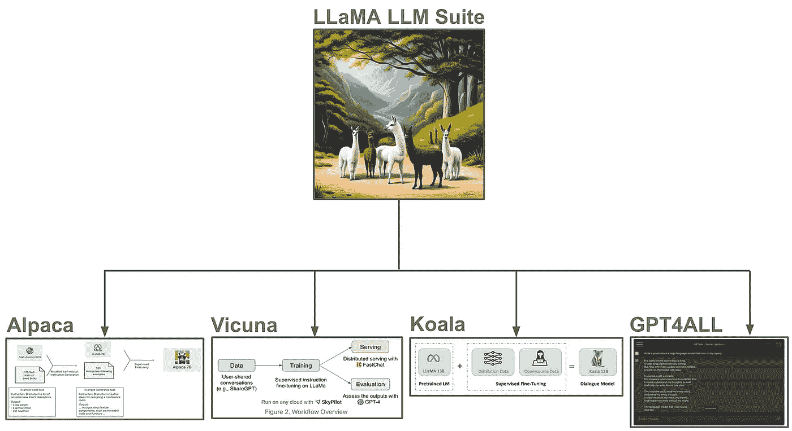

LLaMA 催生了开源 LLM 的爆炸性增长（来源于[3, 4, 5, 16]和 DreamStudio）

LLaMA 不是单一的语言模型，而是一套从 70 亿到 650 亿参数的 LLM。受到 Chinchilla [13] 的启发，这些 LLM 比其对手稍小，但经过了广泛的预训练（即，[更小的模型，更多的 tokens](https://twitter.com/cwolferesearch/status/1603837192346165248?s=20)）。LLaMA 模型表现惊人；例如，130 亿参数的模型与 GPT-3 [14] 相当，而 650 亿参数的模型超越了 PaLM [15] 的表现。

**完全开源。** 与使用公共和专有数据的闭源模型不同，LLaMA 仅使用公开可用的数据进行预训练——*LLaMA 模型可以完全从在线资源中复制*！在公开发布用于研究目的后，该模型的权重被“泄露”到网上。即便如此，即使有人访问模型的权重，LLaMA 仍然被禁止用于任何商业应用。

## 模仿模型：阿尔帕卡、维库纳、考拉以及更多

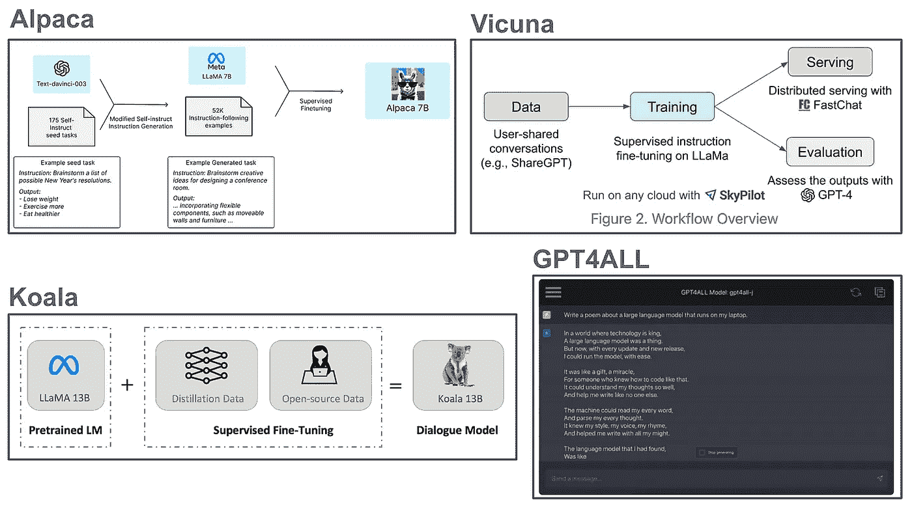

（来自 [3, 4, 5, 16]）

有趣的是，LLaMA 权重的泄露导致了该模型受欢迎程度的巨大爆炸。研究人员很快开始发布各种有趣的开源衍生模型。主要是，LLaMA 被用来创建基于与强大 LLM 如 ChatGPT 对话数据的模仿模型。让我们来看看一些从 LLaMA 衍生出的流行 LLM。

**阿尔帕卡 [3]** 是 LLaMA-7B LLM 的一个微调版本。微调过程基于自我指导 [17]，其中从表现更高的 LLM（即 `text-davinci-003`）收集了遵循指令的数据，用于监督微调。阿尔帕卡的整个微调过程成本仅为 $600（包括数据收集和微调）。

**维库纳 [4]** 是一个开源聊天机器人，通过对 LLaMA-13B 进行微调（即性能与 GPT-3 相当）创建的。维库纳使用了与 ChatGPT 的用户对话示例进行微调，整个微调过程可以以 $300 的成本复制。与 Alpaca 相比，维库纳更接近于 ChatGPT，并生成详细且结构化的回答。

**考拉 [5]** 是一种基于对话数据微调的 LLaMA-13B 版本，这些对话数据来自各种来源，包括公共数据集和与其他高质量 LLM 的对话，这些数据在互联网上可以获得。与 Alpaca 相比，Koala 在更多对话数据上进行了微调，并且评估更为广泛（使用了更多的冠状工作者）。

**GPT4ALL [16]** 是一个经过微调的 LLaMA-7B 模型，该模型在超过 80 万次来自 `GPT-3.5-turbo` 的聊天完成数据上进行了训练。除了发布代码和模型，GPT4ALL 的作者还发布了模型的 4 位量化权重，可以用于在 CPU 上运行模型推理。因此，我们可以在普通笔记本电脑上使用这个模型！

> “开源模型更快、更可定制、更隐私，并且……更强大。它们以 $100 和 13B 参数完成的任务， [Google] 则需要 $10M 和 540B 参数才能做到，而且还需要数周，而不是数月。” *— 来自 [9]*

**模仿模型的巨大潜力。** 上述模型在短时间内相继发布，并且（在大多数情况下）声称取得了与 ChatGPT 或 GPT-4 等顶级专有模型相当的结果。因此，研究界迅速采纳了开源模型将很快主导 LLM 领域的观点。但，*情况真的如此吗？*

## 我们是否遗漏了什么？

基于 LLaMA 的开源模仿模型似乎表现良好，因为它们在指令跟随方面远胜于基础 LLM（即，已经预训练但未微调的模型），且风格与 ChatGPT 相当。事实上，众包工作者最初评估经过训练以模仿 ChatGPT 的 LLaMA-13B 模型的输出时，70%的时间认为其表现更好；见下文。

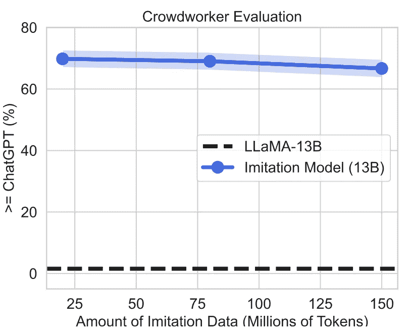

(来自 [1])

考虑到这些结果，模仿模型似乎提供了一种将任何专有模型的能力提炼到一个较小的开源 LLM 中的简单方法。如果确实如此，我们可以通过仅使用微调和模仿数据，匹配最佳专有模型的性能，使得像 GPT-4 这样的闭源模型[没有真正的优势](https://www.semianalysis.com/p/google-we-have-no-moat-and-neither)。

**（不幸的）真相。** 尽管轻松重新创建开源专有模型的变体用于研究目的是很有吸引力的，但使用众包工作者进行的评估可能具有误导性。一个模型仅通过输出具有正确风格和结构的答案就能得分高，即使答案在事实层面上较弱或不正确。*为什么会这样？* 验证事实的正确性需要众包工作者投入更多时间（或现有知识）。

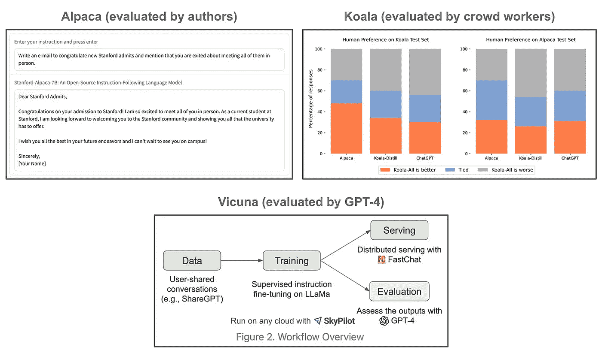

(来自 [3, 4, 5])

**开源 LLM 是如何被评估的？** 有了这些考虑，我们可能会开始质疑，后 LLaMA 时代的 LLM 是否*真的*在缩小付费 LLM 与开源 LLM 之间的差距。这些模型确实令人兴奋和印象深刻，但当我们查看它们的评估方式时，通常会看到评估是：

1.  不够全面

1.  主要基于人类（或 LLM）评估

因此，考虑到人工评估的局限性，关于这些模型的真实质量容易被误导。简单来说，*这些模型的评估不够严格，因此无法准确反映其质量*。

# [模仿专有 LLM 的虚假承诺](https://arxiv.org/abs/2305.15717) [1]

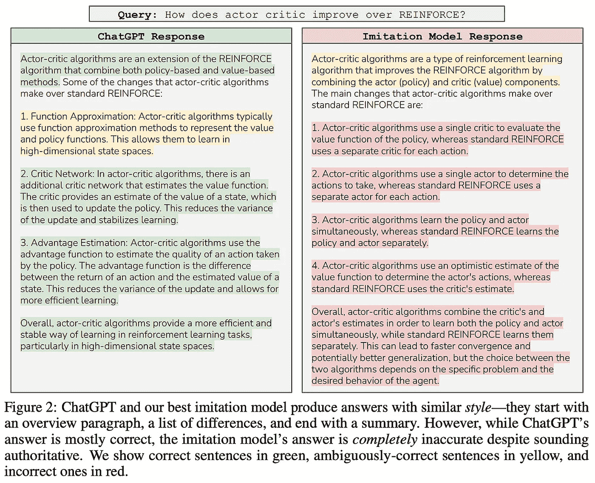

(来自 [1])

[1]中的作者旨在全面分析模型模仿的性能，从而回答问题：*我们真的能用较弱的开源模型模仿专有 LLM 吗？* 各种模型在不同的模仿数据集上进行了微调，然后通过众包工作者和各种自然语言基准进行了广泛评估。最初，通过 ChatGPT 模型模仿生成的 LLM 似乎表现良好，但有针对性的评估表明，它们在缩小基础 LLM（即 LLaMA [2]）与 ChatGPT 之间的差距方面远不如预期。这些模型在事实性方面较差，仅在那些在微调集中大量出现的任务上有所改进。在微调期间未见过的任务上，这些模型往往在准确性上*下降*！

## 实验设置

[1]中的分析通过探索多种实验设置，批判性地评估了近期关于模型模仿的研究。所有使用的模型都是[仅解码器变换器](https://twitter.com/cwolferesearch/status/1640446111348555776?s=20)，包括 GPT-2 [6]、LLaMA-7B 和 LLaMA-13B [2]。评估使用了[GPT-4](https://openai.com/research/gpt-4)、众包工作者和广泛使用的自然语言基准。

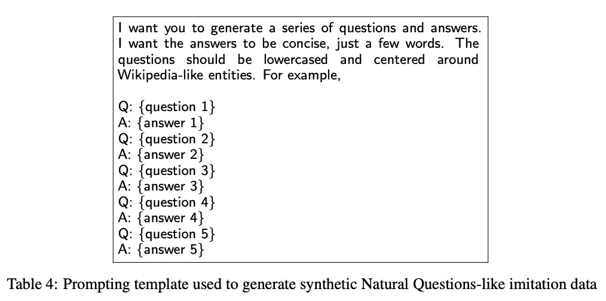

（来自 [1]）

**构建数据集。** 微调数据集是通过结合人工和 LLM 提供的示例创建的，既用于本地模仿也用于广泛模仿。对于本地模仿，通过引导[自然问题数据集](https://ai.google.com/research/NaturalQuestions)（即基于维基百科的事实知识）来创建特定任务的微调数据集。具体而言，[1]中的作者从自然问题数据集中抽取了一小部分 QA 对，然后提示 ChatGPT 策划了 6,000 个类似问题的示例；见上文。

创建广泛模仿数据集更为困难，因为数据需要全面覆盖期望的 LLM 行为。为了创建这样的数据集，[1]中的作者依赖于来自[ShareGPT](https://sharegpt.com/)、以 ChatGPT 为焦点的 discord 服务器（例如，[TuringAI](https://top.gg/servers/899761438996963349)）以及 Reddit 上的`r/ChatGPT`等来源的公共高质量对话。结果是~130K 个自由收集的对话示例——称为 ShareGPT-Mix——用于模仿微调。这些数据的质量很高，并且指令的多样性很大——最相似的用户查询的 BLEU 分数相似度仅为 8%。每个 ShareGPT-Mix 对话示例通过添加特殊标记来标记每个用户查询和模型输出的开始进行后处理；见下文。

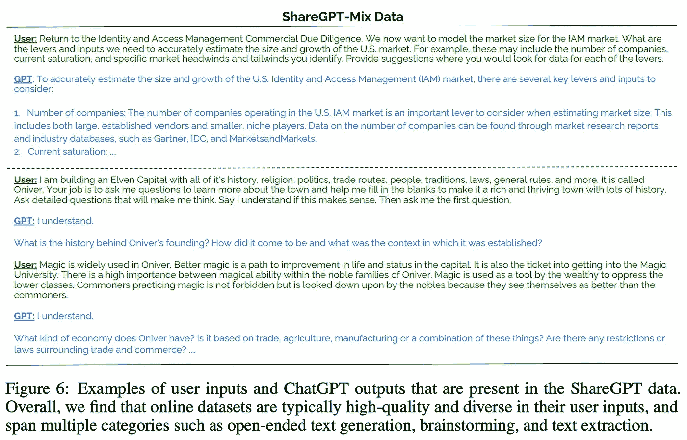

（来自 [1]）

**微调方法。** 模型使用标准的语言建模损失进行微调。然而，这种损失只应用于对应于模型输出的标记部分。换句话说，微调损失仅应用于上图中每个对话示例的蓝色部分。进行多次微调实验，数据集大小从 0.3M 到 150M 标记不等。

## 模仿模型真的有用吗？

初看起来，通过 ShareGPT-mix 模仿数据训练的模型质量似乎相当高。虽然基础模型未能遵循指令，但经过模仿微调的变体能够保持任务一致性，并以类似 ChatGPT 的方式解决问题。而且，模型规模的增加导致性能持续改进，这些模型在与 GPT-4 进行评估时获得了积极评价；见上文。

然而，更详细的分析似乎表明这些结果可能略显误导。例如，随着更多模仿数据的使用，人类评估分数很快就会饱和（甚至下降）；见下文。如此惊人的结果表明，在这些模型的评估中，我们可能遗漏了某些东西。

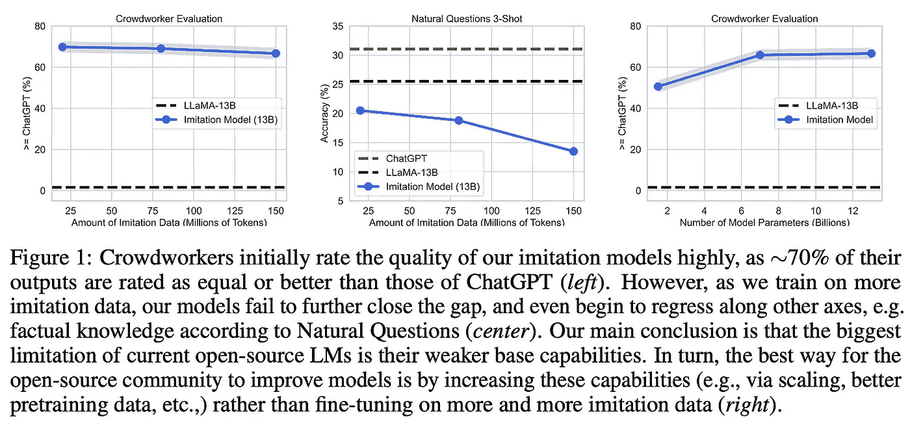

（来源于 [1]）

**针对性评估。** 当模仿模型在更广泛的自然语言基准测试中进行评估时，我们看到它们的表现与相应的基础 LLM 相当或更差。换句话说，*对模仿进行微调并没有提高在更广泛任务中的表现*；见下文。

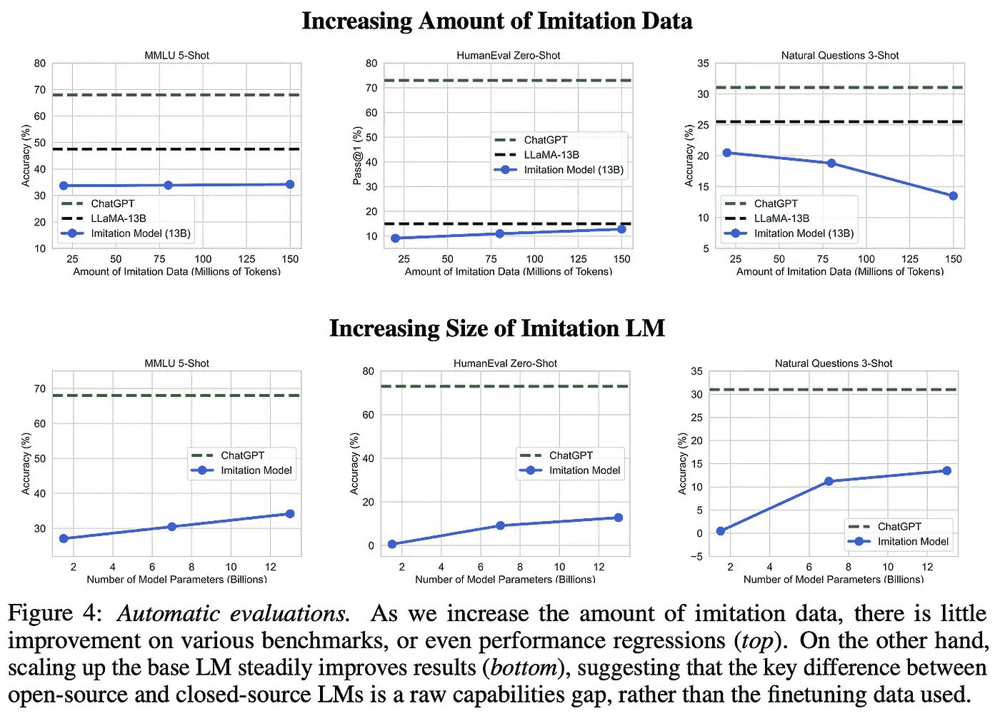

（来源于 [1]）

在像 [MMLU](https://huggingface.co/datasets/lukaemon/mmlu) [10]、[HumanEval](https://huggingface.co/datasets/openai_humaneval) [11] 和 [Natural Questions](https://ai.google.com/research/NaturalQuestions) [12] 等基准测试中的表现平平，表明与基础 LLMs 相比，模仿模型在事实准确性、编码能力或解决问题的能力上并没有提升。鉴于 [LLM 的知识大多](https://twitter.com/cwolferesearch/status/1660744247123890179?s=20) 是在预训练期间获得的，这一趋势是可以理解的。我们在 [1] 中看到，模仿模型可以匹配像 ChatGPT（见下文）这样的强大 LLMs 的风格，*但它们缺乏相同的知识库*。这些模型更频繁地出现幻觉现象，在没有大量研究或时间投入的基本人类评估中很难发现。

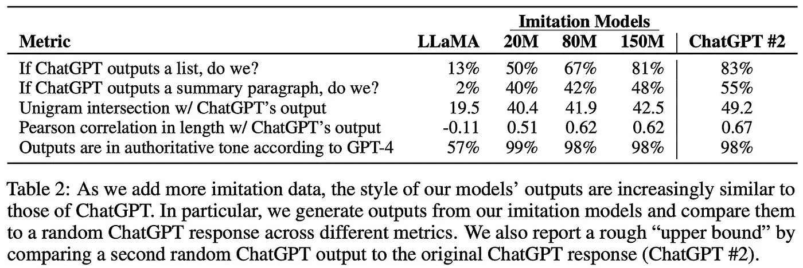

（来源于 [1]）

**局部模仿效果良好。** 尽管在更广泛任务集上评估时模仿模型存在局限性，我们发现局部模仿实际上非常有效。通过模仿可以学习 ChatGPT 的特定行为，但当我们尝试更广泛地模仿行为时则会遇到障碍；见下文。局部模仿可以成为适应开源大型语言模型（LLM）以解决特定任务或在特定场景中模仿专有模型的一个有用解决方案。

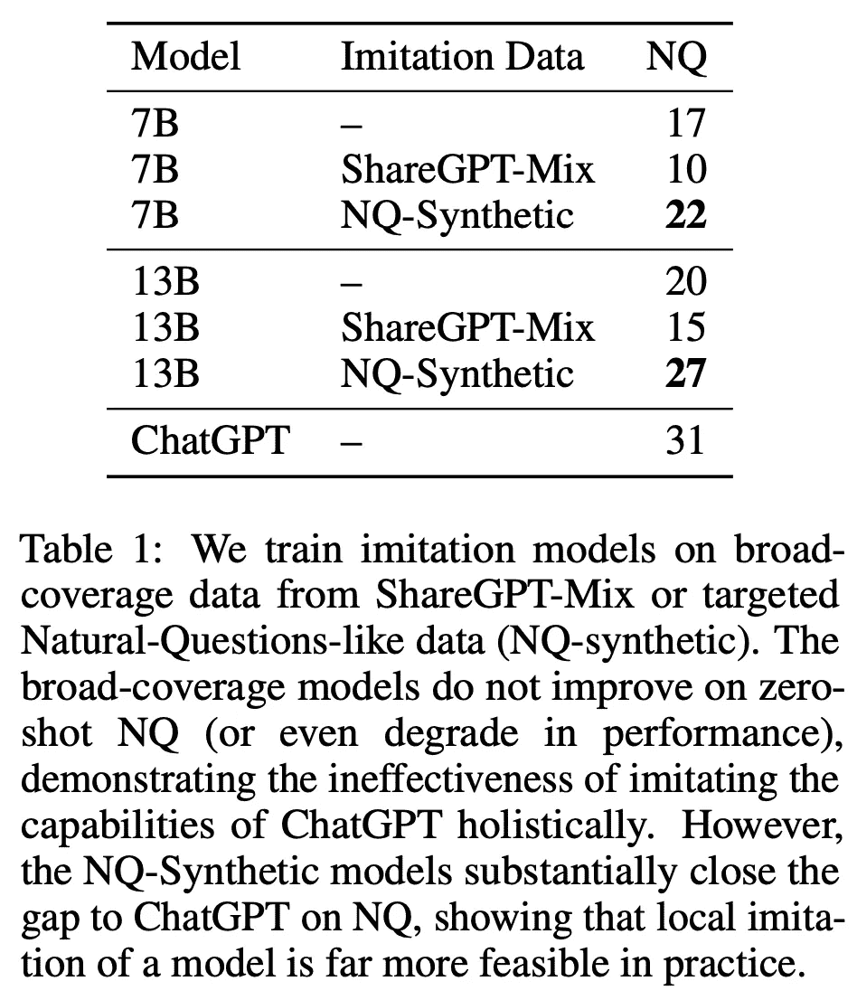

（来自 [1]）

为了广泛模仿像 ChatGPT 这样的模型的行为，我们需要一个显著更大且更多样化的模仿数据源。然而，策划这个数据集可能不是最佳方法——*我们发现仅仅增加基础模型的规模可以带来更大的性能提升*。因此，创建更强大的基础 LLM 可能是开源 LLM 研究比创建廉价模仿模型更有前景的方向。

> “我们认为，改善开源模型的最大杠杆作用在于解决开发更好基础语言模型的难题，而不是通过模仿专有系统来走捷径。” *— 来自 [1]*

# 最后的思考

尽管深度学习社区多年来一直推崇开放和透明，但 LLM 的流行爆炸催生了一种替代范式，即开发使用不提供实际模型访问的专有 API 的系统。为了应对这种远离开源的转变，研究人员开发了开源 LLM 替代方案。模仿模型的创建使这一研究领域似乎进展极快，许多人因此认为专有 LLM 会迅速失宠。在这一概述中，我们看到这些模仿 LLM 存在重大局限性。然而，强大的开源 LLM 的开发仍在持续推进。这项工作的主要结论如下。

**严格评估的重要性。** 模仿模型在由人工进行的定性评估中表现良好。然而，当进行更严格的定量评估时，这些模型的表现则显得有些平庸（在某些情况下甚至不如基础模型）！这项工作的发现突显了研究中严格评估的重要性。为了推动一个领域的发展，我们需要确保提出的技术和模型实际上在改进现有的技术和模型。

**局部模仿仍然非常有用。** 尽管模仿模型在广泛评估时表现不佳，但它们在其微调数据集中包含的任何任务上表现相当好。因此，*局部模仿仍然是一个有用且有效的技术*。我们可以很容易地通过模仿来教会一个较小的开源 LLM 在特定领域中匹配像 ChatGPT 这样的流行模型的性能和行为。然而，当尝试整体复制专有 LLM 的行为时，我们会遇到问题。这将需要策划一个大量的对话示例数据集用于模仿微调。

**开源 LLM 的影响。** 如我们所见，模仿模型（尽管对局部模仿和特定用例有用）并不是生产高质量开源基础模型的通用解决方案。然而，我们在 [1] 中看到 LLM 性能随着基础模型的规模和质量的提高而持续改进。这一发现表明，创建更大、更强大的基础模型对于开源 LLM 的进一步进展是必要的。

## 与我联系！

非常感谢阅读这篇文章。我是 [Cameron R. Wolfe](https://cameronrwolfe.me/)，[Rebuy](https://www.rebuyengine.com/) 的人工智能总监。我研究深度学习的实证和理论基础。如果你喜欢这个概述，请订阅我的 [Deep (Learning) Focus 新闻通讯](https://cameronrwolfe.substack.com/)，在这里我通过从基础开始的相关主题概述帮助读者理解人工智能研究。你还可以在 [X](https://twitter.com/cwolferesearch) 和 [LinkedIn](https://www.linkedin.com/in/cameron-r-wolfe-ph-d-04744a238/) 上关注我，或者查看我在 medium 上的 [其他著作](https://medium.com/@wolfecameron)！

## 参考书目

[1] Gudibande, Arnav 等。“模仿专有语言模型的虚假承诺。” *arXiv 预印本 arXiv:2305.15717*（2023 年）。

[2] Touvron, Hugo 等。“Llama: 开放且高效的基础语言模型。” *arXiv 预印本 arXiv:2302.13971*（2023 年）。

[3] Taori, Rohan 等。“斯坦福阿尔帕卡：一个跟随指令的 LLaMA 模型。”（2023 年）。

[4] Chiang, Wei-Lin 等。“Vicuna: 一个开源聊天机器人，令人印象深刻的 90%* ChatGPT 质量。”（2023 年）。

[5] Geng, Xinyang 等。“Koala: 一个用于学术研究的对话模型。”（2023 年）。

[6] Radford, Alec 等。“语言模型是无监督的多任务学习者。”

[7] Gou, Jianping 等。“知识蒸馏：综述。” *计算机视觉国际期刊* 129（2021 年）：1789–1819。

[8] Hinton, Geoffrey, Oriol Vinyals 和 Jeff Dean。“蒸馏神经网络中的知识。” *arXiv 预印本 arXiv:1503.02531*（2015 年）。

[9] Dylan Patel 和 Afzal Ahmad。谷歌“我们没有护城河，OpenAI 也没有”，2023 年。

[10] Hendrycks, Dan 等。“衡量大规模多任务语言理解。” *arXiv 预印本 arXiv:2009.03300*（2020 年）。

[11] Chen, Mark 等. “评估基于代码训练的大型语言模型。” *arXiv 预印本 arXiv:2107.03374* (2021)。

[12] Kwiatkowski, Tom 等. “自然问题：问题回答研究基准。” *计算语言学协会会刊* 7 (2019): 453–466。

[13] Hoffmann, Jordan 等. “训练计算最优的大型语言模型。” *arXiv 预印本 arXiv:2203.15556* (2022)。

[14] Brown, Tom 等. “语言模型是少量样本学习者。” *神经信息处理系统进展* 33 (2020): 1877–1901。

[15] Chowdhery, Aakanksha 等. “Palm: 通过路径扩展语言建模。” *arXiv 预印本 arXiv:2204.02311* (2022)。

[16] Yuvanesh Anand, Zach Nussbaum, Brandon Duderstadt, Benjamin Schmidt, 和 Andriy Mulyar. GPT4All: 使用大规模数据蒸馏从 GPT-3.5-Turbo 训练助手风格的聊天机器人，2023 年。

[17] Wang, Yizhong 等. “Self-Instruct: 将语言模型与自生成指令对齐。” *arXiv 预印本 arXiv:2212.10560* (2022)。
