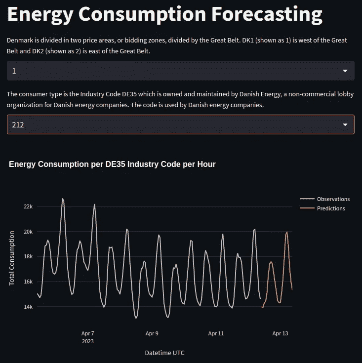

# 不完美揭示：我们 MLOps 课程创建背后的迷人现实

> 原文：[`towardsdatascience.com/imperfections-unveiled-the-intriguing-reality-behind-our-mlops-course-creation-6ff7d52ecb7e`](https://towardsdatascience.com/imperfections-unveiled-the-intriguing-reality-behind-our-mlops-course-creation-6ff7d52ecb7e)

## [全栈 7 步骤 MLOps 框架](https://towardsdatascience.com/tagged/full-stack-mlops)

## 附加课程：‘不完美’ML 项目的幕后 — 经验教训与见解

 [Paul Iusztin](https://pauliusztin.medium.com/?source=post_page-----6ff7d52ecb7e--------------------------------)

·发布在[Towards Data Science](https://towardsdatascience.com/?source=post_page-----6ff7d52ecb7e--------------------------------) ·10 分钟阅读·2023 年 6 月 19 日

--

[Hassan Pasha](https://unsplash.com/@hpzworkz?utm_source=medium&utm_medium=referral)的照片，来自[Unsplash](https://unsplash.com/?utm_source=medium&utm_medium=referral)

本文代表**7 节课程中的最后一节附加课程**，逐步指导你如何**设计、实施和部署 ML 系统**，使用**MLOps 最佳实践**。在课程中，你构建了一个生产就绪的模型，用于预测来自丹麦的多个消费者类型在未来 24 小时的能源消耗水平。

*在课程中，你学习了如何设计、编码和部署一个基于批量服务架构的 ML 系统的所有基础知识。*

本课程*针对中级/高级 ML 或软件工程师*，希望通过构建自己的 ML 端到端项目来提升技能。

> 现在，证书随处可见。构建先进的端到端项目并展示出来是获得专业工程师认可的最佳方式。

# 目录：

+   课程简介

+   课程内容

+   数据来源

+   *附加课程：‘不完美’ML 项目的幕后 — 经验教训与见解*

+   结论

+   参考文献

# 课程简介

***在 7 节课程中，你学会了如何：***

+   设计一个批量服务架构

+   使用 Hopsworks 作为特征存储

+   设计一个从 API 读取数据的特征工程管道

+   构建一个带有超参数调优的训练管道

+   使用 W&B 作为 ML 平台来跟踪你的实验、模型和元数据

+   实现批量预测管道

+   使用 Poetry 构建你自己的 Python 包

+   部署你自己的私有 PyPi 服务器

+   使用 Airflow 协调一切

+   使用预测结果编写一个使用 FastAPI 和 Streamlit 的 Web 应用程序

+   使用 Docker 容器化你的代码

+   使用 Great Expectations 确保数据验证和完整性

+   随时间监控预测的性能

+   将所有内容部署到 GCP

+   使用 GitHub Actions 构建 CI/CD 管道

如果你还没有跟进这个系列，并且觉得它可能对你有兴趣，我想让你知道，完成课程后，你将理解我之前所说的一切。最重要的是，你将看到我为什么使用这些工具以及它们如何作为一个系统协同工作。

**如果你想从本课程中获得最大收益，** [**我建议你访问包含所有课程代码的 GitHub 仓库**](https://github.com/iusztinpaul/energy-forecasting) **。本课程旨在快速阅读和复制文章中的代码。**

在课程中，你学习了如何实现下图。逐步解释之后，它看起来不那么可怕了，对吧？

课程中构建的架构图 [作者提供的图片]。

在这**最后的奖励课程**中，我们想讨论*当前架构的潜在改进*以及在课程中做出的*设计选择*。我们还希望强调*必须做出的权衡*，并给你一些未来项目的想法。

把它看作是幕后花絮部分👀

# 课程内容：

1.  [批处理服务。特征存储。特征工程管道。](https://medium.com/towards-data-science/a-framework-for-building-a-production-ready-feature-engineering-pipeline-f0b29609b20f)

1.  [训练管道。ML 平台。超参数调整。](https://medium.com/towards-data-science/a-guide-to-building-effective-training-pipelines-for-maximum-results-6fdaef594cee)

1.  [批量预测管道。使用 Poetry 打包 Python 模块。](https://medium.com/towards-data-science/unlock-the-secret-to-efficient-batch-prediction-pipelines-using-python-a-feature-store-and-gcs-17a1462ca489)

1.  私人 PyPi 服务器。使用 Airflow 协调一切。

1.  使用 GE 进行质量和完整性数据验证。模型性能持续监控。

1.  [使用 FastAPI 和 Streamlit 消费和可视化你的模型预测。容器化一切。](https://medium.com/towards-data-science/fastapi-and-streamlit-the-python-duo-you-must-know-about-72825def1243)

1.  [将所有 ML 组件部署到 GCP。使用 Github Actions 构建 CI/CD 管道。](https://medium.com/towards-data-science/seamless-ci-cd-pipelines-with-github-actions-on-gcp-your-tools-for-effective-mlops-96f676f72012)

1.  **[附赠] ‘不完美’ ML 项目的幕后 — 经验教训和见解**

奖励课程将公开分享课程的权衡、设计选择和潜在改进。

因此，我们强烈建议您阅读其余的[课程](https://towardsdatascience.com/tagged/full-stack-mlops)，如果您对构建生产就绪的机器学习系统感兴趣 👇

 ## 用于构建生产就绪特征工程管道的框架

### 课程 1：批处理服务。特征存储。特征工程管道。

towardsdatascience.com

# 数据来源

我们使用了一个免费的开放 API，它提供丹麦所有能源消费者类型的每小时能源消耗值[1]。

他们提供了一个直观的界面，您可以轻松查询和可视化数据。[您可以在这里访问数据](https://www.energidataservice.dk/tso-electricity/ConsumptionDE35Hour) [1]。

数据有 4 个主要属性：

+   **UTC 时间：** 数据点被观察到时的 UTC 日期时间。

+   **价格区域：** 丹麦被划分为两个价格区域：DK1 和 DK2——由大贝尔特分隔。DK1 在大贝尔特以西，DK2 在大贝尔特以东。

+   **消费者类型：** 消费者类型是行业代码 DE35，由丹麦能源公司拥有和维护。

+   **总消耗：** 总电力消耗，以 kWh 为单位

**注意：** 观察值有 15 天的滞后！但对于我们的演示用例，这不是问题，因为我们可以模拟与实时相同的步骤。

我们的网络应用程序的截图，显示了我们如何预测区域=1 和消费者类型=212 的能源消耗 [作者提供的图片]。

数据点的分辨率为每小时。例如：“2023-04-15 21:00Z”，“2023-04-15 20:00Z”，“2023-04-15 19:00Z”等。

我们将数据建模为多个时间序列。每个独特的**价格区域**和**消费者类型组合表示其**独特的时间序列。

因此，我们将建立一个模型，为每个时间序列独立预测接下来的 24 小时的能源消耗。

*查看下面的视频，以更好地理解数据的样子* 👇

课程及数据来源概述 [作者提供的视频]。

# 奖励课程：‘不完美’机器学习项目的幕后——经验和见解

不再闲聊。让我们直接进入幕后 🔥

课程中构建的架构图 [作者提供的图片]。

## 整体代码

***#1\. 重复代码***

主要问题在于我们在不同的 Python 模块之间有很多重复的代码，这并没有遵循万能的 DRY 原则。

比如 ML 流水线中的 [settings.py](https://github.com/iusztinpaul/energy-forecasting/blob/main/feature-pipeline/feature_pipeline/settings.py) 和 [utils.py](https://github.com/iusztinpaul/energy-forecasting/blob/main/feature-pipeline/feature_pipeline/utils.py) 文件，或者 UI 的 [dropdown + line plot component](https://github.com/iusztinpaul/energy-forecasting/blob/main/app-frontend/frontend/main.py)。

这段代码可以重构为一个 ***公共*** 模块，供所有其他模块共享。

***#2\. 使用类，而不是函数！***

使用类来建模你的代码是一个好习惯，但我们在课程中只使用了函数。

我们本可以为每个流水线创建一个中央类，例如 FeaturesExtractor、Trainer 和 BatchPredictor。

此外，除了返回包含运行元数据的纯字典外，我们本可以创建一个 RunResult 类，以更好地控制数据的传递方式。

***#3\. 没有测试*** 😟

任何代码库都有一堆单元测试和集成测试来验证对代码所做的所有更改。

## 流水线设计

***#1\. DAG 有状态***

由于 DAG 有状态，因此并不容易并行运行它。我们的问题在于，你需要之前运行的预测结果来计算监控指标。

因此，根据定义，你不能在不同时间点同时运行相同的 DAG 的多个并行实例。

*什么时候会成为问题？*

*当回填时*。假设你想回填最新 2 个月的每一个小时。如果你按顺序运行程序，它会花费很长时间。

作为解决方案，我们建议将监控组件移动到不同的 DAG。

***#2\. 避免使用 ":latest" 作为资源版本***

如果你使用 ***":latest"*** 标签来访问资源，比如：

+   模型的工件，

+   数据（Feature Store 特征视图或训练数据集），

+   最佳配置工件等。

… 你在多个 ML 流水线运行之间引入了依赖关系。

这很微妙，但让我解释一下 👇

假设你并行运行两个 ML 流水线：A 和 B。流水线 A 首先生成一个新的数据集版本。然后，出于某种原因，流水线 B 在流水线 A 之前启动了训练流水线，并访问了由流水线 A 创建的“最新”数据集版本。

这在并行计算中也被称为“竞争条件”。

在这种情况下，可以通过在同一流水线的任务之间硬编码资源的版本来轻松解决。

例如，访问 *"****dataset:v3****"*，而不是 *"****dataset:latest****"*。

正如你所看到的，回填时速度至关重要。因此，从长远来看，DAG 的并行运行是必要的。

## Airflow

***#1\. 使用 Docker 任务***

这不一定是个问题，但我想强调的是，除了使用 Python 环境，你还可以将代码打包在 Docker 容器中 — [Task Docker Decorator Docs](https://airflow.apache.org/docs/apache-airflow-providers-docker/stable/decorators/docker.html) [2]。

主要好处是，这使系统更具可扩展性。

不过好消息是，课程中学到的过程非常相似。与其将 Python 包推送到 PyPi 注册表，不如将 Docker 镜像推送到 Docker 注册表。

***#2\. 更小、更原子化的任务***

在我们的情况下，DAG 内的任务包含了大量逻辑。它们基本上运行一个完整的应用程序。

这不一定不好，但将其分成更小的部分是一种好习惯。因此，从特定故障点调试、监控和重新启动 DAG 会更容易。

例如，我们本可以使用 Airflow 的 GCS 操作符之一来读取/写入 Python 中的 GCS 数据 — [GCS Airflow 操作符](https://airflow.apache.org/docs/apache-airflow-providers-google/stable/_api/airflow/providers/google/cloud/operators/gcs/index.html) [3]。

***#3\. 从 Airflow 注入超参数调整设置***

目前，超参数调整设置被硬编码在一个 [***configs/gridsearch.py***](https://github.com/iusztinpaul/energy-forecasting/blob/main/training-pipeline/training_pipeline/configs/gridsearch.py) 文件中。

这并不是很灵活，因为修改配置的唯一选项是将新版本推送到 git，这并不太实用。

一种解决方案是从 YAML 文件中注入设置，这可以轻松添加到 Airflow 工作流中。

一个很棒的 ML 模型 YAML 配置工具是 [Hydra](https://github.com/facebookresearch/hydra) 由 *facebookresearch* 提供。试试看，你会感谢我的。

## 监控

***#1\. 未监控系统健康***

我们本可以通过定期 ping API 的 */health* 端点轻松添加一个系统健康监控机制。

我们本可以通过在用户界面上使用绿/红面板来反映这一点。

***#2\. 无警报***

基于我们持续监控的 MAPE 计量，我们本可以添加一个报警系统，例如：

+   *警告 [threshold_B > MAPE > threshold_A]:* 通知工程师某些地方可能出错；

+   *警报 [MAPE > threshold_B > threshold_A]:* 通知工程师某些地方可能出错 + 触发超参数调整逻辑。

***#3\. 丰富用户界面***

我们本可以为每个时间序列单独添加 MAPE 计量。

***#4\. 不要重新发明轮子！***

我们实现了一个迷你监控工具仅作为示例。但在实际应用中，你应该利用现有工具，如 [EvidentlyAI](https://www.evidentlyai.com/) 或 [Arize](https://arize.com/)。

这些工具和包已经提供了专业的解决方案。因此，你可以专注于增加价值。

***#5\. 监控漂移***

作为一个附加功能，监控数据和概念漂移也会很有帮助。但由于我们几乎有实时 GT，这只是一个额外的需求。

## Web 应用 — 预测仪表板

***#1\. 丰富用户界面***

用户界面相当基础。例如，我们可以通过在数据无效时（未通过验证）添加文本和警报来丰富用户界面。

***#2\. 我们以天真的方式请求数据***

我们对 API 的请求相当天真。通常，这些步骤由一系列异常来保护，以捕捉 300、400 和 500 响应代码上的不同行为。

***#3\. 设置是硬编码的***

我们本可以通过使用 ***.env*** 文件注入设置，从而使程序更具配置性。类似于 Web 应用 FastAPI 代码。

## 部署与 CI/CD 管道

***#1\. 部分 CI 实现***

为了完整地完成 CI/CD 管道，我们本可以构建 Web 应用 Docker 镜像，将它们推送到 Docker 注册表，并在将它们部署到 GCP VM 时从那里拉取。

构建 Python 包时也有同样的情况，使用 Poetry。

这是书本上教的做法。

此外，如果我们有任何测试，应该在部署代码之前运行它们。

另一个想法是运行诸如 ***flake8*** 的命令，以验证代码是否遵循 PEP8 规范。

***#2\. 将 PyPi 主机放在不同的 VM 上***

此外，建议将 PyPi 服务器托管在不同的 VM 上，或至少与 Airflow 组件完全独立。

这样，系统将更加模块化和灵活。

***#3\. 将 .env 文件托管在 GCS 存储桶上***

我们本可以将 **.env** 文件存储在 GCS 存储桶中，并在 CI/CD 管道中自动下载它们，而不是手动完成和复制。

***#4\. 自动化基础设施***

你已经看到手动设置所需的所有 GCP 资源有多么乏味……而这只是一个小型基础设施。想象一下，当你的基础设施中有 100 或 1000 个组件时会是什么样的。

这就是为什么建议使用像 Terraform 这样的 IoC 工具来自动化基础设施创建。

# 结论

如果你做到这一步，我想感谢你，并告诉你我多么深切地感激你参加了我的 **全栈 7 步 MLOps 框架** 课程 🙏

在这个额外的课程中，你看到没有任何系统是完美的，你总是必须因为以下原因而做出某些权衡：

+   时间限制，

+   资源限制，

+   规划不周。

既然你看到每个人仍在学习，并且并不全知，你就没有借口不去构建下一个令人惊叹的项目🔥

让我们在 [LinkedIn](https://www.linkedin.com/in/pauliusztin/) 上联系，如果你有任何问题或者想分享你在本课程后构建的令人惊叹的项目，请告诉我。

[***在这里访问 GitHub 仓库。***](https://github.com/iusztinpaul/energy-forecasting)

💡 我的目标是帮助机器学习工程师在设计和生产 ML 系统方面提升水平。请在 [LinkedIn](https://www.linkedin.com/in/pauliusztin/) 上关注我，或订阅我的 [每周通讯](https://pauliusztin.substack.com/) 以获取更多见解！

🔥 如果你喜欢阅读类似的文章并希望支持我的写作，可以考虑[成为 Medium 会员](https://pauliusztin.medium.com/membership)。使用[我的推荐链接](https://pauliusztin.medium.com/membership)，你可以在不增加额外费用的情况下支持我，并享受对 Medium 丰富故事收藏的无限制访问。

 [## 使用我的推荐链接加入 Medium - Paul Iusztin

### 作为 Medium 会员，你的一部分会员费将用于支持你阅读的作者，你可以全面访问每一个故事…

pauliusztin.medium.com](https://pauliusztin.medium.com/membership?source=post_page-----6ff7d52ecb7e--------------------------------)

谢谢 ✌🏼！

# 参考资料

[1] [丹麦 API 的 DE35 行业代码能耗](https://www.energidataservice.dk/tso-electricity/ConsumptionDE35Hour)，[丹麦能源数据服务](https://www.energidataservice.dk/about/)

[2] [任务 Docker 装饰器](https://airflow.apache.org/docs/apache-airflow-providers-docker/stable/decorators/docker.html)，Airflow 文档

[3] [GCS Airflow 操作符](https://airflow.apache.org/docs/apache-airflow-providers-google/stable/_api/airflow/providers/google/cloud/operators/gcs/index.html)，Airflow 文档
