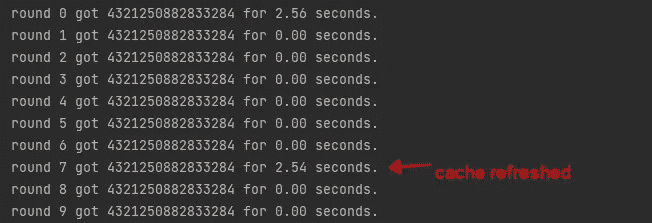
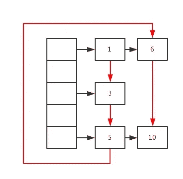

# 在 Python 中实现具有 TTL 功能的缓存装饰器

> 原文：[`towardsdatascience.com/implement-a-cache-decorator-with-ttl-feature-in-python-1d6969b7ca3f`](https://towardsdatascience.com/implement-a-cache-decorator-with-ttl-feature-in-python-1d6969b7ca3f)

## 基于@functools.lru_cache 的装饰器支持缓存过期

 [Peng Qian](https://qtalen.medium.com/?source=post_page-----1d6969b7ca3f--------------------------------)

·发表于[Towards Data Science](https://towardsdatascience.com/?source=post_page-----1d6969b7ca3f--------------------------------) ·5 分钟阅读·2023 年 4 月 3 日

--

由[Aron Visuals](https://unsplash.com/@aronvisuals?utm_source=medium&utm_medium=referral)拍摄的照片，刊登在[Unsplash](https://unsplash.com/?utm_source=medium&utm_medium=referral)上

# **问题：**

Python 的 functools 包中的[lru_cache](https://docs.python.org/3/library/functools.html#functools.lru_cache)装饰器提供了基于 LRU 缓存的实现。使用这个装饰器，具有相同参数的函数在第二次执行时会显著更快。

然而，lru_cache 不能支持缓存过期。如果你希望缓存在一定时间后过期以便在下次调用函数时更新缓存，lru_cache 无法实现这一点。

# **解决方法：**

## **1. 实现一个具有 TTL 功能的 lru_cache**

因此，我实现了一个新的基于 lru_cache 的装饰器。这个装饰器可以接受一个 ttl 参数。这个参数可以接受一个秒数，当这个时间到期时，下一个函数调用将返回一个新值并刷新缓存。

对于需要紧急解决问题的用户，这里是源代码：

使用非常简单，如下所示：

## **2. 测试效果**

我们使用了一个 ttl_cache，过期时间为 40 秒。然后让函数执行 10 轮，每轮 6 秒。

作者图片

我们可以看到，当它达到第 7 轮时，6*7=42（秒）。缓存被刷新，表明我们的 ttl_cache 成功了，万岁。

# **一些背景知识：**

## **1. 什么是 LRU 缓存？**

假设缓存的大小是固定的，如果缓存已满，则需要删除一些内容以腾出空间给新内容。但问题是，应该删除哪些内容？我们当然希望删除那些无用的缓存，继续保留有用的数据以供后续使用。那么，我们如何定义“有用”的数据呢？

LRU 缓存策略认为，最近使用的数据应该是“有用的”，而长时间未使用的数据应该是无用的。当容量满时，应优先删除那些无用的数据。

## **2\. 如何实现 LRU 缓存？**

实现 LRU 时，我们需要关注其读写性能。

在此情况下，容易想到使用 HashMap，它可以通过根据键访问数据来实现 O(1) 的速度。但更新缓存的速度无法达到 O(1)，因为需要确定哪些数据是最早被访问的，这就需要遍历所有缓存数据来查找它。

因此，我们需要一种数据结构，它不仅按访问时间排序，还能在常数时间内进行随机访问。

这可以通过使用 HashMap + 双向链表来实现。HashMap 保证通过键访问的数据的时间复杂度为 O(1)，而双向链表则按访问时间的顺序遍历每个数据。选择双向链表而非单向链表的原因是，它可以从链表中任意一个节点修改链表结构，而无需从头节点开始遍历。

如下图所示，黑色部分是 HashMap 的结构，红色箭头是双向链表的前向连接。可以清楚地看到数据访问顺序是 1->3->5->6->10。我们只需在每次访问后更改链表的连接顺序即可实现目标。

作者提供的图片

## **3\. 这如何帮助我们实现 ttl_cache？**

我们知道 LRU 算法使用 HashMap 来实现快速的数据读取，因此我们可以通过在过期时间后更改哈希键来实现缓存过期。

由于 lru_cache 的哈希键是基于装饰函数中所有可哈希参数计算的，因此我们只需添加一个 ttl_hash 参数，并在过期时间之后更改此参数的值。

# **代码解释：**

## **1\. 通用装饰器模板**

当开始编写装饰器时，我会使用装饰器模板代码，这可以帮助我更快地编写装饰器。例如：

## **2\. 延迟执行生成器代码**

接下来，我们需要每次调用 ttl_cache 装饰的函数时生成一个哈希键，如果该哈希键未超过过期时间，则应保持不变。如果超过过期时间，则该哈希键应不同于先前生成的哈希键。

因此，我计划将代码开始运行的时间减去当前时间，然后将结果除以`ttl`参数。最后，将余数作为此哈希键。

由于我需要保存代码开始运行的时间，并且只在必要时获取最新的哈希键，我能想到的最佳方法是使用 [生成器函数](https://wiki.python.org/moin/Generators)：

通过这种方式，我可以在需要时使用`next()`函数获取最新的哈希键。

## **3. 使用 lru_cache 装饰原函数**

接下来，我们将使用`lru_cache`装饰原函数，新函数需要传入`ttl_hash`参数，以便在过期时间后生成新的哈希值：

在封装的函数中，我们每次都会获得一个新的`hash_key`并返回一个带有`ttl_hash`的函数调用以实现我们的目标。

## **4. 别忘了复制原函数的属性**

最后，别忘了将原函数的模块、名称、文档及其他属性复制到新生成的函数中。这里最简单的方法是使用`functools`模块中的`update_wrapper`：

# **结论：**

还有其他解决方案，比如 [expiringdict](https://pypi.org/project/expiringdict/)。

但这些解决方案改变了我们使用`lru_cache`的方式，毕竟，我们只是希望使`lru_cache`更强大。

本文实现的`ttl_cache`是线程安全的，可以在多线程环境中使用。

我希望你喜欢我对 TTL 缓存的实现。欢迎大家评论并提供宝贵的改进建议。感谢阅读。

通过 [加入 Medium](https://medium.com/@qtalen/membership)，你将能够无限访问我和其他成千上万位作者的所有文章。它只需你一杯咖啡的价格，但对我来说是一种很大的鼓励。

本文最初发布在：[`www.dataleadsfuture.com/implement-a-cache-decorator-with-time-to-live-feature-in-python/`](https://www.dataleadsfuture.com/implement-a-cache-decorator-with-time-to-live-feature-in-python/)
