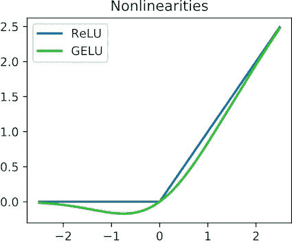
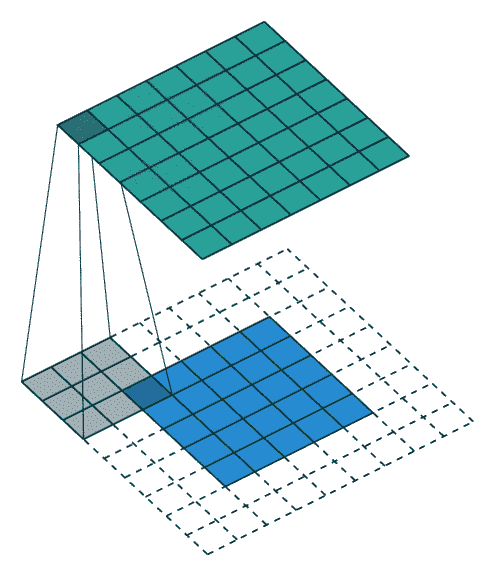
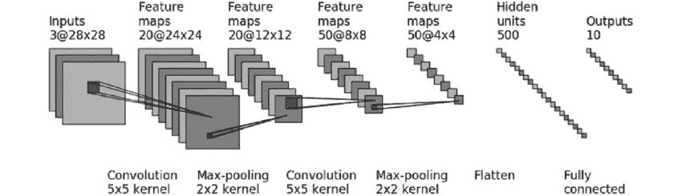
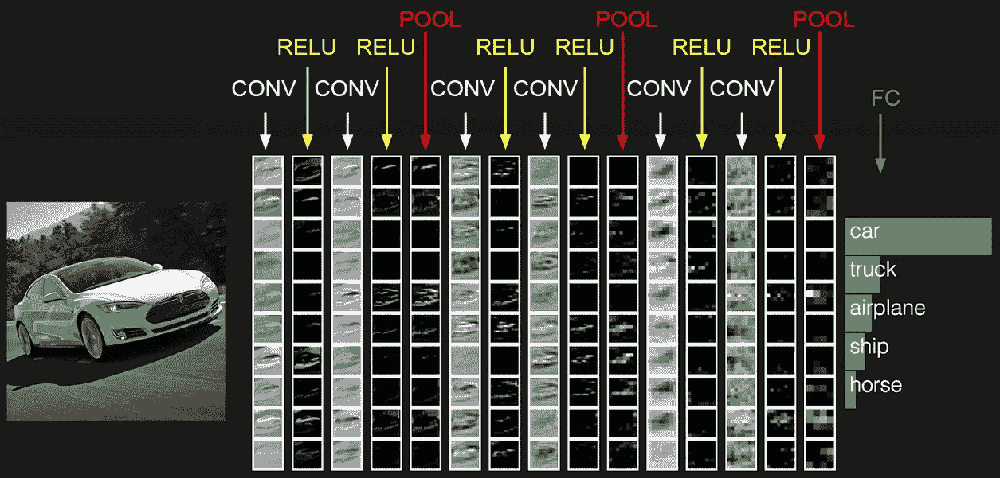
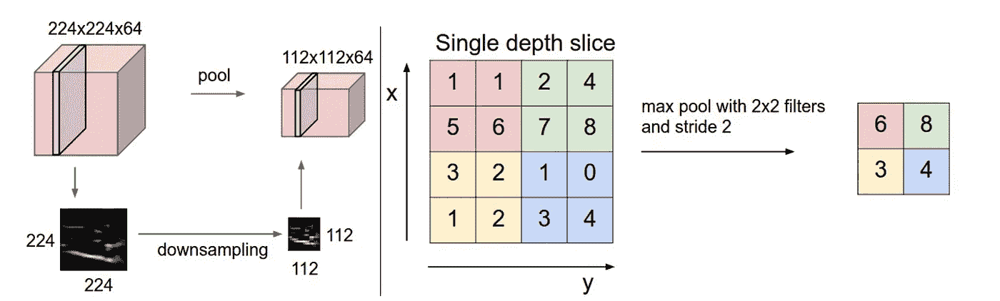
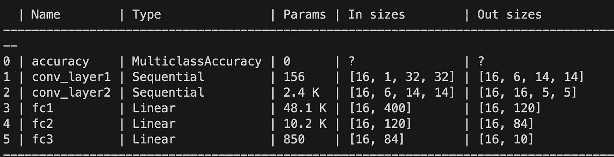
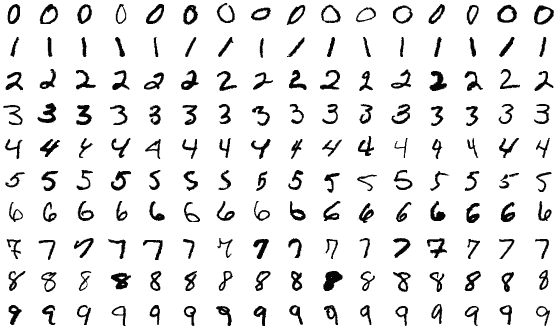
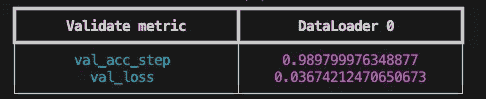
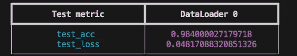

# 从头开始用 PyTorch Lightning 实现和训练 CNN

> 原文：[`towardsdatascience.com/implement-and-train-a-cnn-from-scratch-with-pytorch-lightning-ce22f7dfad83`](https://towardsdatascience.com/implement-and-train-a-cnn-from-scratch-with-pytorch-lightning-ce22f7dfad83)

## 如果你还没有使用 PyTorch Lightning，你应该尝试一下。

[](https://medium.com/@betty.ld?source=post_page-----ce22f7dfad83--------------------------------)[](https://towardsdatascience.com/?source=post_page-----ce22f7dfad83--------------------------------) [Betty LD](https://medium.com/@betty.ld?source=post_page-----ce22f7dfad83--------------------------------)

·发表于 [Towards Data Science](https://towardsdatascience.com/?source=post_page-----ce22f7dfad83--------------------------------) ·19 分钟阅读·2023 年 8 月 8 日

--


PyTorch Lightning 的抽象概念。来自 [Marc Sendra Martorell](https://unsplash.com/@marcsm)。

本文是对卷积神经网络（CNN）的温和介绍。本文详细说明了为什么 PyTorch Lightning 非常出色，然后对 CNN 组件进行简要的理论讲解，接着描述了如何使用 PyTorch Lightning 库从头开始实现一个简单 CNN 架构的训练循环。

# **为什么选择 PyTorch Lightning？**

PyTorch 是一个灵活且用户友好的库。如果说 PyTorch 对研究很棒，那么我发现 Lightning 对工程更为出色。主要优点包括：

+   **更少的代码**。在运行机器学习项目时，许多事情可能会出错，因此将样板代码委托出去，专注于解决我具体问题的相关内容是很有帮助的。使用内置功能可以减少书写代码的数量，从而降低错误的概率。开发（和调试）时间也会减少。

+   **结构良好的代码**。

+   **高效和快速的训练**。Lightning 还允许使用 PyTorch 的所有多进程和并行工作器技巧（如 [DDP](https://pytorch.org/tutorials/intermediate/ddp_tutorial.html)），无需额外编写代码。

+   内置的 **开发工具** 如一致性检查（用于验证和训练循环以及模型架构）、即时创建过拟合数据集、早期停止回调、最佳权重管理等。例如 [`lightning.ai/docs/pytorch/stable/debug/debugging_basic.html`](https://lightning.ai/docs/pytorch/stable/debug/debugging_basic.html)

要了解更多官方的优秀理由，请查看 [这里](https://pytorch-lightning.readthedocs.io/en/0.10.0/introduction_guide.html#why-pytorch-lightning)。

简而言之，使用 PyTorch Lightning 时，我发现它易于编写、易于阅读和调试。这些活动占据了我作为机器学习工程师的大部分时间。此外，文档写得很好，包含了许多教程，因此也很容易[学习](https://lightning.ai/docs/pytorch/stable/levels/core_skills.html)。

# CNN 模型回顾

LeNet 是学习或复习计算机视觉深度学习架构的一个很好的起点。LeNet 是 Yann LeCun 等人在 1998 年设计的第一个成功的卷积神经网络（CNN）架构，旨在进行手写数字识别。

我们将首先通过 LeNet 架构的组件解释标准 CNN 模块的主要组成部分。

LeNet 由三种类型的层组成：

+   卷积层

+   池化层

+   全连接层

## 1\. 卷积层

卷积层负责从输入层中提取特征。使用 CNN 时，这第一层通常是图像。每个卷积层由一组可学习的**滤波器**（也称为“内核”）组成，这些滤波器滑动在输入层上，应用一种称为“卷积”的操作。卷积在滤波器和图像中的局部区域之间执行逐元素乘法和求和。由于对输出特征图应用了（非线性）**激活函数**，所以该输出也称为“激活”。在本文中，我们使用最流行的激活函数：ReLU，如下图所示。



线性整流单元（ReLU）f(x)=max(0,x)及其变体 GeLU。[图片使用 Creative Common 许可证](https://en.wikipedia.org/wiki/Rectifier_(neural_networks)#/media/File:ReLU_and_GELU.svg)。

每个卷积层后面都跟着一个激活函数，主要是为了加入非线性。没有这样的激活函数，模型将表现得像一个普通的线性模型，无论其深度如何。

## 更多关于卷积层的内容

下一部分解释了卷积层在 CNN 中如何使用，以及它们如何使 CNN 在各种计算机视觉任务中表现极其出色。简而言之，连续卷积层的**层次结构**使其在图像识别任务中非常高效。一层卷积层效率不高，但一堆卷积层就很有效。

第一层使模型能够在输入图像的局部区域中识别简单和通用的模式，然后，深层会抓取更复杂和抽象的表示。



卷积[操作的示意图](https://commons.wikimedia.org/wiki/File:Convolution_arithmetic_-_Full_padding_no_strides.gif)。滤波器大小为 3x3，步幅为 1，零填充量为 2。图片使用 MIT 许可证。

CNN 的**第一卷积层**通常具有较小的**空间范围**（例如，VGG16 的第一卷积层为 3x3 像素，LeNet 为 5x5 像素，AlexNet 为 11x11 像素）。

训练后，这些层将检测类似于[经典计算机视觉技术](https://www.cs.toronto.edu/~urtasun/courses/CV/lecture02.pdf)的简单模式，如边缘和角点。

然后，**中间卷积层**中的滤波器变得更加复杂。相对于输入层，它们的相对尺寸比早期层大，因此它们拥有更多的上下文（因为它们能看到比前一卷积层更广泛的图像区域），并且可以开始检测更高层次的特征，如复杂的纹理、形状和物体部件。

例如，在一张[日本套餐](https://kome-academy.com/en/teishoku_library/)的图像中，这些层可能会检测到筷子、米饭碗和味增汤。



[LeNet 架构](https://www.researchgate.net/figure/LeNet-is-a-classic-convolutional-neural-network-employing-the-use-of-convolutions_fig1_369803371)。图像遵循 Creative Common 许可。

在**最后卷积层**中，滤波器具有更大的空间范围（它们可以在输入层中一次性看到更多上下文），并且比早期的边缘、颜色和物体部件检测层更加专业和抽象。它们代表高层次特征，对于图像识别任务的准确决策至关重要。它们用于编码复杂的对象表示，并捕捉数据集中不同类别的独特特征。

它可以例如从法国午餐中识别出日本套餐。

以下图片总结了每一层可以“看到”的内容。



不同卷积阶段的输出特征图的示例。由[斯坦福 CS231](https://cs231n.github.io/convolutional-networks/)提供。图像来自[`github.com/cs231n/cs231n.github.io/blob/master/convolutional-networks.md`](https://github.com/cs231n/cs231n.github.io/blob/master/convolutional-networks.md)，遵循 MIT 许可。

## 池化层

在两个连续的卷积层之间添加池化层是很常见的做法。池化层对从前一个卷积层获得的特征图进行降采样，减少数据的空间维度，同时保留重要信息。

**为什么池化层有效？**

+   它们缩小了特征图，因此允许更快的计算和更低的内存需求。

+   这个信息聚合步骤减少了模型中的参数数量，同时防止了过拟合。

+   它们引入了一定程度的平移不变性，使得网络即使在图像中略微偏移、旋转或扭曲的情况下也能识别某些特征。对空间变化的鲁棒性有助于模型更好地泛化。

最常见的池化操作有最大池化（MAX pooling）（从窗口覆盖的元素中选择最大值作为该窗口的值）和平均池化（AVERAGE pooling）（相同，但取平均值）。



池化操作。左侧为特征图，右侧为特征切片。图像来自 [Stanford CS231.](https://cs231n.github.io/convolutional-networks/) [MIT 许可证](https://github.com/cs231n/cs231n.github.io/blob/master/convolutional-networks.md)。

## 全连接层

全连接（FC）层是模型的最后几层。它们负责根据早期层提取的特征做出高层决策。与具有局部可见性的卷积滤波器不同，FC 层将来自先前输出特征图的所有激活一次性连接到下一个输出特征图的激活中，就像在常规神经网络中一样。它基本上由矩阵乘法和偏置偏移组成。

在 LeNet 模型中，模型的最末端有三个全连接（FC）层。最后一层是用于分类任务的全连接层，其维度为（pevious_layer_output_dimension, number_of_classes）。

其他经典架构如 AlexNet、VGG、ResNet 和 Inception 在架构的末端都包括一个全连接层。然而，最近的架构如 MobileNet、YOLO、EfficientNet 和 Vision Transformers 删除了这个层。

从 CNN 架构中删除全连接层的原因有：

+   减少参数数量（防止过拟合，特别是在较小的数据集上）。

+   FC 丢弃了特征图中的空间信息。

+   灵活性。没有全连接层的 CNN 架构可以处理不同尺寸的输入，避免将输入图像调整为固定大小。

## 通用的卷积神经网络（CNN）架构

最常见的 CNN 架构形式是 {卷积层+非线性激活函数} 层的堆叠，后跟 {池化层} 逐次应用，直到图像在空间上被缩小到更小的尺寸并增加更多通道。

最后，最终的全连接层通常会输出类别分数。

总结来说，CNN 的结构如下：

```py
Input -> [[[Conv-> ReLU] * N ] -> Pool?] * M -> [[FC+ReLU] * K] -> FC -> Scores
```

通常是（[source](https://cs231n.github.io/convolutional-networks/)）：

+   0 ≤ N ≤ 3 个堆叠的卷积层。

+   M≥0 池化块。

+   0≤ K< 3 个堆叠的全连接层。

## 模型约束（[source](https://cs231n.github.io/convolutional-networks/)）

通常建议机器学习从业者使用现有的最先进架构，而不是自行创建。然而，在使用卷积网络时，需要注意空间约束。例如，在应用卷积层时，设 W 为输入层大小（宽度或高度），F 为滤波器大小，P 为填充大小，S 为步幅大小，则输出特征图的大小为 Output size = ((W -F + 2P) / S ) +1\。对于每个卷积，参数 W、F、P 和 S 需要选择使输出大小为整数。通常添加填充可以解决大多数问题。

其他常见约束包括：

+   输入图像应能够被 2 多次整除，具体取决于模型的深度。这个要求来自池化层。

+   卷积层应使用小滤波器和小步幅。

+   推荐使用“相同大小”的填充。如果我们在应用卷积前后保持相同的特征大小，我们将所有缩小操作委托给池化层，这使得网络结构更容易理解。

# LeNet 模型实现

够多理论了，现在我们将使用 PyTorch Lightning 实现 LeNet CNN。由于其简单性和小巧的规模，LeNet 被选择作为示例。

## 模型实现

在 PyTorch 中，一个新的模块继承自`[pytorch.nn.Module](https://pytorch.org/docs/stable/generated/torch.nn.Module.html#module)`。在 PyTorch Lightning 中，模型类继承自`ligthning.pytorch.LightningModule`。

你可以像使用`nn.Module`类一样使用`ligthning.pytorch.LightningModule`，它仅包含更多功能。

模块的两个参数是：

+   输入通道的数量（对于灰度图像为 1）。

+   分类器中的类别数（对于 MNIST 数据集为 10）。

在 PyTorch 中，模型由`__init__()`和`forward()`两个部分描述。`__init__()`声明每个具有可学习参数的组件作为初始化方法。它还可以包含更多声明，如激活函数。然后，`forward()`方法对输入图像依次应用所有层和函数。

LeNet 架构由两个堆叠的卷积块组成，每个卷积块后面跟着一个池化层。然后将结果传递给连续的全连接层，输出一个大小为(batch_size, out_channels)的张量，其中`out_channels`表示类别数。

在下面的实现块中，首先初始化一些杂项属性：

1.  `example_input_array`张量用于[显示张量大小的仿真](https://lightning.ai/docs/pytorch/stable/debug/debugging_basic.html)，以便在运行`print(model)`时查看每一层之间的张量大小。



运行`print(model)`时会自动记录模型日志。图片来自作者。

从上表可以确认，输出张量的大小为(batch_size=16, num_classes=10)。

2\. `Accuracy()`度量将在训练和验证过程中使用。

3\. 具有可学习参数的层也会被初始化。首先是两个{卷积 + 最大池化}块，然后是全连接层。

```py
 # models/detection/lenet.py
"""
PyTorch reference: https://pytorch.org/tutorials/beginner/blitz/neural_networks_tutorial.html
"""
from __future__ import annotations

import lightning.pytorch as pl
import torch
import torch.nn as nn
import torch.nn.functional as F
import torchmetrics

class LeNet(pl.LightningModule):
    def __init__(self, in_channels: int, out_channels: int, lr: float = 2e-4):
        """
        Args:
        - in_channels: One for grayscale input image (which is the case for MNIST), 3 for RGB input image.
        - out_channels: Number of classes of the classifier. 10 for MNIST.
        """
        super().__init__()
        # Debugging tool to display intermediate input/output size of all your layer (called before fit)
        self.example_input_array = torch.Tensor(16, in_channels, 32, 32)
        self.learning_rate = lr

        self.train_accuracy = torchmetrics.Accuracy(task="multiclass", num_classes=out_channels)
        self.val_accuracy = torchmetrics.Accuracy(task="multiclass", num_classes=out_channels)
        self.test_accuracy = torchmetrics.Accuracy(task="multiclass", num_classes=out_channels)

        # [img_size] 32 -> conv -> 32 -> (max_pool) -> 16
        # with 6 output activation maps
        self.conv_layer1 = nn.Sequential(
            nn.Conv2d(
                in_channels=in_channels,
                out_channels=6,
                kernel_size=5,
                stride=1,
                # Either resize (28x28) MNIST images to (32x32) or pad the imput to be 32x32
                # padding=2,
            ),
            nn.MaxPool2d(kernel_size=2),
        )
        # [img_size] 16 -> (conv) -> 10 -> (max pool) 5
        self.conv_layer2 = nn.Sequential(
            nn.Conv2d(in_channels=6, out_channels=16, kernel_size=5, stride=1, padding=0),
            nn.MaxPool2d(kernel_size=2, stride=2),
        )
        # The activation size (number of values after passing through one layer) is getting gradually smaller and smaller.
        # The output is flatten and then used as a long input into the next dense layers.
        self.fc1 = nn.Linear(in_features=16 * 5 * 5, out_features=120)  # 5 from the image dimension
        self.fc2 = nn.Linear(in_features=120, out_features=84)
        # "Softmax" layer = Linear + Softmax.
        self.fc3 = nn.Linear(in_features=84, out_features=out_channels)
```

## **关于上述实现的说明**

**关于卷积层的说明**

+   为了简化前向调用，通常将堆叠的层表示在`nn.Sequential()`子模块中。

+   第一个卷积层处理（32x32）大小的图像，并在池化层中将大小除以 2 后输出（16x16）大小的图像。

+   LeNet 期望输入图像大小为（32x32），但可用的 MNIST 数据集图像大小为（28x28）。你可以选择调整图像大小或增加第一个卷积层的填充大小（如注释中所述）。否则，卷积层可以处理可变大小的图像，但经过两次下采样后，最后一个卷积层的输出激活与第一个全连接层的矩阵乘法（其维度如下面所示）之间会出现维度不匹配。

```py
 self.fc1 = nn.Linear(in_features=16 * 5 * 5, out_features=120)  # 5 from the image dimension
  self.fc2 = nn.Linear(in_features=120, out_features=84)
  # "Softmax" layer = Linear + Softmax.
  self.fc3 = nn.Linear(in_features=84, out_features=out_channels) 
```

第二个卷积层输入的通道数与第一个卷积层输出的滤波器数相同（6）。

+   **ReLU 和 MaxPool 的顺序在这里并不重要。**

ReLU 激活函数不会在池化之前调用，与之前提到的不同。在此实现中，ReLU 激活函数仅在`forward()`调用中被调用。

卷积层后面应该总是跟一个激活函数，以添加非线性。但是如果卷积层后面还跟一个池化层，那么顺序并不重要。这两个操作是可交换的 MaxPool(Relu(x)) = Relu(MaxPool(x))。实际上，我们可以在局部区域内取最大值并将所有负值设置为 0，或将所有负值设置为 0 并取每个局部区域的最大值。

+   **关于全连接层的说明。**

第一个全连接层输入的张量大小为（number_output_filter_from_conv2 * previous_activation_width * previous_activation_height）。输出激活的大小在三个全连接层中逐渐减小。

在前向传递过程中会调用所有这些层：

```py
# Method of LetNet class in models/detection/lenet.py
def forward(self, x: torch.Tensor) -> torch.Tensor:
    x = F.relu(self.conv_layer1(x))
    x = F.relu(self.conv_layer2(x))
    x = torch.flatten(x, 1)  # flatten all dimensions except the batch dimension
    x = F.relu(self.fc1(x))
    x = F.relu(self.fc2(x))
    x = self.fc3(x)
    return x
```

计算梯度的反向函数在使用`autograd`时会自动定义。

在大多数 PyTorch 实现中，最后一层（有时也称为 softmax 层）输出的是原始激活值，其中每个数字对应一个得分。在这里，softmax 函数在前向传递中并没有被调用，而是内置于[交叉熵损失函数](https://pytorch.org/docs/stable/generated/torch.nn.CrossEntropyLoss.html)中。

## 实现训练、验证和测试步骤

在之前的相同文件中，在`class LeNet(pl.LightningModule)`下，我们重写了所有核心函数。

+   优化器和调度器：`configure_optimizers()`

```py
def configure_optimizers(self) -> torch.optim.Adam:
      return torch.optim.Adam(self.parameters(), lr=self.learning_rate)
```

+   训练循环：`training_step()`

+   验证循环：`validation_step()`

```py
 # Methods in LeNet class in models/detection.lenet.py
  ###############################
  # --- For Pytorch Lightning ---
  ###############################

  def validation_step(
      self,
      batch: list[torch.Tensor, torch.Tensor],
      batch_idx: int,
      verbose: bool = True,
  ) -> torch.Tensor:
      """Function called when using `trainer.validate()` with trainer a
      lightning `Trainer` instance."""
      x, y = batch
      logit_preds = self(x)
      loss = F.cross_entropy(logit_preds, y)
      self.val_accuracy.update(torch.argmax(logit_preds, dim=1), y)
      self.log("val_loss", loss)
      self.log("val_acc_step", self.val_accuracy, on_epoch=True)
      return loss

  def training_step(
      self,
      batch: list[torch.Tensor, torch.Tensor],
      batch_idx: int,
  ) -> torch.Tensor:
      """Function called when using `trainer.fit()` with trainer a
      lightning `Trainer` instance."""
      x, y = batch
      logit_preds = self(x)
      loss = F.cross_entropy(logit_preds, y)
      self.train_accuracy.update(torch.argmax(logit_preds, dim=1), y)
      self.log("train_acc_step", self.train_accuracy, on_step=True, on_epoch=True, logger=True)
      # logs metrics for each training_step,
      # and the average across the epoch, to the progress bar and logger
      self.log("train_loss", loss, on_step=True, on_epoch=True, logger=True)
      return loss 
```

如你所见，上述函数都比较简短。无需将变量移动到 `to(device)`，也无需使用 `optimizer.zero_grad()` 删除梯度或使用 `loss.backward()` 计算新的梯度。模型模式的切换也由 PyTorch Lightning 库本身处理 `model.eval()`，`model.train()`。

你可以注意到这里调用了 `log()` 方法。此方法在适当的时候保存和显示结果。

如果你想自定义它，[文档](https://pytorch-lightning.readthedocs.io/en/0.10.0/introduction_guide.html#logging)很好地解释了如何正确使用日志记录：

> `log()` 方法有一些选项：
> 
> - on_step（在训练中的该步骤记录指标）
> 
> - on_epoch（在每个 epoch 结束时自动累积并记录）
> 
> - prog_bar（记录到进度条中）
> 
> - logger（将日志记录到类似 Tensorboard 的日志记录器中）
> 
> 根据 `log` 被调用的位置，Lightning 会自动确定正确的模式。不过，你当然可以通过手动设置标志来覆盖默认行为。

PyTorch Lightning 的另一个好功能是验证一致性检查：

> 你可能注意到了 **验证一致性检查** 被记录了。这是因为 Lightning 在开始训练之前会运行 2 批验证。这是一种单元测试，确保如果你在验证循环中有 bug，你不会需要等待整个 epoch 才能发现。

最后，测试和预测的方法也在同一个类中实现：

+   测试循环：`test_step()`

+   预测循环：`predict_step()`

模型可以从检查点加载权重，或者在训练循环结束后自动从最后一个或最佳（如果实现了回调）epoch 中提取权重。

```py
def test_step(
      self,
      batch: list[torch.Tensor, torch.Tensor],
      batch_idx: int,
  ):
      """Function called when using `trainer.test()` with trainer a
      lightning `Trainer` instance."""
      x, y = batch
      logit_preds = self(x)
      loss = F.cross_entropy(logit_preds, y)
      self.test_accuracy.update(torch.argmax(logit_preds, dim=1), y)
      self.log_dict({"test_loss": loss, "test_acc": self.test_accuracy})

  def predict_step(
      self, batch: list[torch.Tensor, torch.Tensor], batch_idx: int
  ) -> tuple[torch.Tensor, torch.Tensor]:
      """Function called when using `trainer.predict()` with trainer a
      lightning `Trainer` instance."""
      x, _ = batch
      logit_preds = self(x)
      softmax_preds = F.softmax(logit_preds, dim=1)
      return x, softmax_preds
```

## 管理 MNIST 数据集

你可以使用常规的 PyTorch DataLoader 类或 PyTorch Lightning DataModule。在这篇文章中，我使用了 PyTorch Lightning DataModule 实现了数据集和数据加载。它旨在将与一个数据集相关的所有信息集中在一个文件中，包括数据下载、数据分割、数据加载等。

对于本教程，我们使用的是大小为 28x28 的 MNIST 图像。MNIST 数据集根据 [Creative Commons Attribution-Share Alike 3.0 许可](https://creativecommons.org/licenses/by-sa/3.0/)（[来源](https://keras.io/api/datasets/mnist/)）提供。



MNIST 数据集的可视化。[图片使用 CC 许可](https://en.wikipedia.org/wiki/MNIST_database#/media/File:MnistExamplesModified.png)。

这是管理 MNIST 数据集的数据模块的实现，包括设置标准参数：

+   数据目录路径

+   批量大小

+   Tensor 转换

以及 `prepare_data()` 和 `setup()` 中的数据下载和处理功能。

```py
# datasets/mnist.py
"""
More at https://lightning.ai/docs/pytorch/stable/data/datamodule.html
"""
import logging
from pathlib import Path

import lightning.pytorch as pl
from torch.utils.data import DataLoader, random_split
from torchvision import transforms
from torchvision.datasets import MNIST

# Create a logger
logger = logging.getLogger(Path(__file__).stem)
logger.setLevel(logging.INFO)

_DEFAULT_MNIST_BATCH_SIZE = 32
_DEFAULT_RESIZE_SIZE = 32

class MNISTDataModule(pl.LightningDataModule):
    def __init__(self, data_dir: str, batch_size: int = _DEFAULT_MNIST_BATCH_SIZE):
        super().__init__()
        self.data_dir = data_dir
        self.batch_size = batch_size
        self.transform = transforms.Compose(
            [
                transforms.ToTensor(),
                transforms.Resize((_DEFAULT_RESIZE_SIZE, _DEFAULT_RESIZE_SIZE)),
                transforms.Normalize((0.1307,), (0.3081,)),
            ]
        )

    def prepare_data(self):
        """Ensure we download using one process only on CPU and avoid data corruption when downloading the data.
        It's recommended to avoid creating class attributes `self.*` because the state won't be available for
        other processes.
        """
        MNIST(self.data_dir, train=True, download=True, transform=self.transform)
        MNIST(self.data_dir, train=False, download=True, transform=self.transform)

    def setup(self, stage: str):
        """Is called from every process across all nodes.
        It also uses every GPUs to perform data processing and state assignement.
        `teardown` is its counterpart used to clean the states.
        """
        logger.info(f"Stage: {stage}")
        if stage == "test" or stage == "predict":
            self.mnist_test = MNIST(self.data_dir, train=False, download=True, transform=self.transform)
        elif stage == "fit" or stage == "validate":
            mnist_full = MNIST(self.data_dir, train=True, transform=self.transform)
            self.mnist_train, self.mnist_val = random_split(mnist_full, [55000, 5000]) 
```

在开始训练时，以下函数按此顺序调用：

+   DataModule 的 `prepare_data()` 和 `setup()` 方法。`prepare_data()` 方法在一个 CPU 上运行，用于在本地下载数据。而 `setup()` 方法是一个并行进程，可以运行数据处理作业。这些方法在每次调用训练器中的方法时都会被调用，如 `trainer.fit()`、`trainer.validate()` 等。

+   pl.LightningModule 的 `configure_optimizers()` 初始化优化器。

然后，在相同的类 `MNISTDataModule` 下，我们实现了不同的数据加载器：

```py
def train_dataloader(self) -> DataLoader:
        """Called by Trainer `.fit` method"""
        return DataLoader(self.mnist_train, batch_size=self.batch_size)

    def val_dataloader(self) -> DataLoader:
        """Called by Trainer `validate()` and `validate()` method."""
        return DataLoader(self.mnist_val, batch_size=self.batch_size)

    def test_dataloader(self) -> DataLoader:
        """Called by Trainer `test()` method."""
        return DataLoader(self.mnist_test, batch_size=self.batch_size)

    def predict_dataloader(self) -> DataLoader:
        """Called by Trainer `predict()` method. Use the same data as the test_dataloader."""
        return DataLoader(self.mnist_test, batch_size=self.batch_size, num_workers=3)
```

+   DataModule 的 `train_dataloader()` 检索训练 DataLoader。

+   pl.LightningModule 的 `training_step()` 对从训练 DataLoader 获得的小批量数据执行前向和后向传递。该方法会重复调用，直到所有来自训练 DataLoader 的样本都被看到一次。

+   pl.LightningModule 的 `validation_step()` 计算验证数据集上的损失和指标。

+   一旦达到最大训练周期数，或者验证损失不再下降（早期停止），训练就会停止。

## 实现训练循环

最后，唯一缺少的部分是训练脚本本身。

训练脚本包括：

+   解析 CLI 参数并调用主函数

```py
if __name__ == "__main__":
    parser = ArgumentParser(description=__doc__)
    parser.add_argument("--model", default="lenet", type=str, help="Provide an implemented model.")
    parser.add_argument("--device", default=0, type=int, help="Select a CUDA device.")
    parser.add_argument("--max-epoch", default=10, type=int, help="Max number of epochs.")
    parser.add_argument("--out-dir", type=Path, help="Path to output directory")
    parser.add_argument(
        "--early-stopping", action="store_true", help="If True, stops the training if validation loss stops decreasing."
    )

    args = parser.parse_args()

    main(
        model_choice=args.model,
        device=args.device,
        max_epoch=args.max_epoch,
        out_dir=args.out_dir,
        early_stopping=args.early_stopping,
    )
```

+   主函数包括模型选择、创建早期停止回调、以及对训练器的调用以进行训练 `trainer.fit(model, datamodule=data_module)`、验证 `trainer.validate(datamodule=data_module)`、测试 `trainer.test(datamodule=data_module)` 和预测 `output_preds = trainer.predict(datamodule=data_module, ckpt_path=”best”)`。

```py
def main(
    model_choice: str,
    device: int,
    max_epoch: int,
    out_dir: Path | None,
    early_stopping: bool | None,
):
    accelerator = "gpu" if torch.cuda.is_available() else "cpu"
    if out_dir is None:
        out_dir = Path(__file__).parent / "output"
    out_dir.mkdir(parents=True, exist_ok=True)
    # Select architecture
    if model_choice == "lenet":
        model = LeNet(in_channels=1, out_channels=10)
        data_module = MNISTDataModule(data_dir=_PATH_DATASETS, batch_size=_BATCH_SIZE)
    else:
      raise NotImplementedError(f"{model_choice} is not implemented!")
    callbacks = (
        [
            EarlyStopping(
                monitor="val_loss",
                min_delta=0.00,
                patience=_EARLY_STOPPING_PATIENCE,
                verbose=True,
                mode="min",
            )
        ]
        if early_stopping
        else []
    )

    # If your machine has GPUs, it will use the GPU Accelerator for training.
    trainer = L.Trainer(
        accelerator=accelerator,
        devices=[device],
        strategy="auto",
        max_epochs=max_epoch,
        callbacks=callbacks,
        default_root_dir=out_dir,
    )

    # Train the model ⚡
    # data_module.setup(stage="fit")  # Is called by trainer.fit().
    # Call training_step + validation_step for all the epochs.
    trainer.fit(model, datamodule=data_module)
    # Validate
    trainer.validate(datamodule=data_module)

    # Automatically auto-loads the best weights from the previous run.
    # data_module.setup(stage="test")  # Is called by trainer.test().
    # The checkpoint path is logged on the terminal.
    trainer.test(datamodule=data_module)

    # Run the prediction on the test set and save a subset of the resulting prediction along with the
    # original image.

    output_preds = trainer.predict(datamodule=data_module, ckpt_path="best")
    img_tensors, softmax_preds = zip(*output_preds)
    out_dir_imgs = out_dir / "test_images"
    out_dir_imgs.mkdir(exist_ok=True, parents=True)
    save_results(
        img_tensors=img_tensors,
        output_tensors=softmax_preds,
        out_dir=out_dir_imgs,
    )
```

+   保存预测图像的函数（主要用于调试）。

```py
def save_results(
    img_tensors: list[torch.Tensor], output_tensors: list[torch.Tensor], out_dir: Path, max_number_of_imgs: int = 10
):
    """Save test results as images in the provided output directory.
    Args:
        img_tensors: List of the tensors containing the input images.
        output_tensors: List of softmax activation from the trained model.
        out_dir: Path to output directory.
        max_number_of_imgs: Maximum number of images to output from the provided images. The images will be selected randomly.
    """
    selected_img_indices = random.sample(range(len(img_tensors)), min(max_number_of_imgs, len(img_tensors)))
    for img_indice in selected_img_indices:
        # Take the first instance of the batch (index 0)
        img_filepath = out_dir / f"{img_indice}_predicted_{torch.argmax(output_tensors[img_indice], dim=1)[0]}.png"
        torchvision.utils.save_image(img_tensors[img_indice][0], fp=img_filepath)
```

加上导入和常量声明，脚本看起来如下：

```py
# Train.py script
#!/usr/bin/python3

"""Example training script to fit a model on MNIST dataset."""
from __future__ import annotations  # Enable PEP 563 for Python 3.7

from argparse import ArgumentParser
from lightning.pytorch.callbacks.early_stopping import EarlyStopping
from pathlib import Path
import lightning as L

import os
import random
import torch
import torchvision

from datasets.mnist import MNISTDataModule
from models import AlexNet, LeNet

_PATH_DATASETS = os.environ.get("PATH_DATASETS", ".")
_BATCH_SIZE = 64 if torch.cuda.is_available() else 32
_EARLY_STOPPING_PATIENCE = 4  # epochs

def save_results(
    img_tensors: list[torch.Tensor], output_tensors: list[torch.Tensor], out_dir: Path, max_number_of_imgs: int = 10
):
    """Save test results as images in the provided output directory.
    Args:
        img_tensors: List of the tensors containing the input images.
        output_tensors: List of softmax activation from the trained model.
        out_dir: Path to output directory.
        max_number_of_imgs: Maximum number of images to output from the provided images. The images will be selected randomly.
    """
    selected_img_indices = random.sample(range(len(img_tensors)), min(max_number_of_imgs, len(img_tensors)))
    for img_indice in selected_img_indices:
        # Take the first instance of the batch (index 0)
        img_filepath = out_dir / f"{img_indice}_predicted_{torch.argmax(output_tensors[img_indice], dim=1)[0]}.png"
        torchvision.utils.save_image(img_tensors[img_indice][0], fp=img_filepath)

def main(
    model_choice: str,
    device: int,
    max_epoch: int,
    out_dir: Path | None,
    early_stopping: bool | None,
):
    accelerator = "gpu" if torch.cuda.is_available() else "cpu"
    if out_dir is None:
        out_dir = Path(__file__).parent / "output"
    out_dir.mkdir(parents=True, exist_ok=True)
    # Select architecture
    if model_choice == "lenet":
        model = LeNet(in_channels=1, out_channels=10)
        data_module = MNISTDataModule(data_dir=_PATH_DATASETS, batch_size=_BATCH_SIZE)
    else:
      raise NotImplementedError(f"{model_choice} is not implemented!")
    callbacks = (
        [
            EarlyStopping(
                monitor="val_loss",
                min_delta=0.00,
                patience=_EARLY_STOPPING_PATIENCE,
                verbose=True,
                mode="min",
            )
        ]
        if early_stopping
        else []
    )

    # If your machine has GPUs, it will use the GPU Accelerator for training.
    trainer = L.Trainer(
        accelerator=accelerator,
        devices=[device],
        strategy="auto",
        max_epochs=max_epoch,
        callbacks=callbacks,
        default_root_dir=out_dir,
    )

    # Train the model ⚡
    # data_module.setup(stage="fit")  # Is called by trainer.fit().
    # Call training_step + validation_step for all the epochs.
    trainer.fit(model, datamodule=data_module)
    # Validate
    trainer.validate(datamodule=data_module)

    # Automatically auto-loads the best weights from the previous run.
    # data_module.setup(stage="test")  # Is called by trainer.test().
    # The checkpoint path is logged on the terminal.
    trainer.test(datamodule=data_module)

    # Run the prediction on the test set and save a subset of the resulting prediction along with the
    # original image.

    output_preds = trainer.predict(datamodule=data_module, ckpt_path="best")
    img_tensors, softmax_preds = zip(*output_preds)
    out_dir_imgs = out_dir / "test_images"
    out_dir_imgs.mkdir(exist_ok=True, parents=True)
    save_results(
        img_tensors=img_tensors,
        output_tensors=softmax_preds,
        out_dir=out_dir_imgs,
    )

if __name__ == "__main__":
    parser = ArgumentParser(description=__doc__)
    parser.add_argument("--model", default="lenet", type=str, help="Provide an implemented model.")
    parser.add_argument("--device", default=0, type=int, help="Select a CUDA device.")
    parser.add_argument("--max-epoch", default=10, type=int, help="Max number of epochs.")
    parser.add_argument("--out-dir", type=Path, help="Path to output directory")
    parser.add_argument(
        "--early-stopping", action="store_true", help="If True, stops the training if validation loss stops decreasing."
    )

    args = parser.parse_args()

    main(
        model_choice=args.model,
        device=args.device,
        max_epoch=args.max_epoch,
        out_dir=args.out_dir,
        early_stopping=args.early_stopping,
    )
```

## **结果**

在我的机器上使用 GPU NVIDIA GeForce RTX 3070 运行 `python -m train --early-stopping` 进行 10 个周期的训练（批量大小为 64）不到两分钟。

当训练达到默认的 max_epochs（10）时，PyTorch Lightning 会分别输出验证和测试数据集上的损失和准确率结果：



经过 10 个训练周期后，模型在未见数据上的结果。

训练后的模型在未见数据上的准确率几乎达到 99%。

脚本保存了 10 张来自测试集的图像以及预测的类别：


预测为 6

# 结论

在本文中，我们发现了 PyTorch Lightning 的魔力，然后复习了 CNN 的关键技术概念，并从头到尾演练了一个简单 CNN 架构的训练循环的完整实现。

我希望这篇入门级文章对你在快速而可靠地实现基本架构的过程中有所帮助，并且帮助你在学习旅程中建立了更坚实的基础。你可以查看我的公开深度学习仓库，获取更多内容 [`github.com/bledem/deep-learning`](https://github.com/bledem/deep-learning)。

# 参考资料

+   斯坦福计算机视觉课程

+   Andrew NG [`www.youtube.com/watch?v=c1RBQzKsDCk&list=PLpFsSf5Dm-pd5d3rjNtIXUHT-v7bdaEIe&index=115&ab_channel=DeepLearningAI`](https://www.youtube.com/watch?v=c1RBQzKsDCk&list=PLpFsSf5Dm-pd5d3rjNtIXUHT-v7bdaEIe&index=115&ab_channel=DeepLearningAI)

+   PyTorch Lightning 文档 [`www.pytorchlightning.ai/tutorials`](https://www.pytorchlightning.ai/tutorials)
