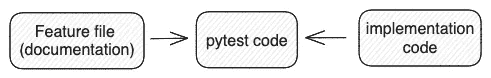
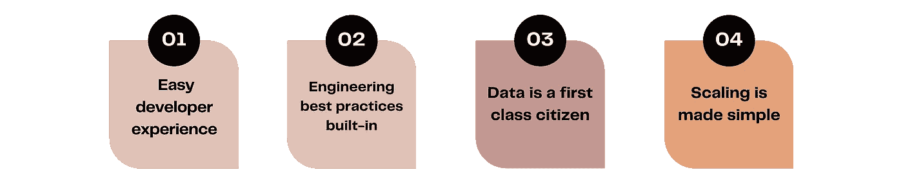
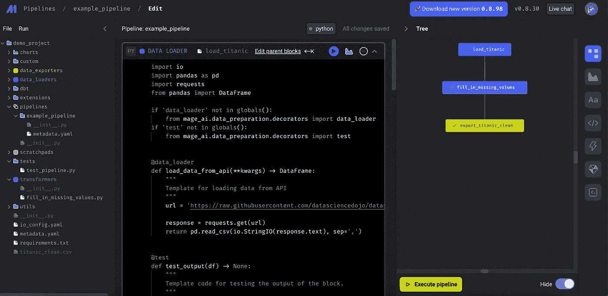
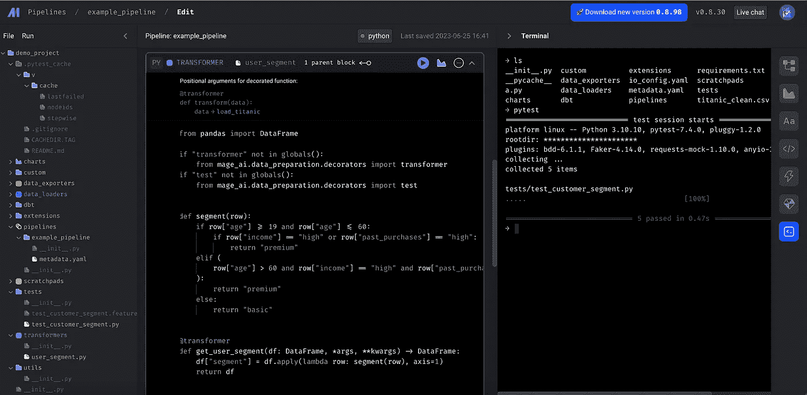

# 使用 Mage 在数据管道中实现行为驱动开发

> 原文：[`towardsdatascience.com/implement-behaviour-driven-development-in-data-pipelines-using-mage-19496fea7890`](https://towardsdatascience.com/implement-behaviour-driven-development-in-data-pipelines-using-mage-19496fea7890)

## 最大化数据管道的质量和生产力

[](https://medium.com/@xiaoxugao?source=post_page-----19496fea7890--------------------------------)[](https://towardsdatascience.com/?source=post_page-----19496fea7890--------------------------------) [肖旭高](https://medium.com/@xiaoxugao?source=post_page-----19496fea7890--------------------------------)

·发布在 [Towards Data Science](https://towardsdatascience.com/?source=post_page-----19496fea7890--------------------------------) ·阅读时间 7 分钟·2023 年 7 月 6 日

--


照片由 [Nick Fewings](https://unsplash.com/@jannerboy62) 提供，来源于 [Unsplash](https://unsplash.com/)

在我的[之前的文章](https://medium.com/towards-data-science/how-to-create-valuable-data-tests-850e778718e1)中，我详细讲述了数据管道中测试的重要性，以及如何分别创建数据测试和单元测试。虽然测试在开发周期中扮演着至关重要的角色，但它可能不是最令人兴奋的部分。因此，许多现代数据技术栈引入了框架或插件，以加快数据测试的实现。此外，像 Pytest 和 unittest 这样的 Python 单元测试框架已经存在很长时间，帮助工程师高效地为数据管道和任何 Python 应用程序创建单元测试。

在这篇文章中，我想介绍一个使用两种现代技术的设置：行为驱动开发（BDD）——一个面向业务的测试框架，以及 [Mage](https://github.com/mage-ai/mage-ai) ——一个现代数据管道工具。通过将这两种技术结合起来，目标是为数据管道创建高质量的单元测试，同时提供无缝的开发者体验。

## 什么是行为驱动开发（BDD）？

在为业务构建数据管道时，我们很可能会遇到复杂且棘手的业务逻辑。例如，根据年龄、收入和过去的购买记录来定义客户细分。以下示例仅代表业务逻辑可能涉及的一部分复杂性。随着属性和每个属性内的细节增多，它可能变得越来越复杂。想想你在日常工作中的一个例子！

```py
1\. People between 19 and 60
   AND with high past purchases are "premium".

2\. People between 19 and 60
   AND with high income are "premium".

3\. People above 60
   AND with high income
   AND with high past purchases are "premium".

4\. Others are "basic".
```

所以问题是商业规则应该如何记录，以及如何确保文档和代码之间的同步。一种常见的方法是在代码旁边包含注释，或者努力编写自解释且易于理解的代码。但仍然存在注释过时或利益相关者难以理解的代码的风险。

最终，我们寻求的是一种可以同时惠及工程师和业务利益相关者的“文档即代码”解决方案，这正是 BDD 能提供的。如果你对“数据契约”的概念熟悉，BDD 可以被视为一种数据契约，但重点在于利益相关者而非数据源。**这对于业务逻辑复杂的数据管道特别有利，帮助防止关于“功能或错误”的争论。**

BDD 本质上是一种软件开发方法，强调利益相关者和开发者之间的协作与沟通，以确保软件达到期望的业务结果。行为通过场景进行描述，这些场景说明了预期的输入和结果。每个场景都采用特定的“Given-When-Then”格式，其中每个步骤描述了一个特定的条件或操作。

让我们看看客户分段示例中的场景可能是什么样的。由于功能文件是用英语编写的，它可以被业务利益相关者很好地理解，他们甚至可以对其进行贡献。这就像是利益相关者和工程师之间的契约，工程师负责准确实现需求，而利益相关者则需提供所有必要的信息。

拥有利益相关者和工程师之间的明确契约有助于正确分类数据问题，区分由于实施错误导致的“软件缺陷”和由于缺失需求导致的“功能请求”。

功能文件（作者创建）

下一步是从功能文件生成测试代码，这就是连接发生的地方。Pytest 代码充当了文档和实现代码之间的桥梁。当它们之间存在任何不一致时，测试会失败，突显了文档和实现之间需要同步。



测试代码充当桥梁（作者创建）

下面是测试代码的样子。为了简化示例，我只实现了第一个场景的测试代码。Given 步骤设置了场景的初始上下文，在这种情况下，它从示例中获取客户年龄、收入和过去购买数据。When 步骤触发被测试的行为，即 `get_user_segment` 函数。在 Then 步骤中，我们将 When 步骤的结果与场景示例中的预期输出进行比较。

功能文件中的第一个场景的测试代码（作者创建）

想象一下，如果在第一个场景中添加了一个年龄范围 62 而没有更新代码，那么测试会立即失败，因为代码有冲突的期望。

## Mage 是什么？

到目前为止，我们已经看到 BDD 的潜力，并学习了如何使用 Python 实现它。现在，是时候将 BDD 融入我们的数据管道中了。在数据编排方面，Airflow 作为第一个基于 Python 的具有 Web 界面的编排工具，已经成为执行数据管道最常用的工具。

但它肯定不是完美的。例如，测试生产环境外的管道，尤其是在使用像 KubernetesOperator 这样的操作符时，可能会面临挑战。此外，DAG 可能会被冗余的代码和复杂的配置搞得一团糟，使得很难明确每个任务的目的，无论是数据摄取、转换还是导出。此外，Airflow 并不是专注于数据驱动的编排工具，因为它更关注任务的成功执行，而不是最终数据资产的质量。

随着数据工程社区的成长，许多 Airflow 的替代品已经出现，以填补 Airflow 中存在的空白。Mage 是一个不断增长的数据管道工具，被视为 Airflow 的现代替代品。其四大设计概念使 Mage 区别于 Airflow，我们可以从开发周期开始就感受到这种区别。



Mage 的设计原则（由作者创建）

Mage 具有非常直观的 UI，使工程师能够迅速高效地编辑和测试管道。

每个管道由几种类型的模块组成：@data_loader、@transformer、@data_exporter 等，每个模块都有明确的目的。这是我最喜欢的功能之一，因为我可以立即理解每个任务的目标，专注于业务逻辑，而不是被冗余代码困扰。



Mage UI（由作者创建）

## BDD + Mage

一个普通的数据管道有三个主要步骤：摄取、转换和导出。转换是实现所有复杂业务逻辑的地方，多个转换步骤被整合在一起并不罕见。

清晰地将摄取任务和转换任务分开，使得将 BDD 应用于你的转换逻辑变得非常简单和直观。实际上，这就像是在测试一个普通的 Python 函数，而忽略它是数据管道的一部分。

回到用户分段的例子。业务规则应该放在@transformer 模块中，并且与加载器和导出器解耦。



@transformer 模块在数据管道中（由作者创建）

相同的 @transformer 块可以插入多个管道，只要加载器返回一个 pandas 数据帧。要运行测试，我们只需在终端或 CI/CD 管道中运行`pytest`命令。管道配置（例如触发器）在一个单独的文件中，这使得主管道文件保持尽可能干净。

让我们想象一下如果在 Airflow 中实现这一点会发生什么。由于这是一个不复杂的示例，Airflow 肯定可以很好地处理。但有一些细节让我在从 Mage 切换到 Airflow 时感到“额外”的困扰。

1.  DAG 文件变得混乱，因为每个 DAG 都有一个大的代码块来定义其元数据。在 Mage 中，配置被移动到一个 yaml 文件中，因此管道文件保持简洁。

```py
@dag(
    dag_id="user_segment",
    schedule_interval="0 0 * * *",
    start_date=pendulum.datetime(2023, 1, 1, tz="UTC"),
    catchup=False,
    dagrun_timeout=datetime.timedelta(minutes=60),
)
```

2\. 数据传递在 Airflow 中比较棘手。Airflow 中的 XCOM 用于在任务之间传递数据。然而，不推荐通过 XCOM 直接传递大数据集，例如数据帧。作为一种解决方法，我们需要先将数据持久化到临时存储中，这似乎是一种不必要的工程努力。Mage 自然地处理数据传递，我们不需要担心数据集的大小。

3\. 从技术上讲，Airflow 支持多个版本的 Python 包，但代价很高。KubernetesPodOperator 和 PythonVirtualenvOperator 允许你在隔离的环境中运行任务。但你将失去 Airflow 提供的即开即用的便利，例如使用其他操作符。相比之下，Mage 通过使用一个集中式的`requirements.txt`来解决这个问题，确保所有任务都可以访问 Mage 的所有原生功能。

## 结论

在这篇文章中，我结合了两种技术，目的是提高测试质量和开发者体验。BDD 旨在通过创建直接嵌入代码库中的特性文件格式的合同，来增强利益相关者和工程师之间的协作。另一方面，Mage 是一个很棒的数据管道工具，将开发者体验作为首要任务，并真正将数据视为一等公民。

我希望你能从中获得启发，并感到有动力在日常工作中探索并融入至少一种技术。选择合适的工具肯定能提升你团队的生产力。我很想知道你的想法。请在评论中告诉我。干杯！
