# 轻松用 Python 从头实现多分类支持向量机

> 原文：[`towardsdatascience.com/implement-multiclass-svm-from-scratch-in-python-b141e43dc084?source=collection_archive---------2-----------------------#2023-11-04`](https://towardsdatascience.com/implement-multiclass-svm-from-scratch-in-python-b141e43dc084?source=collection_archive---------2-----------------------#2023-11-04)

## 附带支持向量机的深度概述

[](https://essamwissam.medium.com/?source=post_page-----b141e43dc084--------------------------------)[](https://towardsdatascience.com/?source=post_page-----b141e43dc084--------------------------------) [Essam Wisam](https://essamwissam.medium.com/?source=post_page-----b141e43dc084--------------------------------)

·

[关注](https://medium.com/m/signin?actionUrl=https%3A%2F%2Fmedium.com%2F_%2Fsubscribe%2Fuser%2Fccb82b9f3b87&operation=register&redirect=https%3A%2F%2Ftowardsdatascience.com%2Fimplement-multiclass-svm-from-scratch-in-python-b141e43dc084&user=Essam+Wisam&userId=ccb82b9f3b87&source=post_page-ccb82b9f3b87----b141e43dc084---------------------post_header-----------) 发布于 [Towards Data Science](https://towardsdatascience.com/?source=post_page-----b141e43dc084--------------------------------) ·14 min read·2023 年 11 月 4 日[](https://medium.com/m/signin?actionUrl=https%3A%2F%2Fmedium.com%2F_%2Fvote%2Ftowards-data-science%2Fb141e43dc084&operation=register&redirect=https%3A%2F%2Ftowardsdatascience.com%2Fimplement-multiclass-svm-from-scratch-in-python-b141e43dc084&user=Essam+Wisam&userId=ccb82b9f3b87&source=-----b141e43dc084---------------------clap_footer-----------)

--

[](https://medium.com/m/signin?actionUrl=https%3A%2F%2Fmedium.com%2F_%2Fbookmark%2Fp%2Fb141e43dc084&operation=register&redirect=https%3A%2F%2Ftowardsdatascience.com%2Fimplement-multiclass-svm-from-scratch-in-python-b141e43dc084&source=-----b141e43dc084---------------------bookmark_footer-----------)

在这个故事中，我们将实现支持向量机学习算法的通用软边距和核化形式。我们将首先简要概述支持向量机及其训练和推断方程，然后将这些方程转换为代码以开发支持向量机模型。之后，我们扩展我们的实现以处理多分类场景，并通过使用 Sci-kit Learn 测试我们的模型来总结。

因此，到本故事结束时：

+   你将清晰地理解各种重要的支持向量机概念。

+   你将能够以真正的理解从头实现支持向量机模型，包括二分类和多分类情况。

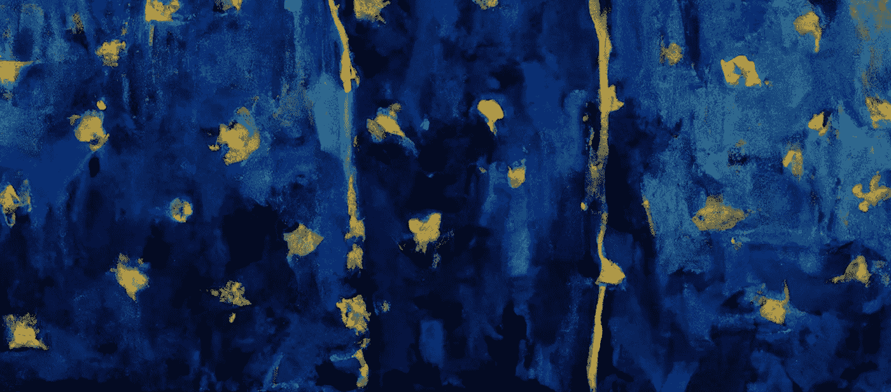

美丽的梵高画作，描绘了“星夜”中的“两颗星星与它们之间的线”——由作者使用 DALLE 2 生成

## 目录

· 简要概述

∘ 硬间隔 SVM

∘ 软间隔 SVM

∘ 核软间隔 SVM

· 实现

∘ 基本导入

∘ 定义核函数和 SVM 超参数

∘ 定义预测方法

∘ 定义预测方法

∘ 测试实现

∘ 对多分类的泛化适应

∘ 对多分类的泛化预测

∘ 测试实现

# 简要概述

## 硬间隔 SVM

SVM 的目标是拟合出能够获得最大间隔（距离两个类别中最近点的距离）的超平面。可以证明，并且直观上，这样的超平面（A）具有更好的泛化能力，并且比一个没有最大化间隔的超平面（B）更能抵抗噪声。

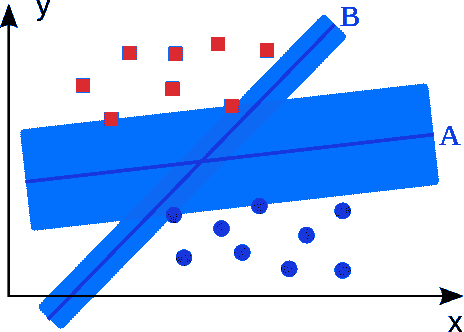

图示来源于 [Ennepetaler86](https://commons.wikimedia.org/wiki/User:Ennepetaler86) 在 [Wikimedia](https://commons.wikimedia.org/wiki/File:Svm_intro.svg)。 [CC BY-SA 3.0 Unported](https://creativecommons.org/licenses/by-sa/3.0/deed.en)。

为了实现这一点，SVM 通过解决以下优化问题来找到超平面的 *W* 和 b：


它尝试找到*W, b*，以最大化到最近点的距离，并正确分类所有数据（如在 y 取±1 的约束条件中）。这可以证明等价于以下优化问题：


对于这个问题，可以写出等价的 [对偶](https://medium.com/p/de09f645b068) 优化问题

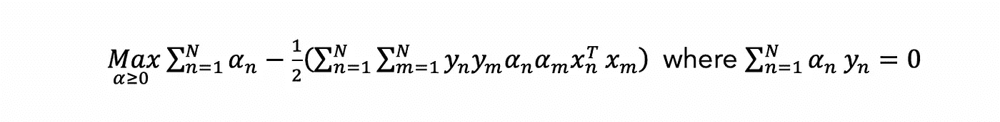

这提供了一个拉格朗日乘子，针对数据集中每一个点，我们假设其大小为 *m: (α₁, α₂, …, α_N)*。目标函数在 *α* 上显然是二次的，约束条件是线性的，这意味着可以很容易地通过 [二次规划](https://en.wikipedia.org/wiki/Quadratic_programming) 解决。一旦找到解决方案，从对偶问题的推导中可以得到：

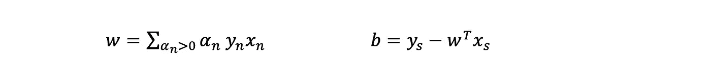

*(xₛ, yₛ)* 是任何 *α>0* 的点

注意，只有 *α>0* 的点定义了超平面（对和有贡献）。这些点称为支持向量。

因此，当给定一个新的示例 *x* 时，预测方程返回其预测 *y=±1* 为：

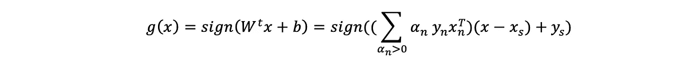

涉及到插入并进行一些代数简化

这种基本形式的 SVM 称为硬边界 SVM，因为它解决的优化问题（如上所述）强制训练中的所有点必须被正确分类。在实际场景中，可能存在一些噪声，这些噪声阻止或限制了完全分开数据的超平面的存在，这种情况下优化问题可能没有返回解或返回了一个较差的解。

## 软边界 SVM

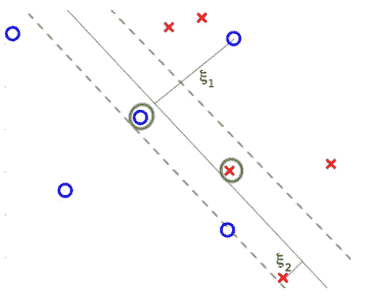

由[Mangat 等人](https://www.researchgate.net/publication/366243093_High-Frequency_Trading_with_Machine_Learning_Algorithms_and_Limit_Order_Book_Data)在[Research Gate](https://www.researchgate.net/figure/Support-vector-classification-for-the-non-separable-case-Points-corresponding-to-x-1-and_fig2_366243093)上适配的软边界 SVM。[CC BY-SA 4.0 International](https://creativecommons.org/licenses/by/4.0/)

为了推广硬边界 SVM，软边界 SVM 通过引入一个 C 常数（用户指定的超参数）来调整优化问题，以控制其“难度”。具体来说，它将原始优化问题修改为以下形式：

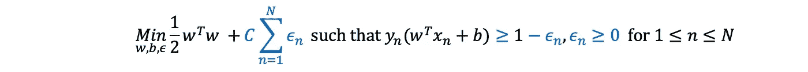

蓝色部分的修改

这允许每个点有一些违例ϵₙ（例如，位于超平面错误的一侧），但仍然通过在目标函数中用 C 加权它们的总和来减少这些违例。随着 C 趋近于无穷大（通常在之前），它变得等同于硬边界。与此同时，更小的 C 会允许更多的违例（以换取更宽的边界；即，更小的*wᵗw*）。

相当令人惊讶的是，可以证明等价的对偶问题仅通过将每个点的*α*限制为*≤C*而发生变化。

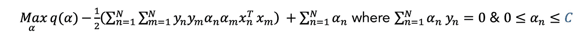

由于允许违例，支持向量（*α>0*的点）不再全部位于边界的边缘。可以证明，任何已发生违例的支持向量将有*α=C*，而非支持向量（*α=0*）不能发生违例。我们称潜在发生违例的支持向量（*α=C*）为“非边界支持向量”，而其他未发生违例的纯支持向量（位于边缘）称为“边界支持向量”（0<*α<C*）。

可以证明推断方程没有变化：


但是，现在*(xₛ,yₛ)*必须是一个没有发生违例的支持向量，因为方程假设它在边界的边缘（之前，任何支持向量都可以使用）。

## 核函数软边界 SVM

软边界 SVM 将硬边界 SVM 扩展以处理噪声，但通常数据由于噪声之外的因素，如自然非线性，而无法被超平面分开。在这些情况下，软边界 SVM 可以使用，但最佳解可能涉及允许比现实中容许的更多错误的超平面。

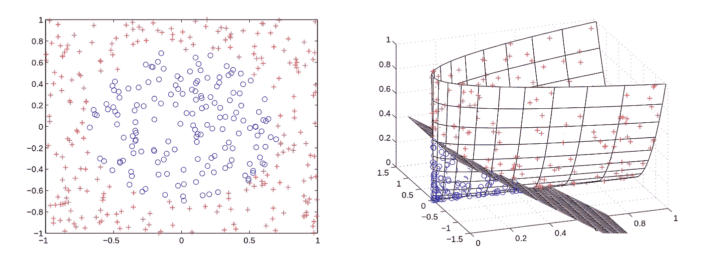

图源 [Machine Learner](https://commons.wikimedia.org/w/index.php?title=User%3AMachine_Learner&action=edit&redlink=1) ，来自 [Wikimedia](https://commons.wikimedia.org/wiki/File:Nonlinear_SVM_example_illustration.svg)。 [CC BY-SA 4.0 国际](https://creativecommons.org/licenses/by/4.0/)

核软边际 SVM 将软边际 SVM 推广到处理数据自然非线性的情况。例如，在左侧显示的例子中，没有线性超平面可以由软边际 SVM 找到，无论 C 的设置如何，都无法适当地分离数据。

然而，通过某种变换函数 *z=Φ(x)*，可以将数据集中的每个点 *x* 映射到更高维度，以使数据在新的高维空间中更加线性（或完全线性）。这相当于在对偶中用 *z* 替代 *x*，得到：

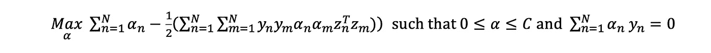

实际上，尤其是当 *Φ* 变换到非常高维空间时，计算 *z* 可能需要很长时间。通过核技巧可以解决这个问题，它用数学函数（称为核函数）的**等效**计算替代 *z*ᵗ*z*，而计算速度更快（例如，*z*ᵗ*z* 的代数简化）。例如，以下是一些流行的核函数（每个核函数对应于某种变换 *Φ* 到更高维空间）：

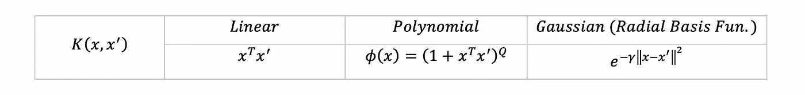

多项式的次数（Q）和 RBF γ 是超参数（由用户决定）

这样，对偶优化问题变为：

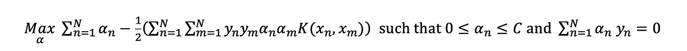

直观地，推理方程变为（经过代数操作后）：


假设你有 [数学背景](https://medium.com/p/de09f645b068) 的话，可以在 [这里](https://drive.google.com/file/d/1f_VRZ_SICOnciEoLr-Nig4cr2fLczE_y/view?usp=sharing) 找到上述所有方程的完整推导。


由 [Scott Graham](https://unsplash.com/@homajob?utm_source=medium&utm_medium=referral) 提供的照片，来自 [Unsplash](https://unsplash.com/?utm_source=medium&utm_medium=referral)

# 实现

对于实现，我们将使用

## 基本导入

我们从导入一些基本库开始：

```py
import numpy as np                  # for basic operations over arrays
from scipy.spatial import distance  # to compute the Gaussian kernel
import cvxopt                       # to solve the dual opt. problem
import copy                         # to copy numpy arrays 
```

## 定义核函数和 SVM 超参数

我们从使用各自函数定义三个核函数开始


多项式的次数（Q）和 RBF γ 是超参数（由用户决定）

```py
class SVM:
    linear = lambda x, xࠤ , c=0: x @ xࠤ.T
    polynomial = lambda x, xࠤ , Q=5: (1 + x @ xࠤ.T)**Q
    rbf = lambda x, xࠤ, γ=10: np.exp(-γ*distance.cdist(x, xࠤ,'sqeuclidean'))
    kernel_funs = {'linear': linear, 'polynomial': polynomial, 'rbf': rbf}
```

为了与其他核一致，线性核需要一个额外的无用超参数。显然，`kernel_funs` 接受一个字符串作为核，并返回相应的核函数。

现在让我们继续定义构造函数：

```py
class SVM:
    linear = lambda x, xࠤ , c=0: x @ xࠤ.T
    polynomial = lambda x, xࠤ , Q=5: (1 + x @ xࠤ.T)**Q
    rbf = lambda x, xࠤ, γ=10: np.exp(-γ*distance.cdist(x, xࠤ,'sqeuclidean'))
    kernel_funs = {'linear': linear, 'polynomial': polynomial, 'rbf': rbf}

    def __init__(self, kernel='rbf', C=1, k=2):
        # set the hyperparameters
        self.kernel_str = kernel
        self.kernel = SVM.kernel_funs[kernel]
        self.C = C                  # regularization parameter
        self.k = k                  # kernel parameter

        # training data and support vectors (set later)
        self.X, y = None, None
        self.αs = None

        # for multi-class classification (set later)
        self.multiclass = False
        self.clfs = [] 
```

SVM 有三个主要超参数，核函数（我们存储给定的字符串和相应的核函数）、正则化参数 C 和核超参数（传递给核函数）；它代表多项式核的 Q 和 RBF 核的 γ。

## 定义 Fit 方法

为了在单独的单元格中扩展此类，包含 `fit` 和 `predict` 函数，我们将定义以下函数，并稍后将其用作装饰器：

```py
SVMClass = lambda func: setattr(SVM, func.__name__, func) or func
```

回顾拟合 SVM 对应于通过解决对偶优化问题找到每个点的支持向量 *α*：

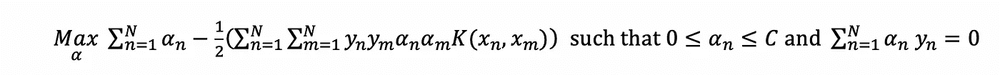

设 ***α*** 为一个变量列向量 *(α****₁*** *α₂ … α_N)*ᵗ，并且设 y 为一个常量列向量 *(y****₁*** *y₂ … y_N)*ᵗ，并且设 *K* 为一个常量矩阵，其中 *K[n,m]* 计算 *(xₙ, xₘ)* 处的核函数值。回顾以下基于索引的点积、外积和二次形式的等价：


以便能够以矩阵形式写出对偶优化问题，如下：

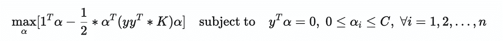

由于这如我们之前所提示的是一个二次规划问题，我们可以查看 CVXOPT 文档中的二次编程：

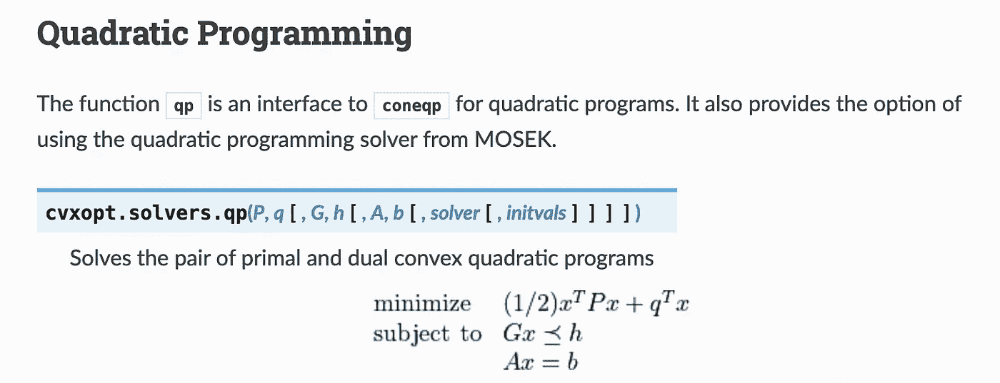

来自 [CVXOPT](https://cvxopt.org/userguide/coneprog.html) 文档。[GNU 通用公共许可证](http://www.gnu.org/licenses/gpl-3.0.html)

方括号告诉你，你可以仅用 *(P,q)*、*(P,q,G,h)* 或 *(P, q, G, h, A, b)* 等（任何未给出的项将被设置为默认值，例如 1）。

为了了解我们案例中 *(P, q, G, h, A, b)* 的值，我们进行以下比较：

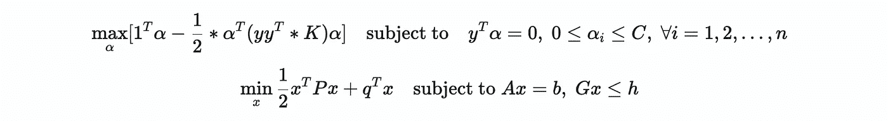

通过以下方式简化比较：

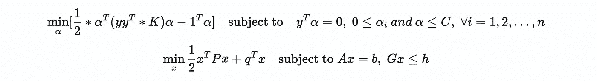

注意我们通过将函数乘以 -1 将 max 改为 min

现在很明显（注意 *0≤****α*** 等价于 *-α≤0*）：*

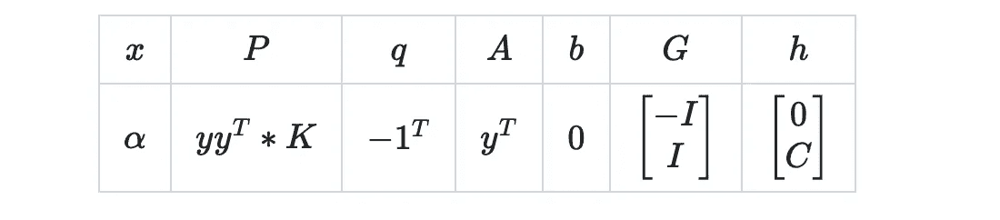

基于此，我们可以写出以下拟合函数：

```py
@SVMClass
def fit(self, X, y, eval_train=False):
    # if more than two unique labels, call the multiclass version
    if len(np.unique(y)) > 2:
        self.multiclass = True
        return self.multi_fit(X, y, eval_train)

    # if labels given in {0,1} change it to {-1,1}
    if set(np.unique(y)) == {0, 1}: y[y == 0] = -1

    # ensure y is a Nx1 column vector (needed by CVXOPT)
    self.y = y.reshape(-1, 1).astype(np.double) # Has to be a column vector
    self.X = X
    N = X.shape[0]  # Number of points

    # compute the kernel over all possible pairs of (x, x') in the data
    # by Numpy's vectorization this yields the matrix K
    self.K = self.kernel(X, X, self.k)

    ### Set up optimization parameters
    # For 1/2 x^T P x + q^T x
    P = cvxopt.matrix(self.y @ self.y.T * self.K)
    q = cvxopt.matrix(-np.ones((N, 1)))

    # For Ax = b
    A = cvxopt.matrix(self.y.T)
    b = cvxopt.matrix(np.zeros(1))

    # For Gx <= h
    G = cvxopt.matrix(np.vstack((-np.identity(N),
                                 np.identity(N))))
    h = cvxopt.matrix(np.vstack((np.zeros((N,1)),
                                 np.ones((N,1)) * self.C)))

    # Solve    
    cvxopt.solvers.options['show_progress'] = False
    sol = cvxopt.solvers.qp(P, q, G, h, A, b)
    self.αs = np.array(sol["x"])            # our solution

    # a Boolean array that flags points which are support vectors
    self.is_sv = ((self.αs-1e-3 > 0)&(self.αs <= self.C)).squeeze()
    # an index of some margin support vector
    self.margin_sv = np.argmax((0 < self.αs-1e-3)&(self.αs < self.C-1e-3))

    if eval_train:  
      print(f"Finished training with accuracy{self.evaluate(X, y)}")
```

我们确保这是一个二分类问题，且二分类标签按 SVM 假设设置为（±1），并且 *y* 是一个维度为 *(N,1)* 的列向量。然后我们解决优化问题以找到 *(α****₁*** *α₂ … α_N)*ᵗ。

我们使用 *(α****₁*** *α₂ … α_N)*ᵗ 来获得一个标志数组，其中任何对应于支持向量的索引为 1，以便我们可以稍后通过仅对支持向量求和，并为 *(xₛ,yₛ)* 应用预测方程。注意，在检查中我们假设非支持向量的 *α* 可能不会完全为 0，如果是 *α≤1e-3*，则大致为零（我们知道 CVXOPT 结果可能不是最终精确的）。同样，我们假设非边际支持向量的 *α* 可能不会完全为 *C*。

## 定义 Predict 方法

回顾预测方程是：


```py
@SVMClass
def predict(self, X_t):
    if self.multiclass: return self.multi_predict(X_t)
    # compute (xₛ, yₛ)
    xₛ, yₛ = self.X[self.margin_sv, np.newaxis], self.y[self.margin_sv]
    # find support vectors
    αs, y, X= self.αs[self.is_sv], self.y[self.is_sv], self.X[self.is_sv]
    # compute the second term
    b = yₛ - np.sum(αs * y * self.kernel(X, xₛ, self.k), axis=0)
    # compute the score
    score = np.sum(αs * y * self.kernel(X, X_t, self.k), axis=0) + b
    return np.sign(score).astype(int), score
```

就是这样。我们还可以实现一个`evaluate`方法来计算准确性（用于上面的 fit）。

```py
@SVMClass
def evaluate(self, X,y):  
    outputs, _ = self.predict(X)
    accuracy = np.sum(outputs == y) / len(y)
    return round(accuracy, 2)
```

## 测试实现

```py
from sklearn.datasets import make_classification
import numpy as np

# Load the dataset
np.random.seed(1)
X, y = make_classification(n_samples=2500, n_features=5, 
                           n_redundant=0, n_informative=5, 
                           n_classes=2,  class_sep=0.3)

# Test Implemented SVM
svm = SVM(kernel='rbf', k=1)
svm.fit(X, y, eval_train=True)

y_pred, _ = svm.predict(X)
print(f"Accuracy: {np.sum(y==y_pred)/y.shape[0]}")  #0.9108

# Test with Scikit
from sklearn.svm import SVC
clf = SVC(kernel='rbf', C=1, gamma=1)
clf.fit(X, y)
y_pred = clf.predict(X)
print(f"Accuracy: {sum(y==y_pred)/y.shape[0]}")    #0.9108
```

你可以更改数据集和超参数以进一步确保它们是相同的。理想情况下，通过比较决策函数而不是准确性来进行。

## 多类推广

```py
@SVMClass
def multi_fit(self, X, y, eval_train=False):
    self.k = len(np.unique(y))      # number of classes
    # for each pair of classes
    for i in range(self.k):
        # get the data for the pair
        Xs, Ys = X, copy.copy(y)
        # change the labels to -1 and 1
        Ys[Ys!=i], Ys[Ys==i] = -1, +1
        # fit the classifier
        clf = SVM(kernel=self.kernel_str, C=self.C, k=self.k)
        clf.fit(Xs, Ys)
        # save the classifier
        self.clfs.append(clf)
    if eval_train:  
        print(f"Finished training with accuracy {self.evaluate(X, y)}")
```

为了将模型推广到多类，我们在每个现有类别上训练一个二进制 SVM 分类器，其中我们对每个类别进行循环，将属于该类别的点重新标记为+1，将所有其他类别的点标记为-1。

训练结果是* k *个分类器，当给定*k*类时，其中第* i *个分类器是在将第* i *类标记为+1 而所有其他类标记为-1 的数据上训练的。

## 将预测推广到多类

然后，在新的示例上进行预测时，我们选择对应分类器最有信心的类（具有最高得分）

```py
@SVMClass
def multi_predict(self, X):
    # get the predictions from all classifiers
    N = X.shape[0]
    preds = np.zeros((N, self.k))
    for i, clf in enumerate(self.clfs):
        _, preds[:, i] = clf.predict(X)

    # get the argmax and the corresponding score
    return np.argmax(preds, axis=1), np.max(preds, axis=1)
```

## 测试实现

```py
from sklearn.datasets import make_classification
import numpy as np

# Load the dataset
np.random.seed(1)
X, y = make_classification(n_samples=500, n_features=2, 
                           n_redundant=0, n_informative=2, 
                           n_classes=4, n_clusters_per_class=1,  
                           class_sep=0.3)

# Test SVM
svm = SVM(kernel='rbf', k=4)
svm.fit(X, y, eval_train=True)

y_pred = svm.predict(X)
print(f"Accuracy: {np.sum(y==y_pred)/y.shape[0]}") # 0.65

# Test with Scikit
from sklearn.multiclass import OneVsRestClassifier
from sklearn.svm import SVC

clf = OneVsRestClassifier(SVC(kernel='rbf', C=1, gamma=4)).fit(X, y)
y_pred = clf.predict(X)
print(f"Accuracy: {sum(y==y_pred)/y.shape[0]}")    # 0.65
```

绘制每个决策区域会产生以下图：

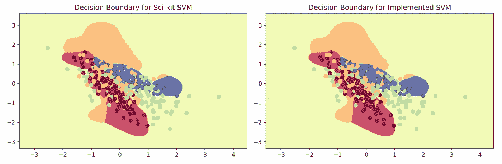

作者提供的图

请注意，尽管 Sci-kit Learn 的 SVM 默认支持 OVR（如上所示没有显式调用），但这也可能具有特定于 SVM 的进一步优化。

## 完整代码

```py
 import numpy as np                  # for basic operations over arrays
from scipy.spatial import distance  # to compute the Gaussian kernel
import cvxopt                       # to solve the dual optimization problem
import copy                         # to copy numpy arrays 

class SVM:
    linear = lambda x, xࠤ , c=0: x @ xࠤ .T
    polynomial = lambda x, xࠤ , Q=5: (1 + x @ xࠤ.T)**Q
    rbf = lambda x, xࠤ , γ=10: np.exp(-γ * distance.cdist(x, xࠤ,'sqeuclidean'))
    kernel_funs = {'linear': linear, 'polynomial': polynomial, 'rbf': rbf}

    def __init__(self, kernel='rbf', C=1, k=2):
        # set the hyperparameters
        self.kernel_str = kernel
        self.kernel = SVM.kernel_funs[kernel]
        self.C = C                  # regularization parameter
        self.k = k                  # kernel parameter

        # training data and support vectors
        self.X, y = None, None
        self.αs = None

        # for multi-class classification
        self.multiclass = False
        self.clfs = []                                  

# This is useless here (only for notebook)
SVMClass = lambda func: setattr(SVM, func.__name__, func) or func

@SVMClass
def fit(self, X, y, eval_train=False):
    if len(np.unique(y)) > 2:
        self.multiclass = True
        return self.multi_fit(X, y, eval_train)

    # relabel if needed
    if set(np.unique(y)) == {0, 1}: y[y == 0] = -1
    # ensure y has dimensions Nx1
    self.y = y.reshape(-1, 1).astype(np.double) # Has to be a column vector
    self.X = X
    N = X.shape[0]

    # compute the kernel over all possible pairs of (x, x') in the data
    self.K = self.kernel(X, X, self.k)

    # For 1/2 x^T P x + q^T x
    P = cvxopt.matrix(self.y @ self.y.T * self.K)
    q = cvxopt.matrix(-np.ones((N, 1)))

    # For Ax = b
    A = cvxopt.matrix(self.y.T)
    b = cvxopt.matrix(np.zeros(1))

    # For Gx <= h
    G = cvxopt.matrix(np.vstack((-np.identity(N),
                                 np.identity(N))))
    h = cvxopt.matrix(np.vstack((np.zeros((N,1)),
                                 np.ones((N,1)) * self.C)))

    # Solve    
    cvxopt.solvers.options['show_progress'] = False
    sol = cvxopt.solvers.qp(P, q, G, h, A, b)
    self.αs = np.array(sol["x"])

    # Maps into support vectors
    self.is_sv = ((self.αs > 1e-3) & (self.αs <= self.C)).squeeze()
    self.margin_sv = np.argmax((1e-3 < self.αs) & (self.αs < self.C - 1e-3))

    if eval_train:  
      print(f"Finished training with accuracy {self.evaluate(X, y)}")

@SVMClass
def multi_fit(self, X, y, eval_train=False):
    self.k = len(np.unique(y))      # number of classes
    # for each pair of classes
    for i in range(self.k):
        # get the data for the pair
        Xs, Ys = X, copy.copy(y)
        # change the labels to -1 and 1
        Ys[Ys!=i], Ys[Ys==i] = -1, +1
        # fit the classifier
        clf = SVM(kernel=self.kernel_str, C=self.C, k=self.k)
        clf.fit(Xs, Ys)
        # save the classifier
        self.clfs.append(clf)
    if eval_train:  
      print(f"Finished training with accuracy {self.evaluate(X, y)}")

@SVMClass
def predict(self, X_t):
    if self.multiclass: return self.multi_predict(X_t)
    xₛ, yₛ = self.X[self.margin_sv, np.newaxis], self.y[self.margin_sv]
    αs, y, X= self.αs[self.is_sv], self.y[self.is_sv], self.X[self.is_sv]

    b = yₛ - np.sum(αs * y * self.kernel(X, xₛ, self.k), axis=0)
    score = np.sum(αs * y * self.kernel(X, X_t, self.k), axis=0) + b
    return np.sign(score).astype(int), score

@SVMClass
def multi_predict(self, X):
    # get the predictions from all classifiers
    preds = np.zeros((X.shape[0], self.k))
    for i, clf in enumerate(self.clfs):
        _, preds[:, i] = clf.predict(X)

    # get the argmax and the corresponding score
    return np.argmax(preds, axis=1)

@SVMClass
def evaluate(self, X,y):  
    outputs, _ = self.predict(X)
    accuracy = np.sum(outputs == y) / len(y)
    return round(accuracy, 2)

from sklearn.datasets import make_classification
import numpy as np

# Load the dataset
np.random.seed(1)
X, y = make_classification(n_samples=500, n_features=2, 
          n_redundant=0, n_informative=2, n_classes=4, 
          n_clusters_per_class=1,  class_sep=0.3)

# Test SVM
svm = SVM(kernel='rbf', k=4)
svm.fit(X, y, eval_train=True)

y_pred = svm.predict(X)
print(f"Accuracy: {np.sum(y==y_pred)/y.shape[0]}")

# Test with Scikit
from sklearn.multiclass import OneVsRestClassifier
from sklearn.svm import SVC

clf = OneVsRestClassifier(SVC(kernel='rbf', C=1, gamma=4)).fit(X, y)
y_pred = clf.predict(X)
print(f"Accuracy: {sum(y==y_pred)/y.shape[0]}") 
```


照片由[Nathan Van Egmond](https://unsplash.com/@thevanegmond?utm_source=medium&utm_medium=referral)拍摄，[Unsplash](https://unsplash.com/?utm_source=medium&utm_medium=referral)提供

总之，我们实现了支持向量机（SVM）学习算法，涵盖了其一般的软边距和核化形式。我们提供了 SVM 的概述，开发了代码中的模型，扩展了多类场景，并使用 Sci-kit Learn 验证了我们的实现。

希望你发现从这个故事中学到的内容对你的工作有用。下次见，再见。

**资源：**

代码主要是对这里存在的代码的适配（[MIT 许可证](https://opensource.org/license/mit/)）：

Persson, Aladdin. “[从零开始的 SVM——机器学习 Python（支持向量机](https://github.com/aladdinpersson/Machine-Learning-Collection/blob/master/ML/algorithms/svm/svm.py)）。” [YouTube](https://www.youtube.com/watch?v=gBTtR0bs-1k)。
