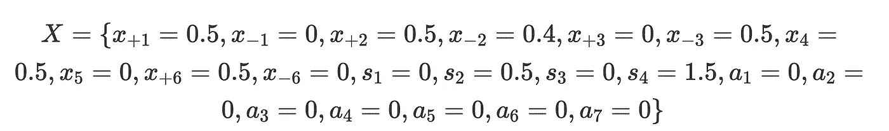

# Reluplex 的实现细节：一种高效的 SMT 求解器用于验证深度神经网络

> 原文：[`towardsdatascience.com/implementation-details-of-reluplex-an-efficient-smt-solver-for-verifying-deep-neural-networks-379ea359c41a?source=collection_archive---------5-----------------------#2023-12-27`](https://towardsdatascience.com/implementation-details-of-reluplex-an-efficient-smt-solver-for-verifying-deep-neural-networks-379ea359c41a?source=collection_archive---------5-----------------------#2023-12-27)

## 如何正式验证你的神经网络的边界

 [Matthew Daw](https://medium.com/@mattdaw7?source=post_page-----379ea359c41a--------------------------------)

·

[关注](https://medium.com/m/signin?actionUrl=https%3A%2F%2Fmedium.com%2F_%2Fsubscribe%2Fuser%2F3a94e02b6ee1&operation=register&redirect=https%3A%2F%2Ftowardsdatascience.com%2Fimplementation-details-of-reluplex-an-efficient-smt-solver-for-verifying-deep-neural-networks-379ea359c41a&user=Matthew+Daw&userId=3a94e02b6ee1&source=post_page-3a94e02b6ee1----379ea359c41a---------------------post_header-----------) 发表在 [Towards Data Science](https://towardsdatascience.com/?source=post_page-----379ea359c41a--------------------------------) ·17 分钟阅读·2023 年 12 月 27 日

--

图片由 [NEOM](https://unsplash.com/@neom?utm_source=medium&utm_medium=referral) 提供，来源于 [Unsplash](https://unsplash.com/?utm_source=medium&utm_medium=referral)

Reluplex 是斯坦福大学于 2017 年提交到 CAV 的一个算法 [1]。Reluplex 旨在正式验证神经网络是否能够在给定某些输入的情况下生成特定的输出。它接受一个神经网络及对网络输入和输出的约束作为输入。这些约束可以将任意数量的输入或输出节点限制为一个值或一个值的范围。然后，算法在给定的输入约束范围内找到一个输入，该输入可以产生给定的输出约束范围内的输出。如果不存在这样的例子，它将判断该问题在合理的时间内不可行。

# 算法用途

原始算法是为构建“无人机空中碰撞避免系统”而编写的。该系统使用 45 个深度学习网络来飞行一系列无人机。研究人员需要一种方法来正式保证，无论网络接收到什么其他输入，如果两架无人机太接近，它们将总是远离对方飞行而不会发生碰撞。在最极端的情况下，该算法能够在 109.6 小时内完成这些验证，虽然时间较长，但仍比之前的最先进算法快一个数量级。

碰撞航线规避，图像来自原始论文 [1]

在最近的出版物中，ReluPlex 被一个名为 Marabou 的工具所取代 [4]，Marabou 能够比 ReluPlex 做得更好。这一工具用于神经网络的可解释性。该算法通过寻找输入的上界和下界来确定生成网络输出所必需的输入部分。[6]

神经网络解释的例子，来源于《Towards Formal XAI》 [6]

该算法还被用于设定精确的界限，以确定什么样的对抗性扰动足够大，能够改变网络的输出。

在本文中，我们希望讨论 Reluplex 的详细信息，因为它们构成了理解 Maribou 的重要基础。

# **基本神经网络**

在解释该算法的详细信息之前，我们首先需要了解一些神经网络的基础知识。以下是一个简单的网络图：

基本感知机神经网络的图示 [8]

在上图中，隐藏层的计算方式是将前一层的所有节点乘以特定的值，然后将它们相加，再加上一个对每个节点特定的偏置项。然后，求和值通过一个激活函数 f，再用于下一层。我们将在本文中使用的激活函数是 ReLU 函数，其定义为 f(x) = x 如果 x > 0 否则为 0：

ReLU 函数的例子。图像来源于《Deep Learning using Rectified Linear Units》 [2]

# **Reluplex 的高级视角**

reluplex 的作用是尝试将神经网络转化为一个简单形问题。一旦在简单形问题中设置了约束，它就能快速找到解决方案或确定在给定约束下是否没有有效解。它还是一个经过证明的非常高效的算法，并且有权威的形式证明保证它每次都能有效。这正是我们对 reluplex 问题的期望。唯一的问题是 reluplex 只能处理线性约束，而我们神经网络中的 relu 函数是非线性的，不能直接用于简单形方法。为了使其线性化，我们必须选择施加额外的约束，要么使 relu 的输入必须是非正的，使 relu 失效，或者将 relu 的输入约束为非负的，使 relu 函数有效。默认情况下，大多数 SMT 求解器会通过手动检查每种可能的约束组合来绕过这个问题。然而，在一个包含 300 多个 relu 函数的网络中，这可能会转化为 2³⁰⁰ 种情况拆分，这在解决时速度过于缓慢。那么，reluplex 的做法是，首先对一个没有 relu 约束的网络进行编码，并找到一个可行的点。如果存在可行点，它将逐一修复违反 relu 约束的网络部分。如果一个特定节点更新过多次，会将问题拆分为一个该节点始终有效的情况和一个该节点始终无效的情况，然后继续搜索。原始论文的作者能够形式上证明这个算法是健全且完整的，并且会在有限的步骤内终止。他们还通过实证方法显示它比逐一检查每个可能情况的简单暴力方法终止得更快。

# **本文的目的**

原始论文给出了算法实际工作的一个很好的示例。然而，他们假设读者对简单形方法有深入理解，并跳过了一些必须做出的重要设计选择。因此，本文的目的是详细列出算法使用的确切步骤，以及简单形方法的所有细节。我们还提供了一个简化且有效的 Python 实现。原始论文提供了形式证明，保证只要简单形方法有效，reluplex 就会有效。同时，还有相对大量的出版物证明了 reluplex 的有效性。因此，我们不提供关于此算法有效性的正式论证。我们只是希望解释算法所需的步骤，并提供作者选择这些步骤的直观理解。深入理解这个算法可能需要阅读原始的 reluplex 论文或研究简单形方法。

# **简单形方法**

单纯形法旨在解决定义线性空间内的优化问题。这些问题涉及一组非负变量，对这些变量施加约束，并声明一个目标函数。

作者提供的图片

在建立这些约束条件后，单纯形法最初会验证是否存在满足指定约束条件的点。确定了这样的点后，该方法会继续寻找在给定约束条件下最大化目标的点。

# **Reluplex 的完整示例**

以下是我们将用于演示完整算法的基本神经网络。

作者提供的图片

我们需要做的第一件事是分解隐藏层节点，一个节点将是前一节点的线性函数，另一个节点将是该线性函数输出的 ReLU。

作者提供的图片

现在我们声明对函数输入和输出的以下边界：

作者提供的图片

根据模型设置和声明的约束，我们的目标是将此问题转化为单纯形问题。由于单纯形法仅限于线性操作，直接将 ReLU 约束纳入设置是不切实际的。然而，我们可以为网络的所有其他组件引入约束。如果在没有 ReLU 约束的情况下得到的解是可行的，我们可以逐步添加这些约束，直到发现一个可行解或确定 ReLU 约束使问题变得不可解。因此，通过编码适用的约束，我们现在有如下内容：

作者提供的图片

为了将这些约束纳入单纯形法，我们需要将它们转换为标准形式。在标准形式中，所有非恒定变量都位于左侧，而所有常量都位于右侧，并且常量为正数。重写后，我们得到如下内容：

作者提供的图片

# 设置单纯形表

随后的步骤涉及将所有不等式转换为等式约束。为此，我们将引入松弛变量。这些变量本质上是非负的，并且可以取任意大的值。此外，它们确保我们的新等式约束在数学上等价于原始的不等式约束。

作者提供的图片

目前，单纯形方法固有地只适用于非负变量。然而，我们网络中的节点可能不符合这个非负性约束。为了适应负值，我们必须用分别表示正值和负值的变量替换可以是正值或负值的变量，如下所示：

图片由作者提供

通过这个替换，x_{+i} 和 x_{-i} 可以始终是正值，但仍然组合起来使 x_i 为负值。x_4 和 x_5 出现在 ReLU 之后，因此总是非负的，不需要这个替换。然而，所有其他神经网络节点变量都需要这个替换。进行这些替换后，我们现在有以下约束集。

图片由作者提供

分配负值并去掉括号后，我们得到如下：

图片由作者提供

现在我们已经将变量分为正值和负值部分，我们需要稍微退一步并记住，在我们解决这个方程组之后，我们需要进行调整以修正 ReLU 违规。为了帮助修复 ReLU 违规，我们准备引入一个新的线性约束。我们希望添加的约束是设置 x_{+2} = x_4 和 x_{+3} = x_5。这将使得对所有 i 属于 {2,3}，x_{+i} 和 x_{-i} 都可以是非负的，但当发生这种情况时，ReLU 约束将不再成立。然而，修正 ReLU 约束将变得像添加一个约束使 x_{+i} 或 x_{-i} 等于零一样简单。这个问题可以在没有这个约束的情况下继续进行，它实际上并不是必须的。事实上，原始论文实际上并没有使用这个约束，但我包括它是因为我发现它确实使速度更快，因为它限制了搜索空间。这将导致以下新的约束集。

图片由作者提供

变量太多可能会导致混乱，使得很难看清楚发生了什么。因此，我们将所有内容重新写入一个表格矩阵中。

图片由作者提供

# 求解原始问题

现在我们已经将问题转换为表格矩阵，我们将使用两阶段法来解决这个设置。第一阶段涉及找到一个可行点，而第二阶段则将可行点移动以最大化特定的效用函数。然而，对于我们的特定用例，我们没有效用函数；我们的目标仅仅是确定是否存在一个可行点。因此，我们只会执行两阶段法的第一阶段。

为了识别一个可行点，单纯形法最初检查将所有松弛变量设置为右侧，将所有其他变量设置为零是否可行。在我们的情况下，这种方法不可行，因为没有松弛变量的非零等式约束。此外，在第 5 行和第 7 行，松弛变量乘以负数，使得表达式不可能评估为正的右侧，因为松弛变量始终为正。因此，为了获得初始可行点，我们将引入新的辅助变量，并将其设置为等于右侧，将所有其他变量设为零。对于具有正符号松弛变量的约束，将不会这样做，因为这些松弛变量可能已经等于右侧。为了提高清晰度，我们将左侧的列标明哪些变量被分配了非零值；这些被称为我们的基本变量。

图片由作者提供

我们的可行点是

图片由作者提供

现在我们有一个已知可行的点。然而，重要的是要认识到这些辅助变量改变了解，为了得到我们想要的真实解，我们需要消除它们。为了消除它们，我们将引入一个目标函数将它们设为零。具体来说，我们的目标是最小化函数 a1 + a2 + a3 + a4 + a5 + a6 + a7。如果我们成功将这个函数最小化为零，我们可以得出结论，原始方程组有一个可行点。然而，如果我们无法实现这一点，则表明没有可行点，我们可以终止问题并声明输入和输出不可行。

在表格和目标函数声明后，我们准备执行优化目标所需的主元操作。具体步骤如下：

1.  用非基本变量替换目标函数中的基本变量。在这种情况下，所有辅助变量都是基本变量。为了替换它们，我们对所有辅助列和基本变量有非零值条目的行进行主元操作。主元操作是通过从主元行中添加或减去所有其他行，直到主元列中唯一的非零条目是主元行中的条目。

1.  通过在目标函数中找到第一个且最大的值的列来选择主元列。

1.  通过使用布兰德规则选择主元行。布兰德规则识别我们列中的所有正条目，将目标函数除以这些条目，并选择产生最小值的行。

1.  重复步骤 2 和 3，直到目标函数中的所有条目都为非正值。

一旦完成，我们将得到以下新的表格。

图片由作者提供

从中，我们得出点

图片由作者提供

我们已成功将所有辅助变量调整为零。我们还将它们移到非基本变量中。此外，我们会注意到这些值确实满足了我们最初的线性约束。因此，我们不再需要辅助变量，可以将它们从线性方程组中移除。如果我们合并正负变量并移除辅助变量，我们会得到这个新点：

图片来自作者

# Relu 修复搜索程序

通过添加约束 x_{+2} = x_4 和 x_{+3} = x_5，我们使得 x_{+2} 和 x_{-2} 都可以是非零的（x_{+3} 和 x_{-3} 同样适用）。如上所示，x_{+2} 和 x_{-2} 都是非零的，且 relu(x_2) 不等于 x_4。要修复 ReLU，没有办法直接约束单纯形使 x_{+2} 或 x_{-2} 为零，我们必须选择一种情况并为该情况创建约束。在这两种情况下选择相当于决定 ReLU 是否处于激活状态。原论文中，作者通过在特定时刻将一侧的值赋给另一侧来处理 ReLU 违规情况。我们认为这种方法对问题的约束过于严苛，因为将 ReLU 限定为一个特定值并需要检查可能无数的配置。我们的解决方案则将 ReLU 限制为激活或不激活。因此，我们只需检查这些情况以涵盖所有允许的配置。

由于我们需要决定 ReLU 约束是否处于激活或非激活状态，并且需要设置 2 的 n 次方个有效约束，在大型网络中手动检查所有可能的配置变得不切实际。

Reluplex 的作者建议通过尝试逐一解决每个 ReLU 问题来应对违反情况。他们迭代地添加一个约束以解决一个特定的违规问题，更新表格以适应新约束，移除约束，然后对所有其他或新的违规情况重复这一过程。由于每次只存在一个约束，因此更新一个 ReLU 修复可能会破坏已经修复的另一个地方的 ReLU。这可能导致重复修复相同的 ReLU 约束的循环。为了绕过这一点，如果一个 ReLU 节点被更新了五次，则会执行“ReLU 拆分”。该拆分将问题分成两个情况：在一个情况中，他们强制变量的负侧为零，而在另一个情况下，正侧被设置为零。重要的是，无论哪种情况，约束都不会被移除，确保该 ReLU 不会再需要修复。这允许算法仅在特别“问题” ReLU 节点上进行拆分，实证证据显示，通常只有大约 10% 的 ReLU 需要拆分。因此，尽管某些修复操作可能会重复，但总体过程仍然比简单的暴力检查每一种可能性更快。

# 添加约束以修复 ReLU

为了处理 ReLU 违规，我们需要将 x_{+2} 或 x_{-2} 约束为零。为了保持系统化的方法，我们将始终尝试首先将正变量设置为零。如果这证明不可行，我们将把负侧设置为零。

引入一个新约束涉及添加一个新的辅助变量。如果我们添加这个变量并施加约束使得 x_{+2}=0，表格将被转化如下：

作者提供的图片

x_{+2} 作为基本变量，出现在两个不同的行中。这与单纯形方法正常运行所需的假设之一相矛盾。因此，有必要快速执行 (x_{+2}, x_{+2}) 的枢轴操作以解决此问题。执行此枢轴操作会产生如下结果：

作者提供的图片

# 解决对偶问题

在前一步中，我们应用了两阶段法来解决最后的表格。这种方法涉及引入人工变量，直到建立一个保证的平凡初始点。随后，它从一个可行点枢轴到另一个点，直到获得最优解。然而，我们将采用对偶单纯形法，而不是继续对这个表格使用两阶段法。

双重单纯形法的起始步骤是识别一个超越给定约束的最优位置点，通常称为超级最优点。然后，它从一个超级最优点移动到另一个，直到达到一个可行点。一旦达到可行点，即可确保它是全局最优点。这种方法适合我们当前的情境，因为它允许我们在已经解决的表格中添加一个约束，而无需解决一个原始问题。鉴于我们缺乏固有的目标函数，我们将任意指定一个目标函数如下：

作者提供的图像

解决原始问题通常涉及转置矩阵并用右侧值替换目标函数值。然而，在这种情况下，我们可以直接使用已经设置好的表格进行解决。过程如下：

作者提供的图像

将此过程应用于我们已建立的问题将揭示其不可行性。这与预期一致，因为将 x_{+3} 设为零将需要将 x_{+1}-x_{-1} 或 x_1 设为 0.4 或更低，低于我们最初对 x_1 施加的 0.5 的下限约束。

# 设置 x_{-1}=0

由于设置 x_{+1}=0 失败，我们继续尝试设置 x_{-1}=0。实际上，这将成功并得到以下完成的表格：

作者提供的图像

从中，我们得到新的解点：

作者提供的图像

如果我们将其合并，变成：

作者提供的图像

现在我们已成功使 x_4 = relu(x_2)，我们必须在继续之前移除临时约束。

# 移除临时 ReLU 约束

为了提高约束，需要一个主元操作来明确在单行中陈述约束。这可以通过以新的 a_1 列作为主元来实现。按照布兰德规则选择主元行，我们识别出我们列中的所有正值，将目标函数值除以这些值，并选择最小值的行。在这种情况下，x_{-2} 行成为最佳选择，因为 0/1=0 小于所有其他候选值。执行主元操作后的结果表格如下：

作者提供的图像

需要注意的是，没有任何变量值被改变。我们现在可以自信地从表格中删除 a_1 行和 a_1 列。这一操作有效地移除了约束 x_{-2}=0， resulting in the following updated tableau:

作者提供的图像

# 继续进行 Relu 分裂

显而易见，我们成功解决了 ReLU 违例，实现了 x_4 = ReLU(x_2)的预期结果。然而，新的违例出现了，因为 x_5 不等于 ReLU(x_3)。为了解决这个新违例，我们遵循与修复 x_4 不等于 ReLU(x_2)违例时完全相同的程序。不过，一旦完成，我们发现表格恢复到修复 x_4 = ReLU(x_2)之前的状态。如果继续下去，我们将不断循环修复 x_4 = ReLU(x_2)和 x_5 = ReLU(x_3)，直到其中一个被更新足够以触发 ReLU 拆分。这个拆分创建了两个表格：一个是 x_{+2}=0（已显示为不可行），另一个是 x_{-2}=0，结果是我们之前遇到过的表格。

作者提供的图像

不过这次，我们通常会将问题分为两种情况，一种是 x_{-2}=0，另一种是 x_{+2}=0。然而，我们已经确定 x_{+2}=0 是不可能的，因此我们终止了那个问题。现在我们只需要确定 x_{-2}=0 是否不可行，如果是，我们就完成了。我们现在继续处理 x_{-2}=0，永久编码到表格中。接下来我们尝试修复 x_{+3}=0 的约束。一旦我们用完全相同的方法进行处理，我们将成功并得到以下值：

作者提供的图像

将这些合并后变成：

作者提供的图像

这个结果没有 ReLU 违例，并且代表了神经网络在最初声明的范围内可以生成的有效点。至此，我们的搜索结束，我们可以正式声明神经网络在输入范围 0.5 到 1 之间生成输出范围 0.5 到 2 是可能的。

# 可能的优化

原始论文建议了其他优化方法，如约束收紧、推导约束、冲突分析和浮点运算。其中最有前景的是约束收紧，其中进行一些简单的检查以确定一个约束是否必然意味着另一个约束必须在用户设置的范围内更小。在我们的例子中，一些简单的代数计算可以迅速表明，为了使输出至少为 0.5，输入必须至少为 0.9，因此我们可以在开始任何搜索之前改变这个约束。然而，这些优化没有在我们的解决方案中实现，因此我们将其留给读者阅读原始论文以了解这些及其他优化的详细信息。

# 代码实现

对于表现最佳且适用于生产的算法版本，我们建议探索官方的 Marabou GitHub 页面[5]，因为这是该问题领域的当前最前沿。此外，你可以深入了解官方 Reluplex 代码库以获得对算法的更深入理解[2]。我还用 Python 编写了一个简化版的 ReLuPlex 实现[3]。这个实现对于理解算法并让用户逐行执行它非常有价值。它可以作为开发定制的更高级 Python 版本算法的基础。

# 参考文献

[[1][1702.01135] Reluplex：用于验证深度神经网络的高效 SMT 求解器 (arxiv.org)](https://arxiv.org/abs/1702.01135)

[[2][1803.08375] 使用修正线性单元（ReLU）的深度学习](https://arxiv.org/abs/1803.08375)

[[2] ReluPlex 的官方实现 (github.com)](https://github.com/guykatzz/ReluplexCav2017)

[[3] 作者的 ReluPlex Python 实现 (github.com)](https://github.com/MatthewDaw/reluplex)

[[4][1910.14574] 基于抽象的神经网络验证框架 (arxiv.org)](https://arxiv.org/abs/1910.14574)

[[5] Marabou 的官方实现 (github.com)](https://github.com/NeuralNetworkVerification/Marabou)

[[6][2210.13915]迈向正式 XAI：神经网络的形式近似最小解释](https://arxiv.org/abs/2210.13915)

[[7] Science Direct 上的神经网络](https://www.sciencedirect.com/topics/neuroscience/neural-network)

[[8]数字图像去噪的反向传播算法综合概述](https://www.mdpi.com/2079-9292/11/10/1590)
