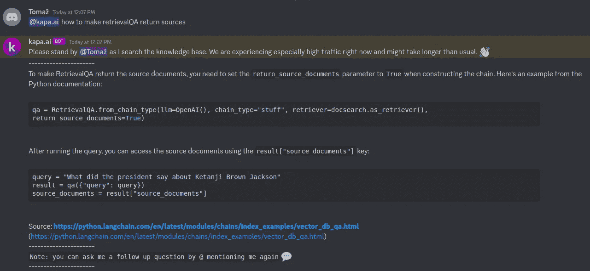
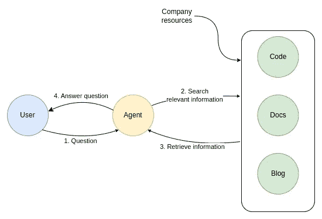
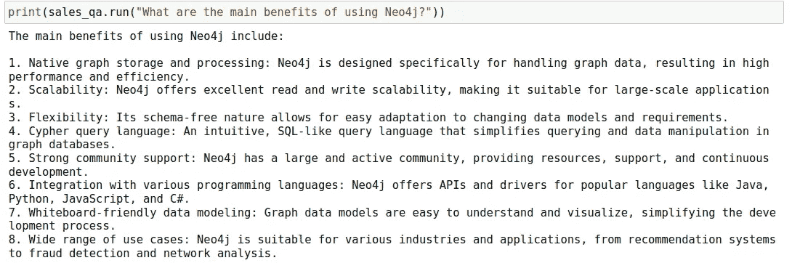
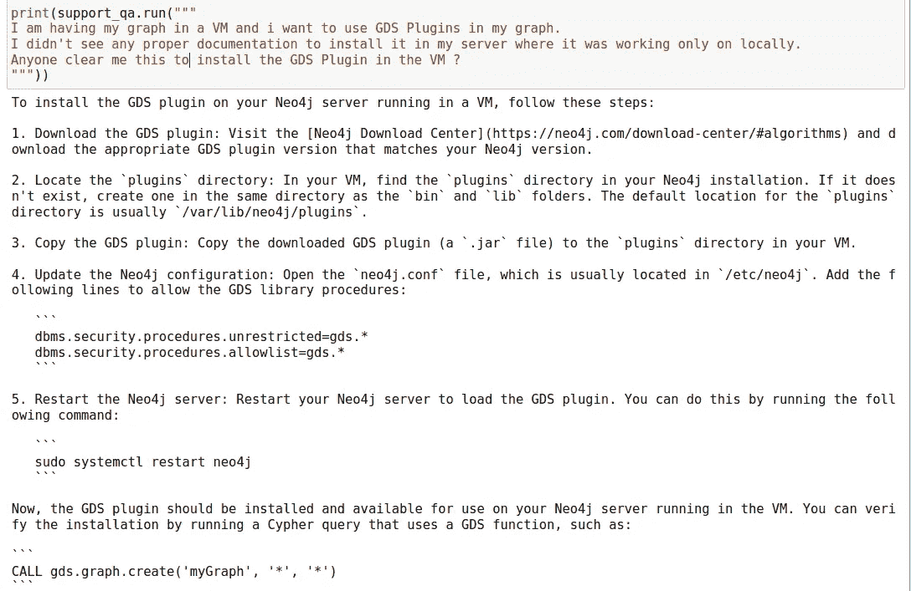
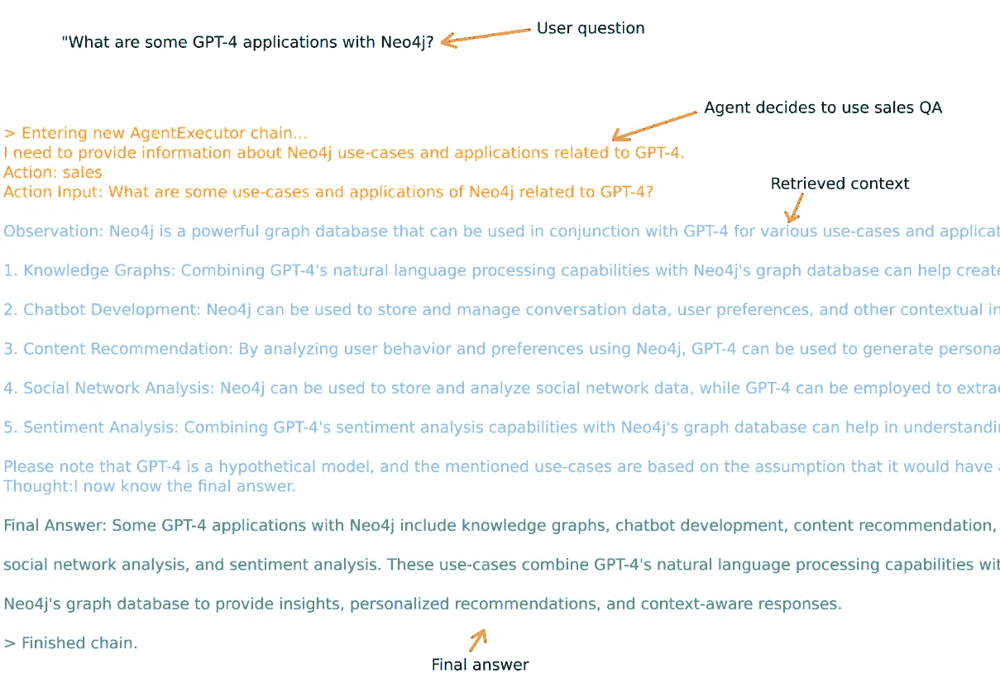
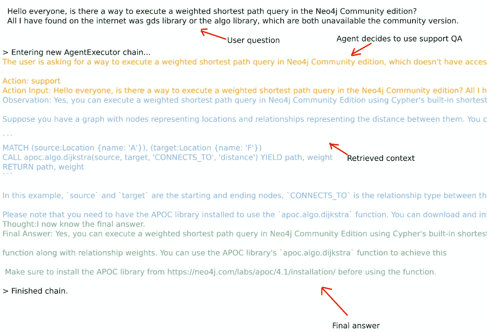

# 使用 LangChain 实现销售与支持代理

> 原文：[`towardsdatascience.com/implementing-a-sales-support-agent-with-langchain-63c4761193e7?source=collection_archive---------0-----------------------#2023-04-19`](https://towardsdatascience.com/implementing-a-sales-support-agent-with-langchain-63c4761193e7?source=collection_archive---------0-----------------------#2023-04-19)

## 了解如何开发一个能够基于公司文档中提供的信息回答问题的聊天机器人

[](https://bratanic-tomaz.medium.com/?source=post_page-----63c4761193e7--------------------------------)[](https://towardsdatascience.com/?source=post_page-----63c4761193e7--------------------------------) [Tomaz Bratanic](https://bratanic-tomaz.medium.com/?source=post_page-----63c4761193e7--------------------------------)

·

[关注](https://medium.com/m/signin?actionUrl=https%3A%2F%2Fmedium.com%2F_%2Fsubscribe%2Fuser%2F57f13c0ea39a&operation=register&redirect=https%3A%2F%2Ftowardsdatascience.com%2Fimplementing-a-sales-support-agent-with-langchain-63c4761193e7&user=Tomaz+Bratanic&userId=57f13c0ea39a&source=post_page-57f13c0ea39a----63c4761193e7---------------------post_header-----------) 发表在 [数据科学前沿](https://towardsdatascience.com/?source=post_page-----63c4761193e7--------------------------------) ·10 分钟阅读·2023 年 4 月 19 日[](https://medium.com/m/signin?actionUrl=https%3A%2F%2Fmedium.com%2F_%2Fvote%2Ftowards-data-science%2F63c4761193e7&operation=register&redirect=https%3A%2F%2Ftowardsdatascience.com%2Fimplementing-a-sales-support-agent-with-langchain-63c4761193e7&user=Tomaz+Bratanic&userId=57f13c0ea39a&source=-----63c4761193e7---------------------clap_footer-----------)

--

[](https://medium.com/m/signin?actionUrl=https%3A%2F%2Fmedium.com%2F_%2Fbookmark%2Fp%2F63c4761193e7&operation=register&redirect=https%3A%2F%2Ftowardsdatascience.com%2Fimplementing-a-sales-support-agent-with-langchain-63c4761193e7&source=-----63c4761193e7---------------------bookmark_footer-----------)

最近，我对 ChatGPT 的强大功能以及其构建各种类型聊天机器人的能力产生了浓厚的兴趣。我尝试并撰写了关于多种方法的文章，这些方法旨在实现一个能够访问外部信息以改善回答的聊天机器人。在我的聊天机器人编码过程中，我加入了一些 Discord 频道，希望能获得一些帮助，因为这些库相对较新，文档还不多。令我惊讶的是，我发现了一些定制的机器人，它们能够回答大多数有关这些库的问题。



Discord 支持机器人示例。图片由作者提供。

这个想法是赋予聊天机器人能够深入挖掘各种资源，如公司文档、代码或其他内容，从而允许它回答公司支持问题。由于我已经有一些聊天机器人经验，我决定测试实现一个自定义机器人，访问公司的资源有多困难。

在这篇博客文章中，我将带你了解如何使用 OpenAI 的模型在[LangChain 库](https://python.langchain.com/en/latest/index.html)中实现一个销售和支持代理，该代理可以回答有关应用程序的信息，并且可以与[图形数据库 Neo4j](https://neo4j.com/)配合使用。该代理还可以帮助你调试或生成任何你遇到困难的 Cypher 语句。这样的代理可以部署到 Discord 或其他平台上服务用户。



代理设计。图片由作者提供。

我们将使用[LangChain 库](https://python.langchain.com/en/latest/index.html)来实现支持机器人。该库易于使用，并提供了 LLM 提示和 Python 代码的出色集成，使我们能够在几分钟内开发聊天机器人。此外，该库支持各种 LLM、文本嵌入模型和向量数据库，并且具有帮助我们加载和嵌入常见文件类型（如文本、PowerPoint、图片、HTML、PDF 等）的实用函数。

本博客文章的代码可在 GitHub 上获得。

[](https://github.com/tomasonjo/blogs/blob/master/neo4jdocs/neo4j_support_bot.ipynb?source=post_page-----63c4761193e7--------------------------------) [## blogs/neo4j_support_bot.ipynb at master · tomasonjo/blogs

### 你现在不能执行该操作。你在另一个标签页或窗口中登录。你在另一个标签页中注销了…

[github.com](https://github.com/tomasonjo/blogs/blob/master/neo4jdocs/neo4j_support_bot.ipynb?source=post_page-----63c4761193e7--------------------------------)

## LangChain 文档加载器

首先，我们必须预处理公司的资源并将其存储在向量数据库中。幸运的是，LangChain 可以帮助我们加载外部数据、计算文本嵌入，并将文档存储在我们选择的向量数据库中。

首先，我们需要将文本加载到文档中。LangChain 提供了各种[助手函数，可以处理不同格式和类型的数据，并生成文档输出](https://python.langchain.com/en/latest/modules/indexes/document_loaders.html?highlight=document+loaders)。这些助手函数被称为文档加载器。

Neo4j 在 GitHub 仓库中有大量文档。方便的是，LangChain 提供了一个文档加载器，可以将仓库 URL 作为输入，为仓库中的每个文件生成文档。此外，我们还可以使用过滤函数在加载过程中忽略文件（如果需要的话）。

我们将从 [Neo4j 知识库仓库](https://github.com/neo4j-documentation/knowledge-base) 加载 AsciiDoc 文件开始。

```py
# Knowledge base
kb_loader = GitLoader(
    clone_url="https://github.com/neo4j-documentation/knowledge-base",
    repo_path="./repos/kb/",
    branch="master",
    file_filter=lambda file_path: file_path.endswith(".adoc")
    and "articles" in file_path,
)
kb_data = kb_loader.load()
print(len(kb_data)) # 309
```

这不是很简单吗？`GitLoader` 函数克隆了仓库并将相关文件加载为文档。在这个例子中，我们指定了文件必须以 `.adoc` 后缀结尾，并且是 `articles` 文件夹的一部分。总共加载了 309 篇文章。我们还必须注意文档的大小。例如，GPT-3.5-turbo 的 token 限制为 4000，而 GPT-4 在单个请求中允许 8000 个 tokens。虽然单词数与 tokens 数量并不完全相同，但仍然是一个很好的估算。

接下来，我们将加载 [Graph Data Science 仓库](https://github.com/neo4j/graph-data-science) 的文档。在这里，我们将使用文本拆分器来确保没有文档超过 2000 个单词。再次说明，单词数量与 tokens 数量并不相等，但这是一个很好的近似值。定义 token 的阈值数量可以显著影响数据库的查找和检索。我找到了一篇 [Pinecone 的优秀文章，可以帮助你理解各种块拆分策略的基础](https://www.pinecone.io/learn/chunking-strategies/)。

```py
# Define text chunk strategy
splitter = CharacterTextSplitter(
  chunk_size=2000, 
  chunk_overlap=50,
  separator=" "
)
# GDS guides
gds_loader = GitLoader(
    clone_url="https://github.com/neo4j/graph-data-science",
    repo_path="./repos/gds/",
    branch="master",
    file_filter=lambda file_path: file_path.endswith(".adoc") 
    and "pages" in file_path,
)
gds_data = gds_loader.load()
# Split documents into chunks
gds_data_split = splitter.split_documents(gds_data)
print(len(gds_data_split)) #771
```

我们可以加载其他包含文档的 Neo4j 仓库。然而，目的是展示各种数据加载方法，而不是探索所有包含文档的 Neo4j 仓库。因此，我们将继续并查看如何从 Pandas Dataframe 中加载文档。

例如，假设我们想将 YouTube 视频加载为我们的聊天机器人的文档来源。Neo4j 有自己的 YouTube 频道，甚至我也出现在一两个视频中。两年前，我展示了如何实现信息提取管道。

使用 LangChain，我们可以利用视频的字幕，并通过仅仅三行代码将其作为文档加载。

```py
yt_loader = YoutubeLoader("1sRgsEKlUr0")
yt_data = yt_loader.load()
yt_data_split = splitter.split_documents(yt_data)
print(len(yt_data_split)) #10
```

这已经没有比这更简单的了。接下来，我们将查看如何从 Pandas dataframe 中加载文档。一个月前，我从 Neo4j medium 发布的文章中获取了信息用于另一个博客帖子。由于我们希望将关于 Neo4j 的外部信息带入机器人，我们也可以使用 medium 文章的内容。

```py
article_url = "https://raw.githubusercontent.com/tomasonjo/blog-datasets/main/medium/neo4j_articles.csv"
medium = pd.read_csv(article_url, sep=";")
medium["source"] = medium["url"]
medium_loader = DataFrameLoader(
    medium[["text", "source"]], 
    page_content_column="text")
medium_data = medium_loader.load()
medium_data_split = splitter.split_documents(medium_data)
print(len(medium_data_split)) #4254
```

在这里，我们使用 Pandas 从 GitHub 加载了一个 CSV 文件，重命名了一列，并使用 `DataFrameLoader` 函数将文章作为文档加载。由于 medium 帖子可能超过 4000 个 tokens，我们使用文本拆分器将文章拆分成多个块。

我们将使用的最后一个来源是 Stack Overflow API。Stack Overflow 是一个网络平台，用户帮助他人解决编码问题。他们的 API 不需要任何授权。因此，我们可以使用 API 来检索带有 Neo4j 标签的接受答案的问题。

```py
so_data = []
for i in range(1, 20):
    # Define the Stack Overflow API endpoint and parameters
    api_url = "https://api.stackexchange.com/2.3/questions"
    params = {
        "order": "desc",
        "sort": "creation",
        "filter": "!-MBrU_IzpJ5H-AG6Bbzy.X-BYQe(2v-.J",
        "tagged": "neo4j",
        "site": "stackoverflow",
        "pagesize": 100,
        "page": i,
    }
    # Send GET request to Stack Overflow API
    response = requests.get(api_url, params=params)
    data = response.json()
    # Retrieve the resolved questions
    resolved_questions = [
        question
        for question in data["items"]
        if question["is_answered"] and question.get("accepted_answer_id")
    ]

    # Print the resolved questions
    for question in resolved_questions:
        text = (
            "Title:",
            question["title"] + "\n" + "Question:",
            BeautifulSoup(question["body"]).get_text()
            + "\n"
            + BeautifulSoup(
                [x["body"] for x in question["answers"] if x["is_accepted"]][0]
            ).get_text(),
        )
        source = question["link"]
        so_data.append(Document(page_content=str(text), metadata={"source": source}))
print(len(so_data)) #777
```

每个批准的答案和原始问题都用于构建一个单一的文档。由于大多数 Stack Overflow 问题和答案不超过 4000 个 tokens，我们跳过了文本拆分步骤。

现在我们已经将文档资源加载为文档，可以进入下一步。

## 将文档存储在向量数据库中

聊天机器人通过将问题的向量嵌入与文档嵌入进行比较来找到相关信息。文本嵌入是机器可读的文本表示形式，通常是一个向量或更简单地说，是一个浮点数列表。在这个例子中，我们将使用 OpenAI 提供的**ada-002**模型来嵌入文档。

向量数据库的核心理念是存储向量并提供快速的相似性搜索。向量通常使用余弦相似性进行比较。LangChain 包括与各种向量数据库的[集成](https://python.langchain.com/en/latest/modules/indexes/vectorstores.html)。为了简单起见，我们将使用[Chroma 向量数据库](https://www.trychroma.com/)，它可以用作本地内存数据库。对于更严肃的聊天机器人应用程序，我们希望使用一个持久的数据库，以避免在脚本或笔记本关闭后丢失数据。

我们将创建两个文档集合。第一个将更多关注销售和营销，包含来自 Medium 和 YouTube 的文档。第二个集合更多关注支持用例，包括文档和 Stack Overflow 文档。

```py
# Define embedding model
OPENAI_API_KEY = "OPENAI_API_KEY"
embeddings = OpenAIEmbeddings(openai_api_key=OPENAI_API_KEY)

sales_data = medium_data_split + yt_data_split
sales_store = Chroma.from_documents(
    sales_data, embeddings, collection_name="sales"
)

support_data = kb_data + gds_data_split + so_data
support_store = Chroma.from_documents(
    support_data, embeddings, collection_name="support"
)
```

这个脚本通过 OpenAI 的文本嵌入 API 处理每个文档，并将生成的嵌入以及文本插入 Chroma 数据库。文本嵌入的费用为 0.80$，这是一个合理的价格。

## 使用外部上下文进行问答

最后要做的是实现两个独立的问答流程。第一个将处理销售和营销请求，另一个将处理支持请求。LangChain 库使用 LLMs 进行推理并向用户提供答案。因此，我们首先定义 LLM。在这里，我们将使用来自 OpenAI 的**GPT-3.5-turbo**模型。

```py
llm = ChatOpenAI(
    model_name="gpt-3.5-turbo",
    temperature=0,
    openai_api_key=OPENAI_API_KEY,
    max_tokens=512,
)
```

实现问答流程在 LangChain 中非常简单。我们只需提供要使用的 LLM 以及用于获取相关文档的检索器。此外，我们还可以自定义用于回答问题的 LLM 提示。

```py
sales_template = """As a Neo4j marketing bot, your goal is to provide accurate 
and helpful information about Neo4j, a powerful graph database used for 
building various applications. You should answer user inquiries based on the 
context provided and avoid making up answers. If you don't know the answer, 
simply state that you don't know. Remember to provide relevant information 
about Neo4j's features, benefits, and use cases to assist the user in 
understanding its value for application development.

{context}

Question: {question}"""
SALES_PROMPT = PromptTemplate(
    template=sales_template, input_variables=["context", "question"]
)
sales_qa = RetrievalQA.from_chain_type(
    llm=llm,
    chain_type="stuff",
    retriever=sales_store.as_retriever(),
    chain_type_kwargs={"prompt": SALES_PROMPT},
)
```

销售提示中最重要的部分是禁止 LLM 在没有依赖官方公司资源的情况下进行回答。记住，LLMs 在提供无效信息时可能表现得非常自信。然而，我们希望避免这种情况，并避免出现机器人承诺或销售不存在的功能的问题。我们可以通过询问以下问题来测试销售问答流程：



销售问答。作者图片。

对于问题的回答似乎是相关且准确的。记住，构建此回答的信息来自 Medium 文章。

接下来，我们将实现支持问答流程。在这里，我们将允许 LLM 模型利用其对 Cypher 和 Neo4j 的知识来帮助解决用户的问题，前提是上下文信息不足。

```py
support_template = """
As a Neo4j Customer Support bot, you are here to assist with any issues 
a user might be facing with their graph database implementation and Cypher statements.
Please provide as much detail as possible about the problem, how to solve it, and steps a user should take to fix it.
If the provided context doesn't provide enough information, you are allowed to use your knowledge and experience to offer you the best possible assistance.

{context}

Question: {question}"""

SUPPORT_PROMPT = PromptTemplate(
    template=support_template, input_variables=["context", "question"]
)

support_qa = RetrievalQA.from_chain_type(
    llm=llm,
    chain_type="stuff",
    retriever=support_store.as_retriever(),
    chain_type_kwargs={"prompt": SUPPORT_PROMPT},
)
```

再次，我们可以测试支持问答能力。我从 Neo4j 的 Discord 服务器上随机挑了一个问题。



支持问答。图片由作者提供。

响应非常切题。请记住，我们检索了图数据科学文档，并将其作为上下文来形成聊天机器人问题。

## 代理实现

我们现在有两个独立的指令和存储，用于**销售**和**支持**回应。如果我们必须让人来区分这两者，那么聊天机器人的全部意义就会丧失。幸运的是，我们可以使用 LangChain 代理根据用户输入决定使用哪个工具。首先，我们需要定义代理的可用工具以及使用它们的时机和方式。

```py
tools = [
    Tool(
        name="sales",
        func=sales_qa.run,
        description="""useful for when a user is interested in various Neo4j information, 
                       use-cases, or applications. A user is not asking for any debugging, but is only
                       interested in general advice for integrating and using Neo4j.
                       Input should be a fully formed question.""",
    ),
    Tool(
        name="support",
        func=support_qa.run,
        description="""useful for when when a user asks to optimize or debug a Cypher statement or needs
                       specific instructions how to accomplish a specified task. 
                       Input should be a fully formed question.""",
    ),
]
```

工具的描述用于帮助代理识别何时以及如何使用工具。例如，支持工具应当用于优化或调试 Cypher 语句，而工具的输入应为一个完整的问题。

我们需要做的最后一件事是初始化代理。

```py
agent = initialize_agent(
    tools, 
    llm, 
    agent="zero-shot-react-description", 
    verbose=True
)
```

现在我们可以继续测试代理在几个问题上的表现。



销售代理示例。图片由作者提供。



支持代理示例。图片由作者提供。

请记住，除了上下文来源之外，这两种问答的主要区别在于，我们允许支持问答形成在提供的上下文中找不到的答案。另一方面，我们禁止销售问答这样做，以避免任何过度承诺的陈述。

## 总结

在 LLM 时代，得益于 LangChain 库，您可以在一天内开发一个利用公司资源回答问题的聊天机器人，因为它提供了各种文档加载器以及与流行 LLM 模型的集成。因此，您只需收集公司的资源，将其导入到向量数据库中即可开始使用。请注意，实施并非确定性的，这意味着在相同提示下您可能会获得略微不同的结果。GPT-4 模型在提供更准确和一致的回应方面要好得多。

如果您对聊天机器人实现有任何想法或反馈，请告诉我。代码总是可以在[GitHub](https://github.com/tomasonjo/blogs/blob/master/neo4jdocs/neo4j_support_bot.ipynb)上找到。
