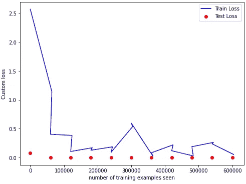
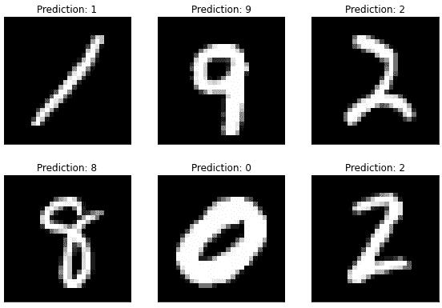

# 在 PyTorch 中实现自定义损失函数

> 原文：[`towardsdatascience.com/implementing-custom-loss-functions-in-pytorch-50739f9e0ee1?source=collection_archive---------4-----------------------#2023-01-16`](https://towardsdatascience.com/implementing-custom-loss-functions-in-pytorch-50739f9e0ee1?source=collection_archive---------4-----------------------#2023-01-16)

## 使用 MNIST 数据集理解 PyTorch 中自定义损失函数的理论和实现

[](https://marcosanguineti.medium.com/?source=post_page-----50739f9e0ee1--------------------------------)[](https://towardsdatascience.com/?source=post_page-----50739f9e0ee1--------------------------------) [Marco Sanguineti](https://marcosanguineti.medium.com/?source=post_page-----50739f9e0ee1--------------------------------)

·

[关注](https://medium.com/m/signin?actionUrl=https%3A%2F%2Fmedium.com%2F_%2Fsubscribe%2Fuser%2F33141be0f14d&operation=register&redirect=https%3A%2F%2Ftowardsdatascience.com%2Fimplementing-custom-loss-functions-in-pytorch-50739f9e0ee1&user=Marco+Sanguineti&userId=33141be0f14d&source=post_page-33141be0f14d----50739f9e0ee1---------------------post_header-----------) 发表在 [Towards Data Science](https://towardsdatascience.com/?source=post_page-----50739f9e0ee1--------------------------------) ·12 min 阅读·2023 年 1 月 16 日

--

[](https://medium.com/m/signin?actionUrl=https%3A%2F%2Fmedium.com%2F_%2Fbookmark%2Fp%2F50739f9e0ee1&operation=register&redirect=https%3A%2F%2Ftowardsdatascience.com%2Fimplementing-custom-loss-functions-in-pytorch-50739f9e0ee1&source=-----50739f9e0ee1---------------------bookmark_footer-----------)

图片由 [Markus Winkler](https://unsplash.com/es/@markuswinkler?utm_source=medium&utm_medium=referral) 在 [Unsplash](https://unsplash.com/?utm_source=medium&utm_medium=referral) 提供

## 介绍

在机器学习中，损失函数是一个关键组成部分，用于衡量预测输出与实际输出之间的差异。它在模型训练中起着至关重要的作用，因为它通过指示模型应改进的方向来指导优化过程。损失函数的选择依赖于具体任务和数据类型。本文将深入探讨 PyTorch 中自定义损失函数的理论和实现，以 MNIST 数据集的数字分类为例。

MNIST 数据集是一个广泛使用的图像分类数据集，包含 70,000 张手写数字图像，每张图像的分辨率为 28x28 像素。任务是将这些图像分类为 10 个数字中的一个（0–9）。该任务旨在训练一个模型，使其能够准确地分类新的手写数字图像，基于 MNIST 数据集中提供的训练示例。


照片由 [Carlos Muza](https://unsplash.com/fr/@kmuza?utm_source=medium&utm_medium=referral) 拍摄，来源于 [Unsplash](https://unsplash.com/?utm_source=medium&utm_medium=referral)

处理这个任务的一个典型方法是使用多类逻辑回归模型，即软最大分类器。软最大函数将模型的输出映射到 10 个类别的概率分布上。交叉熵损失通常作为这种模型的损失函数。交叉熵损失计算预测概率分布与实际概率分布之间的差异。

然而，在某些情况下，交叉熵损失可能不是特定任务的最佳选择。例如，考虑一个场景，其中误分类某些类别的代价远高于其他类别。在这种情况下，有必要使用自定义损失函数来考虑每个类别的相对重要性。

在这篇文章中，我将展示如何为 MNIST 数据集实现自定义损失函数，其中误分类数字 9 的代价远高于其他数字。我们将使用 Pytorch 作为框架，首先讨论自定义损失函数背后的理论，然后展示如何使用 Pytorch 实现自定义损失函数。最后，我们将使用自定义损失函数在 MNIST 数据集上训练一个线性模型，并评估模型的性能。

## 自定义损失函数：原因

实现自定义损失函数非常重要，原因有几个：

1.  **特定问题**：损失函数的选择依赖于具体任务和数据类型。可以设计自定义损失函数，以更好地适应问题的特征，从而提高模型性能。

1.  **类别不平衡**：在许多实际数据集中，每个类别的样本数量可能差异很大。可以设计自定义损失函数以考虑类别不平衡，并对不同类别分配不同的代价。

1.  **成本敏感**：在一些任务中，错误分类某些类别的成本可能远高于其他类别。可以设计自定义损失函数以考虑每个类别的相对重要性，从而得到一个更鲁棒的模型。

1.  **多任务学习**：自定义损失函数可以设计成同时处理多个任务。这在需要一个模型执行多个相关任务的情况下非常有用。

1.  **正则化**：自定义损失函数也可以用于正则化，这有助于防止过拟合并提高模型的泛化能力。

1.  **对抗训练**：自定义损失函数还可以用于训练模型，使其对对抗攻击具有鲁棒性。

总结来说，自定义损失函数可以提供一种更好地优化模型以适应特定问题的方法，并能提供更好的性能和泛化能力。

## PyTorch 中的自定义损失函数

MNIST 数据集包含 70,000 张手写数字图像，每张图像的分辨率为 28x28 像素。任务是将这些图像分类为 10 个数字中的一个（0–9）。这种任务的典型方法是使用多类逻辑回归模型，即 softmax 分类器。softmax 函数将模型的输出映射到 10 个类别的概率分布上。交叉熵损失通常用作这种类型模型的损失函数。

交叉熵损失计算预测概率分布和实际概率分布之间的差异。预测概率分布是通过对模型的输出应用 softmax 函数获得的。实际概率分布是一个 one-hot 向量，其中对应正确类别的元素值为 1，其他元素的值为 0。交叉熵损失定义为：

**L = -∑(y_i * log(p_i))**

其中 y_i 是类别 i 的实际概率，p_i 是类别 i 的预测概率。

然而，在某些情况下，交叉熵损失可能不是特定任务的最佳选择。例如，考虑一种场景，其中错误分类某些类别的成本远高于其他类别。在这种情况下，有必要使用自定义损失函数来考虑每个类别的相对重要性。

在 PyTorch 中，自定义损失函数可以通过创建`nn.Module`类的子类并重写`forward`方法来实现。`forward`方法以预测输出和实际输出为输入，并返回损失的值。

这里是一个针对 MNIST 分类任务的自定义损失函数示例，其中错误分类数字 9 的成本远高于其他数字：

```py
class CustomLoss(nn.Module):
    def __init__(self):
        super(CustomLoss, self).__init__()

    def forward(self, output, target):
        target = torch.LongTensor(target)
        criterion = nn.CrossEntropyLoss()
        loss = criterion(output, target)
        mask = target == 9
        high_cost = (loss * mask.float()).mean()
        return loss + high_cost
```

在这个示例中，我们首先使用 nn.CrossEntropyLoss() 函数计算交叉熵损失。接下来，我们创建一个掩码，对于属于 9 类的样本掩码值为 1，对于其他样本掩码值为 0。然后，我们计算属于 9 类的样本的平均损失。最后，我们将这个高成本的损失添加到原始损失中，以获得最终损失。

要使用自定义损失函数，我们需要实例化它并将其作为参数传递给训练循环中的优化器的 criterion 参数。以下是如何使用自定义损失函数来训练 MNIST 数据集模型的示例：

```py
import torch.nn as nn
import torch
from torchvision import datasets, transforms
from torch import nn, optim
import torch.nn.functional as F
import torchvision
import os

class CustomLoss(nn.Module):
    def __init__(self):
        super(CustomLoss, self).__init__()

    def forward(self, output, target):
        target = torch.LongTensor(target)
        criterion = nn.CrossEntropyLoss()
        loss = criterion(output, target)
        mask = target == 9
        high_cost = (loss * mask.float()).mean()
        return loss + high_cost

# Load the MNIST dataset
train_loader = torch.utils.data.DataLoader(
  torchvision.datasets.MNIST('/files/', train=True, download=True,
                             transform=torchvision.transforms.Compose([
                               torchvision.transforms.ToTensor(),
                               torchvision.transforms.Normalize(
                                 (0.1307,), (0.3081,))
                             ])),
  batch_size=32, shuffle=True)

test_loader = torch.utils.data.DataLoader(
  torchvision.datasets.MNIST('/files/', train=False, download=True,
                             transform=torchvision.transforms.Compose([
                               torchvision.transforms.ToTensor(),
                               torchvision.transforms.Normalize(
                                 (0.1307,), (0.3081,))
                             ])),
  batch_size=32, shuffle=True)

# Define the model, loss function and optimizer
class Net(nn.Module):
    def __init__(self):
        super(Net, self).__init__()
        self.conv1 = nn.Conv2d(1, 10, kernel_size=5)
        self.conv2 = nn.Conv2d(10, 20, kernel_size=5)
        self.conv2_drop = nn.Dropout2d()
        self.fc1 = nn.Linear(320, 50)
        self.fc2 = nn.Linear(50, 10)

    def forward(self, x):
        x = F.relu(F.max_pool2d(self.conv1(x), 2))
        x = F.relu(F.max_pool2d(self.conv2_drop(self.conv2(x)), 2))
        x = x.view(-1, 320)
        x = F.relu(self.fc1(x))
        x = F.dropout(x, training=self.training)
        x = self.fc2(x)
        return F.log_softmax(x)

network = Net()
optimizer = optim.SGD(network.parameters(), lr=0.01,
                      momentum=0.5)
criterion = CustomLoss()

# Training loop
n_epochs = 10

train_losses = []
train_counter = []
test_losses = []
test_counter = [i*len(train_loader.dataset) for i in range(n_epochs + 1)]

if os.path.exists('results'):
  os.system('rm -r results')

os.mkdir('results')

def train(epoch):
  network.train()
  for batch_idx, (data, target) in enumerate(train_loader):
    optimizer.zero_grad()
    output = network(data)
    loss = criterion(output, target)
    loss.backward()
    optimizer.step()
    if batch_idx % 1000 == 0:
      print('Train Epoch: {} [{}/{} ({:.0f}%)]\tLoss: {:.6f}'.format(
        epoch, batch_idx * len(data), len(train_loader.dataset),
        100\. * batch_idx / len(train_loader), loss.item()))
      train_losses.append(loss.item())
      train_counter.append(
        (batch_idx*64) + ((epoch-1)*len(train_loader.dataset)))
      torch.save(network.state_dict(), 'results/model.pth')
      torch.save(optimizer.state_dict(), 'results/optimizer.pth')

def test():
  network.eval()
  test_loss = 0
  correct = 0
  with torch.no_grad():
    for data, target in test_loader:
      output = network(data)
      test_loss += criterion(output, target).item()
      pred = output.data.max(1, keepdim=True)[1]
      correct += pred.eq(target.data.view_as(pred)).sum()
  test_loss /= len(test_loader.dataset)
  test_losses.append(test_loss)
  print('\nTest set: Avg. loss: {:.4f}, Accuracy: {}/{} ({:.0f}%)\n'.format(
    test_loss, correct, len(test_loader.dataset),
    100\. * correct / len(test_loader.dataset)))

test()
for epoch in range(1, n_epochs + 1):
  train(epoch)
  test()
```

这段代码实现了一个自定义损失函数，用于 PyTorch 中的 MNIST 数据集。MNIST 数据集包含 70,000 张手写数字图像，每张图像的分辨率为 28x28 像素。任务是将这些图像分类为 10 个数字（0–9）中的一个。

第一个代码块通过继承 PyTorch 的 nn.Module 创建了一个名为 “CustomLoss” 的自定义损失函数。它有一个 forward 方法，接受两个输入：模型的输出和目标标签。forward 方法首先将目标标签转换为长整型张量。然后，它创建一个内置的 PyTorch 交叉熵损失函数的实例，并使用它计算模型输出与目标标签之间的损失。接下来，它创建一个掩码，以识别目标标签是否等于 9，然后将损失乘以这个掩码，并计算结果张量的平均值。最后，它返回原始损失与高成本损失的平均值之和。

下一个代码块使用 PyTorch 的内置数据加载工具加载 MNIST 数据集。train_loader 加载训练数据集并对图像应用指定的变换，例如将图像转换为张量和规范化像素值。test_loader 加载测试数据集，并应用相同的变换。

以下代码块通过继承 PyTorch 的 nn.Module 定义了一个卷积神经网络（CNN），称为 “Net”。该 CNN 包含 2 个卷积层、2 个线性层，以及一些用于正则化的 dropout 层。Net 类的 forward 方法按顺序应用卷积层和线性层，通过 ReLU 激活函数和最大池化层传递输出。它还对输出应用 dropout 层，并返回最终输出的 log-softmax。

下一个代码块创建了一个 Net 类的实例，一个优化器（随机梯度下降），以及一个自定义损失函数的实例。

最后一块代码是训练循环，其中模型训练了 10 个周期。在每个周期中，模型遍历训练数据集，将图像通过网络，使用自定义损失函数计算损失并反向传播梯度。然后，它使用优化器更新模型的参数。同时，它跟踪训练损失和测试损失，并定期将当前损失打印到控制台。此外，它还创建了一个名为“results”的新目录来存储训练过程的结果和输出。

```py
import matplotlib.pyplot as plt

fig = plt.figure()
plt.plot(train_counter, train_losses, color='blue')
plt.scatter(test_counter, test_losses, color='red')
plt.legend(['Train Loss', 'Test Loss'], loc='upper right')
plt.xlabel('number of training examples seen')
plt.ylabel('negative log likelihood loss')
plt.show()
```



自定义损失趋势 — 图片由作者提供

这段代码正在为 MNIST 数据集创建自定义损失函数的图形。该图形将显示训练集和测试集的自定义损失。

它首先导入了 Matplotlib 库，这是一个用于 Python 的绘图库。然后，使用`plt.figure()`函数创建了一个指定大小的图形对象。

下一行代码使用`plt.plot()`函数绘制训练集的自定义损失。它使用`train_counter`和`train_losses`变量分别作为 x 轴和 y 轴的值。图的颜色通过`color`参数设置为蓝色。

然后，它使用`plt.scatter()`函数绘制测试集的自定义损失。它使用`test_counter`和`test_losses`变量分别作为 x 轴和 y 轴的值。图的颜色通过`color`参数设置为红色。

`plt.legend()`函数为图形添加图例，指明哪个图代表训练损失，哪个图代表测试损失。`loc`参数设置为'upper right'，这意味着图例将位于图形的右上角。

`plt.xlabel()`和`plt.ylabel()`函数分别为图形的 x 轴和 y 轴添加标签。x 轴标签设置为'number of training examples seen'，y 轴标签设置为'Custom loss'。

最后，使用`plt.show()`函数显示图形。

这段代码将显示一个图形，展示自定义损失函数在训练样本中的变化情况。蓝色线条代表训练集的自定义损失，红色点代表测试集的自定义损失。这个图形将帮助你观察自定义损失函数在训练过程中的表现，并评估模型的性能。

```py
examples = enumerate(test_loader)
batch_idx, (example_data, example_targets) = next(examples)
with torch.no_grad():
  output = network(example_data)
fig = plt.figure()
for i in range(6):
  plt.subplot(2,3,i+1)
  plt.tight_layout()
  plt.imshow(example_data[i][0], cmap='gray', interpolation='none')
  plt.title("Prediction: {}".format(
    output.data.max(1, keepdim=True)[1][i].item()))
  plt.xticks([])
  plt.yticks([])

plt.show()
```



测试集样本和预测 — 图片由作者提供

这段代码显示了来自测试集的 6 张图像及其对应的训练网络的预测结果。

它开始使用`enumerate()`函数循环遍历 test_loader，这是一个按批次加载测试数据集的迭代器。使用`next()`函数获取测试集的第一个批次样本。

`example_data` 变量包含图像，`example_targets` 变量包含相应的标签。

然后使用 PyTorch 的 `torch.no_grad()` 函数，该函数用于暂时将 requires_grad 标志设置为 False。它将减少内存使用并加速计算，但也不会跟踪操作。

接下来的代码块使用 `plt.figure()` 函数创建一个新的图形对象。然后，使用 for 循环遍历测试集中的前 6 个示例。对于每个示例，它使用 `plt.subplot()` 函数在当前图形中创建一个子图。`plt.tight_layout()` 函数用于调整子图之间的间距。

然后它使用 `plt.imshow()` 函数在当前子图中显示图像。`cmap` 参数设置为 'gray' 以灰度显示图像，`interpolation` 参数设置为 'none' 以无插值显示图像。

`plt.title()` 函数用于为当前子图添加标题。标题显示了网络对当前示例的预测结果。网络的输出通过 `output.data.max(1, keepdim=True)[1]` 得到预测类别的索引。`[i].item()` 提取了预测类别的整数值。

`plt.xticks()` 和 `plt.yticks()` 函数分别用于去除当前子图的 x 和 y 轴刻度。

最后，使用 `plt.show()` 函数来显示图像。此代码将显示一个包含 6 张来自测试集的图像及其由训练网络生成的预测结果的图形。图像以灰度显示且没有任何插值，预测的类别以标题形式显示在每张图像上方。这是一个有用的工具，可以用来可视化模型在测试集上的表现，识别潜在问题或误分类。

## 问候

在本文中，我们讨论了 PyTorch 中自定义损失函数的理论和实现，使用 MNIST 数据集进行数字分类作为例子。我们展示了如何通过子类化 nn.Module 类并重写 forward 方法来创建自定义损失函数。我们还提供了一个如何使用自定义损失函数在 MNIST 数据集上训练模型的示例。在某些类别误分类的成本远高于其他类别的场景中，自定义损失函数可能非常有用。需要注意的是，实施自定义损失函数时应谨慎，因为它们可能对模型性能产生重大影响。

## 加入 Medium 会员

如果你喜欢这篇文章并希望继续了解更多相关内容，我邀请你通过此[链接](https://marcosanguineti.medium.com/membership)加入 Medium 会员。

[](https://marcosanguineti.medium.com/membership?source=post_page-----50739f9e0ee1--------------------------------) [## 通过我的推荐链接加入 Medium — Marco Sanguineti

### 阅读 Marco Sanguineti 的每一篇故事（以及 Medium 上成千上万其他作家的故事）。对文化的投资是最好的……

[marcosanguineti.medium.com](https://marcosanguineti.medium.com/membership?source=post_page-----50739f9e0ee1--------------------------------)

成为会员后，你将能够访问更多种类的高质量内容，并获得专属会员故事的访问权限，同时你还将支持像我这样独立的作家和创作者。此外，作为会员，你可以高亮你喜欢的段落，保存故事以便稍后阅读，并获得个性化的阅读推荐。今天就注册，和我们一起继续探索这个话题和其他话题吧。

感谢你的支持！下次见，

马尔科
