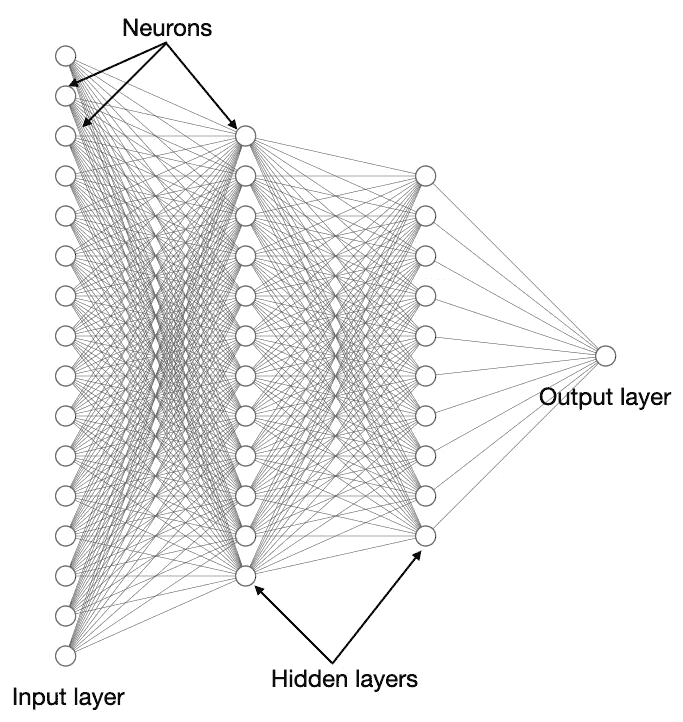

# 使用 fastai 实现深度学习 — 图像分类

> 原文：[`towardsdatascience.com/implementing-deep-learning-using-fastai-eff2fa05449e?source=collection_archive---------9-----------------------#2023-04-19`](https://towardsdatascience.com/implementing-deep-learning-using-fastai-eff2fa05449e?source=collection_archive---------9-----------------------#2023-04-19)

## 快速轻松地在深度学习领域取得初步进展，无需详细了解所有细节

 [魏梦玲](https://weimenglee.medium.com/?source=post_page-----eff2fa05449e--------------------------------)

·

[关注](https://medium.com/m/signin?actionUrl=https%3A%2F%2Fmedium.com%2F_%2Fsubscribe%2Fuser%2F6599e1e08a48&operation=register&redirect=https%3A%2F%2Ftowardsdatascience.com%2Fimplementing-deep-learning-using-fastai-eff2fa05449e&user=Wei-Meng+Lee&userId=6599e1e08a48&source=post_page-6599e1e08a48----eff2fa05449e---------------------post_header-----------) 发表在 [数据科学的前沿](https://towardsdatascience.com/?source=post_page-----eff2fa05449e--------------------------------) ·9 分钟阅读·2023 年 4 月 19 日

--

图片由 [NASA](https://unsplash.com/@nasa?utm_source=medium&utm_medium=referral) 提供，来源于 [Unsplash](https://unsplash.com/?utm_source=medium&utm_medium=referral)

近年来，人工智能（AI）受到了广泛关注，尤其是最近几个月，ChatGPT 的发布引起了热议。人工智能的基础技术之一是*深度学习*。深度学习是一种机器学习技术，通过使用神经网络来学习数据集中特征与标签之间的关系。一个神经网络通常如下所示：

所有图片均由作者提供

上面的每个圆圈称为*神经元*（或*节点*）。每个神经元都有一个称为**偏置**的值，并且每个神经元都相互连接。每个连接都有一个称为**权重**的值。最左边的神经元层是**输入层**（你在这里输入数据进行预测），而最右边的层称为**输出层**（预测结果在这里显示）。一个神经网络可以根据需要拥有任意多（或少）的隐藏层。

学习深度学习需要你了解一些基本概念：

+   什么是层、权重和偏置
