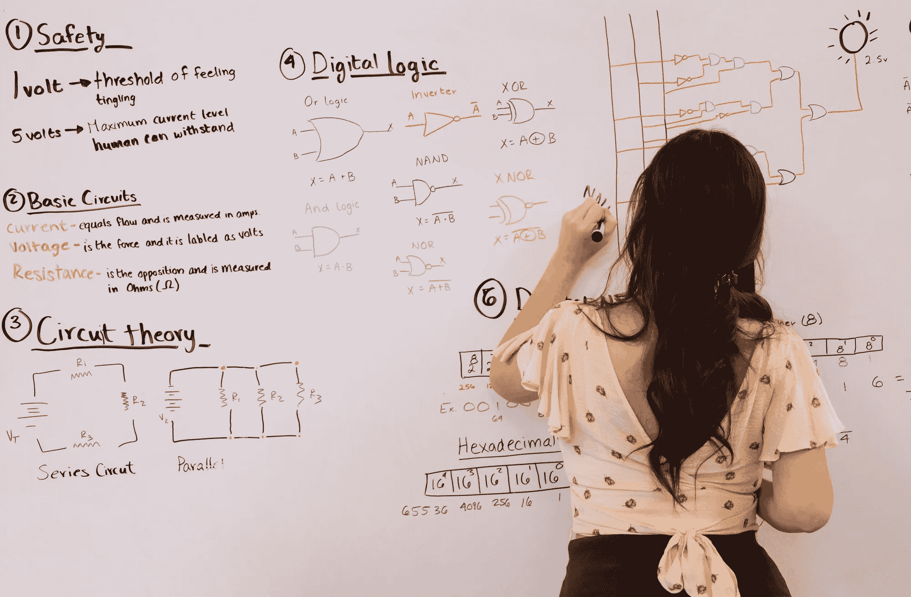
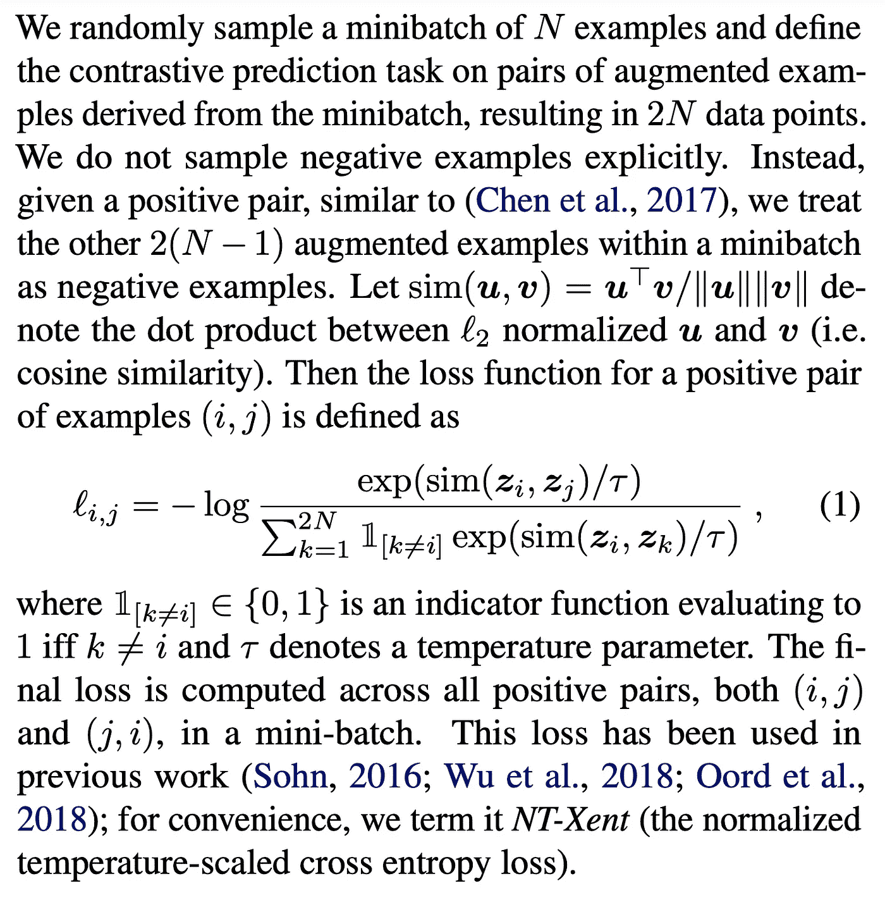
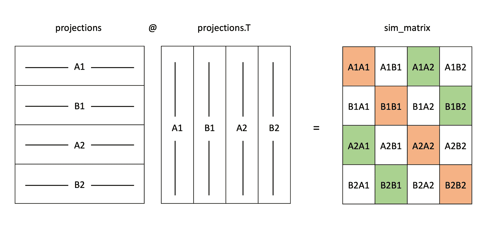

# 将深度学习论文中的数学公式转化为高效的 PyTorch 代码：SimCLR 对比损失

> 原文：[`towardsdatascience.com/implementing-math-in-deep-learning-papers-into-efficient-pytorch-code-simclr-contrastive-loss-be94e1f63473?source=collection_archive---------5-----------------------#2023-07-05`](https://towardsdatascience.com/implementing-math-in-deep-learning-papers-into-efficient-pytorch-code-simclr-contrastive-loss-be94e1f63473?source=collection_archive---------5-----------------------#2023-07-05)

## 学习如何将深度学习论文中的高级数学公式转化为高效的 PyTorch 代码，共分为三步。

 [Moein Shariatnia](https://medium.com/@moein.shariatnia?source=post_page-----be94e1f63473--------------------------------)

·

[关注](https://medium.com/m/signin?actionUrl=https%3A%2F%2Fmedium.com%2F_%2Fsubscribe%2Fuser%2F72d1b463ba60&operation=register&redirect=https%3A%2F%2Ftowardsdatascience.com%2Fimplementing-math-in-deep-learning-papers-into-efficient-pytorch-code-simclr-contrastive-loss-be94e1f63473&user=Moein+Shariatnia&userId=72d1b463ba60&source=post_page-72d1b463ba60----be94e1f63473---------------------post_header-----------) 发表在 [Towards Data Science](https://towardsdatascience.com/?source=post_page-----be94e1f63473--------------------------------) ·7 分钟阅读·2023 年 7 月 5 日

--

摄影：[Jeswin Thomas](https://unsplash.com/@jeswinthomas?utm_source=medium&utm_medium=referral) 由 [Unsplash](https://unsplash.com/?utm_source=medium&utm_medium=referral) 提供

## 介绍

加深对深度学习模型和损失函数背后数学理解的最佳方法之一，也是提高 PyTorch 技能的好方法，是自己动手实现深度学习论文。

书籍和博客帖子可以帮助你入门编程和学习机器学习/深度学习的基础知识，但在学习了几个相关资源并掌握了领域中的常规任务后，你会很快意识到在学习的过程中你只能依靠自己，并且你会发现大多数在线资源都很枯燥且过于浅薄。然而，我相信，如果你能在新深度学习论文发表时学习，并理解其中所需的数学部分（不一定要理解作者理论背后的所有数学证明），同时，你又是一个能够将其实现为高效代码的能干程序员，那么没有什么能阻止你在该领域保持最新并学习新思想。

## 对比损失的实现

我将介绍我的常规方法和实现数学在深度学习论文中的步骤，使用一个不简单的例子：在[SimCLR 论文](https://arxiv.org/pdf/2002.05709.pdf)中的**对比损失**。

这是损失的数学公式：

SimCLR 论文中的对比（NT-Xent）损失 | 来源于 [`arxiv.org/pdf/2002.05709.pdf`](https://arxiv.org/pdf/2002.05709.pdf)

我同意公式的外观可能会让人感到畏惧！你可能会想，GitHub 上一定有很多现成的 PyTorch 实现，所以我们就使用它们吧 :) 是的，你说得对。网上确实有很多实现。然而，我认为这是一个练习这种技能的好例子，也可以作为一个很好的起点。

## 将数学实现到代码中的步骤

我将数学实现到 PyTorch 高效代码中的常规方法如下：

1.  理解数学，将其用简单的术语解释

1.  使用简单的 Python **“for” 循环** 实现一个初始版本，现在不进行复杂的矩阵乘法

1.  将你的代码转换成**高效** **矩阵友好的** PyTorch 代码

好的，让我们直接进入第一步。

## 步骤 1：理解数学并用简单的术语解释

我假设你具备基本的线性代数知识并熟悉数学符号。如果没有，你可以使用[这个工具](https://detexify.kirelabs.org/classify.html)来了解这些符号的含义和功能，只需绘制符号即可。你还可以查看这个很棒的[维基百科页面](https://en.wikipedia.org/wiki/Glossary_of_mathematical_symbols)，其中描述了大多数符号。这些都是你在需要时学习新知识的机会。我认为这是一种更高效的学习方式，而不是从头开始阅读数学教科书，几天后就放在一边 :)

回到我们的主题。正如公式上方的段落增加了更多的背景，在 SimCLR 学习策略中，你从 N 张图像开始，将每张图像转换 2 次以获得这些图像的增强视图（现在有 2*N 张图像）。然后，你将这些 2 * N 张图像通过一个模型，得到每张图像的嵌入向量。现在，你希望使同一图像的 2 个增强视图（一个正样本对）的嵌入向量在嵌入空间中更接近（对所有其他正样本对也做同样的处理）。一种测量两个向量相似度（接近，相同方向）的方法是使用**余弦相似度**，它被定义为 sim(u, v)（请参见上图的定义）。

简而言之，公式描述的是，对于我们批次中的每个项目，即图像的一个增强视图的嵌入，（记住：批次包含不同图像的所有增强视图的嵌入→如果从 N 张图像开始，批次大小为 2*N），我们首先找到该图像的另一个增强视图的嵌入以形成一个正样本对。然后，我们计算这两个嵌入的余弦相似度并对其进行指数运算（公式的**分子**）。接着，我们计算与我们开始时的第一个嵌入向量构建的所有其他对的余弦相似度的指数运算（除了与自身的对，这就是公式中的 1[k!=i]的含义），并将它们相加以构建**分母**。现在，我们可以将分子除以分母，取自然对数并翻转符号！现在，我们得到了批次中第一个项目的损失。我们只需对批次中的所有其他项目重复相同的过程，然后取平均值，以便调用 PyTorch 的*.backward()*方法来计算梯度。

## 第 2 步：使用简单的 Python 代码实现，采用幼稚的“for”循环！

使用慢速“for”循环的简单 Python 实现

让我们看一下代码。假设我们有两张图像：A 和 B。变量 aug_views_1 保存了这两张图像的一个增强视图（A1 和 B1）的嵌入（每个大小为 3），与 aug_views_2（A2 和 B2）相同；因此，两个矩阵中的第一个项目与图像 A 相关，第二个项目与图像 B 相关。我们将这两个矩阵拼接成*projections*矩阵（其中包含 4 个向量：A1，B1，A2，B2）。

为了保持投影矩阵中向量的关系，我们定义了*pos_pairs*字典来存储在拼接矩阵中哪些两个项目是相关的。（稍后我会解释*F.normalize()*的事！）

正如你在接下来的代码行中看到的，我在一个***for*** 循环中遍历投影矩阵中的项，使用我们的字典找到相关向量，然后计算余弦相似度。你可能会想为什么不按照余弦相似度公式除以向量的大小。关键是，在开始循环之前，使用 F.normalize 函数，我将投影矩阵中的所有向量标准化为大小为 1。因此，在计算余弦相似度的那一行不需要除以大小。

在构建好分子后，我会找到批次中所有其他向量的索引（除了相同的索引 *i*），以计算包含分母的余弦相似度。最后，我通过将分子除以分母，并应用对数函数和翻转符号来计算损失。确保玩转代码以理解每一行的作用。

## 第 3 步：将其转换为高效的矩阵友好的 PyTorch 代码

之前的 Python 实现的问题是**太慢**，无法用于我们的训练流程；我们需要摆脱缓慢的“for”循环，并将其转换为矩阵乘法和数组操作，以利用并行化的优势。

PyTorch 实现

让我们看看这个代码片段发生了什么。这一次，我引入了 *labels_1* 和 *labels_2* 张量来编码这些图像所属的任意类别，因为我们需要一种方法来编码 A1、A2 和 B1、B2 图像之间的关系。你选择标签 0 和 1（就像我做的）还是 5 和 8 都无所谓。

在连接了所有的嵌入和标签后，我们首先创建一个包含**所有可能配对**的余弦相似度的 *sim_matrix*。

sim_matrix 的样子：绿色单元格包含我们的正样本对，橙色单元格是需要在分母中忽略的配对 | 作者提供的可视化

上面的可视化图是你理解代码如何工作的全部所需 :) 以及为什么我们要进行其中的步骤。考虑到 sim_matrix 的第一行，我们可以按如下方式计算批次中第一个项目 (A1) 的损失：我们需要将 A1A2（指数化）除以 A1B1、A1A2 和 A1B2（每个都先指数化）的总和，并将结果保存在存储所有损失的张量的第一个项目中。因此，我们需要首先制作一个掩码，以找到上面可视化图中的绿色单元格。代码中定义变量*mask*的两行正是做这件事。分子是通过将我们的 sim_matrix 乘以刚创建的掩码来计算的，然后对每行的项目求和（掩码后，每行将只有一个非零项目；即绿色单元格）。为了计算分母，我们需要在每行上求和，忽略对角线上的橙色单元格。为此，我们将使用 PyTorch 张量的*.diag()*方法。其余部分不言自明！

## 额外内容：使用 AI 助手（ChatGPT、Copilot 等）来实现公式

我们有很棒的工具可以帮助我们理解和实现深度学习论文中的数学。例如，你可以在给出论文中的公式后，要求 ChatGPT（或其他类似工具）用 PyTorch 实现代码。根据我的经验，如果你能在*python-for-loop*实现步骤中找到自己，ChatGPT 最能提供最好的最终答案，并减少试错次数。把那个初步实现交给 ChatGPT，要求它将其转换为仅使用矩阵乘法和张量操作的高效 PyTorch 代码；你会对答案感到惊讶 :)

## 进一步阅读

我鼓励你查看以下两个相同理念的优秀实现，以了解如何将这一实现扩展到更微妙的情况中，比如在**监督对比学习**设置中。

1.  [监督对比损失，由 Guillaume Erhard 编写](https://github.com/GuillaumeErhard/Supervised_contrastive_loss_pytorch/blob/main/loss/spc.py)

1.  [SupContrast，由 Yonglong Tian 编写](https://github.com/HobbitLong/SupContrast/blob/master/losses.py)

## 关于我

> 我是 Moein Shariatnia，一名机器学习开发者和医学学生，专注于使用深度学习解决方案进行医学影像应用。我的研究主要集中在研究深度模型在各种情况下的泛化能力。欢迎通过电子邮件、Twitter 或 LinkedIn 与我联系。
