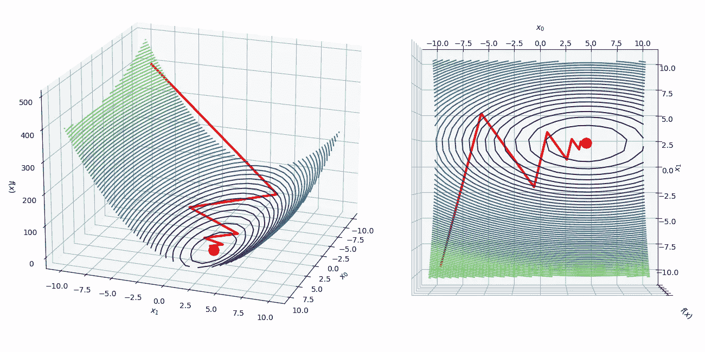

# 从头实现 Python 中的最速下降算法

> 原文：[`towardsdatascience.com/implementing-the-steepest-descent-algorithm-in-python-from-scratch-d32da2906fe2?source=collection_archive---------1-----------------------#2023-02-20`](https://towardsdatascience.com/implementing-the-steepest-descent-algorithm-in-python-from-scratch-d32da2906fe2?source=collection_archive---------1-----------------------#2023-02-20)

[](https://nicolo-albanese.medium.com/?source=post_page-----d32da2906fe2--------------------------------)[](https://towardsdatascience.com/?source=post_page-----d32da2906fe2--------------------------------) [Nicolo Cosimo Albanese](https://nicolo-albanese.medium.com/?source=post_page-----d32da2906fe2--------------------------------)

·

[关注](https://medium.com/m/signin?actionUrl=https%3A%2F%2Fmedium.com%2F_%2Fsubscribe%2Fuser%2F7430df412ec&operation=register&redirect=https%3A%2F%2Ftowardsdatascience.com%2Fimplementing-the-steepest-descent-algorithm-in-python-from-scratch-d32da2906fe2&user=Nicolo+Cosimo+Albanese&userId=7430df412ec&source=post_page-7430df412ec----d32da2906fe2---------------------post_header-----------) 发布于 [Towards Data Science](https://towardsdatascience.com/?source=post_page-----d32da2906fe2--------------------------------) ·11 分钟阅读·2023 年 2 月 20 日[](https://medium.com/m/signin?actionUrl=https%3A%2F%2Fmedium.com%2F_%2Fvote%2Ftowards-data-science%2Fd32da2906fe2&operation=register&redirect=https%3A%2F%2Ftowardsdatascience.com%2Fimplementing-the-steepest-descent-algorithm-in-python-from-scratch-d32da2906fe2&user=Nicolo+Cosimo+Albanese&userId=7430df412ec&source=-----d32da2906fe2---------------------clap_footer-----------)

--

[](https://medium.com/m/signin?actionUrl=https%3A%2F%2Fmedium.com%2F_%2Fbookmark%2Fp%2Fd32da2906fe2&operation=register&redirect=https%3A%2F%2Ftowardsdatascience.com%2Fimplementing-the-steepest-descent-algorithm-in-python-from-scratch-d32da2906fe2&source=-----d32da2906fe2---------------------bookmark_footer-----------)

作者提供的图像。

# 目录

1.  介绍

1.  最速下降算法

    2.1 搜索方向

    2.2 步长

    2.3 算法

1.  实现

    3.1 常数步长

    3.2 使用 Armijo 条件的线性搜索

1.  结论

# 1. 介绍

优化是寻找变量集合`x`以最小化或最大化目标函数`f(x)`的过程。由于最大化一个函数等同于最小化其负值，我们可以仅关注最小化问题：

对于我们的例子，让我们将一个二次多变量目标函数`f(x)`定义如下：

它的梯度`∇f(x)`是

```py
import numpy as np

def f(x):
    '''Objective function'''
    return 0.5*(x[0] - 4.5)**2 + 2.5*(x[1] - 2.3)**2

def df(x):
    '''Gradient of the objective function'''
    return np.array([x[0] - 4.5, 5*(x[1] - 2.3)])
```

可以利用流行的`[SciPy](https://scipy.org/)`库中的有用函数`[scipy.optimize.minimize](https://docs.scipy.org/doc/scipy/reference/generated/scipy.optimize.minimize.html)`来快速找到最优解：

```py
from scipy.optimize import minimize

result = minimize(
    f, np.zeros(2), method='trust-constr', jac=df)

result.x
```
