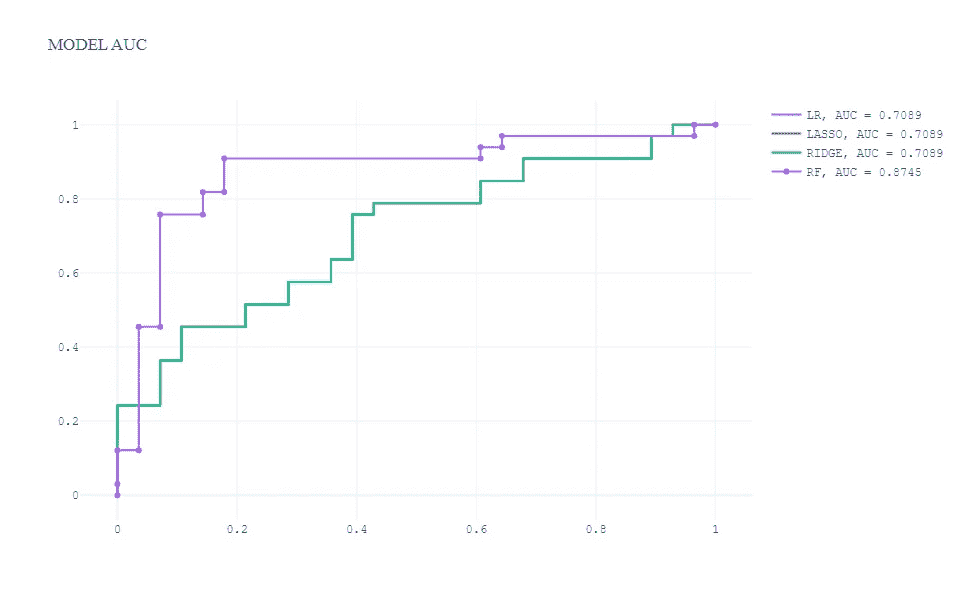
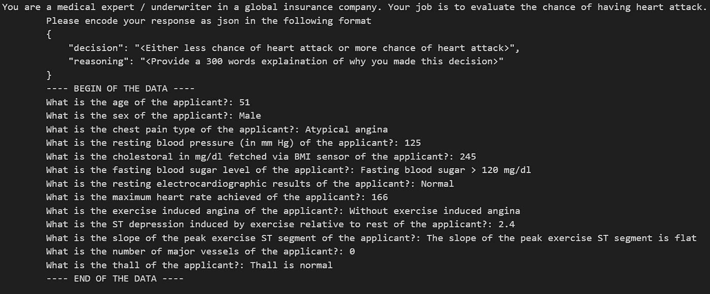
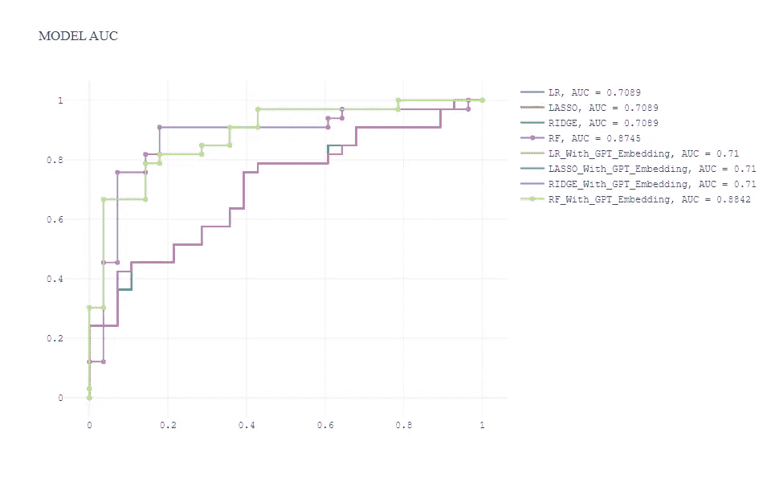

# 通过 OpenAI API 提升表格数据预测能力

> 原文：[`towardsdatascience.com/improve-tabular-data-prediction-with-large-language-model-through-openai-api-3eae3c5e52bc`](https://towardsdatascience.com/improve-tabular-data-prediction-with-large-language-model-through-openai-api-3eae3c5e52bc)

## 使用 Python 实现机器学习分类、提示工程、文本嵌入特征工程和 OpenAI API 的模型解释。

[](https://medium.com/@tonyzhangsky?source=post_page-----3eae3c5e52bc--------------------------------)[](https://towardsdatascience.com/?source=post_page-----3eae3c5e52bc--------------------------------) [Tony Zhang](https://medium.com/@tonyzhangsky?source=post_page-----3eae3c5e52bc--------------------------------)

·发表于 [Towards Data Science](https://towardsdatascience.com/?source=post_page-----3eae3c5e52bc--------------------------------) ·11 min read·2023 年 7 月 13 日

--


图片由 [Markus Spiske](https://unsplash.com/@markusspiske?utm_source=medium&utm_medium=referral) 提供，来源于 [Unsplash](https://unsplash.com/?utm_source=medium&utm_medium=referral)

现如今，大型语言模型及其应用或工具在新闻和社交媒体上频频出现。GitHub 的热门页面展示了大量广泛使用大型语言模型的代码库。我们见证了大型语言模型在营销写作、文档总结、音乐创作和软件开发代码生成方面的奇妙能力。

企业内部和在线积累了大量表格数据（这是最古老、最普遍的数据格式之一，可以通过行和列在表格中表示）。我们能否在传统的机器学习生命周期中应用大型语言模型，以提升模型性能并增加商业价值？

在这篇文章中，我们将探索以下主题，并提供完整的 Python 实现代码：

+   在 Kaggle 的 [心脏病分析与预测数据集](https://www.kaggle.com/datasets/rashikrahmanpritom/heart-attack-analysis-prediction-dataset) 上构建广义线性模型和树模型。

+   通过提示工程将表格数据转化为文本

+   使用 OpenAI API 进行零样本分类（GPT-3.5 模型：text-davinci-003）

+   使用 OpenAI 嵌入 API 提升机器学习模型性能— text-embedding-ada-002

+   使用 OpenAI API 进行预测解释— gpt-3.5-turbo

# 数据集描述

数据可在 Kaggle 网站上找到，许可证为 CC0 1.0 Universal（CC0 1.0）公共领域奉献，属于公共领域（你可以复制、修改、分发和执行这些工作，甚至用于商业目的）。请参考下面提到的链接：

[## 心脏病发作分析与预测数据集](https://www.kaggle.com/datasets/rashikrahmanpritom/heart-attack-analysis-prediction-dataset?source=post_page-----3eae3c5e52bc--------------------------------)

### 一个用于心脏病发作分类的数据集

[www.kaggle.com](https://www.kaggle.com/datasets/rashikrahmanpritom/heart-attack-analysis-prediction-dataset?source=post_page-----3eae3c5e52bc--------------------------------)

它包含人口统计特征、医疗条件和目标。各列解释如下：

+   age: 申请人的年龄

+   sex: 申请人的性别

+   cp: 胸痛类型：值 1 为典型心绞痛，值 2 为非典型心绞痛，值 3 为非心绞痛性疼痛，值 4 为无症状。

+   trtbps: 静息血压（以 mm Hg 为单位）

+   chol: 通过 BMI 传感器获取的胆固醇（以 mg/dl 为单位）

+   fbs: 空腹血糖 > 120 mg/dl，1 = 真，0 = 假

+   restecg: 静息心电图结果

+   thalachh: 达到的最大心率

+   exng: 运动诱发的心绞痛（1 = 是；0 = 否）

+   oldpeak: 之前的峰值

+   slp: 斜率

+   caa: 主要血管数量

+   thall: 心电图的斜率

+   output: 目标变量，0= 心脏病发作的可能性较低，1= 心脏病发作的可能性较高

# 机器学习模型

开发二分类模型来预测心脏病发作的可能性。本节将涵盖：

+   预处理：缺失值检查、独热编码、训练测试分层拆分等。

+   构建 4 个模型，包括三个广义线性模型和一个基于树的模型：逻辑回归、岭回归、套索回归和随机森林

+   模型评估与 AUC

首先，让我们导入包，加载数据，预处理并进行训练测试拆分。

```py
import warnings
warnings.filterwarnings("ignore")

# Math and Vectors
import pandas as pd
import numpy as np

# Visualizations
import plotly.express as px

# ML
from sklearn.model_selection import train_test_split
from sklearn.metrics import roc_auc_score
import concurrent.futures

# Utils functions
from utils import prediction, compile_prompt, get_embedding, ml_models, create_auc_chart, gpt_reasoning
pd.set_option('display.max_columns', None)

# load data
df = pd.read_csv("./data/raw data/heart_attack_predicton_kaggle.csv")
df.shape

# check missing value
df.isna().sum()

# check outcome distribution
df['output'].value_counts()

# one-hot encoding
cat_cols = ['sex','exng','cp','fbs','restecg','slp','thall']
df_model = pd.get_dummies(df,columns=cat_cols)
df_model.shape

# train test stratified split
# Seperate dependent and independent variables
X = df_model.drop(axis=1,columns=['output'])
y = df_model['output'].tolist()
X_tr, X_val, y_tr, y_val = train_test_split(X, y, test_size=0.2, random_state=101,
                                                stratify=y,shuffle=True)
```

现在，让我们构建模型对象，拟合模型，对测试集进行预测，并计算 AUC。

```py
## model function
def ml_models():
    lr = LogisticRegression(penalty='none', solver='saga', random_state=42, n_jobs=-1)
    lasso = LogisticRegression(penalty='l1', solver='saga', random_state=42, n_jobs=-1)
    ridge = LogisticRegression(penalty='l2', solver='saga', random_state=42, n_jobs=-1)
    rf = RandomForestClassifier(n_estimators=300, max_depth=5, min_samples_leaf=50, 
                                max_features=0.3, random_state=42, n_jobs=-1)
    models = {'LR': lr, 'LASSO': lasso, 'RIDGE': ridge, 'RF': rf}
    return models

models = ml_models()
lr = models['LR']
lasso = models['LASSO'] 
ridge = models['RIDGE'] 
rf = models['RF'] 

pred_dict = {}
for k, m in models.items():
    print(k)
    m.fit(X_tr, y_tr)
    preds = m.predict_proba(X_val)[:,1]
    auc = roc_auc_score(y_val, preds)
    pred_dict[k] = preds
    print(k + ': ', auc)
```

接下来，让我们可视化并比较模型性能（AUC）。



作者

在这个可视化中：

+   基于树的模型（随机森林）表现最佳，AUC 显著更高。

+   3 个广义线性模型的表现水平相似，AUC 低于基于树的模型，这是一种预期的结果。

# 使用 OpenAI API 进行零-shot 分类

我们将使用基于 text-davinci-003 模型的 OpenAI API 对表格数据进行零-shot 分类。在深入 Python 实现之前，让我们先了解一下零-shot 分类的更多信息。Hugging face 的[定义](https://huggingface.co/tasks/zero-shot-classification)是：

> 零样本分类是预测一个模型在训练过程中未见过的类别的任务。这种方法利用了预训练的语言模型，可以视为[迁移学习](https://www.youtube.com/watch?v=BqqfQnyjmgg)的一个实例，迁移学习通常指将一个任务上训练好的模型用于与其最初训练任务不同的应用。这对于标记数据量较少的情况尤其有用。

在零样本分类中，会提供一个提示和描述我们希望模型执行的任务的文本序列，并且没有任何预期行为的示例。本节将涵盖：

+   针对提示工程的表格数据预处理

+   提示 LLMs

+   使用 GPT-3.5 API 进行零样本预测：text-davinci-003

+   使用 AUC 评估模型

## 表格数据的预处理

首先，让我们在提示之前处理数据：

```py
df_gpt = df.copy()
df_gpt['sex'] = np.where(df_gpt['sex'] == 1, 'Male', 'Female')
df_gpt['cp'] = np.where(df_gpt['cp'] == 1, 'Typical angina', 
                       np.where(df_gpt['cp'] == 2, 'Atypical angina', 
                       np.where(df_gpt['cp'] == 3, 'Non-anginal pain', 'Asymptomatic')))
df_gpt['fbs'] = np.where(df_gpt['fbs'] == 1, 'Fasting blood sugar > 120 mg/dl', 'Fasting blood sugar <= 120 mg/dl')
df_gpt['restecg'] = np.where(df_gpt['restecg'] == 0, 'Normal', 
                       np.where(df_gpt['restecg'] == 1, 'Having ST-T wave abnormality (T wave inversions and/or ST elevation or depression of > 0.05 mV)', 
                                    "Showing probable or definite left ventricular hypertrophy by Estes' criteria"))
df_gpt['exng'] = np.where(df_gpt['exng'] == 1, 'Exercise induced angina', 'Without exercise induced angina')
df_gpt['slp'] = np.where(df_gpt['slp'] == 0, 'The slope of the peak exercise ST segment is downsloping', 
                       np.where(df_gpt['slp'] == 1, 'The slope of the peak exercise ST segment is flat', 
                                    'The slope of the peak exercise ST segment is upsloping'))
df_gpt['thall'] = np.where(df_gpt['thall'] == 1, 'Thall is fixed defect', 
                       np.where(df_gpt['thall'] == 2, 'Thall is normal', 'Thall is reversable defect'))

# test df to dict
application_list = X_val.to_dict(orient='records')
len(application_list)
```

## 提示 LLMs

提示是与大型语言模型进行特定任务交互的强大工具。提示是用户提供的输入，模型会对此作出回应。提示可以有多种形式，即文本、图像。

在本文中，提示包括带有预期 JSON 输出格式的指令和问题本身。以心脏病数据集为例，文本提示可以是：



作者

接下来，我们将定义提示和 API 调用函数，这些函数构建提示并从 OpenAI-3.5 API 获取响应。

```py
def prediction_GPT3_5(data, explain = False):
    if explain:
        prompt = prompt_logic(explain)
    else:    
        prompt = prompt_logic(explain)
    print(prompt)
    response = openai.Completion.create(
        model = 'text-davinci-003',
        prompt=prompt,
        max_tokens=64,
        n=1,
        stop=None,
        temperature=0.5,
        top_p=1.0,
        frequency_penalty=0.0,
        presence_penalty=0.0
    )

    try:
        output = response.choices[0].text.strip()
        output_dict = json.loads(output)
        return output_dict
    except (IndexError, ValueError):
        return None

def prediction(combined_data_argu):
    application_data, explain = combined_data_argu
    response = prediction_GPT3_5(application_data, explain)
    return response
```

## 获取 API 响应 — 多进程处理

多进程处理用于加速 API 调用。代码如下：

```py
### get prediction from GPT-3.5 model: text-davinci-003 - multiprocessing pool
with concurrent.futures.ThreadPoolExecutor() as executor:
    # Combine credit_data and explain into a single iterable
    combined_data = zip(application_list, [False] * len(application_list))
    # Submit the transaction processing tasks to the executor
    results = executor.map(prediction, combined_data)

    # Collect the responses into a list
    responses = list(results)
responses_df = pd.DataFrame(responses)
responses_df.shape
```

## 零样本分类 AUC

零样本分类的 AUC 为 0.48，这表明预测效果比随机机会更差，并且表明在这个数据集上，GPT-3.5 text-davinci-003 模型可能没有泄露。

```py
auc_gpt= roc_auc_score(y_val, responses_df['output'])
auc_gpt
```

# 使用 OpenAI 嵌入提升机器学习模型性能

LLM 嵌入是大型语言模型（即 OpenAI API）的一个端点，它使得执行自然语言和代码任务变得简单，例如语义搜索、聚类、主题建模和分类。通过提示工程，表格数据被转化为自然语言文本，这些文本可以用来生成嵌入。嵌入有潜力通过使传统机器学习模型更好地理解自然语言和在少量标记数据下适应上下文，从而提高其性能。简而言之，这在这个背景下是一种特征工程。

> 特征工程是将原始数据转换为更好地表示基础问题的特征的过程，从而提高模型在未见数据上的准确性。

在本节中，你将看到：

+   如何通过 API 调用获取 OpenAI 嵌入

+   模型性能比较 — 含嵌入特征与不含嵌入特征

首先，让我们定义一个通过 API 获取嵌入并与原始数据集合并的函数：

```py
# define function to fetch the embedding
def get_embedding(text, model="text-embedding-ada-002"):
   text = text.replace("\n", " ")
   return openai.Embedding.create(input = [text], model=model)['data'][0]['embedding']

# API call and merge with raw data
df_gpt['ada_embedding'] = df_gpt.combined.apply(lambda x: get_embedding(x, model='text-embedding-ada-002'))
df_gpt = df_gpt.join(pd.DataFrame(df_gpt['ada_embedding'].apply(pd.Series)))
df_gpt.drop(['combined', 'ada_embedding'], axis = 1, inplace = True)
df_gpt.columns = df_gpt.columns.tolist()[:14] + ['Embedding_' + str(i) for i in df_gpt.columns.tolist()[14:]]
df = pd.concat([df, df_gpt[[i for i in df_gpt.columns.tolist() if i.startswith('Embedding_')]]], axis=1)
df_gpt.shape
```

类似于纯机器学习模型，我们也将进行分层拆分并拟合模型：

```py
# Seperate dependent and independent variables
X = df.drop(axis=1,columns=['output'])
y = df['output'].tolist()

X_tr, X_val, y_tr, y_val = train_test_split(X, y, test_size=0.2, random_state=101,
                                                stratify=y,shuffle=True)
models = ml_models()
lr = models['LR']
lasso = models['LASSO'] 
ridge = models['RIDGE'] 
rf = models['RF'] 
pred_dict_gpt = {}
for k, m in models.items():
    print(k)
    m.fit(X_tr, y_tr)
    preds = m.predict_proba(X_val)[:,1]
    auc = roc_auc_score(y_val, preds)
    pred_dict_gpt[k + '_With_GPT_Embedding'] = preds
    print(k + '_With_GPT_Embedding' + ': ', auc)
```

## 模型性能比较——有与没有嵌入特征

通过结合没有嵌入特征的模型，我们总共有 8 个模型。测试集上的 ROC 曲线如下：

```py
pred_dict_combine = dict(list(pred_dict.items()) + list(pred_dict_gpt.items()))
create_auc_chart(pred_dict_combine, y_val, 'Model AUC')
```



作者

通常，我们观察到：

+   嵌入特征并没有显著提高广义线性模型的性能（逻辑回归、岭回归和套索回归）

+   带有嵌入特征的随机森林模型表现最佳，比没有嵌入特征的随机森林模型稍好。

我们看到大型语言模型在传统模型训练过程中的潜力，并能提高输出质量。我们可能会有一个问题：大型语言模型能否帮助解释模型决策？让我们在下一节中探讨这个问题。

# 使用 OpenAI API 的模型可解释性——gpt-3.5-turbo

模型可解释性是机器学习应用中的关键话题之一，尤其是在保险、医疗、金融和法律等领域，用户需要理解模型如何在局部和全局层面做出决策。如果你想了解更多关于深度学习模型解释的内容，我写了一篇相关文章：深度学习模型解释使用 SHAP。

本节内容包括：

+   为 OpenAI API 准备输入

+   通过 gpt-3.5-turbo 模型获取推理

首先，让我们准备 API 调用的输入。

```py
application_data = application_list[0]
application_data

{'age': 51,
 'sex': 'Male',
 'cp': 'Atypical angina',
 'trtbps': 125,
 'chol': 245,
 'fbs': 'Fasting blood sugar > 120 mg/dl',
 'restecg': 'Normal',
 'thalachh': 166,
 'exng': 'Without exercise induced angina',
 'oldpeak': 2.4,
 'slp': 'The slope of the peak exercise ST segment is flat',
 'caa': 0,
 'thall': 'Thall is normal'}
```

接下来，让我们通过调用 gpt-3.5-turbo API 来获取推理结果。

```py
message_objects = [
        {"role": "system", "content": '''You are a medical expert / underwriter in a global insurance company. Your job is to evaluate the chance of having heart attack. Please encode your response as json in the following format
        {{
            "decision": "<Either less chance of heart attack or more chance of heart attack>",
        }}'''},
        {"role": "user", "content": prompt},
    ]

completion = openai.ChatCompletion.create(
        model="gpt-3.5-turbo",
        messages=message_objects,
        max_tokens=1000,  # Adjust the max_tokens as per your desired response length
        stop=None,  # Set custom stop conditions if required
    )

# Extract the response message content
    response_content = completion.choices[0].message["content"]
```

响应相当令人印象深刻，且大型语言模型展示了强大的推理能力和合理的解释。

> { “**决定**”: “心脏病发作的可能性较小”, “**推理**”: “根据提供的信息，申请人有几个因素表明其心脏病发作的可能性较低。首先，申请人的年龄为 51 岁，这虽然不算年轻，但也不在高风险范围内。其次，申请人是男性。虽然男性通常比女性心脏病的风险更高，但这并不是唯一的决定性因素。第三，申请人报告的胸痛类型是非典型心绞痛。**非典型心绞痛的特点是胸痛不那么可预测，可能有不同的模式，相比于典型心绞痛**。这可能表明心脏病发作的风险较低。第四，申请人的静息血压为 125 mm Hg。**这在正常范围内，并不表明高血压，高血压是心脏病发作的一个风险因素**。第五，申请人的胆固醇水平为 245 mg/dl。**虽然这高于推荐水平，但并不是极高的水平，而且申请人的 BMI 没有提供，因此无法确定胆固醇水平是否因肥胖而高**。第六，申请人的空腹血糖水平不超过 120 mg/dl，这表明糖尿病的风险较低，糖尿病是心脏病发作的另一个风险因素。第七，申请人的静息心电图结果正常，这表明心脏功能正常，降低了心脏病发作的风险。**第八，申请人达到的最大心率为 166，这是一个好迹象，表明心血管系统更健康**。第九，申请人没有出现运动诱发的心绞痛，这是另一个积极因素。第十，运动相对于静息的 ST 段压低为 2.4，这在正常范围内，并不表明显著的缺血。**第十一，峰值运动 ST 段的斜率为平坦，这可能是正常发现，也可能与申请人报告的非典型心绞痛有关**。最后，申请人没有主要血管问题，Thall 正常，表明冠状动脉疾病的风险较低。**考虑到所有这些因素，申请人心脏病发作的可能性较低**。然而，重要的是要注意，这一评估仅基于提供的信息，可能还需要进一步的医学评估以作出最终判断。” }

# 摘要

大型语言模型是解决各行业广泛用例的强大工具。创建 LLM 应用变得更加容易且日益实惠。LLM 必将为企业带来真正的商业价值。

# 让我们保持联系……

*我欢迎你* ***加入我，共同踏上激动人心且富有成效的数据科学学习冒险之旅****！* 通过* ***关注我的*** [***Medium***](https://medium.com/@tonyzhangsky)*页面，获取源源不断的迷人数据科学内容。我将在接下来的几个月中分享更多机器学习基础、自然语言处理基础以及端到端数据科学实现的内容。干杯！*

# 参考资料

+   [`platform.openai.com/docs/guides/embeddings/what-are-embeddings`](https://platform.openai.com/docs/guides/embeddings/what-are-embeddings)

+   [`platform.openai.com/docs/models/overview`](https://platform.openai.com/docs/models/overview)

[](https://huggingface.co/tasks/zero-shot-classification?source=post_page-----3eae3c5e52bc--------------------------------) [## 什么是零样本分类？ - Hugging Face

### 了解使用机器学习的零样本分类

huggingface.co](https://huggingface.co/tasks/zero-shot-classification?source=post_page-----3eae3c5e52bc--------------------------------) [](https://developer.nvidia.com/blog/an-introduction-to-large-language-models-prompt-engineering-and-p-tuning/?source=post_page-----3eae3c5e52bc--------------------------------) [## 大型语言模型简介：提示工程与 P-Tuning | NVIDIA 技术博客

### ChatGPT 给人留下了深刻的印象。用户们兴奋地使用这款 AI 聊天机器人提问、写诗、赋予……

developer.nvidia.com](https://developer.nvidia.com/blog/an-introduction-to-large-language-models-prompt-engineering-and-p-tuning/?source=post_page-----3eae3c5e52bc--------------------------------) [](/deep-learning-model-interpretation-using-shap-a21786e91d16?source=post_page-----3eae3c5e52bc--------------------------------) ## 使用 SHAP 进行深度学习模型解释

### 图像和表格数据的 Python 实现

towardsdatascience.com
