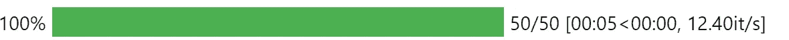
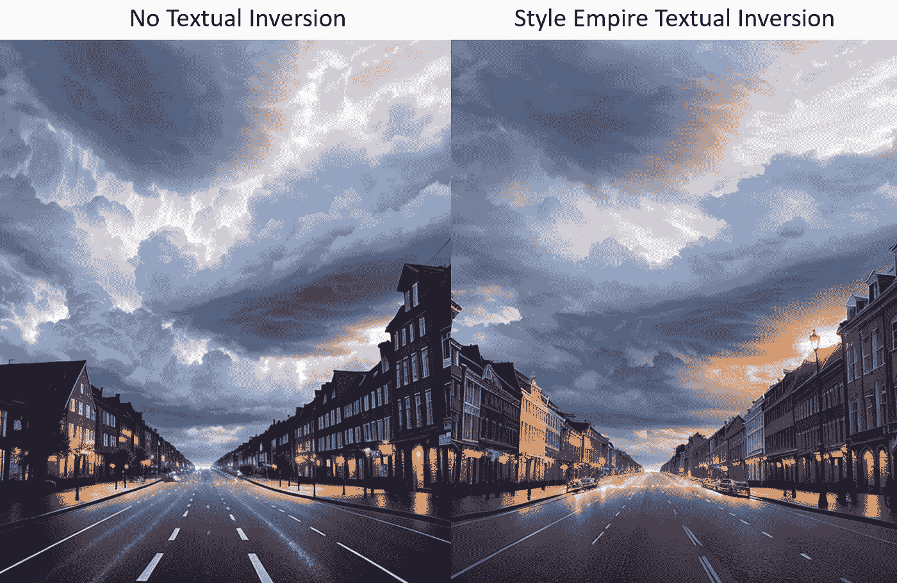
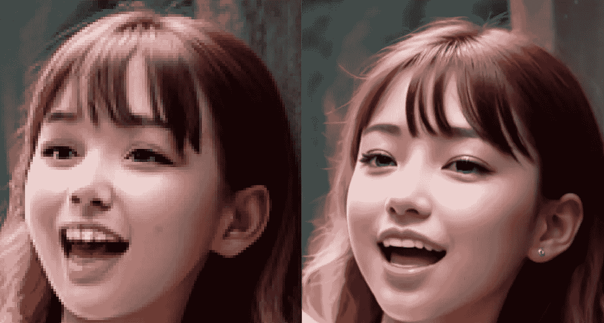
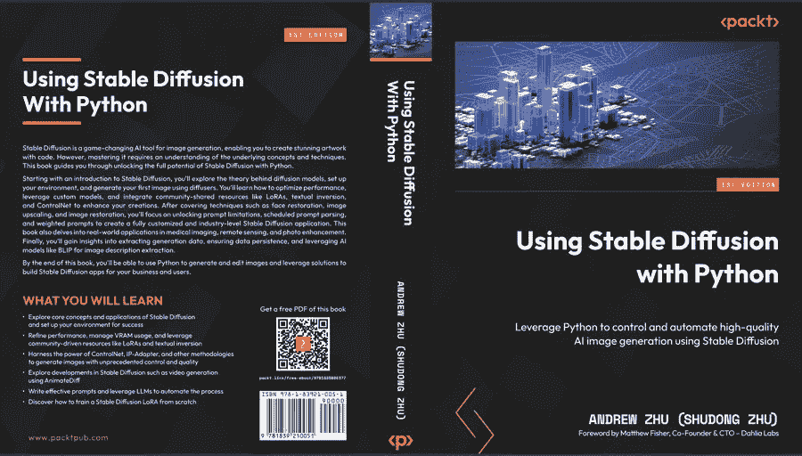

# 改进 Diffusers 包以生成高质量图像

> 原文：[`towardsdatascience.com/improving-diffusers-package-for-high-quality-image-generation-a50fff04bdd4`](https://towardsdatascience.com/improving-diffusers-package-for-high-quality-image-generation-a50fff04bdd4)

## 克服 token 大小限制、自定义模型加载、LoRa 支持、文本反转支持等

[](https://xhinker.medium.com/?source=post_page-----a50fff04bdd4--------------------------------)[](https://towardsdatascience.com/?source=post_page-----a50fff04bdd4--------------------------------) [Andrew Zhu (Shudong Zhu)](https://xhinker.medium.com/?source=post_page-----a50fff04bdd4--------------------------------)

·发布在 [Towards Data Science](https://towardsdatascience.com/?source=post_page-----a50fff04bdd4--------------------------------) ·15 分钟阅读·2023 年 4 月 5 日

--


再见 Babel，由 Andrew Zhu 使用纯 Python 中的 Diffusers 生成

[AUTOMATIC1111 的 Stable Diffusion WebUI](https://github.com/AUTOMATIC1111/stable-diffusion-webui) 已被证明是一个强大的工具，可以使用 Diffusion 模型生成高质量图像。然而，尽管 WebUI 使用简单，数据科学家、机器学习工程师和研究人员通常需要对图像生成过程有更多控制。这时，来自 huggingface 的 [diffusers](https://github.com/huggingface/diffusers) 包就派上了用场，它提供了一种在 Python 中运行 Diffusion 模型的方法，并允许用户自定义模型和提示，以生成符合他们具体需求的图像。

尽管具有潜力，Diffusers 包仍有几个限制，阻碍了它生成与 Stable Diffusion WebUI 相媲美的图像。这些限制中最显著的包括：

+   无法使用 `.safetensor` 文件格式中的自定义模型；

+   77 个提示 token 的限制；

+   缺乏 LoRA 支持；

+   以及缺少图像放大功能（在 Stable Diffusion WebUI 中也称为 HighRes）；

+   默认情况下性能低且 VRAM 使用高。

本文旨在解决这些限制，并使 Diffusers 包能够生成与 Stable Diffusion WebUI 产生的图像相媲美的高质量图像。通过提供的增强解决方案，数据科学家、机器学习工程师和研究人员可以在图像生成过程中享有更大的控制和灵活性，同时实现卓越的结果。在接下来的部分中，我们将探讨各种策略和技术，这些策略和技术可以用来克服这些限制，并释放 Diffusers 包的全部潜力。

请注意，如果这是你第一次运行 Stable Diffusion，请按照此[链接](https://huggingface.co/docs/diffusers/installation?source=post_page-----a50fff04bdd4--------------------------------)安装所有所需的 CUDA 和 Python 包。

[## 安装](https://huggingface.co/docs/diffusers/installation?source=post_page-----a50fff04bdd4--------------------------------)

### 为你正在使用的深度学习库安装🤗 Diffusers。🤗 Diffusers 已在 Python 3.7+上测试过…

[huggingface.co](https://huggingface.co/docs/diffusers/installation?source=post_page-----a50fff04bdd4--------------------------------)

## 1\. 加载本地的.safetensor 格式模型文件

用户可以轻松启动 diffusers 来生成这样的图像：

```py
from diffusers import DiffusionPipeline
pipeline = DiffusionPipeline.from_pretrained("runwayml/stable-diffusion-v1-5")
pipeline.to("cuda")
image = pipeline("A cute cat playing piano").images[0]
image.save("image_of_cat_playing_piano.png")
```

你可能对输出的图像或性能不满意。让我们逐个解决这些问题。首先，让我们加载一个`.safetensor`格式的自定义模型，该模型位于你计算机上的任何位置。你**不能**像这样直接加载模型文件：

```py
pipeline = DiffusionPipeline.from_pretrained("/model/custom_model.safetensors")
```

这里是将`.safetensor`文件转换为 diffusers 格式的详细步骤：

**步骤 1**。从 GitHub 拉取所有 diffusers 代码

```py
git clone https://github.com/huggingface/diffusers.git
```

**步骤 2**。在`script`文件夹下找到[文件](https://github.com/huggingface/diffusers/blob/main/scripts/convert_original_stable_diffusion_to_diffusers.py)：`convert_original_stable_diffusion_to_diffusers.py`

在终端中运行此命令将`.safetensor`文件转换为 Diffusers 格式。记得将`— checkpoint_path`值更改为你的情况。

```py
python convert_original_stable_diffusion_to_diffusers.py --from_safetensors --checkpoint_path="D:\stable-diffusion-webui\models\Stable-diffusion\deliberate_v2.safetensors" --dump_path='D:\sd_models\deliberate_v2' --device='cuda:0'
```

**步骤 3**。现在你可以使用新转换的模型文件加载管道，下面是完整代码：

```py
from diffusers import DiffusionPipeline
pipeline = DiffusionPipeline.from_pretrained(
    r"D:\sd_models\deliberate_v2"
)
pipeline.to("cuda")
image = pipeline("A cute cat playing piano").images[0]
image.save("image_of_cat_playing_piano.png")
```

你应该能够转换并使用你从 huggingface 或 civitai.com 下载的任何模型。


由上述代码生成的弹钢琴的猫

## 2\. 提升 Diffusers 的性能

生成高质量图像可能是一个耗时的过程，即使对于最新的 3xxx 和 4xxx Nvidia RTX GPU 也是如此。默认情况下，Diffuers 包的设置是未优化的。可以应用两种解决方案来大幅提升性能。

在应用以下解决方案之前的交互速度如下：在 RTX 3070 TI 8G RAM 中生成一个 512x512 图像的速度大约为每秒 2.x 次迭代。


+   **使用半精度权重**

第一个解决方案是使用半精度权重。半精度权重使用 16 位浮点数代替传统的 32 位浮点数。这减少了存储权重所需的内存，并加快了计算速度，这可以显著提高 Diffusers 包的性能。

根据这个[视频](https://www.youtube.com/watch?v=9tpLJpqxdE8&ab_channel=NVIDIADeveloper)，将浮点精度从 FP32 减少到 FP16 也会启用 Tensor Cores。

我还有另一篇文章来测试 GPU Tensor Cores 能多快提升计算速度。

[](/how-fast-gpu-computation-can-be-41e8cff75974?source=post_page-----a50fff04bdd4--------------------------------) ## GPU 计算能有多快

### CPU 和 GPU 在 Python 和 PyTorch 中进行矩阵运算比较

[towardsdatascience.com

这里是如何在 diffusers 中启用 FP16，只需添加两行代码即可将性能提升 500%，几乎没有图像质量影响。

```py
from diffusers import DiffusionPipeline
import torch # <----- Line 1 added
pipeline = DiffusionPipeline.from_pretrained(
    r"D:\sd_models\deliberate_v2"
    ,torch_dtype        = torch.float16 # <----- Line 2 Added
)
pipeline.to("cuda")
image = pipeline("A cute cat playing piano").images[0]
image.save("image_of_cat_playing_piano.png")
```

现在迭代速度提升至每秒 10.x 次，**快了 5 倍**。


+   **使用 Xformers**

[Xformers](https://github.com/facebookresearch/xformers)是一个开源库，提供了一组高性能的变换器，适用于各种自然语言处理（NLP）任务。它基于 PyTorch 构建，旨在提供高效且可扩展的变换器模型，这些模型可以轻松集成到现有的 NLP 流程中。（如今，还有哪些模型不使用 Transformer？:P）

使用`pip install xformers`安装 Xformers，然后我们只需一行代码即可轻松切换 diffusers 使用 xformers。

```py
...
pipeline.to("cuda")
pipeline.enable_xformers_memory_efficient_attention()  <--- one line added
...
```

这一行代码性能提升了另外 20%。



## 3\. 移除 77 个提示符的限制

在当前版本的 Diffusers 中，生成图像时有 77 个提示符的限制。

幸运的是，针对这个问题有一个解决方案。通过使用社区提供的“`lpw_stable_diffusion`”管道，你可以解锁 77 个提示符的限制，并生成高质量的长提示图像。

要使用“`lpw_stable_diffusion`”管道，可以使用以下代码：

```py
pipeline = DiffusionPipeline.from_pretrained(
    model_path,
    custom_pipeline="lpw_stable_diffusion",  #<--- code added
    torch_dtype=torch.float16
)
```

在这段代码中，我们使用“`from_pretrained`”方法初始化一个新的 DiffusionPipeline 对象。我们指定了预训练模型的路径，并将“`custom_pipeline`”参数设置为“`lpw_stable_diffusion`”。这告诉 Diffusers 使用“`lpw_stable_diffusion`”管道，从而解锁 77 个提示符的限制。

现在，让我们使用一个长提示字符串来测试一下。以下是完整的代码：

```py
from diffusers import DiffusionPipeline
import torch
pipeline = DiffusionPipeline.from_pretrained(
    r"D:\sd_models\deliberate_v2"
    ,custom_pipeline = "lpw_stable_diffusion"  #<--- code added
    ,torch_dtype        = torch.float16
)
pipeline.to("cuda")
pipeline.enable_xformers_memory_efficient_attention()
prompt = """
Babel tower falling down, walking on the starlight, dreamy ultra wide shot
, atmospheric, hyper realistic, epic composition, cinematic, octane render
, artstation landscape vista photography by Carr Clifton & Galen Rowell, 16K resolution
, Landscape veduta photo by Dustin Lefevre & tdraw, detailed landscape painting by Ivan Shishkin
, DeviantArt, Flickr, rendered in Enscape, Miyazaki, Nausicaa Ghibli, Breath of The Wild
, 4k detailed post processing, artstation, rendering by octane, unreal engine
"""
image = pipeline(prompt).images[0]
image.save("goodbye_babel_tower.png")
```

你将获得如下图像：


Goodby Babel，由 Andrew Zhu 使用 diffusers 生成

如果你仍然看到类似的警告信息：`Token indices sequence length is longer than the specified maximum sequence length for this model ( *** > 77 ) . Running this sequence through the model will result in indexing errors.` 这很正常，你可以忽略它。

## 4\. 使用自定义 LoRA 与扩散器

尽管 [LoRA 支持](https://huggingface.co/docs/diffusers/training/lora) 在 Diffusers 中有所声称，但用户在加载本地 `.safetensor` 文件格式的 LoRA 文件时仍面临限制。这对用户使用社区 LoRA 可能是一个重大障碍。

为了克服这一限制，我创建了一个允许用户实时加载带有权重的 LoRA 文件的函数。这个函数可以用来将 LoRA 文件及其对应的权重加载到 Diffusers 模型中，从而生成高质量的 LoRA 数据图像。

这是函数主体：

```py
from safetensors.torch import load_file
def __load_lora(
    pipeline
    ,lora_path
    ,lora_weight=0.5
):
    state_dict = load_file(lora_path)
    LORA_PREFIX_UNET = 'lora_unet'
    LORA_PREFIX_TEXT_ENCODER = 'lora_te'

    alpha = lora_weight
    visited = []

    # directly update weight in diffusers model
    for key in state_dict:

        # as we have set the alpha beforehand, so just skip
        if '.alpha' in key or key in visited:
            continue

        if 'text' in key:
            layer_infos = key.split('.')[0].split(LORA_PREFIX_TEXT_ENCODER+'_')[-1].split('_')
            curr_layer = pipeline.text_encoder
        else:
            layer_infos = key.split('.')[0].split(LORA_PREFIX_UNET+'_')[-1].split('_')
            curr_layer = pipeline.unet

        # find the target layer
        temp_name = layer_infos.pop(0)
        while len(layer_infos) > -1:
            try:
                curr_layer = curr_layer.__getattr__(temp_name)
                if len(layer_infos) > 0:
                    temp_name = layer_infos.pop(0)
                elif len(layer_infos) == 0:
                    break
            except Exception:
                if len(temp_name) > 0:
                    temp_name += '_'+layer_infos.pop(0)
                else:
                    temp_name = layer_infos.pop(0)

        # org_forward(x) + lora_up(lora_down(x)) * multiplier
        pair_keys = []
        if 'lora_down' in key:
            pair_keys.append(key.replace('lora_down', 'lora_up'))
            pair_keys.append(key)
        else:
            pair_keys.append(key)
            pair_keys.append(key.replace('lora_up', 'lora_down'))

        # update weight
        if len(state_dict[pair_keys[0]].shape) == 4:
            weight_up = state_dict[pair_keys[0]].squeeze(3).squeeze(2).to(torch.float32)
            weight_down = state_dict[pair_keys[1]].squeeze(3).squeeze(2).to(torch.float32)
            curr_layer.weight.data += alpha * torch.mm(weight_up, weight_down).unsqueeze(2).unsqueeze(3)
        else:
            weight_up = state_dict[pair_keys[0]].to(torch.float32)
            weight_down = state_dict[pair_keys[1]].to(torch.float32)
            curr_layer.weight.data += alpha * torch.mm(weight_up, weight_down)

        # update visited list
        for item in pair_keys:
            visited.append(item)

    return pipeline
```

逻辑提取自 diffusers git 仓库的 [convert_lora_safetensor_to_diffusers.py](https://github.com/huggingface/diffusers/blob/main/scripts/convert_lora_safetensor_to_diffusers.py)。

以著名的 [LoRA:MoXin](https://civitai.com/models/12597/moxin) 为例。你可以像这样使用 `__load_lora` 函数：

```py
from diffusers import DiffusionPipeline
import torch
pipeline = DiffusionPipeline.from_pretrained(
    r"D:\sd_models\deliberate_v2"
    ,custom_pipeline = "lpw_stable_diffusion"  
    ,torch_dtype        = torch.float16
)
lora = (r"D:\sd_models\Lora\Moxin_10.safetensors",0.8)
pipeline = __load_lora(pipeline=pipeline,lora_path=lora[0],lora_weight=lora[1])
pipeline.to("cuda")
pipeline.enable_xformers_memory_efficient_attention()

prompt = """
shukezouma,negative space,shuimobysim 
a branch of flower, traditional chinese ink painting
"""
image = pipeline(prompt).images[0]
image.save("a branch of flower.png")
```

提示将生成类似这样的图像：


一枝花，由 Andrew Zhu 使用扩散器生成

你可以多次调用`__load_lora()`来为一次生成加载多个 LoRA。

使用此功能，你现在可以实时加载带有权重的 LoRA 文件，并用它们生成高质量的图像。LoRA 加载速度非常快，通常只需 1-2 秒，比转换和使用（这会生成一个 GB 大小的模型文件）要好得多。

## 5\. 使用自定义纹理反演与扩散器

使用 Diffusers 包中的自定义纹理反演是一种生成高质量图像的强大方法。然而，[Diffusers 的官方文档](https://huggingface.co/docs/diffusers/training/text_inversion) 提到，用户需要训练自己的文本反演，这可能需要在 V100 GPU 上花费一个小时。这对于许多希望快速生成图像的用户来说可能不切实际。

因此，我进行了调查并找到了一个解决方案，使扩散器能够像在 Stable Diffusion WebUI 中一样使用文本反演。以下是我创建的用于加载自定义文本反演的函数。

```py
def load_textual_inversion(
    learned_embeds_path
    , text_encoder
    , tokenizer
    , token = None
    , weight = 0.5
):
    '''
    Use this function to load textual inversion model in model initilization stage 
    or image generation stage. 
    '''
    loaded_learned_embeds = torch.load(learned_embeds_path, map_location="cpu")
    string_to_token = loaded_learned_embeds['string_to_token']
    string_to_param = loaded_learned_embeds['string_to_param']

    # separate token and the embeds
    trained_token = list(string_to_token.keys())[0]
    embeds = string_to_param[trained_token]
    embeds = embeds[0] * weight

    # cast to dtype of text_encoder
    dtype = text_encoder.get_input_embeddings().weight.dtype
    embeds.to(dtype)

    # add the token in tokenizer
    token = token if token is not None else trained_token
    num_added_tokens = tokenizer.add_tokens(token)
    if num_added_tokens == 0:
        #print(f"The tokenizer already contains the token {token}.The new token will replace the previous one")
        raise ValueError(f"The tokenizer already contains the token {token}. Please pass a different `token` that is not already in the tokenizer.")

    # resize the token embeddings
    text_encoder.resize_token_embeddings(len(tokenizer))

    # get the id for the token and assign the embeds
    token_id = tokenizer.convert_tokens_to_ids(token)
    text_encoder.get_input_embeddings().weight.data[token_id] = embeds
    return (tokenizer,text_encoder)
```

在 `load_textual_inversion()` 函数中，你需要提供以下参数：

+   `learned_embeds_path`：预训练文本反演模型文件的路径，格式为 .pt 或 .bin。

+   `text_encoder`：从扩散管道获得的文本编码器对象。

+   `tokenizer`：从扩散管道获得的分词器对象。

+   `token`：可选参数，指定提示词令牌。默认设置为 None。它是会在提示中触发文本反演的关键词。

+   `weight`: 可选参数，指定文本反演的权重。默认情况下，我将其设置为 0.5，你可以根据需要更改为其他值。

你现在可以使用类似这样的 diffusers 管道功能：

```py
from diffusers import DiffusionPipeline
import torch
pipeline = DiffusionPipeline.from_pretrained(
    r"D:\sd_models\deliberate_v2"
    ,custom_pipeline = "lpw_stable_diffusion"  
    ,torch_dtype        = torch.float16
    ,safety_checker     = None
)

textual_inversion_path = r"D:\sd_models\embeddings\style-empire.pt"

tokenizer       = pipeline.tokenizer
text_encoder    = pipeline.text_encoder 
load_textual_inversion(
    learned_embeds_path     = textual_inversion_path
    , tokenizer             = tokenizer
    , text_encoder          = text_encoder
    , token                 = 'styleempire'
)

pipeline.to("cuda")
pipeline.enable_xformers_memory_efficient_attention()

prompt = """
styleempire,award winning beautiful street, storm,((dark storm clouds))
, fluffy clouds in the sky, shaded flat illustration, digital art
, trending on artstation, highly detailed, fine detail, intricate
, ((lens flare)), (backlighting), (bloom)
"""
neg_prompt = """
 cartoon, 3d, ((disfigured)), ((bad art)), ((deformed)), ((poorly drawn))
 , ((extra limbs)), ((close up)), ((b&w)), weird colors, blurry
 , hat, cap, glasses, sunglasses, lightning, face
"""

generator = torch.Generator("cuda").manual_seed(1)
image = pipeline(
    prompt
    ,negative_prompt =neg_prompt
    ,generator       = generator
).images[0]
image.save("tv_test.png")
```

这是应用[帝国风格](https://civitai.com/models/2032/empire-style)文本反演的结果。



左边的现代街道变成了旧伦敦风格。

## 6\. 放大图像

Diffusers 包非常适合生成高质量图像，但图像放大不是其主要功能。然而，Stable-Diffusion-WebUI 提供了一个名为 HighRes 的功能，允许用户将生成的图像放大到 2 倍或 4 倍。如果 Diffusers 用户也能享受相同的功能，那就太好了。经过一些研究和测试，我发现 SwinRI 模型是图像放大的优秀选择，可以轻松将图像放大到 2 倍或 4 倍。

要使用 SwinRI 模型进行图像放大，我们可以使用[JingyunLiang/SwinIR](https://github.com/JingyunLiang/SwinIR)的 GitHub 存储库中的代码。如果你只需要代码，下载`models/network_swinir.py`，`utils/util_calculate_psnr_ssim.py`和`main_test_swinir.py`即可。按照 readme 指南，你可以像魔法一样放大图像。

这是 SwinRI 如何出色放大图像的一个示例。


左侧：原始图像，右侧：4 倍 SwinRI 放大图像

许多其他开源解决方案可以用来改善图像质量。这里列出了我尝试过的另外三种返回优秀结果的模型。

+   **RealSR**: [`github.com/jixiaozhong/RealSR`](https://github.com/jixiaozhong/RealSR)

RealSR 可以将图像放大 4 倍，几乎与 SwinRI 一样好，并且执行性能最快，不需要调用 PyTorch 和 CUDA。作者将代码和 CUDA 使用直接编译为二进制文件。我的观察发现，RealSR 可以在大约 2–4 秒内放大图像。

+   **CodeFormer**: [`github.com/sczhou/CodeFormer`](https://github.com/sczhou/CodeFormer)

CodeFormer 擅长修复模糊或破损的面孔，它还可以去除噪声和增强背景细节。这种解决方案和算法在其他应用中也得到了广泛使用，包括 Stable-Diffusion-WebUI。

+   **GFPGAN:** [`github.com/TencentARC/GFPGAN`](https://github.com/TencentARC/GFPGAN)

另一个强大的开源解决方案，能够实现惊人的面部修复效果，而且速度也很快。GFPGAN 还集成到了 Stable-Diffusion-WebUI 中。

[更新于 2023 年 4 月 19 日]

发现 SD 1.5 及所有扩展模型在仅使用 text2img 管道生成高分辨率图像时效果不好。在实践中，我发现 Diffusers text2img 管道即使在 1920x1080 下也会容易生成扭曲和破损的图像，相同的设置和提示可以在 800x600 下生成良好的图像。

我发现 Diffusers 的 img2img 流程可以作为一个很好的图像高分辨率修复解决方案。以下是将 img2img 流程作为图像高分辨率修复解决方案的总体步骤：

1.  使用 text2img 流程生成低分辨率图像

1.  将图像放大到你想要的分辨率（最大尺寸取决于你的 VRAM 大小）。`img = img.resize((width,height))` 。测试显示我的 8G VRAM RTX 3070 Ti 能处理将 800x600 放大 3 倍到 2400x1800。在这一步骤中，请注意没有图像放大或修复，只是将图像放大到你想要的尺寸。

1.  然后将新的手动放大 `img` 以相同的提示、负面提示和额外设置 `strength` 传递到 img2img 流程中，你会看到输入像魔法一样被放大。

img2img 会稍微改变图像内容，以面部为例，它不仅会放大图像，还会稍微改变面部。



使用 Diffuses img2img 流程进行面部高分辨率放大，图像由作者生成

## 7\. 优化 Diffusers CUDA 内存使用

使用 Diffusers 生成图像时，重要的是要考虑 CUDA 内存使用，特别是当你想加载其他模型来进一步处理生成的图像时。如果你尝试加载另一个模型如 SwinIR 以放大图像，你可能会遇到 `RuntimeError: CUDA out of memory`，因为 Diffuser 模型仍然占用 CUDA 内存。

为了缓解这个问题，有几种解决方案可以优化 CUDA 内存使用。我发现以下两种解决方案效果最好：

+   切片注意力用于额外的内存节省

切片注意力是一种减少变换器中自注意力机制内存使用的技术。通过将注意力矩阵分割成较小的块，减少了内存需求。这种技术可以与 Diffusers 包一起使用，以减少 Diffuser 模型的内存占用。

在 Diffusers 中使用它，只需一行代码：

```py
pipeline.enable_attention_slicing()
```

+   模型转移到 CPU

通常，你不会同时运行两个模型，目的是将模型数据暂时转移到 CPU 内存中，释放 CUDA 内存空间给其他模型，只有在开始使用模型时才加载到 VRAM 中。

在 Diffusers 中动态将数据转移到 CPU 内存中，请使用以下代码：

```py
pipeline.enable_model_cpu_offload()
```

应用此方法后，每当 Diffusers 完成图像生成任务时，模型数据将自动转移到 CPU 内存中，直到下一次调用。

要获取更多关于 PyTorch 2.0 的 Diffusers 性能和 VRAM 优化的信息，请查看我写的这篇文章，作为对本文的补充。

[](https://betterprogramming.pub/performance-testing-note-of-diffusers-with-pytorch-2-0-fbe96054258c?source=post_page-----a50fff04bdd4--------------------------------) [## 使用 PyTorch 2.0 进行扩散模型性能测试笔记

### 测试各种方法以提升 Stable Diffusion 包 Diffusers 的性能并降低 VRAM 使用

[betterprogramming.pub](https://betterprogramming.pub/performance-testing-note-of-diffusers-with-pytorch-2-0-fbe96054258c?source=post_page-----a50fff04bdd4--------------------------------)

## 总结

文章讨论了如何提升 Diffusers 包的性能和功能，涵盖了 Diffusers 用户面临的几个常见问题的解决方案，包括加载本地`.safetensor`模型、提升性能、移除 77 个提示令牌限制、使用自定义 LoRA 和 Textual Inversion、图像放大和优化 CUDA 内存使用。

通过应用这些解决方案，Diffusers 用户可以生成高质量的图像，具有更好的性能和更多的过程控制。文章还包括每个解决方案的代码片段和详细解释。

如果你能成功应用这些解决方案和代码，可能会有额外的好处，我受益匪浅，你可以通过阅读 Diffusers 源代码实现你自己的解决方案，更好地理解 Stable Diffusion 的工作原理。对我来说，学习、发现和实施这些解决方案是一段有趣的旅程。希望这些解决方案也能帮助你，并希望你在使用 Stable Diffusion 和 diffusers 包时感到愉快。

这里提供生成标题图像的提示：

```py
Babel tower falling down, walking on the starlight, dreamy ultra wide shot
, atmospheric, hyper realistic, epic composition, cinematic, octane render
, artstation landscape vista photography by Carr Clifton & Galen Rowell, 16K resolution
, Landscape veduta photo by Dustin Lefevre & tdraw, detailed landscape painting by Ivan Shishkin
, DeviantArt, Flickr, rendered in Enscape, Miyazaki, Nausicaa Ghibli, Breath of The Wild
, 4k detailed post processing, artstation, rendering by octane, unreal engine
```

尺寸：**600 * 800**

种子：**3977059881**

调度器（或采样方法）：**DPMSolverMultistepScheduler**

采样步骤：**25**

CFG 规模（或指导尺度）：**7.5** SwinRI 模型：**003_realSR_BSRGAN_DFO_s64w8_SwinIR-M_x4_GAN.pth**

## 许可证和代码重用

文章中提供的解决方案是通过广泛的源代码阅读、深夜测试和逻辑设计实现的。需要注意的是，在撰写本文时（2023 年 4 月），加载 LoRA 和 Textual Inversion 解决方案和代码是互联网上唯一有效的版本。

如果你发现本文中展示的代码有用，并希望在你的项目、论文或文章中重用，请参考这篇 Medium 文章。这里展示的代码遵循 MIT 许可证，这允许你在遵守许可证条款的条件下，使用、复制、修改、合并、发布、分发、再许可和/或出售软件的副本。

请注意，本文中提出的解决方案可能不是实现期望结果的最佳或最有效的方法，随着新发展和改进，可能会有所变化。始终建议在将任何代码应用于生产环境之前，彻底测试和验证代码。

## 书籍：使用 Python 的 Stable Diffusion

文章提供了对使用 Python 控制 Stable Diffusion 潜力的初步了解。深入探讨这个跨学科领域需要一个全面的指南，不仅解释理论，还通过 Python 编程展示实际应用。

因此，我很高兴地宣布我的书籍“[用 Python 使用稳定扩散](https://www.amazon.com/Using-Stable-Diffusion-Python-Generation/dp/1835086373)”的发布。



用 Python 使用稳定扩散

本书是最新研究、实验和致力于使复杂的 AI 概念对所有人（使用 Python）可及的终极成果。不论你是对 Python 强大功能感兴趣的初学者程序员、寻求扩展工具包的经验工程师，还是渴望深入数学建模的科学家，本书都旨在满足你的需求。

在书中，你将找到稳定扩散的数学基础的详细解释，以及如何使用这些模型与 Python 的清晰逐步教程。从设置 Python 环境到运行扩散模型、可视化结果，每一个方面都以细致的注意力进行覆盖。

希望你喜欢它。

## 参考资料

+   [diffusers github 仓库](https://github.com/huggingface/diffusers)

+   [问题：克服 diffusers 中的 77 个 token 限制](https://github.com/huggingface/diffusers/issues/2136)

+   [Diffusers 内存和速度](https://huggingface.co/docs/diffusers/optimization/fp16)

+   [`huggingface.co/docs/diffusers/training/text_inversion`](https://huggingface.co/docs/diffusers/training/text_inversion)

+   [刻意模型下载](https://civitai.com/models/4823/deliberate)
