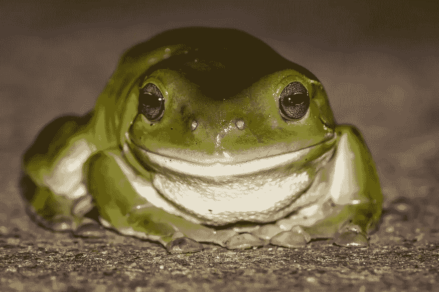

# 改善零-shot CLIP 的性能和可解释性

> 原文：[`towardsdatascience.com/improving-performance-and-explainability-of-zero-shot-clip-33e579d3f4bb`](https://towardsdatascience.com/improving-performance-and-explainability-of-zero-shot-clip-33e579d3f4bb)

## 第二部分 — 通过 LLM 描述进行视觉分类

[](https://medium.com/@alexml0123?source=post_page-----33e579d3f4bb--------------------------------)[](https://towardsdatascience.com/?source=post_page-----33e579d3f4bb--------------------------------) [Alexey Kravets](https://medium.com/@alexml0123?source=post_page-----33e579d3f4bb--------------------------------)

·发布在 [Towards Data Science](https://towardsdatascience.com/?source=post_page-----33e579d3f4bb--------------------------------) ·阅读时间 6 分钟·2023 年 11 月 25 日

--

这是关于提升零-shot CLIP 性能系列文章的第二部分。在第一部分中，我详细解释了 CLIP 模型的工作原理，并描述了一种简单的方法来提高其性能。这包括通过大型语言模型（LLM）生成的定制提示来扩展标准提示，如 *“{class} 的图片”*。如果你还没有阅读第一部分，可以在 [这里](https://medium.com/towards-data-science/simple-way-of-improving-zero-shot-clip-performance-4eae474cb447) 找到。在这篇文章中，我们将介绍一种相对类似的方法来提高零-shot CLIP 性能，同时这种方法具有很高的可解释性。

# 介绍

CLIP 模型是一个令人印象深刻的零-shot 预测器，能够对其没有明确训练过的任务进行预测。尽管它具有固有的能力，但仍然存在几种策略可以显著提高其性能。在第一篇文章中，我们已经见过其中一种策略，然而，虽然提高性能是有价值的，但有时我们可能愿意做出权衡，以优先考虑更好的可解释性。在本系列的第二篇文章中，我们将探讨一种不仅提升零-shot CLIP 模型性能，还确保其预测结果易于理解和解释的方法。

# 深度神经网络的可解释性

目前有多种解释性技术可用于深度学习模型。在[上一篇文章](https://medium.com/towards-data-science/integrated-gradients-from-scratch-b46311e4ab4)中，我深入探讨了集成梯度，这是一种说明输入的每个特征如何影响机器学习模型输出的方法，尤其是深度神经网络。另一种流行的模型解释方法是基于 Shap 值，我们根据合作博弈理论中的概念来分配每个特征对模型输出的贡献。虽然这些方法是通用的，可以应用于任何深度学习模型，但它们的实现和解释可能有些挑战。CLIP，它已经训练将图像和文本特征映射到相同的嵌入空间，提供了一种基于文本的替代解释方法。这种方法更具用户友好性，并提供了易于解释的方式，为模型解释提供了不同的视角。

# 问题的快速回顾

作为这一系列的第一部分的快速回顾，我们在这里解决的问题是预测下面显示图像的类别：



来自[FreeImages](https://images.freeimages.com/images/large-previews/342/green-tree-frog2-1616738.jpg)的树蛙图像（许可证：[`www.freeimages.com/license`](https://www.freeimages.com/license)）

使用简单提示 *“{class}的图片”* 的标准方法给出了错误的答案，预测 *“有尾巴的青蛙”* 的概率分数为 0.68*：

```py
from transformers import CLIPProcessor, CLIPModel
import torch
import requests
from PIL import Image

model = CLIPModel.from_pretrained("openai/clip-vit-base-patch32")
processor = CLIPProcessor.from_pretrained("openai/clip-vit-base-patch32")

url = "https://images.freeimages.com/images/large-previews/342/green-tree-frog2-1616738.jpg"
image = Image.open(requests.get(url, stream=True).raw)

inputs = processor(text=["a photo of a tree frog", "a photo of a tailed frog"], images=image, return_tensors="pt", padding=True)

outputs = model(**inputs)
logits_per_image = outputs.logits_per_image  # this is the image-text similarity score
probs = logits_per_image.softmax(dim=1)  # we can take the softmax to get the label probabilities
print(probs)

"""
Output:
tensor([[0.3164, 0.6836]], grad_fn=<SoftmaxBackward0>)
"""
```

现在让我们看看如何改进它。

# 通过 LLMs 的描述进行视觉分类

为了提高零-shot CLIP 的预测准确性，我们将实现类似于我们在第一篇文章中讨论的思想。然而，这一次，我们不会提供像 *“树蛙”* 这样的通用提示，例如 *“树蛙的识别特征因物种而异，但一些常见特征包括大粘附趾、突出的眼睛和明亮的颜色”*，而是将其分为具体的 **描述性特征**。例如，考虑到 *“树蛙”* 和 *“有尾巴的青蛙”* 类别的描述性特征是：

*树蛙*：

+   “突出的眼睛”

+   “大嘴巴”

+   “没有尾巴”

+   “明亮的绿色”

*有尾巴的青蛙*：

+   “小眼睛”

+   “小嘴巴”

+   “深色”

+   “有长尾巴”

*这些特征可以通过类似于以下的 LLM 生成：

Q：在照片中区分{class}的有用特征是什么？

A：有几个有用的视觉特征可以用来识别照片中的{class}：

-*

*“-”* 是重要的，因为它会迫使模型生成一个特征列表。

接下来，类似于我们在第一篇文章中所做的，为了对青蛙的图像进行分类，我们会取这些文本特征描述的平均向量嵌入，这些描述代表了多模态空间中的每个类别，并评估哪个平均向量最接近我们要分类的测试图像。在代码中，我们有：

```py
# define features description for each class
features = {"tree frog": [
        "protruding eyes", "large mouth", "without a tail",  "bright green colour"
    ],
    "tailed frog": [
        "tiny eyes", "small mouth", "has long tail", "dark colour"
    ]}

# image embedding
image_features = model.visual_projection(model.vision_model(inputs['pixel_values']).pooler_output)

tree_frog_vector = model.text_model(processor(features['tree frog'], return_tensors="pt", padding=True)['input_ids']).pooler_output
# take the mean prompt embedding
tree_frog_vector = tree_frog_vector.mean(dim=0, keepdims=True)
# final projection 
tree_frog_vector = model.text_projection(tree_frog_vector)

tailed_frog_vector = model.text_model(processor(features['tailed frog'], return_tensors="pt", padding=True)['input_ids']).pooler_output
# take the mean prompt embedding
tailed_frog_vector = tailed_frog_vector.mean(dim=0, keepdims=True)
# final projection
tailed_frog_vector = model.text_projection(tailed_frog_vector)

# concatenate 
text_features = torch.cat([tree_frog_vector, tailed_frog_vector], dim=0)

# normalize features
image_features = image_features / image_features.norm(dim=-1, keepdim=True)
text_features = text_features / text_features.norm(dim=-1, keepdim=True)

# cosine similarity as logits
logit_scale = model.logit_scale.exp()
logits_per_image = logit_scale * image_features @ text_features.t()
logits_per_image.softmax(dim=1)

"""
Output:
tensor([[0.8901, 0.1099]], grad_fn=<SoftmaxBackward0>)
"""
```

首先，我们观察到我们的预测现在是准确的，模型正确地识别出类别为*“树蛙”*。虽然我们在本系列的第一部分中也达到了正确的分类结果，但该方法的显著区别在于它提供了高可解释性。我们可以检查每个特征描述的非标准化分数*S(feature)*，而不是简单地取特征描述的平均值。这使我们能够理解模型为何预测了某个特定类别：

```py
# here we don't average the textual features as we want to see
# the score for each feature separately
tree_frog_vector = model.text_model(processor(features['tree frog'], return_tensors="pt", padding=True)['input_ids']).pooler_output
tree_frog_vector = model.text_projection(tree_frog_vector)
text_features_tree_frog = tree_frog_vector

text_features_tree_frog = text_features_tree_frog / text_features_tree_frog.norm(dim=-1, keepdim=True)
logit_scale = model.logit_scale.exp()
logits_per_image = logit_scale * image_features @ text_features_tree_frog.t()
logits_per_image

"""
Output:
tensor([[25.5400, 22.6840, 21.3895, 25.9017]], grad_fn=<MmBackward0>
"""

tailed_frog_vector = model.text_model(processor(features['tailed frog'], return_tensors="pt", padding=True)['input_ids']).pooler_output
tailed_frog_vector = model.text_projection(tailed_frog_vector)
text_features_tailed_frog = tailed_frog_vector

text_features_tailed_frog = text_features_tailed_frog / text_features_tailed_frog.norm(dim=-1, keepdim=True)
logit_scale = model.logit_scale.exp()
logits_per_image = logit_scale * image_features @ text_features_tailed_frog.t()
logits_per_image

"""
Output:
tensor([[24.0911, 22.3996, 21.2813, 21.0066]], grad_fn=<MmBackward0>
""" 
```

S(“突出眼睛”) = 25.5400 > S(“小眼睛”) = 24.0911;

S(“大嘴”) = 22.6840 > S(“小嘴”) = 22.3996;

S(“没有尾巴”) ~ S(“无尾”) 可能相似，因为尾巴是

图片中不可见;

S(“亮绿色”) = 25.9017 > S(“深色”)= 21.0066;

属于*“树蛙”*类别的特征分数高于*“有尾蛙”*类别的特征分数。分析这些特征分数有助于我们理解**为何**模型预测了某个类别。在这个例子中，像“突出眼睛”、“亮绿色”和“大嘴”等特征得到了非常高的分数，为预测的类别提供了清晰的解释。在第一部分描述的方法中没有这种解释水平，因为生成的提示非常通用，并且包含了不同概念的句子。将提示改为简单的特征描述可以让我们兼得两全其美——高准确性和良好的可解释性。

# 结论

在系列的第二部分，我们展示了如何通过改进标准提示*“{类别}的图片”*来提升性能。这个解决方案不仅具有可扩展性，因为 LLM 可以为任何数量的类别和数据集生成描述性特征，而且具有高度的可解释性。在即将到来的文章中，我们将探讨利用每个类别的少量图像示例的少样本学习方法，以实现比零样本方法更高的准确性。

# 参考文献

[1] [CLIP (huggingface.co)](https://huggingface.co/docs/transformers/model_doc/clip)

[2] [`openreview.net/pdf?id=jlAjNL8z5cs`](https://openreview.net/pdf?id=jlAjNL8z5cs)
