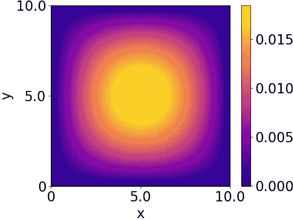
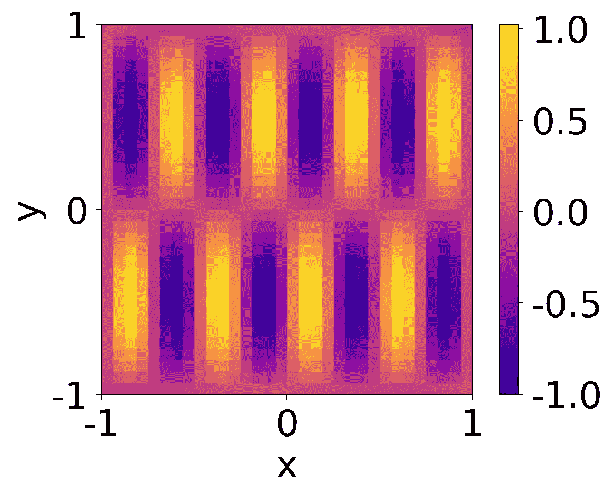
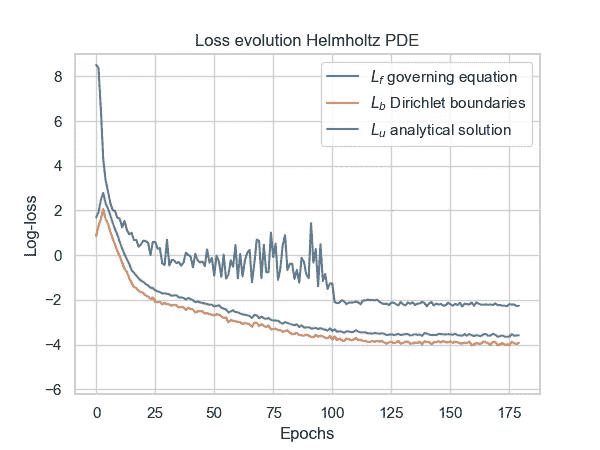
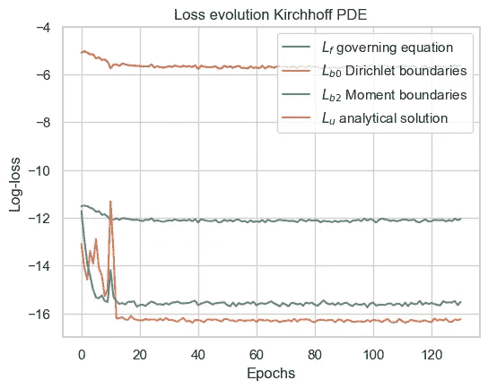
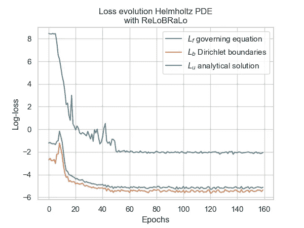
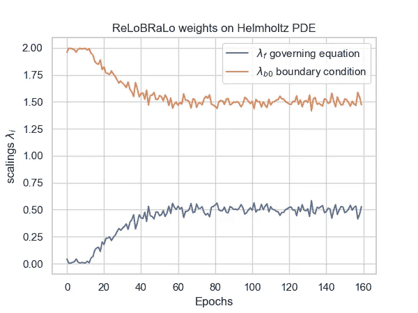
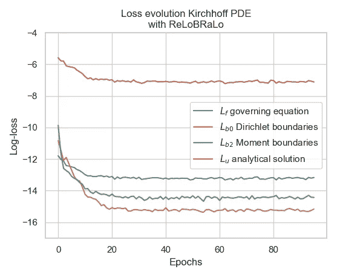
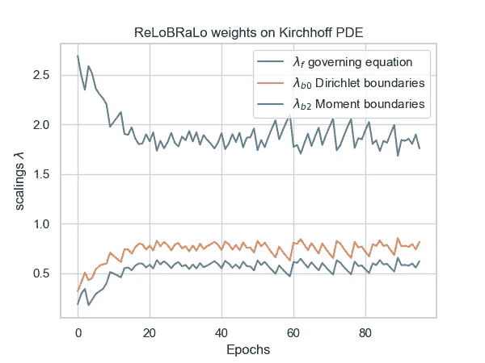

# 通过自适应损失平衡提升物理信息神经网络

> 原文：[`towardsdatascience.com/improving-pinns-through-adaptive-loss-balancing-55662759e701?source=collection_archive---------6-----------------------#2023-01-31`](https://towardsdatascience.com/improving-pinns-through-adaptive-loss-balancing-55662759e701?source=collection_archive---------6-----------------------#2023-01-31)

## 如何通过 ReLoBRaLo、学习率退火等方法提升 PINN 的性能

[](https://rabischof.medium.com/?source=post_page-----55662759e701--------------------------------)[](https://towardsdatascience.com/?source=post_page-----55662759e701--------------------------------) [Rafael Bischof](https://rabischof.medium.com/?source=post_page-----55662759e701--------------------------------)

·

[阅读](https://medium.com/m/signin?actionUrl=https%3A%2F%2Fmedium.com%2F_%2Fsubscribe%2Fuser%2F913c6c1e6a94&operation=register&redirect=https%3A%2F%2Ftowardsdatascience.com%2Fimproving-pinns-through-adaptive-loss-balancing-55662759e701&user=Rafael+Bischof&userId=913c6c1e6a94&source=post_page-913c6c1e6a94----55662759e701---------------------post_header-----------) 发表在 [Towards Data Science](https://towardsdatascience.com/?source=post_page-----55662759e701--------------------------------) ·14 分钟阅读·2023 年 1 月 31 日[](https://medium.com/m/signin?actionUrl=https%3A%2F%2Fmedium.com%2F_%2Fvote%2Ftowards-data-science%2F55662759e701&operation=register&redirect=https%3A%2F%2Ftowardsdatascience.com%2Fimproving-pinns-through-adaptive-loss-balancing-55662759e701&user=Rafael+Bischof&userId=913c6c1e6a94&source=-----55662759e701---------------------clap_footer-----------)

--

[](https://medium.com/m/signin?actionUrl=https%3A%2F%2Fmedium.com%2F_%2Fbookmark%2Fp%2F55662759e701&operation=register&redirect=https%3A%2F%2Ftowardsdatascience.com%2Fimproving-pinns-through-adaptive-loss-balancing-55662759e701&source=-----55662759e701---------------------bookmark_footer-----------)

图片由 [David Clode](https://unsplash.com/@davidclode?utm_source=medium&utm_medium=referral) 提供，来源于 [Unsplash](https://unsplash.com/?utm_source=medium&utm_medium=referral)

在本文中，我们回顾了 PINNs 的基础知识，探讨了不平衡损失的问题，并展示了由 Michael Kraus 和我提出的平衡方案 [ReLoBRaLo (相对损失平衡与随机回溯)](https://arxiv.org/abs/2110.09813) [1] 如何显著提升训练过程。还可以通过两个附带的笔记本体验这种技术在实际 PDE 问题中的应用：

+   [**基尔霍夫板弯曲 PDE 笔记本**](https://colab.research.google.com/drive/1_PmLv8OWh9GZTzqPgFpCXYYBlxGqszOn?usp=sharing)

+   [**亥姆霍兹 PDE 笔记本**](https://colab.research.google.com/drive/1R6aPThhp1wrQVaydl8pj1G0s4gLiH8Wc?usp=sharing)

如果你点击了这篇文章，可能是因为你已经对[物理信息神经网络 (PINN)](https://www.sciencedirect.com/science/article/pii/S0021999118307125) [2]有了相当好的理解。也许你在网上找到了一些教程，并在像 Burgers 或 Helmholtz 方程这样的知名基准上实现了 PINNs。利用神经网络的力量来解决复杂的偏微分方程 (PDEs) 的想法确实很有吸引力。但正如我们许多人痛苦地发现的那样，使用 PINNs 的现实过程也可能非常令人沮丧。如果你继续尝试将这些工具应用于你自己研究中遇到的尚未在文献中很好记录的 PDE，那么很可能 vanilla PINNs 的表现不会如你所愿。更糟的是，它们可能比像有限元方法 (FEM) 这样的成熟方法收敛得更慢！

请耐心点，我曾经经历过这一切，事实上，每次我尝试将 PINNs 应用到新问题上时，都是如此。尽管自其提出以来的五年中取得了一些进展，并且有几十年的[利用可微分神经网络解决微分方程的研究](https://www.sciencedirect.com/science/article/pii/002199919090007N) [3]，但目前仍没有一种易于使用、即插即用的 PINNs 版本可以无缝转移到任何类型的问题上。

你看，PINNs 通过对输出相对于输入进行多次高阶导数，将这些导数用于构建残差和边界条件，从而在其损失函数中利用微分方程。这意味着每个偏微分方程从根本上改变了 PINN 的训练过程。可能需要调整架构，例如添加或删除层和节点，此外，其他更复杂的超参数也可能对建模能力产生关键影响，其中许多是 PINNs 的特性，无法在经典神经网络的文献中找到。这些可能包括激活函数的选择、物理域上的采样程序，或者，非常棘手的是，微分方程中测量单位的选择。

虽然我无法给你使 PINNs 工作所需的所有配方，但我可以告诉你一些基本步骤，如果没有这些步骤，你的努力很可能是徒劳的。但在我揭示这些关键工具之前，请允许我提供一些背景，以更好地理解我的论点。让我们退后一步，打开一个括号。

# 基准 PDE

为了说明，让我们引入赫尔姆霍兹和**Kirchhoff** 板弯曲方程。但在你开始感到不知所措之前，让我向你保证，理解这些偏微分方程的复杂性并不是跟随本文其余部分的必要条件。如果你想跳过这一部分，只需知道赫尔姆霍兹偏微分方程是一个具有零阶（Dirichlet）边界条件的二阶偏微分方程，而**Kirchhoff** 板弯曲方程是一个具有零阶和二阶导数边界条件的四阶偏微分方程。

这个方程是一个四阶偏微分方程（PDE），描述了板在载荷下的变形。方程中的未知函数 u 表示板在给定点 (x, y) 的垂直位移（例如，以米为单位）。施加在板上的载荷由函数 p(x, y) 表示。方程中的常数 D 包含了板的各种属性，如其厚度、弹性模量和密度。

**Kirchhoff** 板弯曲方程。

所以，**Kirchhoff** 方程说明了变形的四阶导数等于施加在板上的载荷除以一个常数因子。相当直接，对吧？

当然，每个经验丰富的 PDE 专家都知道，尽管主方程看起来优雅，但没有适当的边界条件，它只是一种毫无意义的抽象。毕竟，有无限多的方程可以满足它。

那么，让我们也引入边界条件：

简支边缘的边界条件

其中 W 和 H 分别定义了板的宽度和高度。第一行的边界条件显示了零阶（Dirichlet），并指出板的边缘不允许弯曲。第二行显示了二阶导数，这要求边缘的弯矩为零。这可以通过一个被下面的梁支撑（因此零阶导数为零）并被上面的另一根梁挤压（导致弯矩为零）的板边缘来说明。



一个**Kirchhoff** 板及其在正弦载荷下的变形（以米为单位），W = H = 10 和 D = 20.83。图由作者提供。

## 赫尔姆霍兹方程：介质中波的建模

赫尔姆霍兹方程是一个描述波在介质中传播的偏微分方程。它是一个二阶方程，以德国物理学家赫尔曼·冯·赫尔姆霍兹命名。

赫尔姆霍兹方程，其中 u(x, y) 是未知函数，k 是波数

其中 k 是波数，u(x, y) 是待求的未知函数。对于这个问题，我们将使用域四个边缘上的零阶 Dirichlet 边界条件：

赫尔姆霍兹偏微分方程的**Dirichlet 边界条件**



一个赫尔姆霍兹波传播的例子，边界条件为零 Dirichlet。图由作者提供。

## **PINN** 损失函数

如果在定义 Kirchhoff 或 Helmholtz 函数的过程中我让你迷失了，不必担心。我花了半年多时间，以及无数耐心的土木工程师的解释，才得以向你讲解这些公式。

关键在于理解如何将这些方程转化为可用于训练我们 PINN 的损失函数，这里针对 Helmholtz 方程：

```py
import tensorflow as tf
import tensorflow.experimental.numpy.isclose

TOL = 1e-5

def compute_loss(self, x, y, u, dudxx, dudyy, eval=False):
    """
    Computes the physics-informed loss for Helmholtz's PDE.

    Parameters
    ----------
    x : tf.Tensor of shape (batch_size, 1)
        x coordinate of the points in the current batch
    y : tf.Tensor of shape (batch_size, 1)
        y coordinate of the points in the current batch
    u : tf.Tensor of shape (batch_size, 1)
        predictions made by our PINN (dim 0)
    dudxx : tf.Tensor of shape (batch_size, 1)
        second-order derivative of the predictions w.r.t. x
    dudyy : tf.Tensor of shape (batch_size, 1)
        second-order derivative of the predictions w.r.t. y
    """

    # governing equation loss
    L_f = (dudxx + dudyy + self.k**2 * u - \
          (-np.pi**2 - (4 * np.pi)**2 + self.k**2) * tf.math.sin(np.pi * x) * tf.math.sin(4 * np.pi * y))**2

    # determine which points are on the boundaries of the domain
    # if a point is on either of the boundaries, its value is 1 and 0 otherwise
    x_lower = tf.cast(isclose(x, -1, rtol=0., atol=EPS), dtype=tf.float32)
    x_upper = tf.cast(isclose(x,  1, rtol=0., atol=EPS), dtype=tf.float32)
    y_lower = tf.cast(isclose(y, -1, rtol=0., atol=EPS), dtype=tf.float32)
    y_upper = tf.cast(isclose(y,  1, rtol=0., atol=EPS), dtype=tf.float32)

    # compute 0th order boundary condition loss
    L_b = ((x_lower + x_upper + y_lower + y_upper) * u)**2

    if eval:
        L_u = (tf.math.sin(np.pi*x) * tf.math.sin(4*np.pi*y) - u)**2
        return L_f, L_b, L_u

    return L_f, L_b
```

你可以在实现 ReLoBRaLo 的笔记本中找到完整的代码，链接为[Helmholtz](https://colab.research.google.com/drive/1R6aPThhp1wrQVaydl8pj1G0s4gLiH8Wc?usp=sharing)和[Kirchhoff PDEs](https://colab.research.google.com/drive/1_PmLv8OWh9GZTzqPgFpCXYYBlxGqszOn?usp=sharing)。

# 多目标优化

正如我们已经确定的，我们的 Helmholtz PDE 的最终损失函数将包含两个，而 Kirchhoff PDE 则包含三个目标：

+   Helmholtz：控制方程的损失 L_f 和 0 阶边界条件的损失 L_b0。

+   Kirchhoff：除了 L_f 和 L_b0 之外，Kirchhoff 还包括一个用于二阶边界条件 L_b2 的项。

因此，这些损失属于多目标优化（MOO）范畴，就像大多数涉及 PINNs 的应用一样。

将多个目标聚合为单一损失的方式通常是通过线性标量化：

其中 lambda 是用于控制每个项对总损失贡献的缩放因子。但为什么它们是必要的？

# 不平衡梯度问题

在收集必要背景信息后，我们可以最终关闭括号）并继续探索为何 PDE 中的测量单位会影响 PINNs 的收敛性。你看，我们的损失函数中的几个目标——L_f、L_b0 和 L_b2——每个都有不同的测量单位。L_b0 对于 Kirchhoff 可能以米为单位测量，而 L_b2 以 Nm 为单位测量，板上的负载以 MN 每平方米为单位测量。这在每个项的大小上产生了显著的差异，导致梯度计算严重偏向具有最高幅度的项。Helmholtz 方程及任何其他 PDE 也是如此。

让我们来看看这在 Helmholtz 方程中的含义。



训练 PINN 模型时对 Helmholtz 方程损失的演变。L_f 是对控制方程的平方损失，L_b 是对边界条件的平方损失，L_u 是预测值与解析解之间的平方损失。图示由作者提供。

注意到在训练开始时，控制方程损失 L_f 比边界条件的损失大几个数量级，因此，L_b 的值实际上会**增加**。这种量级上的差异可能导致 PINN 优先考虑 L_f 而忽视 L_b，最终收敛到一个满足控制方程但忽略关键边界条件的解。这种效果可以通过验证损失 L_u 的图表观察到，验证损失 L_u 与边界损失 L_b 遵循相同的模式，表明验证性能与边界上的表现密切相关。

那么 Kirchhoff PDE 呢？



在训练 PINN 以解决 Kirchhoff 方程时损失的演变。L_f 是控制方程的平方损失，L_b0 是 Dirichlet 边界条件的平方损失，L_b2 是矩的边界条件的平方损失，而 L_u 是预测与解析解之间的平方损失。图由作者提供。

对于 Kirchhoff 方程来说，情况正好相反。这里，边界条件的收敛速度远远快于控制方程。最可能的解释是，控制方程涉及四阶导数，因此优化起来尤其困难。这表明**不平衡损失**的原因不仅仅是项之间量级的差异，还包括激活函数的选择和每一项所逼近函数的复杂性。

**不平衡的梯度**并不限于 Helmholtz 或 Kirchhoff PDEs。许多研究已经[记录了在各种 PINN 应用中存在这一问题](https://arxiv.org/pdf/2001.04536.pdf) [4]。这里的关键点是，为了得到准确的解，必须在损失函数中的所有目标之间取得平衡。

# 自适应损失平衡方案

为了减轻不平衡损失和梯度的问题，可以借助之前介绍的多目标优化中的线性标量化的缩放因子 lambda。选择较大的 lambda 值用于量级较小或更难优化的项可以帮助平衡最终梯度的贡献，从而确保所有项都被适当地逼近。然而，手动完成这项任务是繁琐的，需要许多迭代，因此在时间和计算资源方面耗费较大。

这就是为什么研究人员提出了损失平衡方案，如 [Gradnorm](https://arxiv.org/abs/1711.02257) [5]、[SoftAdapt](https://arxiv.org/abs/1912.12355) [6] 或 [学习率退火](https://arxiv.org/pdf/2001.04536.pdf) [4]。

## 相对损失平衡与随机回溯（ReLoBRaLo）

在本文中，我们将重点介绍一种名为[相对损失平衡与随机回顾（ReLoBRaLo）](https://arxiv.org/abs/2110.09813)的方案[1]，它是上述方法的结合体。

ReLoBRaLo 的目标是确保损失函数中的每一项随着时间的推移都有相同的进展，相对于其在训练开始时的值。例如，如果 L_f 从训练开始以来提高了 50%，我们希望其他项也以大致相同的速度提高，并达到 50% 的减少。然而，如果某一项始终以较慢的速度提高，ReLoBRaLo 会逐渐增加该项的缩放因子 lambda，从而增加其对梯度计算的贡献。

假设我们有 n 个损失项 L_i，并且用 L_i(t) 表示训练迭代 t 时该项的值。我们可以通过将当前迭代的值 L_i(t) 除以训练开始时的值 L_i(0) 来衡量其进展：

ReLoBRaLo 通过将每个损失项 L_i(t) 的当前值除以第一个迭代的值 L_i(0)，来衡量每个项 i 从训练开始以来的进展。

训练开始以来的进展越大，这个操作的结果就会越小。观察这正是我们所期望的：我们的方案应该对进展缓慢的项赋予较高的缩放因子，而对进展较快的项赋予较小的缩放因子——而且所有这一切都应该独立于项的绝对值。因此，我们可以使用 L_i(t) / L_i(0) 来计算损失函数中各项的缩放因子。

尽管这是 ReLoBRaLo 的关键组件，但它还包含了许多额外的扩展，这些扩展被发现可以进一步提高性能。然而，为了便于本文的可读性，我将这些内容留给感兴趣的读者[查看论文](https://arxiv.org/abs/2110.09813)并了解更多关于所用方法及其动机的信息。

那么它有效吗？让我们来看看使用 ReLoBRaLo 平衡各项对总损失的贡献时 Helmholtz PDE 的损失演变情况：



在 Helmholtz 方程上训练 PINN 并使用 ReLoBRaLo 时损失的演变。L_f 是对主方程的平方损失，L_b 是对边界条件的平方损失，L_u 是预测值与解析解之间的平方损失。图由作者提供。

虽然主要方程 L_f 的损失不再有太大进展（在前一个图中收敛于大约 -3.8），但边界条件 L_b 以及由此产生的验证损失 L_u 收到了更多的权重。最终的验证损失相对于解析解有了 **65% 的改善**。让我们看看 ReLoBRaLo 计算的缩放值：



通过 ReLoBRaLo 获得的 Helmholtz PDE 主要方程项 L_f（蓝色）和边界条件 L_b（橙色）的缩放因子 lambda_i。图由作者提供。

Kirchhoff 也是如此：



在 Kirchhoff 方程上训练 PINN 并使用 ReLoBRaLo 时，损失的演变。L_f 是主要方程的平方损失，L_b0 是 Dirichlet 边界条件的平方损失，L_b2 是矩边界条件的平方损失，L_u 是预测值与解析解的平方损失。图由作者提供。



通过 ReLoBRaLo 获得的 Kirchhoff PDE 主要方程项 L_f（蓝色）、Dirichlet 边界条件 L_b0（橙色）和矩边界条件 L_b2（绿色）的缩放因子。图由作者提供。

再次，ReLoBRaLo 将误差相对于解析解的改善了一个数量级。值得注意的是，这种平衡方案几乎没有增加计算开销（参见论文）。正是这种有效性和效率让 ReLoBRaLo 成为 [Nvidia 物理信息深度学习框架 Modulus](https://docs.nvidia.com/deeplearning/modulus/api/modulus.loss.html#modulus.loss.aggregator.Relobralo) 的一部分。

但真正的问题是：你能在自己的项目中使用 ReLoBRaLo 吗？答案是一个响亮的“能”！实际上，该方案可以整洁地封装成一个 keras 损失，可以通过 model.compile() 添加到你的 keras 模型中，或者在定义了自定义训练循环的情况下，在每次迭代时显式调用它。

你可以在实现 ReLoBRaLo 的笔记本中找到完整的代码，适用于 [Helmholtz](https://colab.research.google.com/drive/1R6aPThhp1wrQVaydl8pj1G0s4gLiH8Wc?usp=sharing) 和 [Kirchhoff PDEs](https://colab.research.google.com/drive/1_PmLv8OWh9GZTzqPgFpCXYYBlxGqszOn?usp=sharing)。

```py
import tensorflow as tf

class ReLoBRaLoLoss(tf.keras.losses.Loss):
    """
    Class for the ReLoBRaLo Loss. 
    This class extends the keras Loss class to have dynamic weighting for each term.
    """
    def __init__(self, pde:HelmholtzPDE, alpha:float=0.999, temperature:float=0.1, rho:float=0.99,
                 name='ReLoBRaLoLoss', **kwargs):
        """
        Parameters
        ----------
        pde : PDE
            An instance of a PDE class containing the PDE-specific `compute_loss` function.
        alpha, optional : float
            Controls the exponential weight decay rate. 
            Value between 0 and 1\. The smaller, the more stochasticity.
            0 means no historical information is transmitted to the next iteration.
            1 means only first calculation is retained. Defaults to 0.999.
        temperature, optional : float
            Softmax temperature coefficient. Controlls the "sharpness" of the softmax operation. 
            Defaults to 0.1.
        rho, optional : float
            Probability of the Bernoulli random variable controlling the frequency of random lookbacks.
            Value berween 0 and 1\. The smaller, the fewer lookbacks happen.
            0 means lambdas are always calculated w.r.t. the initial loss values.
            1 means lambdas are always calculated w.r.t. the loss values in the previous training iteration.
            Defaults to 0.99.
        """
        super().__init__(name=name, **kwargs)
        self.pde = pde
        self.alpha = alpha
        self.temperature = temperature
        self.rho = rho
        self.call_count = tf.Variable(0, trainable=False, dtype=tf.int16)

        self.lambdas = [tf.Variable(1., trainable=False) for _ in range(pde.num_terms)]
        self.last_losses = [tf.Variable(1., trainable=False) for _ in range(pde.num_terms)]
        self.init_losses = [tf.Variable(1., trainable=False) for _ in range(pde.num_terms)]

    def call(self, xy, preds):
        x, y = xy[:, :1], xy[:, 1:]

        # obtain the unscaled values for each term 
        losses = [tf.reduce_mean(loss) for loss in self.pde.compute_loss(x, y, preds)]

        # in first iteration (self.call_count == 0), drop lambda_hat and use init lambdas, i.e. lambda = 1
        #   i.e. alpha = 1 and rho = 1
        # in second iteration (self.call_count == 1), drop init lambdas and use only lambda_hat
        #   i.e. alpha = 0 and rho = 1
        # afterwards, default procedure (see paper)
        #   i.e. alpha = self.alpha and rho = Bernoully random variable with p = self.rho
        alpha = tf.cond(tf.equal(self.call_count, 0), 
                lambda: 1., 
                lambda: tf.cond(tf.equal(self.call_count, 1), 
                                lambda: 0., 
                                lambda: self.alpha))
        rho = tf.cond(tf.equal(self.call_count, 0), 
              lambda: 1., 
              lambda: tf.cond(tf.equal(self.call_count, 1), 
                              lambda: 1., 
                              lambda: tf.cast(tf.random.uniform(shape=()) < self.rho, dtype=tf.float32)))

        # compute new lambdas w.r.t. the losses in the previous iteration
        lambdas_hat = [losses[i] / (self.last_losses[i] * self.temperature + EPS) for i in range(len(losses))]
        lambdas_hat = tf.nn.softmax(lambdas_hat - tf.reduce_max(lambdas_hat)) * tf.cast(len(losses), dtype=tf.float32)

        # compute new lambdas w.r.t. the losses in the first iteration
        init_lambdas_hat = [losses[i] / (self.init_losses[i] * self.temperature + EPS) for i in range(len(losses))]
        init_lambdas_hat = tf.nn.softmax(init_lambdas_hat - tf.reduce_max(init_lambdas_hat)) * tf.cast(len(losses), dtype=tf.float32)

        # use rho for deciding, whether a random lookback should be performed
        new_lambdas = [(rho * alpha * self.lambdas[i] + (1 - rho) * alpha * init_lambdas_hat[i] + (1 - alpha) * lambdas_hat[i]) for i in range(len(losses))]
        self.lambdas = [var.assign(tf.stop_gradient(lam)) for var, lam in zip(self.lambdas, new_lambdas)]

        # compute weighted loss
        loss = tf.reduce_sum([lam * loss for lam, loss in zip(self.lambdas, losses)])

        # store current losses in self.last_losses to be accessed in the next iteration
        self.last_losses = [var.assign(tf.stop_gradient(loss)) for var, loss in zip(self.last_losses, losses)]
        # in first iteration, store losses in self.init_losses to be accessed in next iterations
        first_iteration = tf.cast(self.call_count < 1, dtype=tf.float32)
        self.init_losses = [var.assign(tf.stop_gradient(loss * first_iteration + var * (1 - first_iteration))) for var, loss in zip(self.init_losses, losses)]

        self.call_count.assign_add(1)

        return loss
```

非常感谢你阅读到本文的最后！如果你觉得这篇文章对你有帮助，并希望在自己的工作中使用 ReLoBRaLo 或笔记本，请使用 [此引用](https://ui.adsabs.harvard.edu/abs/2021arXiv211009813B/exportcitation)。你可以在 [rabischof.ch](http://rabischof.ch) 和我的同事在 [mkrausai.com](http://mkrausai.com) 上找到更多关于我的信息。

[1] Rafael Bischof 和 Michael Kraus. 面向物理的深度学习的多目标损失平衡。arXiv 预印本 arXiv:2110.09813, 2021。

[2] M. Raissi, P. Perdikaris, 和 G. E. Karniadakis，《物理信息神经网络：解决涉及非线性偏微分方程的正向和逆向问题的深度学习框架》，《计算物理学杂志》378 (2019)，686–707。

[3] H. Lee 和 I. S. Kang，《求解微分方程的神经算法》，《计算物理学杂志》91 (1990)，第 1 期，110–131

[4] Wang, S., Teng, Y., 和 Perdikaris, P. 理解和缓解物理信息神经网络中的梯度病态。arXiv 预印本 (2020 年 1 月)，arXiv:2001.04536。

[5] Chen, Z., Badrinarayanan, V., Lee, C.-Y., 和 Rabinovich, A. GradNorm: 用于深度多任务网络的自适应损失平衡的梯度归一化。arXiv 预印本 (2017 年 11 月)，arXiv:1711.02257。

[6] Heydari, A. A., Thompson, C. A., 和 Mehmood, A. SoftAdapt: 用于多部分损失函数的神经网络的自适应损失加权技术。arXiv 预印本 (2019 年 12 月)，arXiv:1912.12355。
