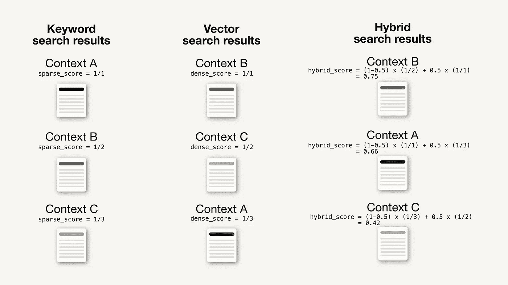

# 在 RAG 管道中通过混合搜索提升检索性能

> 原文：[`towardsdatascience.com/improving-retrieval-performance-in-rag-pipelines-with-hybrid-search-c75203c2f2f5?source=collection_archive---------1-----------------------#2023-11-28`](https://towardsdatascience.com/improving-retrieval-performance-in-rag-pipelines-with-hybrid-search-c75203c2f2f5?source=collection_archive---------1-----------------------#2023-11-28)

## 如何通过将传统的基于关键词的搜索与现代的向量搜索相结合来找到更相关的搜索结果

[](https://medium.com/@iamleonie?source=post_page-----c75203c2f2f5--------------------------------)[](https://towardsdatascience.com/?source=post_page-----c75203c2f2f5--------------------------------) [Leonie Monigatti](https://medium.com/@iamleonie?source=post_page-----c75203c2f2f5--------------------------------)

·

[关注](https://medium.com/m/signin?actionUrl=https%3A%2F%2Fmedium.com%2F_%2Fsubscribe%2Fuser%2F3a38da70d8dc&operation=register&redirect=https%3A%2F%2Ftowardsdatascience.com%2Fimproving-retrieval-performance-in-rag-pipelines-with-hybrid-search-c75203c2f2f5&user=Leonie+Monigatti&userId=3a38da70d8dc&source=post_page-3a38da70d8dc----c75203c2f2f5---------------------post_header-----------) 发表在 [Towards Data Science](https://towardsdatascience.com/?source=post_page-----c75203c2f2f5--------------------------------) · 8 分钟阅读 · 2023 年 11 月 28 日 [](https://medium.com/m/signin?actionUrl=https%3A%2F%2Fmedium.com%2F_%2Fvote%2Ftowards-data-science%2Fc75203c2f2f5&operation=register&redirect=https%3A%2F%2Ftowardsdatascience.com%2Fimproving-retrieval-performance-in-rag-pipelines-with-hybrid-search-c75203c2f2f5&user=Leonie+Monigatti&userId=3a38da70d8dc&source=-----c75203c2f2f5---------------------clap_footer-----------)

--

[](https://medium.com/m/signin?actionUrl=https%3A%2F%2Fmedium.com%2F_%2Fbookmark%2Fp%2Fc75203c2f2f5&operation=register&redirect=https%3A%2F%2Ftowardsdatascience.com%2Fimproving-retrieval-performance-in-rag-pipelines-with-hybrid-search-c75203c2f2f5&source=-----c75203c2f2f5---------------------bookmark_footer-----------)

具有混合搜索功能的搜索栏

随着对 [检索增强生成](https://medium.com/p/4e9bd5f6a4f2)（RAG）管道的兴趣增加，开发者们开始讨论在构建具有生产就绪性能的 RAG 管道时面临的挑战。正如生活中的许多方面一样，帕累托原则也在 RAG 管道中发挥作用，其中实现最初的 80%相对简单，但要达到剩下的 20%以实现生产就绪则证明具有挑战性。

> 一个经常重复的主题是通过混合搜索来改善 RAG 管道的检索组件。

已经获得经验的开发者们 [开始分享他们的见解](https://medium.com/towards-data-science/the-untold-side-of-rag-addressing-its-challenges-in-domain-specific-searches-808956e3ecc8)。一个经常重复的主题是通过混合搜索来改善 RAG 管道的检索组件。

本文介绍了混合搜索的概念，如何通过检索更相关的结果来提高你的 RAG 管道性能，以及何时使用它。

+   什么是混合搜索

+   混合搜索如何工作？

+   混合搜索如何提高你 RAG 管道的性能？

+   你什么时候会使用混合搜索？

+   总结

# 什么是混合搜索

混合搜索是一种结合两种或更多搜索算法的搜索技术，以提高搜索结果的相关性。尽管没有定义具体结合了哪些算法，但混合搜索最常指的是传统基于关键词的搜索与现代向量搜索的结合。

传统上，基于关键词的搜索是搜索引擎的明显选择。然而，随着机器学习（ML）算法的出现，向量嵌入启用了一个新的搜索技术——称为向量或语义搜索——使我们能够在语义上进行数据搜索。然而，这两种搜索技术都有必须考虑的重要权衡：

+   **基于关键词的搜索：** 尽管其精确的关键词匹配能力对特定术语（如产品名称或行业术语）有益，但对拼写错误和同义词敏感，这会导致它遗漏重要的上下文。

+   **向量或语义搜索：** 尽管它的语义搜索功能基于数据的语义意义进行多语言和多模态搜索，并使其对拼写错误具有鲁棒性，但可能会遗漏重要的关键词。此外，它依赖于生成的向量嵌入的质量，并对领域外的术语敏感。

将基于关键词的搜索与向量搜索结合成混合搜索，使你能够利用这两种搜索技术的优点，从而提高搜索结果的相关性，特别是在文本搜索的使用场景中。

例如，考虑搜索查询“如何使用`.concat()`合并两个 Pandas DataFrames？”关键词搜索会帮助找到与方法`.concat()`相关的结果。然而，由于“merge”这个词有诸如“combine”、“join”和“concatenate”等同义词，如果我们能利用语义搜索的上下文感知能力，将会更有帮助（有关更多细节，请参见何时使用混合搜索）。

如果你感兴趣，可以在这个实时[演示](https://awesome-moviate.weaviate.io/)中尝试不同的基于关键词的、语义的和混合搜索查询（其实现细节见这篇文章）。

# 混合搜索是如何工作的？

混合搜索通过融合关键词基础和向量搜索技术的搜索结果并对其进行重新排序来实现。

## 基于关键词的搜索

在混合搜索的背景下，基于关键词的搜索通常使用一种称为稀疏嵌入的表示，这就是为什么它也被称为稀疏向量搜索。稀疏嵌入是大多数值为零且只有少数非零值的向量，如下所示。

```py
[0, 0, 0, 0, 0, 1, 0, 0, 0, 24, 3, 0, 0, 0, 0, ...]
```

稀疏嵌入可以通过不同的算法生成。生成稀疏嵌入的最常用算法是[BM25](https://en.wikipedia.org/wiki/Okapi_BM25)（最佳匹配 25），它建立在 TF-IDF（词频-逆文档频率）方法之上并对其进行了改进。简单来说，BM25 根据词汇在文档中的频率相对于其在所有文档中的频率来强调术语的重要性。

## 向量搜索

向量搜索是一种现代搜索技术，随着机器学习的进步而出现。现代机器学习算法，如[Transformers](https://huggingface.co/docs/transformers/index)，可以生成各种模态（文本、图像等）的数据对象的数值表示，称为向量嵌入。

这些向量嵌入通常信息密集且大多由非零值组成（密集向量），如下所示。这也是为什么向量搜索也被称为密集向量搜索。

```py
[0.634, 0.234, 0.867, 0.042, 0.249, 0.093, 0.029, 0.123, 0.234, ...]
```

搜索查询被嵌入到与数据对象相同的向量空间中。然后，其向量嵌入用于根据指定的相似性度量（例如余弦距离）计算最接近的数据对象。返回的搜索结果列出了与搜索查询相似度排名最高的数据对象。

## 关键词基础与向量搜索结果的融合

基于关键词的搜索和向量搜索返回的是一组独立的结果，通常是按计算的相关性排序的搜索结果列表。这些独立的搜索结果集必须被合并。

有许多不同的策略可以将两个列表的排名结果合并为一个单一的排名，正如[Benham 和 Culpepper](https://rodgerbenham.github.io/bc17-adcs.pdf) [1]的论文中所述。

一般来说，搜索结果通常首先会被**评分**。这些分数可以基于指定的度量计算，如余弦距离，或者仅仅是搜索结果列表中的排名。

然后，计算出的分数会与参数`alpha`一起加权，这决定了每种算法的加权并影响结果的重新排名。

```py
hybrid_score = (1 - alpha) * sparse_score + alpha * dense_score
```

通常，`alpha`的值在 0 到 1 之间，具体取值为

+   `alpha = 1`：纯向量搜索

+   `alpha = 0`：纯关键词搜索

下面，你可以看到一个基于排名和`alpha = 0.5`评分的关键词与向量搜索融合的最小示例。



这是一个关于如何在混合搜索中融合关键词和向量搜索结果的最小示例，评分基于排名和`alpha = 0.5`（图像由作者提供，灵感来自[混合搜索解释](https://weaviate.io/blog/hybrid-search-explained)）。

# 混合搜索如何提高你的 RAG 管道性能？

一个[RAG 管道](https://medium.com/p/4e9bd5f6a4f2)有许多可以调整的参数来提高其性能。其中之一是提高检索到的上下文的相关性，这些上下文会被输入到 LLM 中，因为如果检索到的上下文与回答特定问题不相关，LLM 也无法生成相关的答案。

根据你的上下文类型和查询，你需要确定三种搜索技术中哪一种对你的 RAG 应用最有利。因此，**参数** `**alpha**`**，用于控制关键词搜索和语义搜索之间的加权，可以视为需要调整的超参数。**

在一个常见的[使用 LangChain 的 RAG 管道](https://medium.com/p/4e9bd5f6a4f2)中，你会通过以下方式设置检索器组件，将使用的`vectorstore`组件设置为检索器，方法是`.as_retriever()`：

```py
# Define and populate vector store
# See details here https://towardsdatascience.com/retrieval-augmented-generation-rag-from-theory-to-langchain-implementation-4e9bd5f6a4f2
vectorstore = ...

# Set vectorstore as retriever
retriever = vectorstore.as_retriever()
```

然而，这种方法只启用了语义搜索。如果你想在 LangChain 中启用混合搜索，你需要定义一个具有混合搜索功能的特定`[retriever](https://python.langchain.com/docs/integrations/retrievers)` [组件](https://python.langchain.com/docs/integrations/retrievers)，例如`[WeaviateHybridSearchRetriever](https://python.langchain.com/docs/integrations/retrievers)`：

```py
from langchain.retrievers.weaviate_hybrid_search import WeaviateHybridSearchRetriever

retriever = WeaviateHybridSearchRetriever(
    alpha = 0.5,               # defaults to 0.5, which is equal weighting between keyword and semantic search
    client = client,           # keyword arguments to pass to the Weaviate client
    index_name = "LangChain",  # The name of the index to use
    text_key = "text",         # The name of the text key to use
    attributes = [],           # The attributes to return in the results
)
```

其余的[标准 RAG 管道](https://medium.com/p/4e9bd5f6a4f2)将保持不变。

这个小的代码更改允许你在关键词搜索和向量搜索之间尝试不同的加权。注意，设置`alpha = 1`等于完全的语义搜索，相当于直接从`vectorstore`组件定义检索器（`retriever = vectorstore.as_retriever()`）。

# 你何时会使用混合搜索（混合搜索用例）

混合搜索非常适用于需要启用语义搜索功能以获得更人性化的搜索体验，但也需要对特定术语（如产品名称或序列号）进行精确匹配的用例。

一个很好的例子是平台 Stack Overflow，它最近通过使用混合搜索扩展了其搜索功能。

[## 像人一样提问：在 Stack Overflow 上实现语义搜索](https://stackoverflow.blog/2023/07/31/ask-like-a-human-implementing-semantic-search-on-stack-overflow/?source=post_page-----c75203c2f2f5--------------------------------)

### 语义搜索允许用户使用自然语言进行搜索，而不是依赖于关键字操作的僵化语法。搜索……

[stackoverflow.blog](https://stackoverflow.blog/2023/07/31/ask-like-a-human-implementing-semantic-search-on-stack-overflow/?source=post_page-----c75203c2f2f5--------------------------------)

最初，Stack Overflow 使用 TF-IDF 将关键字匹配到文档中[2]。然而，描述你试图解决的编码问题可能会很困难。这可能导致基于你用来描述问题的词语不同而得到不同的结果（例如，组合两个 Pandas DataFrames 可以通过不同的方法实现，如合并、连接和拼接）。因此，更加上下文感知的搜索方法，如语义搜索，将对这些案例更有益。

然而，另一方面，Stack Overflow 的一个常见用例是复制粘贴错误信息。对于这种情况，精确的关键字匹配是首选的搜索方法。此外，你还需要精确的关键字匹配能力来处理方法和参数名称（例如，Pandas 中的 `.read_csv()`）。

正如你所猜测的，许多类似的现实世界使用案例受益于上下文感知的语义搜索，但仍然依赖于精确的关键字匹配。这些使用案例可以通过实现混合搜索检索器组件得到显著的提升。

# 概述

这篇文章介绍了混合搜索的背景，作为基于关键字搜索和向量搜索的组合。混合搜索将单独搜索算法的搜索结果合并并相应地重新排序搜索结果。

在混合搜索中，参数 `alpha` 控制基于关键字的搜索和语义搜索之间的加权。这个参数 `alpha` 可以视为 RAG 管道中的一个超参数，用于调节以提高搜索结果的准确性。

使用 Stack Overflow [2] 案例研究，我们展示了混合搜索如何对语义搜索可以改善搜索体验的使用案例有帮助。然而，当特定术语频繁出现时，精确的关键字匹配仍然很重要。

# 享受这个故事吗？

[*免费订阅*](https://medium.com/subscribe/@iamleonie) *以便在我发布新故事时获得通知。*

[## 订阅以便每当 Leonie Monigatti 发布内容时，你会收到电子邮件。](https://medium.com/@iamleonie/subscribe?source=post_page-----c75203c2f2f5--------------------------------)

### 订阅以便每当 Leonie Monigatti 发布内容时，你会收到电子邮件。通过注册，如果你还没有 Medium 账户，将会创建一个 Medium 账户……

[medium.com](https://medium.com/@iamleonie/subscribe?source=post_page-----c75203c2f2f5--------------------------------)

*在* [*LinkedIn*](https://www.linkedin.com/in/804250ab/)，[*Twitter*](https://twitter.com/helloiamleonie)*和* [*Kaggle*](https://www.kaggle.com/iamleonie)*上找到我！*

# 免责声明

在撰写本文时，我是 Weaviate 的开发者倡导者，Weaviate 是一个开源向量数据库。

# 参考文献

## 文献

[1] Benham, R., & Culpepper, J. S. (2017). [排名融合中的风险-收益权衡](https://rodgerbenham.github.io/bc17-adcs.pdf)。发表于*第 22 届澳大利亚文档计算研讨会*（第 1–8 页）。

[2] Haney, D. & Gibson, D. 在 Stack Overflow 博客中。[像人类一样提问：在 Stack Overflow 上实现语义搜索](https://stackoverflow.blog/2023/07/31/ask-like-a-human-implementing-semantic-search-on-stack-overflow/)（访问于 2023 年 11 月 24 日）。

## 图片

除非另有说明，否则所有图片均由作者创建。
