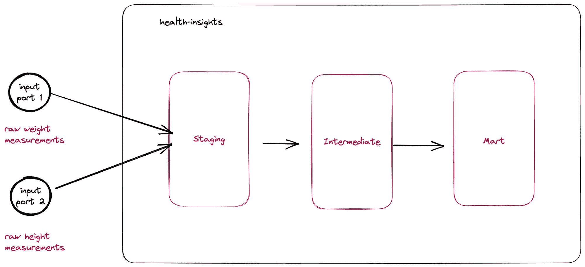
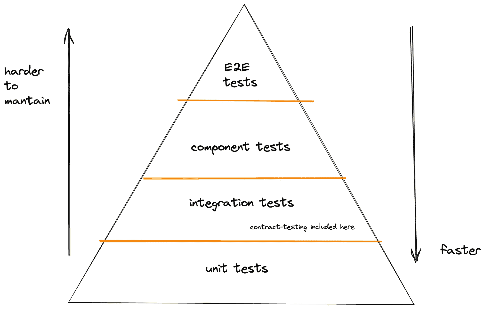
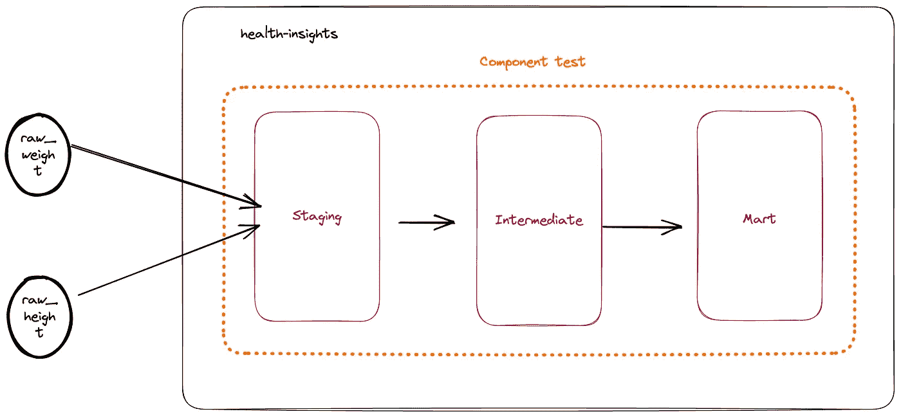

# 如何通过单元测试和 TDD 提高您 dbt 模型的代码质量

> 原文：[`towardsdatascience.com/improving-the-code-quality-of-your-dbt-models-with-unit-tests-and-tdd-203ed0be791e?source=collection_archive---------4-----------------------#2023-05-31`](https://towardsdatascience.com/improving-the-code-quality-of-your-dbt-models-with-unit-tests-and-tdd-203ed0be791e?source=collection_archive---------4-----------------------#2023-05-31)

## 开始对您的 dbt SQL 模型进行单元测试所需了解的一切

[](https://medium.com/@pablo.porto?source=post_page-----203ed0be791e--------------------------------)[](https://towardsdatascience.com/?source=post_page-----203ed0be791e--------------------------------) [Pablo Porto](https://medium.com/@pablo.porto?source=post_page-----203ed0be791e--------------------------------)

·

[关注](https://medium.com/m/signin?actionUrl=https%3A%2F%2Fmedium.com%2F_%2Fsubscribe%2Fuser%2Fa6f9bc7e34a6&operation=register&redirect=https%3A%2F%2Ftowardsdatascience.com%2Fimproving-the-code-quality-of-your-dbt-models-with-unit-tests-and-tdd-203ed0be791e&user=Pablo+Porto&userId=a6f9bc7e34a6&source=post_page-a6f9bc7e34a6----203ed0be791e---------------------post_header-----------) 发表在 [Towards Data Science](https://towardsdatascience.com/?source=post_page-----203ed0be791e--------------------------------) ·7 分钟阅读·2023 年 5 月 31 日[](https://medium.com/m/signin?actionUrl=https%3A%2F%2Fmedium.com%2F_%2Fvote%2Ftowards-data-science%2F203ed0be791e&operation=register&redirect=https%3A%2F%2Ftowardsdatascience.com%2Fimproving-the-code-quality-of-your-dbt-models-with-unit-tests-and-tdd-203ed0be791e&user=Pablo+Porto&userId=a6f9bc7e34a6&source=-----203ed0be791e---------------------clap_footer-----------)

--

[](https://medium.com/m/signin?actionUrl=https%3A%2F%2Fmedium.com%2F_%2Fbookmark%2Fp%2F203ed0be791e&operation=register&redirect=https%3A%2F%2Ftowardsdatascience.com%2Fimproving-the-code-quality-of-your-dbt-models-with-unit-tests-and-tdd-203ed0be791e&source=-----203ed0be791e---------------------bookmark_footer-----------)

图片由 [Christin Hume](https://unsplash.com/@christinhumephoto?utm_source=unsplash&utm_medium=referral&utm_content=creditCopyText) 提供，来源于 [Unsplash](https://unsplash.com/photos/Hcfwew744z4?utm_source=unsplash&utm_medium=referral&utm_content=creditCopyText)

如果你是数据或分析工程师，你可能已经习惯了编写 SQL 模型并使用 dbt 测试数据质量。你为自己创建的模块化和整洁的 SQL 模型感到自豪。一切都还不错。但某个时候，你模型中的转换逻辑开始增长并变得更加复杂。你开始考虑，是否能够将模型隔离并创建单元测试来验证和记录这些逻辑会更好呢？这肯定会提高你 dbt 代码库的代码质量，对吧？

你的第一个想法是查看如何使用内置的 dbt 数据测试功能来进行这种类型的测试。经过几次谷歌搜索，你意识到其中一种方法是 [创建一个自定义单元测试框架，利用 dbt 种子功能](https://medium.com/@TianchenW/unit-test-sql-using-dbt-1b8aa214365e)。或者你需要 [将 Python 引入你的代码库，以便使用 Pytest 创建单元测试](https://godatadriven.com/blog/dbts-missing-software-engineering-piece-unit-tests/)。这看起来相当繁琐，因此你开始考虑，是否能够模拟模型输入并使用 SQL 对转换后的数据进行断言会更好呢？

如果你对此有共鸣，你并不孤单。这是我所在的数据工程团队经历的过程，直到我们找到 dbt-unit-testing 库。

# 模拟 dbt 源和引用

使用 [dbt-unit-testing](https://github.com/EqualExperts/dbt-unit-testing) 你可以通过模拟其依赖关系来独立测试 dbt 模型。根据他们的文档，它为你提供了：

+   **能够模拟依赖关系**

+   **能够独立运行每个测试**

+   **快速反馈循环**

+   **良好的测试反馈**（好吧，如我们将看到的，有一些陷阱）

这个 dbt 库使我们能够模拟模型依赖关系，并立即开始实施单元测试。正如我将在最后与您分享的，它甚至使我们能够开始实践测试驱动开发来开发我们的模型。

既然我们介绍了这个库，让我们看看开始实施真实的 dbt SQL 模型单元测试所需了解的基本知识。

# 为什么你应该对模型进行单元测试？

一些数据团队专注于提高其数据应用处理的数据质量，但他们常常忽视了所构建软件的代码质量。

单元测试可以通过提供一种隔离 SQL 模型并验证复杂业务逻辑的方式来帮助实现这一点。

> *“单元测试测试应用程序中最小的可测试软件部分，以确定它是否按预期行为” —* [*Toby Clemson*](https://martinfowler.com/articles/microservice-testing/#testing-unit-introduction)

在我们的案例中，最小的可测试软件是一个 dbt 模型。能够隔离测试模型可以确保新的更改不会破坏现有的业务逻辑，并帮助我们记录模型的预期行为。

一个典型的 dbt 应用遵循 [分层架构风格](https://docs.getdbt.com/guides/best-practices/how-we-structure/1-guide-overview)，至少包含三个层级：暂存层、中间层。每一层会包含一个或多个模型。这些就是我们可以单独测试的模型。

# 创建我们的第一个单元测试

让我们来看一个简单的示例。我们有一个名为 health-insights 的 dbt 应用，它从上游源获取体重和身高数据，并计算体质指数。



一个典型 dbt 数据应用的分层架构

以下模型用最新的身高测量来丰富体重测量，最新的身高记录在体重测量之前。

一个 dbt 中间模型的示例

现在让我们创建一个 dbt 单元测试，以证明变换逻辑是正确的。

一个中间模型的 dbt 单元测试示例

# 构建模块

查看之前的测试，我们可以看到多个 dbt-unit-testing 宏在使用中：

+   **dbt_unit_testing.test:** 这个宏允许我们定义待测试的模型以及测试的名称。在我们的示例中，我们引用了*int_weight_measurements_with_latest_height*。

+   **dbt_unit_testing.mock_ref:** 这个宏允许我们模拟对其他 dbt 模型的引用。在我们的示例中，我们模拟了体重（stg_gym_app__weight）和身高（stg_gym_app__height）暂存数据。

+   **dbt_unit_testing.expect:** 这个宏允许我们对变换结果进行断言。在示例中，我们断言体重测量被最新的身高信息所丰富。

# 运行测试

现在让我们运行模型的单元测试。我们可以调用常用的 dbt 测试命令：

```py
dbt test
```

哦，那条命令会运行整个测试套件，包括其他 dbt 数据质量检查。但我们只想运行我们的单元测试。没问题，我们可以利用 dbt 标签功能来隔离我们的单元测试。在示例中，我们用两个标签标记了我们的测试：

```py
{{ config(tags=['unit-test', 'unit-tests']) }}
```

第一个是 dbt-unit-testing 库所需的模板标签。第二个是我们将用来执行单元测试的标签。

```py
dbt test --select tag:unit-tests
```

# 探索其他类型的测试

到目前为止，我们已经看到如何编写单元测试来验证单个模型的逻辑。在创建了几个这样的测试后，我们的团队开始讨论实现新类型测试的可能性，就像我们通常为微服务等操作软件所做的那样。

> *“组件测试将被测试的软件范围限制在系统的一部分，通过内部代码接口操作系统，并使用测试替身将被测试的代码与其他组件隔离开来。” —* [*托比·克莱姆森*](https://martinfowler.com/articles/microservice-testing/#testing-component-introduction)

在微服务上下文中，组件是一个暴露特定功能的服务。如果我们将相同的概念应用到数据上下文中，那么 dbt 应用的组件测试可以实现为测试 dbt 应用是否通过模拟数据源提供了其承诺的功能。



运营应用程序的常见测试金字塔

在实现组件测试时，测试的范围会增加。我们测试整个 dbt 应用程序，仅模拟其源。



组件测试范围

这种类型的测试确保不同模型正确集成，并生成预期的数据转换结果。让我们来看一个例子：

在上面的组件测试中，我们正在测试我们的输出模型*body_mass_indexes*。该模型使用丰富的体重测量数据来计算用户的体重。我们直接使用 dbt_unit_testing.mock_source 宏模拟源（raw_weight 和 raw_height）。最后，我们断言输出模型的最终转换，验证体重指数（BMI）是否计算正确。

我们还可以使用我们在测试配置中指定的标签名称在隔离环境中运行这种类型的测试。

```py
dbt test --select tag:component-test
```

# 为什么不在 SQL 中应用测试驱动开发（TDD）呢？

现在我们有能力在隔离环境中测试模型，如果我们从编写测试开始，而不是先编写任何转换逻辑，会怎样呢？

测试驱动开发（TDD）是一种软件工程实践，通过迫使开发人员首先编写测试，然后编写最少量的代码来使测试通过，从而帮助改进代码的设计。

我们的数据团队在运营系统中应用 TDD 方面有经验，因此我们决定尝试一下。

从在测试中定义给定转换的结果开始感觉非常自然。哦，如果我有这个体重和这个身高作为输入，我期望的 BMI 会是多少？我们来为此编写一个测试。在实践了一段时间的 TDD 之后，团队在将新的业务逻辑添加到转换中时仍然继续使用这一技术。

# 注意事项

我曾设想过一个完美的场景，你可以直接添加单元测试 dbt 包并开始立即创建测试。事实是该库仍在开发中，我们发现了一些你可能也需要注意的问题：

+   dbt-unit-testing 宏打破了不允许测试代码污染生产代码的原则。解决这个问题的一个简单方法是创建一个宏来修补原始的 ref() 和 source() 并调用测试宏。你可以在[这里](https://github.com/portovep/dbt-unit-testing-examples/blob/main/macros/testing_macros.sql)查看一个示例。

+   我们发现有时测试中的更改似乎没有被识别。虽然有禁用缓存的选项，但我们还没有尝试过。

+   在模拟源时，如果在 dbt 的 .yml 文件中未定义源，它将无法编译。

+   有时候测试错误消息非常晦涩。在这种情况下，我们发现自己需要查看构建文件夹中的编译 SQL 代码。

+   还要注意库文档中[列出的其他限制](https://github.com/EqualExperts/dbt-unit-testing#known-limitations)。

# 结论

我们已经看到如何向我们的 dbt 项目添加单元测试和组件测试，以提高代码质量，从而提高转换逻辑的可维护性。我们还看到如何标记不同类型的测试，以便可以在本地和 CI/CD 管道中分别运行它们。最后，我们还查看了如何实践 TDD。

希望这篇文章能帮助你和你的团队开始采用单元测试，并在你的代码库扩展以满足新的数据使用案例时，创建更易维护和可扩展的 dbt 应用程序。

如果你感兴趣，可以在[这个 Github 仓库](https://github.com/portovep/dbt-testing-examples)中查看一个完整功能的示例。我还准备了[一些练习题](https://github.com/portovep/dbt-unit-testing-examples/tree/main/exercises)，如果你想用简单的示例练习 TDD 和单元测试的话。

你准备好尝试一下了吗？

*这篇文章是我正在撰写的一系列关于* [*测试数据管道和数据产品*](https://medium.com/@pablo.porto/list/testing-data-products-and-data-pipelines-with-dbt-52eaff0e92dd) *的文章中的一部分。*

*我一直期待认识新朋友。如果你想联系我，可以在* [*Linkedin*](https://www.linkedin.com/in/pabloportoveloso/) *、* [*Github*](https://github.com/portovep) *、* [*Instagram*](https://www.instagram.com/porto.vga/)、[*Substack*](https://pabsgarage.substack.com/) *或者* [*我的个人网站*](https://pabloporto.me) *上找到我。*

*感谢我的 Thoughtworks 同事 Manisha 和 David 花时间审阅这篇文章的早期版本。感谢* [*dbt-unit-testing 包*](https://github.com/EqualExperts/dbt-unit-testing) *的维护者们的出色工作。*

*除非另有说明，所有图片均由作者提供。*
