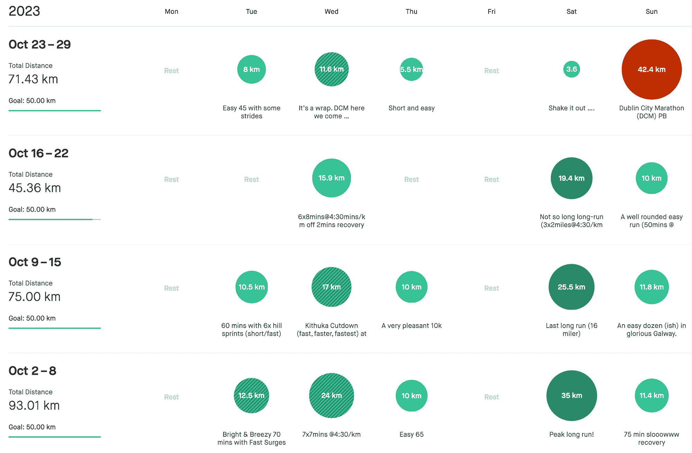

# 改进 Strava 训练日志

> 原文：[`towardsdatascience.com/improving-the-strava-training-log-4d2039c49ec4?source=collection_archive---------5-----------------------#2023-11-16`](https://towardsdatascience.com/improving-the-strava-training-log-4d2039c49ec4?source=collection_archive---------5-----------------------#2023-11-16)

## 以 Strava、Python 和 Matplotlib 可视化马拉松选手的训练模式。

 [barrysmyth](https://barrysmyth.medium.com/?source=post_page-----4d2039c49ec4--------------------------------)

·

[关注](https://medium.com/m/signin?actionUrl=https%3A%2F%2Fmedium.com%2F_%2Fsubscribe%2Fuser%2Fa995c3b2ae8&operation=register&redirect=https%3A%2F%2Ftowardsdatascience.com%2Fimproving-the-strava-training-log-4d2039c49ec4&user=barrysmyth&userId=a995c3b2ae8&source=post_page-a995c3b2ae8----4d2039c49ec4---------------------post_header-----------) 发表在 [Towards Data Science](https://towardsdatascience.com/?source=post_page-----4d2039c49ec4--------------------------------) ·12 min read·Nov 16, 2023

--

作为一名马拉松选手，我经常使用 [Strava](https://www.strava.com/athletes/3546831)。这是一个非常棒的应用程序。除了所有常见的社交功能（分享活动、了解朋友的动态、查看俱乐部的活动等），我还依赖 Strava 来跟踪所有的活动，并定期分析我的训练进展。我喜欢使用 [*Strava 的训练日志*](https://support.strava.com/hc/en-us/articles/206535704-Training-Log) 来回顾我当前的训练情况，与往年进行比较，但不幸的是，这并不是 Strava 的亮点，尽管训练日志是高级功能。

问题之一是训练日志提供的信息非常有限。例如，在下面的示例训练日志中，我们看到几周的活动（彩色圆圈），这些活动总结了训练活动的频率和距离，但没有任何关于训练强度或努力的信息。因此，我认为研究如何改进这一点会是一个有趣的副项目……

作者的 Strava 训练日志的一部分；截图由作者生成。
