# 大型语言模型中的上下文学习方法

> 原文：[`towardsdatascience.com/in-context-learning-approaches-in-large-language-models-9c0c53b116a1?source=collection_archive---------0-----------------------#2023-07-01`](https://towardsdatascience.com/in-context-learning-approaches-in-large-language-models-9c0c53b116a1?source=collection_archive---------0-----------------------#2023-07-01)

## 简单而强大的技术，使大型语言模型在推理时能够学习新任务

 [Javaid Nabi](https://medium.com/@javaid.nabi?source=post_page-----9c0c53b116a1--------------------------------)

·

[关注](https://medium.com/m/signin?actionUrl=https%3A%2F%2Fmedium.com%2F_%2Fsubscribe%2Fuser%2F70c04bf6660e&operation=register&redirect=https%3A%2F%2Ftowardsdatascience.com%2Fin-context-learning-approaches-in-large-language-models-9c0c53b116a1&user=Javaid+Nabi&userId=70c04bf6660e&source=post_page-70c04bf6660e----9c0c53b116a1---------------------post_header-----------) 发表在 [Towards Data Science](https://towardsdatascience.com/?source=post_page-----9c0c53b116a1--------------------------------) ·17 min read·2023 年 7 月 1 日

--

# 介绍

语言建模（LM）旨在对词序列的生成概率进行建模，以预测未来（或缺失）标记的概率。近年来，语言模型在自然语言处理（NLP）领域带来了革命性变化。现在已经广泛认识到，增加语言模型的规模（例如训练计算、模型参数等）可以在一系列下游 NLP 任务中带来更好的性能和样本效率。调查论文“*大型语言模型调查*” [1] 涵盖了大型语言模型几乎所有的方面。该论文提供了对 LLMs 文献的最新回顾，详细介绍了预训练方法、指令调优技术及最新的 RLHF 方法的进一步对齐训练。指令调优和对齐调优方法用于根据具体目标调整 LLMs。

*在预训练或适应性调优之后，使用 LLMs 的主要方法是设计合适的提示策略来解决各种任务。* *一种典型的提示方法，也称为上下文学习（ICL），以自然语言文本的形式制定任务描述和/或示例。*

# 上下文学习

LLMs 展示了一种上下文学习（ICL）能力，即从上下文中的几个示例中学习。许多研究表明，LLMs 可以通过 ICL 执行一系列复杂任务，例如解决数学推理问题。

上下文学习的关键思想是通过类比进行学习。下图展示了语言模型如何通过 ICL 进行决策的示例。首先，ICL 需要几个示例来形成演示上下文。这些示例通常以自然语言模板的形式编写。然后，ICL 将查询问题和一段演示上下文拼接在一起，形成提示，接着将其输入语言模型进行预测 [2]。

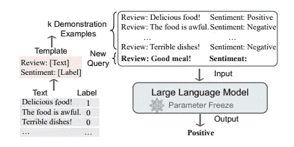

[上下文学习示例](https://arxiv.org/pdf/2301.00234.pdf)

与需要使用反向梯度更新模型参数的监督学习不同，ICL 不进行参数更新，而是直接对预训练的语言模型进行预测。模型期望从示例中学习隐藏的模式，从而做出正确的预测。

## 什么使得 ICL 具有吸引力？

1.  用自然语言编写的示例提供了一个可解释的接口，与 LLMs 进行交流。这个范式使得通过更改示例和模板将人类知识融入 LLMs 变得更加容易。

1.  这类似于人类通过类比进行的决策过程。

1.  与监督训练相比，ICL 是一种无需训练的学习框架。这不仅大大降低了将模型调整到新任务的计算成本，还使语言模型即服务成为可能，并且可以轻松应用于大规模的真实任务。

## 但这如何运作呢？

经过预训练，LLM 能够展示出引人注目的 ICL 能力（新兴能力），而无需更新[3]。虽然直观上合理，但 ICL 的工作机制仍不清楚，且少有研究对这两个问题提供了初步解释。

## 预训练如何影响 ICL 能力？

研究人员建议，当预训练模型达到大规模预训练步骤或模型参数时，它会获得一些新兴的 ICL 能力[3]。一些研究还表明，ICL 能力随着 LLM 参数从 1 亿增加到 1750 亿而增长。研究表明，训练任务的设计是影响 LLM ICL 能力的重要因素。除了训练任务，最近的研究还探讨了 ICL 与预训练语料库之间的关系。研究显示，ICL 的表现更多依赖于预训练语料库的来源，而非规模。

## LLM 在推理过程中如何执行 ICL？

在论文“*为什么 GPT 能在上下文中学习？*”[4]中，研究人员发现了 Transformer 注意力和梯度下降之间的双重形式，并进一步提出将 ICL 理解为隐式微调。他们比较了基于 GPT 的 ICL 和真实任务上的显式微调，发现 ICL 在多个方面表现得类似于微调。在这个框架下，ICL 过程可以解释为：通过前向计算，LLM 生成相对于演示的元梯度，并通过注意力机制隐式执行梯度下降。

斯坦福研究的另一个视角[5]解释了‘*上下文学习作为隐式贝叶斯推断*’。作者提供了一个框架，其中语言模型通过使用提示来“定位”其在预训练过程中学到的相关概念以完成任务。从理论上讲，我们可以将其视为在提示条件下的潜在概念的贝叶斯推断，这一能力来自于预训练数据中的结构（长期一致性）。

尽管已有一些答案，这项研究仍在不断发展，以更好地理解其机制和潜在原因。

# 上下文学习方法

现在让我们探讨一些流行的 ICL 方法。

+   思维链（COT）

+   自一致性 COT

+   思维树

## 思维链（COT）

观察发现，标准提示技术（也称为一般输入输出提示）在复杂推理任务（如算术推理、常识推理和符号推理）上表现不佳。思维链是一种改进的提示策略，用于提升 LLM 在涉及推理的复杂案例中的表现[6]。与 ICL 中仅使用输入输出对构建提示不同，思维链将可以导致最终输出的中间推理步骤纳入提示中。如下例所示。

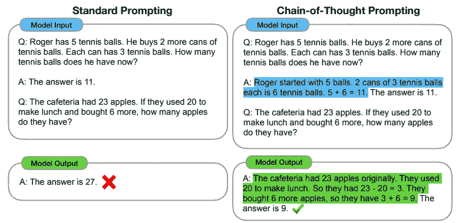

[参考文献[6]](https://arxiv.org/pdf/2201.11903.pdf)

上图显示了一个模型生成思维链来解决数学词汇问题的示例，否则它会得到错误的答案。在左侧的 ICL 中，模型提供了数学推理问题的示例或演示及直接答案。但模型无法预测正确答案。

在右侧的 COT 中，模型呈现一个中间步骤以帮助得出给定示例/演示的答案。我们可以看到，当现在要求模型回答类似的推理问题时，它能够正确预测答案，从而证明了 COT 方法在此类用例中的有效性。

如果你看到，一般来说 COT 或 ICL 提供一些示例来演示用例，这称为 **少样本（少量示例）**。还有一篇论文 [7] 提出了有趣的提示 *“让我们一步步思考……”*，没有任何示例来演示用例，这称为 **零样本（没有示例）**。

在 **零样本 CoT** 中，LLM 首先通过 *“让我们一步步思考”* 生成推理步骤，然后通过 *“因此，答案是”* 推导出最终答案。他们发现，当模型规模超过某一大小时，这种策略显著提升了性能，但对小规模模型效果不佳，显示出显著的突现能力模式。

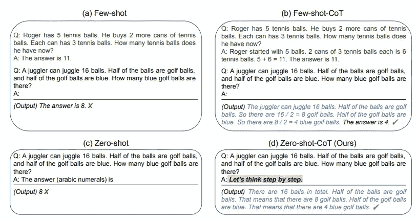

[参考文献[7]](https://arxiv.org/pdf/2205.11916.pdf)

上图：GPT-3 的示例输入和输出，包括 (a) 标准少样本 (ICL)、(b) 少样本-CoT、(c) 标准零样本 (ICL) 和 (d) 我们的方法 (零样本-CoT)。

类似于少样本-CoT，零样本-CoT 促进了多步骤推理（蓝色文本），并在标准提示失败的情况下得出正确答案。与每个任务使用逐步推理示例的少样本-CoT 不同，零样本-CoT 不需要任何示例，只需在所有任务中使用相同的提示 *“让我们一步步思考”*（算术、符号、常识和其他逻辑推理任务）。

这项研究表明，通过添加一个简单的提示 *“让我们一步步思考”*，LLMs 是相当不错的零样本推理器，以促进在回答每个问题之前逐步思考。

## 让我们看看下面发生了什么：

尽管零样本-CoT 概念上很简单，但它使用了两次提示来提取推理和答案，如下图所示。

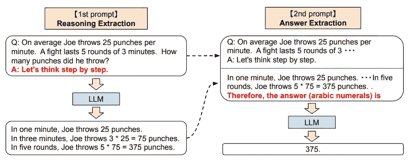

[参考文献[7]](https://arxiv.org/pdf/2205.11916.pdf)

> 该过程包括两个步骤：首先是“**推理提示提取**”以从语言模型中提取完整的推理路径，然后使用第二步“**答案提示提取**”以从推理文本中提取正确格式的答案。

## **第一个提示 — 推理提取**

在此步骤中，首先使用简单模板 **“Q: [X]. A: [T]”** 将输入问题 x 修改为提示 x’，其中 [X] 是 x 的输入槽，[T] 是用于提取思考链以回答问题 x 的手工触发句 t 的槽。例如，如果我们使用 *“让我们一步一步地思考”* 作为触发句，那么提示 x’ 将是 **“Q: [X]. A: 让我们一步一步地思考。”** 提示文本 x’ 然后输入到语言模型中，生成随后的句子 z。我们可以使用任何解码策略。

其他一些此类提示的例子：

> 让我们从逻辑上考虑一下这个问题。
> 
> 让我们通过将问题拆分成步骤来解决这个问题。
> 
> 让我们像侦探一样一步一步思考。
> 
> 在我们深入回答之前。

## **第二步提示——答案提取**

在第二步中，生成的句子 z 与提示的句子 x’ 一起用于从语言模型中提取最终答案。具体来说，将三个元素简单地连接在一起，如 **“[X’] [Z] [A]”： [X’]** 为第一步提示 x’，[Z] 为第一步生成的句子 z，[A] 为提取答案的触发句。这个步骤的提示是自我增强的，因为提示中包含了由相同语言模型生成的句子 z。在实验中，作者根据答案格式使用了略微不同的答案触发器。

例如，使用 *“因此，在 A 到 E 之间，答案是”* 来处理 **多项选择题**，以及 *“因此，答案（阿拉伯数字）是”* 来处理需要 **数值答案** 的数学问题。

论文 [7] 提出了有趣的想法、各种提示的表现等，请阅读以获取更多细节。

## **CoT 何时对 LLMs 有效？**

仅对足够大的模型（例如，通常包含 10B 或更多参数）有正面效果，而对小模型没有。这一现象被称为大型语言模型的‘*涌现能力*’。如果某种能力在较小的模型中不存在，但在较大的模型中存在，则该能力被认为是涌现的 [3]。

+   这主要有效于改进需要逐步推理的任务，如算术推理、常识推理和符号推理。

+   对于那些不依赖于复杂推理的任务，它可能表现得比标准方法更差。有趣的是，CoT 提示所带来的性能提升似乎只有在标准提示效果较差时才会显著。

## **为什么 LLMs 可以进行 CoT 推理？**

+   广泛 *假设* 这可以归因于对代码的训练，因为在其上训练的模型表现出强大的推理能力。直观地看，代码数据有良好的算法逻辑和编程流程，这可能有助于提高 LLMs 的推理表现。**然而，这一假设仍然缺乏公开报告的消融实验证据（有无对代码的训练）。**

+   CoT 提示与标准提示的主要区别在于*在最终答案之前融入了推理路径*。因此，一些研究人员探讨了推理路径中不同组成部分的效果。具体来说，一项最近的研究确定了 CoT 提示中的三个关键组成部分，即符号（例如，算术推理中的数值量）、模式（例如，算术推理中的方程式）和文本（即其余的非符号或模式的令牌）。研究表明，后两部分（即模式和文本）对模型性能至关重要，移除其中任何一个都会导致性能显著下降。

这是一个活跃的研究领域，关于这一点的深入讨论请阅读 [2]。还有一项有趣的研究 [8] 讨论了变压器模型中的上下文学习的可能原因。

## 自一致性 COT

在 COT 中，作者在 [9] 中提出了一种称为自一致性的解码策略，以取代在链式思维提示中使用的贪婪解码策略，这种策略显著提高了语言模型的推理性能。自一致性利用了这样一个直觉，即复杂的推理任务通常允许多个推理路径达到正确答案。问题需要更多的深思熟虑和分析时，可以恢复答案的推理路径的多样性就越大。

> 首先用链式思维提示语言模型，然后作者提出了**“采样和边际化”**解码过程，而不是贪婪地解码最优推理路径。

下图通过一个例子说明了自一致性方法。

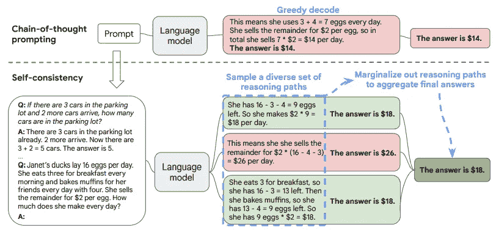

[参考文献[9]](https://arxiv.org/pdf/2203.11171.pdf)

首先从语言模型的解码器中生成一组多样化的推理路径；每条推理路径可能会导致不同的最终答案，因此通过对采样的推理路径进行边际化来确定最一致的答案。换句话说，通过对模型的解码器中的答案进行多数投票，我们可以在最终答案集中得到最“一致”的答案。

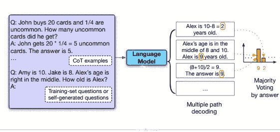

[多数投票示例](https://www.arxiv-vanity.com/papers/2210.11610/)

这种方法类似于人类经验，如果多种不同的思维方式得到相同的答案，则对最终答案的正确性信心更大。与其他解码方法相比，自一致性避免了贪婪解码中的重复性和局部最优性，同时减轻了单次采样生成的随机性。

> 大量实证评估显示，自一致性显著提高了链式思维提示在多个流行的算术和常识推理基准上的表现，包括 GSM8K（+17.9%）、SVAMP（+11.0%）、AQuA（+12.2%）、StrategyQA（+6.4%）和 ARC-challenge（+3.9%）。

自一致性的一个**限制**是它带来了更高的计算成本。实际上，人们可以尝试少量路径（例如 5 或 10）作为起点，以实现大多数收益，同时不产生过多成本，因为在大多数情况下，性能会迅速饱和。

## 思维树

[10] 的作者提出了“*思维树*”（ToT），它在“*链式思维*”方法上进行了概括，以提示语言模型，并允许在作为解决问题的中间步骤的连贯文本单元（“思维”）上进行探索。ToT 允许语言模型通过考虑多个不同的推理路径并自我评估选择来进行深思熟虑的决策，同时在必要时前瞻或回溯以做出全局选择。结果/实验表明，ToT 在需要非平凡规划或搜索的三项新任务（24 点游戏、创意写作和迷你填字游戏）上显著提升了语言模型的解决问题能力。

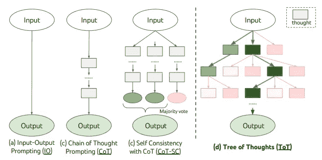

[示意图说明了各种提示方法，每个矩形框代表一个思维](https://arxiv.org/pdf/2305.10601.pdf)

思维树（ToT）允许语言模型（LMs）在思维上探索多个推理路径（见上图）。ToT 将任何问题框架化为对树的搜索，其中每个节点是一个状态 s = [x, z1···i]，代表具有输入 x 和到目前为止的思维序列 zi 的部分解决方案。ToT 做了 4 件事：**思维分解、思维生成器、状态评估器和搜索算法**。

1\. **思维分解：** 将中间过程分解为思维步骤：

虽然 CoT 在没有明确分解的情况下连贯地采样思维，ToT 利用问题特性设计和分解中间思维步骤。如*表 1*所示，依赖于不同的问题，思维可以是几个单词（填字游戏）、一行方程式（24 点游戏）或一整段写作计划（创意写作）。这就像你将问题分解成几个任务。每个任务是我们讨论的步骤 Zn。请注意，这部分仅涉及将问题分解为任务。就像规划一样，我们在这部分并不实际进行任何思维。

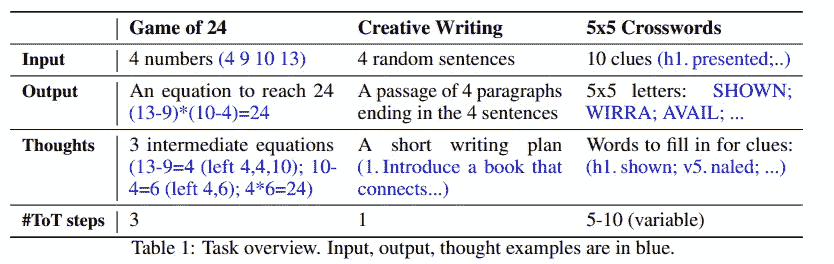

[参考文献 [10]](https://arxiv.org/pdf/2305.10601.pdf)

2\. **思维生成：** 在我们为每一步定义任务后，实际生成思维。我们尝试生成 k 个思维作为给定步骤 Zn 的候选项。生成思维有两种方式：采样和提出。

a. 从 CoT 提示中抽取 i.i.d. 思维。我们独立重复生成过程 k 次。当思维空间丰富时（例如，每个思维是一个段落），i.i.d. 样本能带来多样性。

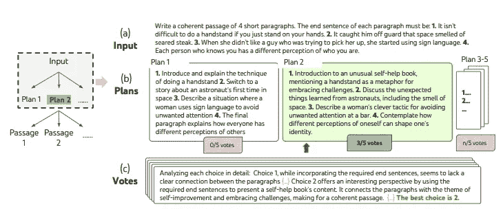

[在随机选择的创造性写作任务中的一次深思熟虑的搜索步骤。](https://arxiv.org/pdf/2305.10601.pdf)

在上图中，展示了在随机选择的**创造性写作任务**中的一步深思熟虑的搜索。给定输入，LM 采样了 5 个不同的计划，然后投票 5 次决定哪个计划最佳。多数选择被用来随后用相同的样本-投票程序写出输出段落。

b. 使用“提出提示”顺序提出思维。当思维空间更受限时（例如，每个思维只是一个词或一行），在同一上下文中提出不同的思维可以避免重复。在这种情况下，我们在一次推理中生成 k 个思维。因此，这些 k 个思维可能并不独立。

3\. **评估状态：** 在这一部分，我们定义一个状态评估函数：v(s)。为了扩展树，我们使用这个函数找到好的路径，就像在棋类编程中一样。我们评估给定的树路径*s=[x, z1…i]*。有两种方法来定义评估函数：

+   独立评估每个状态：每个状态‘s’（或路径）将被独立评估。[*示例：24 点游戏*]

+   跨状态投票：每个状态‘s’ 将在所有状态集合 S 中进行评估。就像你在自我一致性 COT 中比较 S 中的状态一样。[*示例：创造性写作任务*]

**24 点游戏示例：**

24 点游戏是一种数学推理挑战，其目标是使用 4 个数字和基本的算术运算（+-*/）得到 24。例如，给定输入“4 9 10 13”，一种解决方案可能是“(10–4) * (13–9) = 24”。

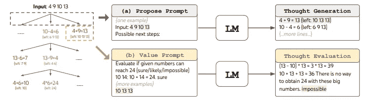

[‘24 点游戏’ ToT 分解。LM 被提示进行 (a) 思维生成和 (b) 评估。](https://arxiv.org/pdf/2305.10601.pdf)

为了将‘*24 点游戏*’框架转入 ToT，我们将思维分解为 3 个步骤，每个步骤是一个中间方程。如上图（a）所示，在每个树节点，我们提取“左侧”数字，并提示 LM 提出一些可能的下一步。所有 3 个思维步骤使用相同的“提出提示”，尽管它只有一个包含 4 个输入数字的示例。我们在 ToT 中执行广度优先搜索（BFS），在每一步我们保留最佳的 b = 5 个候选项。为了在 ToT 中执行深思熟虑的 BFS，如图（b）所示，我们提示 LM 评估每个思维候选项为“确定/可能/不可能”，以判断是否能达到 24。目的是推广可以在少量前瞻试验中判定的正确部分解决方案，并根据“过大/过小”的常识消除不可能的部分解决方案，保留其余的“可能”。我们对每个思维进行 3 次采样。

4\. **搜索算法**：我们尝试扩展树。对于每个叶子节点，我们使用状态评估函数对其进行评估。选择哪个叶子节点进行评估时，我们使用搜索算法。它可以是广度优先搜索或深度优先搜索。根据树的结构，可以插入不同的搜索算法。

从概念上讲，ToT 作为一种通用问题解决方法具有若干优点：

+   **通用性**：IO、CoT、CoT-SC 和自我修正可以视为 ToT 的特例（即有限深度和广度的树）。

+   **模块化**：基础语言模型以及思维分解、生成、评估和搜索过程都可以独立变化。

+   **适应性**：可以适应不同的问题属性、语言模型能力和资源限制。

+   **便利性**：无需额外培训，只需一个预训练的语言模型即可。

ToT 框架使语言模型能够更自主和智能地做出决策和解决问题。

**局限性**：ToT 需要比采样方法更多的资源（例如模型 API 成本）以提高任务表现，但 ToT 的模块化灵活性允许用户自定义这种性能-成本权衡，并且持续的开源努力应该能在不久的将来降低这些成本。

# 自动提示技术

提示工程是一门经验科学，提示工程方法的效果在模型之间可能差异很大，因此需要大量实验和启发式方法。*我们能否自动化这种提示工程过程？* 这是一个活跃的研究领域，以下部分讨论了一些自动提示设计方法的尝试。

## 自动提示增强与选择 COT

在题为“*基于标记数据的链式思维自动提示增强与选择*”的论文中[11]。大多数 CoT 研究依赖于精心设计的人类标注的理性链来提示语言模型，这在实际应用中提出了挑战，因为标记的训练数据可用，但没有人类标注的理性链。为了自动构建链式思维提示，作者建议了增强-修剪-选择的三步过程：

1.  **增强**：使用少量示例或零示例 CoT 提示生成多个伪链式思维；

1.  **修剪**：根据生成的答案是否与真实值匹配来修剪伪链。

1.  **选择**：应用减少方差的策略梯度策略来学习选定示例的概率分布，同时将示例的概率分布视为策略，将验证集的准确性视为奖励。

## Auto-CoT：自动链式思维提示

在“*大规模语言模型中的自动化链式思维提示*”[12]中，作者提出了 Auto-CoT 范式，以自动构建带有问题和推理链的示例。在这一技术中，作者采用了聚类技术来抽样问题，然后生成链。作者观察到，LLM 往往会犯某些类型的错误。一种错误可能在嵌入空间中类似，因此被分组在一起。通过仅从频繁错误簇中抽取一个或几个样本，我们可以防止过多错误类型的错误示例，并收集多样的例子。

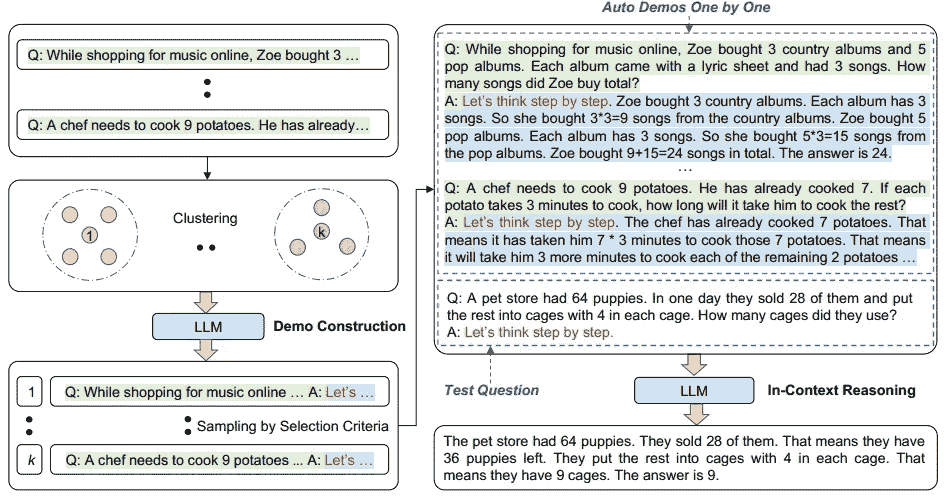

[Auto-COT : 自动化链式思维提示](https://arxiv.org/pdf/2210.03493.pdf)

**Auto-CoT**包括以下主要阶段：

1.  **问题聚类**：对给定的问题集 Q 进行聚类分析。首先通过 Sentence-BERT 计算 Q 中每个问题的向量表示。将上下文化的向量平均化以形成固定大小的问题表示。然后，使用 k-means 聚类算法处理问题表示，生成 k 个问题簇。

1.  **示例选择**：从每个簇中选择一组具有代表性的问题；即从一个簇中选择一个示例。每个簇中的样本按距离簇中心的远近排序，距离中心较近的样本优先选择。

1.  **推理生成**：使用零-shot CoT 为选定的问题生成推理链，并构建少-shot 提示以进行推理。

LLM 在 CoT 提示下展示了推理能力。Manual-CoT 的优越性能依赖于手工制作示例。为了消除这种手工设计，提出的 Auto-CoT 自动构建示例。它抽样具有多样性的问题并生成推理链以构建示例。对推理数据集的实验结果表明，在 GPT-3 上，Auto-CoT 的表现始终与需要手工设计示例的 CoT 范式相匹配或超越。

# 结论

上下文学习或提示有助于我们与 LLM 沟通，以引导其行为实现期望的结果。这是一种提取信息的有吸引力的方法，因为你不需要大量的离线训练集，不需要离线访问模型，并且即使对于非工程师也感觉直观。提示工程旨在利用提示作为为实际应用构建可靠功能的方法。这是一门经验科学，提示工程方法的效果在模型之间可能差异很大，因此需要大量实验和启发式方法。提示需要大量人力来创建和适应新的数据集。注释过程并不简单，因为人类不仅需要选择问题，还需要仔细设计每个问题的推理步骤，因此有必要对提示技术进行自动化。

# 参考文献

[1] 大型语言模型调查，[`arxiv.org/pdf/2303.18223.pdf`](https://arxiv.org/pdf/2303.18223.pdf)

[2] 上下文学习调查，[`arxiv.org/pdf/2301.00234.pdf`](https://arxiv.org/pdf/2301.00234.pdf)

[3] 大型语言模型的突现能力，[`arxiv.org/pdf/2206.07682.pdf`](https://arxiv.org/pdf/2206.07682.pdf)

[4] 为什么 GPT 可以进行上下文学习？语言模型隐式地执行梯度下降作为元优化器，[`arxiv.org/pdf/2212.10559.pdf`](https://arxiv.org/pdf/2212.10559.pdf)

[5] 将上下文学习解释为隐式贝叶斯推理，[`ai.stanford.edu/blog/understanding-incontext/`](http://ai.stanford.edu/blog/understanding-incontext/)

[6] 链式思维提示激发大型语言模型中的推理，[`arxiv.org/pdf/2201.11903.pdf`](https://arxiv.org/pdf/2201.11903.pdf)

[7] 大型语言模型是零样本推理者，[`arxiv.org/pdf/2205.11916.pdf`](https://arxiv.org/pdf/2205.11916.pdf)

[8] 上下文学习与归纳头。Transformer 电路，2022。[`transformer-circuits.pub/2022/in-context-learning-and-induction-heads/index.html`](https://transformer-circuits.pub/2022/in-context-learning-and-induction-heads/index.html)

[9] 自洽性提升了 LLM 中的链式思维推理，[`arxiv.org/pdf/2203.11171.pdf`](https://arxiv.org/pdf/2203.11171.pdf)

[10] 思维树，[`arxiv.org/pdf/2305.10601.pdf`](https://arxiv.org/pdf/2305.10601.pdf)

[11] 自动提示增强与从标注数据中链式思维的选择 [`arxiv.org/pdf/2302.12822.pdf`](https://arxiv.org/pdf/2302.12822.pdf)

[12] 大型语言模型中的自动链式思维提示，[`arxiv.org/pdf/2210.03493.pdf`](https://arxiv.org/pdf/2210.03493.pdf)

[13] 大型语言模型可以自我提升，[`www.arxiv-vanity.com/papers/2210.11610/`](https://www.arxiv-vanity.com/papers/2210.11610/)
