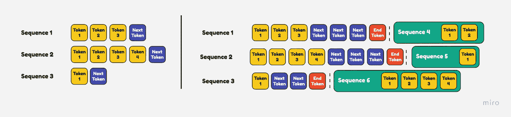

# 将 Llama 2 的延迟和吞吐量性能提高多达 4 倍

> 原文：[`towardsdatascience.com/increase-llama-2s-latency-and-throughput-performance-by-up-to-4x-23034d781b8c?source=collection_archive---------1-----------------------#2023-08-09`](https://towardsdatascience.com/increase-llama-2s-latency-and-throughput-performance-by-up-to-4x-23034d781b8c?source=collection_archive---------1-----------------------#2023-08-09)

## Llama-2 13B 的现实世界基准

  [Het Trivedi](https://medium.com/@het.trivedi05?source=post_page-----23034d781b8c--------------------------------)

·

[关注](https://medium.com/m/signin?actionUrl=https%3A%2F%2Fmedium.com%2F_%2Fsubscribe%2Fuser%2Fce8ebd0c262c&operation=register&redirect=https%3A%2F%2Ftowardsdatascience.com%2Fincrease-llama-2s-latency-and-throughput-performance-by-up-to-4x-23034d781b8c&user=Het+Trivedi&userId=ce8ebd0c262c&source=post_page-ce8ebd0c262c----23034d781b8c---------------------post_header-----------) 发布在 [Towards Data Science](https://towardsdatascience.com/?source=post_page-----23034d781b8c--------------------------------) · 7 分钟阅读 · 2023 年 8 月 9 日

--

作者提供的图像 — 使用 Stable Diffusion 创建

## 介绍

在大型语言模型（LLMs）的领域，将这些先进系统集成到实际的企业应用中是一个迫切的需求。然而，生成式 AI 发展的速度如此之快，以至于大多数人无法跟上这些进展。

一种解决方案是使用如 OpenAI 提供的托管服务。这些托管服务提供了精简的解决方案，但对于那些无法访问这些服务或优先考虑安全和隐私等因素的人，另一个途径是：开源工具。

目前开源生成 AI 工具非常流行，许多公司争相推出其 AI 驱动的应用程序。在快速构建的过程中，公司们常常忘记，要真正从生成 AI 中获得价值，他们需要构建“生产”就绪的应用程序，而不仅仅是原型。

在这篇文章中，我想向你展示 Llama 2 使用两种不同推理方法的性能差异。第一种推理方法是通过 Fast API 服务的容器化 Llama 2 模型，这是一种在开发者中非常受欢迎的选择，用于将模型作为 REST API 端点进行服务。第二种方法是通过 [文本生成推理](https://github.com/huggingface/text-generation-inference) 服务的相同容器化模型，这是 Hugging Face 开发的开源库，用于轻松部署 LLM。

我们正在查看的这两种方法都旨在适用于实际使用，例如在商业或应用程序中。但重要的是要认识到，它们的扩展方式不同。我们将深入比较这两种方法，看看它们各自的表现，并更好地理解差异。

## 支撑 OpenAI 和 Cohere 的 LLM 推理

> 你是否曾经好奇为什么 ChatGPT 这么快？

大型语言模型需要大量计算能力，由于其庞大的规模，它们往往需要多个 GPU。在处理大型 GPU 集群时，公司必须非常注意计算资源的使用情况。

像 OpenAI 这样的 LLM 提供商运行大型 GPU 集群来支撑其模型的推理。为了最大限度地提高 GPU 性能，他们使用像 [**Nvidia Triton 推理服务器**](https://docs.nvidia.com/deeplearning/triton-inference-server/user-guide/docs/index.html) 这样的工具来提高吞吐量并减少延迟。

插图灵感来源 — [Triton 推理服务器架构](https://developer.nvidia.com/triton-inference-server)

尽管 Triton 性能卓越且有许多优点，但对于开发者来说使用起来非常困难。许多 Hugging Face 上的较新模型在 Triton 上不受支持，添加对这些模型的支持的过程也并不简单。

这时，[**文本生成推理**](https://github.com/huggingface/text-generation-inference) **（TGI）** 就派上用场了。这个工具提供了与 Triton 相同的性能提升，但它更用户友好，并且与 Hugging Face 模型兼容性好。

## LLM 推理优化

在我们深入基准测试之前，我想介绍一些现代推理服务器如 TGI 用于加速 LLM 的优化技术。

1.  **张量并行**

LLM 通常太大而无法容纳在单个 GPU 上。通过一种称为 **模型并行** 的概念，可以将模型分割到多个 GPU 上。**张量并行** 是一种模型并行，它将模型分割成多个由不同 GPU 独立处理的分片。

插图灵感来自于 [来源](https://aws.amazon.com/blogs/machine-learning/deploy-large-models-at-high-performance-using-fastertransformer-on-amazon-sagemaker/)

简而言之，想象你在拼一个大拼图，但它太大了，你无法把所有的拼图片放在一张桌子上。所以，你决定和你的朋友一起工作。你把拼图分成几个部分，每个人同时处理自己的一部分。这样，你可以更快地完成拼图。

**2\. 连续批处理**

当你向 LLM 发起 API 调用时，它会一次性处理并返回结果。如果你发起 5 个 API 调用，它会顺序处理每一个。这实际上意味着我们有一个批处理大小为 1，即每次只能处理 1 个请求。正如你所猜测的，这种设计并不理想，因为每个新请求必须等待前一个请求完成。

插图灵感来自于 [静态批处理](https://www.anyscale.com/blog/continuous-batching-llm-inference) — 需要等所有进程完成后才能处理更多请求

通过增加批处理大小，你可以并行处理更多请求。批处理大小为 4 时，你可以并行处理 5 个 API 调用中的 4 个。你必须等到这 4 个请求全部完成后，才能处理第 5 个请求。

插图灵感来自于 [连续批处理](https://www.anyscale.com/blog/continuous-batching-llm-inference) — 你可以立即处理新请求，而不必等待所有进程完成

**连续批处理**基于使用更大批处理大小的想法，并进一步通过立即处理新任务来提升效率。例如，假设你的 GPU 的批处理大小为 4，这意味着它可以并行处理 4 个请求。如果你发起 5 个请求，其中 4 个会被并行处理，而第一个完成的进程会立即处理第 5 个请求。

## Llama 2 基准测试

现在我们对优化方案有了基本的理解，能够实现更快的 LLM 推理，让我们来看一下**Llama-2 13B**模型的一些实际基准。

我想测试这个模型的 2 个主要指标：

+   吞吐量（tokens/second）

+   延迟（完成一次完整推理所需的时间）

我想比较 Llama 推理在两种不同实例上的性能。一种实例通过 FastAPI 运行，而另一种通过 TGI 操作。两个设置都利用了 GPU 进行计算。

> 注意：这两个实例都没有量化模型的权重。

TGI 设置利用了两个 GPU*(NVIDIA RTX A4000)*的强大性能来实现并行，而 FastAPI 依赖于一个*(NVIDIA A100)*，尽管更强大的 GPU。

直接比较这两种方法有点棘手，因为 FastAPI 不允许模型分布在两个 GPU 上。为了公平起见，我选择为 FastAPI 实例配备了更强大的 GPU。

对模型发出的每个 API 请求都使用**相同的提示**，生成的输出 token 限制设置为**128 tokens**。

**吞吐量结果：**

左：Fast API 与 TGI 吞吐量 | 右：平均吞吐量提升 — 作者插图

分析：

+   在这两种情况下，随着推理请求数量的增加，吞吐量都会下降。

+   批处理显著提高了 LLM 的吞吐量，这就是为什么 TGI 的吞吐量更好的原因。

+   尽管 Fast API 实例具有更多的 GPU 内存（VRAM）用于处理更大的批次请求，但它处理这个过程并不高效。

**延迟结果：**

左：Fast API 与 TGI 延迟 | 右：平均延迟性能提升 — 作者插图

分析：

+   张量并行使 TGI 的延迟减少了近 5 倍！

+   随着请求数量的增加，基于 Fast API 的实例的延迟超过 100 秒。

从结果中可以看出，与现成的 API 包装器相比，优化过的推理服务器具有很高的性能。作为最终测试，我想评估当生成的输出 token 限制增加到**256 tokens**时 TGI 的性能，与**128 tokens**相比。

**吞吐量 TGI 128 tokens 与 256 tokens：**

128 token 与 256 token TGI 吞吐量测试 — 作者插图

正如你所见，尽管生成的 token 数量翻倍，但吞吐量非常相似。需要注意的是，这张图表没有显示，在 300 个并发请求时，吞吐量降到大约 2 token/秒，同时生成 256 token 的输出。此时，延迟超过每个请求 100 秒，并且出现了多次请求超时。由于这些显著的性能限制，这种情况的结果被排除在图表之外。

**延迟 TGI 128 tokens 与 256 tokens：**

128 token 与 256 token TGI 延迟测试 — 作者插图

与吞吐量不同，生成更长文本序列时，延迟明显增加。增加更多的 GPU 可以帮助减少延迟，但会带来财务成本。

## 结论

我写这篇博客的目标是比较大规模 LLM 的实际性能*(每秒数百个请求)*。通常情况下，部署模型在像 Fast API 这样的 API 包装器后是很简单的，但对于 LLM 而言，你可能会错过相当多的性能。

即使使用现代推理服务器的优化技术，其性能也无法与像 ChatGPT 这样的托管服务相比。OpenAI 当然运行了几个大型 GPU 集群来为他们的模型提供推理支持，并结合了他们自己内部的优化技术。

然而，对于生成式 AI 的使用场景，企业可能需要采用推理服务器，因为它们在可扩展性和可靠性方面远超传统的模型部署技术。

感谢阅读！

平静。
