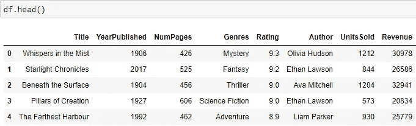
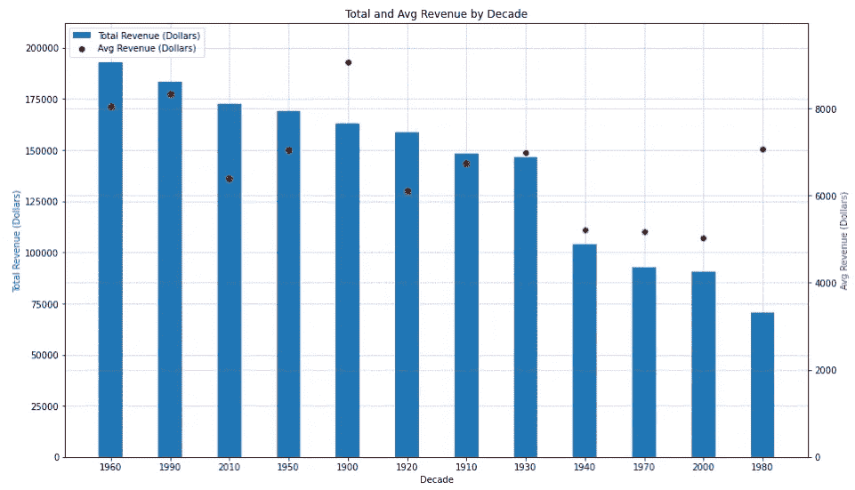
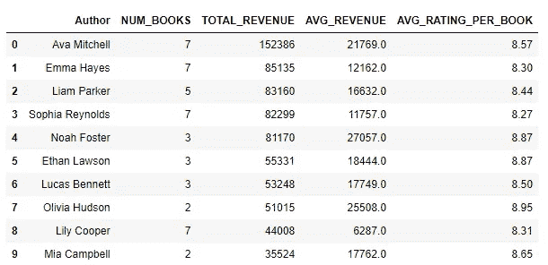
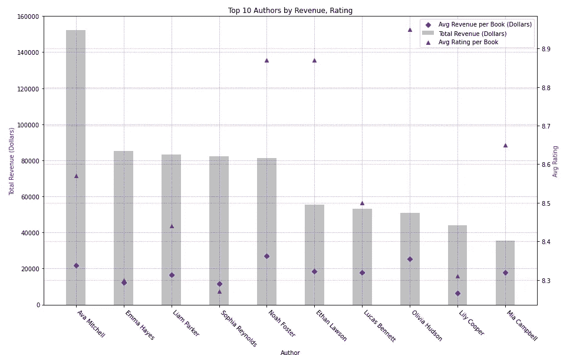
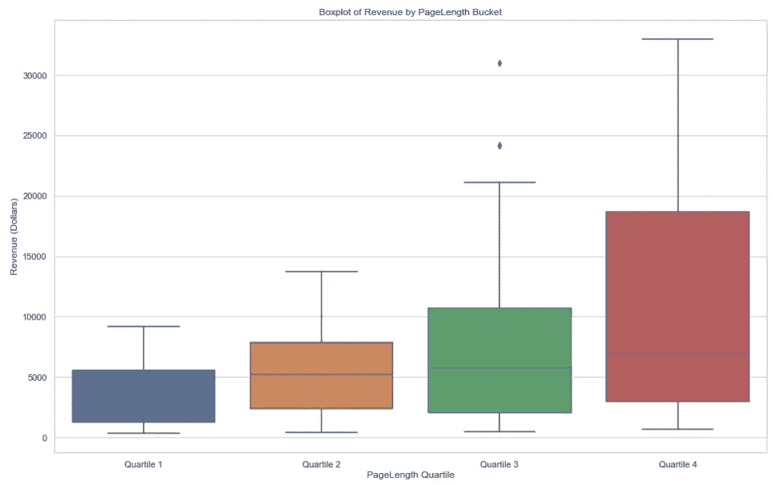

# 《从数据到洞察：使用书店分析比较 SQL 和 Python 查询》

> 原文：[`towardsdatascience.com/ink-to-insights-comparing-sql-and-python-queries-using-bookshop-analytics-90e3bb200671`](https://towardsdatascience.com/ink-to-insights-comparing-sql-and-python-queries-using-bookshop-analytics-90e3bb200671)

## 哪种方法更适合你的探索性数据分析？

[](https://medium.com/@john_lenehan?source=post_page-----90e3bb200671--------------------------------)[](https://towardsdatascience.com/?source=post_page-----90e3bb200671--------------------------------) [John Lenehan](https://medium.com/@john_lenehan?source=post_page-----90e3bb200671--------------------------------)

·发表在 [Towards Data Science](https://towardsdatascience.com/?source=post_page-----90e3bb200671--------------------------------) ·阅读时间 9 分钟·2023 年 9 月 1 日

--


由 [Ayman Yusuf](https://unsplash.com/@ayman_yusuf97?utm_source=medium&utm_medium=referral) 在 [Unsplash](https://unsplash.com/?utm_source=medium&utm_medium=referral) 提供的照片

SQL 是任何数据科学家工具箱中的基础技能 — 能够迅速从数据源中提取数据进行分析是处理大量数据时的必备技能。在这篇文章中，我想给出一些我在 SQL 中通常使用的基本查询的示例，贯穿整个探索性数据分析过程。我将这些查询与在 Python 中产生相同输出的类似脚本进行比较，以便对这两种方法进行比较。

在这次分析中，我将使用一些关于去年最高评分图书的合成数据，这些数据来自一个假设的书店连锁（总虚构书店）。关于此项目的 GitHub 文件夹的链接可以在[这里](https://github.com/jlenehan/Bookshop_EDA)找到，在那里我详细介绍了如何进行分析。


由 [Eugenio Mazzone](https://unsplash.com/@eugi1492?utm_source=medium&utm_medium=referral) 在 [Unsplash](https://unsplash.com/?utm_source=medium&utm_medium=referral) 提供的照片

额外说明 — 尽管本文主要关注 SQL 查询，但值得注意的是，这些查询可以通过 pandaSQL 库与 Python 无缝集成（如我在此项目中所做）。这可以在此项目的 GitHub 链接中的 Jupyter notebook 中详细查看，但这个查询的一般结构如下：

```py
query = """
SELECT * FROM DATA
"""

output = sqldf(query,locals())
output
```

PandaSQL 是一个非常实用的库，对于那些对 SQL 查询比典型的 Pandas 数据集操作更为熟悉的人来说 — 如我将在这里展示的，它通常更容易阅读。

## 数据集

数据集的一部分如下所示——包含书名和出版年份、页数、类型、书籍的平均评分、作者、销售单位数和书籍收入的列。



需分析的合成数据（数据由作者提供）

## 按年代的收入分析

假设我想知道哪个年代出版的书籍对书店最有利。原始数据集中没有书籍出版的年代列——但这相对容易输入数据。我运行子查询，通过整数除法来划分年份并乘以 10 以获得年代数据，然后按年代汇总和平均收入。接着，我按总收入对结果进行排序，以获取书店中最有利的出版年代。

```py
WITH bookshop AS
(
SELECT TITLE, YEARPUBLISHED,
(YEARPUBLISHED/10) * 10 AS DECADE,
NUMPAGES, GENRES, RATING, AUTHOR, UNITSSOLD,
REVENUE
from df
)

SELECT DECADE, SUM(REVENUE) AS TOTAL_REVENUE,
ROUND(AVG(REVENUE),0) AS AVG_REVENUE
FROM bookshop
GROUP BY DECADE
ORDER BY TOTAL_REVENUE DESC
```

相比之下，Python 中的等效输出看起来类似于下面的代码片段。我应用了一个 lambda 函数，该函数进行整数除法并输出年代，然后根据年代汇总收入并按总收入对结果进行排序。

```py
# creating df bookshop
bookshop = df.copy()
bookshop['Decade'] = (bookshop['YearPublished'] // 10) * 10

# group by decade, agg revenue by sum and mean
result = bookshop.groupby('DECADE') \
                 .agg({'Revenue': ['sum', 'mean']}) \
                 .reset_index()

result.columns = ['Decade', 'Total_Revenue', 'Avg_Revenue']

# sorting by decade
result = result.sort_values('Total_Revenue')
```

注意，Python 脚本中有更多的独立步骤来实现相同的结果——函数在初看时很笨拙且难以理解。相比之下，SQL 脚本在展示上要清晰得多，更易于阅读。

我现在可以将这个查询进行可视化，以了解各年代的书籍收入趋势，使用以下脚本设置 matplotlib 图表——条形图显示按年代的总收入，散点图显示平均书籍收入。

```py
# Creating primary y-axis (total revenue)
fig, ax1 = plt.subplots(figsize=(15, 9))
ax1.bar(agg_decade['DECADE'], agg_decade['TOTAL_REVENUE'], 
        width = 0.4, align='center', label='Total Revenue (Dollars)')
ax1.set_xlabel('Decade')
ax1.set_ylabel('Total Revenue (Dollars)', color='blue')

# Adjusting gridlines on the primary y-axis
ax1.grid(color='blue', linestyle='--', linewidth=0.5, alpha=0.5)

# Creating secondary y-axis (avg revenue)
ax2 = ax1.twinx()
ax2.scatter(agg_decade['DECADE'], agg_decade['AVG_REVENUE'], 
         marker='o', color='red', label='Avg Revenue (Dollars)')
ax2.set_ylabel('Avg Revenue (Dollars)', color='red')

# Adjusting gridlines on the secondary y-axis
ax2.grid(color='red', linestyle='--', linewidth=0.5, alpha=0.5)

# Setting the same y-axis limits for both ax1 and ax2
ax1.set_ylim(0, 1.1*max(agg_decade['TOTAL_REVENUE']))
ax2.set_ylim(0, 1.1*max(agg_decade['AVG_REVENUE']))

# Combining legends for both axes
lines, labels = ax1.get_legend_handles_labels()
lines2, labels2 = ax2.get_legend_handles_labels()
ax2.legend(lines + lines2, labels + labels2, loc='upper left')

# Set title
plt.title('Total and Avg Revenue by Decade')

# Show the plot
plt.show()
```

可视化如下所示——1960 年代出版的书籍显然是书店最赚钱的，为“总虚构书店”产生了超过 192,000 美元的收入。相比之下，1900 年代的书籍虽然平均上更有利可图，但销售不如 1960 年代的书籍。



按发布年代的总收入和平均收入（图像由作者提供）

平均书籍收入在所有出版年代中跟随总收入的趋势——除了 1900 年代和 1980 年代的书籍，这些书籍平均上更有利可图，但总体上并不是。

## 作者分析

现在，假设我想获取列表中前 10 位作者的数据，按照他们的总收入排序。对于这个查询，我想知道他们在列表中出现的书籍数量、这些书籍产生的总收入、每本书的平均收入以及这些书籍在书店中的平均评分。用 SQL 回答这个简单问题很容易——我可以使用计数语句来获取他们制作的书籍总数，使用平均语句来获取每位作者的平均收入和评分。随后，我可以按导演对这些语句进行分组。

```py
SELECT AUTHOR,
COUNT(TITLE) AS NUM_BOOKS,
SUM(REVENUE) AS TOTAL_REVENUE,
ROUND(AVG(REVENUE),0) AS AVG_REVENUE,
ROUND(AVG(RATING),2) AS AVG_RATING_PER_BOOK
FROM bookshop
GROUP BY AUTHOR
ORDER BY TOTAL_REVENUE DESC
LIMIT 10
```

一个等效的 Python 脚本如下——长度大致相同，但输出的复杂度更高。我在指定如何在 agg 函数中聚合每列之前，对值按作者进行分组，然后按总收入排序。同样，SQL 脚本的对比明显更清晰。

```py
result = bookshop.groupby('Author') \
                 .agg({
                     'Title': 'count',
                     'Revenue': ['sum', 'mean'],
                     'Rating': 'mean'
                 }) \
                 .reset_index()

result.columns = ['Author', 'Num_Books', 'Total_Revenue', 
                  'Avg_Revenue', 'Avg_Rating_per_Book']

# Sorting for total revenue
result = result.sort_values('Total_Revenue', ascending=False)

# top 10
result_top10 = result.head(10)
```

从下面的查询结果可以看到——Ava Mitchell 领先，书籍销售总收入超过 $152,000。Emma Hayes 位居第二，收入超过 $85,000，Liam Parker 紧随其后，收入超过 $83,000。



书籍作者查询的输出

使用 matplotlib 通过以下脚本进行可视化，我们可以生成总收入的条形图，并且数据点显示每位作者的平均书籍收入。每位作者的平均评分也绘制在第二个坐标轴上。

```py
# Creating figure and axis
fig1, ax1 = plt.subplots(figsize=(15, 9))

#plotting bar chart of total revenue
ax1.bar(agg_author['Author'], agg_author['TOTAL_REVENUE'], 
        width=0.4, align='center', color='silver', label='Total Revenue (Dollars)')
ax1.set_xlabel('Author')
ax1.set_xticklabels(agg_author['Author'], rotation=-45, ha='left')
ax1.set_ylabel('Total Revenue (Dollars)', color='blue')

# Adjusting gridlines on the primary y-axis
ax1.grid(color='blue', linestyle='--', linewidth=0.5, alpha=0.5)

#creating scatter plot of avg revenue
ax1.scatter(agg_author['Author'], agg_author['AVG_REVENUE'], 
         marker="D", color='blue', label='Avg Revenue per Book (Dollars)')

# Creating scatter plot of avg rating on secondary axis
ax2 = ax1.twinx()
ax2.scatter(agg_author['Author'], agg_author['AVG_RATING_PER_BOOK'], 
         marker='^', color='red', label='Avg Rating per Book')
ax2.set_ylabel('Avg Rating', color='red')

# Adjusting gridlines on the secondary y-axis
ax2.grid(color='red', linestyle='--', linewidth=0.5, alpha=0.5)

# Combining legends for both axes
lines, labels = ax1.get_legend_handles_labels()
lines2, labels2 = ax2.get_legend_handles_labels()
ax1.legend(lines + lines2, labels + labels2, loc='upper right')

# Set title
plt.title('Top 10 Authors by Revenue, Rating')

# Show the plot
plt.show()
```

运行此脚本，我们得到以下图表：



收入和评分前 10 名作者（图片由作者提供）

这个图表确实指向了一个相当明确的结论——收入与每位作者的平均评分没有关联。Ava Mitchell 的收入最高，但在上述作者中评分处于中位数。Olivia Hudson 在平均评分方面最高，但总收入排名第 8；作者的收入与其受欢迎程度之间没有可观察到的趋势。

## 比较书籍长度与收入

最后，假设我想展示书籍收入如何根据书籍长度的不同而变化。为了回答这个问题，我首先要将书籍根据书籍长度的四分位数均分为 4 类，这将更好地了解收入与书籍长度的整体趋势。

首先，我在 SQL 中定义四分位数，使用子查询生成这些值，然后通过 case when 语句将书籍分类到这些桶中。

```py
WITH PERCENTILES AS (
    SELECT 
        PERCENTILE_CONT(0.25) WITHIN GROUP (ORDER BY NUMPAGES) 
        AS PERCENTILE_25,
        PERCENTILE_CONT(0.5) WITHIN GROUP (ORDER BY NUMPAGES) 
        AS MEDIAN,
        PERCENTILE_CONT(0.75) WITHIN GROUP (ORDER BY NUMPAGES) 
        AS PERCENTILE_75
    FROM bookshop
)
SELECT 
    TITLE, TITLE, REVENUE, NUMPAGES,
    CASE
        WHEN NUMPAGES< (SELECT PERCENTILE_25 FROM PERCENTILES) 
        THEN 'Quartile 1'
        WHEN NUMPAGES BETWEEN (SELECT PERCENTILE_25 FROM PERCENTILES) 
        AND (SELECT MEDIAN FROM PERCENTILES) THEN 'Quartile 2'
        WHEN NUMPAGES BETWEEN (SELECT MEDIAN FROM PERCENTILES) 
        AND (SELECT PERCENTILE_75 FROM PERCENTILES) THEN 'Quartile 3'
        WHEN NUMPAGES > (SELECT PERCENTILE_75 FROM PERCENTILES) 
        THEN 'Quartile 4'
    END AS PAGELENGTH_QUARTILE
FROM bookshop
ORDER BY REVENUE DESC
```

另外（对于不支持百分位函数的 SQL 方言，如 SQLite），可以单独计算四分位数，然后手动输入到 case when 语句中。

```py
--For SQLite dialect
SELECT TITLE, REVENUE, NUMPAGES,
CASE
WHEN NUMPAGES < 318 THEN 'Quartile 1'
WHEN NUMPAGES BETWEEN 318 AND 375 THEN 'Quartile 2'
WHEN NUMPAGES BETWEEN 375 AND 438 THEN 'Quartile 3'
WHEN NUMPAGES > 438 THEN 'Quartile 4'
END AS PAGELENGTH_QUARTILE
FROM bookshop

ORDER BY REVENUE DESC
```

在 Python 中运行相同的查询时，我使用 numpy 定义百分位数，然后使用 cut 函数将书籍分类到各个桶中，再按照书籍的页数排序。与之前一样，这个过程明显比 SQL 中的等效脚本要复杂。

```py
# Define the percentiles using numpy
percentiles = np.percentile(bookshop['NumPages'], [25, 50, 75])

# Define the bin edges using the calculated percentiles
bin_edges = [-float('inf'), *percentiles, float('inf')]

# Define the labels for the buckets
bucket_labels = ['Quartile 1', 'Quartile 2', 'Quartile 3', 'Quartile 4']

# Create the 'RUNTIME_BUCKET' column based on bin edges and labels
bookshop['RUNTIME_BUCKET'] = pd.cut(bookshop['NumPages'], bins=bin_edges, 
                                labels=bucket_labels)

result = bookshop[['Title', 'Revenue', 
               'NumPages', 'PAGELENGTH_QUARTILE']].sort_values(by='NumPages', 
                                                          ascending=False)
```

这个查询的输出可以通过 seaborn 进行箱线图可视化——生成箱线图的脚本片段如下所示。注意，运行时间的桶被手动排序以正确展示。

```py
# Set the style for the plots
sns.set(style="whitegrid")

#Setting order of profit buckets
pagelength_bucket_order = ['Quartile 1', 'Quartile 2', 
                        'Quartile 3', 'Quartile 4']

# Create the boxplot
plt.figure(figsize=(16, 10))
sns.boxplot(x='PAGELENGTH_QUARTILE', y='Revenue', 
            data=pagelength_output, order = pagelength_bucket_order, 
            showfliers=True)

# Add labels and title
plt.xlabel('PageLength Quartile')
plt.ylabel('Revenue (Dollars)')
plt.title('Boxplot of Revenue by PageLength Bucket')

# Show the plot
plt.show()
```

箱线图如下所示——注意每个书籍长度四分位数的中位收入随着书籍长度增加而上升。这表明较长的书籍在书店里更具盈利性。



按书籍长度四分位数的收入箱线图（图片由作者提供）

此外，第 4 四分位数的范围相比其他四分位数要宽得多，这表明大型书籍的价格点变动更大。

## 最终想法及进一步应用

总的来说，使用 SQL 进行数据分析查询通常比在 Python 中进行等效操作要简单得多；SQL 语言比 Python 查询更易于编写，同时广泛能够产生相同的结果。我不会主张其中任何一个比另一个更好——我在这个分析中使用了这两种语言的组合——而是，我相信使用这两种语言的组合可以产生更高效和有效的数据分析。

因此，考虑到 SQL 查询的书写清晰度高于 Python 查询，我认为在项目的初步 EDA 中使用 SQL 更为自然。正如我在本文中所示，SQL 更容易阅读和编写，这使得它在这些早期探索任务中尤其有利。我在开始项目时经常使用它，并推荐这种方法给任何对 SQL 查询已有相当了解的人。
