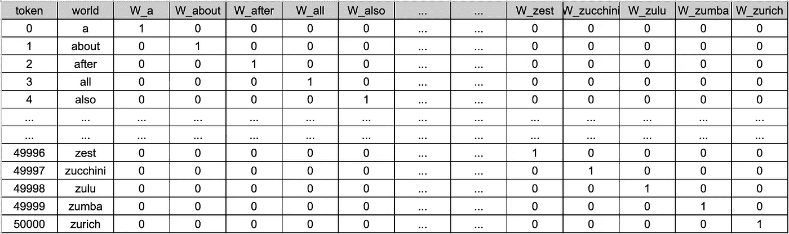
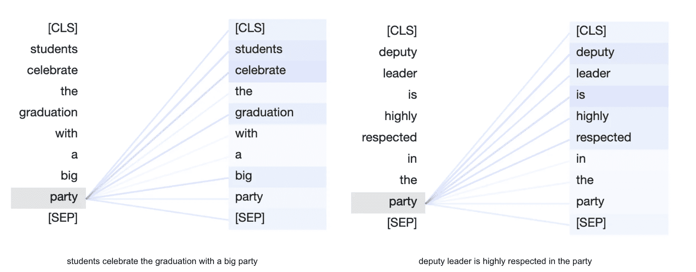
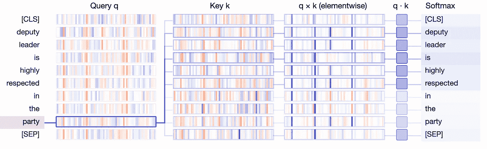

# Inside GPT — I : 理解文本生成

> 原文：[`towardsdatascience.com/inside-gpt-i-1e8840ca8093?source=collection_archive---------1-----------------------#2023-08-21`](https://towardsdatascience.com/inside-gpt-i-1e8840ca8093?source=collection_archive---------1-----------------------#2023-08-21)

## ChatGPT 背后模型的简单解释

[](https://medium.com/@fatih-demirci?source=post_page-----1e8840ca8093--------------------------------)[](https://towardsdatascience.com/?source=post_page-----1e8840ca8093--------------------------------) [Fatih Demirci](https://medium.com/@fatih-demirci?source=post_page-----1e8840ca8093--------------------------------)

·

[关注](https://medium.com/m/signin?actionUrl=https%3A%2F%2Fmedium.com%2F_%2Fsubscribe%2Fuser%2Fe4aaee0b8cc3&operation=register&redirect=https%3A%2F%2Ftowardsdatascience.com%2Finside-gpt-i-1e8840ca8093&user=Fatih+Demirci&userId=e4aaee0b8cc3&source=post_page-e4aaee0b8cc3----1e8840ca8093---------------------post_header-----------) 发表在 [Towards Data Science](https://towardsdatascience.com/?source=post_page-----1e8840ca8093--------------------------------) ·11 分钟阅读·2023 年 8 月 21 日[](https://medium.com/m/signin?actionUrl=https%3A%2F%2Fmedium.com%2F_%2Fvote%2Ftowards-data-science%2F1e8840ca8093&operation=register&redirect=https%3A%2F%2Ftowardsdatascience.com%2Finside-gpt-i-1e8840ca8093&user=Fatih+Demirci&userId=e4aaee0b8cc3&source=-----1e8840ca8093---------------------clap_footer-----------)

--

[](https://medium.com/m/signin?actionUrl=https%3A%2F%2Fmedium.com%2F_%2Fbookmark%2Fp%2F1e8840ca8093&operation=register&redirect=https%3A%2F%2Ftowardsdatascience.com%2Finside-gpt-i-1e8840ca8093&source=-----1e8840ca8093---------------------bookmark_footer-----------)

*19 世纪的生成 AI（通过 midjourney 创建）*

我经常与来自不同领域的同事交流，我喜欢将机器学习概念传达给那些几乎没有数据科学背景的人。在这里，我尝试用简单的术语解释 GPT 的工作原理，这一次以书面形式呈现。

在 ChatGPT 的流行魔力背后，隐藏着一种不那么流行的逻辑。你向 ChatGPT 输入提示，它生成文本，无论其准确性如何，都类似于人类的回答。它是如何理解你的提示并生成连贯且易于理解的回答的呢？

**Transformer Neural Networks.** 这种架构设计用于处理大量非结构化数据，在我们的情况下是文本。当我们说架构时，我们指的是本质上在多个层并行进行的一系列数学操作。通过这种方程系统，介绍了几项创新，帮助我们克服了长时间存在的文本生成挑战。这些挑战直到 5 年前我们还在苦苦解决。

如果 GPT 已经存在了 5 年（实际上 GPT 论文发表于 2018 年），GPT 难道不是旧闻吗？为什么最近它变得如此受欢迎？GPT 1、2、3、3.5（ChatGPT）和 4 之间有什么区别？

所有 GPT 版本都建立在相同的架构上。然而，每个后续模型包含了更多的参数，并使用了更大的文本数据集进行训练。后来的 GPT 发布显然引入了其他新颖之处，尤其是在训练过程中，例如通过人类反馈的强化学习，这一点我们将在本博客系列的第三部分中进行解释。

**Vectors, matrices, tensors.** 所有这些花哨的词汇本质上都是包含数字块的单位。这些数字经过一系列数学操作（主要是乘法和加法），直到我们达到最佳输出值，即可能结果的概率。

输出值？从这个意义上讲，它是由语言模型生成的文本，对吗？是的。那么，输入值是什么？是我的提示吗？是的，但不是完全。那还有什么其他的呢？

在讨论不同的文本解码策略之前，这将是下一篇博客文章的主题，消除歧义是有用的。让我们回到开始时提出的基本问题。它是如何理解人类语言的？

**Generative Pre-trained Transformers**。这是 GPT 缩写代表的三个词。我们在上面提到了 Transformer 部分，它代表了进行大量计算的架构。但我们究竟计算什么？你从哪里得到这些数字？它是一个语言模型，你只需输入一些文本。你怎么能计算文本呢？

> 数据是不可知的。所有数据无论是以文本、声音还是图像的形式存在都是相同的。¹

**Tokens**。我们将文本拆分成小块（标记），并为每个标记分配一个唯一的编号（标记 ID）。模型不知道单词、图像或音频记录。它们学习以巨大的数字序列（参数）来表示它们，这些数字序列作为工具来以数字形式展示事物的特征。标记是传达意义的语言单位，而标记 ID 是编码标记的唯一数字。

显然，我们标记化语言的方式可能会有所不同。标记化可以包括将文本拆分成句子、单词、单词部分（子词）或甚至单个字符。

让我们考虑一个场景，其中我们的语言语料库有 50,000 个标记（类似于 GPT-2 的 50,257）。在标记化后，我们如何表示这些单位？

```py
Sentence: "students celebrate the graduation with a big party"
Token labels: ['[CLS]', 'students', 'celebrate', 'the', 'graduation', 'with', 'a', 'big', 'party', '[SEP]']
Token IDs: tensor([[ 101, 2493, 8439, 1996, 7665, 2007, 1037, 2502, 2283,  102]])
```

上面是一个被分词的例句示例。分词方法的实现可能有所不同。我们现在需要理解的重要一点是，我们通过其对应的令牌 ID 获得语言单位（令牌）的数值表示。因此，现在我们有了这些令牌 ID，能否将它们直接输入到模型中进行计算？

基数在数学中很重要。101 和 2493 作为令牌表示会对模型产生影响。因为请记住，我们所做的主要是大块数字的乘法和加法。所以用 101 或 2493 乘一个数字是有区别的。那么，我们如何确保用数字 101 表示的令牌不比 2493 不重要，仅仅因为我们偶然选择了它？我们如何编码单词而不造成虚假的排序？

**独热编码。** 令牌的稀疏映射。独热编码是一种将每个令牌投影为二进制向量的技术。这意味着向量中只有一个元素为 1（“热”），其余为 0（“冷”）。



图片由作者提供：独热编码向量示例

令牌由一个向量表示，该向量的长度等于我们语料库中的令牌总数。简单来说，如果我们语言中有 50k 个令牌，每个令牌由一个长度为 50k 的向量表示，其中只有一个元素为 1，其余为 0。由于这个投影中的每个向量只包含一个非零元素，因此它被称为稀疏表示。然而，正如你可能想到的，这种方法非常低效。是的，我们设法消除了令牌 ID 之间的人工基数，但我们无法推断出单词的语义信息。我们无法通过使用稀疏向量来理解单词“party”是指庆祝活动还是政治组织。此外，用大小为 50k 的向量表示每个令牌，将意味着总共有 50k 个长度为 50k 的向量。这在所需的内存和计算方面非常低效。幸运的是，我们有更好的解决方案。

**嵌入**。令牌的密集表示。分词单位通过一个嵌入层，其中每个令牌被转换为固定大小的连续向量表示。例如，在 GPT-3 的情况下，每个令牌由一个包含 768 个数字的向量表示。这些数字最初是随机分配的，然后在模型看到大量数据（训练）后进行学习。

```py
Token Label: “party”
Token : 2283
Embedding Vector Length: 768
Embedding Tensor Shape: ([1, 10, 768])

Embedding vector:

tensor([ 2.9950e-01, -2.3271e-01,  3.1800e-01, -1.2017e-01, -3.0701e-01,
        -6.1967e-01,  2.7525e-01,  3.4051e-01, -8.3757e-01, -1.2975e-02,
        -2.0752e-01, -2.5624e-01,  3.5545e-01,  2.1002e-01,  2.7588e-02,
        -1.2303e-01,  5.9052e-01, -1.1794e-01,  4.2682e-02,  7.9062e-01,
         2.2610e-01,  9.2405e-02, -3.2584e-01,  7.4268e-01,  4.1670e-01,
        -7.9906e-02,  3.6215e-01,  4.6919e-01,  7.8014e-02, -6.4713e-01,
         4.9873e-02, -8.9567e-02, -7.7649e-02,  3.1117e-01, -6.7861e-02,
        -9.7275e-01,  9.4126e-02,  4.4848e-01,  1.5413e-01,  3.5430e-01,
         3.6865e-02, -7.5635e-01,  5.5526e-01,  1.8341e-02,  1.3527e-01,
        -6.6653e-01,  9.7280e-01, -6.6816e-02,  1.0383e-01,  3.9125e-02,
        -2.2133e-01,  1.5785e-01, -1.8400e-01,  3.4476e-01,  1.6725e-01,
        -2.6855e-01, -6.8380e-01, -1.8720e-01, -3.5997e-01, -1.5782e-01,
         3.5001e-01,  2.4083e-01, -4.4515e-01, -7.2435e-01, -2.5413e-01,
         2.3536e-01,  2.8430e-01,  5.7878e-01, -7.4840e-01,  1.5779e-01,
        -1.7003e-01,  3.9774e-01, -1.5828e-01, -5.0969e-01, -4.7879e-01,
        -1.6672e-01,  7.3282e-01, -1.2093e-01,  6.9689e-02, -3.1715e-01,
        -7.4038e-02,  2.9851e-01,  5.7611e-01,  1.0658e+00, -1.9357e-01,
         1.3133e-01,  1.0120e-01, -5.2478e-01,  1.5248e-01,  6.2976e-01,
        -4.5310e-01,  2.9950e-01, -5.6907e-02, -2.2957e-01, -1.7587e-02,
        -1.9266e-01,  2.8820e-02,  3.9966e-03,  2.0535e-01,  3.6137e-01,
         1.7169e-01,  1.0535e-01,  1.4280e-01,  8.4879e-01, -9.0673e-01,
                                            … 
                                            … 
                                            …                           ])
```

上面是单词“party”的嵌入向量示例。

现在我们有 50,000x786 大小的向量，与 50,000x50,000 的独热编码相比，显著更高效。

嵌入向量将作为模型的输入。由于密集的数值表示，我们将能够捕捉单词的语义，相似的令牌的嵌入向量将彼此更接近。

如何在上下文中测量两个语言单位的相似性？有几种函数可以测量两个相同大小的向量之间的相似性。让我们用一个例子来解释。

考虑一个简单的例子，我们有“cat”、“dog”、“car”和“banana”的嵌入向量。为了简化，假设嵌入维度为 4。这意味着每个词语会由四个学习到的数字表示。

```py
import numpy as np
from sklearn.metrics.pairwise import cosine_similarity

# Example word embeddings for "cat" , "dog", "car" and "banana"
embedding_cat = np.array([0.5, 0.3, -0.1, 0.9])
embedding_dog = np.array([0.6, 0.4, -0.2, 0.8])
embedding_car = np.array([0.5, 0.3, -0.1, 0.9])
embedding_banana = np.array([0.1, -0.8, 0.2, 0.4]) 
```

使用上述向量，我们可以通过余弦相似度来计算相似性得分。人类逻辑会发现“dog”和“cat”彼此更相似，而“banana”和“car”相似度较低。我们可以期待数学模拟我们的逻辑吗？

```py
# Calculate cosine similarity
similarity = cosine_similarity([embedding_cat], [embedding_dog])[0][0]

print(f"Cosine Similarity between 'cat' and 'dog': {similarity:.4f}")

# Calculate cosine similarity
similarity_2 = cosine_similarity([embedding_car], [embedding_banana])[0][0]

print(f"Cosine Similarity between 'car' and 'banana': {similarity:.4f}")
```

```py
"Cosine Similarity between 'cat' and 'dog': 0.9832"
"Cosine Similarity between 'car' and 'banana': 0.1511"
```

我们可以看到“cat”和“dog”的相似度得分非常高，而“car”和“banana”的得分非常低。现在，想象一下在我们的语言语料库中，每个 50000 个词的嵌入向量长度为 768。这就是我们能够找到彼此相关的词语的方法。

现在，让我们看看下面这两个语义复杂度较高的句子。

```py
"students celebrate the graduation with a big party"

"deputy leader is highly respected in the party"
```

第一和第二句中的“party”一词传达了不同的意义。大型语言模型如何区分“party”作为政治组织与“party”作为庆祝社交活动的意义？

我们能否通过依赖词语嵌入来区分相同词语的不同含义？事实是，尽管嵌入提供了很多优势，但它们不足以解开人类语言语义挑战的复杂性。

**自注意力。** 解决方案再次由变压器神经网络提供。我们生成一组新的权重（参数的另一名称），即查询、键和值矩阵。这些权重学习将词语的嵌入向量表示为一组新的嵌入。如何做到？简单地通过对原始嵌入的加权平均。每个词语“关注”输入句子中的其他每个词（包括它自身）并计算一组注意力权重，换句话说，就是新的所谓“*上下文嵌入*”。

它真正做的只是通过分配一组新的数字（注意力权重）来映射输入句子中词语的重要性，这些数字是使用词语嵌入计算得出的。



作者提供的图片：不同上下文中词语的注意力权重（BertViz 注意力头视图）

上面的可视化展示了“party”对两个句子中其余标记的“注意力”。连接的粗细表示标记的重要性或相关性。注意力和“attending”是指一系列新数字（注意力参数）及其大小，我们用它们来表示单词的重要性。在第一个句子中，“party”对“celebrate”的关注最高，而在第二个句子中，“deputy”具有最高的注意力。这就是模型如何通过检查周围单词来融入上下文。

正如我们在注意力机制中提到的那样，我们推导出了一组新的权重矩阵，即：查询、键和值（简称 q、k、v）。它们是相同大小的级联矩阵（通常小于嵌入向量），它们被引入架构中以捕捉语言单元的复杂性。注意力参数通过学习以揭示单词、单词对、单词对对、单词对对对的关系等等。以下是查询、键和值矩阵在找到最相关单词中的可视化。



作者提供的图像：查询键和值矩阵及其最终概率的插图（BertViz q,k,v 视图）

可视化图展示了 q 和 k 向量作为垂直带，其中每个带的粗细反映了其大小。标记之间的连接表示由注意力决定的权重，表明“party”的 q 向量与“is”、“deputy”和“respected”的 k 向量最显著对齐。

为了使注意力机制以及 q、k 和 v 的概念不那么抽象，想象一下你去参加一个派对，听到了一首你爱上的绝妙歌曲。派对结束后，你急切地想找到这首歌再听一遍，但你只记得歌词中的 5 个词和一部分歌曲旋律（query）。为了找到这首歌，你决定浏览派对播放列表（keys），并逐一聆听列表中播放的所有歌曲（相似度函数）。当你最终认出这首歌时，你记录下歌曲的名称（value）。

最后一个重要的技巧是变压器引入了将位置编码添加到向量嵌入中。仅仅是因为我们希望捕捉单词的位置信息。它增强了我们准确预测下一个标记的机会，使其更接近真实的句子上下文。这是至关重要的信息，因为词语的交换往往会完全改变上下文。例如，句子*“Tim chased clouds all his life”*与*“clouds chased Tim all his life”*在本质上是完全不同的。

-   到目前为止，我们探索的所有基本数学技巧，其目标是预测下一个标记，给定输入标记的序列。确实，GPT 的训练任务非常简单，即文本生成，或者换句话说是下一个标记预测。从本质上讲，我们测量给定之前出现的标记序列的标记概率。

-   你可能会好奇模型是如何从随机分配的数字中学习最优数字的。这可能是另一个博客文章的话题，但实际上这是理解的基础。此外，你已经开始质疑基础知识，这本身就是一个很好的迹象。为了消除不明确性，我们使用一种优化算法，该算法基于称为损失函数的指标来调整参数。这个指标是通过将预测值与实际值进行比较来计算的。模型跟踪指标的变化，并根据损失值的大小来调整数字。这个过程会一直进行，直到损失值在我们在算法中设置的超参数规则下无法再减小为止。一个示例超参数可以是，我们希望多频繁地计算损失并调整权重。这是学习背后的基本思想。

-   我希望在这篇简短的文章中，我能至少稍微清晰一下。该博客系列的第二部分将重点关注解码策略，即为什么你的提示很重要。第三部分也是最后一部分将专注于 ChatGPT 成功的关键因素，即通过人工反馈的强化学习。非常感谢您的阅读。下次见。

**参考文献：**

A. Vaswani, N. Shazeer, N. Parmar, J. Uszkoreit, L. Jones, A. N. Gomez, Ł. Kaiser, 和 I. Polosukhin, “注意力机制就是你所需要的，”发表于《神经信息处理系统进展》第 30 卷（NIPS 2017），2017 年。

J. Vig, “变压器模型中的多尺度注意力可视化，”发表于第 57 届计算语言学协会年会：系统演示，页码 37–42，意大利佛罗伦萨，计算语言学协会，2019 年。

L. Tunstall, L. von Werra, 和 T. Wolf, “使用变压器的自然语言处理，修订版，” O’Reilly Media, Inc., 2022 年 5 月发布，ISBN: 9781098136796。

[1 -懒人程序员博客](https://lazyprogrammer.me/blog/)
