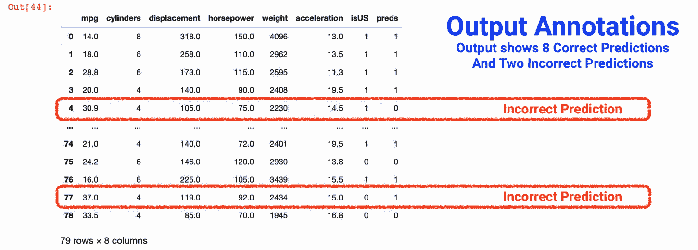
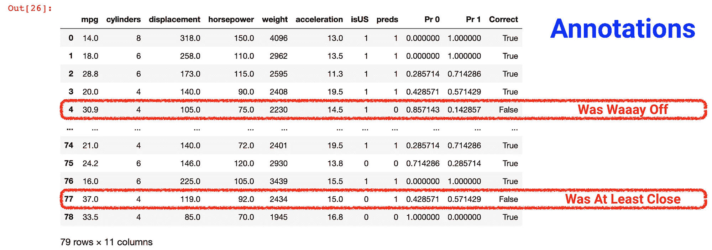
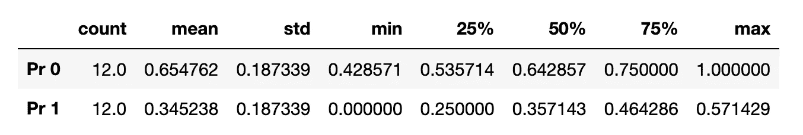

# 检查数据科学预测：个人 + 负面案例分析

> 原文：[`towardsdatascience.com/inspecting-data-science-predictions-individual-negative-case-analysis-d2e4ddbcf830`](https://towardsdatascience.com/inspecting-data-science-predictions-individual-negative-case-analysis-d2e4ddbcf830)

## 如何检查特定的预测并进行负面案例分析

[](https://adamrossnelson.medium.com/?source=post_page-----d2e4ddbcf830--------------------------------)[](https://towardsdatascience.com/?source=post_page-----d2e4ddbcf830--------------------------------) [Adam Ross Nelson](https://adamrossnelson.medium.com/?source=post_page-----d2e4ddbcf830--------------------------------)

·发表于[Towards Data Science](https://towardsdatascience.com/?source=post_page-----d2e4ddbcf830--------------------------------) ·14 分钟阅读·2023 年 7 月 21 日

--

当我向新学习者展示如何使用`.predict()`方法时，大约有 40%到 43%的时间会得到以下问题：

**预测在哪里？**

我希望这是学习者们更多提问的问题。这是一个深刻的问题，特别是对于那些刚接触 Python、数据科学，并且可能第一次看到`.predict()`方法的人。

-   确实，提出这个问题的群体数量少于一半，但可能这个比例低于 30%或 20%。我并没有精确跟踪。

在本深度分析的第一部分，本文将首先展示如何构建一个简单的预测模型，其次展示如何生成预测，最后介绍如何更仔细地检查预测。

在本深度分析的第二部分，本文还将展示为什么了解如何检查个别预测是有用的，以及为什么有必要检查个别预测。具备检查个别预测的能力可以开启一系列分析途径，例如负面案例分析。

# 第一部分：预测方法

如果你还不熟悉构建预测模型，我建议你考虑阅读一篇或多篇涉及此主题的其他文章。我所著的[*Confident Data Science: Discovering The Essential Skills of Data Science*](https://a.co/d/hS2cbou)第十一章展示了如何构建预测模型。

例如，在假鸟与机器学习：使用流行的鸟类数据演示最近邻分类中，我分享了训练机器学习模型的代码，该模型可以根据鸟的重量、长度、位置和颜色预测鸟类品种。这个假鸟示例展示了如何使用假鸟品种数据进行预测建模。

## 一个简单的预测模型

为了帮助我们专注于检查特定的个体预测，本小节将快速创建一个预测模型。为了加快速度，本小节省略了优化超参数和一些数据准备步骤。

为了加快速度，我们还会通过其他方法评估，而不仅仅使用传统的`accuracy_score`、`classification_report`和`confusion_matrix`函数。

对于这个简单、快速的预测模型，我们来看看汽车数据。这里的“快速”确实是有意的！

通常我们希望有一个包含几百个观察值的数据集。然而，我喜欢使用这个来自 Seaborn 的汽车数据，因为几乎每个人都理解或知道一些关于汽车的基本知识。

**第一步，打开数据。** 和许多训练营演示或在线演示文章一样，你首先打开数据。

```py
# Standard required imports on Pandas and Seaborn
import pandas as pd
import seaborn as sns

# Load data from Seaborn library
df = sns.load_dataset('mpg')
# Remove records with  missing values
df.dropna(inplace=True)
```

**第二步，准备数据。** 之后你准备一个目标变量。在本演示中，我们将创建一个目标变量，用于预测当车辆在美国制造时为 1，其他地方制造时为 0。

```py
# List comprehension to make a new target variable
df['isUS'] = [1 if x == 'usa' else 0 for x in df['origin']]
```

**第三步，训练、测试和拆分。** 另一个惯例步骤是训练、测试和拆分（`train, test, split`）数据，如下所示。

```py
# Import train_test_split from sklearn
from sklearn.model_selection import train_test_split

# Specify a feature and target matrix
X = df[['mpg','cylinders','displacement',
        'horsepower','weight','acceleration']]
y = df['isUS']

# Train, test, and split the feature and target matricies
X_train, X_test, y_train, y_test = train_test_split(
    X, y, test_size=0.2, random_state=1234)
```

**第四步，训练模型。** 现在数据已经准备好进行训练。

```py
# Import KNN classifier from sklearn
from sklearn.neighbors import KNeighborsClassifier

# Instantiate and train KNN model
knn = KNeighborsClassifier(n_neighbors=7)
knn.fit(X_train, y_train)
```

## 使用模型生成预测

**第五步，从训练好的模型中生成预测。** 一旦训练完成，模型就可以生成预测。

```py
# Generate and save predictions
pred = knn.predict(X_test)
```

**第六步，开始探索/评估过程。** 一旦生成预测，就可以进行检查。在这里，我将沉溺于一些不常见的检查选项。在训练营的背景下，我当然会分享标准的`accuracy_score`、`classification_report`和`confusion_matrix`函数（以及均方误差和均方根误差的等效函数）。不过，我也认为展示其他方法很重要。我发现学习者更喜欢看到其他方法。

展示其他方法有助于学习者理解`accuracy_score`、`classification_report`和`confusion_matrix`的功能、工作原理以及如何解释它们的作用。在有问题时，能够向他人解释这些内容非常重要。

更根本地，学习、了解和使用替代方法使数据科学家能够复制（并验证）更传统的方法。换句话说，这使得学习者能够做的不仅仅是信任传统的现成选项。当你可以独立验证结果时，无需仅仅依赖信任。

一旦你得到预测结果，就可以开始检查这些预测。

```py
# Find proportion of predictions that were accurate
print(f'The accuracy of this model is {(pred == y_test).mean() * 100}')
```

这段代码的美妙之处在于它比看起来复杂得多。首先考虑，它将每个预测（在 `pred` 中找到）与相应的实际值（在 `y_test` 中找到）进行比较。比较 `pred == y_test` 将返回一个布尔数组（即一系列 `True` 和 `False` 值），其中 `True` 表示预测与实际值匹配，而 `False` 表示不匹配。

这里是魔法……然后，应用于此数组的 `.mean()` 函数实际上找到了正确预测的比例。具体如下。在 Python 中，当计算布尔数组的均值时，`True` 值被视为 1，`False` 值被视为 0。这实际上计算了正确预测的比例（或模型的准确度），因为它将 `True` 值的数量（正确预测的总和是所有值中的 True = 1，而 False = 0）除以总预测数。这样，数学计算结果使得均值公式等同于 True 比例的公式。

最后，这段代码还将结果乘以 100 以生成可读的百分比，并且使用 f-string 报告结果。如果你跟随相同的随机状态，你应该会发现准确率大约为 84%。

另一种选择是使用 `pd.crosstab()` 来显示如下的混淆矩阵。

```py
# Use pd.crosstab to generate a confusion matrix
pd.crosstab(pred, y_test)
```

这样就会产生如下版本。

```py
 Actual Values
Predictions         0     1        
  0                27     9
  1                 3    40
```

从这些结果中，我们可以看到模型正确地识别/预测了 40 辆车辆在美国制造，正确识别/预测了 27 辆在国外制造的车辆，并且错误识别/预测了大约 12 辆其他车辆（9 个假阴性 + 3 个假阳性）。

## 更仔细地检查单个预测

本文的核心是解释如何检查单个预测。本文回答了我经常从训练营学习者那里得到的问题，即他们第一次看到 `.predict()` 方法时的疑问。

**预测在哪里？**


图片来源：作者在 Canva 上使用 Canva 的库存图片制作的插图。

进行更详细检查的一个好步骤是将真实目标值和预测目标值附加到原始训练数据中。这样，你可以将结果并排比较，并结合每个预测变量进行上下文分析。

对于来自其他编程语言的用户来说，值得一提的是，Stata 中与 SciKit Learn 的 `.predict()` 方法等效的功能会自动将预测结果附加到原始数据中。在 Python 中，这种合并/连接需要额外的工作。

以下代码可以实现这种合并/连接。

```py
# Concatenate three data sources: Testing data (X_test), 
# actual outcomes (y_test), and predictions (pred)
pd.concat([X_test.reset_index(drop=True), 
           pd.DataFrame(y_test).reset_index(drop=True), 
           pd.DataFrame({'preds':pred})], axis=1)
```

对于将类似于以下结果的结果。



图片来源：Jupyter Notebook 中生成的屏幕截图，代码如图所示。

该输出显示了前五个和最后五个观察数据以及一个名为`isUS`的列（显示真实值 1 = 在美国制造，0 = 在国外制造）和另一列名为`preds`（显示预测值 1 = 预测在美国制造，0 = 预测在国外制造）。

观察数据编号 4 和 77 显示了实际值和预测值的不匹配。观察数据编号 4 是一个假阴性，这意味着模型错误地预测了车辆是在国外制造的。而观察数据编号 77 是一个假阳性，这意味着模型错误地预测了车辆是在美国制造的。

# 第二部分：详细检查的实用性

## 检查期间需要提出的问题

检查模型的个别预测不仅仅是确认它们是否正确。这也是一个调查过程，可以产生重要的见解并指导进一步的模型改进。在检查个别预测时，提出几个关键问题是很有帮助的。

1.  领域专家是否会同意（错误）的预测？

1.  一个因果观察者会如何预测结果？因果观察者是否会同意（错误）的预测？

1.  是否有其他特征或预测因子，没有包含在模型中，可能有助于模型在这一特定（错误）案例中产生更好的结果？

1.  主题专家是否会同意特征的重要性？不同或更彻底的数据准备是否可能导致不同的特征重要性，从而可能更符合主题专家的看法？

1.  哪些特征可能导致了这一特定的（错误）预测？

1.  错误预测中是否存在任何模式？

1.  模型在这一预测中有多自信？

所有这些问题都有助于评估现有模型，并为未来的发展和修订提供指导。

## 负面案例 + 其他数据源

探索上述问题的过程就是进行个别负面案例分析的过程。对于第一个问题，即领域专家是否会同意，你的工作可能涉及准备数据导出，以便与领域专家共享。

这种导出方式允许领域专家在自己的时间里审查结果，然后向你反馈他们的想法、观察和建议。以下代码生成一个只包含错误预测的 HTML 文件，任何人都可以在任何网页浏览器中查看。

```py
# Concatenate three data sources: Testing data (X_test), 
# actual outcomes (y_test), and predictions (pred)
post_analysis = pd.concat(
    [X_test.reset_index(drop=True), 
     pd.DataFrame({'isUS':y_test}).reset_index(drop=True), 
     pd.DataFrame({'preds':pred})], axis=1)

# Add a new column, 'Correct', to act as a filter
post_analysis['Correct'] = post_analysis['isUS'] == \
                           post_analysis['preds']

# Filter and export data as an html file
post_analysis[
    post_analysis['Correct']==False].to_html('For_SME_Review.html')
```

相同的导出文件可以与其他值得信赖的顾问或同事分享，即使他们不一定是主题专家。外行人的意见也可能有价值。

对于第三个问题，即模型中未包含的其他特征或预测变量是否可能在特定（错误）情况下帮助模型产生更好的结果，大多数模型至少有一种方法可以协助评估特征重要性。

然而，事实证明，K-近邻（KNN）算法并不直接提供特征重要性度量或函数。这并不是一个疏漏。KNN 方法仅根据特征向量之间的相似性做出预测，而不对单个特征加权。这意味着我们需要一种间接评估特征重要性的方法，即某种代理方法。我在下面提供了这样的代理。

另一种选择是使用支持特征重要性的模型，如决策树或随机森林。然而，如果不建立另一个模型，也可以通过观察在轮流处理特征时模型性能的变化来评估特征的重要性。

通过轮流使用每个特征，以在训练过程中排除该特征，这是一个只需简单 for 循环的过程，如下所示。任何特征缺失时的性能下降都可以作为特征重要性的有意义衡量标准。这里的代码可以帮助在通过多个模型轮流处理每个特征的过程中衡量特征重要性。

```py
# Calculate the baseline model accuracy
baseline_accuracy = accuracy_score(y_test, pred)

# Empty dictionary to hold feature importances
feature_importances = {}

# For each feature in the dataset...
for feature in X.columns:
    # Create a second set of targets and features
    X2 = X.drop(feature, axis=1)
    y2 = y

    # Create a second set of trains tests splits
    X_train2, X_test2, y_train2, y_test2 = train_test_split(
        X2, y2, test_size=0.2, random_state=1234)

    # Fit using the second set of trains tests splits
    knn.fit(X_train2, y_train2)
    # Predict using the second set of trains tests splits
    held_out_pred = knn.predict(X_test2)
    # Get accuracy score on model with hold out
    held_out_acc = accuracy_score(y_test2, held_out_pred)
    # Save the accuracy score to the dictionary
    feature_importances[feature] = baseline_accuracy - held_out_acc

# Produce a data frame from the dictionary
feature_imp = pd.DataFrame.from_dict(feature_importances, 
                                     orient='index',
                                     columns=['importance'])

# Display the data frame with sorted importance values
feature_imp.sort_values(by='importance', 
                        ascending=False)
```

在这个示例中，如果你跟随进行，你会看到结果显示位移和重量是最重要的特征/预测变量。排除时，重量会使模型准确率降低 3.8%。而当排除位移时，模型准确率降低 2.5%。

## 进一步丰富反馈机会

除了如上所述与他人分享结果外，还可以通过添加显示预测概率的列来提供帮助。在上述代码的基础上，下面的代码块提供了两个包含预测概率的列的输出。

```py
from sklearn.model_selection import train_test_split
from sklearn.neighbors import KNeighborsClassifier

# Define feature and target variables (X & y)
X = df[['mpg','cylinders','displacement',
        'horsepower','weight','acceleration']]
y = df['isUS']

# Split dataset into training and testing sets
X_train, X_test, y_train, y_test = train_test_split(
    X, y, test_size=0.2, random_state=1234)

# Initialize and train K-Nearest Neighbors
knn = KNeighborsClassifier(n_neighbors=7)
knn.fit(X_train, y_train)

# Make predictions on the testing set
pred = knn.predict(X_test)

# Get prediction probabilities
probs = knn.predict_proba(X_test)

# Concatenate four data sources: Testing data (X_test), 
# actual outcomes (y_test), probabilities, and predictions (pred)
post_analysis = pd.concat(
    [X_test.reset_index(drop=True), 
     pd.DataFrame({'isUS':y_test}).reset_index(drop=True), 
     pd.DataFrame({'preds':pred}),
     pd.DataFrame(probs, 
                  columns=['Pr 0','Pr 1'])], axis=1)

# Add a new column, 'Correct', to act as a filter
post_analysis['Correct'] = post_analysis['isUS'] == \
                           post_analysis['preds']

# Filter and export data as an html file
post_analysis[
    post_analysis['Correct']==False].to_html('For_SME_Review.html')
```



图片来源：Jupyter Notebook 屏幕截图，由此处显示的代码生成。

如果你还没有学习 KNN，这里有一点关于 KNN 如何工作的额外信息。K-最近邻（KNN）算法基于训练数据集中超空间内最近邻的多数票决定类别概率。本质上，它计算‘k’个最近邻中属于每个类别的数据点数量。邻居最多的类别是新点的预测。

因此，在确定概率时，KNN 计算属于每个类别的‘k’个最近邻的比例。例如，如果你将 k 设置为 7，如我们所示，并且七个最近邻中有三个属于 A 类，四个属于 B 类，那么 KNN 算法将为测试点分配 0.4285（7 中 3）的 A 类概率和 0.5714（7 中 4）的 B 类概率。

从这个输出中，我们看到观察编号 4 中的假阴性误差很大。而观察编号 77 中的假阳性误差接近。虽然没有模型是完美的，但你可能会认为观察编号 77 中的误分类是无望的。然而，观察编号 4 中的误分类可能值得更仔细的查看，作为一个显著的改进模型性能的机会。

我们还可以从概率列中的描述性统计数据中对模型性能进行另一种观察。以下代码将显示这些统计数据。

```py
# Predicted probability summary stats among misclassifications
post_analysis[post_analysis['Correct'] == False][
    ['Pr 0', 'Pr 1']].describe().transpose()
```

这将显示以下输出的一个版本。



图片来源：Jupyter Notebook 的屏幕截图，由这里显示的代码生成。

这个结果表明，至少在一个错误结果中，模型对其错误预测的确定度达到了 100%。进一步探讨这个观察结果将是值得的。看起来可能有机会改进一个不仅错误，而且错误程度无法更大的预测。

# 结论 + 回顾

在这篇深度分析的第一部分，我首先展示了如何构建一个简单的预测模型，其次展示了如何生成预测，第三部分则更详细地介绍了如何检查单个特定预测。

在这篇深度分析的第二部分，我还展示了为何了解如何检查单个预测是有用的。能够检查单个预测打开了一系列分析途径。

在某些观点下，本文做了许多书籍、视频课程和训练营教育项目所忽略的内容。他们往往忽略和过于简化了`.predict()`方法之后的模型性能评估。

在本文中，我们学习并探讨了质疑和检查模型预测的必要性。文章提供并讨论了多个示例代码块和策略，深入探讨了预测结果。

为了设置，我们快速完成了一个涉及 Seaborn 的汽车数据预测模型的设置过程。在这个过程中，我们还探讨了预测信心、特征重要性、报告结果以及与他人分享结果以获取来自普通人和领域或主题专家的反馈的概念。

退一步看，这次深度的探讨见证了机器学习和数据科学的巨大力量。数据、模型、预测、科学家、代码、笔记本、领域专家等之间复杂的相互作用。

更重要的是，这篇文章也以能帮助将技术与人类理解和直觉连接起来的方式为读者做好了准备。能够以高水平的细节探索预测，例如这里展示的内容，也展示了数据科学的迷人景观。

在我们的工作中，我们可以发掘隐藏在大量数据中的见解，正是在这里我们可以利用这些见解来推动决策、创新和进步。正如这篇文章所强调的，机器学习的有效利用不仅仅是快速或大规模地开发和部署算法。

相反，我们的工作需要一个好奇且批判性的思维，愿意质疑、检查并理解所有细节。所有细节。我是那种力求不留死角的数据科学家。对`.predict()`方法结果的这一探索只是这一更广泛追求的一个实例。

这篇文章是邀请你深入探索数据的核心，寻找其中的真相，并质疑其叙述。这里和我所有文章中呈现的代码块和策略，不仅仅是指令——它们是你学习和创造力的催化剂。

我鼓励你拿这段代码进行实验，并将其应用到新的数据集上。破坏它，修复它，改进它。每个数据集都有不同的故事要讲，每次探索都会带来不同的见解。数据的世界是一个广阔、复杂且美丽的地方。*深入其中，探索并让数据引导你的旅程*。

# 感谢阅读

你准备好了解更多关于数据科学职业的信息了吗？我提供一对一职业辅导，并有一个每周邮件列表，帮助数据专业的求职者。[联系我们了解更多](https://coaching.adamrossnelson.com/)。

感谢阅读。把你的想法和意见发给我。你可以只是打个招呼。如果你真的需要告诉我哪里做得不好，我期待不久后与你聊天。Twitter: [@adamrossnelson](https://twitter.com/adamrossnelson) LinkedIn: [Adam Ross Nelson](https://www.linkedin.com/in/arnelson/)。
