# 神经网络的应用：推导正态分布的累积分布函数

> 原文：[`towardsdatascience.com/integrating-neural-net-deriving-the-normal-distribution-cdf-ea14574548ea?source=collection_archive---------7-----------------------#2023-05-03`](https://towardsdatascience.com/integrating-neural-net-deriving-the-normal-distribution-cdf-ea14574548ea?source=collection_archive---------7-----------------------#2023-05-03)

## 使用神经网络进行函数积分（含代码）

 [John Morrow](https://medium.com/@john_morrow?source=post_page-----ea14574548ea--------------------------------)

·

[关注](https://medium.com/m/signin?actionUrl=https%3A%2F%2Fmedium.com%2F_%2Fsubscribe%2Fuser%2Fb4bcd051bb38&operation=register&redirect=https%3A%2F%2Ftowardsdatascience.com%2Fintegrating-neural-net-deriving-the-normal-distribution-cdf-ea14574548ea&user=John+Morrow&userId=b4bcd051bb38&source=post_page-b4bcd051bb38----ea14574548ea---------------------post_header-----------) 发表在 [Towards Data Science](https://towardsdatascience.com/?source=post_page-----ea14574548ea--------------------------------) ·6 分钟阅读·2023 年 5 月 3 日

--

图片由 [Jack Anstey](https://unsplash.com/@jack_anstey?utm_source=medium&utm_medium=referral) 提供，来自 [Unsplash](https://unsplash.com/?utm_source=medium&utm_medium=referral)

## **1\. 引言**

本文介绍了一种训练神经网络以推导函数积分的方法。该技术不仅适用于解析解积分，还适用于没有封闭形式解且通常通过数值方法求解的积分。例如，正态分布的累积分布函数（CDF）。方程 1 是该分布的概率密度函数（PDF），方程 2 是其 CDF，即 PDF 的积分。图 1 是这些函数的图示。训练后，生成的网络可以作为一个独立的函数生成器，提供在 CDF 曲线上给定 PDF 分布域中的点。

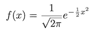

方程 1：**概率密度函数（PDF）（u=0，𝜎=1）**

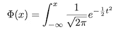

方程 2：**累积分布函数（CDF）**

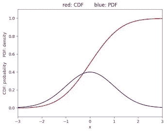

图 1\. **正态分布的 PDF 和 CDF**

## **2\. 积分神经网络**

训练一个积分神经网络，以产生函数 *y = f(x)* 的积分。用网络的输入和输出表示：

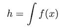

方程 3

其中 *h* 和 *x* 分别是网络的输出和输入。对于正态分布，*f(x)* 由方程 1 给出，即该分布的 PDF。

通过训练神经网络实现函数的积分，使得 *网络输出的导数等于函数的输出，从而使网络输出成为函数的积分*。

**2.1 神经网络训练**

训练程序的步骤如下：

1.  将一个训练点 *xᵢ* 应用到函数 *y = f(x)*：

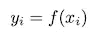

方程 4

2\. 还将 *xᵢ* 应用到神经网络的输入：

（神经网络模型包括一个输入 *x*，两个隐藏层和一个输出 *h*，表示为 *h(x) = nn_model(x)*。）

方程 5

3\. 求取 *hᵢ* 的导数：

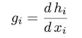

方程 6

（在 TensorFlow 和 PyTorch 中，通过其自动微分功能提供微分。在本文中，神经网络使用 TensorFlow [GradientTape](https://www.tensorflow.org/guide/autodiff) 开发。）

4\. 使用损失函数（第 2.2 节中的损失 2）训练神经网络，以强制以下关系：

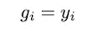

方程 7

然后在神经网络训练后，由于 *g = y*，并且将方程 6 和方程 4 中的 *g* 和 *y* 代入：

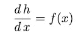

方程 8

对方程 8 两边进行积分，确认神经网络的输出是函数 *f(x)* 的积分：

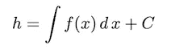

方程 9

其中 *C* 是积分常数。

**2.2 神经网络损失函数**

通常，神经网络是通过已知输入和输出数据对进行训练的。训练输入数据呈现给神经网络，结果输出与训练输出数据通过损失函数进行比较。这个函数返回的损失用于通过反向传播调整网络权重，以减少损失。整合神经网络使用自定义损失函数来约束神经网络产生与积分函数输出一致的输出。

整合神经网络的损失函数，如图 2 所示，有三个组成部分。损失函数 2（在上文训练程序第 2.1 节中描述）强制神经网络的输出符合*f(x)*的积分。

损失函数 3 迫使神经网络遵守初始条件*h(x_init2) = h_init2*。对于 CDF 模型，这一条件为*h(−10) = 0*，这设置了*C = 0*（方程 9）。对于该模型，*x = −10*时 PDF 和 CDF 的响应近似于*x = −∞*时的响应。

在损失函数 3 中设置初始条件为*h(−∞) = 0*，也简化了 CDF 计算。展开方程 2 的定积分：

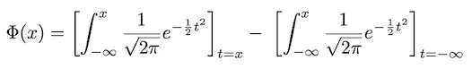

方程 10

初始条件*h(−∞) = 0*，意味着第二项为零，训练后的神经网络输出为对应*x*输入的 CDF 值：

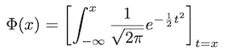

方程 11

损失函数 1，条件为*h(10) = 1*，稳定了训练过程，尤其是对分布右尾附近的点。对于该模型，*x = 10*时 PDF 和 CDF 的响应近似于

x = ∞。

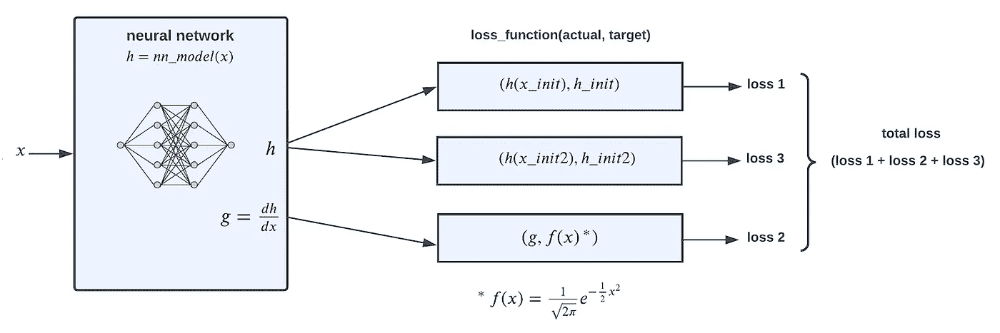

图 2\. **损失函数**

## **3\. 神经网络实现的整合**

以下是实现正态分布 CDF 的整合神经网络的 Python 代码。完整代码可在[这里](https://github.com/jmorrow1000/integrating-nn)获取。

**3.1 神经网络模型定义**

神经网络有两个全连接的隐藏层，每个层有 512 个神经元。输入为域点，输出为对应的积分值。

列表 1\. **TensorFlow 神经网络模型**

**3.2 初始化**

损失函数 2 中第 2.1 节的*xᵢ*训练点在下面的第 9 行中定义。这些点的顺序在第 11 行被随机打乱，以促进神经网络的稳定训练。在第 12 行，这些点被应用于 PDF，如方程 4 所述。

损失函数 1 和损失函数 3 的初始条件分别在第 15-16 行和第 19-20 行中定义。

列表 2\. **初始化**

**3.3 批量训练步骤**

列表 3 是应用于每个训练批次的训练步骤函数。总损失（损失 1、损失 2 和损失 3 的总和）在第 24 行用于通过梯度下降更新神经网络的权重（第 26 - 30 行）。每个训练周期包括多个批次，这些批次共同使用所有训练点进行模型更新。

第 9 行生成网络对 *x_init* 初始条件的响应。该响应与相应的初始条件 *h_init* 进行比较，产生损失 1（第 10 行）。

同样地，第 13 行生成网络对 *x_init2* 初始条件的响应。该响应与相应的初始条件 *h_init2* 进行比较，产生损失 3（第 14 行）。

第 17 行生成网络对训练点 *xᵢ*（方程 5）的响应。第 18 行提取响应的梯度（方程 6），第 19 - 20 行将梯度与 *f(xᵢ)*（方程 7）进行比较，产生损失 2。

列表 3\. **批量训练步骤**

## 4\. 结果

图 3 展示了训练好的神经网络输出的累积分布函数（CDF）响应（红色轨迹）。为了验证结果的准确性，包含了 Python [SciPy](https://scipy.org) 库中 *norm.cdf* 函数的 CDF 响应（绿色点）。

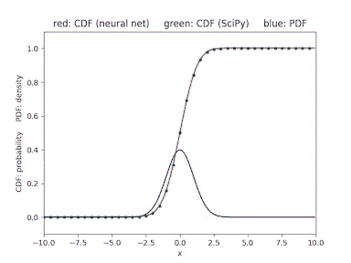

图 3\. **训练后的 CDF 神经网络输出**

图 4 是训练过程中记录的总损失函数随 epoch 的变化。 

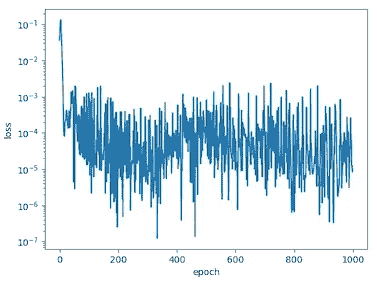

图 4\. **训练损失**

## 5\. 结论

本文展示了一种使用自定义损失函数和自动微分训练神经网络积分函数的方法。具体来说，训练神经网络成功地积分正态分布的概率密度函数（PDF）以生成累积分布函数（CDF）。

即将发表的一篇文章将介绍一种训练神经网络反转函数的方法。反转网络将用于反转本文中训练的 CDF 网络的输出，然后从正态分布生成样本。

**本文的 pdf 可在此处 [**下载**](https://github.com/jmorrow1000/integrating-nn)**。**

*除非另有说明，所有图片均由作者提供。*
