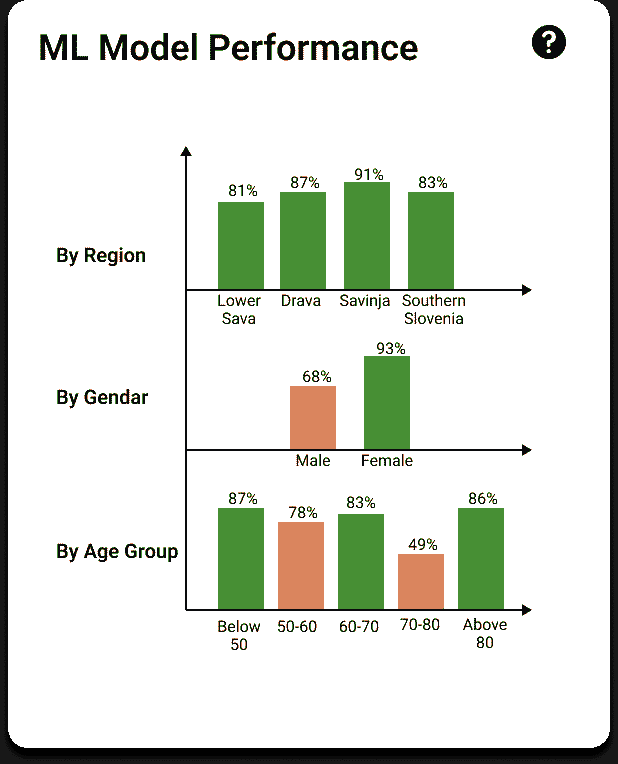

# 使用数据中心可解释人工智能解释机器学习模型

> 原文：[`towardsdatascience.com/interpreting-machine-learning-models-using-data-centric-explainable-ai-8415be070416`](https://towardsdatascience.com/interpreting-machine-learning-models-using-data-centric-explainable-ai-8415be070416)

## 在本文中了解数据中心解释及其不同类型

 [Aditya Bhattacharya](https://adib0073.medium.com/?source=post_page-----8415be070416--------------------------------)

·发布于[数据科学前沿](https://towardsdatascience.com/?source=post_page-----8415be070416--------------------------------) ·8 分钟阅读·2023 年 2 月 26 日

--

来源：[Pixabay](https://pixabay.com/illustrations/charts-tables-graph-statistics-6246450/)

[**可解释人工智能（XAI）**](https://amzn.to/3cY4c2h)是一个新兴概念，旨在弥合人工智能与终端用户之间的差距，从而增加人工智能的采纳。XAI 可以使人工智能/机器学习模型更加透明、可信和易于理解。特别是在医疗保健、金融和执法等关键领域，这一点尤为必要。

若要了解 XAI 的介绍，我在**2021 年 AI 加速器节亚太区**的 45 分钟演讲将非常有帮助：

[流行的 XAI 方法](https://amzn.to/3J2QNnz)，如 LIME、SHAP、显著性图等，是[**以模型为中心的解释方法**](https://amzn.to/3J2QNnz)。这些方法近似于机器学习模型用于生成预测的重要特征。然而，由于机器学习模型的归纳偏差，预测模型考虑的重要特征的估计可能并不总是准确。因此，以模型为中心的特征重要性方法可能并不总是非常有用。

此外，考虑到数据中心人工智能的原则，机器学习模型的质量仅取决于用于训练它们的数据的质量。由于相关特征、数据漂移、离群值、数据偏斜等引起的数据质量问题会影响训练后的机器学习模型的性能。然而，非技术用户通常对训练机器学习模型所用数据集的*好坏*没有足够的意识。因此，[**数据中心可解释人工智能（DCXAI）**](https://amzn.to/3J2QNnz)在训练和推理过程中检测到数据集潜在数据问题时，比以模型为中心的解释更为合适。

> 如果你有兴趣了解如何利用以数据为中心的可解释人工智能（DCXAI）来解释机器学习模型在高风险领域（如医疗保健）的应用，请查看我的研究出版物——[糖尿病发病风险监测的指令性解释：介绍指令性数据中心解释和支持“假设”探索的组合](https://arxiv.org/abs/2302.10671)。

我还会参考书中讨论的一些关于数据中心解释的概念，[**应用机器学习可解释性技术**](https://amzn.to/3cY4c2h)**。**

[**应用机器学习可解释性技术**](https://www.amazon.com/Applied-Machine-Learning-Explainability-Techniques/dp/1803246154?_encoding=UTF8&pd_rd_w=Wr6SJ&content-id=amzn1.sym.716a1ed9-074f-4780-9325-0019fece3c64&pf_rd_p=716a1ed9-074f-4780-9325-0019fece3c64&pf_rd_r=6P2PM599T97MRG7NZD9J&pd_rd_wg=m4qUW&pd_rd_r=6e349d93-5ba0-4bfe-9055-905c0153fe58&linkCode=li3&tag=adib0073-20&linkId=35506e1847de5c011fc57aa66c2b1d8e&language=en_US&ref_=as_li_ss_il&source=post_page-----8415be070416--------------------------------) [## 应用机器学习可解释性技术：使机器学习模型变得可解释且值得信赖…](https://www.amazon.com/Applied-Machine-Learning-Explainability-Techniques/dp/1803246154?_encoding=UTF8&pd_rd_w=Wr6SJ&content-id=amzn1.sym.716a1ed9-074f-4780-9325-0019fece3c64&pf_rd_p=716a1ed9-074f-4780-9325-0019fece3c64&pf_rd_r=6P2PM599T97MRG7NZD9J&pd_rd_wg=m4qUW&pd_rd_r=6e349d93-5ba0-4bfe-9055-905c0153fe58&linkCode=li3&tag=adib0073-20&linkId=35506e1847de5c011fc57aa66c2b1d8e&language=en_US&ref_=as_li_ss_il&source=post_page-----8415be070416--------------------------------)

### 应用机器学习可解释性技术：使机器学习模型在实际应用中变得可解释且值得信赖…

[www.amazon.com](https://www.amazon.com/Applied-Machine-Learning-Explainability-Techniques/dp/1803246154?_encoding=UTF8&pd_rd_w=Wr6SJ&content-id=amzn1.sym.716a1ed9-074f-4780-9325-0019fece3c64&pf_rd_p=716a1ed9-074f-4780-9325-0019fece3c64&pf_rd_r=6P2PM599T97MRG7NZD9J&pd_rd_wg=m4qUW&pd_rd_r=6e349d93-5ba0-4bfe-9055-905c0153fe58&linkCode=li3&tag=adib0073-20&linkId=35506e1847de5c011fc57aa66c2b1d8e&language=en_US&ref_=as_li_ss_il&source=post_page-----8415be070416--------------------------------)

# **什么是以数据为中心的可解释人工智能（DCXAI）？**

如我在书中**应用机器学习可解释性技术**中讨论的，以数据为中心的可解释人工智能（DCXAI）是一种 XAI 方法，通过生成关于用于训练模型的底层数据集的见解来解释机器学习模型的行为。

来源：[Pixabay](https://pixabay.com/illustrations/graph-charts-stats-data-metrics-6249047/)

数据中心解释方法的例子包括使用均值、众数和方差等常见统计方法总结数据集，视觉化数据分布以比较特征值与其余数据集中的特征值，以及通过假设分析观察模型预测的变化以探究特征的敏感性。此外，数据中心解释还包括在决策支持系统中常采用的数据驱动规则方法。此外，DCXAI 还包括通过分享有关各种数据问题（如数据漂移、数据偏斜、离群值、相关特征等）更多见解来提高对数据质量的认识，这些问题会影响机器学习模型的整体性能。

# 为什么选择 DCXAI 而不是其他 XAI 方法？

最近，由于基于偏见、不一致和低质量数据训练的机器学习模型的失败，机器学习研究社区正在探索以数据为中心的训练方法，而不仅仅依赖于超参数调优和探索不同的机器学习算法。如果数据是一致的、明确的、平衡的，并且数量充足，则机器学习模型可以更快地训练，并在任何生产级系统中更快地部署。

不幸的是，目前所有生产环境中的人工智能和机器学习系统都未能与以数据为中心的人工智能原则对齐。因此，底层数据可能存在严重问题，这些问题很少被检测到，但最终会导致机器学习系统的失败。这就是为什么**数据中心化解释性人工智能（DCXAI）**在检查和评估所使用数据质量方面如此重要。

[## 应用机器学习解释性技术：使机器学习模型对实践中的应用具有可解释性和可信度…](https://www.amazon.com/Applied-Machine-Learning-Explainability-Techniques/dp/1803246154?_encoding=UTF8&pd_rd_w=Wr6SJ&content-id=amzn1.sym.716a1ed9-074f-4780-9325-0019fece3c64&pf_rd_p=716a1ed9-074f-4780-9325-0019fece3c64&pf_rd_r=6P2PM599T97MRG7NZD9J&pd_rd_wg=m4qUW&pd_rd_r=6e349d93-5ba0-4bfe-9055-905c0153fe58&linkCode=li3&tag=adib0073-20&linkId=35506e1847de5c011fc57aa66c2b1d8e&language=en_US&ref_=as_li_ss_il&source=post_page-----8415be070416--------------------------------)

### 应用机器学习解释性技术：使机器学习模型对实践中的应用具有可解释性和可信度……

[www.amazon.com](https://www.amazon.com/Applied-Machine-Learning-Explainability-Techniques/dp/1803246154?_encoding=UTF8&pd_rd_w=Wr6SJ&content-id=amzn1.sym.716a1ed9-074f-4780-9325-0019fece3c64&pf_rd_p=716a1ed9-074f-4780-9325-0019fece3c64&pf_rd_r=6P2PM599T97MRG7NZD9J&pd_rd_wg=m4qUW&pd_rd_r=6e349d93-5ba0-4bfe-9055-905c0153fe58&linkCode=li3&tag=adib0073-20&linkId=35506e1847de5c011fc57aa66c2b1d8e&language=en_US&ref_=as_li_ss_il&source=post_page-----8415be070416--------------------------------)

# 数据中心化解释性人工智能（DCXAI）的不同方法

数据中心化解释的不同方法可以进一步按以下类型分类：

+   **生成关于训练数据的洞察** —— 探索性数据分析（EDA）是所有数据科学家和机器学习专家在构建机器学习模型之前进行的重要实践。然而，从 EDA 中生成的洞察很少传达给非技术性的机器学习模型使用者。因此，DCXAI 的一种方法是将生成的洞察传达给最终用户，以解释机器学习模型的潜在行为。这对那些可能没有机器学习知识但在自己领域内是专家的领域专家尤其有用。

    此外，数据分布的可视化可以指示数据集的平衡程度。它还可以显示训练数据中存在的偏斜和异常值，这可能影响模型。通过统计措施构建数据档案以生成洞察，也对局部和全局解释非常有用。

+   **强调数据质量**——大多数情况下，机器学习模型的表现不佳与用于训练它们的数据质量差有关。然而，数据质量的信息很少传达给最终用户。因此，当机器学习模型未能生成良好的预测时，最终用户通常不知道数据集中的问题。因此，DCXAI 涉及通过传达潜在的数据问题，如数据漂移、相关特征、类别不平衡、偏差数据集等，来解释数据质量。

    确实，一些数据问题复杂难懂，因为这些是技术概念。但是，当通过简化和交互式可视化呈现时，它会提高对数据质量的认识，从而突出机器学习模型失败的真正原因。

+   **估计数据预测能力**——有时，数据集过于嘈杂。对于这样的数据集，超越一定的准确度总是困难的。那么，如果我们知道训练好的模型在做出正确预测时并不极其准确，我们如何赢得最终用户的信任？我认为，获得信任的最佳方法是保持透明，明确沟通可行的内容。因此，测量**数据预测能力**并向最终用户传达模型的效率有助于设定正确的期望。数据预测能力是对模型性能的估计，基于底层数据。

    例如，我们有一个模型来预测某公司股票的价格。由机器学习算法建模的股票价格数据最多可以预测 60%的准确率。超出这一点，使用给定的数据集生成更准确的结果在实践中是不可能的。但假设考虑其他外部因素来补充当前数据，模型的准确性可以提高。这证明了不是机器学习算法限制了系统的性能，而是用于建模的数据集没有足够的信息来获得更好的模型性能。因此，这是数据集的一个限制，可以通过数据预测能力的度量来估计。最好在更详细的层面上进行数据预测能力的评估，以提供有关机器学习模型在不同人口统计变量值下性能的额外洞察，如下图所示。

不同人口统计变量的数据预测估计（图像来源于作者）

# DCXAI 的好处

现在我们已经了解了 DCXAI 的不同方法，让我们总结一下它的好处，如下所示。

+   容易检测到有偏见和不公平的数据。

+   提高对数据质量、纯洁性和完整性问题的认识，以解释 ML 模型的失败。

+   对于非技术型的 ML 消费者，DCXAI 比其他流行的模型中心解释方法如 LIME、SHAP 和显著性图更容易理解。

+   领域专家往往比 LIME 和 SHAP 更信任 DCXAI，因为 DCXAI 能更透明地展示用于训练 ML 模型的数据集。他们可以利用 DCXAI 通过参考底层训练数据来证明模型生成的预测。

[## Applied Machine Learning Explainability Techniques: Make ML models explainable and trustworthy for…](https://www.amazon.com/Applied-Machine-Learning-Explainability-Techniques/dp/1803246154?_encoding=UTF8&pd_rd_w=Wr6SJ&content-id=amzn1.sym.716a1ed9-074f-4780-9325-0019fece3c64&pf_rd_p=716a1ed9-074f-4780-9325-0019fece3c64&pf_rd_r=6P2PM599T97MRG7NZD9J&pd_rd_wg=m4qUW&pd_rd_r=6e349d93-5ba0-4bfe-9055-905c0153fe58&linkCode=li3&tag=adib0073-20&linkId=35506e1847de5c011fc57aa66c2b1d8e&language=en_US&ref_=as_li_ss_il&source=post_page-----8415be070416--------------------------------)

### Applied Machine Learning Explainability Techniques: Make ML models explainable and trustworthy for practical…

[Applied Machine Learning Explainability Techniques: Make ML models explainable and trustworthy for…](https://www.amazon.com/Applied-Machine-Learning-Explainability-Techniques/dp/1803246154?_encoding=UTF8&pd_rd_w=Wr6SJ&content-id=amzn1.sym.716a1ed9-074f-4780-9325-0019fece3c64&pf_rd_p=716a1ed9-074f-4780-9325-0019fece3c64&pf_rd_r=6P2PM599T97MRG7NZD9J&pd_rd_wg=m4qUW&pd_rd_r=6e349d93-5ba0-4bfe-9055-905c0153fe58&linkCode=li3&tag=adib0073-20&linkId=35506e1847de5c011fc57aa66c2b1d8e&language=en_US&ref_=as_li_ss_il&source=post_page-----8415be070416--------------------------------)

# 通过指令性数据中心解释使 DCXAI 更加可操作

在我最近的研究出版物——[监测糖尿病发病风险的指令性解释](https://arxiv.org/pdf/2302.10671.pdf)中，我介绍了一种详细的以用户为中心的设计过程，用于包含 DCXAI 的 XAI 仪表板。我们通过对这些解释进行以下调整，使 DCXAI 变得更加可操作，以便为医疗专家量身定制——

+   提供交互式视觉解释，以探索假设场景。

+   只考虑可操作的特征变量，而不是不可操作的特征。

+   提供明确的视觉指示，帮助用户探索系统，以理解 ML 模型的工作原理。

+   从全球视角获得局部解释。

通过对传统数据中心解释方法进行这些附加修改，我们设计并开发了**视觉指令性数据中心解释**。你可以在[研究论文](https://arxiv.org/abs/2302.10671)中了解更多关于这项研究的内容。

 [## 应用机器学习解释性技术：使机器学习模型在实践中可解释且值得信赖]

### 应用机器学习解释性技术：使机器学习模型在实践中可解释且值得信赖

[www.amazon.com](https://www.amazon.com/Applied-Machine-Learning-Explainability-Techniques/dp/1803246154?_encoding=UTF8&pd_rd_w=Wr6SJ&content-id=amzn1.sym.716a1ed9-074f-4780-9325-0019fece3c64&pf_rd_p=716a1ed9-074f-4780-9325-0019fece3c64&pf_rd_r=6P2PM599T97MRG7NZD9J&pd_rd_wg=m4qUW&pd_rd_r=6e349d93-5ba0-4bfe-9055-905c0153fe58&linkCode=li3&tag=adib0073-20&linkId=35506e1847de5c011fc57aa66c2b1d8e&language=en_US&ref_=as_li_ss_il&source=post_page-----8415be070416--------------------------------)

# 摘要

在这篇文章中，我们介绍了数据中心可解释 AI（DCXAI）及其各种方法。我们还讨论了 DCXAI 与其他 XAI 方法（如 LIME、SHAP 等）的不同之处，这些方法提供的是模型中心的解释。我们探讨了提供数据中心解释的不同方法。此外，我们还讨论了 DCXAI 的好处，以及如何进一步修改 DCXAI 以生成更具可操作性的解释，供领域专家和普通用户使用。你可以通过我的书[应用机器学习解释性技术](https://amzn.to/3cY4c2h)了解更多关于数据中心解释的内容，并查看书中提供的[GitHub 代码示例](https://github.com/PacktPublishing/Applied-Machine-Learning-Explainability-Techniques/)。

# 作者在 TDS 上的其他 XAI 故事：

1.  谷歌 AI 的可解释 AI 与 TCAV

1.  你应该了解的关键可解释 AI Python 框架

1.  基于文本数据训练的模型的可解释机器学习：将 SHAP 与 Transformer 模型结合

1.  EUCA——一个有效的 XAI 框架，将人工智能带到更接近终端用户

1.  理解基于 Shapley 值的 SHAP 及其在可解释 AI 中的工作原理

1.  如何使用 LIME 解释图像分类器

# **参考资料**：

1.  [监测糖尿病发病风险的指令性解释：介绍指令性数据中心解释和组合以支持假设探索](https://arxiv.org/abs/2302.10671)

1.  [应用机器学习解释技术](https://amzn.to/3cY4c2h)

1.  书籍《应用机器学习解释技术》的 GitHub 仓库 — [`github.com/PacktPublishing/Applied-Machine-Learning-Explainability-Techniques/`](https://github.com/PacktPublishing/Applied-Machine-Learning-Explainability-Techniques/)
