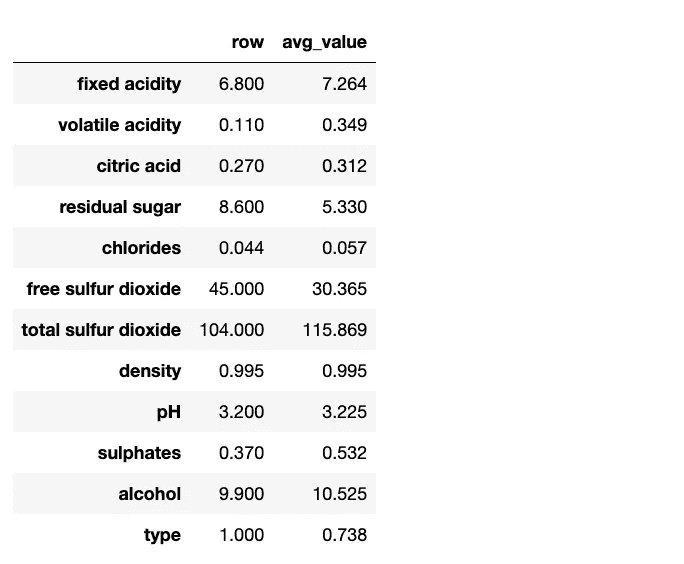

# 解读随机森林

> 原文：[`towardsdatascience.com/interpreting-random-forests-638bca8b49ea?source=collection_archive---------0-----------------------#2023-10-08`](https://towardsdatascience.com/interpreting-random-forests-638bca8b49ea?source=collection_archive---------0-----------------------#2023-10-08)

## 关于随机森林算法及其解读的全面指南

[](https://miptgirl.medium.com/?source=post_page-----638bca8b49ea--------------------------------)[](https://towardsdatascience.com/?source=post_page-----638bca8b49ea--------------------------------) [Mariya Mansurova](https://miptgirl.medium.com/?source=post_page-----638bca8b49ea--------------------------------)

·

[关注](https://medium.com/m/signin?actionUrl=https%3A%2F%2Fmedium.com%2F_%2Fsubscribe%2Fuser%2F15a29a4fc6ad&operation=register&redirect=https%3A%2F%2Ftowardsdatascience.com%2Finterpreting-random-forests-638bca8b49ea&user=Mariya+Mansurova&userId=15a29a4fc6ad&source=post_page-15a29a4fc6ad----638bca8b49ea---------------------post_header-----------) 发表在 [数据科学的前沿](https://towardsdatascience.com/?source=post_page-----638bca8b49ea--------------------------------) ·13 分钟阅读·2023 年 10 月 8 日[](https://medium.com/m/signin?actionUrl=https%3A%2F%2Fmedium.com%2F_%2Fvote%2Ftowards-data-science%2F638bca8b49ea&operation=register&redirect=https%3A%2F%2Ftowardsdatascience.com%2Finterpreting-random-forests-638bca8b49ea&user=Mariya+Mansurova&userId=15a29a4fc6ad&source=-----638bca8b49ea---------------------clap_footer-----------)

--

[](https://medium.com/m/signin?actionUrl=https%3A%2F%2Fmedium.com%2F_%2Fbookmark%2Fp%2F638bca8b49ea&operation=register&redirect=https%3A%2F%2Ftowardsdatascience.com%2Finterpreting-random-forests-638bca8b49ea&source=-----638bca8b49ea---------------------bookmark_footer-----------)

图片由 [Sergei A](https://unsplash.com/@sakulich?utm_source=medium&utm_medium=referral) 提供，来源于 [Unsplash](https://unsplash.com/?utm_source=medium&utm_medium=referral)

现在对大语言模型的炒作很多，但这并不意味着老派的机器学习方法现在就该消失。我怀疑如果你给 ChatGPT 一个有数百个数值特征的数据集，并要求它预测目标值，它会有帮助。

神经网络通常是处理非结构化数据（例如文本、图像或音频）的最佳解决方案。但对于表格数据，我们仍然可以从传统的随机森林中受益。

随机森林算法的最重要优点如下：

+   你只需要做一些数据预处理。

+   随机森林算法很难出错。如果你的集成中有足够多的树，你不会面临过拟合问题，因为增加更多的树会降低误差。

+   结果很容易解释。

这就是为什么随机森林可能是你在处理表格数据的新任务时的第一个模型的好候选者。

在这篇文章中，我希望覆盖随机森林的基础知识，并探讨解释模型结果的方法。

我们将学习如何找到以下问题的答案：

+   哪些特征是重要的，哪些是冗余的可以被移除？

+   每个特征值如何影响我们的目标指标？

+   每个预测的因素是什么？

+   如何估计每个预测的置信度？

# 预处理

我们将使用[葡萄酒质量数据集](https://archive.ics.uci.edu/dataset/186/wine+quality)。它展示了葡萄酒质量与不同葡萄牙“Vinho Verde”葡萄酒变体的物理化学测试之间的关系。我们将尝试基于葡萄酒特性预测葡萄酒质量。

使用决策树时，我们不需要做很多预处理。

+   我们不需要创建虚拟变量，因为算法可以自动处理。

+   我们不需要做归一化或去除异常值，因为只有排序是重要的。因此，基于决策树的模型对异常值具有抗性。

然而，scikit-learn 实现的决策树无法处理分类变量或缺失值。因此，我们需要自己处理这些问题。

幸运的是，我们的数据集中没有缺失值。

```py
df.isna().sum().sum()

0
```

我们只需要将 `type` 变量（‘*red*’ 或 ‘*white*’）从 `string` 转换为 `integer`。我们可以使用 pandas 的 `Categorical` 转换来实现。

```py
categories = {}  
cat_columns = ['type']
for p in cat_columns:
    df[p] = pd.Categorical(df[p])

    categories[p] = df[p].cat.categories

df[cat_columns] = df[cat_columns].apply(lambda x: x.cat.codes)
print(categories)

{'type': Index(['red', 'white'], dtype='object')}
```

现在，`df['type']` 对于红酒等于 0，对于白酒等于 1。

数据预处理的另一个关键部分是将数据集拆分为训练集和验证集。这样，我们可以使用验证集来评估模型的质量。

```py
import sklearn.model_selection

train_df, val_df = sklearn.model_selection.train_test_split(df, 
    test_size=0.2)

train_X, train_y = train_df.drop(['quality'], axis = 1), train_df.quality
val_X, val_y = val_df.drop(['quality'], axis = 1), val_df.quality

print(train_X.shape, val_X.shape)

(5197, 12) (1300, 12)
```

我们已经完成了预处理步骤，并准备好进入最激动人心的部分——训练模型。

# 决策树的基础知识

在开始训练之前，让我们花些时间理解随机森林的工作原理。

随机森林是决策树的集成。因此，我们应该从基本的构建块——决策树开始。

在我们的葡萄酒质量预测示例中，我们将解决一个回归任务，因此让我们从这开始。

## 决策树：回归

让我们拟合一个默认的决策树模型。

```py
import sklearn.tree
import graphviz

model = sklearn.tree.DecisionTreeRegressor(max_depth=3)
# I've limited max_depth mostly for visualisation purposes

model.fit(train_X, train_y)
```

决策树的一个显著优势是我们可以轻松解释这些模型——它只是一些问题。让我们可视化一下。

```py
 dot_data = sklearn.tree.export_graphviz(model, out_file=None,
                                       feature_names = train_X.columns,
                                       filled = True)

graph = graphviz.Source(dot_data)

# saving tree to png file
png_bytes = graph.pipe(format='png')
with open('decision_tree.png','wb') as f:
    f.write(png_bytes)
```


作者提供的图表

如你所见，决策树由二元分裂组成。在每个节点上，我们将数据集拆分为 2 部分。

最后，我们计算叶子节点的预测值作为该节点中所有数据点的平均值。

> **附注：** 由于决策树对叶节点的所有数据点取平均值，因此决策树在外推方面表现较差。因此，在训练和推理过程中需要关注特征分布。

让我们头脑风暴一下如何确定数据集的最佳分裂。我们可以从一个变量开始，定义其最佳划分。

假设我们有一个具有四个唯一值的特征：1、2、3 和 4。那么，它们之间有三个可能的阈值。


图表由作者提供

我们可以逐一取每个阈值，并计算数据的预测值作为叶节点的平均值。然后，我们可以使用这些预测值来计算每个阈值的 MSE（均方误差）。最佳分裂将是具有最低 MSE 的那个。默认情况下，[DecisionTreeRegressor](https://scikit-learn.org/stable/modules/generated/sklearn.tree.DecisionTreeRegressor.html#sklearn.tree.DecisionTreeRegressor)在 scikit-learn 中也以类似方式工作，并使用 MSE 作为标准。

为了更好地理解其工作原理，我们可以手动计算`sulphates`特征的最佳分裂。

```py
def get_binary_split_for_param(param, X, y):
    uniq_vals = list(sorted(X[param].unique()))

    tmp_data = []

    for i in range(1, len(uniq_vals)):
        threshold = 0.5 * (uniq_vals[i-1] + uniq_vals[i])

        # split dataset by threshold
        split_left = y[X[param] <= threshold]
        split_right = y[X[param] > threshold]

        # calculate predicted values for each split
        pred_left = split_left.mean()
        pred_right = split_right.mean()

        num_left = split_left.shape[0]
        num_right = split_right.shape[0]

        mse_left = ((split_left - pred_left) * (split_left - pred_left)).mean()
        mse_right = ((split_right - pred_right) * (split_right - pred_right)).mean()
        mse = mse_left * num_left / (num_left + num_right) \
            + mse_right * num_right / (num_left + num_right)

        tmp_data.append(
            {
                'param': param,
                'threshold': threshold,
                'mse': mse
            }
        )

    return pd.DataFrame(tmp_data).sort_values('mse')

get_binary_split_for_param('sulphates', train_X, train_y).head(5)

| param     |   threshold |      mse |
|:----------|------------:|---------:|
| sulphates |       0.685 | 0.758495 |
| sulphates |       0.675 | 0.758794 |
| sulphates |       0.705 | 0.759065 |
| sulphates |       0.715 | 0.759071 |
| sulphates |       0.635 | 0.759495 |
```

我们可以看到，对于`sulphates`，最佳阈值是 0.685，因为它提供了最低的 MSE。

现在，我们可以将此函数应用于我们所有的特征，以定义整体最佳分裂。

```py
def get_binary_split(X, y):
    tmp_dfs = []
    for param in X.columns:
        tmp_dfs.append(get_binary_split_for_param(param, X, y))

    return pd.concat(tmp_dfs).sort_values('mse')

get_binary_split(train_X, train_y).head(5)

| param   |   threshold |      mse |
|:--------|------------:|---------:|
| alcohol |      10.625 | 0.640368 |
| alcohol |      10.675 | 0.640681 |
| alcohol |      10.85  | 0.641541 |
| alcohol |      10.725 | 0.641576 |
| alcohol |      10.775 | 0.641604 |
```

我们得到了与初始决策树完全相同的结果，第一次分裂是在`alcohol <= 10.625`上。

为了构建整个决策树，我们可以递归地计算每个数据集`alcohol <= 10.625`和`alcohol > 10.625`的最佳分裂，并获得决策树的下一层。然后，重复这一过程。

递归的停止标准可以是深度或叶节点的最小大小。这里是一个决策树的示例，叶节点中至少有 420 个项目。

```py
model = sklearn.tree.DecisionTreeRegressor(min_samples_leaf = 420)
```


图表由作者提供

让我们计算验证集上的平均绝对误差，以了解我们的模型表现如何。我更喜欢 MAE 而非 MSE（均方误差），因为 MAE 对离群值的影响较小。

```py
import sklearn.metrics
print(sklearn.metrics.mean_absolute_error(model.predict(val_X), val_y))
0.5890557338155006
```

## 决策树：分类

我们已经查看了回归示例。在分类的情况下，情况有所不同。尽管在本文中我们不会深入探讨分类示例，但仍值得讨论其基本概念。

对于分类，我们使用最常见的类别作为每个叶节点的预测，而不是平均值。

我们通常使用[基尼系数](https://en.wikipedia.org/wiki/Gini_coefficient)来估计分类中二元分裂的质量。想象从样本中随机获取一个项目，然后获取另一个。基尼系数将等于项目来自不同类别的情况的概率。

假设我们只有两个类别，且第一类的项目占比为`p`。然后，我们可以使用以下公式计算基尼系数：


如果我们的分类模型是完美的，基尼系数等于 0。最坏情况下（`p = 0.5`），基尼系数等于 0.5。

要计算二元分裂的度量，我们计算两个部分（左侧和右侧）的基尼系数，并对每个分区中的样本数进行归一化。


然后，我们可以类似地计算不同阈值下的优化度量，并使用最佳选项。

我们已经训练了一个简单的决策树模型并讨论了它的工作原理。现在，我们准备继续讨论随机森林。

# 随机森林

随机森林基于自助法（Bagging）的概念。这个想法是拟合一堆独立的模型，并使用它们的平均预测。由于模型是独立的，误差不会相关。我们假设我们的模型没有系统性误差，许多误差的平均值应该接近于零。

我们如何获得许多独立的模型呢？这很简单：我们可以在随机的行和特征子集上训练决策树。这样就会形成一个随机森林。

让我们训练一个包含 100 棵树且叶节点最小大小为 100 的基本随机森林。

```py
import sklearn.ensemble
import sklearn.metrics

model = sklearn.ensemble.RandomForestRegressor(100, min_samples_leaf=100)
model.fit(train_X, train_y)

print(sklearn.metrics.mean_absolute_error(model.predict(val_X), val_y))
0.5592536196736408
```

使用随机森林，我们实现了比单棵决策树更好的质量：0.5592 对比 0.5891。

## 过拟合

一个有意义的问题是随机森林是否会过拟合。

实际上不会。由于我们在平均不相关的误差，添加更多的树不会使模型过拟合。随着树木数量的增加，质量将渐近提高。


作者绘图

然而，如果你有深度较大的树且数量不够，你可能会遇到过拟合的问题。一个决策树很容易发生过拟合。

## 袋外误差

由于在随机森林中每棵树只使用部分行，我们可以利用它们来估计误差。对于每一行，我们可以选择没有使用该行的树，并用它们来进行预测。然后，我们可以根据这些预测计算误差。这种方法称为“袋外误差”。

我们可以看到 OOB 误差比训练集上的误差更接近验证集上的误差，这意味着它是一个好的近似值。

```py
# we need to specify oob_score = True to be able to calculate OOB error
model = sklearn.ensemble.RandomForestRegressor(100, min_samples_leaf=100, 
     oob_score=True)

model.fit(train_X, train_y)

# error for validation set
print(sklearn.metrics.mean_absolute_error(model.predict(val_X), val_y))
0.5592536196736408

# error for training set
print(sklearn.metrics.mean_absolute_error(model.predict(train_X), train_y))
0.5430398596179975

# out-of-bag error
print(sklearn.metrics.mean_absolute_error(model.oob_prediction_, train_y))
0.5571191870008492
```

# 解释模型

正如我一开始提到的，决策树的一个大优点是它们易于解释。让我们尝试更好地理解我们的模型。

## 特征重要性

特征重要性的计算相当简单。我们查看集成中的每棵决策树和每个二元分裂，计算其对我们度量标准的影响（在我们这里是`squared_error`）。

让我们看看我们初始决策树的第一个`alcohol`分裂。


然后，我们可以对所有决策树中的所有二元分裂进行相同的计算，汇总所有结果，进行归一化，从而得到每个特征的相对重要性。

如果你使用 scikit-learn，你不需要手动计算特征重要性。你只需获取`model.feature_importances_`即可。

```py
def plot_feature_importance(model, names, threshold = None):
    feature_importance_df = pd.DataFrame.from_dict({'feature_importance': model.feature_importances_,
                                                    'feature': names})\
            .set_index('feature').sort_values('feature_importance', ascending = False)

    if threshold is not None:
        feature_importance_df = feature_importance_df[feature_importance_df.feature_importance > threshold]

    fig = px.bar(
        feature_importance_df,
        text_auto = '.2f',
        labels = {'value': 'feature importance'},
        title = 'Feature importances'
    )

    fig.update_layout(showlegend = False)
    fig.show()

plot_feature_importance(model, train_X.columns)
```

我们可以看到，总体上最重要的特征是`alcohol`和`volatile acidity`。


作者绘制的图表

# 部分依赖

了解每个特征如何影响我们的目标指标是令人兴奋的，且通常是有用的。例如，质量是否随着酒精含量的增加而提高或降低，或者是否存在更复杂的关系。

我们可以直接从数据集中获取数据并按酒精含量绘制平均值，但这不准确，因为可能存在某些相关性。例如，我们的数据集中较高的酒精含量可能还对应更高的糖分和更好的质量。

为了仅估计酒精的影响，我们可以取数据集中所有行，并使用机器学习模型预测每一行在不同酒精含量下的质量：9、9.1、9.2 等。然后，我们可以平均结果，获得酒精水平与酒质之间的实际关系。所以，所有数据是相同的，我们只是改变酒精水平。

> 这种方法可以与任何机器学习模型一起使用，而不仅仅是随机森林。

我们可以使用`sklearn.inspection`模块来轻松绘制这些关系。

```py
sklearn.inspection.PartialDependenceDisplay.from_estimator(clf, train_X, 
    range(12))
```

我们可以从这些图表中获得很多洞察，例如：

+   酒质随着游离二氧化硫的增加而提高，直到 30，但在这一阈值后保持稳定；

+   酒精含量越高，质量越好。


我们甚至可以查看两个变量之间的关系。这可能相当复杂。例如，如果酒精含量超过 11.5，挥发性酸度没有影响。但对于较低的酒精含量，挥发性酸度对质量有显著影响。

```py
sklearn.inspection.PartialDependenceDisplay.from_estimator(clf, train_X, 
    [(1, 10)])
```


## **预测的置信度**

使用随机森林，我们还可以评估每个预测的置信度。为此，我们可以计算集成中每棵树的预测值，并查看方差或标准差。

```py
val_df['predictions_mean'] = np.stack([dt.predict(val_X.values) 
  for dt in model.estimators_]).mean(axis = 0)
val_df['predictions_std'] = np.stack([dt.predict(val_X.values) 
  for dt in model.estimators_]).std(axis = 0)

ax = val_df.predictions_std.hist(bins = 10)
ax.set_title('Distribution of predictions std')
```

我们可以看到，有些预测的标准差很低（即低于 0.15），而有些预测的`std`则高于 0.3。


如果我们将模型用于业务目的，我们可以以不同的方式处理这种情况。例如，如果`std`超过`X`，则不考虑预测，或向客户展示区间（即 25 百分位数和 75 百分位数）。

## 预测是如何产生的？

我们还可以使用`treeinterpreter`和`waterfallcharts`包来了解每个预测是如何产生的。这在某些业务场景中可能会很有用，例如，当你需要告诉客户为什么他们的信用申请被拒绝时。

我们将以其中一种酒为例。它具有相对较低的酒精含量和较高的挥发性酸度。



```py
from treeinterpreter import treeinterpreter
from waterfall_chart import plot as waterfall

row = val_X.iloc[[7]]
prediction, bias, contributions = treeinterpreter.predict(model, row.values)

waterfall(val_X.columns, contributions[0], threshold=0.03, 
          rotation_value=45, formatting='{:,.3f}');
```

图表显示这款酒的质量优于平均水平。提高质量的主要因素是低挥发性酸度，而主要缺点是低酒精度。


作者绘图

因此，有很多实用工具可以帮助你更好地理解数据和模型。

# 减少树的数量

随机森林的另一个酷炫特性是，我们可以使用它来减少任何表格数据的特征数量。你可以快速拟合一个随机森林并定义数据中有意义的列。

更多的数据并不总是意味着更好的质量。此外，它还可能影响你的模型在训练和推断阶段的表现。

由于我们初始的葡萄酒数据集中只有 12 个特征，所以在这种情况下，我们将使用一个稍大的数据集——[在线新闻受欢迎程度](https://archive.ics.uci.edu/dataset/332/online+news+popularity)。

## 查看特征重要性

首先，让我们构建一个随机森林并查看特征重要性。在 59 个特征中，有 34 个特征的重要性低于 0.01。

让我们尝试移除这些特征并查看准确性。

```py
low_impact_features = feature_importance_df[feature_importance_df.feature_importance <= 0.01].index.values

train_X_imp = train_X.drop(low_impact_features, axis = 1)
val_X_imp = val_X.drop(low_impact_features, axis = 1)

model_imp = sklearn.ensemble.RandomForestRegressor(100, min_samples_leaf=100)
model_imp.fit(train_X_sm, train_y)
```

+   ***所有特征在验证集上的 MAE***：2969.73

+   ***25 个重要特征在验证集上的 MAE***：2975.61

质量的差异并不大，但我们可以使模型在训练和推断阶段更快。我们已经去除了初始特征的近 60%——做得不错。

## 查看冗余特征

对于剩余的特征，让我们看看是否有冗余（高度相关）的特征。为此，我们将使用一个 Fast.AI 工具：

```py
import fastbook
fastbook.cluster_columns(train_X_imp)
```


我们可以看到以下特征彼此接近：

+   `self_reference_avg_sharess` 和 `self_reference_max_shares`

+   `kw_min_avg` 和 `kw_min_max`

+   `n_non_stop_unique_tokens` 和 `n_unique_tokens`。

我们也将它们移除。

```py
non_uniq_features = ['self_reference_max_shares', 'kw_min_max', 
  'n_unique_tokens']
train_X_imp_uniq = train_X_imp.drop(non_uniq_features, axis = 1)
val_X_imp_uniq = val_X_imp.drop(non_uniq_features, axis = 1)

model_imp_uniq = sklearn.ensemble.RandomForestRegressor(100, 
  min_samples_leaf=100)
model_imp_uniq.fit(train_X_imp_uniq, train_y)
sklearn.metrics.mean_absolute_error(model_imp_uniq.predict(val_X_imp_uniq), 
  val_y)
2974.853274034488
```

质量即使稍微有所改善。因此，我们将特征数量从 59 个减少到 22 个，并且仅将错误增加了 0.17%。这证明了这种方法的有效性。

> 你可以在 [GitHub](https://github.com/miptgirl/miptgirl_medium/tree/main/random_forests_101) 上找到完整的代码。

# 总结

在这篇文章中，我们讨论了决策树和随机森林算法的工作原理。此外，我们还学会了如何解释随机森林：

+   如何使用特征重要性获取最重要特征的列表并减少模型中的参数数量。

+   如何使用部分依赖定义每个特征值对目标指标的影响。

+   如何使用 `treeinterpreter` 库估计不同特征对每次预测的影响。

> 非常感谢你阅读这篇文章。希望它对你有所启发。如果你有任何后续问题或评论，请在评论区留言。

# 参考文献

## 数据集

+   *Cortez, Paulo, Cerdeira, A., Almeida, F., Matos, T., 和 Reis, J.. (2009). 葡萄酒质量. UCI 机器学习库。* [*https://doi.org/10.24432/C56S3T*](https://doi.org/10.24432/C56S3T)

+   *Fernandes, Kelwin, Vinagre, Pedro, Cortez, Paulo, 和 Sernadela, Pedro. (2015). 在线新闻流行度. UCI 机器学习库。* [*https://doi.org/10.24432/C5NS3V*](https://doi.org/10.24432/C5NS3V)

## 来源

本文灵感来自***Fast.AI 深度学习课程***

+   [第 6 课：随机森林](https://course.fast.ai/Lessons/lesson6.html)

+   “[《深度学习实战：Fast.AI 与 Pytorch 实现 AI 应用，无需博士学位》](https://github.com/fastai/fastbook/blob/master/09_tabular.ipynb)”第九章由 J. Howard 和 S. Gugger 编写。

+   来自`scikit-learn`的[决策树](https://scikit-learn.org/stable/modules/tree.html)和[随机森林](https://scikit-learn.org/stable/modules/ensemble.html#random-forests-and-other-randomized-tree-ensembles)文档
