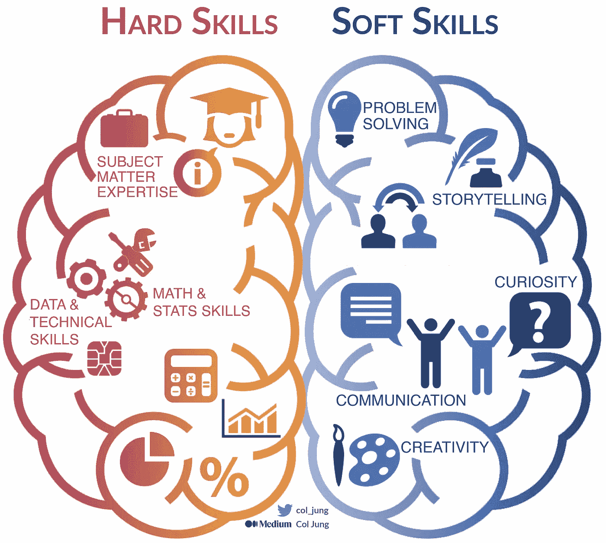
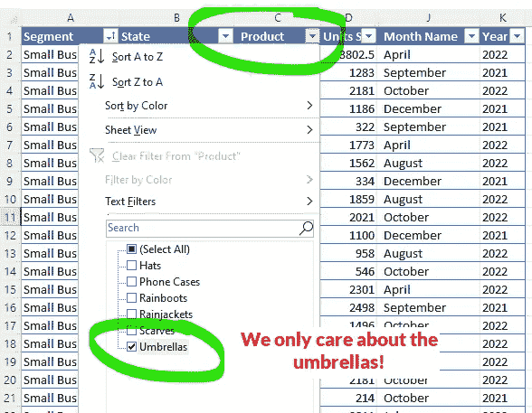

# 数据分析简介：**“谷歌方法”**

> 原文：[`towardsdatascience.com/intro-to-data-analytics-the-google-method-92d431b65581`](https://towardsdatascience.com/intro-to-data-analytics-the-google-method-92d431b65581)

## ***询问***，***分析与行动***

 [Col Jung](https://col-jung.medium.com/?source=post_page-----92d431b65581--------------------------------)

·发表于 [Towards Data Science](https://towardsdatascience.com/?source=post_page-----92d431b65581--------------------------------) ·阅读时间 12 分钟·2023 年 6 月 14 日

--

图片由 [Adam Satria](https://unsplash.com/photos/uXLgmicKSi4) 提供（Unsplash）

在 [大型公司](https://generativeai.pub/modern-enterprise-data-strategy-a-guide-for-analysts-data-scientists-engineers-2d4b45a31427) 中的数据分析往往很混乱。

数据往往是**难以捉摸**的，藏匿在组织的各个角落，需要软技能和*福尔摩斯*般的调查才能找到并整合起来。

公司的**数据治理**堡垒虽然保护了公司及其客户，但也使得获取数据的目标变得复杂。在这里，谈判和软技能至关重要。

仿佛这些还不够具有挑战性，你还需要具备有效分析的技术能力***和***掌握**数据故事讲述**的艺术，以便 [展示影响](https://medium.com/swlh/power-of-storytelling-in-business-data-analytics-your-data-is-only-half-the-story-f50fadf9712b)你的数据驱动洞察。

**更新**：我现在在 [YouTube](https://www.youtube.com/@col_builds) 上发布分析教程。

所需技能的现实。图片由作者提供

在澳大利亚最大的银行之一担任数据科学家和工程师 过去五年 的经历让我发现，在线课程无法充分准备学生面对企业分析的现实。

我希望通过这篇文章一举三得。

对于那些…

1.  由于**行业经验较少**——我将分享我在银行中从头到尾的数据分析项目经验，涵盖所有细节。

1.  **学习数据分析**——我们将在*Excel*中进行基本的**数据透视表分析**，并以可视化洞察结束。数据集[已包含](https://docs.google.com/spreadsheets/d/1prYnS-uSURMwVpNg1QwOOESglHcCAzGb/edit?usp=sharing&ouid=103442929647019644711&rtpof=true&sd=true)！

1.  寻找一个**数据分析流程**来遵循——我将采用*Google*的[六阶段](https://www.coursera.org/professional-certificates/google-data-analytics?utm_source=google&utm_medium=institutions&utm_campaign=gwgsite&_ga=2.87126808.1691592099.1630867447-928533899.1630867447)流程，供现代数据分析师使用：***询问***，***准备***，***处理***，***分析***，***分享***和***行动***。

从描述性分析到预测建模。图片由作者提供

让我们深入探讨一下。

# 1\. 询问

与学术界不同，行业中的分析由**业务需求**驱动。

利益相关者试图解决什么问题？你的分析通常会使公司做得[**更好、更快**或**更便宜**](https://generativeai.pub/modern-enterprise-data-strategy-a-guide-for-analysts-data-scientists-engineers-2d4b45a31427)。

**我的银行：** 在我所在的银行业，这里是一些我们常遇到的典型问题。

+   我们如何更好地识别*欺诈*交易？

+   哪些因素会导致*客户流失*或*员工离职**？*

+   客户*满意度*的主要驱动因素是什么？

+   影响*信用卡*消费的关键因素是什么？

+   我们如何优化我们的*贷款审批*流程，使其更快但仍然及时？

我们将与业务利益相关者合作，**提出正确的问题**，**定义问题**和**制定解决计划**。

我们将利用一些**领域专长**并考虑整个问题，以准确捕捉情况。

在整个项目过程中，我们将与这些利益相关者保持开放的沟通。

**所需技能：** 项目和利益相关者管理；领域专长。

## **练习**

假设你为一家小型在线零售商工作，该商店向澳大利亚和新西兰的客户销售各种商品。你的老板希望了解雨伞的销售表现：

> “哪个月份它们卖得最好？”
> 
> “在澳大利亚和新西兰，它们在哪些地方最受欢迎？

很好！一些值得深入探讨的问题。

# 2\. 准备

业务需求现在驱动了**数据需求**。

我们需要**准备数据**以进行分析，从而获得解答商业问题的洞察力。（哎，这真是长话短说！）

**我的银行：** 这些是分析师在数据准备过程中需要解决的一些常见问题。

+   **我们需要哪些数据？这些数据在哪里？** 是操作数据还是分析数据？操作数据存储在哪些源系统中？分析数据存在数据仓库还是数据湖中？

+   **我们可以使用哪些工具来访问数据**？你可能会使用类似*Teradata Studio*的工具来访问由数据仓库供应商*Teradata*托管的 SQL 数据库。你可能会使用*Azure Synapse Analytics*来处理在[*Microsoft Azure Cloud*](https://generativeai.pub/cloud-computing-unleashed-how-to-harness-the-power-of-cloud-for-your-business-f72e8e23be9)上托管的大数据。你可能会使用*Excel*或*Power BI*来处理较小的表格，尤其是那些足够小可以下载到本地计算机的表格。如果你需要将所有这些来源的数据集连接起来怎么办？也许一个像*Dataiku*这样的全功能数据科学工作台可以帮忙。

+   **我们需要导航哪些治理流程？** 谁拥有数据？我们需要什么批准才能访问数据，特别是当数据包含敏感客户信息时？你如何保证数据的安全性？如何跟踪在项目生命周期中数据转化的来源？（…对企业技术债务的一个重要贡献）。

关于治理，这里的数据发现项目通常需要来自多个利益相关者的支持，他们都有自己的利益和 KPI：

+   商业——显然！他们最初委托了我……

+   架构——此项目所需的模式是否与银行的*战略*技术方向一致？还是我的工作大部分是临时性的战术解决方案，后来将失去价值？我的团队是否会对技术债务产生贡献？

+   数据平台——我们是否拥有实现项目目标所需的数据和工具服务？它是否符合我们的资金限制？

+   治理——访问和使用数据需要哪些文书工作？是否存在隐私和伦理考虑？

+   风险——存在哪些数据风险？应对措施是什么？如何保护敏感数据？

**所需技能：** 理解公司的企业数据架构；数据建模；对不同平台和工具的经验；能够协调各种利益相关者的利益。

## 练习（续）

假设在线业务的汇总销售数据存储在一个 CRM 平台中，并可以从[这里](https://docs.google.com/spreadsheets/u/5/d/1prYnS-uSURMwVpNg1QwOOESglHcCAzGb/edit?usp=sharing&ouid=103442929647019644711&rtpof=true&sd=true)下载到你的笔记本电脑。

这在*Excel*中是这样的。

作者提供的图片

# 3\. 过程

啊，最有趣的部分。

**数据整理！**

*(半开玩笑说…)*

在数据处理阶段，你将清理数据并使其准备好进行分析。

这包括解决**数据质量问题**——例如重复和缺失的数据——并决定如何处理不相关的数据和异常值。

**我的银行：** 在大型组织中，数据质量问题几乎无法消除。

生成的数据量实在太多了，来源系统和参与者太多。

数据仓库通常因特定项目构建的定制数据管道而积累大量技术债务，创建了不可重用的冗余数据资产。

在 2020 年代，组织正在[全球范围内采用](https://generativeai.pub/data-products-why-your-organisation-needs-them-4ac7bf2e5953)的解决方案是将数据从*项目*导向的思维模式转变为*产品*导向的思维模式，将数据视为高质量的可重用产品。

同时，由于将大量工作集中在过度负担的中央数据团队上，数据湖会遇到瓶颈问题，这些团队虽然是数据工程专家，却不是数据领域专家。

然而，拥有专业数据工程师构建 ETL 管道的好处在于可以识别和修复大量数据问题。

**需要的技能：** 数据处理。

## 练习（续）

是时候准备好上面的电子表格进行分析了。

由于你关注的是雨伞销售的受欢迎程度（即销售量才是关键），我建议你隐藏如*销售价格*和*制造成本*这样的列。

图片来自作者

然后你可以筛选销售数据，只看雨伞的销售情况……因为这正是你老板关心的！

图片来自作者

哎呀，我们已经可以看到一些数据质量问题，你可以直接在电子表格中修复它们。

理想情况下，数据质量问题通过**编程**方式解决，因为人工处理在大数据集之外的可靠性有限。

幸运的是，这个练习的数据集*是*小型的。

图片来自作者

解决这些问题后，你的数据集就准备好进行分析了。

享受这个故事吗？当我发布类似文章时，获取一封[电子邮件](https://col-jung.medium.com/subscribe)。

# 4\. 分析

是时候进入有趣的部分了。

当然，这就是所有在线课程集中关注的内容——分析！

主要目标是**发现解决业务问题的模式、关系和趋势**。

你会理解数据并试图解锁其中潜在的价值。

**我的银行：** 我们拥有分析卓越的领域，包括进行高级分析和预测建模的数据科学团队。这包括传统的[机器学习原型设计](https://medium.com/geekculture/ai-revolution-your-fast-paced-introduction-to-machine-learning-914ce9b6ddf)与 Python 笔记本，或较新的无代码机器学习平台，这些平台使先进的能力在整个组织中得以普及。

AI、大数据和数据科学的世界如何交织。图片来源于作者

然而，迄今为止，大多数组织处于接近描述性分析的数据成熟度水平，这意味着使用像 Excel 和 Power BI 这样的工具。

**所需技能：** 分析能力！

## 练习（续）

为了更好地理解数据中发生的事情，你可以通过利用**数据透视表**来以有用的方式切片和分割数据集及其字段。

这个想法是，你只选择你感兴趣的变量，并创建可视化图表以推动洞察。

要在 Excel 中创建数据透视表，选择源数据并在旁边插入一个*数据透视表*。

图片来源于作者

你将从一个空白的*数据透视表*开始，你可以通过拖放字段来填充它，如下所示。

图片来源于作者

你感兴趣的是测量伞的销售数量，所以拖动：

+   *产品*字段放入筛选器，以便你可以按伞进行筛选；

+   *销售数量*字段放入值区域，因为这是你的主要**度量**。

+   *年份*和*月份名称*放入行区域，以便你了解按年和月的伞销售情况。

你现在有了你的*数据透视表*！

图片来源于作者

现在是大结局——在图表中可视化你的*数据透视表*。

要创建它，选择你的*数据透视表*并插入一个*数据透视图*。我建议选择**折线图**，但也可以尝试其他图表，以最佳地展示你的数据。

图片来源于作者

啊哈，魔法时刻……

洞察！

图片来源于作者

你的*数据透视图*清楚地讲述了一个有趣的数据故事。

在 2022 年，伞的销售在 4 月激增，在 5 月至 6 月间达到了第一个高峰，7 月略微下降，然后在 8 月达到了最终高峰后再次下降。

无论如何，5 月至 8 月的销售额比其他时间段*显著更高*。

这解决了第一个业务问题，即确定一年中的哪个时间段销售最好。

通过拖放字段到我们的*数据透视表*中，你可以创建另一个*数据透视图*，以回答第二个业务问题，即澳大利亚和新西兰的哪些部分驱动了最佳销售。

图片来源于作者

我们可以清楚地看到，大多数伞的销售实际上来自新西兰。这进一步揭示了第一个商业问题——五月和八月恰好是该国的湿季！

简而言之，你清理了数据，创建了一些数据透视表来汇总数据，然后制作了一些图表来直观地显示我们的新西兰朋友在仅仅几个湿润的月份内负责了大部分伞的销售！

很好！

# 5\. 分享

在这里，你想找到一个合适的受众来分享你的洞察。

如果你的发现没有对*某种*下游决策提供信息，那么它们*有价值*吗？

好吧，这有点苛刻，但我想表达的是，很多分析洞察没有得到利用，通常是因为它们：

+   分析师没有与利益相关者分享，或者

+   没有很好地表达或者

+   没有被决策者采取行动（更多内容见下文）。

一个有效的数据分析师会提取他们的洞察*并*利用他们的软技能来吸引利益相关者和决策者，听取他们的信息。

**所需技能：** 数据可视化；有效的沟通和讲故事；利益相关者管理；说服力和软技能。

## 练习（续）

安排一个会议向你的老板展示你的发现。他需要了解你的新西兰客户有多重要！

# 6\. 行动

在我们的端到端数据分析过程的最后，你的**沟通和讲故事技能**至关重要。

许多数据科学家认为这些是*最*重要的技能，因为没有这些技能，你的工作对利益相关者的影响会很小，最终会变得微不足道。

**你希望决策者对你的洞察*采取行动*。**

数据讲述在这里至关重要，因为…

+   你的数据不会自己说话。抱歉！

+   人类天生相信故事。

+   故事创造了受众的共鸣，这产生了催产素反应，从而导致他们对你的**信任**。

+   一旦你建立了这种联系，你可以向他们推销你想要的任何东西。

+   最终： [讲故事，而不是数据](https://medium.com/swlh/power-of-storytelling-in-business-data-analytics-your-data-is-only-half-the-story-f50fadf9712b)。

**我的银行：** 不幸的是，许多分析和数据科学项目最终没有被决策者采取行动。

这可能有多种原因：

+   未获得利益相关者的支持。你的结果不够强，或者可能以一种低估其影响的方式进行了传达。（改进你的表达！）

+   洞察很难付诸行动。例如，实施某些洞察可能昂贵得离谱，或者与当前的商业优先事项不一致。（运气不好！）

+   传统文化对数据驱动的洞察*抗拒*，这反映了组织的数据成熟度。（这个问题超出了你的薪资等级。）

你的公司处于什么位置？图片由作者提供

大多数公司的数据成熟度在**3 分或更低**。

我的银行——像许多西方银行一样——大致评分为 2 到 3 分（满分 5 分），特点是有些领域表现出色，而领导团队正竭尽全力通过各种举措提升整个企业的数据素养，例如**数据民主化**。（让数据和工具对所有人更为便捷。）

**所需技能：** 数据可视化；有效的沟通和讲故事能力；利益相关者管理；说服力和软技能。

## 练习（续）

在与老板的会议中，你串联了一个强有力的叙述，利用了你制作的一些交互式 Excel *数据透视图*。你的老板被说服了，承诺在新西兰建立一个更强大的业务，同时确保那里为明年的湿季储备足够的伞具。

恭喜你成功说服*决策者*，使他们**采取行动**基于你的分析洞察！

# 最后的话

数据分析课程通常较少教授在*现实世界*中成为***有效*数据分析师所需的各种软技能。

这就是我喜欢谷歌的六阶段框架的原因：

+   **询问**。商业问题是什么？

+   **准备**。我们如何获取所需的数据？

+   **过程**。可靠的洞察只能来自干净的数据。

+   **分析**。最后……展示你的技术实力的时候到了！

+   **分享**。组建一个相关的听众群体，讲述一个引人入胜的故事。

+   **行动**。你传达的数据洞察是否对决策产生了影响？

在本文中，我探讨了个人在行业中的经验，阐明了大企业在每个阶段的考虑因素和挑战。

对于那些有志成为数据分析师的你们，我们整理了一些重要技能，比如将小数据集整理成汇总的数据透视表，并制作可视化图表以揭示可报告的洞察。

告诉我你是否喜欢这篇文章！

祝你旅途顺利。

在 [Twitter](https://twitter.com/col_jung) 和 YouTube [点击这里](https://youtube.com/@col_builds)， [点击这里](https://youtube.com/@col_invests) 和 [点击这里](https://youtube.com/@col_shoots) 找到我。

# 我受欢迎的人工智能、机器学习和数据科学文章

+   人工智能与机器学习：快速入门——[点击这里](https://col-jung.medium.com/ai-revolution-your-fast-paced-introduction-to-machine-learning-914ce9b6ddf)

+   机器学习与机械建模——[点击这里](https://medium.com/swlh/differential-equations-versus-machine-learning-78c3c0615055)

+   数据科学：现代数据科学家的新时代技能——点击这里

+   生成式人工智能：大公司如何争先恐后地采用——[点击这里](https://generativeai.pub/how-big-companies-are-scrambling-to-adopt-generative-ai-d52456fb4c69)

+   ChatGPT 与 GPT-4：OpenAI 如何赢得自然语言理解战争——[点击这里](https://col-jung.medium.com/the-road-to-chatgpt-gpt-4-how-deep-learning-revolutionised-natural-language-processing-835d89560577)

+   GenAI 艺术：DALL-E、Midjourney 和 Stable Diffusion 解析 — [这里](https://col-jung.medium.com/generative-ai-art-the-road-to-dall-e-midjourney-stable-diffusion-3b3219d97f02)

+   超越 ChatGPT：寻找真正的智能机器 — [这里](https://col-jung.medium.com/from-chatgpt-to-singularity-the-search-for-a-truly-intelligent-machine-856c8f4c5e63)

+   现代企业数据战略解析 — [这里](https://generativeai.pub/modern-enterprise-data-strategy-a-guide-for-analysts-data-scientists-engineers-2d4b45a31427)

+   从数据仓库与数据湖到数据网格 — 这里

+   从数据湖到数据网格：最新架构指南 — 这里

+   Azure Synapse Analytics 实战：7 个用例解析 — [这里](https://generativeai.pub/azure-synapse-analytics-in-action-7-real-world-use-cases-explored-c73ef231b408)

+   云计算 101：为您的业务利用云 — [这里](https://generativeai.pub/cloud-computing-unleashed-how-to-harness-the-power-of-cloud-for-your-business-f72e8e23be9)

+   数据仓库与数据建模 — 快速入门课程 — 这里

+   数据产品：为分析建立坚实基础 — [这里](https://generativeai.pub/data-products-why-your-organisation-needs-them-4ac7bf2e5953)

+   数据民主化：5 个“数据普及”策略 — 这里

+   数据治理：分析师常见的 5 个痛点 — 这里

+   数据讲故事的力量 — 销售故事，而非数据 — [这里](https://medium.com/swlh/power-of-storytelling-in-business-data-analytics-your-data-is-only-half-the-story-f50fadf9712b)

+   数据分析入门：谷歌方法 — 这里

+   Power BI — 从数据建模到惊艳报告 — 这里

+   回归分析：使用 Python 预测房价 — 这里

+   分类：使用 Python 预测员工流失 — 这里

+   Python Jupyter 笔记本与 Dataiku DSS — 这里

+   常见机器学习性能指标解释 — 这里

+   在 AWS 上构建 GenAI — 我的第一次体验 — [这里](https://generativeai.pub/how-big-companies-are-scrambling-to-adopt-generative-ai-d52456fb4c69)

+   数学建模与机器学习在 COVID-19 中的应用 — [这里](https://medium.com/swlh/math-modelling-and-machine-learning-for-covid-19-646efcbe024e)

+   工作的未来：你的职业在人工智能时代安全吗？— [这里](https://col-jung.medium.com/future-of-work-is-your-career-safe-in-the-age-of-chatgpt-gpt-4-122d5996bd57)
