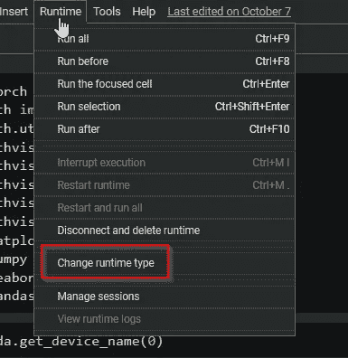

# PyTorch 2：卷积神经网络

> 原文：[`towardsdatascience.com/intro-to-pytorch-2-convolutional-neural-networks-487d8a35139a?source=collection_archive---------1-----------------------#2023-02-13`](https://towardsdatascience.com/intro-to-pytorch-2-convolutional-neural-networks-487d8a35139a?source=collection_archive---------1-----------------------#2023-02-13)

 [托尼·弗洛雷斯](https://medium.com/@florestony5454?source=post_page-----487d8a35139a--------------------------------)

·

[关注](https://medium.com/m/signin?actionUrl=https%3A%2F%2Fmedium.com%2F_%2Fsubscribe%2Fuser%2Fce0f79ea6056&operation=register&redirect=https%3A%2F%2Ftowardsdatascience.com%2Fintro-to-pytorch-2-convolutional-neural-networks-487d8a35139a&user=Tony+Flores&userId=ce0f79ea6056&source=post_page-ce0f79ea6056----487d8a35139a---------------------post_header-----------) 发表在[Towards Data Science](https://towardsdatascience.com/?source=post_page-----487d8a35139a--------------------------------) ·16 分钟阅读·2023 年 2 月 13 日

--

图片来源于 Adobe Stock

# **简介**

在[本系列的前一部分](https://medium.com/towards-data-science/intro-to-pytorch-part-1-663574fb9675)，我们使用了[CIFAR-10 数据集](https://www.cs.toronto.edu/~kriz/cifar.html)并介绍了 PyTorch 的基础知识：

+   张量及其相关操作

+   数据集和 DataLoader

+   构建基本神经网络

+   基本模型训练和评估

我们为 CIFAR-10 数据集开发的图像分类模型只能在验证集上达到 53%的准确率，并且在正确分类一些类别的图像（如鸟类和猫类，大约 33–35%）时表现非常挣扎。这是预期中的，因为我们通常会使用卷积神经网络进行图像分类。在本教程系列的这一部分，我们将专注于 CNN 及其在 CIFAR-10 上提高图像分类性能。

# **CNN 基础**

在我们深入代码之前，让我们讨论一下卷积神经网络的基础，以便更好地理解我们的代码在做什么。如果你对 CNN 的工作原理很熟悉，可以跳过这一部分。

与前馈网络（如我们在系列前一部分中开发的那种）相比，CNN 具有不同的架构，并由不同类型的层组成。在下图中，我们可以看到典型 CNN 的一般架构，包括它可以包含的不同层类型。

图片来源：作者

卷积网络中通常存在的三种层是：

+   卷积层（红色虚线轮廓）

+   池化层（蓝色虚线轮廓）

+   全连接层（红色和紫色实线轮廓）

## **卷积层**

CNN 的定义组件和第一层是卷积层，它由以下内容组成。

+   输入数据（在本例中为图像）

+   过滤器

+   特征图

卷积层与密集连接层的真正区别在于卷积操作。我们不会深入探讨卷积的定义，但如果你真的感兴趣并想深入了解，[这篇文章](https://betterexplained.com/articles/intuitive-convolution/#Part_3_Mathematical_Properties_of_Convolution)很好地解释了数学定义，并提供了一些非常具体的例子。如果你感兴趣，我强烈推荐它！

那么，为什么卷积层比密集/完全连接层在图像数据中更好呢？本质上，密集层会学习输入中的全局模式，而卷积层具有学习局部和空间模式的优势。这听起来可能有点模糊或抽象，因此让我们看一个示例来说明这意味着什么。

图片来源：作者

在图像的左侧，我们可以看到一个基本的二维黑白图像 4 在卷积层中的表示方式。红色方框是过滤器/特征检测器/卷积核，正在对图像进行卷积。在右侧是相同图像输入到密集连接层中的方式。你可以看到与红色卷积核框架内相同的 9 个图像像素。注意左侧像素如何在空间上被分组，邻近其他像素。然而在右侧，这 9 个像素不再是邻居。

通过这一点，我们可以看到当图像被展平并在全连接/线性层中表示时，空间/位置相关的信息是如何丢失的。这就是为什么卷积神经网络在处理图像数据时更强大的原因。输入数据的空间结构得以保持，图像中的模式（边缘、纹理、形状等）可以被学习。

这本质上是使用 CNN 处理图像的**原因**，但现在让我们讨论一下**方法**。我们来看一下输入数据的结构、我们一直讨论的‘滤波器’，以及将所有这些结合在一起时卷积的样子。

## **输入数据**

CIFAR-10 数据集包含 60,000 张 32x32 彩色图像，每张图像被表示为一个三维张量。每张图像将是一个 `(32,32,3)` 张量，其中维度为 32（高度）x 32（宽度）x 3（R-G-B 颜色通道）。下图展示了数据集中飞机的全彩图像中分离出的三种不同颜色通道（RGB）。

图像来源：作者

图像通常被认为是二维的，因此可能容易忽略因为它们有三个颜色通道，它们实际上是以三维表示的！

## **滤波器**

卷积层中的滤波器（也称为内核或特征检测器）是一个权重数组，实质上以滑动窗口的方式扫描图像，在每个停靠点计算点积，并将该点积输出到一个新的数组中，称为特征图。滑动窗口扫描称为卷积。让我们看看这个过程的插图，以帮助理解发生了什么。

*3x3 滤波器（蓝色）在输入（红色）上卷积以创建特征图（紫色）的插图。图像来源：作者*

*每一步卷积中的点积计算插图。图像来源：作者*

需要注意的是，滤波器的权重在每一步中保持不变。就像全连接层中的权重一样，这些值在训练过程中被学习，并通过反向传播在每次训练迭代后进行调整。不过，插图并没有展示全部情况。在训练 CNN 时，你的模型在卷积层中不会只有一个滤波器。通常情况下，一个卷积层中有 32 或 64 个滤波器，事实上，在我们本教程中开发的模型中，一个层中将有多达 96 个滤波器。

最后，尽管滤波器的权重是训练的主要参数，还有可以调整的超参数：

+   层中的滤波器数量

+   滤波器的维度

+   步幅（滤波器每一步移动的像素数）

+   填充（滤波器如何处理图像的边界）

我们不会深入讨论这些超参数，因为这并不是一个全面的 CNN 讲解，但这些是需要了解的重要因素。

## **池化层**

池化层与卷积层类似，都是通过一个过滤器对输入数据（通常是卷积层输出的特征图）进行卷积。然而，与特征检测不同，池化层的功能是降维或下采样。最常用的两种池化类型是最大池化和平均池化。最大池化中，过滤器在输入上滑动，每一步都会选择具有最大值的像素作为输出。在平均池化中，过滤器会输出过滤器所经过的像素的平均值。

## **全连接层**

最后，CNN 通常在卷积层和池化层之后会有全连接层，这些层将执行图像分类任务中的分类，例如本教程中的任务。

现在我们已经了解了卷积神经网络的结构和操作方式，让我们进入有趣的部分，在 PyTorch 中训练我们自己的 CNN！

# **设置**

与本教程的第一部分一样，我建议使用 Google Colab 来跟随，因为你将已经设置好 Python 环境，并安装了 PyTorch 和其他库，以及一个用于训练模型的 GPU。

所以，如果你正在使用 Colab，为了确保你正在使用 GPU，请前往 `Runtime` 并点击 `Change runtime type`。

图片来源：作者

在对话框中选择 `GPU` 并保存。

图片来源：作者

现在你在 Colab 中有 GPU 访问权限，我们可以用 PyTorch 验证你的设备。所以首先，让我们处理一下导入：

如果你想检查你可以访问的 GPU，输入并执行 `torch.cuda.get_device_name(0)`，你应该能看到你的设备输出。Colab 提供了几种不同的 GPU 选项，因此你的输出会因获得的访问权限而有所不同，但只要运行此代码时不出现 `RuntimeError: No CUDA GPUs are available`，你就正在使用 GPU！

我们可以将 GPU 设置为 `device`，这样在开发模型时，可以通过引用 `device` 将模型分配到 GPU 上，如果没有 CUDA GPU 设备，也可以使用 CPU。

接下来，让我们设置一个随机种子，以确保结果是可重复的，并下载我们的训练数据，同时设置 `transform` 以将图像转换为张量并归一化数据。

下载完成后，让我们查看数据集中包含的类别：

最后，让我们设置训练和测试数据加载器：

现在我们准备好构建我们的模型了！

# **构建 CNN**

在 PyTorch 中，`nn.Conv2d`是用于图像输入数据的卷积层。`Conv2d`的第一个参数是输入的通道数，因此对于我们的第一个卷积层，我们将使用 3，因为彩色图像将有 3 个颜色通道。在第一个卷积层之后，这个参数将取决于前一层输出的通道数。第二个参数是层中卷积操作输出的通道数。这些通道就是在卷积层介绍中讨论的特征图。最后，第三个参数是卷积核或过滤器的大小。这可以是像`3`这样的整数值表示`3x3`的卷积核，或者是像`(3,3)`这样的元组。因此，我们的卷积层将采用`nn.Conv2d(in_channels, out_channels, kernel_size)`的形式。可以添加其他可选参数，包括（但不限于）：`stride`、`padding`和`dilation`。我们将在卷积层`conv4`中使用`stride=2`。

在经过一系列卷积层之后，我们需要使用一个展平层将特征图展平成可以输入到线性层的数据，为此我们将使用`nn.Flatten()`。我们可以使用`nn.BatchNorm1d()`来应用批量归一化，并且需要传入特征数量作为参数。最后，我们的线性全连接层使用`nn.Linear()`构建，它也会将特征数量作为第一个参数，并且指定输出特征的数量作为第二个参数。

为了开始定义我们模型的基本架构，我们将定义一个继承自 PyTorch `nn.Module`类的`ConvNet`类。然后，我们可以将每一层定义为类的属性，并根据需要构建它们。一旦我们指定了层的架构，就可以通过创建一个`forward()`方法来定义模型的流动。我们可以用激活函数包裹每一层，在我们的案例中我们将使用`relu`。我们可以在层之间应用`dropout`，通过传入前一层和`p`的元素丢弃概率（默认为 0.5）。最后，我们创建我们的模型对象并将其附加到我们的`device`上，以便在 GPU 上进行训练。

## **训练和测试函数**

如果你完成了本教程的第一部分，我们的训练和测试函数将与之前创建的完全相同，只是我们将在训练方法中返回`loss`，并在测试方法中返回`loss`和`correct`的数量，以便在调整超参数时使用。

最后，我们在基础模型训练之前定义损失函数和优化器。

让我们训练模型。

图片来源：作者

仅仅经过 10 个周期，61.7%的表现远远好于我们训练的全连接模型！显然，CNN 更适合图像分类，但通过延长训练时间和调整超参数，我们可以挤出更多的性能。在我们进行这些操作之前，让我们快速查看一下内部情况，看看滤波器是什么样的。回忆一下，滤波器的像素是我们模型中的可训练参数。这不是训练图像分类模型的必要步骤，我们也不会发现太多有用的信息，但看到模型内部发生了什么还是很有趣的。

# **可视化滤波器**

我们可以编写一个函数来绘制模型中特定层的滤波器。我们只需指定要查看的层，并将其传递到我们的函数中。

让我们查看一下第一卷积层（`conv1`）中的滤波器，因为这些滤波器直接应用于图像。

以下是输出，包含了来自我们的`conv1`卷积层的 48 个滤波器的可视化。我们可以看到每个滤波器是一个包含不同值或颜色的 3x3 张量。

图片来源：作者

如果我们的滤波器是 5x5 的，我们会在图中看到这种差异。回忆一下，使用`nn.Conv2d`我们可以通过第三个参数来改变滤波器的大小，所以如果我们想要一个 5x5 的，`conv1`将会是这样的：

如果我们使用新的 5x5 滤波器重新训练模型，输出将会变成这样：

图片来源：作者

如我之前提到的，这里没有太多有用的信息，但 nonetheless 仍然很有趣。

# **超参数优化**

对于本教程，我们将调整的超参数是卷积层中的滤波器数量和线性层中的神经元数量。目前这些值被硬编码在我们的模型中，因此为了使其可调，我们需要使模型可配置。我们可以在模型的`__init__`方法中使用参数（`c1`、`c2`和`l1`），并用这些值创建模型的层，这些值将在调整过程中动态传递。

我们肯定不只限于调整这些超参数。实际上，学习率和批量大小通常也在需要调整的超参数列表中，但由于我们将使用网格搜索，我们必须大幅减少可调变量的数量，以保持训练时间合理。

接下来，让我们定义一个用于搜索空间的字典，以及一个保存给我们最佳结果的参数的字典。由于我们使用网格搜索进行优化，列表中列出的每种超参数的每种组合都会被使用。你可以很容易地为每个超参数的列表添加更多值，但每增加一个值都会大幅增加运行时间，因此建议从以下值开始以节省时间。

## **早停法**

在我们的优化过程中，一个重要的组成部分是早停的使用。由于我们将进行多个训练，每次训练都需要花费相当长的时间，因此如果训练性能没有改进，我们希望提前结束训练。如果模型没有改善，继续训练没有意义。

实质上，我们将跟踪模型在每个训练周期后产生的最低损失。然后我们定义一个 `tolerance`（容忍度），它指定模型必须在多少个周期内达到更好的损失。如果在指定的容忍度内未能达到更低的损失，该次训练将被终止，我们将转到下一个超参数组合。如果你像我一样喜欢检查训练过程，我们可以将更新日志记录到控制台，并查看早停计数器何时增加，方法是将 `self.verbose` 设置为 `True`。你可以将其硬编码到 `EarlyStopping` 类中，也可以在优化过程中实例化 `EarlyStopping` 对象时更改 `verbose` 值。

## **图像增强**

在设置我们的超参数优化方法以挤出一些额外的性能并遏制训练数据上的过拟合之前，我们还有最后一件事要做。图像增强是一种技术，通过对图像应用随机变换，实质上创建了“新的”人工数据。这些变换可能包括：

+   将图像旋转几度

+   水平/垂直翻转图像

+   裁剪

+   轻微的亮度/色调变化

+   随机缩放

包括这些随机变换将提高模型的泛化能力，因为增强的图像将与原始图像相似，但有所不同。内容和模式将保持不变，但数组表示将有所不同。

PyTorch 通过 `torchvision.transforms` 模块使图像增强变得简单。如果我们有几个想要应用的变换，我们可以用 `Compose` 将它们串联在一起。需要记住的一件事是，图像增强每应用一个变换需要一点计算量，而且这一过程应用于数据集中的**每张图像**。对数据集应用大量不同的随机变换将增加训练所需的时间。因此，现在让我们限制变换，以免训练时间过长。如果你想添加更多的变换，可以查看[PyTorch 文档关于图像变换和增强](https://pytorch.org/vision/stable/transforms.html)，并将它们添加到 `Compose` 列表中。

一旦我们选择了数据增强的变换，我们可以像应用归一化和将图像转换为张量一样，将它们应用到数据集上。

现在我们已经在训练数据上设置了图像增强，我们准备好设置我们的超参数优化方法了。

## **定义优化方法**

我们可以创建一个类（`HyperSearch`），包含超参数值配置、详细报告设置、一个报告列表（以便在优化完成后查看每个配置的表现），以及一个用于存储最佳性能配置的变量。

接下来，我们可以在`HyperSearch`类中创建一个方法来执行网格搜索，并用每种超参数组合进行训练。首先，我们将配置`EarlyStopping`，使其`容忍度=tolerance=3`，并设置它保存每个超参数组合的权重。如果`self.verbose`设置为`True`，我们可以在控制台看到当前正在训练的超参数组合。

接下来，我们用我们设计的`CoinfigNet`模型来定义`model`，并传入`l1`、`c1`和`c2`值，同时选择损失函数和优化器，并设置我们的训练和验证`DataLoaders`。我们将保持较低的训练轮数，因为我们没有时间，也不希望完全训练每一个组合。目标是了解哪个组合在分类数据集时表现最好，然后我们可以拿到那个模型，进行全面训练，以查看其在完整训练周期中的表现。

现在，我们定义训练循环，基本上与之前相同，只是现在我们将保存`train`和`test`方法的损失，以便`early_stopping`可以跟踪训练进度（或缺乏进度）。最后，在每个轮次后，结果将被保存到报告中，并更新最佳损失值。

我们可以将整个超参数优化周期的结果输出为一个漂亮的表格，其中我们将能看到每次运行的超参数配置以及相应的损失和准确率。

将所有这些代码整合在一起，我们的`HyperSearch`类应该如下所示：

## **调整时间到！**

现在我们可以调整我们的超参数了！通过使用`%%time`，在整个调优过程完成后，我们可以精确地看到所用的时间。我们将学习率保持为`lrate=0.001`和批量大小为`batch_sz=512`，用之前定义的`search_space`实例化`HyperSearch`，将`verbose`设置为`True`或`False`（你可以选择），然后调用`optimize()`方法开始调优。

**注意：** 在我的机器上（NVIDIA RTX 3070），完成这个过程大约花费了 50 分钟，所以如果你在 Colab 上使用提供的 GPU，预计也会花费差不多的时间。

一旦整个优化周期完成，你应该会得到如下表格：

图片来源：作者

# **结果**

从表格来看，最佳结果来自 Run 00，其`c1=48`，`c2=96`，`l1=256`。0.84 的损失和 71.24%的准确率是一个不错的改进，特别是考虑到它仅仅训练了 10 个轮次！

现在，我们已经找到了在 10 个 epoch 中表现最佳的超参数，接下来就对这个模型进行微调吧！我们可以训练更多的 epoch，并稍微降低学习率以尝试挤出更多的性能。首先，让我们定义我们希望使用的模型，并设置批量大小和学习率：

最后，我们可以将`epochs`设置为 50，并更改保存权重的路径。让训练周期运行，如果进展停止，早停将终止训练。

早停应该在达到 50 个 epoch 之前终止训练，并且应该达到约 77%的准确率。

图片来源：作者

现在我们已经调整了超参数，找到了最佳配置，并对模型进行了微调，是时候更深入地评估模型的表现了。

# **模型评估**

在这种情况下，我们的测试数据集实际上是我们的验证数据。我们将重用验证数据来评估模型，但通常你会在超参数调整后使用真正的测试数据进行模型评估。让我们加载优化后的模型，准备没有应用任何图像增强的`test_dataloader`，并运行`test()`进行评估。

这应该输出准确率和损失：

图片来源：作者

整体表现不错，但每个类别的表现对我们更有用。以下代码将输出我们模型在数据集中每个类别的准确率：

执行这个代码块将给出以下输出：

图片来源：作者

我们的模型在飞机、汽车、青蛙、船和卡车类别上的表现相当不错。同样值得注意的是，它最难处理的类别是狗和猫，这也是在本系列前面部分中，完全连接模型表现最差的类别。

## **混淆矩阵**

我们可以通过混淆矩阵获得更多关于性能的洞察。让我们建立一个混淆矩阵，然后获取一个良好的可视化效果。

定义了`confusion_matrix`之后，我们可以使用 Seaborn 库帮助我们可视化它。

图片来源：作者

该表的两个维度是“实际”值和“预测”值。我们希望大部分数据对齐在中心对角线处，即实际和预测类别相同。从错误预测中，我们可以看到模型经常混淆`cats`和`dogs`，这两个类别的准确率最低。

总体数据很好，但每个类别的精度和召回率将提供更有意义的数据。让我们首先查看每个类别的召回率。

## **每个类别的召回率**

图片来源：作者

## **每个类别的精度**

图片来源：作者

## **样本模型预测**

最后，让我们给模型喂入几张图像，查看其做出的预测。让我们创建一个函数来准备图像数据以供查看：

现在，我们可以准备测试数据，并创建另一个函数来获取`n`个预测样本。

调用函数，传入你想要采样的图像数量。输出将给出每张图像从左到右的真实标签和预测类别。

图片来源：作者

图片来源：作者

利用卷积网络进行超参数调优和图像增强确实有助于提高在 CIFAR-10 数据集上的表现！一如既往，感谢阅读，希望你对 PyTorch 和用于图像分类的 CNN 有了一些了解。包含所有代码的完整 Notebook 可以在[GitHub](https://github.com/florestony54/intro-to-pytorch-2/blob/main/pytorch2_2.ipynb)上找到。
