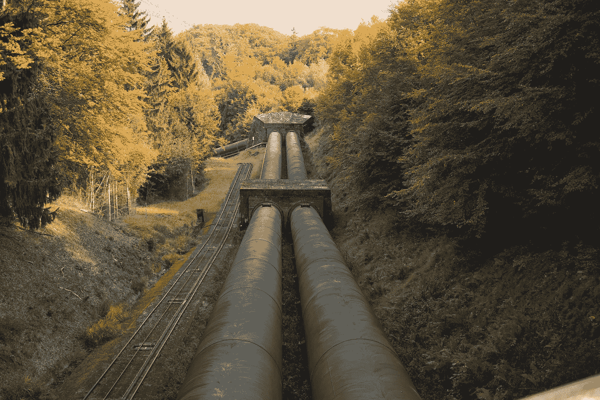

# TorchData 介绍：Conceptual Captions 3M 的实操指南

> 原文：[`towardsdatascience.com/intro-to-torchdata-a-walkthrough-with-conceptual-captions-3m-928144b5bc41?source=collection_archive---------10-----------------------#2023-03-22`](https://towardsdatascience.com/intro-to-torchdata-a-walkthrough-with-conceptual-captions-3m-928144b5bc41?source=collection_archive---------10-----------------------#2023-03-22)

## 学习如何使用 TorchData 和 DataPipes 高效地流式处理像 Conceptual Captions 3M 这样的巨大数据集。

[](https://frank-odom.medium.com/?source=post_page-----928144b5bc41--------------------------------)[](https://towardsdatascience.com/?source=post_page-----928144b5bc41--------------------------------) [Frank Odom](https://frank-odom.medium.com/?source=post_page-----928144b5bc41--------------------------------)

·

[关注](https://medium.com/m/signin?actionUrl=https%3A%2F%2Fmedium.com%2F_%2Fsubscribe%2Fuser%2F6f77d545fa4e&operation=register&redirect=https%3A%2F%2Ftowardsdatascience.com%2Fintro-to-torchdata-a-walkthrough-with-conceptual-captions-3m-928144b5bc41&user=Frank+Odom&userId=6f77d545fa4e&source=post_page-6f77d545fa4e----928144b5bc41---------------------post_header-----------) 发表在[Towards Data Science](https://towardsdatascience.com/?source=post_page-----928144b5bc41--------------------------------) ·8 分钟阅读·2023 年 3 月 22 日[](https://medium.com/m/signin?actionUrl=https%3A%2F%2Fmedium.com%2F_%2Fvote%2Ftowards-data-science%2F928144b5bc41&operation=register&redirect=https%3A%2F%2Ftowardsdatascience.com%2Fintro-to-torchdata-a-walkthrough-with-conceptual-captions-3m-928144b5bc41&user=Frank+Odom&userId=6f77d545fa4e&source=-----928144b5bc41---------------------clap_footer-----------)

--

[](https://medium.com/m/signin?actionUrl=https%3A%2F%2Fmedium.com%2F_%2Fbookmark%2Fp%2F928144b5bc41&operation=register&redirect=https%3A%2F%2Ftowardsdatascience.com%2Fintro-to-torchdata-a-walkthrough-with-conceptual-captions-3m-928144b5bc41&source=-----928144b5bc41---------------------bookmark_footer-----------)

照片由[Quinten de Graaf](https://unsplash.com/@quinten149?utm_source=medium&utm_medium=referral)拍摄，发布在[Unsplash](https://unsplash.com/?utm_source=medium&utm_medium=referral)上。

# 概述

在处理大型数据集时，尤其是在深度学习中，直接将数据集下载到本地进行训练可能不切实际。相反，在训练过程中直接流式传输数据集可能是一种更高效的方法。在本教程中，我们将介绍 TorchData 库，并演示如何使用它来流式传输 Conceptual Captions 3M 数据集，该数据集包含 300 万张图片及其对应的说明。

> **注意：** Conceptual Captions 在开源许可证下免费提供。有关更多信息，请参阅[许可证](https://github.com/google-research-datasets/conceptual-captions/blob/master/LICENSE)和[官方 GitHub 仓库](https://github.com/google-research-datasets/conceptual-captions)。

我们将首先简要介绍 TorchData 及其主要组件。接着，我们会演示如何为 Conceptual Captions 3M 数据集设置数据管道，最后，我们将展示如何使用该管道实时流式传输数据集的示例。

本教程旨在对完全初学者友好，因此我们会详细解释每个概念和代码片段。让我们开始吧！


图片由[Braden Collum](https://unsplash.com/@bradencollum?utm_source=medium&utm_medium=referral)拍摄，来源于[Unsplash](https://unsplash.com/?utm_source=medium&utm_medium=referral)

# TorchData 简介

TorchData 是一个提供常用数据加载方法的库，用于轻松构建灵活且高效的数据管道。以下是[TorchData README](https://github.com/pytorch/data#torchdata)的摘录：

> 它引入了可组合的 Iterable 风格和 Map 风格的构建块，称为 DataPipes，这些构建块与 PyTorch 的`DataLoader`能够很好地配合使用。这些内置的 DataPipes 提供了加载文件（来自本地或云存储）、解析、缓存、转换、过滤等多种功能。

## DataPipes


图片由[T K](https://unsplash.com/@realaxer?utm_source=medium&utm_medium=referral)拍摄，来源于[Unsplash](https://unsplash.com/?utm_source=medium&utm_medium=referral)

TorchData 的核心是 DataPipes，它可以被看作是数据管道的可组合构建块。DataPipes 实际上是重命名和重新设计的 PyTorch `Dataset`，专为组合使用而设计。它们接受对 Python 数据结构的访问函数，`IterDataPipes`使用`__iter__`，`MapDataPipes`使用`__getitem__`，并返回一个应用了轻微变换的新访问函数。

通过将 DataPipes 链接在一起，我们可以创建复杂的数据管道，将流式操作作为一等公民。这使我们能够高效地处理大型数据集，并减少对本地存储的需求。

## 示例

让我们从一个示例开始，以熟悉基本概念。我们将创建一个基本的 DataPipe，它接收一个整数的可迭代对象，并将其值翻倍：

```py
from torchdata.datapipes.iter import IterDataPipe

class DoublingDataPipe(IterDataPipe):
    def __init__(self, source_data):
        self.source_data = source_data

    def __iter__(self):
        for item in self.source_data:
            yield item * 2

# Initialize the DataPipe with a list of integers.
source_data = [1, 2, 3, 4, 5]
doubling_data_pipe = DoublingDataPipe(source_data)

# Iterate over the DataPipe and print the results.
for doubled_item in doubling_data_pipe:
    print(doubled_item)
```

这段代码定义了一个自定义的 `DoublingDataPipe`，它接受一个数据源的可迭代对象（在我们的例子中，是一个整数列表），并生成源数据中每个项的两倍。当我们运行这段代码时，我们应该会看到输出的值是加倍的：

```py
2
4
6
8
10
```

TorchData 还提供了许多内置的管道方法，这本可以使这个例子更加简洁。

`.map()`、`.filter()`、`.shuffle()` 和 `.chain()` 方法等，使我们能够快速构建强大且灵活的数据管道，而无需为每个操作编写自定义 DataPipes。它们可以直接应用于 `IterDataPipe`，以执行常见的数据处理任务，例如应用转换、过滤数据、随机化顺序和连接多个 DataPipes。

让我们探索几个示例。我们将使用之前示例中的 `source_data` 列表作为 DataPipes 的输入。

1.  `.map()`: 对 DataPipe 中的每个元素应用一个函数。

```py
from torchdata.datapipes.iter import IterableWrapper

data_pipe = IterableWrapper([1, 2, 3, 4, 5])

# Double each element in the DataPipe.
doubled_data_pipe = data_pipe.map(lambda x: x * 2)

for item in doubled_data_pipe:
    print(item)

# Output: 2, 4, 6, 8, 10
```

这里重新列出了之前的 `DoublingDataPipe` 示例的单行代码：`data_pipe.map(lambda x: x * 2)`。

2\. `.filter()`: 根据条件过滤 DataPipe 中的元素。

```py
from torchdata.datapipes.iter import IterableWrapper

data_pipe = IterableWrapper([1, 2, 3, 4, 5])

# Filter out odd elements in the DataPipe.
even_data_pipe = data_pipe.filter(lambda x: x % 2 == 0)

for item in even_data_pipe:
    print(item)

# Output: 2, 4
```

3\. `.shuffle()`: 随机打乱 DataPipe 中元素的顺序。

```py
from torchdata.datapipes.iter import IterableWrapper

data_pipe = IterableWrapper([1, 2, 3, 4, 5])

# Shuffle the elements in the DataPipe.
shuffled_data_pipe = data_pipe.shuffle(buffer_size=5)

for item in shuffled_data_pipe:
    print(item)

# Output: Randomly ordered elements, e.g., 3, 1, 5, 2, 4
```

4\. `.chain()`: 连接两个或更多 DataPipes。

```py
from torchdata.datapipes.iter import IterableWrapper

data_pipe1 = IterableWrapper([1, 2, 3])
data_pipe2 = IterableWrapper([4, 5, 6])

# Chain the two DataPipes together.
chained_data_pipe = data_pipe1.chain(data_pipe2)

for item in chained_data_pipe:
    print(item)

# Output: 1, 2, 3, 4, 5, 6
```

# 设置 Conceptual Captions 3M


照片由 [John Schnobrich](https://unsplash.com/@johnschno?utm_source=medium&utm_medium=referral) 提供，来自 [Unsplash](https://unsplash.com/?utm_source=medium&utm_medium=referral)

在本节中，我们将逐步介绍如何为 Conceptual Captions 3M 数据集设置数据管道。该数据集包含 300 万张图像及其对应的标题，因此在本地下载以进行训练是不可行的。相反，我们将使用 TorchData 在训练过程中直接流式传输数据集。

## 依赖项

在深入代码之前，我们先安装本教程所需的依赖项。你需要以下 Python 包：

+   torchdata

+   tqdm（用于显示进度条）

+   aiohttp（用于异步 HTTP 请求）

+   Pillow（用于处理图像）

你可以使用 pip 安装它们：

```py
pip install torchdata tqdm aiohttp Pillow
```

## 异步图像下载的异步助手函数

由于我们将从远程 URL 流式传输图像，我们需要一种有效的方式来并行下载它们。我们将使用 `aiohttp` 库来进行异步 HTTP 请求。

首先，让我们创建一个助手函数 `async_get_image`，它接受 `aiohttp.ClientSession` 和一个 URL 作为输入，并返回下载的图像：

```py
import aiohttp
from PIL import Image
import io

async def async_get_image(
    session: aiohttp.ClientSession, url: str
) -> Optional[Image.Image]:
    try:
        resp = await session.get(url)
        image_bytes = await resp.read()
        return Image.open(io.BytesIO(image_bytes))
    except Exception:
        # If an exception occurs, such as a timeout, invalid URL, etc, just
        # return None, and the caller can handle skipping this
        return None
```

接下来，我们将创建另一个助手函数 `async_batch_get_images`，它接受一个 URL 序列，并返回一组下载的图像。它使用 `aiohttp.ClientSession` 来并行运行多个请求，以尽量减少开销，这对实时从远程 URL 获取大量图像的性能至关重要。

```py
async def async_batch_get_images(
    urls: Sequence[str], timeout: float = 1.0
) -> List[Optional[Image.Image]]:
    client_timeout = aiohttp.ClientTimeout(total=timeout)
    async with aiohttp.ClientSession(timeout=client_timeout) as session:
        return await asyncio.gather(*[async_get_image(session, url) for url in urls])
```

## ParallelSampleLoader DataPipe


图片来源：[Tom Strecker](https://unsplash.com/@tom_stre?utm_source=medium&utm_medium=referral) 在 [Unsplash](https://unsplash.com/?utm_source=medium&utm_medium=referral)

现在我们已经有了下载图像的辅助函数，让我们创建一个自定义的`ParallelSampleLoader` DataPipe，它接受一个包含图像 URL 和说明的元组的`IterDataPipe`，并返回一个迭代器，用于获取下载的图像及其对应的说明。

```py
from torchdata.datapipes.iter import IterDataPipe

class ParallelSampleLoader(IterDataPipe):
    def __init__(
        self, dp: IterDataPipe[Tuple[str, str]], buffer_size: int = 256
    ) -> None:
        super().__init__()
        self.dp = dp
        self.buffer_size = buffer_size

    def __iter__(self) -> Generator[Tuple[Image.Image, str], None, None]:
        pipe: IterDataPipe[List[Tuple[str, str]]] = self.dp.batch(self.buffer_size)
        for batch in pipe:
            # The batch is a list of tuples, where the first element is the
            # caption, and the second element is the URL of the image.
            captions = [x[0] for x in batch]
            image_urls = [x[1] for x in batch]
            images = asyncio.run(async_batch_get_images(image_urls))

            for image, caption in zip(images, captions):
                if image is not None:
                    yield image, caption
```

## 综合

最后，我们将创建一个 `conceptual_captions_3m` 函数，它接受一个 `split` 参数（"train" 或 "val"），并返回一个包含下载图像及其对应说明的 `IterDataPipe`。

```py
from torchdata.datapipes.iter import HttpReader, LineReader

def _datapipe_from_tsv_url(
    tsv_url: str, buffer_size: int = 256
) -> IterDataPipe[Tuple[Image.Image, str]]:
    pipe = HttpReader([tsv_url])
    pipe = LineReader(pipe, return_path=False)
    # LineReader downloads raw bytes.  Decode them to strings, then split.
    pipe = pipe.map(lambda line: line.decode("utf-8").split("\t"))

    return ParallelSampleLoader(pipe, buffer_size=buffer_size)

def conceptual_captions_3m(
    split: str = "train", buffer_size: int = 256
) -> IterDataPipe[Tuple[Image.Image, str]]:
    return _datapipe_from_tsv_url(tsv_url=TSV_URLS[split], buffer_size=buffer_size)
```

# Conceptual Captions 3M

设置好数据管道后，我们现在可以使用它实时流式传输 Conceptual Captions 3M 数据集。在这个示例中，我们将使用 `conceptual_captions_3m` 函数创建一个用于训练集的 `IterDataPipe`，并迭代数据集，打印出前 10 个说明并显示它们对应的图像尺寸：

```py
# Create the IterDataPipe for the training split.
data_pipe = conceptual_captions_3m(split="train")

for i, (image, caption) in enumerate(data_pipe):
    if i >= 10:
        break
    print(f"Caption {i + 1}: {caption}")
    print(f"Image size: {image.size}")
```

这里有另一个简单的示例，用于基准测试通过此管道加载图像的速度。我们使用 `tqdm` 库创建一个进度条，以显示每秒迭代的样本数量。

```py
from tqdm import tqdm

# Create the IterDataPipe for the training split.
data_pipe = conceptual_captions_3m(split="train")

for image, caption in tqdm(data_pipe):
    # Don't do anything here.  We just want to test the loading speed.
    pass
```

下载速度**非常**依赖于你的互联网连接。大多数云服务提供商的虚拟机具有极快的网络连接，这使得它们非常适合使用 DataPipes。我在我的 Google Cloud 虚拟机上运行了上述基准测试，下载速度大约为每秒 120 张图像。对于使用单个 GPU 启用的机器进行的小规模 ML 训练，这应该是足够快的。（很少有 ML 模型的训练速度超过每秒 120 张图像，除非你使用更昂贵的 GPU 硬件。）

# 结论

TorchData 提供了一种强大而灵活的方式来处理大数据集，通过提供可组合的 DataPipes 和内置的管道方法。利用这些工具，你可以有效地实时流式传输和处理数据，无需提前将数据下载到本地磁盘。这种方法不仅节省了时间和存储资源，还能将数据集更无缝地集成到你的项目中。现在，所有的数据集逻辑都已在你的 Python 项目中编码，不再需要在 README 中详细的设置说明（这是许多项目中的常见情况）。通过将管道封装在代码中，TorchData 允许更好的可重复性和可移植性，使其成为现代机器学习项目中处理大数据集的宝贵工具。

通过本教程，你现在应该对如何使用 TorchData 库来创建用于流式传输大数据集（如 Conceptual Captions 3M）的数据管道有了更好的理解。这种方法可以应用于其他大型数据集，并且可以轻松地适应各种数据处理和增强任务。


图片来源于 [瓦西里·科洛达](https://unsplash.com/@napr0tiv?utm_source=medium&utm_medium=referral) 在 [Unsplash](https://unsplash.com/?utm_source=medium&utm_medium=referral) 上。
