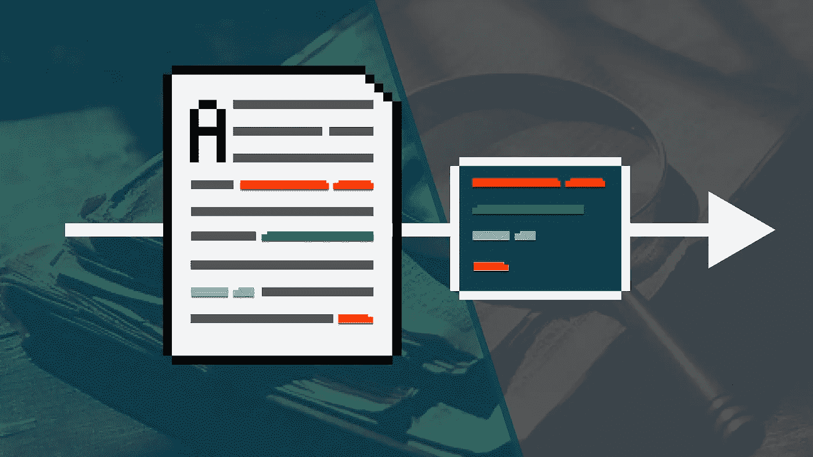
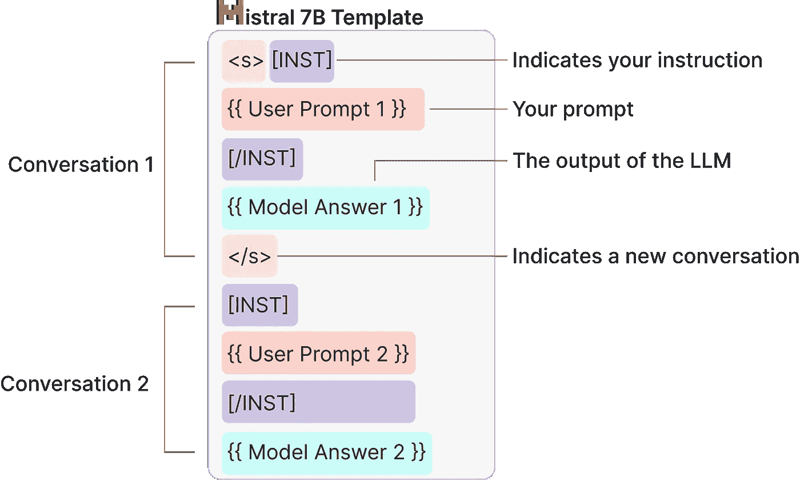
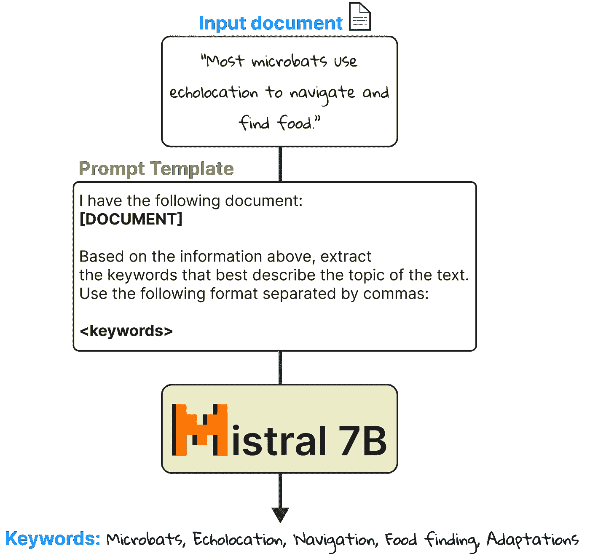
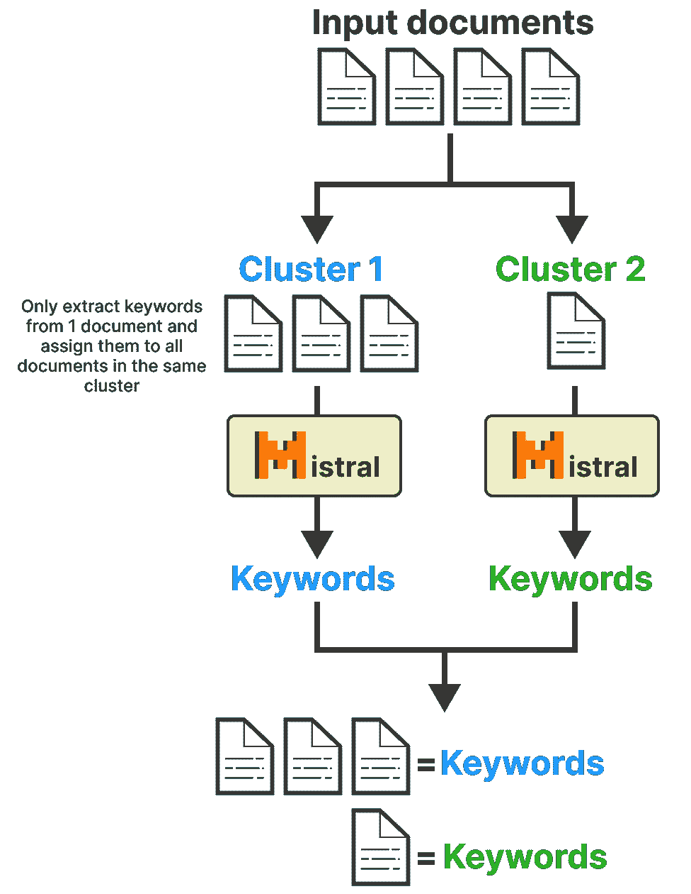
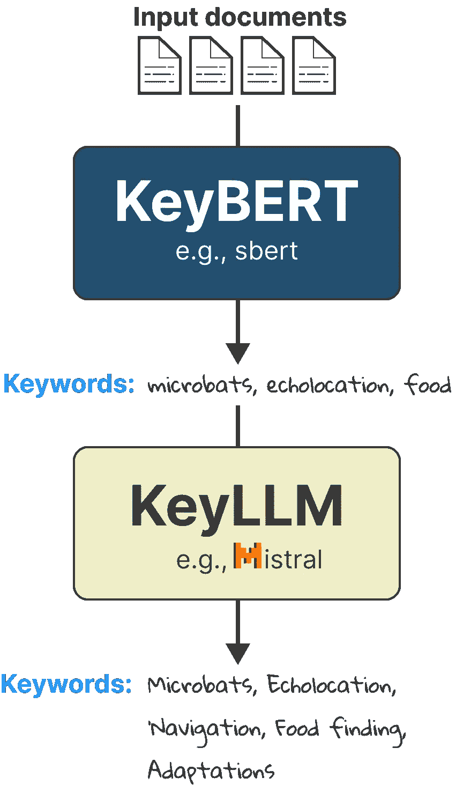

# 介绍 KeyLLM — 使用 LLM 进行关键词提取

> 原文：[`towardsdatascience.com/introducing-keyllm-keyword-extraction-with-llms-39924b504813`](https://towardsdatascience.com/introducing-keyllm-keyword-extraction-with-llms-39924b504813)

## 使用 KeyLLM、KeyBERT 和 Mistral 7B 来提取关键词

[](https://medium.com/@maartengrootendorst?source=post_page-----39924b504813--------------------------------)[](https://towardsdatascience.com/?source=post_page-----39924b504813--------------------------------) [Maarten Grootendorst](https://medium.com/@maartengrootendorst?source=post_page-----39924b504813--------------------------------)

·发表于[Towards Data Science](https://towardsdatascience.com/?source=post_page-----39924b504813--------------------------------) ·阅读时间 9 分钟·2023 年 10 月 5 日

--



大型语言模型（LLMs）变得越来越小、快速且高效。直到我开始考虑它们用于迭代任务，如关键词提取。

在创建了[KeyBERT](https://github.com/MaartenGr/KeyBERT)之后，我觉得是时候扩展该包以包括 LLMs 了。它们非常强大，我希望为将来这些模型可以在更小的 GPU 上运行做好准备。

介绍`[KeyLLM](https://maartengr.github.io/KeyBERT/guides/keyllm.html)`，这是 KeyBERT 的一个扩展，允许你使用任何 LLM 来提取、创建甚至微调关键词！

在本教程中，我们将通过使用最近发布的 Mistral 7B 模型的`[KeyLLM](https://maartengr.github.io/KeyBERT/guides/keyllm.html)`进行关键词提取。

我们将从安装一系列在本示例中将要使用的包开始：

```py
pip install --upgrade git+https://github.com/UKPLab/sentence-transformers
pip install keybert ctransformers[cuda]
pip install --upgrade git+https://github.com/huggingface/transformers
```

我们正在从主分支安装`sentence-transformers`，因为它修复了社区检测的功能，我们将在最后几个用例中使用。我们对`transformers`也做了同样的处理，因为它尚不支持 Mistral 架构。

你也可以跟随[**Google Colab Notebook**](https://colab.research.google.com/drive/1A1lbPnBhtxL9jR7vFcm7Z0F0aJdEl-zj?usp=sharing)以确保一切按预期工作。

# 🤖 加载模型

在之前的教程中，我们展示了如何对原始模型的权重进行量化，以便在不遇到内存问题的情况下运行。

在过去几个月里，[TheBloke](https://huggingface.co/TheBloke)为我们辛勤工作，对数百个模型进行了量化。

这样，我们可以直接下载模型，这将大大加快速度。

我们将从加载模型本身开始。我们将把 50 层卸载到 GPU 上。这将减少 RAM 使用量，而使用 VRAM。如果你遇到内存错误，减少这个参数（`gpu_layers`）可能会有所帮助！

```py
from ctransformers import AutoModelForCausalLM

# Set gpu_layers to the number of layers to offload to GPU. 
# Set to 0 if no GPU acceleration is available on your system.
model = AutoModelForCausalLM.from_pretrained(
    "TheBloke/Mistral-7B-Instruct-v0.1-GGUF",
    model_file="mistral-7b-instruct-v0.1.Q4_K_M.gguf",
    model_type="mistral",
    gpu_layers=50,
    hf=True
)
```

在加载了模型本身后，我们想创建一个🤗 Transformers 管道。

这样做的主要好处是，这些管道在许多教程中都有出现，通常作为后台在软件包中使用。到目前为止，`ctransformers`的原生支持程度还没有`transformers`那么高。

由于 Mistral 的分词器相对较新，尚无法使用`ctransformers`加载。因此，我们使用原始仓库中的分词器。

```py
from transformers import AutoTokenizer, pipeline

# Tokenizer
tokenizer = AutoTokenizer.from_pretrained("mistralai/Mistral-7B-Instruct-v0.1")

# Pipeline
generator = pipeline(
    model=model, tokenizer=tokenizer,
    task='text-generation',
    max_new_tokens=50,
    repetition_penalty=1.1
)
```

# 📄 提示工程

让我们用一个非常基础的示例来看看这是否有效：

```py
>>> response = generator("What is 1+1?")
>>> print(response[0]["generated_text"])
"""
What is 1+1?
A: 2
"""
```

完美！它可以处理一个非常基本的问题。为了关键词提取的目的，让我们探索一下它是否能处理更多的复杂性。

```py
prompt = """
I have the following document:
* The website mentions that it only takes a couple of days to deliver but I still have not received mine

Extract 5 keywords from that document.
"""
response = generator(prompt)
print(response[0]["generated_text"])
```

我们得到如下输出：

```py
"""
I have the following document:
* The website mentions that it only takes a couple of days to deliver but I still have not received mine

Extract 5 keywords from that document.

**Answer:**
1\. Website
2\. Mentions
3\. Deliver
4\. Couple
5\. Days
"""
```

它表现得非常好！然而，如果我们希望输出的结构在输入文本不同的情况下保持一致，我们需要给 LLM 一个示例。

这就是更高级提示工程的用武之地。与大多数大型语言模型一样，Mistral 7B 期望特定的提示格式。当我们想展示“正确”交互的样子时，这非常有帮助。

提示模板如下：



基于该模板，让我们创建一个关键词提取的模板。

它需要有两个组件：

+   `Example prompt` - 这将用于向 LLM 展示“良好”输出的样子

+   `Keyword prompt` - 这将用于请求 LLM 提取关键词

第一个组件，`example_prompt`，将仅仅是一个正确提取关键词的示例，符合我们感兴趣的格式。

**格式**是一个关键组件，因为它确保 LLM 始终以我们希望的方式输出关键词：

```py
example_prompt = """
<s>[INST]
I have the following document:
- The website mentions that it only takes a couple of days to deliver but I still have not received mine.

Please give me the keywords that are present in this document and separate them with commas.
Make sure you to only return the keywords and say nothing else. For example, don't say:
"Here are the keywords present in the document"
[/INST] meat, beef, eat, eating, emissions, steak, food, health, processed, chicken</s>"""
```

第二个组件，`keyword_prompt`，实际上是`example_prompt`的重复，只不过有两个变化：

+   它还不会有输出。那将由 LLM 生成。

+   我们使用`KeyBERT`的**[DOCUMENT]**标签来指示输入文档的位置。

我们可以使用**[DOCUMENT]**将文档插入到您选择的位置。这个选项有助于我们在需要时更改提示的结构，而不必将提示设置在特定位置。

```py
keyword_prompt = """
[INST]
I have the following document:
- [DOCUMENT]

Please give me the keywords that are present in this document and separate them with commas.
Make sure you to only return the keywords and say nothing else. For example, don't say:
"Here are the keywords present in the document"
[/INST]
"""
```

最后，我们将两个提示合并以创建我们的最终模板：

```py
>>> prompt = example_prompt + keyword_prompt
>>> print(prompt)
"""
<s>[INST]
I have the following document:
- The website mentions that it only takes a couple of days to deliver but I still have not received mine.

Please give me the keywords that are present in this document and separate them with commas.
Make sure you to only return the keywords and say nothing else. For example, don't say: 
"Here are the keywords present in the document"
[/INST] meat, beef, eat, eating, emissions, steak, food, health, processed, chicken</s>
[INST]

I have the following document:
- [DOCUMENT]

Please give me the keywords that are present in this document and separate them with commas.
Make sure you to only return the keywords and say nothing else. For example, don't say: 
"Here are the keywords present in the document"
[/INST]
"""
```

现在我们有了最终的提示模板，我们可以开始探索`KeyBERT`与`KeyLLM`的一些有趣的新功能。我们将首先探索仅使用 Mistral 的 7B 模型的`KeyLLM`

# 🗝️ 使用`KeyLLM`进行关键词提取

使用原生`KeyLLM`进行关键词提取是极其简单的；我们只需让它从文档中提取关键词即可。



通过 LLM 从文档中提取关键词的想法很简单，可以轻松测试你的 LLM 及其功能。

使用`KeyLLM`很简单，我们首先通过`keybert.llm.TextGeneration`加载我们的 LLM，并给它之前创建的提示模板。

🔥 **提示** 🔥：如果你想使用不同的 LLM，如 ChatGPT，你可以在[这里](https://maartengr.github.io/KeyBERT/guides/llms.html)查看已实现算法的完整概述。

```py
from keybert.llm import TextGeneration
from keybert import KeyLLM

# Load it in KeyLLM
llm = TextGeneration(generator, prompt=prompt)
kw_model = KeyLLM(llm)
```

在准备好我们的`KeyLLM`实例后，只需对你的文档运行`.extract_keywords`即可：

```py
documents = [
"The website mentions that it only takes a couple of days to deliver but I still have not received mine.",
"I received my package!",
"Whereas the most powerful LLMs have generally been accessible only through limited APIs (if at all), Meta released LLaMA's model weights to the research community under a noncommercial license."
]

keywords = kw_model.extract_keywords(documents)
```

我们得到以下关键词：

```py
[['deliver',
    'days',
    'website',
    'mention',
    'couple',
    'still',
    'receive',
    'mine'],
    ['package', 'received'],
    ['LLM',
    'API',
    'accessibility',
    'release',
    'license',
    'research',
    'community',
    'model',
    'weights',
    'Meta']]
```

这些关键词看起来很棒！

你可以调整提示以指定你想提取的关键词类型，它们可以有多长，甚至在 LLM 是多语言的情况下返回哪种语言。

# 🚀 使用`KeyLLM`进行高效关键词提取

对成千上万的文档进行 LLM 迭代并不是最有效的方法！相反，我们可以利用嵌入模型使关键词提取更高效。

这个过程如下。首先，我们将所有文档嵌入并转换为数值表示。其次，我们找出哪些文档彼此最相似。我们假设高度相似的文档将具有相同的关键词，因此不需要为所有文档提取关键词。第三，我们只从每个簇中的一个文档中提取关键词，并将这些关键词分配给同一簇中的所有文档。

这更高效，而且相当灵活。簇是纯粹基于文档之间的相似性生成的，而不考虑簇结构。换句话说，它本质上是在寻找我们预期具有相同关键词集合的近重复文档。



要使用`KeyLLM`实现这一点，我们提前嵌入文档并将它们传递给`.extract_keywords`。阈值指示文档需要多相似才能分配到同一个簇。

将此值增加到像.95 这样的数字将识别近乎相同的文档，而将其设置为像.5 这样的值将识别关于相同主题的文档。

```py
from keybert import KeyLLM
from sentence_transformers import SentenceTransformer

# Extract embeddings
model = SentenceTransformer('BAAI/bge-small-en-v1.5')
embeddings = model.encode(documents, convert_to_tensor=True)

# Load it in KeyLLM
kw_model = KeyLLM(llm)

# Extract keywords
keywords = kw_model.extract_keywords(
    documents, 
    embeddings=embeddings, 
    threshold=.5
)
```

我们得到以下关键词：

```py
>>> keywords
[['deliver',
    'days',
    'website',
    'mention',
    'couple',
    'still',
    'receive',
    'mine'],
    ['deliver',
    'days',
    'website',
    'mention',
    'couple',
    'still',
    'receive',
    'mine'],
    ['LLaMA',
    'model',
    'weights',
    'release',
    'noncommercial',
    'license',
    'research',
    'community',
    'powerful',
    'LLMs',
    'APIs']]
```

在这个例子中，我们可以看到前两个文档被聚类在一起并获得了相同的关键词。我们只传递两个文档，而不是传递所有三个文档。如果你有成千上万的文档，这可以显著加快速度。

# 🏆 使用`KeyBERT`和`KeyLLM`进行高效关键词提取

之前，我们手动将嵌入传递给`KeyLLM`以进行零-shot 关键词提取。我们可以通过利用`KeyBERT`进一步扩展这个例子。

由于`KeyBERT`生成关键词并嵌入文档，我们可以利用这一点不仅简化流程，还可以向 LLM 建议一些关键词。

这些建议的关键字可以帮助 LLM 决定使用哪些关键字。此外，这允许`KeyBERT`中的所有内容与`KeyLLM`一起使用！



这种高效的关键字提取方法，使用`KeyBERT`和`KeyLLM`只需要三行代码！我们创建了一个 KeyBERT 模型，并将之前创建的嵌入模型分配给 LLM：

```py
from keybert import KeyLLM, KeyBERT

# Load it in KeyLLM
kw_model = KeyBERT(llm=llm, model='BAAI/bge-small-en-v1.5')

# Extract keywords
keywords = kw_model.extract_keywords(documents, threshold=0.5)
```

我们得到以下关键字：

```py
>>> keywords
[['deliver',
  'days',
  'website',
  'mention',
  'couple',
  'still',
  'receive',
  'mine'],
 ['deliver',
  'days',
  'website',
  'mention',
  'couple',
  'still',
  'receive',
  'mine'],
 ['LLaMA',
  'model',
  'weights',
  'release',
  'license',
  'research',
  'community',
  'powerful',
  'LLMs',
  'APIs',
  'accessibility']]
```

就这样！使用`KeyLLM`，你可以利用大型语言模型来帮助创建更好的关键字。我们可以选择从文本本身提取关键字，或者让 LLM 提出关键字。

通过将`KeyLLM`与`KeyBERT`结合使用，我们可以通过一些计算和建议来增加其潜力。

**更新**：我在 YouTube 上上传了一个视频版本，更深入地讲解了如何使用 KeyLLM：

# 感谢阅读！

如果你和我一样，对 AI 和/或心理学充满热情，请随时在[**LinkedIn**](https://www.linkedin.com/in/mgrootendorst/)上添加我，在[**Twitter**](https://twitter.com/MaartenGr)上关注我，或者订阅我的[**Newsletter**](http://maartengrootendorst.substack.com/)。你还可以在我的[**个人网站**](https://maartengrootendorst.com/)上找到一些我的内容。

*所有没有来源信用的图像都是作者创建的——也就是说，所有图像都是我自己制作的 ;)*
