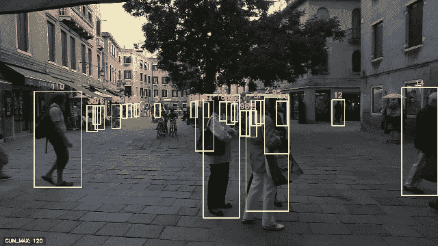

# 介绍 PeekingDuck 计算机视觉

> 原文：[`towardsdatascience.com/introducing-peekingduck-for-computer-vision-8b0105591559?source=collection_archive---------17-----------------------#2023-01-03`](https://towardsdatascience.com/introducing-peekingduck-for-computer-vision-8b0105591559?source=collection_archive---------17-----------------------#2023-01-03)

## 开源的最先进计算机视觉模型，代码行数极少

[](https://medium.com/@natsunoyuki?source=post_page-----8b0105591559--------------------------------)[](https://towardsdatascience.com/?source=post_page-----8b0105591559--------------------------------) [Y. Natsume](https://medium.com/@natsunoyuki?source=post_page-----8b0105591559--------------------------------)

·

[关注](https://medium.com/m/signin?actionUrl=https%3A%2F%2Fmedium.com%2F_%2Fsubscribe%2Fuser%2Fdab037034ffe&operation=register&redirect=https%3A%2F%2Ftowardsdatascience.com%2Fintroducing-peekingduck-for-computer-vision-8b0105591559&user=Y.+Natsume&userId=dab037034ffe&source=post_page-dab037034ffe----8b0105591559---------------------post_header-----------) 发表在 [Towards Data Science](https://towardsdatascience.com/?source=post_page-----8b0105591559--------------------------------) ·4 min read·2023 年 1 月 3 日[](https://medium.com/m/signin?actionUrl=https%3A%2F%2Fmedium.com%2F_%2Fvote%2Ftowards-data-science%2F8b0105591559&operation=register&redirect=https%3A%2F%2Ftowardsdatascience.com%2Fintroducing-peekingduck-for-computer-vision-8b0105591559&user=Y.+Natsume&userId=dab037034ffe&source=-----8b0105591559---------------------clap_footer-----------)

--

[](https://medium.com/m/signin?actionUrl=https%3A%2F%2Fmedium.com%2F_%2Fbookmark%2Fp%2F8b0105591559&operation=register&redirect=https%3A%2F%2Ftowardsdatascience.com%2Fintroducing-peekingduck-for-computer-vision-8b0105591559&source=-----8b0105591559---------------------bookmark_footer-----------)

图片由 [Vlad Tchompalov](https://unsplash.com/@tchompalov?utm_source=unsplash&utm_medium=referral&utm_content=creditCopyText) 提供，来源于 [Unsplash](https://unsplash.com/photos/wt5Y8VY_0bA?utm_source=unsplash&utm_medium=referral&utm_content=creditCopyText)。

# 介绍

计算机视觉项目可能非常令人畏惧，涉及各种工具和软件包，如 [OpenCV](https://opencv.org)、[TensorFlow](https://www.tensorflow.org) 和 [PyTorch](https://pytorch.org/vision/stable/index.html) 等。除了需要熟悉所涉及的工具和 API，还需要正确组合各种软件包，以便整个计算机视觉管道能够正常工作。

例如，OpenCV 处理`[H, W, C]`格式的 BGR 通道图像，而 TensorFlow 处理相同格式但使用 RGB 通道的图像，PyTorch 处理`[C, H, W]`格式的 RGB 通道图像。由于这种不一致性，图像格式必须在不同库之间传递时不断修改。像这样的许多问题（以及其他问题！）会导致大量冗余代码，我们希望避免这种情况。

如果我们可以通过一个统一的管道来简化计算机视觉管道，那将会怎样呢？

1.  开源且没有如 GPL-3.0 之类的限制，以减少成本。

1.  模块化以适应各种用例。

1.  采用最先进的技术以实现最大性能。

1.  最小化以减少管道复杂性。

事实证明，所有这些问题在一定程度上都通过 [PeekingDuck](https://github.com/aisingapore/PeekingDuck) 得到解决，这是 [AI Singapore](https://github.com/aisingapore) 最近发布的一个计算机视觉软件包！

# PeekingDuck

PeekingDuck 是一个计算机视觉框架，其特点是：

1.  开源（Apache 2.0）— 无费用或限制。

1.  模块化 — 混合搭配各种模块以解决不同的用例。

1.  最先进的计算机视觉推理 — 强大的深度学习模型。

1.  最小 — 实际上无需 Python 代码！

通过 pip 等包管理器安装 PeekingDuck 作为 Python 包后，可以直接从命令行/终端使用该包，便于与其他应用程序的直接集成。

## 安装 PeekingDuck

PeekingDuck 作为一个 Python 包进行安装：

```py
pip install peekingduck
```

# 节点 — PeekingDuck 的基本构建块

使用 PeekingDuck，计算机视觉管道是通过基本构建块称为节点来构建的。每个节点处理不同的操作，通过混合不同的节点可以创建不同的管道。到目前为止，PeekingDuck 具有 6 种不同类型的节点：

1.  输入 — 从实时摄像头或视频/图像文件中将图像数据输入到管道中。

1.  增强 — 预处理图像数据。

1.  模型 — 执行计算机视觉任务，如对象检测或姿态估计。

1.  涉猎 — 后处理模型输出。

1.  绘制 — 可视化模型输出，例如边界框。

1.  输出 — 将模型输出保存到磁盘。

# 人员跟踪管道

使用 PeekingDuck 很简单！在本节中，我们将演示如何使用 PeekingDuck 创建一个人员跟踪管道！

## 初始化 PeekingDuck

第一步是在指定目录（在此案例中为`person_tracking/`）中初始化 PeekingDuck。

```py
mkdir person_tracking
cd person_tracking
peekingduck init
```

这将会在 `person_tracking/` 下创建一个名为 `pipeline_config.yml` 的配置文件以及一些其他源代码文件。为了让 PeekingDuck 按我们希望的方式运行，我们必须修改 `pipeline_config.yml`。

在我们的例子中，`pipeline_config.yml` 应包含以下行：

```py
nodes:
- input.visual:
    source: venice-2-train.mp4
- model.jde
- dabble.statistics:
    maximum: obj_attrs["ids"]
- draw.bbox
- draw.tag:
    show: ["ids"]
- draw.legend:
    show: ["cum_max"]
- output.media_writer:               
    output_dir: output/
```

我们为此任务使用以下 `nodes`：

1.  `input.visual` — 指定加载图像数据的文件。我们使用的是一个由 [MOT15 数据集的 Venice-2 图像](https://motchallenge.net/data/MOT15/) 拼接而成的视频。

1.  `model.jde` — 指定要使用的模型。对于人物跟踪，我们使用 [Joint Detection and Embedding (JDE)](https://github.com/Zhongdao/Towards-Realtime-MOT) 模型。

1.  `dabble.statistics` — 根据模型的输出进行统计计算。在这种情况下，我们计算每帧检测到的最大 ID 数量。

1.  `draw.bbox` — 在每帧上绘制检测到的边界框。

1.  `draw.tag` — 为每个边界框绘制相应的标签。

1.  `draw.legend` — 绘制累计检测到的最大数量。

1.  `output.media_writer` — 将模型的预测结果输出到磁盘。

通过混合和匹配不同的节点，我们可以构建不同的管道来解决不同的计算机视觉应用场景。详细的节点列表可以在 [PeekingDuck 的网站](https://peekingduck.readthedocs.io/en/stable/nodes/input.html) 上找到。

## 准备数据

下一步是准备数据。在我们的例子中，我们使用 OpenCV 将 [MOT15 数据集的 Venice-2 图像](https://motchallenge.net/data/MOT15/) 拼接成一个名为 `venice-2-train.mp4` 的视频文件，帧率为 `30`，分辨率为 `[1920, 1080]`。

```py
import cv2
import os

w = cv2.VideoWriter("venice-2-train.mp4", 
                    cv2.VideoWriter_fourcc(*"MP4V"), 
                    30, [1920, 1080])

files = sorted(os.listdir("MOT15/train/Venice-2/img1"))

for f in files:
    im = cv2.imread(os.path.join("MOT15/train/Venice-2/img1", f))
    w.write(im)

w.release()
```

## 运行 PeekingDuck

在初始化了 PeekingDuck 和数据之后，剩下的就是从命令行运行管道：

```py
peekingduck run
```

管道的输出将保存在 `output/` 下，如 `pipeline_config.yml` 中所指定，可以以视频或 `.gif` 图像的形式进行可视化。检测到的边界框已覆盖到每个跟踪人员上，并标注了每个相应的跟踪 ID。累计的最大跟踪 ID 数量也显示在每帧的左下角。



PeekingDuck 人物跟踪输出。图形由作者创建。原始图像是来自 [MOT15 数据集的 Venice-2 图像](https://motchallenge.net/data/MOT15/)。

请注意，除了准备数据外，我们在使用 PeekingDuck 进行人物跟踪时没有编写一行 Python 代码！

# 结论

计算机视觉已经取得了长足进展，我们现在可以使用许多出色的包，如 PeekingDuck。PeekingDuck 提供了开源的、模块化的最先进的计算机视觉模型，代码量最少，使得任何人都可以相对轻松地进行计算机视觉项目！

# 参考文献

1.  [`peekingduck.readthedocs.io/en/stable/master.html`](https://peekingduck.readthedocs.io/en/stable/master.html)

1.  [`motchallenge.net/data/MOT15/`](https://motchallenge.net/data/MOT15/)

1.  [`github.com/Zhongdao/Towards-Realtime-MOT`](https://github.com/Zhongdao/Towards-Realtime-MOT)
