# 介绍 PyCircular：一个用于圆形数据分析的 Python 库

> 原文：[`towardsdatascience.com/introducing-pycircular-a-python-library-for-circular-data-analysis-bfd696a6a42b?source=collection_archive---------1-----------------------#2023-01-24`](https://towardsdatascience.com/introducing-pycircular-a-python-library-for-circular-data-analysis-bfd696a6a42b?source=collection_archive---------1-----------------------#2023-01-24)

## 圆形数据在分析和建模时可能会面临独特的挑战

[](https://medium.com/@albahnsen?source=post_page-----bfd696a6a42b--------------------------------)[](https://towardsdatascience.com/?source=post_page-----bfd696a6a42b--------------------------------) [Alejandro Correa Bahnsen](https://medium.com/@albahnsen?source=post_page-----bfd696a6a42b--------------------------------)

·

[关注](https://medium.com/m/signin?actionUrl=https%3A%2F%2Fmedium.com%2F_%2Fsubscribe%2Fuser%2F90c9efb3cf7e&operation=register&redirect=https%3A%2F%2Ftowardsdatascience.com%2Fintroducing-pycircular-a-python-library-for-circular-data-analysis-bfd696a6a42b&user=Alejandro+Correa+Bahnsen&userId=90c9efb3cf7e&source=post_page-90c9efb3cf7e----bfd696a6a42b---------------------post_header-----------) 发表在 [数据科学的未来](https://towardsdatascience.com/?source=post_page-----bfd696a6a42b--------------------------------) ·8 分钟阅读·2023 年 1 月 24 日[](https://medium.com/m/signin?actionUrl=https%3A%2F%2Fmedium.com%2F_%2Fvote%2Ftowards-data-science%2Fbfd696a6a42b&operation=register&redirect=https%3A%2F%2Ftowardsdatascience.com%2Fintroducing-pycircular-a-python-library-for-circular-data-analysis-bfd696a6a42b&user=Alejandro+Correa+Bahnsen&userId=90c9efb3cf7e&source=-----bfd696a6a42b---------------------clap_footer-----------)

--

[](https://medium.com/m/signin?actionUrl=https%3A%2F%2Fmedium.com%2F_%2Fbookmark%2Fp%2Fbfd696a6a42b&operation=register&redirect=https%3A%2F%2Ftowardsdatascience.com%2Fintroducing-pycircular-a-python-library-for-circular-data-analysis-bfd696a6a42b&source=-----bfd696a6a42b---------------------bookmark_footer-----------)

图片由 [Patrick McManaman](https://unsplash.com/@patmcmanaman?utm_source=medium&utm_medium=referral) 提供，发布在 [Unsplash](https://unsplash.com/?utm_source=medium&utm_medium=referral)

在这篇文章中，我介绍了**PyCircular**，一个专门用于圆形数据分析的 Python 库。作为其中一位作者，我很高兴与大家分享这个强大的工具，以帮助解决处理圆形数据时面临的挑战。

圆形数据，如表示角度、方向或时间戳的数据，在分析和建模时可能会带来独特的挑战。圆形数据的特性可能会导致在应用传统的线性和基于核的方法时遇到困难，因为这些方法不适合处理圆形数据的周期性特征。此外，计算均值和标准差时也可能出现问题，因为这些度量对圆形数据并不适用。

**PyCircular** 通过提供一组专门针对圆形数据的工具和功能来解决这些挑战。该库包括各种圆形统计方法，如分布、核函数和置信区间。此外，它还包括可视化工具，如圆形直方图和分布图，以帮助你更好地理解数据。


[**https://github.com/albahnsen/pycircular**](https://github.com/albahnsen/pycircular)

本文的剩余部分将深入探讨处理圆形数据的独特挑战，并展示如何通过一系列示例使用 **PyCircular** 来应对这些挑战。你将看到 **PyCircular** 如何有效处理圆形数据的周期性特征，并计算有意义的集中趋势和离散度量。你还将学习如何利用库的可视化工具来更好地理解和解释圆形数据。通过阅读本文，你将对如何有效地使用 **PyCircular** 来分析和建模圆形数据有一个扎实的了解。

在训练机器学习模型时，我们必须拥有一个包含输入变量（特征）和相应输出变量（标签）的数据集。模型学习将特征映射到标签上，训练的目标是找到最佳的映射参数集。

在一些应用中，模型的特征包括用户、事务、登录等的描述信息。在这些场景中，大多数都有时间戳信息，可能是事件时间、星期几或月中的某一天。如果目标是根据过去的事件预测未来事件，你可以使用时间戳作为特征。例如，你可以将一天中的时间、星期几或一年中的月份作为特征，来预测交通量或能源消耗。

然而，处理机器学习问题中的时间的最佳方法将取决于你试图解决的具体问题和数据的结构。

让我们看看如何使用 **PyCircular** 来分析这种复杂行为。

首先，让我们安装库并加载一些示例合成数据。

```py
!pip install pycircular
```

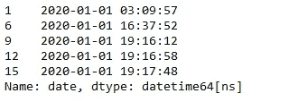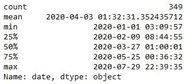

使用来自 load_transactions 的数据集，我们可以看到从 2020 年 1 月 1 日到 2020 年 7 月 29 日共有 349 个观察（交易）。

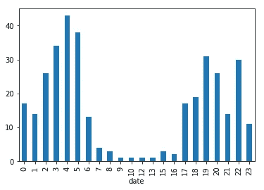

作者提供的图片

然后，绘制每次观察时间的直方图，我们看到大多数例子发生在下午 5 点到早上 7 点之间，中午发生的例子很少。此外，当将一天中的小时视为标量变量时，可能会出现一些问题。

+   一个问题是一天中的小时具有周期性，这意味着一天结束时的值（24:00）与一天开始时的值（00:00）相关。然而，当一天中的小时被视为标量变量时，这种周期性关系未被考虑，这可能导致不准确或误导性的结果。

+   另一个问题是一天中的小时往往与其他变量相关联，如星期几或季节。例如，工作日的高峰时段可能比周末更拥堵。然而，当一天中的小时被视为标量变量时，这些相关性未被考虑，可能导致偏见或误导性结果。

+   第三个问题是一天中的小时可能会受到季节、星期几或节假日等不同因素的影响。这些因素可能会对一天中的小时的行为和模式产生重大影响。因此，如果在使用一天中的小时作为标量变量时未考虑这些信息，可能会导致不准确的结论。

为了克服这些问题，一种解决方案是使用周期编码技术，如正弦和余弦编码，以融入数据的周期性特征。另一种解决方案是将其他相关变量（如星期几或季节）包括在模型中，以考虑潜在的相关性。此外，在分析数据时，考虑影响一天中的小时的不同因素也很重要。

对于我们的例子，首先通过使用圆形直方图来更好地理解我们的数据集。

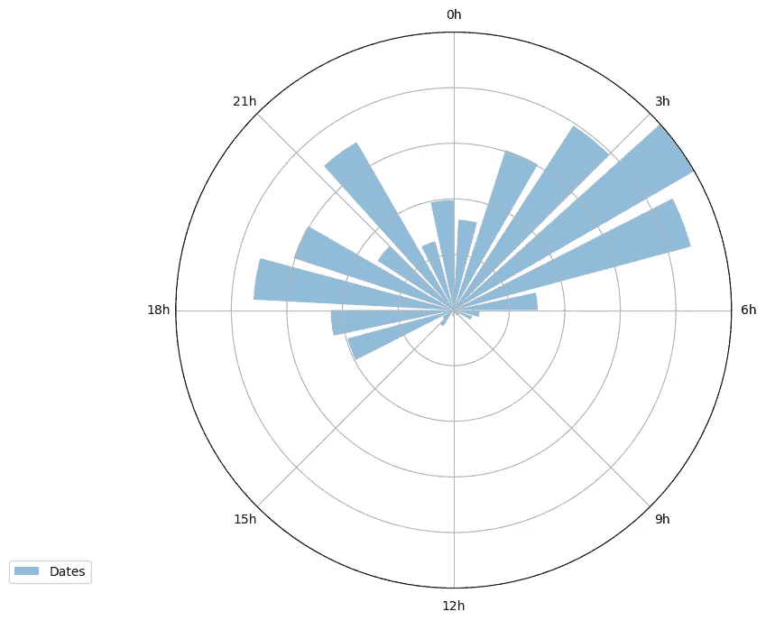

作者提供的图片

然后，计算标量或算术均值

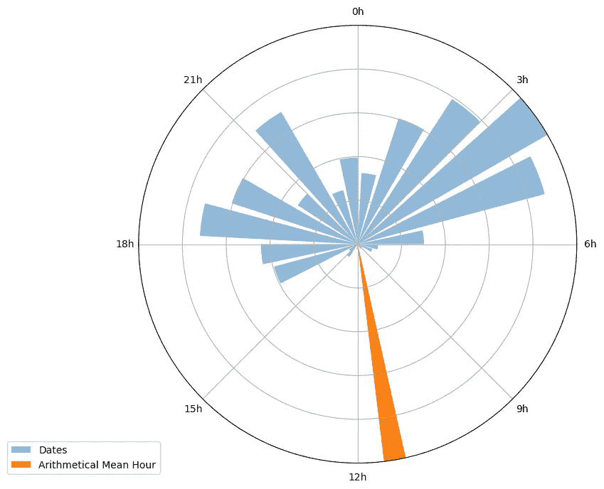

作者提供的图片

处理示例时间时，特别是分析如时间均值这样的特征时，一个问题是很容易犯下使用算术均值的错误。确实，算术均值不是平均时间的正确方法，因为如上图所示，它未考虑时间特征的周期性行为。例如，四个交易时间分别为 2:00、3:00、22:00 和 23:00 的算术均值是 12:30，这与实际情况不符，因为没有交易发生在那个时间附近。

我们可以通过将交易时间建模为周期变量来克服这一限制，特别是使用 von Mises 分布（Fisher, 1996）。von Mises 分布，也称为周期正态分布，是一种围绕圆周的包裹正态分布变量的分布。von Mises 分布的一个示例集（D）定义为：


其中

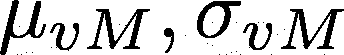

是周期均值和周期标准差。在这篇[论文](https://albahnsen.github.io/files/Feature%20Engineering%20Strategies%20for%20Credit%20Card%20Fraud%20Detection_published.pdf)中，我们展示了它们的计算。

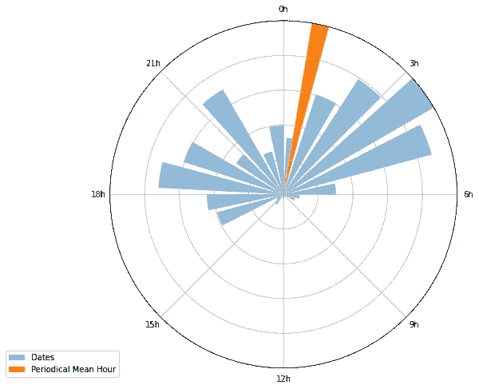

图像由作者提供

现在，计算了周期均值和标准差后，我们可以估计 von Mises 分布。

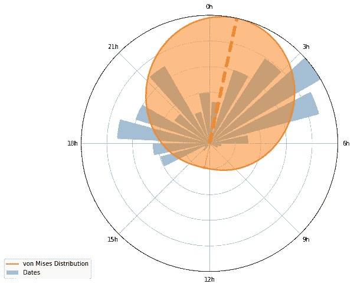

图像由作者提供

这种方法为事件时间的分布提供了良好的近似。然而，当使用仅有一个模式的统计分布时，如果分布与数据集不匹配，可能会很难准确建模。此外，如果数据集是多模态的（即有多个峰值），单一模式的分布将无法捕捉数据中的所有变化。这可能导致基于模型的预测或推断不准确。

通过使用 von Mises 核分布对数据进行建模可以克服这一问题。

克服使用仅有一个模式的统计分布问题的一种方法是使用基于核的方法，如核密度估计（KDE）。

KDE 是一种用于估计随机变量概率密度函数的非参数方法。它通过用平滑且对称的核函数（如 von Mises）替换每个数据点的点质量来工作。结果的 PDF 估计是以每个数据点为中心的核函数的总和。

通过使用核函数，KDE 可以平滑出任何单模态分布，并捕捉数据中的多个模式，使其成为建模多模态数据集的更灵活的方法。此外，核密度估计是非参数的，这意味着它不对数据的潜在分布做任何假设。

然而，值得注意的是，选择合适的核函数很重要，且在使用 KDE 时存在一些挑战，如带宽选择和维度诅咒。

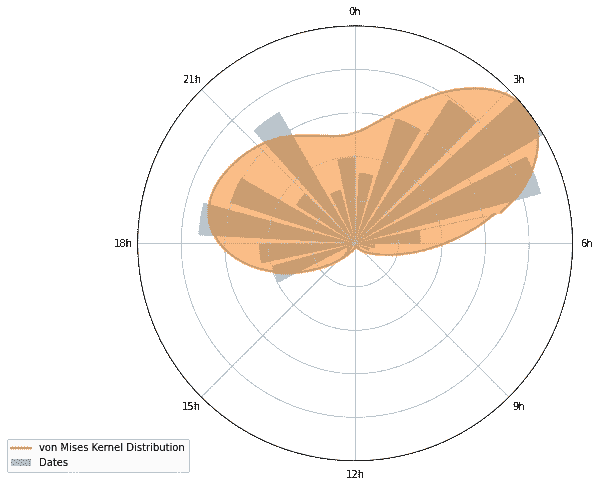

图像由作者提供

总结而言，使用像 KDE 这样的基于核的方法与 von Mises 结合，可以通过允许对多模态数据集进行更灵活和稳健的建模，帮助克服使用仅有一个模式的统计分布的问题。

# 使用核函数创建新特征

最后，我们可以将核应用于新的观察值，并创建一个可以作为机器学习模型输入的新特征。

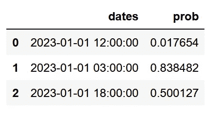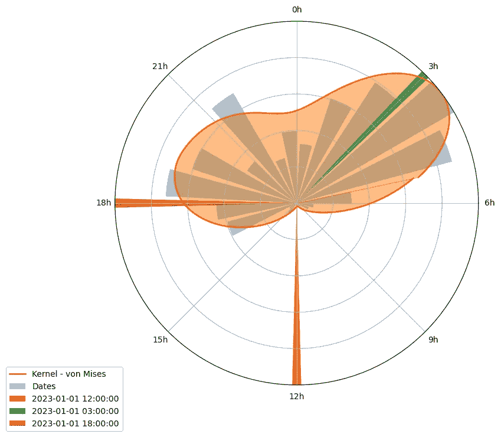

图片来源于作者

我们可以看到，在中午的观察值概率非常低（0.017），因为在训练核时，该时间没有任何观察值。

总之，这种方法使我们能够通过创建数据中时间信息的更强健的表示来有效处理时间戳。通过在特征工程中使用 von Mises 核，我们可以生成准确捕捉数据中时间模式细微差别的新特征。这种方法可以克服将日期视为标量变量的局限性，并提升机器学习模型的性能。

# 下一步

+   带宽参数（bw）的选择对于模型的性能至关重要，pycircular 库提供了一系列优化方法来为给定的数据集选择最佳的 bw。

+   要评估核的有效性，重要的是要进行准确性测试并与其他方法的结果进行比较。

+   虽然一天中的时间是一个重要的时间特征，但还需要调查其他时间变量如星期几和月份的天数如何影响模型的性能。

+   核可以用于机器学习模型，它可以作为特征工程过程的一部分进行集成，并应用于输入数据，以创建更好地捕捉数据中时间模式的新特征。

我将在后续的帖子中展示如何处理这些问题。

了解更多关于**PyCircular**的信息，请访问[`github.com/albahnsen/pycircular`](https://github.com/albahnsen/pycircular)

+   文档可以在[`albahnsen.github.io/pycircular`](http://albahnsen.github.io/pycircular)找到

+   教程可以在[`albahnsen.github.io/pycircular/Tutorials.html`](http://albahnsen.github.io/pycircular/Tutorials.html)找到
