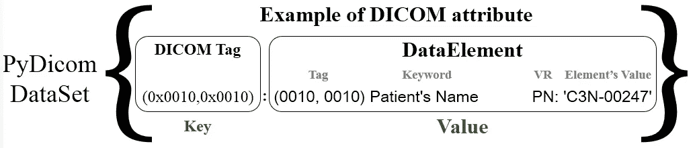

# 介绍 PyDicom 及其类、方法和属性

> 原文：[`towardsdatascience.com/introducing-pydicom-its-classes-methods-and-attributes-518c1d71162?source=collection_archive---------4-----------------------#2023-01-04`](https://towardsdatascience.com/introducing-pydicom-its-classes-methods-and-attributes-518c1d71162?source=collection_archive---------4-----------------------#2023-01-04)

## PyDicom……超越像素数据

[](https://medium.com/@omar.ok1998?source=post_page-----518c1d71162--------------------------------)[](https://towardsdatascience.com/?source=post_page-----518c1d71162--------------------------------) [Omar Alkousa](https://medium.com/@omar.ok1998?source=post_page-----518c1d71162--------------------------------)

·

[关注](https://medium.com/m/signin?actionUrl=https%3A%2F%2Fmedium.com%2F_%2Fsubscribe%2Fuser%2Ff8302b9534b5&operation=register&redirect=https%3A%2F%2Ftowardsdatascience.com%2Fintroducing-pydicom-its-classes-methods-and-attributes-518c1d71162&user=Omar+Alkousa&userId=f8302b9534b5&source=post_page-f8302b9534b5----518c1d71162---------------------post_header-----------) 发布于 [Towards Data Science](https://towardsdatascience.com/?source=post_page-----518c1d71162--------------------------------) ·12 分钟阅读·2023 年 1 月 4 日[](https://medium.com/m/signin?actionUrl=https%3A%2F%2Fmedium.com%2F_%2Fvote%2Ftowards-data-science%2F518c1d71162&operation=register&redirect=https%3A%2F%2Ftowardsdatascience.com%2Fintroducing-pydicom-its-classes-methods-and-attributes-518c1d71162&user=Omar+Alkousa&userId=f8302b9534b5&source=-----518c1d71162---------------------clap_footer-----------)

--

[](https://medium.com/m/signin?actionUrl=https%3A%2F%2Fmedium.com%2F_%2Fbookmark%2Fp%2F518c1d71162&operation=register&redirect=https%3A%2F%2Ftowardsdatascience.com%2Fintroducing-pydicom-its-classes-methods-and-attributes-518c1d71162&source=-----518c1d71162---------------------bookmark_footer-----------)

如果你是 Python 爱好者，并且正在处理医疗数据，特别是 DICOM 数据，你可能已经听说过很棒的 Python 包 PyDicom。在这篇文章中，你将学习这个包的基础知识。我们将讨论 PyDicom 的类（DataSet、DataElement、Sequence）以及一些你可以应用于 PyDicom 类的有用方法和属性。


照片由 [Owen Beard](https://unsplash.com/@owenbeard?utm_source=medium&utm_medium=referral) 提供，来自 [Unsplash](https://unsplash.com/?utm_source=medium&utm_medium=referral)

PyDicom 是一个用于处理 DICOM 文件（如医学图像、报告和放射治疗对象）的纯 Python 包。PyDicom 使读取和写入这些复杂文件变得简单，转换为自然的 Python 结构以便于操作。

> DICOM（医学数字成像和通信）是医学成像系统的标准语言。当你听到“DICOM”这个词时，你可能会认为它只是医学图像。但 **医疗数据科学家/分析师** 可能会将其视为任何其他 **医学数据集** 的宝贵财富。因为它不仅仅是像素数据。DICOM 文件包含许多与患者、成像模态等相关的有用数据。

处理 DICOM 元数据并访问特定属性对任何人（包括数据科学家/分析师）在处理 DICOM 文件时都是有益的。幸运的是，PyDicom 提供了许多有用的函数、方法和属性来处理 DICOM 文件。

> 感谢 PyDicom 的创建者和贡献者

# 让我们开始编码

当我想探索一个新的 Python 包时，我通常会从使用该包的一般示例开始，然后逐渐深入。我的主要目的是学习如何提取多个 DICOM 文件的元数据，并将其转换为我可以用于分析和探索的数据集。

所以……让我们从一个常见的 PyDicom 示例开始我们的旅程。

## **我们将讨论以下内容：**

> ***读取 DICOM 文件的示例***
> 
> ***PyDicom 的核心元素***
> 
> ***PyDicom 数据集***
> 
> ***PyDicom 数据集的 * .keys()** 方法
> 
> **.values()** 方法
> 
> **.elements()** 方法
> 
> **.group_dataset()** 方法
> 
> **.dir()** 方法
> 
> ***PyDicom 数据集的属性* pixel_array** 属性
> 
> ***PyDicom 数据元素***
> 
> ***PyDicom 序列***
> 
> ***PyDicom 与 ImageIO***

## 读取 DICOM 文件的示例

要使用 pydicom 读取 DICOM 文件，你可以按照以下步骤操作：

+   安装 pydicom：要使用 pydicom，你需要通过 pip 安装它。

```py
# Install PyDicom Package
!pip install pydicom
```

```py
Looking in indexes: https://pypi.org/simple, https://us-python.pkg.dev/colab-wheels/public/simple/
Collecting pydicom
  Downloading pydicom-2.3.1-py3-none-any.whl (2.0 MB)
     |████████████████████████████████| 2.0 MB 5.4 MB/s 
Installing collected packages: pydicom
Successfully installed pydicom-2.3.1
```

+   导入 pydicom 库：在你的 Python 脚本中，你需要导入 pydicom 库以便使用它。

```py
# Import the pacakage
import pydicom
```

网上有很多 DICOM 样本。你也可以使用你自己的 DICOM 文件。在这篇文章中，我选择了一个 [数据集](https://www.kaggle.com/datasets/dmisky/dlwptvolumetricdicomlung)，包含一个患者的 99 切片胸部 CT 扫描。你可以在 Kaggle 上找到它。我将数据集保存到了我的 [Drive](https://drive.google.com/drive/folders/1dbJpXVUBn0mSUxgJIqKZj4d_0thSeTW3?usp=sharing) 中，以便通过 GoogleColab 轻松访问。

> **注意：** 有时，某些代码行的输出可能会过长和庞大。对此提前表示歉意！！！但这是一个很好的机会，让你感受一下 DICOM 文件在现实生活中的样子。

+   读取 DICOM 文件：要读取 DICOM 文件，你可以使用 **dcmread** 函数，它返回一个包含 DICOM 文件数据的 Dataset 对象。

```py
# Reading a DICOM file from a specific path
dcm_data = pydicom.dcmread('/content/drive/MyDrive/Datasets/Kaggle/DICOM/dicom_lung/000000.dcm')
dcm_data
```


完整输出已作为 GitHub gist 添加，详细内容请参阅这个[链接](https://gist.github.com/OmarAlkousa/53b35934cd3fac3d381f0448b8e27073)。 [作者提供的图片]

很明显，除了像素数据之外，还有很多 DICOM 元数据。但我们可以看到输出的模式，即 DICOM 属性是逐行写入的。每一行都有一个唯一的标签和其他核心的 DICOM 属性元素。让我们更详细地讨论它们。

# PyDicom 中的核心元素

使用 **.dcmread()** 会封装一个 DataSet，即一个字典数据结构 {}。这个 DataSet 包含如下表示的键和值：

+   ***Keys:*** 包含你正在读取的 DICOM 文件中指定的属性的 DICOM 标签。示例键包括：

    - (0x0010, 0x0010) PatientName 属性。

    - (0x0028, 0x0010) 行数属性。

    - (0x7fe0, 0x0010) PixelData 属性。

    标签的数字由两个**十六进制**数字组成，第一个数字表示组，第二个数字表示特定元素。因此，你可能会发现许多属性具有相同的第一个标签数字。

+   ***Values:*** 这个字典的值通常包含以下内容：

    - **Tag:** 元素的标签，例如 (0028, 0030)。

    - **Keyword:** 描述属性所指的内容。标签 (0028, 0030) 的关键字是“Pixel Spacing”。

    **VR:** 这仅是两个字符，指的是元素的值表示（Value Representation），它描述了属性值的数据类型和格式。标签 (0028, 0030) 的 VR 是“DS”，即十进制字符串。你可以通过 Python 结构查看任何标签的 VR 以及它是如何表示的，详细信息请参考[**链接**](https://pydicom.github.io/pydicom/stable/guides/element_value_types.html)。

    **Value:** 元素的实际值。它可以是整数、字符串、列表，甚至是**Sequence**，即一个属性的数据集。标签 (0028, 0030) 的值是一个包含两个浮点数的列表，分别表示沿行和列的物理距离（单位为毫米）。这个列表的一个示例是 [0.564453125, 0.564453125]。


dcmread() 函数的输出。[作者提供的图片]

现在我们理解了使用 PyDicom 读取 DICOM 文件需要直接操作主要类 DataSet。让我们更深入地讨论一下 DataSet 的内容。

# PyDicom DataSet

DICOM DataSet 是 DICOM DataElements 的可变映射。DICOM DataSet 中的每个 DataElement，即字典中的值，都有一个唯一的标签，即字典的键，用于标识它。例如，“PatientName” 属性对应于 DICOM 标准中的标签 (0x0010, 0x0010)，它标识了病人的名字数据元素。



PyDicom DataSet 类的内容。[作者提供的图片]

你可以通过多种方式访问特定的 DICOM 属性，例如：

```py
# Extract the patient's name.
patient_name = dcm_data.PatientName
patient_name
```

```py
'C3N-00247'
```

或者你可以通过唯一标签访问相同的属性 PatientName。例如，PatientName 属性的标签是 (0010, 0010)。***注意***这些数字是十六进制的，符合 DICOM 标准。

```py
# Extract the patient's name using its unique DICOM tag (0010, 0010)
dcm_data[0x0010, 0x0010]
```

```py
(0010, 0010) Patient's Name                      PN: 'C3N-00247'
```

注意，使用标签，即数据集字典的键，会返回字典的整个值，而不仅仅是属性的实际值。要仅获取实际值，你应该使用 .value 属性。

```py
# Extract the patient's name using its unique DICOM tag (0010, 0010)
dcm_data[0x0010, 0x0010].value
```

```py
'C3N-00247'
```

你可以决定是通过唯一标签提取特定属性，还是通过其关键词提取。现在让我们深入了解一下我们可以与 DataSet 类一起使用的一些有用的方法和属性。

# PyDicom DataSet 的方法

## .keys() 方法

使用**.keys()** 返回 DataSet 字典的键列表。当合并具有共同 DICOM 属性的多个 DICOM 文件的元数据时，这种方法可能会很有用。

```py
# Extract the keys, the DICOM tags, that are in a DICOM file
dcm_data.keys()
```


.keys() 方法的输出。 [图片由作者提供]

## .values() 方法

这种方法返回 DataSet 字典的值列表。这种形式有点笨重，不太适合阅读。但在某些情况下，这种方法可能对迭代值列表很有用。

```py
# Extract the values, the DICOM attributes, that are in a DICOM file
dcm_data.values()
```


.values() 方法的部分输出。 [图片由作者提供]

## .elements() 方法

使用 .elements() 方法可以获得 DataSet 的顶级元素。当你不需要 DICOM 文件中可能存在的 Sequences 的 DICOM 属性时，这个方法会很有用。注意下面输出图中 .elements() 方法使用时 Sequences 的表示方式。

```py
# Extract the top-level elements of the Dataset Class
[*dcm_data.elements()]
```


.elements() 方法的完整输出已作为 GitHub gist 添加，查看 [链接](https://gist.github.com/OmarAlkousa/03ce85834bdfbb0e65bda9a7989f5e3d)。 [图片由作者提供]

## .group_dataset() 方法

如上所述，你可能会发现许多属性的第一个数字相同。这些标签，具有共同的第一个标签，通常描述一个共同的参数。例如，具有共同第一个标签 (0x0010) 的属性通常与病人相关。第一个标签为 (0x0028) 的属性描述**图像像素**属性。有时查看与特定参数相关的所有属性会很有帮助。使用方法 (.group_dataset) 返回一个仅包含某个组元素的 DataSet。

```py
# Extract the attributes related to 0x0028 tag, these are related to ImagePixel
dcm_data.group_dataset(0x0028)
```

```py
(0028, 0002) Samples per Pixel                   US: 1
(0028, 0004) Photometric Interpretation          CS: 'MONOCHROME2'
(0028, 0010) Rows                                US: 512
(0028, 0011) Columns                             US: 512
(0028, 0030) Pixel Spacing                       DS: [0.564453125, 0.564453125]
(0028, 0100) Bits Allocated                      US: 16
(0028, 0101) Bits Stored                         US: 12
(0028, 0102) High Bit                            US: 11
(0028, 0103) Pixel Representation                US: 0
(0028, 0106) Smallest Image Pixel Value          US: 0
(0028, 0107) Largest Image Pixel Value           US: 4095
(0028, 0303) Longitudinal Temporal Information M CS: 'MODIFIED'
(0028, 1050) Window Center                       DS: [-500, 40]
(0028, 1051) Window Width                        DS: [1500, 400]
(0028, 1052) Rescale Intercept                   DS: '-1024.0'
(0028, 1053) Rescale Slope                       DS: '1.0'
(0028, 1055) Window Center & Width Explanation   LO: ['WINDOW1', 'WINDOW2']
```

## .dir() 方法

返回 DataSet 中元素关键词的字母顺序列表。这是对你处理的元数据提供初步了解的好选择。

```py
# An alphabetical list of the element keywords in the DICOM DataSet.
dcm_data.dir()
```

```py
['AccessionNumber', 'AcquisitionDate', 'AcquisitionNumber', 'AcquisitionTime',
 'BitsAllocated', 'BitsStored', 'BodyPartExamined', 'CTDIvol',
 'ClinicalTrialTimePointDescription', 'ClinicalTrialTimePointID', 'Columns',
 'ContentDate', 'ContentTime', 'ConvolutionKernel', 'DataCollectionDiameter',
 'DateOfLastCalibration', 'DeidentificationMethod', 'DeidentificationMethodCodeSequence',
 'DistanceSourceToDetector', 'DistanceSourceToPatient', 'EstimatedDoseSaving',
 'EthnicGroup', 'Exposure', 'ExposureModulationType', 'ExposureTime',
 'FilterType', 'FocalSpots', 'FrameOfReferenceUID', 'GantryDetectorTilt',
 'GeneratorPower', 'HighBit', 'ImageComments', 'ImageOrientationPatient',
 'ImagePositionPatient', 'ImageType', 'InstanceNumber', 'KVP', 'LargestImagePixelValue',
 'LongitudinalTemporalInformationModified', 'Manufacturer', 'ManufacturerModelName',
 'Modality', 'PatientAge', 'PatientBirthDate', 'PatientID', 'PatientIdentityRemoved',
 'PatientName', 'PatientPosition', 'PatientSex', 'PerformedProcedureStepStartDate',
 'PerformedProcedureStepStartTime', 'PhotometricInterpretation', 'PixelData',
 'PixelRepresentation', 'PixelSpacing', 'PositionReferenceIndicator', 'ProtocolName',
 'ReasonForStudy', 'ReconstructionDiameter', 'ReferencedImageSequence',
 'ReferencedStudySequence', 'ReferringPhysicianName', 'RequestedProcedureDescription',
 'RescaleIntercept', 'RescaleSlope', 'RotationDirection', 'Rows', 'SOPClassUID',
 'SOPInstanceUID', 'SamplesPerPixel', 'SeriesDate', 'SeriesDescription',
 'SeriesInstanceUID', 'SeriesNumber', 'SeriesTime', 'SingleCollimationWidth',
 'SliceLocation', 'SliceThickness', 'SmallestImagePixelValue', 'SoftwareVersions',
 'SourceImageSequence', 'SpecificCharacterSet', 'SpiralPitchFactor', 'StudyComments',
 'StudyDate', 'StudyDescription', 'StudyID', 'StudyInstanceUID', 'StudyPriorityID',
 'StudyStatusID', 'StudyTime', 'TableFeedPerRotation', 'TableHeight', 'TableSpeed',
 'TimeOfLastCalibration', 'TotalCollimationWidth', 'WindowCenter', 'WindowCenterWidthExplanation',
 'WindowWidth', 'XRayTubeCurrent']
```

特定属性集的过滤器可以作为参数实现到 .dir() 方法中。

```py
# Extract all the attributes that have "Pixel" in its keywords
dcm_data.dir('Pixel')
```

```py
['LargestImagePixelValue',
 'PixelData',
 'PixelRepresentation',
 'PixelSpacing',
 'SamplesPerPixel',
 'SmallestImagePixelValue']
```

# PyDicom DataSet 的属性

有一些属性可以与 DataSet 类一起使用。但我只会指出一个，最重要和最常用的属性，即**pixel_array**。

```py
# Extract the image pixels
dcm_data.pixel_array
```

```py
array([[356, 244, 201, ..., 190, 224,  76],
       [309, 387, 370, ..., 122,  17,   6],
       [334, 476, 486, ...,  29,  46,  47],
       ...,
       [ 98, 188, 186, ..., 156,  86, 125],
       [ 66, 138, 139, ..., 221,  74,  81],
       [168, 173, 100, ..., 188, 135, 147]], dtype=uint16)
```

```py
# Image representation
im = dcm_data.pixel_array

plt.imshow(im, cmap='gray')
plt.axis('off')
plt.title('Axial Slice of a Chest-CT')
plt.show()
```


[作者提供的图片]

# PyDicom DataElement

正如我们上面提到的，DataSet 是一个 PyDicom 类，包含一组 DICOM 标签作为键，值作为 DICOM DataElements。DataElements 是在读取 DICOM 文件时可能会发现的属性值或元数据。能够访问特定信息对于你的工作或研究非常有用，而无需在如此庞大的文本数据中搜索。你可以使用属性在特定 DataElement 中访问特定信息。


PyDicom DataElement 类的内容及访问特定信息的方法。[作者提供的图片]

```py
# Return the element's keyword (if known) as str
kwrds = dcm_data[0x0010, 0x0010].keyword

# Return the DICOM dictionary name for the element as str
name = dcm_data[0x0010, 0x0010].name

# Return the element's Value Representation
vr = dcm_data[0x0010, 0x0010].VR

# Return the element's value.
value = dcm_data[0x0010, 0x0010].value

print("The element's Keyword              : ", kwrds)
print("The element's name                 : ", name)
print("The element's Value Representation : ", vr)
print("The element's value                : ", value)
```

```py
The element's Keyword              :  PatientName
The element's name                 :  Patient's Name
The element's Value Representation :  PN
The element's value                :  C3N-00247
```

# PyDicom 序列

PyDicom DataSet 中的 DataElement 可能包含字符串、整数、列表，甚至是数据序列。该序列源自 Python 的列表，但它甚至可以是一个 DataSet。让我们看看如何访问特定序列中的参数。由于我们正在处理的文件信息量庞大，让我们使用 .dir(*filter) 方法。通过合适的过滤器参数，我们可以提取“序列”的名称。

```py
# Extract all the attributes that have "Sequence" in its keywords
dcm_data.dir('Sequence')
```

```py
['DeidentificationMethodCodeSequence',
 'ReferencedImageSequence',
 'ReferencedStudySequence',
 'SourceImageSequence']
```

让我们尝试使用去标识化方法代码序列。

```py
# Return a specific Sequence, "DeidentificationMethodCodeSequence"
dcm_data.DeidentificationMethodCodeSequence
```

```py
<Sequence, length 8>
```

要打印出序列中的所有元素，我们可以使用索引。

```py
# Extract the contents of a Sequence
dcm_data.DeidentificationMethodCodeSequence[:]
```

```py
[(0008, 0100) Code Value                          SH: '113100'
 (0008, 0102) Coding Scheme Designator            SH: 'DCM'
 (0008, 0104) Code Meaning                        LO: 'Basic Application Confidentiality Profile',
 (0008, 0100) Code Value                          SH: '113101'
 (0008, 0102) Coding Scheme Designator            SH: 'DCM'
 (0008, 0104) Code Meaning                        LO: 'Clean Pixel Data Option',
 (0008, 0100) Code Value                          SH: '113104'
 (0008, 0102) Coding Scheme Designator            SH: 'DCM'
 (0008, 0104) Code Meaning                        LO: 'Clean Structured Content Option',
 (0008, 0100) Code Value                          SH: '113105'
 (0008, 0102) Coding Scheme Designator            SH: 'DCM'
 (0008, 0104) Code Meaning                        LO: 'Clean Descriptors Option',
 (0008, 0100) Code Value                          SH: '113107'
 (0008, 0102) Coding Scheme Designator            SH: 'DCM'
 (0008, 0104) Code Meaning                        LO: 'Retain Longitudinal Temporal Information Modified Dates Option',
 (0008, 0100) Code Value                          SH: '113108'
 (0008, 0102) Coding Scheme Designator            SH: 'DCM'
 (0008, 0104) Code Meaning                        LO: 'Retain Patient Characteristics Option',
 (0008, 0100) Code Value                          SH: '113109'
 (0008, 0102) Coding Scheme Designator            SH: 'DCM'
 (0008, 0104) Code Meaning                        LO: 'Retain Device Identity Option',
 (0008, 0100) Code Value                          SH: '113111'
 (0008, 0102) Coding Scheme Designator            SH: 'DCM'
 (0008, 0104) Code Meaning                        LO: 'Retain Safe Private Option']
```

要访问序列中的特定信息，我们可以使用其索引。

```py
# Return the info of specific line in a Sequence
dcm_data.DeidentificationMethodCodeSequence[0].CodeMeaning
```

```py
'Basic Application Confidentiality Profile'
```

# ***PyDicom 与 ImageIO***

个人观点，我发现 PyDicom 是处理 DICOM 文件的最佳包。因为它专为 DICOM 设计，这一点很明显。它为程序员提供了更灵活的选项，特别是当用户想处理 DICOM 元数据而不仅仅是像素数据时。然而，另一方面，如果我只需要像素数据，我会更倾向于使用 ImageIO，因为它只提供处理像素数据所需的基本元数据。要了解更多关于如何使用 ImageIO 处理 DICOM 文件的信息，请查看这篇文章。

[](/dealing-with-dicom-using-imageio-python-package-117f1212ab82?source=post_page-----518c1d71162--------------------------------) ## 使用 ImageIO Python 包处理 DICOM

### 医学图像 == DICOM

towardsdatascience.com

# 结论：

+   PyDicom DataSet 是该包的主类，用户将直接处理它。

+   DataSet 是一个 Python 字典结构，包含 DICOM 标签作为键，DICOM 属性作为值。

+   我们介绍了如何使用 PyDicom 提供的一些重要方法和属性来处理 DataSet 类。

+   DataSet 的值基本上是一个 DataElement，另一个 PyDicom 类，它包含 DICOM 标签、关键字、VR 和每个 DICOM 属性的值。

***感谢阅读…***

# 推荐

+   欲了解更多关于 ***DICOM*** 的信息，请参阅这篇文章

[](https://medium.com/@omar.ok1998/what-is-dicom-a28c5fe24c9d?source=post_page-----518c1d71162--------------------------------) [## 什么是 DICOM？

### 目前用于临床护理的 DICOM 图像数量多达数十亿！

[medium.com](https://medium.com/@omar.ok1998/what-is-dicom-a28c5fe24c9d?source=post_page-----518c1d71162--------------------------------)

+   ***DICOM 元数据——大数据分析的有用资源：***

    这篇 [文章](https://healthmanagement.org/c/healthmanagement/issuearticle/dicom-metadata-a-useful-resource-for-big-data-analytics) 概述了通过结合患者访问和 DICOM 信息来表示数据的新方法，医学影像元数据的高级使用，辐射剂量分析和图像分割，以及用于特征工程的深度学习，以丰富数据。

+   ***PyDicom 文档：*** 我们仅仅触及了这个优秀包的表面，它的文档非常详尽。如果你想了解更多关于 PyDicom 的内容，请参考这个 [链接](https://pydicom.github.io/pydicom/stable/index.html) 并尝试编写你在其中阅读到的代码。

# 参考文献

[1] PyDicom 文档， [**用户指南**](https://pydicom.github.io/pydicom/stable/old/pydicom_user_guide.html)， [访问日期：2022 年 12 月 25 日]

[2] PyDicom 文档， [**元素 VR 和 Python 类型**](https://pydicom.github.io/pydicom/stable/guides/element_value_types.html)， [访问日期：2022 年 12 月 25 日]

[3] PyDicom 文档，[**API 参考**](https://pydicom.github.io/pydicom/stable/reference/index.html)， [访问日期：2022 年 12 月 25 日]
